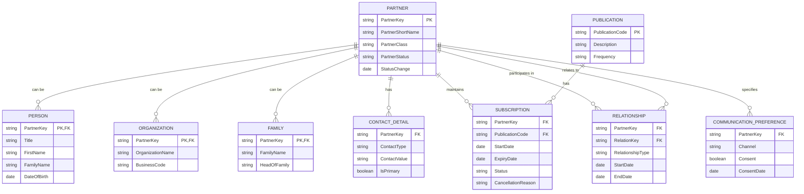
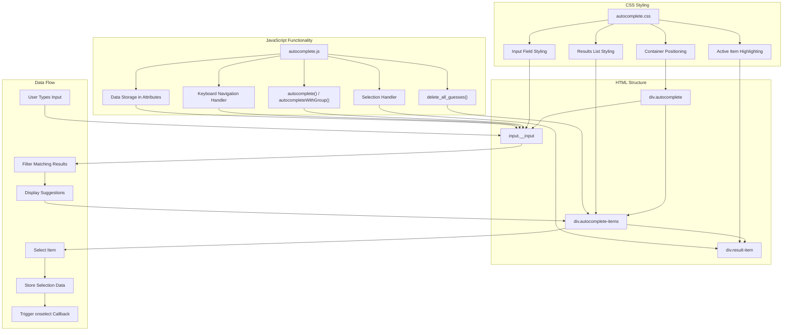
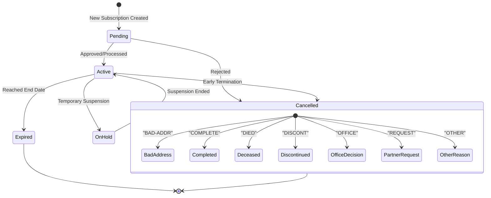
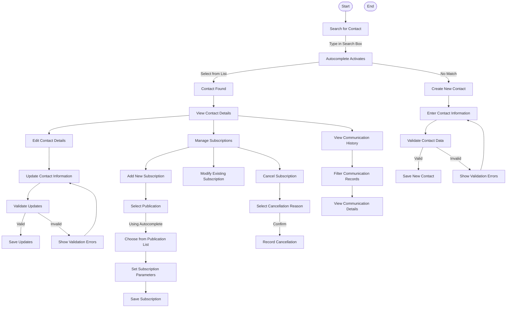

# CRM Functions in OpenPetra

## Contact Management Fundamentals

OpenPetra's CRM system is built around a robust contact management foundation that serves the specific needs of nonprofit organizations. At its core, the system revolves around the concept of "partners" - a flexible entity that can represent individuals, organizations, families, or other groupings relevant to nonprofit operations. This partner-centric approach allows for comprehensive relationship tracking that goes beyond simple contact storage.

The system maintains detailed partner records with extensive attributes including contact information, relationship networks, communication preferences, and interaction history. What distinguishes OpenPetra's approach is its focus on relationship mapping - tracking how different partners connect to each other through various relationship types (such as family connections, organizational affiliations, donor relationships, etc.).

The contact management functionality is designed with nonprofit workflows in mind, supporting the full lifecycle of constituent relationships from initial acquisition through ongoing engagement. The system's data structure allows for tracking complex hierarchical relationships, such as organizational units, family structures, and field operations, which are particularly important for international nonprofit organizations.

A key strength of the contact management system is its integration with other OpenPetra modules, particularly the financial components that track donations, sponsorships, and other financial interactions. This integration ensures that relationship management is informed by the complete history of a partner's engagement with the organization.

## CRM Data Structure Relationships

The diagram illustrates the core data structure of OpenPetra's CRM system. The central entity is the PARTNER table, which serves as the foundation for all contact records. Partners can be specialized into different types (PERSON, ORGANIZATION, FAMILY) through a class-based inheritance model.

Each partner can have multiple CONTACT_DETAIL records (email addresses, phone numbers, physical addresses), COMMUNICATION_PREFERENCE settings that track consent and preferred channels, and SUBSCRIPTION records linking them to various PUBLICATION types.

The RELATIONSHIP table implements a many-to-many self-referential relationship between partners, allowing for complex relationship networks to be modeled. Each relationship has a type and optional start/end dates for temporal tracking.

The SUBSCRIPTION entity connects partners to publications with attributes tracking the lifecycle of the subscription, including start and expiry dates, current status, and cancellation reasons when applicable. This structure supports the comprehensive tracking of communication preferences and publication management that is essential for nonprofit constituent relationship management.

## Enhanced User Input Experience

OpenPetra's autocomplete functionality represents a significant enhancement to the user input experience, particularly in the context of CRM operations where users frequently need to search for and select from large sets of contact records. The implementation combines frontend styling with JavaScript functionality to create a responsive, user-friendly interface for data entry.

The autocomplete feature works by dynamically suggesting matching entries as users type in input fields, significantly reducing the cognitive load and time required to locate specific contacts or other entities. This is particularly valuable in nonprofit contexts where staff may need to quickly locate donor records, subscription information, or organizational relationships during interactions with constituents.

The implementation supports both simple key-value pairs and more complex object structures, allowing for rich metadata to be associated with each suggestion. This enables the system to present human-readable labels while preserving machine-readable keys and additional attributes that can be used programmatically once a selection is made.

Key usability features include keyboard navigation support (allowing users to move through suggestions using arrow keys), clear visual feedback for the currently selected item, and the ability to store and retrieve complex object data associated with selections. The system also prevents duplicate initialization of autocomplete fields, ensuring consistent performance across the application.

By reducing friction in the data entry process, the autocomplete functionality not only improves efficiency but also enhances data quality by reducing the likelihood of typographical errors or incorrect selections. This is particularly important in CRM contexts where data integrity directly impacts the organization's ability to maintain effective relationships with its constituents.

## Autocomplete Component Architecture

The autocomplete component in OpenPetra follows a modular architecture that separates concerns between structure, presentation, and behavior. The diagram illustrates how these components interact to create a seamless user experience.

The HTML structure consists of a container element (.autocomplete) that holds both the input field and the dynamically generated results list. The CSS layer provides styling that ensures proper positioning of the dropdown relative to the input field, visual feedback for interactive states, and z-index management to ensure the dropdown appears above other page elements.

The JavaScript functionality is the core of the component, providing two main initialization functions: `autocomplete()` for simple use cases and `autocompleteWithGroup()` for scenarios where suggestions are grouped. The code handles keyboard events (up/down arrows for navigation, Enter for selection), manages the display of matching suggestions, and stores selected values and metadata as attributes on the input field.

The data flow begins with user input, which triggers filtering of available options. Matching results are displayed in the dropdown, where users can select an item either by clicking or using keyboard navigation. Upon selection, the component stores both the display value in the input field and additional metadata (including keys and complex object data) as attributes, making this information available to other parts of the application. Finally, an optional callback function can be triggered to perform additional actions based on the selection.

This architecture provides a flexible foundation that can be used across different CRM contexts in OpenPetra, from contact searches to publication selection, while maintaining a consistent user experience.

## Communication Management

OpenPetra's communication management functionality provides nonprofit organizations with comprehensive tools to manage their outreach and engagement with constituents. The system is built around a publication-centric model that allows organizations to define different types of communications (newsletters, annual reports, updates, etc.) and track their distribution through a subscription management framework.

The publication system supports various communication types with different frequencies and delivery methods. For example, as seen in the demo data, organizations can define publications like annual reports sent to all supporters once a year, or quarterly updates distributed via multiple channels such as physical mail or email. This flexibility allows organizations to maintain diverse communication strategies tailored to different audience segments.

Each publication can be configured with attributes including description, frequency, and delivery methods, providing a structured approach to managing the organization's communication portfolio. This structured approach extends to the tracking of which constituents receive which publications, enabling targeted communication strategies that align with constituent preferences and organizational goals.

The communication management system integrates closely with contact data, allowing organizations to leverage demographic information, relationship history, and engagement patterns when determining communication strategies. This integration ensures that communications are relevant and appropriate for each recipient, enhancing the effectiveness of the organization's outreach efforts.

By providing a systematic approach to managing communications, OpenPetra helps nonprofit organizations maintain consistent and appropriate engagement with their constituents, supporting relationship-building efforts that are essential to their mission fulfillment and fundraising success.

## Subscription Lifecycle Management

OpenPetra implements a comprehensive subscription lifecycle management system that tracks the full journey of constituent subscriptions to organizational publications. This system enables nonprofits to maintain accurate records of who receives what communications, when they began receiving them, and—importantly—why they may have stopped.

The subscription lifecycle begins with creation, where a partner is linked to a specific publication with attributes including start date and status. The system supports various subscription states, allowing organizations to track active, pending, and expired subscriptions separately. This granular status tracking helps ensure that communications are only sent to appropriate recipients, reducing waste and improving targeting.

During the maintenance phase, subscriptions can be updated with new information such as changed delivery preferences, temporary holds, or extensions. The system maintains a history of these changes, providing a complete record of the subscription's evolution over time.

When subscriptions end, OpenPetra provides a structured approach to tracking cancellations through standardized reason codes. As seen in the `p_reason_subscription_cancelled.csv` file, the system includes predefined categories such as "BAD-ADDR" (returned mail due to incorrect address), "COMPLETE" (subscription naturally ended), "DIED" (partner deceased), "DISCONT" (publication discontinued), "OFFICE" (cancelled by the organization), and "REQUEST" (cancelled at partner's request). This standardization enables meaningful analysis of subscription patterns and attrition reasons.

The structured approach to subscription lifecycle management provides valuable data for strategic decision-making. Organizations can analyze patterns in subscription uptake, duration, and cancellation reasons to refine their communication strategies, identify potential issues with specific publications or delivery methods, and develop targeted interventions to improve retention.

By implementing this comprehensive tracking system, OpenPetra helps nonprofit organizations maintain clean, accurate subscription data while gathering insights that can inform more effective communication strategies.

## Subscription Status Workflow

The diagram illustrates the lifecycle of subscriptions within OpenPetra's CRM system. Subscriptions begin in a Pending state when initially created, typically following a request from a partner or a decision by the organization to include a partner in a publication's distribution.

Once processed, subscriptions move to an Active state, indicating that the partner should receive the publication according to its distribution schedule. During the active period, subscriptions can be temporarily suspended (OnHold) for various reasons such as a partner's temporary absence or delivery issues, with the ability to reactivate when appropriate.

Subscriptions can end through two primary paths: natural expiration when they reach their end date, or cancellation before the scheduled end date. The cancellation process is particularly detailed, with standardized reason codes that categorize the cause of termination:

1. **BadAddress**: The publication was returned because the partner is no longer at the recorded address
2. **Completed**: The subscription has naturally reached its end
3. **Deceased**: The partner has died
4. **Discontinued**: The publication itself is no longer being produced
5. **OfficeDecision**: The organization has decided to discontinue the subscription
6. **PartnerRequest**: The partner has specifically requested to stop receiving the publication
7. **OtherReason**: Miscellaneous or uncategorized reasons

This structured workflow enables organizations to maintain accurate records of subscription status while gathering valuable data about why subscriptions end. The standardized cancellation reasons support reporting and analysis that can inform communication strategies and publication management decisions.

## Contact Data Validation

OpenPetra implements robust validation mechanisms for contact data to ensure the integrity and usability of the CRM database. These validation processes operate at multiple levels, from field-level constraints to complex cross-field validations, helping organizations maintain high-quality contact information that supports effective communication and relationship management.

The system enforces data quality through required field validation, ensuring that essential contact information is captured during data entry. This includes basic identity information such as names for individuals or organization names for institutional contacts, as well as appropriate contact methods like postal addresses, email addresses, or phone numbers depending on the partner type and communication preferences.

Address validation is particularly sophisticated, with support for international address formats and postal code verification. The system can validate that addresses follow the expected structure for their respective countries, reducing the likelihood of delivery failures due to formatting errors or incomplete information. This is crucial for organizations that maintain international contact networks, as address formats and requirements vary significantly across regions.

The validation framework also includes specialized checks for communication-related data, such as email format validation and phone number structure verification. These checks help prevent common data entry errors that could lead to failed communications or incorrect contact information being stored in the system.

Beyond field-level validation, OpenPetra implements cross-field validation rules that ensure logical consistency in contact records. For example, the system can validate that communication preferences align with available contact methods (e.g., ensuring that partners who prefer email communication have valid email addresses on file).

The validation system is designed to provide immediate feedback during data entry, helping users correct errors before they enter the database. This proactive approach to data quality helps maintain the overall integrity of the CRM system, ensuring that contact data remains reliable for operational and analytical purposes.

## CRM Interface Design

OpenPetra's CRM interface design prioritizes usability and efficiency for nonprofit staff who may have varying levels of technical expertise. The interface architecture follows a task-oriented approach, organizing functions around common nonprofit workflows rather than system structures, making it more intuitive for users focused on relationship management tasks.

The design employs a consistent layout pattern across CRM functions, with navigation elements, search facilities, and action buttons positioned predictably throughout the interface. This consistency reduces the learning curve and cognitive load for users, allowing them to focus on their work rather than figuring out the interface.

Search and filtering capabilities are prominent throughout the CRM interface, acknowledging that nonprofit staff frequently need to locate specific contacts or groups of contacts based on various criteria. The implementation of autocomplete functionality, as seen in the examined code, exemplifies this focus on efficient data access, allowing users to quickly find contacts as they type partial names or identifiers.

The interface design also emphasizes data relationships, making it easy for users to navigate between related entities such as contacts, subscriptions, and communications. This relational navigation supports the holistic view of constituent relationships that is essential for effective nonprofit CRM.

Form design within the CRM modules follows best practices for data entry efficiency, with logical field grouping, clear labeling, and appropriate input controls for different data types. The system provides immediate validation feedback, helping users correct errors during data entry rather than discovering problems later.

Accessibility considerations are evident in the interface design, with support for keyboard navigation (as seen in the autocomplete implementation) and consistent visual cues that don't rely solely on color to convey information. These features make the system more usable for staff members with various abilities and preferences.

The overall design philosophy balances functionality with simplicity, providing powerful CRM capabilities without overwhelming users with complexity. This approach is particularly appropriate for nonprofit contexts, where staff may have limited time for training and need to accomplish relationship management tasks efficiently.

## CRM User Interaction Flow

This diagram illustrates typical user interaction flows within OpenPetra's CRM functions, focusing on contact management and subscription handling. The process begins with contact search, utilizing the autocomplete functionality to efficiently locate existing contacts or initiate the creation of new ones.

When searching for contacts, users type in a search box which activates the autocomplete component. This component, implemented through the JavaScript and CSS files examined earlier, provides dynamic suggestions as users type. Users can navigate these suggestions using keyboard controls or mouse clicks, selecting the appropriate contact when found. If no matching contact exists, they can proceed to create a new contact record.

For new contacts, the system guides users through entering contact information with built-in validation to ensure data quality. The validation framework checks for required fields, proper formatting, and logical consistency before allowing the contact to be saved. If validation errors occur, the system provides clear feedback, allowing users to correct issues before proceeding.

Once viewing a contact's details, users can perform various actions including editing contact information, managing subscriptions, or reviewing communication history. The subscription management flow is particularly noteworthy, supporting the addition of new subscriptions (with publication selection via autocomplete), modification of existing subscriptions, or cancellation with reason tracking.

When cancelling subscriptions, users select from standardized reason codes (as defined in the p_reason_subscription_cancelled.csv file), ensuring consistent categorization of cancellation causes for later analysis. This structured approach to tracking subscription lifecycle events supports better understanding of communication effectiveness and partner engagement patterns.

Throughout these interactions, the system maintains a consistent interface design with predictable navigation patterns, clear feedback on actions, and efficient data entry mechanisms like the autocomplete functionality. This thoughtful user experience design helps nonprofit staff manage constituent relationships effectively without unnecessary technical complexity.

[Generated by the Sage AI expert workbench: 2025-03-30 02:22:57  https://sage-tech.ai/workbench]: #