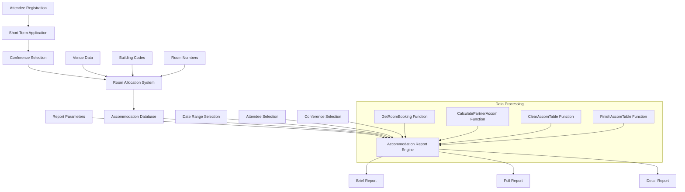
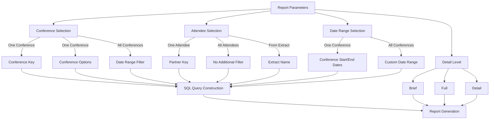
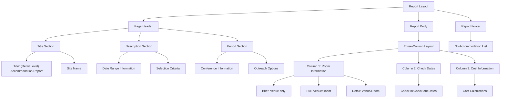
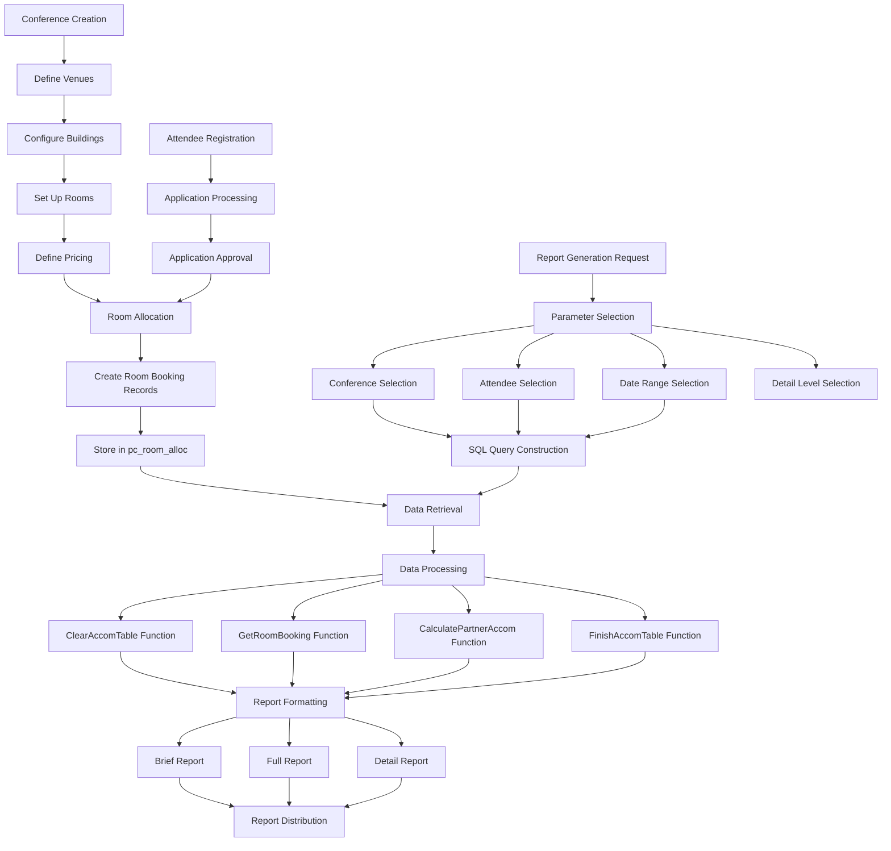

# Conference Accommodation Management in OpenPetra

## Overview of Conference Accommodation Management

OpenPetra's conference accommodation system provides organizations with a comprehensive solution for managing housing arrangements for conference attendees. The system is designed to handle various levels of detail and reporting capabilities, allowing conference organizers to efficiently track and manage accommodations across multiple venues, buildings, and rooms. The accommodation management functionality integrates seamlessly with the broader conference management features, providing a unified approach to handling attendee housing needs from registration through departure. The system supports different reporting views (Brief, Full, and Detail) to accommodate various administrative requirements, from high-level occupancy summaries to detailed room assignments with associated costs.

## Conference Accommodation Data Flow

*The diagram illustrates how OpenPetra's accommodation system processes data from initial attendee registration through to final reporting. The system integrates venue information, building codes, and room numbers with attendee data and conference selections. The accommodation report engine uses specialized functions to process this data according to user-selected parameters (date ranges, attendee selection criteria, and conference choices) to generate appropriate reports at different detail levels. The custom functions handle complex operations like calculating overlapping date ranges and formatting the final accommodation tables.*

## Accommodation Report Structure and Options

The OpenPetra accommodation reporting system offers three distinct levels of detail to meet different administrative needs:

1. **Brief Report**: Provides a high-level overview of accommodations, focusing primarily on venue information without detailed room assignments. This report is ideal for quick occupancy summaries and venue-level planning.

2. **Full Report**: Offers a more comprehensive view that includes both venue and room information, allowing administrators to see how attendees are distributed across specific rooms while maintaining a manageable level of detail.

3. **Detail Report**: Presents the most granular view of accommodations, including venue, room information, check-in/check-out dates, and associated costs. This report is designed for detailed financial tracking and comprehensive accommodation management.

Each report level uses the same underlying data but formats and filters it appropriately for the intended use case. The reports can be further customized through parameters such as date ranges, conference selection, and attendee filtering, allowing administrators to focus on specific subsets of accommodation data as needed.

## Room Booking and Allocation System

OpenPetra's room booking and allocation system maintains a comprehensive database of accommodation arrangements for conference attendees. The system tracks essential information including venue keys (identifying specific conference locations), building codes (differentiating between structures within a venue), and room numbers (specifying exact accommodations). Each room allocation record contains check-in (`pc_in_d`) and check-out dates, enabling the system to track occupancy over time.

The allocation system supports complex scenarios including:
- Multiple attendees sharing rooms
- Attendees changing rooms during a conference
- Different pricing structures based on room types or dates
- Accommodation spans that cross between conferences

The `pc_room_alloc` table serves as the central repository for this information, linking venue, building, and room data with specific attendee records and date ranges. The system uses specialized functions like `GetRoomBooking()` to retrieve and process this information based on specified parameters, ensuring that reports accurately reflect the current state of accommodations even when dealing with complex booking patterns or date overlaps.

## Accommodation Report Parameter Relationships

*This diagram illustrates the complex relationships between different parameters in the accommodation reporting system. The parameter selection process follows a hierarchical structure where each choice influences subsequent options and ultimately determines how the SQL queries are constructed. For example, selecting "One Conference" activates the conference key and options parameters while disabling the custom date range filter. Similarly, the attendee selection parameter determines whether the system filters by a specific partner key, includes all attendees, or uses a predefined extract. These parameter relationships ensure that the report engine generates appropriate SQL queries that correctly filter and format the accommodation data according to the user's specific reporting needs.*

## Date Range Processing for Accommodations

OpenPetra's accommodation system employs sophisticated date range processing to ensure accurate reporting of accommodations that span across selected date periods. The system handles three distinct date range scenarios:

1. **Accommodations that begin within the selected period**: Where an attendee's arrival date falls within the reporting period (`pm_arrival_d >= param_dtpFromDate AND pm_arrival_d <= param_dtpToDate`)

2. **Accommodations that end within the selected period**: Where an attendee's departure date falls within the reporting period (`pm_departure_d >= param_dtpFromDate AND pm_departure_d <= param_dtpToDate`)

3. **Accommodations that span the entire selected period**: Where an attendee's stay begins before and ends after the reporting period (`pm_arrival_d <= param_dtpFromDate AND pm_departure_d >= param_dtpToDate`)

This comprehensive approach ensures that all relevant accommodations are captured regardless of how they overlap with the selected date range. The system uses these date comparisons in SQL queries to filter accommodation records appropriately, and specialized functions like `CalculatePartnerAccom()` further process these date ranges to determine exactly which portions of a stay fall within the reporting period.

For conference-specific reports, the system can alternatively use the conference's start and end dates (`pc_start_d` and `pc_end_d`) as the bounding dates, simplifying reporting for single-conference scenarios while still maintaining accurate occupancy data.

## Attendee Selection and Filtering

The accommodation reporting system in OpenPetra provides multiple methods for selecting and filtering conference attendees, offering flexibility to meet various reporting needs:

1. **Individual Attendee Selection**: Administrators can generate accommodation reports for a single attendee by specifying a partner key (`param_partnerkey`). This option is useful for confirming individual arrangements or resolving specific accommodation issues.

2. **All Attendees**: The system can report on all attendees matching other specified criteria (such as conference selection and date range), providing a comprehensive view of accommodation usage.

3. **Extract-Based Selection**: For more targeted reporting, administrators can select attendees from predefined extracts (`param_extractname`). This feature leverages OpenPetra's extract functionality to create custom groups of attendees based on various criteria.

The attendee selection process integrates with the application status filter, ensuring that only confirmed attendees (`pm_gen_application_status_c = 'A'`) are included in the reports. This prevents tentative or canceled registrations from appearing in accommodation reports.

The system constructs SQL queries dynamically based on the selected filtering method, joining appropriate tables (such as `PUB_m_extract` and `PUB_m_extract_master` for extract-based selection) and applying the necessary WHERE clauses to retrieve the correct subset of attendees.

## Accommodation Report Layout Structure

*The diagram illustrates the three-column structure of the accommodation report layout. The report begins with a comprehensive header section containing the title (which varies based on the selected detail level), site name, date range information, selection criteria, and conference details. The main body uses a three-column format where the first column displays room information (with varying levels of detail depending on the report type), the second column shows check-in and check-out dates, and the third column presents cost information. The layout adapts dynamically based on the selected detail level, with Brief reports showing only venue information in the first column, while Full and Detail reports include both venue and room information. The report concludes with a section listing attendees without accommodation assignments, helping administrators identify and address gaps in housing arrangements.*

## Cost Calculation for Accommodations

OpenPetra's accommodation system includes comprehensive cost calculation capabilities, providing financial insights for conference organizers and administrators. The cost calculations are handled primarily through the `CalculatePartnerAccom()` function, which processes accommodation data and determines associated costs based on several factors:

1. **Room Type Pricing**: Different room types (single, double, dormitory, etc.) can have different base rates.

2. **Date-Based Pricing**: The system can account for seasonal or event-specific pricing variations.

3. **Duration Calculations**: Costs are calculated based on the actual duration of stay, with partial days handled according to configured rules.

4. **Pro-Rating for Report Periods**: When a stay extends beyond the selected reporting period, costs can be pro-rated to show only the portion relevant to the current report.

The cost information is particularly prominent in the Detail report level, where it appears in the third column of the report layout. This provides administrators with a clear view of accommodation expenses, facilitating budget tracking and financial planning for conference events.

The system stores the calculated cost values temporarily in an internal table structure (managed by the `ClearAccomTable()` and `FinishAccomTable()` functions) before formatting them appropriately for the final report output. This approach allows for complex calculations and aggregations to be performed before presenting the final results.

## Integration with Conference Management

The accommodation system in OpenPetra is tightly integrated with the broader conference management functionality, creating a cohesive solution for managing all aspects of conference events. This integration occurs at multiple levels:

1. **Attendee Registration**: The accommodation system connects directly to the attendee registration process through the `pm_short_term_application` and `pm_general_application` tables. This ensures that housing assignments are linked to confirmed attendees only.

2. **Conference Selection**: Accommodation reports can be filtered by specific conferences or conference options, allowing administrators to focus on housing arrangements for particular events.

3. **Venue Management**: The system leverages venue data from the conference management module, ensuring consistency in location information across different aspects of event planning.

4. **Date Coordination**: Conference start and end dates can be used to bound accommodation reports, simplifying the reporting process for single-conference scenarios.

5. **Status Tracking**: The accommodation system respects application status flags, ensuring that reports only include active registrations (`pm_gen_application_status_c = 'A'`).

This integration provides a seamless experience for administrators, allowing them to move fluidly between different aspects of conference management while maintaining data consistency. The accommodation reporting system serves as one component in a comprehensive conference management solution, working alongside registration tracking, transportation management, and other related modules.

## Housing Management Process Flow

*This diagram illustrates the complete housing management process flow in OpenPetra, from initial conference setup through to final report distribution. The process begins with defining the physical structure of accommodation facilities (venues, buildings, and rooms) and establishing pricing. In parallel, the attendee registration process moves through application processing and approval stages. Once attendees are approved, room allocation occurs, creating booking records in the pc_room_alloc table. When reports are needed, administrators select parameters including conference, attendee criteria, date ranges, and detail level. The system constructs appropriate SQL queries to retrieve relevant data, which is then processed through specialized functions that handle room bookings, accommodation calculations, and table formatting. Finally, the system generates the selected report type (Brief, Full, or Detail) and makes it available for distribution to stakeholders. This comprehensive process ensures efficient management of housing arrangements throughout the conference lifecycle.*

[Generated by the Sage AI expert workbench: 2025-03-30 02:22:57  https://sage-tech.ai/workbench]: #