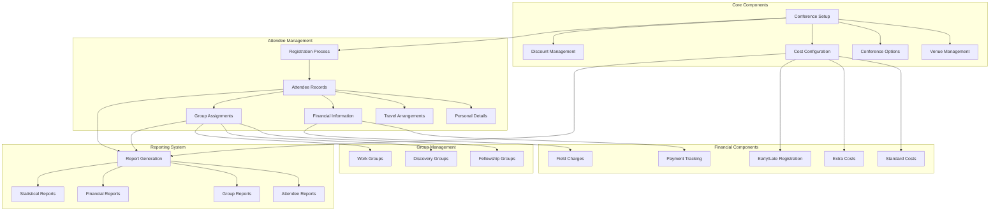
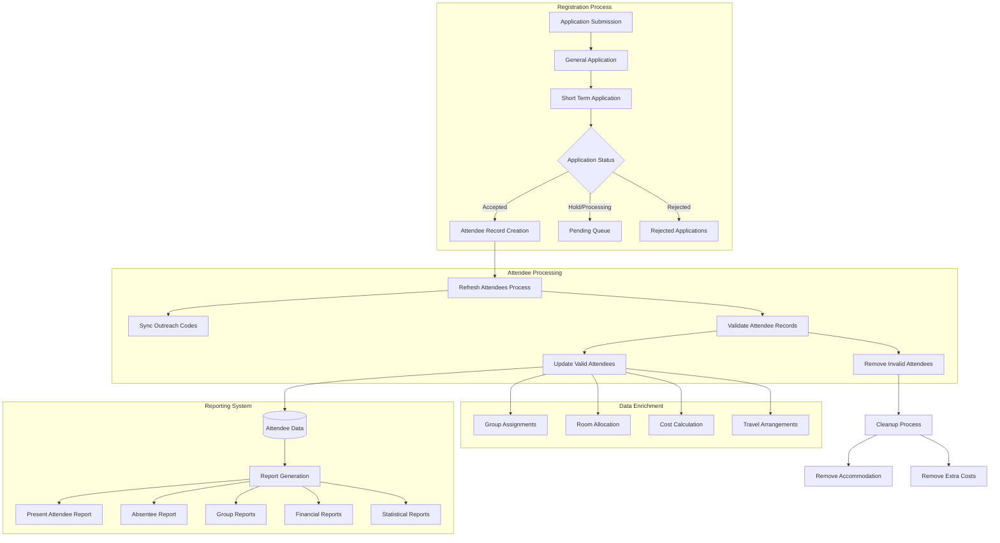
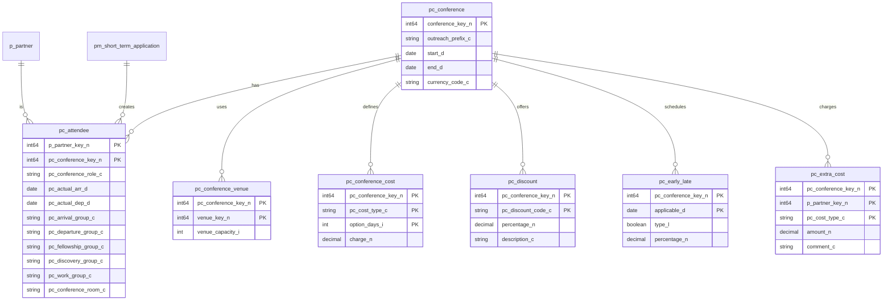

# Conference Event Management in OpenPetra

## Overview of Conference Event Management

OpenPetra's conference management system provides a comprehensive solution for organizing events, tracking attendees, and generating detailed reports. The system is designed to handle the full lifecycle of conference management, from initial setup and configuration to attendee registration, group assignments, financial tracking, and reporting.

The core functionality revolves around a flexible data model that connects conferences, venues, attendees, and their various attributes. Conferences are established as partner entities with specific properties like start/end dates, currency settings, and outreach prefixes. Attendees are linked to conferences through registration records that track personal details, travel arrangements, accommodation needs, and financial obligations.

The system supports various operational aspects including attendee grouping (fellowship, discovery, and work groups), financial management (standard costs, discounts, early/late registration fees), and comprehensive reporting capabilities. Integration with the broader partner management system ensures seamless data sharing and comprehensive participant tracking throughout the organization.

## Conference Management Architecture

The architecture of OpenPetra's conference management system is built around a modular design that separates core configuration, attendee management, group organization, financial tracking, and reporting components. The system uses a relational database model where conferences are linked to venues, options, and costs, while attendees are connected to conferences with relationships to personal information, travel details, financial data, and group assignments.

The reporting subsystem draws data from all components to generate comprehensive reports for different operational needs. Database tables like `pc_conference`, `pc_attendee`, `pc_conference_venue`, and `pc_conference_cost` form the backbone of the data structure, with validation logic ensuring data integrity across the system.

## Attendee Management

OpenPetra's conference management system provides robust functionality for tracking conference participants throughout their event journey. The attendee management component handles all aspects of participant information, from initial registration to final departure.

The system stores comprehensive personal details for each attendee, including:
- Basic identification (name, partner key, passport number)
- Demographic information (age, gender, nationality)
- Contact information
- Special requirements or accommodations
- Emergency contacts

Travel arrangements are meticulously tracked, with dedicated fields for:
- Arrival and departure dates
- Actual arrival/departure recording
- Transportation needs
- Travel points (airports, stations)
- Group travel assignments

The `TAttendeeManagement` class ensures data integrity by synchronizing attendee records with application data through the `RefreshAttendees` method, which creates new attendee records for valid applications and removes invalid ones. The system also maintains accommodation assignments, conference roles, and group memberships for each participant.

Attendee data is accessible through various reports including the Present Attendee Report, Absentee Report, and specialized listings like the Police Listing and Children Report. These reports can filter attendees by various criteria and display different subsets of attendee information based on operational needs.

## Conference Setup and Configuration

Setting up a conference in OpenPetra involves a structured process that establishes the fundamental parameters for event management. The `TConferenceFindForm` and `TConferenceMasterDataWebConnector` classes provide the core functionality for creating and configuring conferences.

When creating a new conference, the system:
1. Associates the conference with a partner key
2. Sets default values based on unit and partner location data
3. Establishes outreach prefixes, start/end dates, and currency settings

Conference configuration includes:
- **Venue Management**: Conferences can be linked to multiple venues through the `pc_conference_venue` table, with each venue having specific capacity and facility information.
- **Date Configuration**: Start and end dates define the conference duration, with additional date parameters for early/late registration periods.
- **Cost Structure**: The system supports flexible cost configurations including standard costs, early/late registration fees, and extra costs.
- **Options Management**: Conference options define different participation packages or tracks available to attendees.
- **Discount Setup**: Various discount types can be configured based on attendee characteristics or registration timing.

The `ValidateConferenceStandardCost` and `ValidateEarlyLateRegistration` methods ensure logical consistency in pricing and date configurations. For example, the system validates that more days of attendance shouldn't cost less than fewer days, and that early registration deadlines don't occur after late registration deadlines.

The `ConferenceSetupTDS` dataset provides a structured container for all configuration data, facilitating efficient data transfer between client and server components. This comprehensive approach to conference setup enables event organizers to create precisely tailored conference experiences.

## Attendee Data Flow

The attendee data flow in OpenPetra's conference management system follows a structured path from initial application to reporting. Applications enter the system through the general and short-term application processes, where they receive status designations (accepted, hold, rejected). Accepted applications trigger the creation of attendee records through the `RefreshAttendees` process.

The system continuously validates and updates attendee information, synchronizing outreach codes and removing invalid records when necessary. Valid attendees proceed through data enrichment processes including group assignments, room allocation, cost calculation, and travel arrangement tracking.

Throughout this flow, the system maintains data integrity through validation rules and transaction management. The `TAttendeeManagement` class plays a central role in ensuring consistency between application and attendee data. Finally, the enriched attendee data feeds into the reporting system, which generates various reports for operational management.

## Group Management

OpenPetra's conference management system provides sophisticated functionality for organizing conference attendees into different types of groups, enhancing event coordination and participant experience. The system supports three primary group types:

1. **Fellowship Groups**: These groups typically represent smaller communities within the conference where attendees can build relationships and engage in shared activities. Fellowship groups often meet regularly throughout the conference for discussion, prayer, or social interaction.

2. **Discovery Groups**: These groups focus on learning and exploration, often organized around specific topics, interests, or educational tracks within the conference. Discovery groups help attendees with similar interests connect and engage with content relevant to their needs.

3. **Work Groups**: These are task-oriented groups assigned to specific responsibilities or projects during the conference. Work groups might handle aspects of conference operations, service projects, or collaborative activities.

The group management functionality is implemented through the `pc_group` table and related components. Group assignments are stored in the attendee records, allowing for efficient querying and reporting. The system supports:

- Assignment of attendees to multiple group types simultaneously
- Group leader designation
- Group size management
- Reporting by group type

The Group Reports feature provides detailed listings of attendees by group type, with options to filter by specific criteria. Reports can be generated for all groups or focused on a particular group type (fellowship, discovery, or work groups). These reports include comprehensive attendee information such as names, nationality, age, gender, family key, and cross-references to other group assignments.

The `TFormLettersConferenceWebConnector` class enables generation of form letters for group members, facilitating communication with specific groups. This comprehensive approach to group management enhances the organizational efficiency of conferences while improving the participant experience through meaningful community connections.

## Financial Management

OpenPetra's conference management system provides comprehensive financial tracking capabilities for conference events. The financial management component handles all aspects of conference costs, from standard registration fees to specialized charges and discounts.

The system supports multiple cost structures:

1. **Standard Costs**: Base registration fees configured through the `pc_conference_cost` table, with validation ensuring logical pricing consistency (more days shouldn't cost less than fewer days).

2. **Early/Late Registration Fees**: Configurable through the `pc_early_late` table, allowing different pricing based on registration timing, with validation ensuring proper date sequencing.

3. **Extra Costs**: Additional charges for special services, equipment, or options tracked in the `pc_extra_cost` table.

4. **Discounts**: Various discount types configured in the `pc_discount` table, applicable based on attendee characteristics or registration timing.

Financial reporting is robust, with specialized reports including:
- **Charged Field Report**: Shows financial information organized by the fields charged for attendees
- **Extra Costs Report**: Details additional charges beyond standard registration fees
- **Sending/Receiving Field Reports**: Financial breakdowns by sending or receiving fields

The system supports multiple currencies, with the conference currency specified during setup. Financial calculations handle complex scenarios including:
- Partial attendance pricing
- Group/family discounts
- Early/late registration adjustments
- Special accommodation costs

The `ValidateConferenceStandardCost` method ensures pricing consistency, while financial reports provide detailed breakdowns with options for sign-off lines and explanations of discount flags. This comprehensive approach to financial management enables accurate budgeting, billing, and financial reporting for conference events.

## Conference Reporting Structure

```mermaid
graph TD
    subgraph "Core Reports"
        AttendeeReports[Attendee Reports] --> PresentAttendee[Present Attendee Report]
        AttendeeReports --> AbsenteeReport[Absentee Report]
        AttendeeReports --> PoliceListingReport[Police Listing]
        
        GroupReports[Group Reports] --> FellowshipReport[Fellowship Group Report]
        GroupReports --> DiscoveryReport[Discovery Group Report]
        GroupReports --> WorkGroupReport[Work Group Report]
        
        FinancialReports[Financial Reports] --> ChargedFieldReport[Charged Field Report]
        FinancialReports --> ExtraCostsReport[Extra Costs Report]
        FinancialReports --> SendingFieldReport[Sending Field Report]
        FinancialReports --> ReceivingFieldReport[Receiving Field Report]
    end
    
    subgraph "Statistical Reports"
        StatReports[Statistical Reports] --> NationalityReport[Nationality Summary]
        StatReports --> AgeReport[Age Summary Report]
        StatReports --> LanguagesReport[Languages Report]
        StatReports --> AttendanceSummary[Attendance Summary]
        StatReports --> ConferenceRoleReport[Conference Role Report]
    end
    
    subgraph "Specialized Reports"
        SpecialReports[Specialized Reports] --> ChildrenReport[Children Report]
        SpecialReports --> CommentsReport[Comments Report]
        SpecialReports --> FamilyListingReport[Family Listing]
        SpecialReports --> OutreachReport[Outreach Report]
        SpecialReports --> ArrivalsListingReport[Arrivals Listing]
    end
    
    subgraph "Report Parameters"
        Parameters[Report Parameters] --> ConferenceSelection[Conference Selection]
        Parameters --> AttendeeSelection[Attendee Selection]
        Parameters --> DateFilters[Date Filters]
        Parameters --> SortingOptions[Sorting Options]
        Parameters --> ColumnConfiguration[Column Configuration]
    end
    
    Parameters --> AttendeeReports
    Parameters --> GroupReports
    Parameters --> FinancialReports
    Parameters --> StatReports
    Parameters --> SpecialReports
```

OpenPetra's conference reporting structure provides a comprehensive framework for generating detailed information about conference events and attendees. The system organizes reports into several categories, each serving specific operational needs.

The reporting architecture is built on XML-based report definitions that specify data sources, parameters, calculations, and output formatting. Each report can be customized through parameters including conference selection, attendee filtering, date ranges, and sorting options.

Core reports focus on attendee tracking, group management, and financial information, while statistical reports provide demographic and attendance summaries. Specialized reports address specific operational needs like children's programming, arrival logistics, and family groupings.

The reporting system leverages a common set of calculations defined in the `conference.xml` file, promoting code reuse and consistency across reports. Data is retrieved through SQL queries that join multiple tables to create comprehensive views of conference information.

This structured approach to reporting enables conference organizers to monitor all aspects of event operations, from attendee demographics to financial performance, supporting effective decision-making and event management.

## Arrival and Departure Management

OpenPetra's conference management system includes specialized functionality for tracking and managing attendee arrivals and departures, a critical aspect of conference logistics. This component handles the entire travel lifecycle from planned arrangements to actual attendance recording.

The system tracks detailed travel information for each attendee:
- Planned arrival and departure dates
- Actual arrival and departure dates (for attendance verification)
- Arrival and departure times
- Transportation needs (whether transport is required)
- Travel points (airports, stations, etc.)
- Travel groups for coordinated transportation
- Special arrival/departure comments or instructions

The `arrivalslistingreport.xml` defines a specialized report that generates listings of attendees arriving or departing on specific dates, helping conference organizers prepare for daily transportation needs. This report can filter by arrival or departure date and includes comprehensive attendee information.

The `arrivaldeparturegroupreport.xml` provides functionality for managing attendees in travel groups, facilitating coordinated transportation arrangements. The system can identify attendees with unassigned groups, helping ensure all transportation needs are addressed.

The `absenteereport.xml` defines a report that identifies registered attendees who have not actually arrived, supporting follow-up processes for missing participants. This report compares scheduled arrival dates with actual arrival records to identify absentees.

For attendees who are present, the `presentattendeereport.xml` provides a listing of currently attending participants by checking actual arrival dates against current date and ensuring departure dates are either null or in the future.

This comprehensive approach to arrival and departure management ensures smooth logistics for conference transportation and accurate attendance tracking throughout the event.

## Validation and Data Integrity

OpenPetra's conference management system implements robust validation and data integrity mechanisms to ensure the reliability and consistency of conference data. These mechanisms operate at multiple levels, from database constraints to application-level validation rules.

Key validation components include:

1. **Conference Cost Validation**: The `ValidateConferenceStandardCost` method ensures logical pricing consistency, verifying that more days of attendance don't cost less than fewer days. This prevents pricing anomalies that could confuse attendees or cause financial discrepancies.

2. **Registration Date Validation**: The `ValidateEarlyLateRegistration` method verifies that registration dates make logical sense, ensuring early registration deadlines don't occur after late registration deadlines and that all dates are valid relative to the conference end date.

3. **Conference Cost Type Validation**: The `ValidateConferenceCostType` method checks that unassignable cost types have proper date settings, maintaining consistency in cost management.

4. **Attendee Data Synchronization**: The `RefreshAttendees` and `RefreshOutreachCode` methods ensure consistency between application and attendee records, automatically creating or removing attendee records based on application status changes.

5. **Database Transaction Management**: Operations that modify conference data use transaction management to ensure atomicity, with changes either fully committed or rolled back to prevent partial updates.

6. **Required Field Validation**: The system validates that essential fields like conference keys and event selections contain valid data before proceeding with operations.

7. **Date Range Consistency**: Various validations ensure that date ranges make logical sense, with start dates preceding end dates and all dates falling within valid ranges.

These validation mechanisms work together to maintain data integrity throughout the conference management lifecycle, preventing errors that could impact financial calculations, attendee experiences, or operational efficiency. The system's verification result collection pattern allows for comprehensive error reporting without immediately halting execution, providing users with complete information about validation issues.

## Conference Database Schema

The conference database schema in OpenPetra is designed to efficiently store and relate all conference management data. At its core is the `pc_conference` table, which stores fundamental conference information including the conference key (linked to a partner record), outreach prefix, start/end dates, and currency code.

Attendee information is stored in the `pc_attendee` table, which links partner records to conferences and tracks attendance details including actual arrival/departure dates, group assignments (fellowship, discovery, work), and room allocation.

The schema includes several supporting tables:
- `pc_conference_venue`: Links conferences to venue locations with capacity information
- `pc_conference_cost`: Defines standard costs for different attendance durations
- `pc_discount`: Stores discount types and percentages applicable to the conference
- `pc_early_late`: Manages early and late registration periods and associated pricing adjustments
- `pc_extra_cost`: Tracks additional charges for specific attendees

This relational structure allows for efficient querying and reporting while maintaining data integrity through foreign key relationships. The schema supports all core conference management functions including attendee tracking, financial management, group organization, and venue allocation.

## Integration with Partner Management

OpenPetra's conference management system is tightly integrated with the partner management system, creating a seamless flow of data between these complementary modules. This integration ensures comprehensive participant tracking and eliminates redundant data entry.

Key integration points include:

1. **Partner as Conference Foundation**: Conferences are established as partner entities (specifically units) with a partner key serving as the conference key. This approach leverages existing partner data structures and relationships.

2. **Attendee-Partner Relationship**: Conference attendees are linked to partner records, allowing the system to access comprehensive partner information including contact details, demographics, and relationship networks.

3. **Shared Data Access**: Conference reports can access partner data fields such as names, addresses, and contact information without duplicating this data in conference-specific tables.

4. **Extract Generation**: The `QueryPartnerByEvent` class enables creation of partner extracts based on event participation, facilitating targeted communication with conference attendees.

5. **Form Letter Generation**: The `TFormLettersConferenceWebConnector` class enables generation of form letters for conference attendees, leveraging partner contact information.

6. **Emergency Contact Access**: Conference management can access emergency contact information stored in the partner relationship system, critical for health and safety management during events.

7. **Field Unit Integration**: The conference system can identify sending and receiving fields based on partner unit relationships, supporting field-based reporting and financial tracking.

This integration provides several benefits:
- Elimination of duplicate data entry
- Consistent partner information across systems
- Ability to leverage existing partner relationships
- Comprehensive view of partner engagement including conference participation
- Streamlined communication processes

By building on the foundation of the partner management system, the conference module delivers robust event management capabilities while maintaining data consistency throughout the organization.

[Generated by the Sage AI expert workbench: 2025-03-30 02:22:57  https://sage-tech.ai/workbench]: #