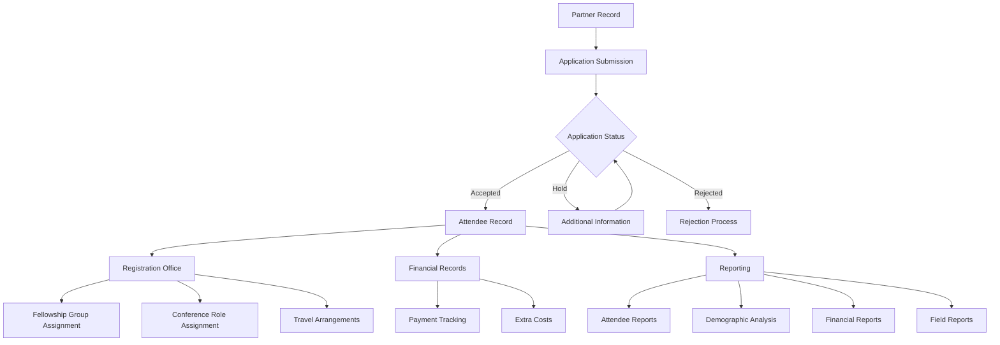
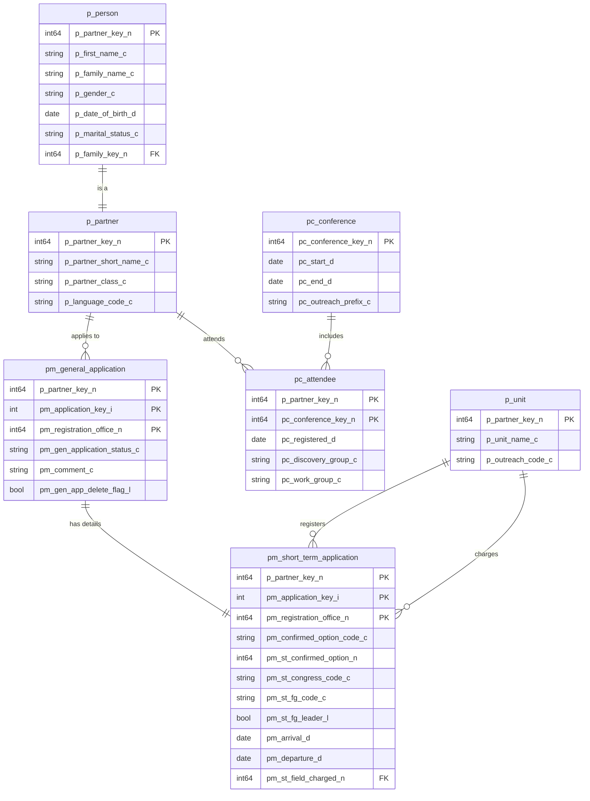
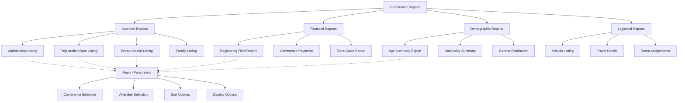
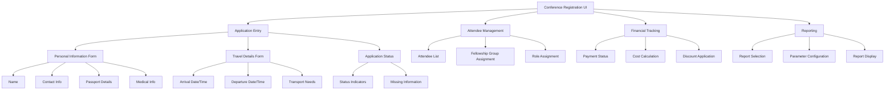

# Conference Registration in OpenPetra

## Conference Registration Overview

OpenPetra's conference registration system serves as a comprehensive management solution for handling participant data throughout the event lifecycle. The system enables organizations to track applications, manage attendee information, process payments, and generate reports for conferences and events of various sizes. It integrates with OpenPetra's partner management system to maintain consistent participant records while providing specialized functionality for event management.

The conference registration module allows administrators to define different application types, track application status from submission through acceptance or rejection, manage attendee demographics, handle travel and accommodation arrangements, and organize participants into fellowship groups with specific roles. The system supports both the administrative needs of conference organizers and the practical logistics of managing attendee information, with robust reporting capabilities for demographic analysis, financial tracking, and attendance monitoring.

## Conference Registration Data Flow

The conference registration process begins with a partner record in the OpenPetra system. Partners submit applications for conference attendance, which are then evaluated and assigned a status (accepted, hold, or rejected). Applications on hold require additional information before proceeding. Once accepted, an attendee record is created and managed by a registration office, which handles fellowship group assignments, conference roles, and travel arrangements. 

Financial records track payments and extra costs associated with attendance. The system generates various reports including attendee listings, demographic analyses, financial summaries, and field reports. This structured flow ensures that all participant data is properly captured, processed, and available for administrative and logistical purposes throughout the conference lifecycle.

## Application Types and Status Management

OpenPetra's conference registration system supports various application types, with the primary type being "CONFERENCE" (labeled as "Attending Conference"). This application type is defined in the base data and serves as the foundation for processing participant registrations.

Applications in the system follow a defined lifecycle, tracked through status codes that indicate where an application stands in the approval process:

1. **Empty Status ('')**: Initial state when an application is first created but not yet processed.
2. **Enquiry Status ('E')**: Indicates a preliminary inquiry about attending the conference.
3. **Hold Statuses**:
   - 'H': General hold status
   - 'H-LANG': Hold due to language requirements
   - 'H-MED': Hold due to medical concerns
   - 'H-REF': Hold pending references
   - 'H-SUP': Hold due to support issues

4. **Accepted Status ('A')**: Application has been approved, and the person is confirmed as an attendee.
5. **Rejected Statuses ('R1')**: Application has been declined.
6. **Cancelled Statuses ('C1' through 'C7')**: Application was initially accepted but later cancelled for various reasons.

The application status management is handled through the `TApplicationManagement` class, which provides methods to retrieve applications based on their status and other filtering criteria. The system enforces permission-based access control, ensuring that only authorized users can view or modify applications from specific registration offices.

The application lifecycle is designed to provide transparency in the registration process, allowing conference organizers to track the status of each application and take appropriate actions based on the current state. This structured approach helps manage the flow of participants from initial application to final confirmation or rejection.

## Attendee Data Management

OpenPetra stores and manages comprehensive attendee information through an integrated data structure that spans multiple database tables. The system captures detailed personal information including name, gender, marital status, date of birth, passport details, and nationality. This core data is supplemented with conference-specific information such as registration date, arrival and departure details, travel arrangements, and accommodation needs.

The attendee data management system is organized around several key components:

1. **Personal Details**: Basic biographical information stored in the `p_person` and `p_partner` tables, including contact information, language preferences, and demographic data.

2. **Travel Arrangements**: The system tracks arrival and departure dates, times, locations, transportation types, and whether transport assistance is needed. Special comments and travel details can be recorded for logistical planning.

3. **Accommodation Requirements**: Information about room assignments, special accommodation needs, and fellowship group placements for housing arrangements.

4. **Special Requirements**: The system can store medical notes, dietary restrictions, and other special needs through the data label value system, allowing for flexible recording of various requirements.

5. **Application Information**: Links to the original application data, including application status, registration office, and application comments.

6. **Conference-Specific Data**: Tracks conference roles, outreach codes, fellowship group assignments, and whether the attendee is a group leader.

The data management system is designed to support both administrative needs (tracking registrations, managing applications) and practical logistics (organizing accommodations, planning transportation, addressing special needs). The flexible structure allows conference organizers to capture all necessary information while maintaining data integrity and privacy.

## Conference Registration Database Schema

This diagram illustrates the core database schema for the conference registration system in OpenPetra. The schema revolves around several key tables:

1. **p_partner and p_person**: Store basic partner and personal information for all participants.

2. **pm_general_application**: Contains general application information including status and registration office.

3. **pm_short_term_application**: Stores conference-specific details like confirmed options, conference roles, fellowship groups, and travel dates.

4. **pc_conference**: Defines conference events with start/end dates and outreach prefixes.

5. **pc_attendee**: Links partners to conferences they're attending with registration dates and group assignments.

6. **p_unit**: Represents organizational units including registration offices and charged fields.

The relationships between these tables enable the system to track the complete lifecycle of conference registrations, from initial application through attendance. The schema supports multiple registration offices handling applications, different conference roles and fellowship groups, and comprehensive travel and logistical information.

## Registration Office Permissions

OpenPetra implements a sophisticated permission system for registration offices that controls which users can access and modify specific conference registrations. This security model is primarily managed through the `TApplicationManagement` class, which enforces access control based on module permissions.

The permission system works through several key mechanisms:

1. **Module-Based Permissions**: Each registration office is associated with a specific module permission in the format `REG-{PartnerKey}`, where PartnerKey is the 10-digit partner key of the registration office. Users are granted access to specific registration offices through these module permissions.

2. **Office Detection**: The system identifies which registration offices a user has permission to access by checking their module permissions against all offices that have registrations for events in the system.

3. **Organizer Status**: Users with permissions for multiple registration offices (specifically, more than the `MINIMUM_OFFICES_TO_BECOME_ORGANIZER` constant, which is set to 3) are considered conference organizers and granted broader access to all attendee records.

4. **Permission Enforcement**: When retrieving application data, the system filters results based on the user's permissions, ensuring they only see applications from registration offices they have access to, unless they are identified as conference organizers.

5. **Dynamic Office List**: The `GetRegistrationOfficeKeysOfUser()` method dynamically builds a list of offices the current user has permission to access, which is then used to filter data retrieval operations.

This permission structure allows organizations to implement a decentralized registration process where different offices can manage their own applicants, while still providing centralized oversight for conference organizers. The system balances the need for distributed management with appropriate access controls, ensuring that sensitive applicant information is only accessible to authorized personnel.

## Financial Aspects of Registration

OpenPetra's conference registration system includes comprehensive financial tracking capabilities to manage the monetary aspects of event participation. The financial components handle payment tracking, conference costs, discounts, and financial reporting to ensure proper accounting of all financial transactions related to conference attendance.

Key financial aspects of the registration system include:

1. **Payment Tracking**: The system monitors which participants have paid for their conference attendance by linking gift records with matching motivation codes to participant registrations. The `ConferencePayments.xml` report identifies registered participants who haven't made payments by comparing participant records with gift payment data.

2. **Conference Costs**: The registration system can track various costs associated with conference attendance, including:
   - Base registration fees
   - Accommodation costs
   - Meal plans
   - Transportation fees
   - Special event fees

3. **Discount Management**: The system supports various discount types, which are flagged in the financial reports. These may include early registration discounts, group discounts, or special rates for certain participant categories.

4. **Extra Costs**: Beyond standard fees, the system can track additional expenses through the `GetExtraCosts` function, which retrieves extra cost information for specific attendees at particular conferences.

5. **Financial Reporting**: The `registeringfieldreport.xml` provides detailed financial reporting capabilities, including:
   - Summaries by registering field
   - Individual attendee financial details
   - Payment status tracking
   - Cost breakdowns by category
   - Discount application tracking

6. **Charged Office Assignment**: Each application can be assigned to a specific "charged office" (pm_st_field_charged_n) which may differ from the registration office, allowing for flexible financial responsibility assignment.

7. **Financial Data Presentation**: Reports can be configured to show or hide financial information through parameters like `param_chkFinancialReport`, enabling both detailed financial analysis and non-financial attendee listings from the same data source.

The financial tracking system integrates with OpenPetra's gift management functionality, allowing organizations to maintain a complete financial picture of conference operations while providing the flexibility needed to handle various payment scenarios and reporting requirements.

## Registration Reporting Hierarchy

The conference registration system in OpenPetra features a comprehensive reporting hierarchy that provides various views of registration data for different purposes. The reporting structure is organized into several major categories, with each report designed to address specific information needs.

At the top level, reports are divided into attendee reports, financial reports, demographic reports, and logistical reports. Each category contains specialized reports that can be configured through common parameter sets, allowing for consistent filtering and display options across different report types.

The attendee reports focus on participant listings in various formats, including alphabetical, registration date order, extract-based, and family groupings. Financial reports track payments, costs, and financial summaries by registering field. Demographic reports analyze attendee characteristics such as age, nationality, and gender distribution. Logistical reports help manage practical aspects like arrivals, travel arrangements, and accommodations.

This hierarchical structure enables conference organizers to access precisely the information they need for different aspects of event management, from administrative oversight to practical logistics. The common parameter framework ensures consistency across reports while allowing for specialized functionality within each report type.

## Fellowship Groups and Conference Roles

OpenPetra's conference registration system includes robust functionality for organizing attendees into fellowship groups and assigning specific roles within a conference or event. This organizational structure helps manage the social, spiritual, and practical aspects of conference participation.

### Fellowship Groups

Fellowship groups (stored in the `pm_st_fg_code_c` field) serve as the primary social and organizational units within a conference. These groups typically consist of 8-15 participants who meet regularly during the event for discussion, prayer, and community building. Key aspects of fellowship group management include:

1. **Group Assignment**: Attendees are assigned to specific fellowship groups based on factors such as language, age, interests, or organizational needs.

2. **Group Leaders**: The system identifies fellowship group leaders through the `pm_st_fg_leader_l` boolean field, distinguishing them from regular group members.

3. **Group Tracking**: Reports can filter and sort by fellowship group, allowing organizers to generate group-specific information and attendance lists.

4. **Group Activities**: Fellowship groups often participate in activities together, requiring coordination of schedules and resources.

### Conference Roles

Conference roles (stored in the `pm_st_congress_code_c` field) define the function or responsibility of each attendee within the event. These roles help organize the conference workforce and participant structure. Key aspects of role management include:

1. **Role Types**: Common roles might include participant, staff, speaker, volunteer, translator, or technical support.

2. **Role-Based Access**: Different roles may have different access privileges, schedules, or responsibilities during the conference.

3. **Role Reporting**: The system can generate reports filtered by specific roles, helping organizers manage different participant categories.

4. **Role Assignment**: Roles are typically assigned during the application process or by conference organizers based on skills, experience, and event needs.

The fellowship group and role systems work together to create a structured environment for conference participation. Groups provide community and support for attendees, while roles ensure that all necessary functions are covered for successful event execution. This dual organizational approach helps manage both the social and operational aspects of conferences, enhancing the experience for participants while providing clear structure for organizers.

## Travel and Logistics Management

OpenPetra's conference registration system includes comprehensive travel and logistics management capabilities to track and coordinate attendee movements before, during, and after events. This functionality is critical for ensuring smooth operations, especially for international conferences with complex travel arrangements.

The system captures detailed travel information including:

1. **Arrival Information**:
   - Arrival date (`pm_arrival_d`)
   - Arrival time (hour and minute fields)
   - Arrival location/point (`pt_arrival_point_code_c`)
   - Travel type to conference (`pt_travel_type_to_cong_code_c`)
   - Detailed travel information (`pm_to_cong_travel_info_c`)
   - Transportation needs flag (`pm_arrival_transport_needed_l`)
   - Special comments (`pm_arrival_comments_c`)

2. **Departure Information**:
   - Departure date (`pm_departure_d`)
   - Departure time (hour and minute fields)
   - Departure location/point (`pt_departure_point_code_c`)
   - Travel type from conference (`pt_travel_type_from_cong_code_c`)
   - Detailed travel information (`pm_from_cong_travel_info_c`)
   - Transportation needs flag (`pm_departure_transport_needed_l`)
   - Special comments (`pm_departure_comments_c`)

3. **Group Assignments for Travel**:
   - Arrival groups (`pc_arrival_group_c`)
   - Departure groups (`pc_departure_group_c`)
   - Work groups (`pc_work_group_c`)
   - Discovery groups (`pc_discovery_group_c`)

The system supports various travel types (air, train, bus, car, etc.) and can track whether attendees need transportation assistance between arrival points (airports, train stations) and the conference venue. This information helps organizers arrange shuttle services, group transportation, or pickup schedules.

For reporting purposes, the system can generate specialized travel reports showing:
- Arrivals and departures by date and time
- Transportation needs by location
- Group travel arrangements
- Special assistance requirements

The logistics management functionality integrates with the rest of the conference registration system, allowing organizers to coordinate travel arrangements with accommodation assignments, fellowship groups, and conference schedules. This comprehensive approach ensures that all logistical aspects of attendee participation are properly tracked and managed.

## Conference Registration User Interface

The Conference Registration User Interface in OpenPetra provides a structured workflow for managing the entire registration process. The interface is organized into four main functional areas: Application Entry, Attendee Management, Financial Tracking, and Reporting.

The Application Entry section includes forms for collecting personal information (name, contact details, passport information, medical needs), travel details (arrival and departure dates/times, transportation requirements), and displays application status information including status indicators and missing information alerts. Validation is applied at each step to ensure complete and accurate data collection.

The Attendee Management area provides tools for viewing and managing the attendee list, assigning participants to fellowship groups, and designating conference roles. This section helps organizers structure the conference participation and ensure all necessary roles are filled.

Financial Tracking components display payment status for each attendee, calculate costs based on conference options and attendance duration, and apply appropriate discounts. This section ensures proper financial management of the registration process.

The Reporting section allows users to select from various report types, configure parameters (such as conference selection, attendee filtering, and sort options), and display or export the resulting reports. This provides the analytical tools needed for effective conference management.

Throughout the interface, validation rules ensure data integrity while providing clear feedback when required information is missing or incorrectly formatted. The workflow is designed to guide users through the registration process in a logical sequence while providing flexibility to navigate between different functional areas as needed.

## Demographic Analysis and Reporting

OpenPetra's conference registration system includes powerful demographic analysis and reporting capabilities that enable organizers to understand the composition of their attendee population. These tools provide valuable insights for planning, reporting, and evaluating conference demographics across multiple dimensions.

The system offers several specialized reports for demographic analysis:

1. **Age Summary Report** (`agesummaryreport.xml`):
   - Categorizes attendees by age ranges
   - Provides gender breakdown within each age category
   - Calculates totals and percentages for each age group
   - Supports filtering by conference, extract, or individual attendee
   - Uses custom functions like `CalculateSingleAge` to process birth dates

2. **Nationality Summary Report** (`nationalitysummaryreport.xml`):
   - Summarizes attendee counts by country of origin
   - Breaks down nationality statistics by gender
   - Shows language distribution within nationality groups
   - Provides totals and percentages for each nationality
   - Uses specialized functions like `CalculateNationalities` for data processing

3. **Gender Distribution Analysis**:
   - Available across multiple report types
   - Shows male/female/other ratios overall and within categories
   - Helps ensure balanced group compositions

4. **Fellowship Group Demographics**:
   - Analyzes the composition of fellowship groups
   - Helps create balanced groups across demographic factors
   - Supports group leader assignment based on demographic considerations

These demographic reports support various planning and reporting needs:

- **Strategic Planning**: Understanding demographic patterns helps in planning appropriate programming, accommodations, and resources.
- **Diversity Monitoring**: Reports help ensure diverse representation across nationalities, ages, and genders.
- **Resource Allocation**: Demographic data informs decisions about language services, age-appropriate activities, and cultural considerations.
- **Historical Comparison**: Year-over-year demographic analysis helps track changes in conference attendance patterns.
- **Donor Reporting**: Demographic summaries provide valuable information for reporting to donors and supporters.

The reporting system uses a combination of SQL queries and custom processing functions to generate accurate demographic statistics. Reports can be filtered by specific conferences, extracts, or individual attendees, allowing for both broad overview analysis and detailed examination of specific participant groups. This flexibility makes the demographic reporting system a valuable tool for conference planning, execution, and evaluation.

[Generated by the Sage AI expert workbench: 2025-03-30 02:22:57  https://sage-tech.ai/workbench]: #