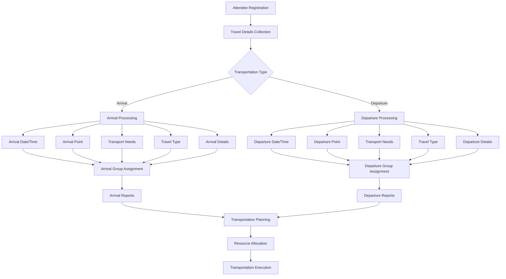
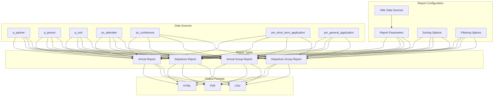
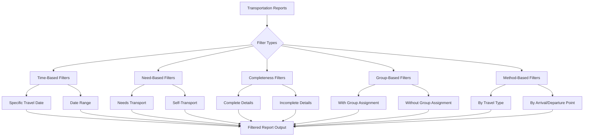
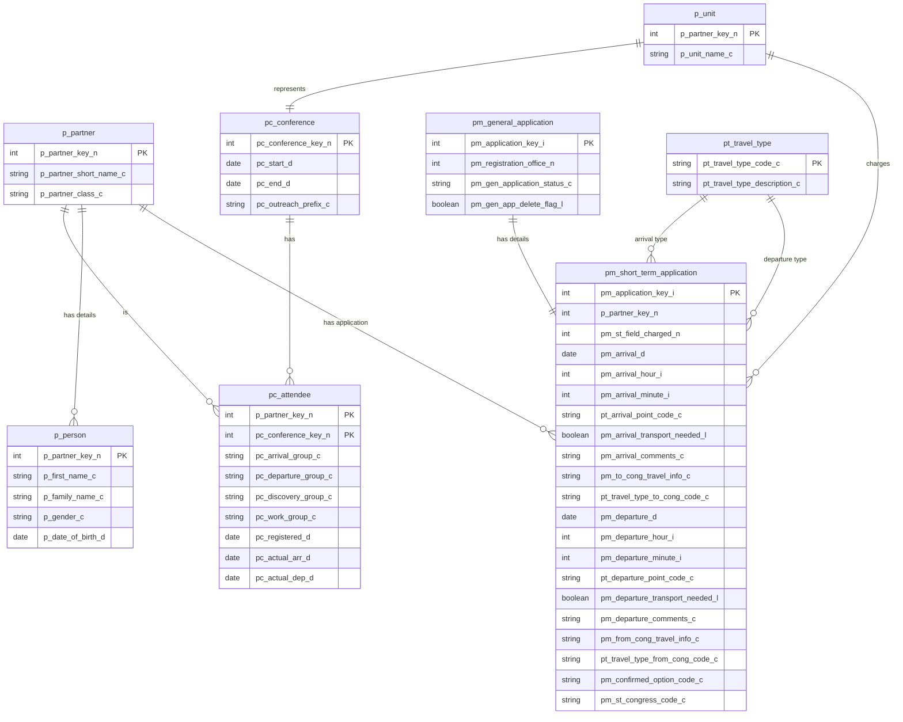

# Conference Transportation Management in OpenPetra

## Conference Transportation Overview

OpenPetra's conference transportation management system provides a comprehensive solution for handling the logistical challenges of attendee arrivals and departures at conferences and events. The system is designed to track, organize, and report on transportation needs for potentially hundreds of attendees, ensuring efficient coordination of resources and minimizing logistical complications. 

The transportation management functionality allows conference organizers to record detailed information about each attendee's travel plans, including arrival and departure dates, times, locations, transportation methods, and special needs. This information can then be organized into structured reports and grouped for efficient resource allocation. The system supports various transportation methods (airplane, bus/coach, car, train, van, walking) and can filter attendees based on specific criteria such as those requiring transportation assistance or those with incomplete travel details.

A key strength of the system is its ability to organize attendees into arrival and departure groups, facilitating coordinated pickups and drop-offs to maximize efficiency. The reporting capabilities provide organizers with clear, actionable information sorted by date, time, and other relevant criteria to ensure smooth transportation operations throughout the conference lifecycle.

## Transportation Data Flow

The diagram illustrates how transportation data flows through OpenPetra's conference management system. The process begins with attendee registration, where travel details are collected and categorized as either arrival or departure information. For each category, the system captures critical data points including date/time, location points, transport needs, travel type (e.g., airplane, train), and additional details.

This information is then used to assign attendees to appropriate arrival or departure groups for coordinated transportation. The system generates specialized reports that support transportation planning, resource allocation, and ultimately the execution of transportation services. The data model ensures that all necessary information is captured to facilitate efficient transportation management throughout the conference lifecycle.

## Arrival Management

OpenPetra's arrival management functionality provides a structured approach to tracking and coordinating attendee arrivals for conferences. The system captures comprehensive arrival information for each attendee, including exact arrival dates and times, transportation methods (airplane, bus/coach, car, train, van, walking), arrival points (airports, train stations, etc.), and whether transportation assistance is needed from the arrival point to the conference venue.

For attendees requiring transportation, the system records specific details about their arrival, such as flight numbers, train information, or other relevant travel details. This information is stored in the `pm_short_term_application` table with fields like `pm_arrival_d` (arrival date), `pm_arrival_hour_i` and `pm_arrival_minute_i` (arrival time components), `pt_arrival_point_code_c` (arrival location), and `pm_arrival_transport_needed_l` (boolean flag indicating transport needs).

The arrival management system supports grouping attendees with similar arrival times and locations into "arrival groups" (stored in the `pc_attendee.pc_arrival_group_c` field), facilitating efficient resource allocation for pickups. Conference organizers can generate detailed arrival reports filtered by specific criteria, such as showing only those arriving on a particular date, those needing transportation assistance, or those with incomplete arrival information. This structured approach ensures that conference organizers can effectively plan and execute transportation logistics for all incoming attendees.

## Departure Management

The departure management component of OpenPetra's transportation system mirrors the arrival management functionality but focuses on the outbound journey of conference attendees. The system meticulously tracks departure information including scheduled departure dates, precise times (stored as hour and minute components), departure points, and transportation requirements for each attendee.

Similar to arrival management, the departure data is stored primarily in the `pm_short_term_application` table with fields such as `pm_departure_d` (departure date), `pm_departure_hour_i` and `pm_departure_minute_i` (time components), `pt_departure_point_code_c` (departure location), and `pm_departure_transport_needed_l` (indicating whether transportation assistance is required). Additional details about the departure journey are captured in `pm_from_cong_travel_info_c` and the transportation method in `pt_travel_type_from_cong_code_c`.

A key feature of the departure management system is the ability to organize attendees into "departure groups" (stored in `pc_attendee.pc_departure_group_c`), which allows for coordinated transportation planning. This grouping mechanism is particularly valuable for conferences with many attendees departing at similar times to the same destinations, enabling efficient resource allocation and scheduling.

The system generates specialized departure reports that can be filtered and sorted based on various criteria, providing conference organizers with the necessary information to coordinate outbound transportation effectively. These reports can highlight attendees with incomplete departure details, those requiring special assistance, or those departing on specific dates, ensuring comprehensive departure logistics management.

## Transportation Report Structure

The transportation report structure in OpenPetra is built on a flexible XML-based configuration system that allows for detailed customization of report content and presentation. The diagram illustrates how various components interact to generate comprehensive transportation reports.

At the core of the reporting system are XML configuration files that define report parameters, data sources, sorting options, and filtering criteria. These configurations reference external XML files (`transportreport.xml`, `conference.xml`, `arrivaldeparturegroupreport.xml`) that provide the underlying structure and data queries.

The reports draw data from multiple database tables including partner information (`p_partner`), personal details (`p_person`), organizational units (`p_unit`), conference attendance (`pc_attendee`), conference details (`pc_conference`), and travel information (`pm_short_term_application`, `pm_general_application`). This comprehensive data model ensures that reports contain all relevant transportation and attendee information.

The system supports four main report types: Arrival Reports, Departure Reports, Arrival Group Reports, and Departure Group Reports. Each report type can be customized with specific columns, widths, sorting preferences, and filtering options. The reports can be generated in various formats including HTML, PDF, and CSV to accommodate different usage scenarios.

This structured approach to transportation reporting provides conference organizers with powerful tools to plan and manage transportation logistics efficiently, with the flexibility to focus on specific aspects of transportation management as needed.

## Transportation Methods and Types

OpenPetra's conference transportation system incorporates a standardized set of transportation methods to ensure consistent categorization and reporting of attendee travel arrangements. The system defines six primary transportation types, stored in the `pt_travel_type` reference table:

1. **Airplane (AIR)**: For attendees traveling by air, typically requiring pickup from airports.
2. **Bus/Coach (BUS)**: For attendees arriving or departing via bus or coach services.
3. **Car (CAR)**: For attendees using private vehicles or car services.
4. **Train (RLY)**: For attendees utilizing rail transportation.
5. **Van (VAN)**: For attendees traveling in vans, often for group transportation.
6. **Walking (WALK)**: For attendees arriving on foot, typically from nearby locations.

Each transportation type is assigned a short code (3-4 characters) and a descriptive name for clear identification. These standardized types are used throughout the system to classify both arrival and departure transportation methods, stored in the `pt_travel_type_to_cong_code_c` and `pt_travel_type_from_cong_code_c` fields of the `pm_short_term_application` table respectively.

The transportation types play a crucial role in planning and resource allocation, as different transportation methods may require different handling. For example, attendees arriving by airplane might need airport pickup services, while those arriving by car may need parking information. Similarly, departure transportation planning varies based on the chosen method.

The standardized transportation types also facilitate reporting and filtering, allowing conference organizers to generate targeted reports for specific transportation methods. This standardization ensures consistency in data collection and reporting across different conferences and events managed through the OpenPetra system.

## Group-Based Transportation Management

OpenPetra implements a sophisticated group-based approach to transportation management that significantly enhances logistical efficiency for conference organizers. The system allows attendees to be organized into distinct arrival and departure groups based on common transportation characteristics such as dates, times, locations, and transportation methods.

Arrival groups (stored in the `pc_attendee.pc_arrival_group_c` field) consolidate attendees arriving at similar times at the same location who require transportation to the conference venue. This grouping enables conference organizers to coordinate pickup services efficiently, potentially reducing the number of vehicles needed and optimizing resource allocation. For example, multiple attendees arriving on the same flight or at the same train station within a short timeframe can be assigned to a single arrival group for coordinated pickup.

Similarly, departure groups (stored in the `pc_attendee.pc_departure_group_c` field) organize attendees departing at similar times to the same destination points. This facilitates efficient scheduling of departure transportation, ensuring that attendees with similar departure needs are grouped together for shared transportation services.

The group-based approach offers several advantages:

1. **Resource Optimization**: By consolidating transportation needs, organizers can minimize the number of vehicles and drivers required.
2. **Simplified Coordination**: Managing groups rather than individuals reduces the complexity of transportation logistics.
3. **Enhanced Attendee Experience**: Coordinated group transportation reduces waiting times and improves the overall attendee experience.
4. **Cost Efficiency**: Shared transportation services typically reduce the per-person cost of transportation.

The system's reporting capabilities include specialized group reports that provide detailed information about each arrival and departure group, including member lists, timing details, and transportation requirements. An important feature is the ability to include or exclude attendees without group assignments in these reports (controlled by the `param_chkIncludeNoGroups` parameter), ensuring comprehensive transportation planning that accounts for all attendees.

## Transportation Filtering Options

OpenPetra's transportation management system offers robust filtering capabilities that allow conference organizers to generate precisely targeted reports based on specific criteria. The diagram illustrates the various filtering options available for transportation reports, providing flexibility in how transportation data is analyzed and presented.

Time-based filters allow organizers to focus on specific travel dates (`param_chkOnlyTravelDay` and `param_dtpTravelDay` parameters) or date ranges, which is particularly useful for planning day-specific transportation resources. Need-based filters can isolate attendees who specifically require transportation assistance (`param_chkNeedTransport` parameter), helping organizers allocate pickup and drop-off resources efficiently.

Completeness filters (`param_chkIncompleteDetails` parameter) enable organizers to identify attendees with missing or incomplete transportation information, facilitating follow-up to ensure all necessary details are collected before the conference. Group-based filters can show attendees with or without group assignments (`param_chkIncludeNoGroups` parameter), ensuring that no attendees are overlooked in transportation planning.

Method-based filters allow sorting and filtering by specific transportation types (airplane, bus, car, etc.) or by arrival/departure points, helping organizers coordinate location-specific transportation needs. These filtering options can be combined to create highly specific reports, such as identifying all attendees arriving by airplane on a specific date who need transportation assistance.

The filtering system is implemented through SQL query conditions in the report templates, which dynamically modify the database queries based on the selected parameters. This approach ensures that reports contain only the relevant information needed for specific transportation planning tasks, reducing information overload and focusing attention on actionable data.

## Report Configuration and Customization

OpenPetra's transportation reporting system offers extensive configuration and customization capabilities, allowing organizations to tailor reports to their specific needs. The system uses XML-based configuration files to define report parameters, layout, and behavior, providing flexibility without requiring code changes.

Report configuration begins with defining basic parameters such as the report title, data sources, and maximum number of display columns. For transportation reports, these parameters are stored in XML files like `standard Arrival.xml` and `standard Departure.xml`. The configuration specifies which XML data sources to use (e.g., `transportreport.xml` and `conference.xml`), establishing the foundation for the report structure.

Column configuration is a key aspect of report customization. Each column in a transportation report can be individually configured with:
- A specific data field to display (e.g., "Partner Name", "Arrival Date", "Departure Point")
- Custom width settings to optimize visual presentation (specified in integer units)
- Sorting priority and direction

The sorting configuration allows for multi-level sorting hierarchies. For example, arrival reports can be sorted primarily by arrival date, then by arrival time, and finally by partner name. This hierarchical sorting ensures that the report presents information in a logical and useful sequence.

Filtering options can be configured through parameters like `param_chkOnlyTravelDay`, `param_chkNeedTransport`, and `param_chkIncompleteDetails`, allowing users to focus the report on specific subsets of data. These parameters control the SQL query conditions that determine which records appear in the report.

The report header and description fields can be dynamically generated based on the selected parameters, providing context about the report's content and filtering criteria. This dynamic text generation ensures that report readers understand exactly what data they're viewing and how it was filtered.

For more advanced customization, organizations can modify the underlying XML report templates (`transportreport.xml`) to add new calculations, fields, or formatting options. This extensibility ensures that the reporting system can adapt to evolving transportation management requirements over time.

## Integration with Conference Management

OpenPetra's transportation system is tightly integrated with the broader conference management functionality, creating a cohesive solution for handling all aspects of conference organization. This integration ensures that transportation planning is informed by and aligned with other conference activities and requirements.

The transportation system connects directly to the core attendee registration process, automatically capturing relevant travel information as part of the registration workflow. When attendees register for a conference, their transportation needs, arrival and departure details, and special requirements are recorded in the same database that supports transportation planning.

Conference roles and responsibilities, stored in the `pm_short_term_application.pm_st_congress_code_c` field, influence transportation planning by identifying attendees with special status or needs. For example, conference speakers or VIPs might require dedicated transportation services, which can be coordinated through the integrated system.

The charged office information (`ChargedUnit.p_unit_name_c`) links transportation management to the organizational and financial aspects of conference planning. This integration helps track which organizational units are responsible for different attendees, potentially affecting transportation cost allocation and resource planning.

Fellowship groups (`pm_short_term_application.pm_st_fg_code_c`) and work groups (`pc_attendee.pc_work_group_c`) provide additional context for transportation planning, as members of the same groups might benefit from coordinated transportation arrangements. Similarly, discovery groups (`pc_attendee.pc_discovery_group_c`) might influence arrival and departure group assignments.

The system's integration extends to conference timing information, with conference start and end dates (`PUB_pc_conference.pc_start_d` and `PUB_pc_conference.pc_end_d`) providing context for expected arrival and departure patterns. This temporal framework helps transportation planners anticipate peak periods and allocate resources accordingly.

By integrating transportation management with the broader conference system, OpenPetra ensures that transportation planning is not conducted in isolation but is informed by and responsive to the overall conference structure, schedule, and attendee characteristics.

## Database Schema for Transportation

The database schema supporting OpenPetra's transportation management functionality is designed to capture comprehensive travel information while maintaining relationships with the broader conference management system. The diagram illustrates the key tables and their relationships that enable effective transportation planning and reporting.

At the core of the schema is the `p_partner` table, which stores basic information about all entities in the system, including conference attendees. This connects to `p_person` for personal details and to `pc_attendee` to establish conference attendance relationships. The `pc_attendee` table includes critical transportation grouping fields like `pc_arrival_group_c` and `pc_departure_group_c`.

The `pm_short_term_application` table contains the bulk of transportation-related data, including arrival and departure dates and times, transportation needs flags, arrival and departure points, and travel details. This table links to `pt_travel_type` for standardized transportation methods (airplane, bus, car, etc.) through the `pt_travel_type_to_cong_code_c` and `pt_travel_type_from_cong_code_c` fields.

Conference information is stored in the `pc_conference` table, which connects to `p_unit` for organizational details. The `p_unit` table also connects to `pm_short_term_application` through the `pm_st_field_charged_n` field, establishing which organizational unit is responsible for each attendee.

The `pm_general_application` table provides additional context for short-term applications, including application status information that affects transportation planning. This comprehensive schema ensures that all necessary transportation data is captured and properly related to other conference information, enabling effective transportation management and reporting.

[Generated by the Sage AI expert workbench: 2025-03-30 02:22:57  https://sage-tech.ai/workbench]: #