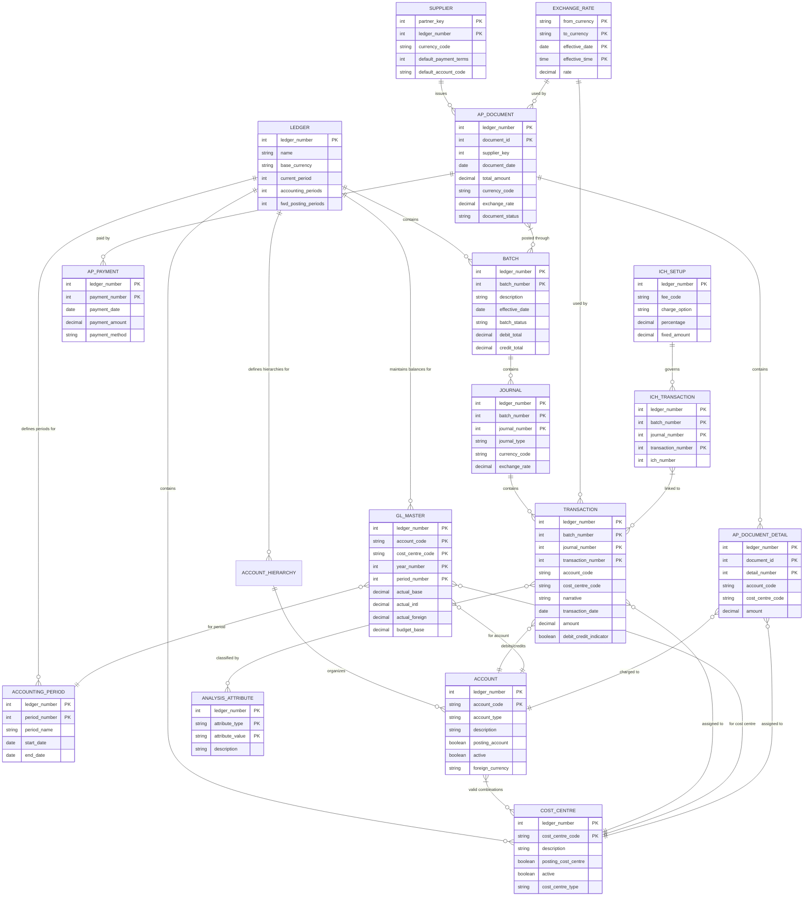

# Introduction to OpenPetra's Finance - Accounting Module

OpenPetra's Finance - Accounting Module serves as the financial backbone of this open-source software system designed specifically for non-profit organizations. This comprehensive accounting system enables organizations to manage their financial operations efficiently while adhering to accounting standards and regulatory requirements.

The accounting module provides a robust framework for handling various financial aspects including general ledger management, accounts payable, multi-currency operations, financial period management, and detailed financial reporting. It is designed with the unique needs of non-profit organizations in mind, supporting features like cost center tracking, fund accounting, and international clearing house operations that are essential for organizations operating across multiple countries.

At its core, OpenPetra's accounting system follows double-entry bookkeeping principles, where every financial transaction affects at least two accounts, maintaining the fundamental accounting equation (Assets = Liabilities + Equity). The system organizes financial data through a hierarchical chart of accounts and cost center structure, allowing for multi-dimensional reporting and analysis.

The module supports the complete financial cycle from transaction entry to period closing, including month-end and year-end processes. It handles multiple currencies with exchange rate management, facilitates accounts payable operations, and provides comprehensive reporting capabilities. The International Clearing House functionality is particularly valuable for international organizations, enabling efficient management of cross-border financial operations while minimizing currency exchange charges.

## OpenPetra Accounting System Architecture

## General Ledger Core Functionality

OpenPetra's General Ledger (GL) system forms the foundation of the accounting module, providing a comprehensive framework for recording, organizing, and reporting financial transactions. The GL system is built around several key components that work together to maintain financial integrity and provide accurate reporting.

At the heart of the GL system is the chart of accounts, a hierarchical structure that categorizes all financial transactions. OpenPetra supports flexible account hierarchies that can be customized to meet the specific needs of different organizations. Accounts are organized into types (Assets, Liabilities, Equity, Income, and Expenses) and can be further structured with parent-child relationships for reporting purposes.

Transaction processing in the GL follows a batch-journal-transaction model. Financial data is entered into batches, which contain one or more journals, which in turn contain individual transactions. This structure provides several advantages:
- It allows for efficient data entry and validation
- It supports transaction grouping for better organization
- It enables batch posting processes that maintain data integrity

The posting mechanism is a critical component that moves transactions from an unposted state to a posted state, at which point they update the general ledger master (GLM) records. The GLM maintains account balances for each combination of account code and cost center, tracking both current period and year-to-date values.

OpenPetra's GL system also includes robust validation to ensure data integrity. Transactions must balance (debits equal credits), reference valid accounts and cost centers, and fall within open accounting periods. The system supports both standard transactions and recurring transactions, allowing for efficient handling of regular financial entries.

Cost center tracking is another key feature, enabling organizations to monitor financial performance across different organizational units, projects, or funds. This multi-dimensional approach to financial data provides greater insight and supports more detailed reporting than traditional single-dimension accounting systems.

## Financial Period Management

OpenPetra implements a comprehensive financial period management system that handles the cyclical nature of accounting operations. This system manages accounting periods, fiscal years, and the processes required to close periods and years properly.

The accounting period structure in OpenPetra is flexible, typically organized into monthly periods within a fiscal year. Each ledger can be configured with its own fiscal year definition, which may or may not align with the calendar year. The system maintains information about the current period, closed periods, and forward posting periods, controlling what dates transactions can be posted to.

Month-end processing is a critical accounting function that OpenPetra handles through a structured workflow:

1. **Validation checks**: The system verifies that all batches are posted, suspense accounts are properly managed, and any required currency revaluations have been performed.
2. **Period advancement**: Once validations pass, the current period is advanced to the next month.
3. **Financial calculations**: Month-end may trigger specific calculations such as administrative fees or stewardship calculations for international operations.

Year-end processing is more complex, involving several additional steps:

1. **Income/expense reallocation**: At year-end, income and expense account balances are reset to zero, with net amounts transferred to equity accounts according to accounting principles.
2. **Balance carryforward**: Balance sheet account balances are carried forward to the new year.
3. **Period initialization**: The system sets up the new fiscal year with appropriate accounting periods.
4. **Forward posting adjustment**: Any transactions posted to future periods are adjusted to reflect the new fiscal year structure.

OpenPetra's period management system also handles special cases such as:
- **Period reopening**: Under certain circumstances, closed periods can be reopened for adjustments.
- **Forward posting**: The system allows transactions to be posted to future periods within configured limits.
- **Year-end reversals**: If necessary, the year-end process can be reversed to correct errors.

This structured approach to period management ensures financial data integrity while providing the flexibility needed to handle real-world accounting scenarios.

## Transaction Flow and Processing

## Multi-Currency Support and Exchange Rates

OpenPetra provides robust multi-currency functionality to support organizations operating in international environments. This capability is essential for non-profit organizations working across multiple countries with different currencies.

At the core of the multi-currency system is the concept of base currency and foreign currencies. Each ledger has a designated base currency (e.g., USD, EUR, GBP) that serves as the primary currency for financial reporting. Transactions can be entered in foreign currencies, and the system automatically converts them to the base currency using exchange rates.

The exchange rate management system in OpenPetra includes several key components:

1. **Daily Exchange Rates**: The system maintains a table of daily exchange rates between currency pairs. These rates can be entered manually or imported from external sources. Each rate includes:
   - From currency and to currency codes
   - Effective date and time
   - Exchange rate value
   - Usage tracking to identify which transactions reference each rate

2. **Corporate Exchange Rates**: In addition to daily rates, OpenPetra supports corporate exchange rates that can be used for standardized reporting across an organization, especially for international operations.

3. **Exchange Rate Application**: When transactions are entered in foreign currencies, the system:
   - Retrieves the appropriate exchange rate based on the transaction date
   - Calculates the equivalent amount in the base currency
   - Stores both the original foreign currency amount and the base currency equivalent
   - For reporting purposes, can also calculate international currency equivalents

4. **Currency Revaluation**: A critical aspect of multi-currency accounting is periodic revaluation of foreign currency balances. OpenPetra provides a revaluation process that:
   - Identifies accounts with foreign currency balances
   - Calculates the current value based on updated exchange rates
   - Creates adjustment entries to reflect exchange rate gains or losses
   - Posts these adjustments to designated revaluation accounts

5. **Currency Formatting**: The system handles proper formatting of currency values based on the currency's characteristics, including:
   - Appropriate decimal places (e.g., 2 for USD, 0 for JPY)
   - Correct currency symbols and positioning
   - Thousands separators according to locale conventions

The multi-currency capabilities extend throughout the system, affecting transaction entry, batch processing, financial reporting, and period-end operations. This comprehensive approach ensures that organizations can accurately track and report financial information across multiple currencies while maintaining accounting integrity.

## Accounts Payable Management

OpenPetra's Accounts Payable (AP) subsystem provides comprehensive functionality for managing supplier relationships, processing invoices, handling payments, and generating reports. This module integrates seamlessly with the General Ledger to ensure that all payable transactions are properly recorded in the financial system.

The AP system is built around several key components:

1. **Supplier Management**: The system maintains detailed supplier information including:
   - Contact details and addresses
   - Payment terms and methods
   - Default currency and exchange rate settings
   - Tax information and registration numbers
   - Bank account details for electronic payments

2. **Invoice Processing**: OpenPetra supports the complete invoice lifecycle:
   - Invoice entry with header information and line items
   - Distribution of expenses to appropriate accounts and cost centers
   - Support for both standard invoices and credit notes
   - Validation of invoice data including account codes and amounts
   - Optional analysis attributes for detailed expense tracking
   - Document attachment capabilities for storing digital copies

3. **Payment Processing**: The system provides flexible payment management:
   - Selection of invoices for payment based on due dates and available discounts
   - Batch payment processing for efficiency
   - Support for multiple payment methods (checks, electronic transfers)
   - Automatic calculation of payment amounts including discounts
   - Generation of remittance advices for suppliers
   - Payment reversal functionality when needed

4. **Aging Analysis**: OpenPetra includes tools for monitoring payables aging:
   - Classification of outstanding invoices by age (current, 30 days, 60 days, etc.)
   - Supplier aging reports showing outstanding balances by time period
   - Current payables reporting for cash flow management

5. **Integration with General Ledger**: The AP system integrates with the GL through:
   - Automatic creation of GL batches when invoices are posted
   - Proper accounting entries for expenses, liabilities, and payments
   - Consistent handling of multi-currency transactions
   - Maintenance of audit trails linking AP documents to GL transactions

6. **Reporting**: Comprehensive AP reporting capabilities include:
   - Supplier listings and contact information
   - Outstanding invoice reports
   - Payment history reports
   - Expense analysis by supplier, account, or cost center
   - Custom report generation through the reporting framework

The AP subsystem is designed to handle both simple and complex scenarios, including multi-currency operations, partial payments, and discount management. Its integration with the General Ledger ensures that all payable transactions are properly reflected in the organization's financial statements.

## Financial Reporting Structure

## Cost Center and Analysis Attributes

OpenPetra's financial system provides powerful multi-dimensional reporting capabilities through its cost center structure and analysis attributes framework. These features enable organizations to track and analyze financial data across multiple dimensions beyond the standard chart of accounts.

### Cost Center Structure

Cost centers in OpenPetra represent organizational units, projects, departments, or funds that need separate financial tracking. The system implements a hierarchical cost center structure with the following characteristics:

1. **Hierarchical Organization**: Cost centers can be organized in parent-child relationships, allowing for both detailed tracking at lower levels and consolidated reporting at higher levels.

2. **Cost Center Types**: The system supports different types of cost centers, such as:
   - Local cost centers for domestic operations
   - Foreign cost centers for international operations
   - Project-specific cost centers with time or budget constraints

3. **Posting Configuration**: Each cost center can be configured as:
   - A posting cost center that can receive direct transactions
   - A summary cost center that aggregates data from child cost centers

4. **Rollup Styles**: Cost centers support different rollup styles that determine how year-end processing handles their balances:
   - Always: Always roll up to parent cost centers
   - Standard: Roll up to standard cost centers
   - Never: Maintain separate balances without rolling up

5. **Account Restrictions**: Cost centers can be restricted to work with specific account codes through the "valid cost center combination" settings.

### Analysis Attributes

While cost centers provide one dimension of analysis, OpenPetra extends this capability through analysis attributes that offer additional dimensions for transaction classification:

1. **Attribute Types**: The system supports multiple types of analysis attributes that can be attached to transactions, such as:
   - Project codes
   - Donor restrictions
   - Program categories
   - Geographic regions
   - Functional classifications (administration, fundraising, programs)

2. **Flexible Assignment**: Analysis attributes can be assigned at the transaction level, providing granular classification without requiring separate account codes or cost centers.

3. **Percentage Allocation**: Transactions can be split across multiple analysis attributes using percentage allocations, allowing for precise distribution of income and expenses.

4. **Reporting Dimensions**: Analysis attributes serve as additional dimensions in financial reporting, enabling cross-tabulation and multi-dimensional analysis.

### Reporting Capabilities

The combination of cost centers and analysis attributes enables sophisticated reporting capabilities:

1. **Multi-dimensional Analysis**: Reports can be filtered or grouped by any combination of:
   - Account codes
   - Cost centers
   - Analysis attributes
   - Time periods

2. **Hierarchical Reporting**: Financial data can be presented at various levels of the cost center hierarchy, with drill-down capabilities.

3. **Cross-tabulation**: Reports can present data in matrix format, showing relationships between different dimensions.

4. **Comparative Analysis**: Data can be compared across different dimensions, periods, or attributes.

This robust framework for multi-dimensional financial tracking and reporting allows non-profit organizations to meet various stakeholder needs, including:
- Program-based reporting for donors
- Functional expense reporting for regulatory compliance
- Project-based reporting for grants
- Geographic reporting for international operations
- Fund accounting for restricted donations

By implementing these capabilities, OpenPetra provides the flexibility needed to support complex financial management requirements while maintaining the integrity of the core accounting system.

## International Clearing House (ICH) Operations

The International Clearing House (ICH) functionality in OpenPetra is a specialized component designed to handle cross-ledger transactions and international financial operations. This feature is particularly valuable for non-profit organizations operating across multiple countries with different currencies and accounting systems.

### Core ICH Functionality

The ICH system facilitates the efficient movement of funds between different parts of an international organization by:

1. **Cross-Ledger Transactions**: Enabling financial transactions that span multiple ledgers, typically representing different country offices or operational units.

2. **Currency Management**: Handling currency conversions between different base currencies used by various ledgers.

3. **Stewardship Calculation**: Automatically calculating administrative fees or stewardship charges based on configurable rules.

4. **Settlement Processing**: Managing the settlement of inter-office balances through centralized clearing processes.

### ICH Process Flow

The typical ICH process in OpenPetra follows these steps:

1. **Transaction Recording**: Financial transactions are recorded in their respective ledgers, with appropriate ICH codes to identify cross-ledger implications.

2. **Stewardship Calculation**: At period end, the system calculates stewardship fees based on transaction volume, amounts, and configured fee structures. This process:
   - Identifies transactions requiring stewardship calculations
   - Applies fee percentages or fixed amounts based on configuration
   - Creates appropriate journal entries to record fees
   - Updates transaction records with ICH numbers for tracking

3. **ICH Batch Generation**: The system generates ICH batches that:
   - Summarize cross-ledger transactions
   - Apply appropriate exchange rates
   - Create balancing entries in sending and receiving ledgers
   - Maintain audit trails for all cross-ledger movements

4. **HOSA File Generation**: Home Office Statement of Accounts (HOSA) files are generated to document and communicate cross-ledger transactions between offices.

5. **Settlement**: Periodic settlement processes clear outstanding balances between offices, typically through:
   - Netting of reciprocal balances
   - Identification of net amounts to be transferred
   - Generation of payment instructions
   - Recording of settlement transactions

### ICH Configuration

The ICH system is highly configurable to accommodate different organizational structures and policies:

1. **Fee Structures**: Organizations can define:
   - Percentage-based fees
   - Fixed amount fees
   - Minimum or maximum fee thresholds
   - Different fee rates for different transaction types or directions

2. **Account Mapping**: The system allows mapping of accounts between different ledgers to ensure consistent treatment of transactions.

3. **Settlement Policies**: Organizations can configure:
   - Settlement frequency (monthly, quarterly, etc.)
   - Settlement thresholds (minimum amounts for processing)
   - Settlement methods and instructions

### Benefits of ICH

The ICH functionality provides several key benefits for international organizations:

1. **Reduced Currency Exchange Costs**: By netting transactions before settlement, organizations minimize the number and volume of actual currency exchanges.

2. **Streamlined International Operations**: Automated processes reduce manual effort and error potential in cross-border financial operations.

3. **Consistent Administrative Fee Application**: Standardized stewardship calculations ensure fair and consistent application of administrative charges.

4. **Enhanced Financial Visibility**: Comprehensive reporting provides clear visibility into cross-border financial flows and balances.

5. **Improved Compliance**: Structured processes and documentation support compliance with international financial regulations and internal policies.

The ICH system represents one of OpenPetra's most distinctive features for international non-profit organizations, addressing complex financial challenges that are not typically handled by standard accounting software.

## Data Import/Export Capabilities

OpenPetra provides comprehensive data import and export capabilities to facilitate integration with other systems, support data migration, and enable efficient data management. These capabilities are particularly important for financial data, where accuracy and completeness are critical.

### Import Capabilities

The system supports various import mechanisms for financial data:

1. **GL Batch Import**: OpenPetra can import general ledger batches from CSV files, supporting:
   - Batch headers with descriptions and effective dates
   - Journal information including currency and transaction types
   - Individual transactions with account codes, cost centers, amounts, and narratives
   - Validation of imported data against ledger rules
   - Error reporting for invalid entries

2. **GL Transaction Import**: For adding transactions to existing batches, the system supports:
   - CSV-formatted transaction data
   - Mapping of CSV columns to transaction fields
   - Validation of account codes and cost centers
   - Currency conversion for foreign currency transactions

3. **Accounts Payable Import**: The AP module supports importing:
   - Supplier information
   - Invoice data
   - Payment information
   - Supporting document references

4. **Chart of Accounts Import**: The system allows importing:
   - Account hierarchies from YAML files
   - Account properties and relationships
   - Cost center structures

5. **Exchange Rate Import**: Currency exchange rates can be imported from:
   - CSV files
   - Standard format sources
   - Historical rate repositories

### Export Capabilities

OpenPetra provides various export options for financial data:

1. **GL Data Export**: The system can export:
   - Complete GL batches with all transaction details
   - Transaction listings with filtering options
   - Account balances and trial balances
   - Summarized financial data by account or cost center

2. **Financial Reports Export**: Reports can be exported in:
   - PDF format for formal presentation
   - HTML for web display
   - CSV for further analysis in spreadsheet applications
   - Custom formats for specific requirements

3. **Tax Reporting Exports**: Specialized exports for tax authorities:
   - GDPdU format for German tax requirements
   - Other country-specific formats as configured
   - Transaction details with required tax attributes

4. **HOSA File Export**: For international operations, the system exports:
   - Home Office Statement of Accounts files
   - Cross-ledger transaction summaries
   - Settlement information

### Data Formats and Validation

OpenPetra's import/export functionality includes robust data handling features:

1. **Format Support**:
   - CSV (comma-separated values) with configurable separators
   - YAML for structured data like account hierarchies
   - XML for complex data structures
   - HTML and PDF for formatted reports

2. **Validation Processes**:
   - Pre-import validation to identify format issues
   - Business rule validation during import
   - Error reporting with specific line and field references
   - Transaction validation ensuring accounting integrity

3. **Data Transformation**:
   - Field mapping to align external data with internal structures
   - Data type conversion and formatting
   - Currency and date format handling
   - Character encoding management

### Integration Capabilities

The import/export functionality facilitates integration with:

1. **External Accounting Systems**: For organizations transitioning to or from OpenPetra
2. **Banking Systems**: For payment processing and reconciliation
3. **Donor Management Systems**: For coordinated financial and relationship management
4. **Reporting Tools**: For advanced analytics and custom reporting
5. **Tax Software**: For compliance and filing requirements

These comprehensive data import/export capabilities ensure that OpenPetra can function effectively within an organization's broader technology ecosystem while maintaining the integrity and security of financial data.

## Accounting Data Model

[Generated by the Sage AI expert workbench: 2025-03-30 02:22:57  https://sage-tech.ai/workbench]: #