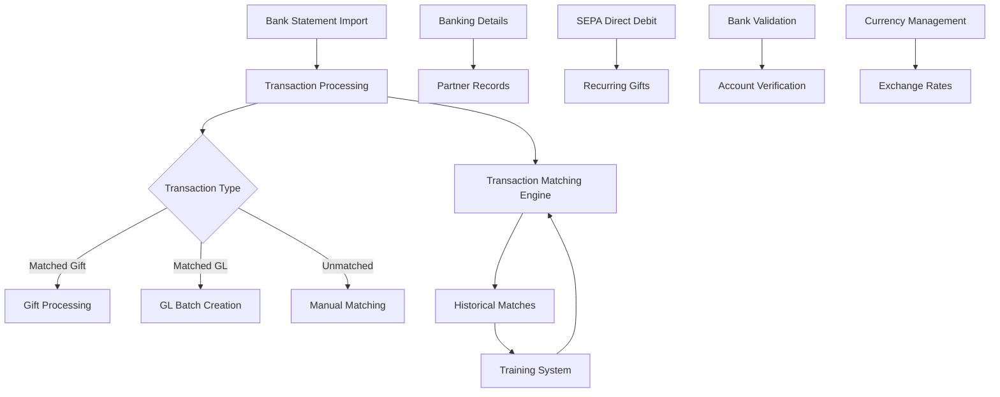
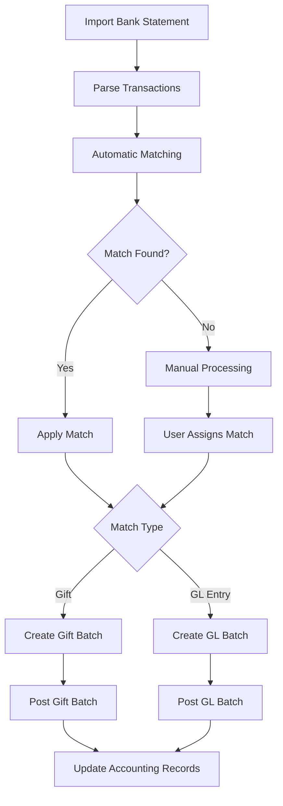
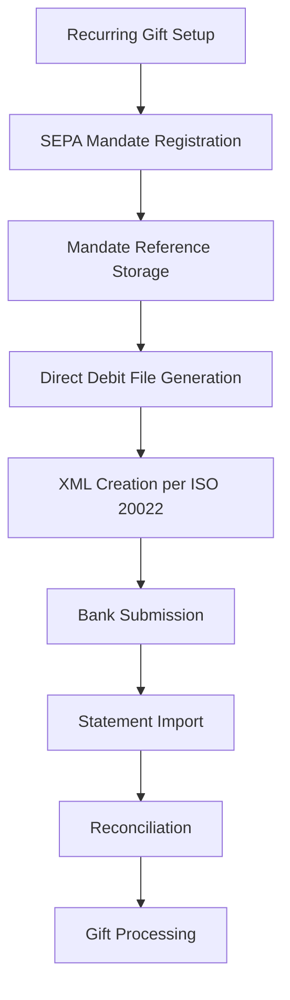

# Banking System Overview in OpenPetra

OpenPetra's banking module manages financial transactions between organizations and banks, supporting statement imports, account validation, and transaction matching.

## Banking Module Architecture

The banking module integrates multiple components to handle the complete lifecycle of financial transactions. Bank statements are imported through various formats, processed by the transaction engine, and then either automatically matched to gifts/GL entries or flagged for manual processing. The system maintains banking details linked to partner records and supports SEPA operations for recurring gifts.

## Bank Statement Import

OpenPetra supports multiple bank statement formats including CSV, CAMT.052, CAMT.053, and MT940, with configurable parsers for different banking standards. The system can handle various file encodings, date formats, and number formats to accommodate international banking requirements. Import functionality is implemented through specialized parsers for each format:

- CSV imports with configurable column mapping
- CAMT formats (ISO 20022 standard) with XML parsing
- MT940 (SWIFT) format with specialized tag processing
- Support for ZIP archives containing multiple statement files

The import process extracts transaction details including dates, amounts, descriptions, and account information, organizing them by statement period and transaction type.

## Transaction Matching

The system automatically matches imported bank transactions with gifts using donor information, amounts, and dates to streamline reconciliation. The matching engine employs several strategies:

1. **Bank account matching**: Correlates IBAN/BIC or traditional account numbers with donor records
2. **Description analysis**: Parses transaction descriptions for donor information and gift purposes
3. **Amount matching**: Identifies exact and similar amounts between transactions and gifts
4. **Historical pattern recognition**: Learns from previous matches to improve future matching accuracy

When matches are found, transactions can be automatically processed as gifts or GL entries, reducing manual data entry and improving accuracy.

## Bank Transaction Processing Flow

The transaction processing flow begins with importing bank statements and parsing individual transactions. The system attempts automatic matching against existing gifts and GL entries. Successfully matched transactions are processed according to their type, while unmatched transactions require manual intervention. Once processed, the resulting batches are posted to update accounting records.

## Bank Account Validation

OpenPetra implements comprehensive validation for bank identifiers including IBAN and BIC codes according to international standards. The validation includes:

- IBAN structure validation with country-specific length checks
- Checksum verification using MOD-97 algorithm
- BIC format validation (8 or 11 characters)
- Country-specific account number validation (e.g., Dutch accounts using modulo-11 check)

These validations ensure data integrity and compliance with international banking standards, reducing errors in financial transactions.

## Currency Management

The system handles multiple currencies with exchange rate tables, supporting both daily operational rates and corporate accounting rates. Key features include:

- Maintenance of historical exchange rates for accurate reporting
- Support for both daily and corporate (accounting) exchange rates
- Automatic recalculation of transaction amounts when rates change
- Currency-specific rounding rules based on standard decimal places
- Bidirectional rate lookups to find optimal conversion paths

The currency management system ensures accurate financial reporting across multiple currencies, essential for international organizations.

## SEPA Integration

OpenPetra integrates with SEPA (Single Euro Payments Area) for direct debit processing of recurring gifts. The system generates standardized SEPA XML files according to the ISO 20022 pain.008.001.02 schema, including creditor information, mandate references, and payment details. This enables automated collection of recurring donations through the European banking system, with proper tracking of mandate information and sequence types (first, recurring, one-off, or final payments).

## Banking Data Structure

The database stores banking details, transaction records, and matching information with relationships to partner and gift data. Key tables include:

- `p_banking_details`: Stores account numbers, IBANs, and BICs
- `p_partner_banking_details`: Links banking details to partners
- `p_banking_type`: Defines account types (bank account, credit card, savings)
- `p_banking_details_usage_type`: Specifies how accounts are used (main, donations)
- `a_ep_statement`: Stores imported bank statements
- `a_ep_transaction`: Contains individual transactions from statements
- `a_ep_match`: Records matches between transactions and gifts/GL entries

This structure supports the complete lifecycle of banking operations while maintaining relationships with partner and gift data.

## Payment Processing

OpenPetra supports various payment methods including cheques and remittance advices with document generation capabilities. The system can:

- Generate remittance advice documents for suppliers
- Create combined remittance-cheque outputs
- Process multiple invoices per payment
- Handle partial payment scenarios
- Format payment information for printing or electronic delivery

These capabilities enable organizations to manage outgoing payments efficiently while maintaining proper documentation for accounting purposes.

[Generated by the Sage AI expert workbench: 2025-03-30 02:22:57  https://sage-tech.ai/workbench]: #