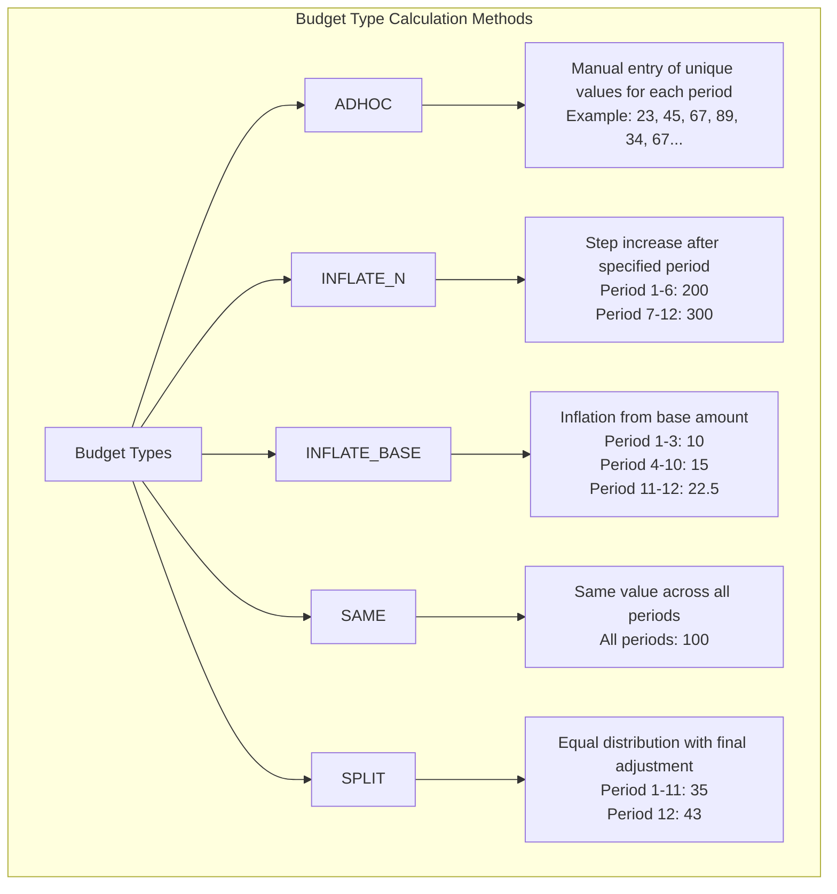
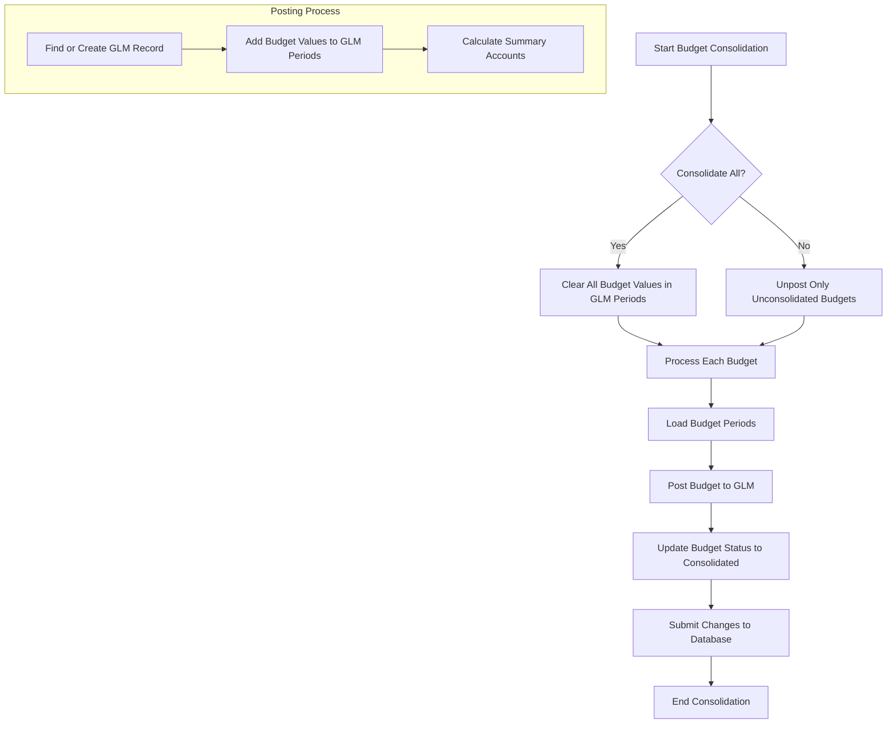
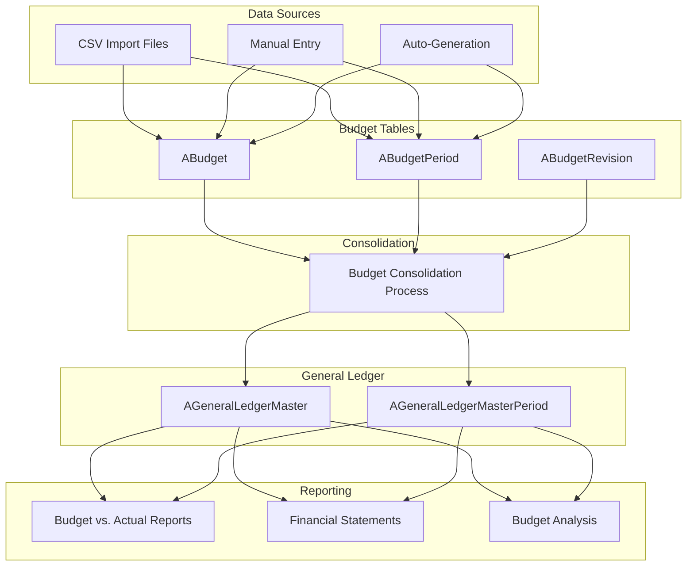
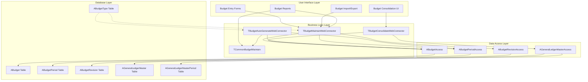

# Finance - Budgeting

## Budget Types and Models

OpenPetra supports five distinct budget types: ADHOC, INFLATE_N, INFLATE_BASE, SAME, and SPLIT, each representing different approaches to budget allocation across accounting periods. These budget types provide flexibility in how organizations plan and distribute their financial resources throughout the fiscal year.

The ADHOC budget type allows for manual entry of unique budget values for each accounting period, providing maximum flexibility for organizations with irregular spending patterns. INFLATE_N enables step increases after a specified number of periods, useful for modeling scheduled cost increases or revenue growth. INFLATE_BASE calculates budget values based on inflation from a base amount, ideal for expenses that grow at a predictable rate. The SAME budget type applies identical values across all periods, simplifying planning for consistent monthly expenses. Finally, SPLIT distributes a total budget amount across periods, typically with equal allocations for most periods and adjustments in the final period to balance the total.

These budget models support different financial planning approaches, from simple flat allocations to sophisticated inflation-based projections, enabling organizations to create realistic financial forecasts based on their specific operational patterns.

## Budget Type Calculation Methods

The diagram illustrates how each budget type calculates and distributes values across accounting periods. ADHOC allows complete customization with different values for each period, providing maximum flexibility for irregular expenses or revenues. INFLATE_N implements a step change model where values increase at specific period boundaries, useful for modeling scheduled cost increases. INFLATE_BASE applies percentage-based increases from an initial base amount, ideal for modeling inflation effects. The SAME type maintains consistent values across all periods, simplifying planning for fixed monthly costs. SPLIT distributes a total amount across periods, typically evenly with adjustments in the final period to achieve the desired total. These calculation methods allow organizations to select the most appropriate approach based on the nature of their financial activities and planning requirements.

## Budget Data Structure

Budgets are organized by ledger, year, revision, cost center, and account code, with budget periods storing monthly values and supporting up to 14 accounting periods. The core of the budget data structure is the ABudget table, which defines the budget header information including the budget sequence (a unique identifier), ledger number, fiscal year, revision number, cost center code, account code, and budget type. This header connects to the ABudgetPeriod table, which stores the actual monetary values for each accounting period.

The system supports multiple budget revisions, allowing organizations to maintain different versions of their budgets, though the current implementation primarily uses revision 0. Budget data is stored with decimal precision to accommodate various currency requirements, and the system can handle both standard 12-month fiscal years and extended fiscal years with up to 14 accounting periods.

Budget records are linked to the general ledger structure through account codes and cost centers, enabling integration with the broader financial reporting system. When budgets are consolidated, the values are transferred to the AGeneralLedgerMasterPeriod table, where they can be compared with actual financial results for variance analysis and financial reporting.

## Budget Import and Export

OpenPetra provides functionality to import budget data from CSV files and export budgets, supporting various formats and handling different budget types appropriately. The import process accepts CSV files containing budget data organized by cost center, account code, budget type, year, and period values. The system validates the imported data against existing cost centers and accounts, ensuring data integrity before committing changes to the database.

For budget types like SAME and SPLIT, the import process can accept either a single value (which is then distributed according to the budget type rules) or individual period values. The ADHOC budget type requires values for each period, while INFLATE_BASE and INFLATE_N types can be imported with their specific pattern definitions.

The export functionality generates CSV files containing budget data, formatting the output based on the budget type. For SAME and SPLIT types, the export can be configured to show either the distributed values for each period or a simplified representation with just the total amount. The system supports exporting budgets for specific fiscal years or across multiple years, facilitating long-term financial planning and analysis.

Both import and export functions handle currency formatting according to the user's locale settings, ensuring consistent representation of monetary values across different regional formats.

## Budget Consolidation Process

The flowchart illustrates how budgets are consolidated from individual budget records into the general ledger master periods for financial reporting. The process begins with a decision to either perform a complete reconsolidation (clearing all existing budget values) or a selective update (only processing budgets marked as unconsolidated). For a complete reconsolidation, the system clears all budget values from the general ledger master periods, while for selective updates, it unposted only the budgets that need updating.

The system then processes each budget record, loading its associated period values. For each budget, it either finds the corresponding general ledger master (GLM) record or creates one if it doesn't exist. Budget values are then added to the appropriate GLM periods, with calculations performed to ensure proper distribution according to the budget type. The system also handles budget values for summary accounts and cost centers by aggregating values from their constituent accounts.

After all budgets are processed, their status is updated to indicate they've been consolidated, and all changes are committed to the database in a single transaction to maintain data integrity. This consolidation process creates a unified view of budget data in the general ledger, enabling comparison with actual financial results and supporting comprehensive financial reporting.

## Budget Auto-Generation

The system can automatically generate budgets for future periods based on historical data, applying different calculation methods according to the budget type. This auto-generation capability streamlines the budgeting process by using existing financial data to create projections for upcoming fiscal years.

For ADHOC budgets, the system copies actual values from previous periods for completed months and either uses budget values or actuals from the prior year for future months, depending on the forecast type selected. INFLATE_BASE budgets use actual values from the previous year as a base and apply inflation factors to generate new budget figures. SAME and SPLIT budget types calculate an average value based on historical data and distribute it evenly across all periods, with SPLIT making adjustments to the final period to achieve the desired total.

The INFLATE_N budget type identifies period boundaries where values change in the historical data and applies similar step changes to the generated budget. The system analyzes the pattern of increases and calculates appropriate values for each segment of the fiscal year.

Budget auto-generation can be configured to use either actual financial results or previous budget figures as the basis for calculations, providing flexibility in how organizations approach their financial planning. This functionality is particularly valuable for organizations with stable operational patterns, as it reduces the manual effort required for annual budget preparation.

## Budget Data Flow

This diagram shows how budget data moves through the system from import/creation through consolidation to financial reporting. The process begins with data sources: CSV imports, manual entry through the user interface, or auto-generation based on historical data. These sources populate the budget tables (ABudget for header information, ABudgetPeriod for period values, and ABudgetRevision for version control).

Once budget data is in the system, the consolidation process transfers it to the general ledger structure. This process creates or updates records in the AGeneralLedgerMaster and AGeneralLedgerMasterPeriod tables, which integrate budget data with the broader financial system. The consolidation process handles both the initial posting of budgets and subsequent updates when budget figures change.

After consolidation, the budget data becomes available for reporting and analysis. The system supports various financial reports including budget versus actual comparisons, standard financial statements with budget columns, and specialized budget analysis reports. These reports draw data from both the budget-specific tables and the consolidated general ledger tables, providing a comprehensive view of the organization's financial performance against its plans.

The data flow is designed to maintain data integrity throughout the process, with validation at each stage and transaction management to ensure consistency between the budget and general ledger data structures.

## Budget Comparison and Analysis

OpenPetra supports comparing budget figures with actual financial data across accounting periods, providing variance analysis for financial management. This capability is essential for monitoring organizational performance against financial plans and making informed decisions based on deviations from budget expectations.

The system calculates variances between budgeted and actual amounts for each account and cost center combination, presenting both absolute differences and percentage variances. These comparisons can be performed at various levels of detail, from individual accounts to summary accounts and from specific cost centers to organizational divisions.

Budget comparison reports can be generated for specific periods or year-to-date, allowing organizations to analyze both short-term performance and cumulative results throughout the fiscal year. The system supports different currency views (base, international, or transaction currencies) to accommodate organizations operating in multiple currency environments.

Advanced analysis features include trend identification across multiple periods, highlighting significant variances that exceed configurable thresholds, and drill-down capabilities to investigate the sources of variances. These tools help financial managers identify areas requiring attention and support data-driven decision-making.

By integrating budget and actual financial data in a unified reporting framework, OpenPetra enables organizations to maintain effective financial control and adapt their operations based on real-time performance against budget targets.

## Multi-Year Budget Planning

The system supports budget planning across multiple fiscal years, allowing organizations to create and manage long-term financial projections. This multi-year capability is essential for strategic planning, capital projects, and ensuring financial sustainability beyond the current fiscal period.

OpenPetra's budget structure includes a year field that allows budget data to be associated with specific fiscal years, enabling organizations to maintain budgets for the current year, next year, and potentially additional future years. The budget import and export functions support multi-year data, facilitating the transfer of long-term budget information between OpenPetra and external planning tools.

The budget auto-generation functionality can use historical data from previous years to create projections for future periods, streamlining the creation of multi-year budget forecasts. This is particularly valuable for organizations with stable operational patterns or those implementing long-term strategic plans with predictable financial implications.

Reports can compare budgets across multiple years to identify trends and analyze year-over-year changes in financial plans. This supports strategic decision-making by providing visibility into the long-term financial trajectory of the organization.

Multi-year budget planning in OpenPetra helps organizations maintain financial stability by anticipating future needs, planning for capital investments, and ensuring that short-term decisions align with long-term financial objectives.

## Budget Management Architecture

This technical architecture diagram shows the components involved in budget management, including data tables, business logic, and user interface elements. The architecture follows a layered design pattern, separating concerns between data storage, business logic, and presentation.

At the database layer, the core tables include ABudget (storing budget header information), ABudgetPeriod (containing period-specific budget values), ABudgetRevision (managing budget versions), ABudgetType (defining the available budget types), and the general ledger tables that store consolidated budget data.

The data access layer provides controlled interaction with these tables through specialized classes like ABudgetAccess and AGeneralLedgerMasterAccess, implementing data validation and transaction management to maintain data integrity.

The business logic layer contains the primary components that implement budget functionality: TBudgetMaintainWebConnector handles basic budget operations including loading, saving, importing, and exporting; TBudgetConsolidateWebConnector manages the consolidation process; TBudgetAutoGenerateWebConnector implements budget generation for future periods; and TCommonBudgetMaintain provides shared utility functions for budget calculations.

The user interface layer presents budget functionality to users through forms for budget entry and management, import/export interfaces, reporting tools, and consolidation controls. These components interact with the business logic layer through well-defined interfaces, ensuring separation of concerns and maintainability.

This architecture supports the complete budget lifecycle from creation through consolidation to reporting, with appropriate security controls and transaction management at each level.

## Budget Security and Permissions

Budget functionality is protected by the FINANCE module permissions, with different permission levels controlling access to view, create, edit, and consolidate budgets. This security model ensures that only authorized users can perform budget-related operations, maintaining the integrity of financial planning data.

The system implements a hierarchical permission structure within the FINANCE module. The FINANCE-1 permission level grants read-only access to budget data, allowing users to view budgets and generate reports without making changes. This is appropriate for managers and staff who need visibility into financial plans but are not responsible for budget creation or maintenance.

The FINANCE-3 permission level provides full access to budget functionality, including creating and editing budgets, importing and exporting budget data, generating budgets for future periods, and performing budget consolidation. This higher permission level is typically assigned to financial administrators and budget managers who are responsible for maintaining the organization's financial plans.

Budget security is enforced at the server level through the RequireModulePermission attribute on web connector methods, ensuring that permission checks cannot be bypassed by client-side modifications. Additional security controls may restrict access to specific ledgers or cost centers based on user roles, providing granular control over which parts of the budget structure individual users can access.

This permission-based security model protects sensitive financial planning data while allowing appropriate access for users with different responsibilities in the budgeting process.

[Generated by the Sage AI expert workbench: 2025-03-30 02:22:57  https://sage-tech.ai/workbench]: #