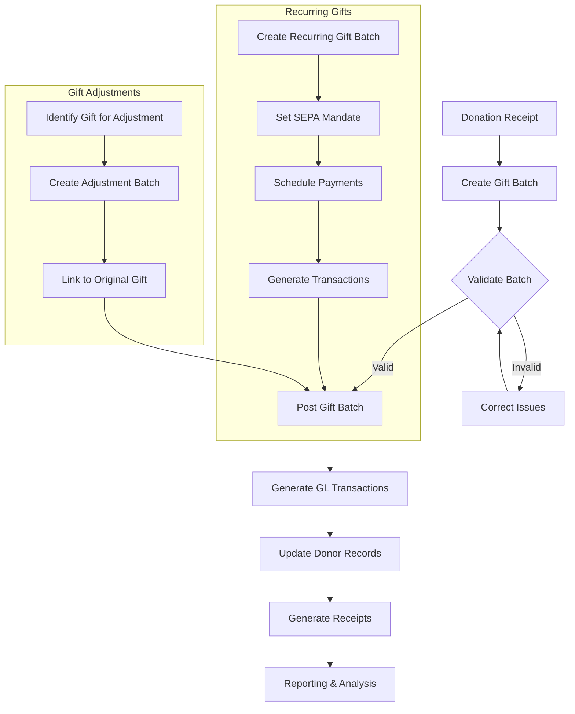
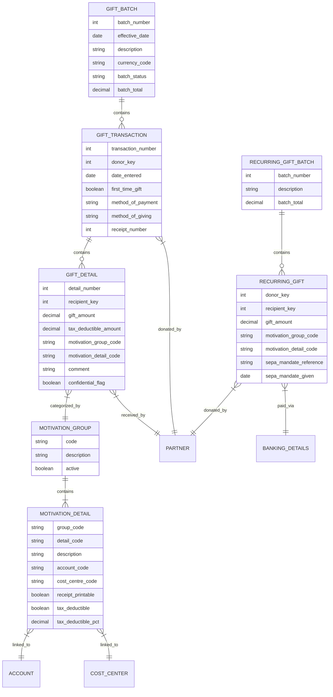
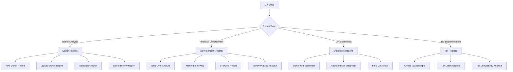

# Finance - Gift Processing: A Comprehensive Analysis

## Overview of Gift Processing

OpenPetra's gift processing system manages the complete lifecycle of donations, from initial receipt through processing, acknowledgment, and reporting, supporting both one-time and recurring gifts. The system provides a robust framework for non-profit organizations to track donations, generate tax receipts, analyze giving patterns, and maintain donor relationships. Gift processing in OpenPetra incorporates sophisticated features including batch management, motivation categorization, tax deductibility calculations, and comprehensive reporting capabilities. The system is designed to handle various donation types, currencies, and payment methods while maintaining data integrity and providing audit trails throughout the donation lifecycle.

## Gift Processing Workflow

The gift processing workflow in OpenPetra follows a structured path from donation receipt through batch creation, validation, posting, and receipt generation. When a donation arrives, it's entered into a gift batch which serves as a container for multiple gifts. The system validates the batch data, checking for proper recipient information, valid motivation codes, and correct amounts. Once validated, the batch is posted, which generates corresponding general ledger transactions and updates donor records. The system then produces receipts for donors and makes the gift data available for reporting and analysis.

For recurring gifts, OpenPetra provides additional functionality to set up SEPA mandates, schedule regular payments, and automatically generate transactions at the appropriate intervals. The system also supports gift adjustments when corrections are needed, creating adjustment batches that maintain links to the original gifts for proper audit trails.

## Gift Batch Management

Gift batches serve as containers for organizing donations, allowing for efficient processing, validation, and posting of multiple gifts while maintaining data integrity and audit trails. In OpenPetra, gift batches provide a structured approach to handling donations, ensuring that related transactions are grouped together and processed as a unit. This batch-oriented approach offers several advantages:

1. **Data Entry Efficiency**: Multiple gifts can be entered into a single batch, streamlining the data entry process.
2. **Validation Controls**: Batches undergo validation checks to ensure all required information is present and accurate before posting.
3. **Balanced Processing**: Each batch maintains internal balancing to ensure financial integrity.
4. **Audit Trail**: Batches provide a clear record of when and how donations were processed.
5. **Error Management**: If issues are found, entire batches can be corrected before posting to the general ledger.

The system supports different batch types, including standard gift batches for one-time donations and recurring gift batches for scheduled donations with SEPA direct debit integration. Each batch contains header information (batch number, date, description, currency) and multiple gift transactions, each potentially containing multiple gift details that specify the recipients and purposes of the donations.

Batch management functionality includes creating new batches, adding transactions, validating data, posting completed batches, and generating appropriate financial records. The batch status (e.g., unposted, posted) determines what actions can be performed, with posted batches becoming read-only to maintain data integrity.

## Motivation Groups and Details

OpenPetra categorizes gifts using a two-level hierarchy of motivation groups and details, enabling organizations to track donation purposes and apply appropriate accounting rules. This hierarchical structure provides a flexible framework for classifying donations based on their intended purpose, which is essential for proper financial management and reporting.

Motivation groups represent broad categories of donations, such as "GIFT" for standard gifts or "DONATION" for general donations. Within each group, motivation details provide more specific classifications, such as "FIELD" for field operations, "KEYMIN" for key ministry support, "PERSONAL" for personal use, "SUPPORT" for worker support, or "UNDESIG" for undesignated gifts.

This two-level structure allows organizations to:

1. **Track Donation Purposes**: Clearly identify the intended purpose of each donation
2. **Apply Accounting Rules**: Associate specific account codes and cost centers with each motivation detail
3. **Handle Tax Deductibility**: Set appropriate tax deductibility rules for different types of donations
4. **Generate Reports**: Analyze donation patterns by purpose and category
5. **Support Special Handling**: Flag certain donation types for special processing (e.g., membership fees, sponsorships, worker support)

Each motivation detail is linked to specific general ledger accounts and cost centers, ensuring that when gifts are posted, the financial transactions are directed to the appropriate accounting entities. This connection between donation purposes and financial accounts is crucial for maintaining accurate financial records and generating meaningful reports.

The system also supports special flags for certain motivation types, such as membership fees, sponsorships, and worker support, which may require additional processing or have specific tax implications.

## Gift Data Structure

The gift data structure in OpenPetra is organized in a hierarchical manner, with gift batches at the top level containing multiple gift transactions, which in turn contain multiple gift details. This structure allows for efficient processing and reporting of donations while maintaining relationships between donors, recipients, and financial accounts.

The core tables in this structure include:

1. **Gift Batch**: Contains batch-level information such as batch number, effective date, description, currency, status, and total amount.

2. **Gift Transaction**: Represents individual donations with transaction number, donor information, date entered, payment method, and receipt information.

3. **Gift Detail**: Contains the specific allocation details of each gift, including recipient, amount, tax deductibility, motivation codes, and comments.

4. **Motivation Group/Detail**: Provides the categorization framework for gifts, linking each gift detail to appropriate account codes and cost centers.

5. **Recurring Gift Batch/Gift**: Similar structure to regular gifts but designed for scheduled recurring donations with SEPA mandate information.

The relationships between these entities ensure that:
- Each gift transaction is associated with a specific donor (partner)
- Each gift detail is directed to a specific recipient (partner)
- Each gift detail is categorized with motivation codes that determine accounting treatment
- Motivation details link gifts to the appropriate general ledger accounts and cost centers
- Recurring gifts maintain banking details for automated processing

This comprehensive data structure supports the full range of gift processing functionality while maintaining data integrity and providing the foundation for detailed financial reporting and donor analysis.

## Tax Deductibility Processing

The system calculates and tracks tax-deductible portions of gifts based on configurable percentages, supporting different tax regulations and generating appropriate documentation. OpenPetra's tax deductibility processing is a critical component for non-profit organizations that need to provide donors with accurate tax documentation for their contributions.

The tax deductibility functionality operates at multiple levels:

1. **Configuration**: Each motivation detail can be configured with a default tax deductibility percentage (0-100%), which determines what portion of gifts with that motivation code is considered tax-deductible.

2. **Calculation**: When a gift is processed, the system automatically calculates:
   - The tax-deductible amount based on the configured percentage
   - The non-deductible amount (the remainder)
   - These calculations are performed for transaction currency, base currency, and international currency values

3. **Recipient-specific Settings**: Tax deductibility can also be configured at the recipient level, allowing different tax treatment for gifts to different entities within the organization.

4. **Adjustment Capability**: The system supports adjusting tax deductibility percentages for specific gifts when necessary, creating proper audit trails for these changes.

5. **Documentation**: OpenPetra generates tax receipts and annual statements that clearly indicate:
   - Total gift amounts
   - Tax-deductible portions
   - Non-deductible portions
   - Required legal statements based on local tax regulations

The tax deductibility processing system is particularly important for international organizations that operate across multiple tax jurisdictions, as it can handle different tax rules for different countries and regions. The system ensures that donors receive accurate tax documentation that complies with local regulations, while the organization maintains proper financial records of the tax implications of each donation.

## Gift Receipt Generation

OpenPetra generates customizable gift receipts for donors, supporting both individual transaction receipts and annual consolidated statements with tax information. The receipt generation system is designed to provide donors with timely acknowledgment of their contributions while meeting tax documentation requirements.

Key features of the gift receipt generation system include:

1. **Multiple Receipt Types**:
   - Individual gift receipts for single donations
   - Annual consolidated receipts summarizing all gifts within a year
   - Thank-you letters without tax information

2. **Customizable Templates**:
   - HTML-based templates that can be customized for different purposes
   - Support for organization logos and signature images
   - Placeholder system for dynamic content insertion
   - Conditional sections that can be included or excluded based on receipt type

3. **Delivery Options**:
   - PDF generation for printing or electronic distribution
   - Email delivery with customizable subject and message text
   - Batch printing for efficient processing

4. **Content Customization**:
   - Donor information including name and address
   - Gift details including dates, amounts, and purposes
   - Tax information including deductible and non-deductible portions
   - Legal statements required for tax compliance
   - Custom messages or appeals

5. **Receipt Management**:
   - Tracking of receipt generation status
   - Receipt numbering for audit purposes
   - Filtering options to generate receipts for specific donors or date ranges

The system also supports donor preferences for receipt frequency (e.g., per gift, monthly, annually) and delivery method (print or email). Organizations can store default templates and customize the receipt generation process based on their specific needs and local requirements.

The receipt generation functionality integrates with the broader gift processing system, ensuring that receipts accurately reflect the gift data in the system and providing donors with the documentation they need for tax purposes while strengthening donor relationships through timely acknowledgment.

## Gift Reporting System

OpenPetra provides a comprehensive gift reporting system that includes donor analysis, gift statements, financial development reports, and tax documentation. The reporting system enables organizations to gain insights into their donation patterns, track financial development, and provide necessary documentation to donors and regulatory authorities.

The gift reporting system is organized into several categories:

1. **Donor Analysis Reports**:
   - New Donor Report: Identifies first-time donors within a specified period
   - Lapsed Donor Report: Highlights donors who have stopped giving regularly
   - Top Donor Report: Analyzes donors by gift amount or frequency
   - Donor History Report: Shows complete giving history for specific donors

2. **Financial Development Reports**:
   - Gifts Over Amount: Lists donors who have given above a specified threshold
   - Method of Giving: Analyzes donations by payment method
   - SYBUNT Report (Some Year But Unfortunately Not This year): Identifies donors who gave in previous years but not the current year
   - Monthly Giving Analysis: Tracks recurring gift patterns and trends

3. **Gift Statement Reports**:
   - Donor Gift Statement: Shows all gifts from a specific donor
   - Recipient Gift Statement: Shows all gifts received by a specific recipient
   - Field Gift Totals: Summarizes gifts by field or region

4. **Tax Documentation Reports**:
   - Annual Tax Receipts: Generates consolidated tax receipts for donors
   - Tax Claim Reports: Provides documentation for tax deduction claims
   - Tax Deductibility Analysis: Analyzes the tax implications of donations

The reporting system supports various filtering options, including date ranges, amount thresholds, motivation codes, and donor/recipient selection. Reports can be generated in different formats (HTML, PDF, Excel) and can include detailed transaction information or summarized totals depending on the organization's needs.

These reports provide valuable insights for fundraising strategies, donor relationship management, and financial planning, while ensuring compliance with tax regulations and reporting requirements.

## Recurring Gift Management

The system supports scheduled recurring donations with SEPA direct debit integration, allowing organizations to manage regular giving programs efficiently. OpenPetra's recurring gift management functionality provides a comprehensive solution for handling ongoing donations, which are often a critical source of stable funding for non-profit organizations.

Key features of the recurring gift management system include:

1. **Recurring Gift Setup**:
   - Creation of recurring gift batches to organize scheduled donations
   - Specification of donor, recipient, amount, and frequency
   - Assignment of appropriate motivation codes for proper accounting
   - Storage of donor banking details for automated processing

2. **SEPA Direct Debit Integration**:
   - Support for Single Euro Payments Area (SEPA) direct debit mandates
   - Storage of mandate references and signature dates
   - Generation of SEPA-compliant direct debit files for bank submission
   - Tracking of mandate status and history

3. **Payment Scheduling**:
   - Flexible scheduling options for different payment frequencies
   - Automatic generation of gift transactions based on schedule
   - Support for different start and end dates for recurring gifts

4. **Processing Workflow**:
   - Creation of recurring gift batches
   - Generation of regular gift transactions from recurring templates
   - Submission of SEPA direct debit files to financial institutions
   - Posting of resulting gift transactions to the general ledger

5. **Management Features**:
   - Modification of recurring gift details when donor preferences change
   - Cancellation or suspension of recurring gifts when needed
   - Tracking of successful and failed payments
   - Reporting on recurring gift performance and trends

The recurring gift management system integrates with the broader gift processing functionality, ensuring that recurring donations follow the same validation, posting, and receipt generation processes as one-time gifts. This integration provides a consistent approach to gift management while addressing the specific requirements of recurring donations.

For organizations operating in Europe, the SEPA direct debit integration is particularly valuable, as it streamlines the process of collecting recurring donations while ensuring compliance with European banking regulations.

## Gift Adjustment and Reversal

OpenPetra provides functionality to adjust or reverse posted gifts while maintaining financial integrity and audit trails through the creation of adjustment transactions. This capability is essential for handling corrections, refunds, or changes to gift allocations after the original transactions have been posted to the general ledger.

The gift adjustment and reversal system includes several key components:

1. **Types of Adjustments**:
   - Complete gift reversal: Fully negates a previous gift
   - Partial adjustment: Modifies specific aspects of a gift such as amount or recipient
   - Field change: Redirects a gift to a different recipient
   - Tax deductibility adjustment: Updates the tax-deductible percentage of a gift

2. **Adjustment Process**:
   - Identification of gifts requiring adjustment
   - Creation of adjustment batches linked to original transactions
   - Generation of offsetting entries to maintain financial balance
   - Creation of new entries reflecting the corrected information
   - Proper documentation of adjustment reasons and approvals

3. **Financial Integrity**:
   - Automatic creation of corresponding general ledger transactions
   - Maintenance of balanced accounting entries
   - Preservation of original transaction history
   - Clear linkage between original and adjustment transactions

4. **Audit Trail Features**:
   - Tracking of who made adjustments and when
   - Documentation of reasons for adjustments
   - Flagging of modified gift details for reporting purposes
   - Ability to trace the complete history of a gift including all adjustments

5. **Receipt Handling**:
   - Generation of corrected receipts when necessary
   - Clear indication of adjusted or reversed gifts on donor statements
   - Proper handling of tax implications for adjusted gifts

The adjustment and reversal functionality ensures that organizations can maintain accurate financial records while addressing the practical realities of gift processing, where corrections and changes are sometimes necessary. By providing a structured approach to adjustments with proper controls and audit trails, OpenPetra helps organizations maintain data integrity and financial transparency while effectively managing their donation processes.

## Donor Analysis and Reporting

Advanced donor analysis tools help organizations understand giving patterns, identify top donors, track lapsed donors, and analyze donation trends for strategic development. OpenPetra's donor analysis capabilities provide valuable insights that can inform fundraising strategies, donor relationship management, and financial planning.

Key features of the donor analysis and reporting system include:

1. **Giving Pattern Analysis**:
   - Frequency of donations (regular vs. occasional)
   - Average gift amounts over time
   - Preferred donation methods and motivation categories
   - Seasonal giving patterns and year-over-year comparisons

2. **Donor Segmentation**:
   - Top donors by amount or frequency
   - First-time donors vs. recurring supporters
   - Lapsed donors who have stopped giving
   - Donors by geographic region or demographic characteristics

3. **Trend Analysis**:
   - Growth or decline in donation volumes
   - Changes in average gift amounts
   - Shifts in donation purposes or recipients
   - Response rates to specific appeals or campaigns

4. **Strategic Reports**:
   - SYBUNT (Some Year But Unfortunately Not This year) reports to identify donors who gave previously but not in the current year
   - LYBUNT (Last Year But Unfortunately Not This year) reports for more recent lapsed donors
   - New donor acquisition reports to track fundraising effectiveness
   - Donor retention analysis to measure ongoing engagement

5. **Financial Development Metrics**:
   - Total giving by period, purpose, or recipient
   - Comparative analysis across different time periods
   - Projection of future giving based on historical patterns
   - Return on investment for fundraising initiatives

These analytical capabilities are supported by flexible reporting tools that allow organizations to customize reports based on their specific needs. Reports can be filtered by various criteria including date ranges, gift amounts, motivation codes, and donor characteristics.

The donor analysis and reporting functionality helps organizations move beyond basic gift processing to strategic donor relationship management. By understanding giving patterns and donor behavior, organizations can develop more effective fundraising strategies, improve donor retention, and ultimately increase their financial sustainability.

[Generated by the Sage AI expert workbench: 2025-03-30 02:22:57  https://sage-tech.ai/workbench]: #