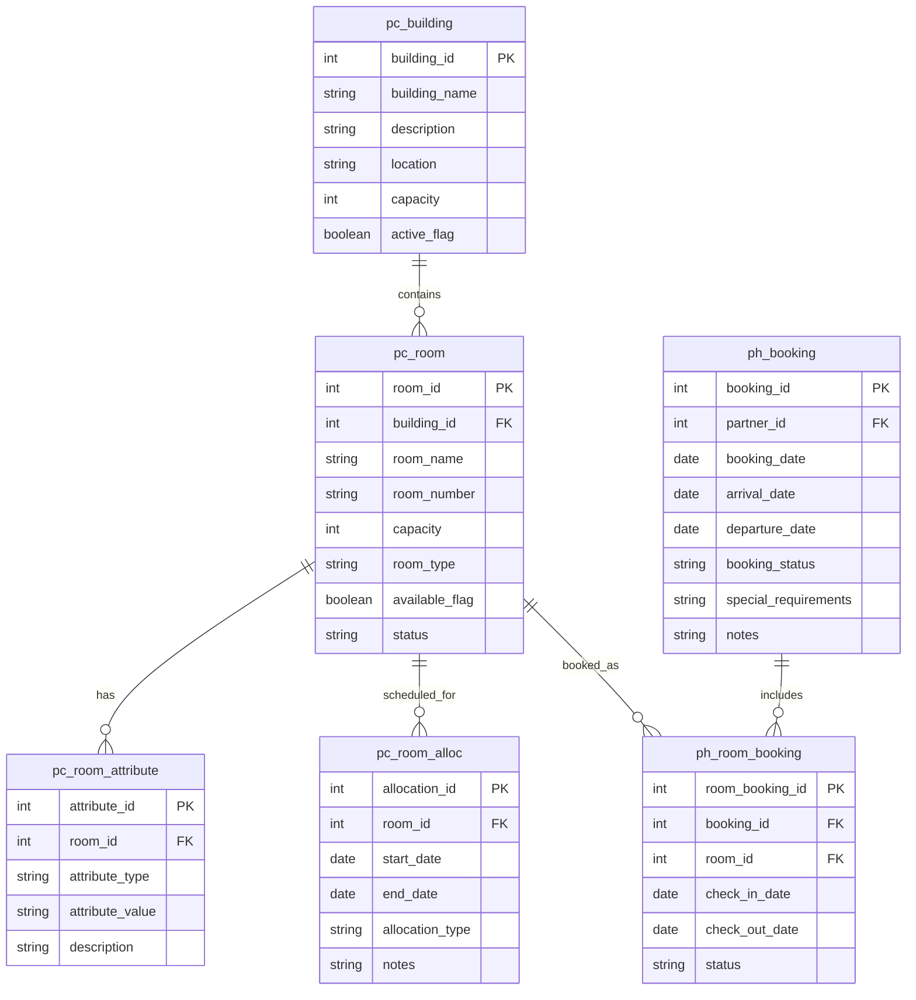
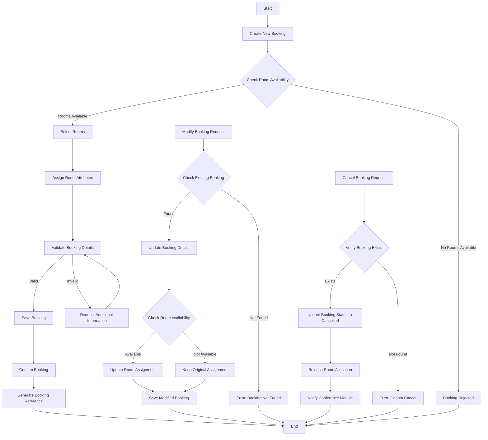
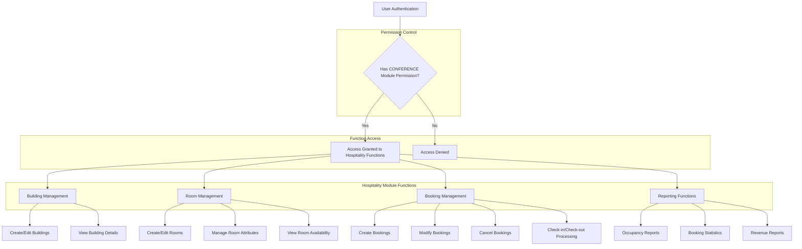

# Hospitality Accommodation in OpenPetra

## Introduction to Hospitality Accommodation in OpenPetra

OpenPetra's hospitality module provides a comprehensive solution for non-profit organizations to manage their accommodation resources efficiently. This module is designed to handle the full lifecycle of accommodation management, from maintaining an inventory of buildings and rooms to processing bookings for various purposes such as conferences, events, and staff housing. The system enables organizations to track room availability, manage attributes and capacities, and coordinate allocations based on specific requirements. While currently in a developmental stage with some placeholder components, the hospitality accommodation system is structured to integrate seamlessly with other OpenPetra modules, particularly the conference management system, to provide a holistic approach to resource management for non-profit organizations hosting events or maintaining residential facilities.

## Hospitality Accommodation Data Model

The diagram illustrates the core data model for OpenPetra's hospitality accommodation system. The model centers around buildings (`pc_building`) that contain rooms (`pc_room`). Each room can have multiple attributes (`pc_room_attribute`) that describe its features and amenities. The `pc_room_alloc` table manages general room allocations for purposes other than specific bookings, such as maintenance periods or reservations for specific groups.

The booking process is handled through the `ph_booking` table, which stores overall booking information linked to a partner (guest or organization). Individual room assignments within a booking are tracked in the `ph_room_booking` table, creating a many-to-many relationship between bookings and rooms.

This relational structure allows the system to efficiently manage complex scenarios like conference accommodations where multiple rooms might be booked for varying durations, while maintaining data integrity and supporting reporting needs.

## Building and Room Management

OpenPetra's hospitality module implements a hierarchical approach to property management through its building and room inventory system. Buildings serve as the top-level organizational units, containing metadata about physical structures including location, overall capacity, and operational status. Each building houses a collection of rooms, which are the primary bookable resources within the system.

The room management functionality is particularly robust, allowing organizations to track detailed information about each room including capacity, room number, type (e.g., single, double, dormitory), and current availability status. This granular approach enables efficient space utilization and occupancy management.

A key feature of the room management system is the attribute tracking capability. Through the `pc_room_attribute` table, the system can store multiple attributes for each room, such as accessibility features, available amenities (private bathroom, internet access), bed configurations, or any other custom attributes relevant to the organization's needs. These attributes play a crucial role in the room allocation process, enabling the system to match guest requirements with appropriate accommodations.

The system also incorporates maintenance tracking through room status flags and the allocation system, allowing administrators to mark rooms as unavailable during renovation periods or for other operational reasons. This prevents double-booking and ensures that only serviceable rooms are offered to guests.

## Booking System Architecture

The booking system in OpenPetra's hospitality module employs a two-tier architecture to manage reservations efficiently. At the core of this architecture are two primary data structures: `ph_booking` and `ph_room_booking`.

The `ph_booking` table serves as the master booking record, capturing essential information about the overall reservation, including the partner (individual or organization) making the booking, arrival and departure dates, special requirements, and the current status of the booking. This design allows the system to handle group bookings under a single reservation while maintaining the flexibility to accommodate individual needs.

The `ph_room_booking` table implements the detailed room assignments within a booking. This secondary tier creates a many-to-many relationship between bookings and rooms, enabling complex scenarios such as:
- A single booking spanning multiple rooms (e.g., for a family or group)
- Different check-in/check-out dates for individual rooms within the same booking
- Room changes during a stay
- Partial cancellations affecting only specific rooms in a booking

The booking process follows a state-based workflow, with status flags tracking each booking through its lifecycle from initial reservation to check-out. This allows for proper validation at each stage and integration with other modules such as financial systems for billing purposes.

The architecture is designed to be extensible, with the current implementation providing the foundational structure that can be enhanced with additional features like pricing tiers, seasonal availability, and integration with online booking platforms through the web connector infrastructure.

## Accommodation Booking Workflow

The diagram illustrates the comprehensive workflow for managing accommodation bookings in OpenPetra's hospitality module. The process begins with the creation of a new booking, which triggers an availability check against the room inventory. If suitable rooms are available, they are selected and assigned based on required attributes and guest preferences.

The system then validates the booking details against business rules, such as ensuring the check-in date precedes the check-out date and that the room capacity is appropriate for the number of guests. Once validated, the booking is saved and confirmed, generating a unique booking reference that can be used for future modifications or check-in procedures.

The workflow also handles booking modifications, which follow a similar validation path to ensure that changes don't conflict with other reservations. If a requested room change cannot be accommodated, the system maintains the original assignment.

Cancellations trigger a series of actions including status updates, release of room allocations back to the available inventory, and notifications to integrated modules such as the conference system if the booking was associated with an event.

This workflow demonstrates how the hospitality module integrates with OpenPetra's security framework, requiring appropriate permissions (currently using the CONFERENCE module permission) to perform booking operations, ensuring that only authorized personnel can manage accommodation resources.

## Room Allocation and Attributes

The room allocation system in OpenPetra's hospitality module employs a sophisticated matching algorithm that pairs guest requirements with room attributes to optimize accommodation assignments. This process begins with the collection of guest preferences and requirements during the booking phase, which are then compared against the available room inventory and their associated attributes.

The `pc_room_attribute` table serves as the foundation for this matching process, storing multiple attributes for each room that describe its physical characteristics, amenities, and suitability for different guest types. Common attributes might include:

- Accessibility features (wheelchair access, ground floor location)
- Bed configurations (single, double, twin, bunk beds)
- Bathroom arrangements (en-suite, shared)
- Special amenities (air conditioning, refrigerator)
- Location characteristics (quiet zone, near facilities)

When allocating rooms, the system first filters available rooms based on mandatory requirements (such as accessibility needs or capacity constraints). It then applies a preference-matching algorithm to identify the most suitable rooms from the filtered set, considering factors like proximity to event venues for conference attendees or keeping family groups in adjacent rooms.

The allocation process also incorporates priority handling to manage competing requests during high-demand periods. Priority can be based on various factors including:
- Booking date (first-come, first-served)
- Guest status (VIP, speaker, staff)
- Duration of stay
- Special needs considerations

The `pc_room_alloc` table tracks these allocations over time, ensuring that rooms are not double-booked and providing a historical record of room usage patterns that can inform future capacity planning and facility management decisions.

## Integration with Conference Management

The hospitality accommodation system in OpenPetra is designed with strong integration points to the conference management module, creating a seamless experience for organizations hosting events that require accommodation services. This integration is evident in both the data architecture and the permission structure of the system.

At the data level, the hospitality module can reference conference events, sessions, and attendee records to coordinate room allocations with event schedules. This allows for efficient management of group bookings tied to specific conferences, ensuring that:

1. Attendees are housed in appropriate proximity to event venues
2. Check-in/check-out dates align with conference schedules
3. Room blocks reserved for conference participants are properly managed
4. Special requirements for speakers or VIPs are accommodated

The integration extends to the booking workflow, where conference registrations can automatically trigger accommodation requests based on attendee preferences indicated during the registration process. This reduces manual data entry and minimizes booking errors.

For reporting purposes, the integration enables comprehensive event analysis that includes both conference participation data and accommodation statistics. Organizations can generate reports showing occupancy rates during events, accommodation revenue per conference, or housing patterns of different attendee segments.

The current implementation uses the CONFERENCE module permission for hospitality functions, as seen in the `THospitalityWebConnector` class, indicating that these modules are closely aligned from a security perspective. This suggests that users with conference management responsibilities would typically also handle related accommodation tasks, streamlining administrative workflows.

As the hospitality module continues to develop beyond its current placeholder status, this integration will likely expand to include more sophisticated features such as automated room assignments based on conference tracks or session selections.

## Security Model for Hospitality Management

The security model for OpenPetra's hospitality management module is built around a permission-based access control system that leverages the existing CONFERENCE module permission. As shown in the diagram, all hospitality functions are currently protected by this single permission check, which serves as the gateway to the entire module.

This approach reflects the close relationship between conference management and accommodation services in many non-profit organizations, where the same staff often handle both aspects of event planning. The `[RequireModulePermission("CONFERENCE")]` attribute applied to methods in the `THospitalityWebConnector` class enforces this security boundary at the API level.

The current implementation is relatively straightforward, but the architecture allows for future refinement into more granular permissions as the hospitality module matures. Potential permission enhancements could include:

1. Separate HOSPITALITY module permission for organizations that manage accommodations independently from conferences
2. Role-based permissions distinguishing between:
   - View-only access for front desk staff
   - Booking management for reservation coordinators
   - Full administrative access for property managers
3. Building-specific permissions for organizations with multiple facilities managed by different teams

The security model integrates with OpenPetra's core authentication system, ensuring that all access to hospitality functions is properly logged for audit purposes. This is particularly important for organizations that need to maintain records of who created or modified booking information for accountability and troubleshooting.

As the hospitality module evolves beyond its current placeholder status, the security model will likely expand to incorporate these more sophisticated permission structures while maintaining backward compatibility with the existing CONFERENCE permission framework.

## Web Connectivity for Accommodation Services

The web connectivity infrastructure for OpenPetra's hospitality accommodation system is currently in a foundational stage, represented by the `THospitalityWebConnector` class. This class serves as the bridge between the core hospitality business logic and external web interfaces, enabling online access to accommodation services through a standardized API layer.

While currently implemented as a placeholder with only a dummy function, the web connector architecture is designed to support a comprehensive set of accommodation management functions accessible via web services. The infrastructure is built to eventually enable:

1. **Online Booking Portal Integration**: Allowing guests to search for available rooms, view attributes and amenities, and make reservations through a web interface.

2. **Mobile Check-in/Check-out**: Supporting modern hospitality workflows where guests can complete check-in procedures before arrival and check out remotely.

3. **Room Management Dashboard**: Providing administrators with a web-based interface to monitor room status, occupancy rates, and maintenance needs in real-time.

4. **Integration with External Systems**: Enabling connections to third-party booking platforms, property management systems, or conference registration tools through standardized API endpoints.

The web connector implements OpenPetra's security model through the `[RequireModulePermission]` attribute, ensuring that all web-based access to hospitality functions is properly authenticated and authorized. This security integration is crucial for protecting sensitive booking information and preventing unauthorized modifications to accommodation data.

The connector's placement in the `Ict.Petra.Server.MHospitality.WebConnectors` namespace indicates its role as part of the server-side implementation that handles client requests from web interfaces. As the hospitality module matures, this connector will be expanded with specific methods for each required function, following OpenPetra's established patterns for web service implementation.

## Future Development Roadmap

The current state of OpenPetra's hospitality accommodation system reveals a well-structured foundation with clear potential for expansion. Based on the existing implementation and placeholder components, several key development areas emerge for future enhancement:

1. **Complete Web Connector Implementation**: Expanding the `THospitalityWebConnector` class beyond its current placeholder status to include a comprehensive API for all accommodation management functions, enabling full web-based access to the module.

2. **Advanced Booking Engine**: Developing a sophisticated booking algorithm that optimizes room assignments based on multiple factors including guest preferences, room attributes, proximity requirements, and length of stay.

3. **Financial Integration**: Creating connections between the hospitality module and OpenPetra's financial systems to handle accommodation charges, deposits, refunds, and financial reporting specific to housing revenue.

4. **Dedicated Security Model**: Evolving beyond the current CONFERENCE module permission to implement a granular permission structure specific to hospitality functions, allowing for more precise access control.

5. **Reporting Suite**: Developing specialized reports for occupancy analysis, revenue forecasting, maintenance scheduling, and integration with conference attendance statistics.

6. **Mobile Support**: Enhancing the web connectivity layer to support responsive interfaces for mobile check-in/check-out and room management on portable devices.

7. **Resource Scheduling**: Implementing calendar-based views of room availability and booking patterns to assist with visual planning of accommodation resources.

8. **Guest Communication**: Adding automated notification capabilities for booking confirmations, pre-arrival information, and post-stay feedback collection.

The data model already in place provides a solid foundation for these enhancements, with tables for buildings, rooms, attributes, and bookings establishing the core entities needed for a comprehensive accommodation management system. The integration with the conference module also creates natural expansion points for event-based housing management.

As OpenPetra continues to evolve, the hospitality module is positioned to become a valuable asset for non-profit organizations that manage their own accommodation facilities, whether for conferences, training events, staff housing, or mission-related hospitality services.

[Generated by the Sage AI expert workbench: 2025-03-30 02:22:57  https://sage-tech.ai/workbench]: #