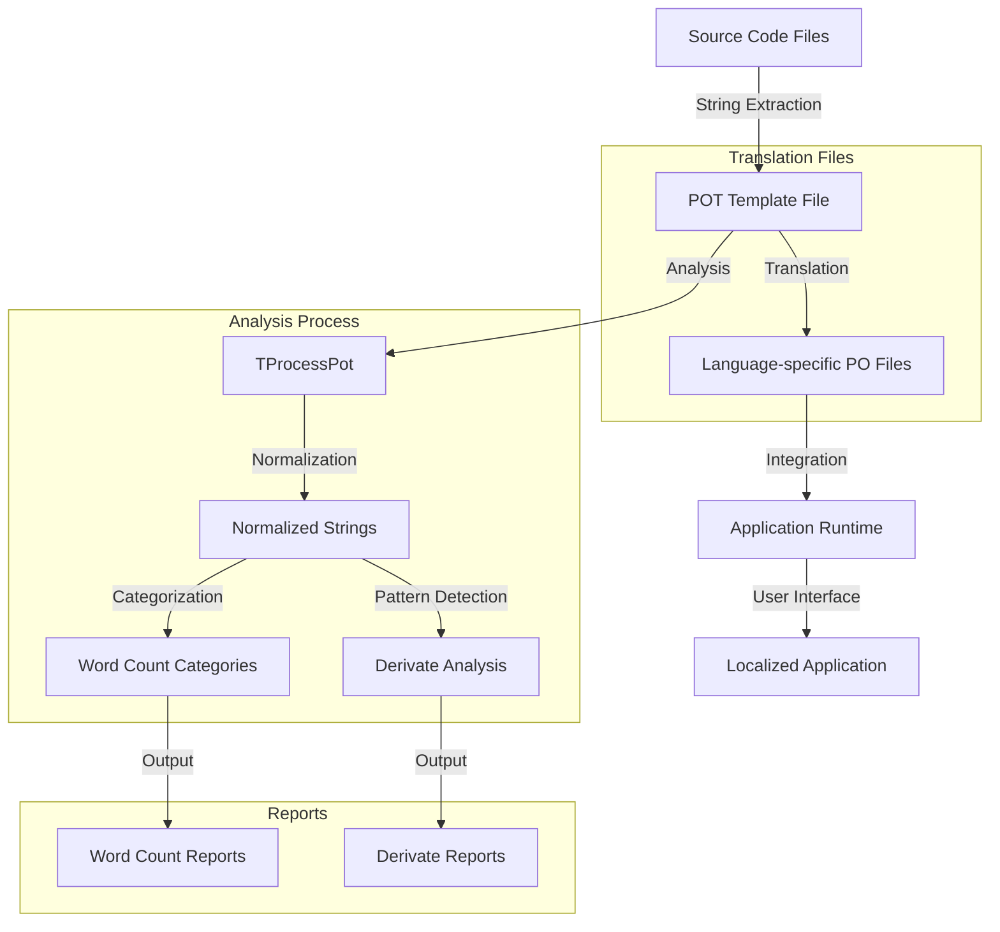
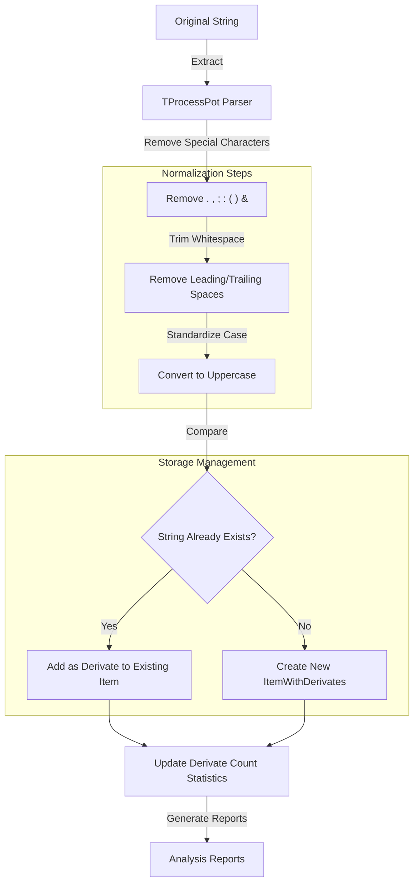
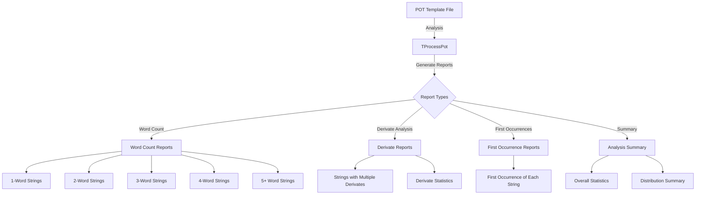
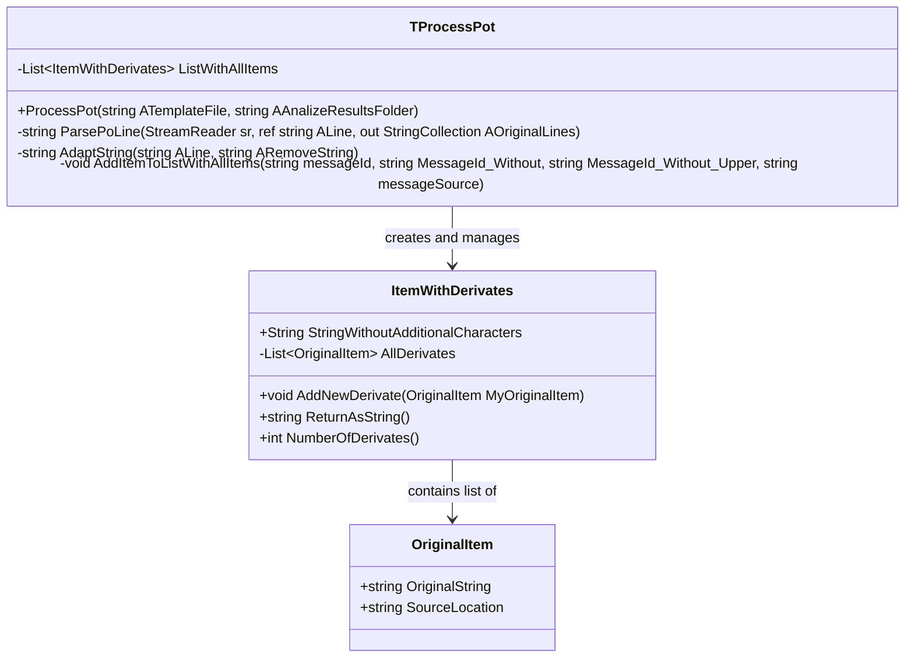

t# Internationalization in OpenPetra: Multi-Language Support Analysis

## Introduction to Internationalization in OpenPetra

OpenPetra's internationalization system forms a critical foundation for its global mission as a non-profit management application. The multi-language support infrastructure enables organizations worldwide to use the software in their native languages, significantly enhancing accessibility and adoption. The system is built around a sophisticated translation management framework that handles string extraction, normalization, and translation across multiple languages. Core components include the POT (Portable Object Template) file format for storing translatable strings, the ItemWithDerivates class for managing string variations, and the TProcessPot class for analyzing translation patterns. This architecture enables efficient translation management while maintaining consistency across the application's extensive user interface elements, reports, and documentation.

## Language Translation Architecture

OpenPetra implements a robust translation infrastructure based on the GNU gettext standard, using POT (Portable Object Template) files as the foundation for its multi-language support. These POT files serve as templates containing all translatable strings extracted from the source code. When translations are created for specific languages, they are stored in PO (Portable Object) files that contain both the original strings and their translations.

The system organizes text resources hierarchically, with strings extracted from the codebase and normalized to identify similar patterns and variations. The architecture includes specialized classes like ItemWithDerivates that manage original strings and their derivates (variations with different punctuation, capitalization, or formatting), and TProcessPot that processes and analyzes translation files to identify patterns, duplicates, and inconsistencies.

This architecture allows OpenPetra to maintain translation consistency while efficiently handling the thousands of translatable elements across the application. The system is designed to minimize redundancy by identifying strings that differ only in minor ways (such as punctuation or capitalization), which helps reduce the translation workload and improves consistency.

## Translation Management Process Flow

The diagram illustrates OpenPetra's translation management workflow, beginning with string extraction from source code to create POT template files. These templates undergo analysis through the TProcessPot class, which normalizes strings by removing special characters and standardizing case. The system then categorizes strings by word count and identifies patterns of string variations (derivates).

This analysis produces various reports that help translators and developers understand the translation landscape, including word count distributions and derivate patterns. The POT templates are then used to create language-specific PO files containing translations, which are integrated into the application at runtime to provide a localized user experience.

The process is designed to optimize translation efforts by identifying similar strings and patterns, reducing redundancy, and ensuring consistency across the application's interface.

## String Derivation and Normalization

OpenPetra employs a sophisticated approach to handle variations of the same string through the ItemWithDerivates class. This class stores an original string without additional characters (punctuation, special symbols) and maintains a list of all its derivates—variations that differ only in punctuation, capitalization, or formatting. This normalization process is crucial for identifying strings that are semantically identical but syntactically different.

The normalization process involves several steps:
1. Removing special characters like periods, commas, semicolons, colons, parentheses, and ampersands
2. Standardizing case by converting strings to uppercase for comparison
3. Trimming leading and trailing whitespace
4. Preserving the original strings and their source locations for reference

This approach allows OpenPetra to identify when the same text appears in multiple places with slight variations, which helps reduce translation redundancy and ensures consistency. For example, strings like "Save", "Save.", and "SAVE" can be recognized as variations of the same base string, requiring only one translation rather than three separate ones.

The ItemWithDerivates class works alongside the OriginalItem class, which stores individual string variations with their source locations in the codebase, providing important context for translators and developers.

## String Normalization Process

The diagram illustrates OpenPetra's string normalization process, which is central to its translation management system. When a string is extracted from the source code, it undergoes a series of transformations to create a normalized version that can be compared with other strings.

First, the TProcessPot parser extracts the string and removes special characters like periods, commas, semicolons, colons, parentheses, and ampersands. Next, leading and trailing whitespace is trimmed, and the string is converted to uppercase to standardize case for comparison.

The system then checks if this normalized string already exists in the collection. If it does, the original string is added as a derivate to the existing ItemWithDerivates object. If not, a new ItemWithDerivates object is created with the normalized string and the original string as its first derivate.

Statistics about derivate patterns are updated, tracking how many strings have one, two, or more derivates. These statistics help identify areas where string consistency could be improved. Finally, the system generates analysis reports categorizing strings by word count and derivate patterns, providing valuable insights for translation management.

## Translation Analysis Tools

The TProcessPot class serves as the analytical engine of OpenPetra's translation system, providing sophisticated tools for analyzing translation files to improve quality and reduce redundancy. This class processes POT template files to identify patterns, duplicates, and inconsistencies across the application's translatable strings.

The analysis performed by TProcessPot includes:

1. Identification of duplicate strings that differ only in punctuation or capitalization
2. Categorization of strings by word count (1-word, 2-word, 3-word, etc.)
3. Detection of strings with multiple derivates (variations)
4. Statistical analysis of string patterns across the application

The class generates comprehensive reports that help translators and developers understand the translation landscape, including:
- First occurrences of each unique string
- Word count distribution across all strings
- Detailed listings of strings with multiple derivates
- Summary statistics on string patterns

These analytical capabilities are particularly valuable for large applications like OpenPetra, where thousands of translatable strings must be managed efficiently. By identifying patterns and redundancies, the system helps reduce translation workload, improve consistency, and maintain quality across multiple languages.

The TProcessPot class works by parsing POT files line by line, extracting message IDs, normalizing them through character removal and case standardization, and then comparing them against existing entries to build a comprehensive map of all translatable strings and their variations.

## Word Count Categorization

OpenPetra's translation system employs a strategic approach to categorizing translation strings by word count, which helps prioritize and manage translation efforts effectively. This categorization recognizes that strings of different lengths present different challenges for translators and require different levels of attention.

The system automatically analyzes each translatable string and categorizes it into one of five groups:
1. Single-word strings (e.g., "Save", "Cancel", "Help")
2. Two-word strings (e.g., "Print Report", "User Settings")
3. Three-word strings (e.g., "Save As Template")
4. Four-word strings (e.g., "Export Data to File")
5. Five or more words (typically sentences or paragraphs)

This categorization provides valuable statistics about the complexity of the translation task. In a typical OpenPetra installation, the distribution might look something like:
- Single-word strings: ~30% of all translatable items
- Two-word strings: ~25% of all translatable items
- Three-word strings: ~15% of all translatable items
- Four-word strings: ~10% of all translatable items
- Five or more words: ~20% of all translatable items

By organizing strings this way, translation teams can adopt different strategies for different categories. For example, single-word strings often require careful consideration of context and can have multiple meanings, while longer strings provide more context but may require more complex grammatical adaptations in target languages.

The word count categorization also helps identify potential issues in the source text, such as inconsistent terminology or unnecessarily complex phrasing, which can be addressed to improve both the original text and its translations.

## Translation Analysis Reports

The diagram illustrates the comprehensive reporting system generated by OpenPetra's translation analysis tools. When a POT template file is processed by the TProcessPot class, it produces several categories of reports that provide different perspectives on the translation landscape.

Word Count Reports categorize strings by their length (number of words), creating separate files for 1-word, 2-word, 3-word, 4-word, and 5+ word strings. These reports help translators focus on similar types of strings and address specific translation challenges associated with different string lengths.

Derivate Reports identify strings that appear multiple times with slight variations (in punctuation, capitalization, etc.) and provide statistics on how many strings have one, two, three, or more derivates. This helps identify inconsistencies in the source text and opportunities for standardization.

First Occurrence Reports document the first instance of each unique string in the application, providing important context for translators. The Analysis Summary provides an overview of all findings, including total string counts, word count distribution, and derivate statistics.

These reports serve multiple purposes: they help translators understand the scope and nature of the translation task, they provide developers with insights into string usage patterns across the application, and they identify opportunities for improving consistency and reducing redundancy in both the source text and translations.

## Language Selection Implementation

OpenPetra provides users with a straightforward yet powerful interface for selecting and changing the application language. The language selection mechanism is designed to be accessible while respecting the user's preferences and system settings.

When a user first launches OpenPetra, the application attempts to detect the operating system's language setting and automatically selects the corresponding language if a translation is available. If no matching translation exists, the application defaults to English.

Users can change the language at any time through the application's settings interface. The language selection dialog presents available languages in their native names (e.g., "Deutsch" for German, "Français" for French) to make selection intuitive regardless of the user's current language setting.

Behind the scenes, when a language is selected, OpenPetra loads the appropriate PO files containing translations for that language. The application's text rendering system then uses these translations to display UI elements, messages, reports, and other text in the selected language.

The implementation includes fallback mechanisms to handle cases where a specific string might not be translated in the selected language. In such cases, the application displays the original (typically English) string rather than showing an error or blank space.

Language selection settings are persisted between sessions, so users don't need to reselect their preferred language each time they launch the application. Additionally, certain reports and outputs can be generated in a language different from the interface language if needed, providing flexibility for organizations working in multilingual environments.

## Class Relationship: Translation Components

This UML diagram illustrates the relationship between the three primary classes in OpenPetra's translation management system:

1. **TProcessPot** is the main processing class that analyzes POT template files. It maintains a list of ItemWithDerivates objects and provides methods for parsing POT files, adapting strings by removing special characters, and adding items to the master list. The ProcessPot method orchestrates the entire analysis process, generating various reports based on the findings.

2. **ItemWithDerivates** represents a normalized string and all its variations. It stores the base string without special characters (StringWithoutAdditionalCharacters) and maintains a list of all derivates (variations) of that string. It provides methods to add new derivates, return the item as a formatted string for reporting, and count the number of derivates.

3. **OriginalItem** represents a single instance of a string as it appears in the source code. It stores the original string exactly as it appears (OriginalString) and its location in the source code (SourceLocation), providing important context for translators.

The relationship between these classes forms the core architecture of OpenPetra's translation management system. TProcessPot creates and manages ItemWithDerivates objects, which in turn contain lists of OriginalItem objects. This structure allows the system to efficiently track and analyze patterns in translatable strings across the application, identifying opportunities for standardization and optimization in both the source text and translations.

## Guided Translation Workflow

OpenPetra implements a guided translation workflow designed to streamline the translation process and ensure high-quality, contextually accurate translations. This workflow provides translators with a structured approach to translating the application's strings, with appropriate context and reference information.

The guided translation process begins with the analysis performed by TProcessPot, which organizes strings into logical categories based on word count, usage patterns, and derivates. Translators can then work through these categories systematically, addressing similar strings together for consistency.

For each string to be translated, the system provides:
1. The original string in its exact form
2. The string's location in the source code (file and line number)
3. Related strings or derivates that have already been translated
4. Context information when available (such as the UI component where the string appears)

This contextual information is crucial for accurate translation, as many short strings can have different meanings depending on their context. For example, the word "Post" could refer to a verb action in accounting, a noun referring to a position, or part of "Post Code" (ZIP code).

The workflow also includes validation steps to ensure translations maintain proper formatting, preserve placeholders for dynamic content (like %s or {0}), and adhere to length constraints where applicable. Translators can preview their translations in context when possible, seeing how they will appear in the actual application interface.

By providing this guided approach with rich contextual information, OpenPetra helps ensure translations are accurate, consistent, and appropriate for their specific usage within the application.

## Future Enhancements and Challenges

As OpenPetra continues to evolve, several challenges and opportunities exist for enhancing its internationalization system. One significant challenge is maintaining translation consistency as the application grows and changes. New features, UI improvements, and terminology updates can create discrepancies between existing translations and new content, requiring continuous monitoring and updates.

Another challenge is handling languages with complex grammatical structures that differ significantly from English, such as languages with grammatical gender, complex pluralization rules, or right-to-left scripts. While the current system handles basic translation needs well, supporting these more complex linguistic features may require extensions to the framework.

Potential future enhancements to the internationalization system could include:

1. **Machine learning-assisted translation**: Implementing AI-based suggestions for translations based on existing translated content and context analysis.

2. **Context-aware translation tools**: Enhancing the system to provide more detailed contextual information to translators, including screenshots of where strings appear in the UI.

3. **Real-time collaborative translation**: Developing tools that allow multiple translators to work simultaneously on different parts of the application while maintaining consistency.

4. **Translation memory integration**: Implementing a translation memory system that remembers previous translations and suggests them for similar new strings.

5. **Automated quality checks**: Developing more sophisticated validation tools that can identify potential issues in translations, such as inconsistent terminology or formatting problems.

6. **User-contributed translations**: Creating a secure framework that allows community members to suggest translations for review by official translators.

7. **Dynamic language loading**: Enhancing the system to load only the translations needed for specific modules, reducing memory usage and improving performance.

The balance between comprehensive language support and maintainability remains a key consideration. As OpenPetra serves non-profit organizations worldwide, its internationalization system must continue to evolve to meet the diverse linguistic needs of its global user base while remaining efficient and manageable for the development team.

[Generated by the Sage AI expert workbench: 2025-03-30 02:22:57  https://sage-tech.ai/workbench]: #