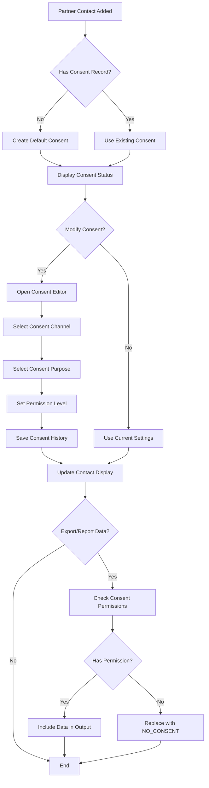
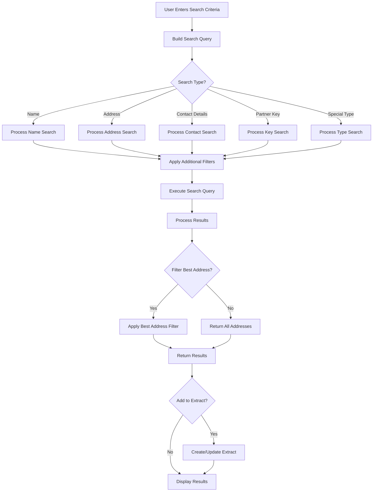
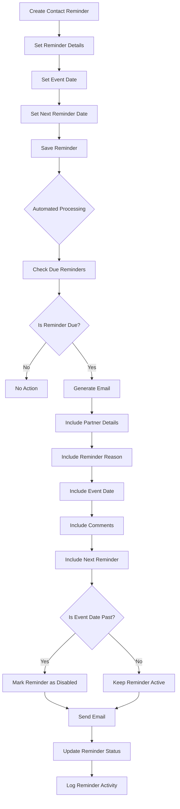

# Partner Contact Management in OpenPetra

## Partner Contact Management Overview

OpenPetra's contact management system provides a comprehensive framework for non-profit organizations to manage their relationships with various entities. The system is designed to handle a wide range of partner types, including individuals, families, organizations, churches, banks, venues, and units. The architecture supports detailed contact information management, relationship tracking, communication preferences, and GDPR-compliant consent management.

The partner module serves as the foundation for many other OpenPetra modules, providing centralized contact data that can be leveraged for accounting, sponsorship, publications, and other organizational functions. The system is particularly focused on supporting international operations with features for handling different address formats, language preferences, and communication channels across borders.

## Partner Data Model Architecture

```mermaid
graph TD
    Partner[Partner Base Class] --> Person[Person]
    Partner --> Family[Family]
    Partner --> Organization[Organization]
    Partner --> Church[Church]
    Partner --> Bank[Bank]
    Partner --> Venue[Venue]
    Partner --> Unit[Unit]
    
    Partner --- PartnerLocation{Partner Location}
    PartnerLocation --- Location[Location]
    
    Partner --- PartnerAttribute{Partner Attribute}
    PartnerAttribute --- AttributeType[Attribute Type]
    
    Partner --- PartnerRelationship{Partner Relationship}
    PartnerRelationship --- RelationType[Relation Type]
    
    Partner --- PartnerType{Partner Type}
    PartnerType --- TypeCategory[Type Category]
    
    Partner --- Subscription{Subscription}
    Subscription --- Publication[Publication]
    
    Partner --- ConsentHistory{Consent History}
    ConsentHistory --- ConsentChannel[Consent Channel]
    ConsentHistory --- ConsentPurpose[Consent Purpose]
    
    Person --- PersonalData[Personal Data]
    Family --- FamilyMembers[Family Members]
    Organization --- OrgData[Organization Data]
    Church --- ChurchData[Church Data]
    Bank --- BankingDetails[Banking Details]
    Venue --- VenueData[Venue Data]
    Unit --- UnitHierarchy[Unit Hierarchy]
    
    class Partner,Person,Family,Organization,Church,Bank,Venue,Unit,Location,AttributeType,RelationType,TypeCategory,Publication,ConsentChannel,ConsentPurpose,PersonalData,FamilyMembers,OrgData,ChurchData,BankingDetails,VenueData,UnitHierarchy entity;
    class PartnerLocation,PartnerAttribute,PartnerRelationship,PartnerType,Subscription,ConsentHistory relationship;
```

The diagram illustrates the hierarchical structure of OpenPetra's partner data model. All partner types inherit from a common base class that stores shared information like partner key, short name, and status. Each specialized partner class (Person, Family, etc.) extends this with type-specific attributes. The model uses junction tables (shown as diamonds) to establish many-to-many relationships between partners and their locations, attributes, relationships, types, subscriptions, and consent records.

## Contact Information Management

OpenPetra implements a flexible contact information management system that handles various types of communication channels. Rather than using fixed fields for contact methods, the system employs a category-based approach where contact details are stored as partner attributes with specific type designations.

The system organizes contact information into several main categories:
- **Phone Numbers**: Landlines, mobile phones, and fax numbers
- **Email Addresses**: Standard and secure email options
- **Digital Media**: Social media accounts, websites, and blogs (Facebook, Twitter, LinkedIn, etc.)
- **Instant Messaging & Chat**: Messaging platforms and internet voice communication services

Each contact method is stored with metadata including:
- Contact type and category
- Value (the actual phone number, email address, etc.)
- Comment or description
- Default status (whether it's the primary contact method)
- Business equivalent designation (for personal vs. business contact information)

The `TContactDetailsAggregate` and related classes provide functionality to retrieve primary contact methods, format phone numbers with international prefixes, and manage overall contact settings. The system supports international formats for phone numbers, including country codes, and can generate hyperlinks for digital media accounts using templates (e.g., `https://www.facebook.com/{VALUE}`).

## Address Management and Validation

OpenPetra implements a sophisticated address management system that handles the complexities of international addressing, multiple addresses per partner, and address validation. The system is built around several key components:

### Multiple Address Support

Partners can have multiple addresses, each with:
- A location type (HOME, BUSINESS, CHURCH, FIELD, etc.)
- Effective and expiration dates
- A "send mail" flag indicating whether the address is valid for mailings
- Geographic coordinates for mapping

### Best Address Determination

The `TAddressTools` class implements algorithms to determine the "best address" for a partner based on:
1. Addresses marked for sending mail are prioritized
2. Current addresses (where today's date falls between effective and expiration dates) are preferred over future or expired addresses
3. For current addresses, the most recently effective address is selected
4. For future addresses, the soonest-starting address is selected
5. For expired addresses, the most recently expired address is selected

This logic ensures that communications always use the most appropriate address available.

### Address Validation

The system includes several validation mechanisms:
- `TDuplicateAddressCheck` implements fuzzy matching algorithms to detect potential duplicate addresses
- The Damerau-Levenshtein distance algorithm is used to identify similar addresses despite typos or formatting differences
- Address components are normalized before comparison to handle variations in punctuation and spacing
- Country-specific validation rules can be applied based on the country code

### Address Formatting

The `TFormLetterTools` class provides functionality to format addresses according to country-specific conventions:
- Different countries have different address ordering (e.g., postal code before or after city)
- The system supports three primary address ordering formats based on country requirements
- Special tokens like `[[TitleAndSpace]]` control formatting in address blocks
- Capitalization options are available for formal communications
- Empty lines are automatically suppressed unless explicitly marked with `[[NoSuppress]]`

The system also handles special cases like contact persons for organizations and churches, allowing their personal details to be used in address blocks when appropriate.

## Contact Consent Management Flow

OpenPetra implements a GDPR-compliant consent management system that tracks permissions for different communication channels and purposes. The `TDataHistoryWebConnector` class manages consent history, providing methods to retrieve, check, and edit consent permissions.

The system tracks consent across multiple dimensions:
- **Consent Channels**: How consent was obtained (phone, letter, email, direct conversation)
- **Consent Purposes**: What the data can be used for (defined by the organization)
- **Data Types**: What kinds of data are covered (address, email, phone, etc.)
- **Permission Levels**: Whether consent is granted, denied, or undefined

Each consent change creates a new history entry rather than modifying existing ones, preserving an audit trail of consent changes. When displaying or exporting partner data, the system checks consent permissions and replaces sensitive data with "NO_CONSENT" placeholders when appropriate permissions aren't available.

## Partner Relationships and Hierarchies

OpenPetra provides a comprehensive system for managing relationships between partners, supporting both direct and reciprocal connections. The relationship system is built around the `p_relation` table which defines relationship types and the `p_partner_relationship` table which stores actual relationships between partners.

### Relationship Types

Relationships are categorized into three main groups:
- **Family Relationships**: Parent/child, sibling, spouse, etc.
- **Church Relationships**: Pastor, treasurer, supporting church, etc.
- **Other Relationships**: Employer, emergency contact, supporter, etc.

Each relationship type has:
- A unique code (e.g., FATHER, EMPLOYER, PASTOR)
- Forward and reverse descriptions (e.g., "Father of" and "Son/Daughter of")
- A category designation (FAMILY, CHURCH, OTHER)
- Directionality flags

### Bidirectional Tracking

The system maintains bidirectional relationships automatically. When a relationship is established from partner A to partner B with a specific relationship type, the system can automatically determine the reciprocal relationship from B to A. For example, if A is the "Father of" B, then B is the "Son/Daughter of" A.

### Hierarchical Structures

The relationship system supports hierarchical structures, particularly for:

1. **Family Hierarchies**:
   - Families can have multiple members with different relationships
   - Family members can share addresses and contact information
   - Address changes can be propagated to family members

2. **Organizational Hierarchies**:
   - Organizations can have parent/subsidiary relationships
   - Units can be organized in hierarchical structures with parent/child relationships
   - Churches can have relationships with pastors, treasurers, and secretaries

3. **Emergency Contact Hierarchies**:
   - Primary, secondary, and general emergency contacts
   - Next of kin relationships

The `TPartnerRelationshipFindUIConnector` and related classes provide functionality to search for relationships, while the `TPartnerMergeWebConnector` handles merging partners while preserving their relationships.

## Partner Search and Filtering Process

OpenPetra implements a sophisticated partner search system through the `TPartnerFind` class, which handles building and executing complex SQL queries based on various search criteria. The search process involves several key components:

### Search Criteria Types

The system supports multiple search criteria types:
- **Partner Details**: Name, class, status, key
- **Address Information**: Street, city, postal code, country
- **Contact Details**: Phone, email, social media
- **Special Types**: Partner type designations (VOLUNTEER, SUPPORTER, etc.)
- **Bank Details**: Account numbers, sort codes

### Query Building

The `BuildCustomWhereCriteria` method constructs SQL WHERE clauses based on the search type:
- Name searches support wildcards and can search by first name, last name, or organization name
- Address searches can filter by location components and validity dates
- Phone searches handle international formats with country code lookup
- Special type searches filter by partner type designations

### Result Processing

Search results are processed through several steps:
1. **Pagination**: The `TPagedDataSet` class manages large result sets with efficient paging
2. **Best Address Filtering**: The `FilterResultByBestAddress` method ensures only the most appropriate address is shown for each partner
3. **Extract Creation**: The `AddAllFoundPartnersToExtract` method can save search results to a partner extract for later use

The search system also supports type-ahead functionality through the `TypeAheadPartnerFind` method, which provides autocomplete suggestions as users type in search fields.

## Partner Data Import and Export

OpenPetra provides comprehensive functionality for importing and exporting partner data through several specialized classes:

### Import Capabilities

The system supports importing partner data from multiple file formats:
- **CSV Files**: Through `TPartnerImportCSV` class
- **ODS Files**: OpenDocument Spreadsheet format
- **XLSX Files**: Microsoft Excel format

The import process includes:
1. **File Reading**: Reading and parsing the input file
2. **Data Validation**: Checking required fields and data formats
3. **Partner Creation**: Creating new partner records with appropriate types
4. **Address Handling**: Creating locations and partner-location links
5. **Contact Details**: Adding email addresses, phone numbers, etc.
6. **Special Types**: Assigning partner type designations
7. **Consent Management**: Setting up initial consent records

The system handles various data formats and requirements:
- Different date formats (DMY/MDY)
- International address formats
- Required field validation
- Duplicate detection

### Export Capabilities

The `TExportAllPartnerData` class provides functionality to export comprehensive partner data:
- Exports all data related to a specific partner into a dataset
- Handles different partner types (Person, Family, Organization, etc.)
- Includes locations, attributes, comments, and type-specific information
- Supports filtering by partner class

The export functionality is used for:
- Data backup and migration
- Reporting and analysis
- Data sharing with external systems

Both import and export operations use database transactions to ensure data integrity, with comprehensive error handling and validation.

## Partner Merging and Deduplication

OpenPetra implements a sophisticated system for identifying and merging duplicate partner records through the `TMergePartnersWebConnector` and related classes. The merging process is designed to preserve relationships, history, and associated data across the system.

### Duplicate Detection

The system includes several mechanisms for identifying potential duplicates:
- **Name Similarity**: Detecting similar partner names
- **Address Matching**: The `TAddressDumplicateWebConnector` uses string comparison algorithms to identify similar addresses
- **Contact Information**: Matching email addresses or phone numbers
- **Manual Selection**: Users can manually select records to merge

### Merge Validation

Before merging, the `TMergePartnersCheckWebConnector` performs extensive validation:
- **Partner Class Compatibility**: Checking if the partner classes can be merged
- **Currency Validation**: Ensuring suppliers use the same currency
- **Family Member Handling**: Special handling for family partners with members
- **Donation History**: Checking for gift records that might be affected
- **Bank Account Validation**: Ensuring proper handling of banking details
- **Commitment Checks**: Verifying active commitments that might affect Intranet access

### Merge Process

The actual merge process involves several steps:
1. **Source Selection**: Identifying which partner will be merged into another
2. **Data Consolidation**: Combining data from both partners
3. **Reference Updates**: Updating all references to the source partner
4. **History Recording**: Creating a merge history record
5. **Source Deactivation**: Marking the source partner as merged

The system handles various data types during merges:
- **Gift Information**: Updating donation records
- **Accounts Payable**: Handling supplier information
- **Motivations**: Combining motivation records
- **Extracts**: Updating extract memberships
- **Greetings**: Consolidating greeting preferences
- **Contacts**: Merging contact logs
- **Interests**: Combining interest records
- **Locations**: Handling address information
- **Types**: Merging partner type designations
- **Subscriptions**: Updating publication subscriptions
- **Applications**: Handling application records
- **Personnel Data**: Merging personnel information
- **Jobs**: Updating job records
- **Relationships**: Preserving relationship networks
- **Banking Details**: Consolidating banking information

The merge process maintains data integrity by carefully managing primary keys, foreign keys, and avoiding duplicate records.

## Contact Reminder System

OpenPetra implements a comprehensive reminder system for partner contacts through the `TProcessPartnerReminders` class. This system allows users to set up automated reminders about partners that will be sent via email when due.

### Reminder Creation

Reminders can be created with various attributes:
- **Partner Association**: Link to a specific partner
- **Reason**: Purpose of the reminder
- **Event Date**: Date of the associated event
- **Comments**: Additional information
- **Next Reminder Date**: When the reminder should be triggered
- **Frequency**: How often the reminder should repeat

### Reminder Processing

The reminder system includes automated processing that:
1. Retrieves reminders that need processing based on their next reminder date
2. Sends emails to recipients with partner information
3. Updates reminder records after processing
4. Deactivates reminders when appropriate (e.g., when their event date is in the past)

### Email Templates

The system uses email templates (like `reminder_en.txt` and `reminder_de.txt`) that include placeholders for:
- Recipient details (FirstName, LastName)
- Partner information (partnername, partnerkey)
- Contact details
- Reminder reason
- Event date
- Comments
- Next reminder date
- Disabled status notification

The templates use conditional formatting with `{ifdef}` tags to include optional sections only when relevant data is available.

## Subscription and Publication Management

OpenPetra provides a comprehensive system for managing partner subscriptions to publications through several specialized classes and database tables:

### Publication Management

The `TPartnerSetupWebConnector` class includes methods to manage publications:
- **LoadPublications**: Retrieves the list of available publications
- **MaintainPublications**: Handles creating, updating, and deleting publications

Publications have attributes including:
- Publication code
- Description
- Frequency
- Valid status

### Subscription Management

The subscription system tracks:
- Which partners are subscribed to which publications
- Subscription status (PERMANENT, EXPIRED, CANCELLED)
- Start and expiry dates
- Number of copies
- Gratis subscription status
- Cancellation dates

Key functionality includes:
- **AddSubscription**: Adds a new subscription for a partner
- **UpdateSubscriptionsReceived**: Updates subscription records when publications are sent
- **GetPartnerBySubscription**: Retrieves partners subscribed to a specific publication

### Subscription Reports

The system includes specialized reports for subscriptions:
- **PartnerBySubscription**: Lists partners subscribed to a specific publication
- **SubscriptionReport**: Provides detailed information about subscriptions

These reports can filter by:
- Publication code
- Subscription status
- Active partners only
- Partner class (PERSON, FAMILY)
- Solicitation preferences
- Number of copies
- Date ranges

The subscription system integrates with the consent management framework to ensure that partner data is only included in reports when appropriate consent has been granted.

## Partner Self-Service Capabilities

OpenPetra implements a self-service portal that allows partners to view and update their own information through the `TSimplePartnerEditWebConnector` class and related components. This functionality enables partners to maintain their own contact details while providing appropriate security controls.

### Self-Service Features

The self-service portal allows partners to:
- View their personal information
- Update contact details (addresses, phone numbers, email)
- Manage communication preferences
- View and update subscription information
- Update bank account details
- View and update special type designations
- Manage consent preferences

### Security Controls

The system implements several security measures:
- **Module Permissions**: The PARTNERSELFSERVICE module permission controls access
- **User Authentication**: Partners must authenticate before accessing their data
- **Limited Access**: Partners can only view and edit their own information
- **Field-Level Security**: Certain fields may be read-only or hidden
- **Consent Validation**: Changes to contact information require appropriate consent

### Implementation

The self-service functionality is implemented through:
- **MaintainPartnerSelfService.html**: The user interface template
- **MaintainPartnerSelfService.js**: Client-side functionality
- **SimplePartnerEdit.cs**: Server-side implementation

The system uses the same underlying data structures as the main partner management system but with restricted access and simplified interfaces. Changes made through the self-service portal are subject to the same validation rules and business logic as changes made by administrative users.

---

The OpenPetra partner contact management system provides a robust foundation for non-profit organizations to manage their relationships with various entities. Its comprehensive data model, sophisticated address handling, GDPR-compliant consent management, and flexible relationship tracking capabilities make it a powerful tool for international organizations with complex contact management needs.

[Generated by the Sage AI expert workbench: 2025-03-30 02:22:57  https://sage-tech.ai/workbench]: #