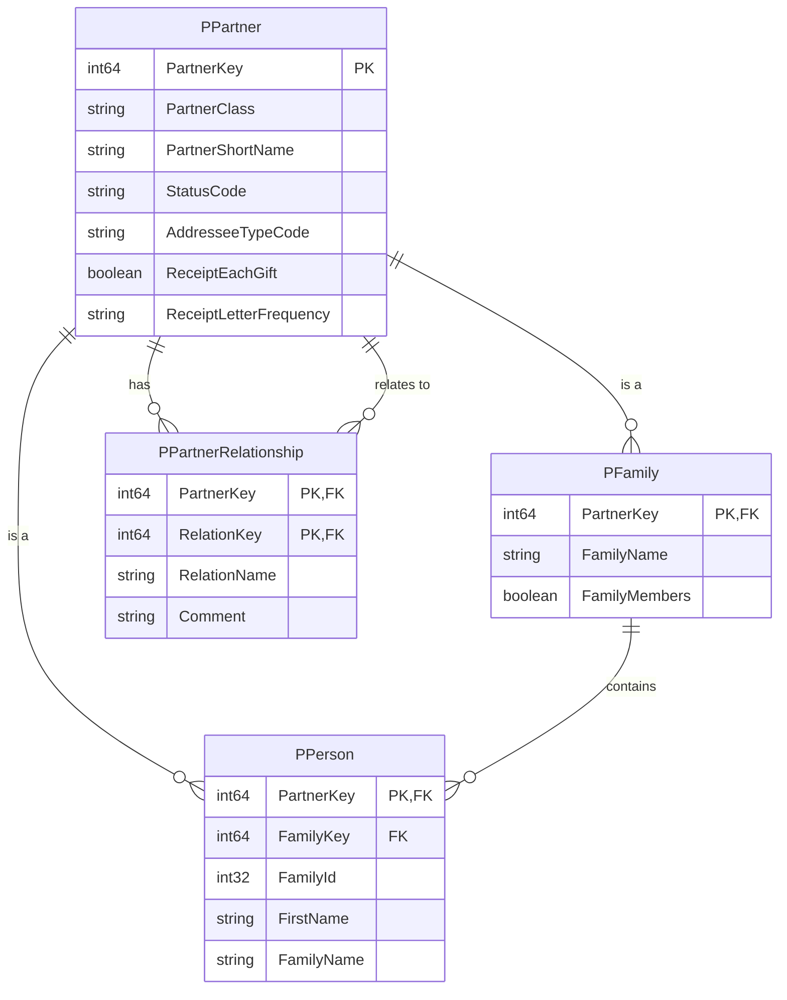
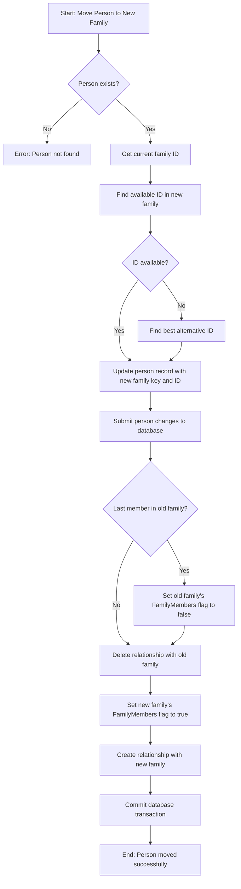
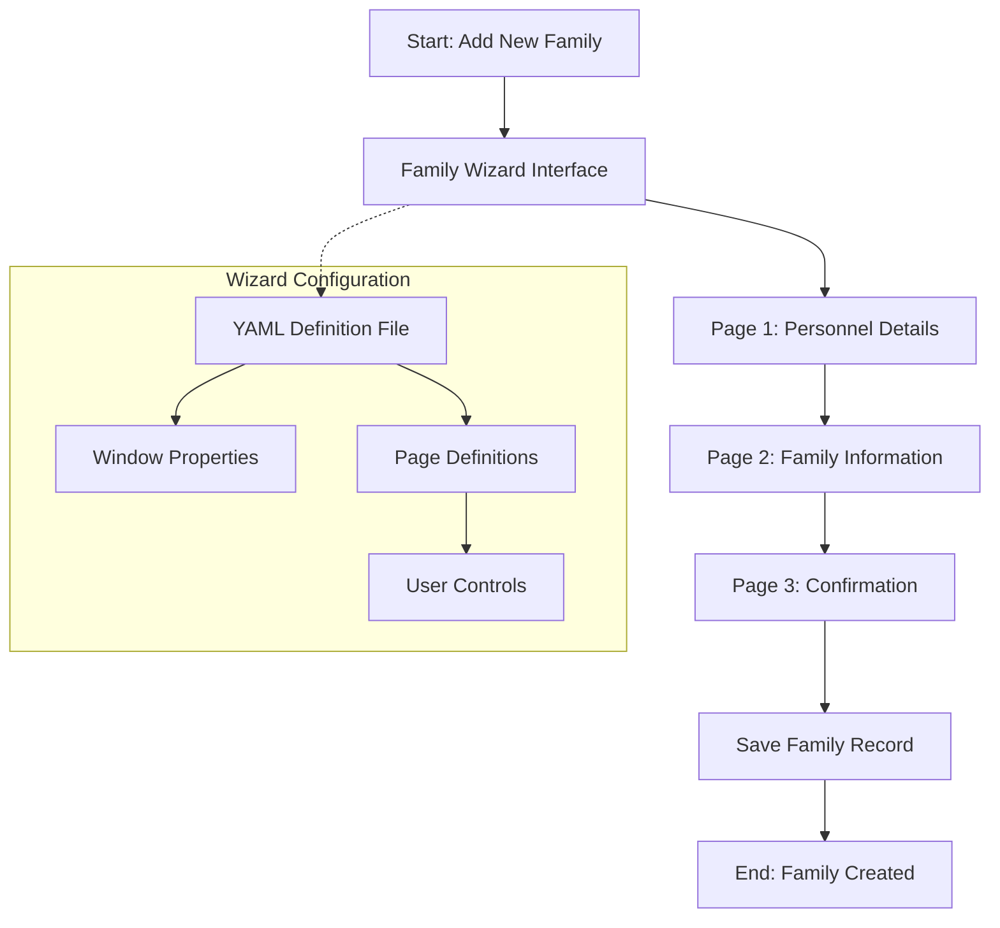
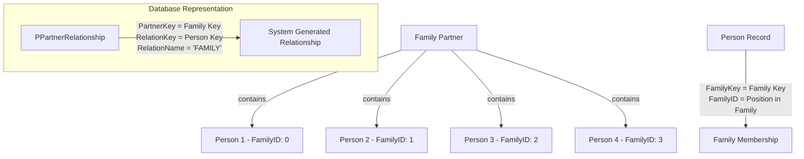

# Family Structure in OpenPetra

## Family Structure in OpenPetra

OpenPetra implements a sophisticated hierarchical structure for managing family relationships within its partner management system. At the core of this structure is the concept that each family has a partner record that serves as a container for individual person records. Each person within a family is assigned a unique family ID that determines their position within the family hierarchy.

The system organizes families as partner entities with a partner class of 'FAMILY'. Each family partner record is linked to multiple person records through the family key relationship. This allows OpenPetra to maintain both individual and family-level data while preserving the relationships between family members. The hierarchical structure enables operations like moving individuals between families, tracking family-level consent for communications, and managing family-specific partner information.

When a family is created, the system automatically generates the necessary relationship records between the family partner and each person record. These relationships are bidirectional, allowing queries to find all members of a family or to determine which family a person belongs to. The family structure also supports special handling for different family situations, such as single individuals, couples, or families with children.

## Family Data Model

The diagram illustrates the core database structure for family relationships in OpenPetra. The `PPartner` table serves as the base entity for all partner types, including families and persons. The `PFamily` table extends `PPartner` with family-specific attributes, while `PPerson` contains individual person data with a reference to their family through the `FamilyKey` field.

The `FamilyId` field in the `PPerson` table is particularly important as it determines the role of the person within the family (parents have IDs 0-1, children have IDs 2+). The `PPartnerRelationship` table maintains the explicit relationships between partners, including the system-generated "FAMILY" relationships that connect family partners to their member persons.

When a family partner is created, the system automatically sets the `FamilyMembers` flag to true when person records are associated with it, and this flag is maintained as members are added or removed from the family.

## Family ID Assignment System

OpenPetra implements a structured family ID numbering system that follows specific rules to maintain proper family hierarchy. The family ID is a numeric value stored in the `FamilyId` field of the `PPerson` table that indicates a person's role within their family:

- IDs 0 and 1 are reserved for parents/adults in the family
- IDs 2 and above are assigned to children or other family members

This numbering system is enforced by the `TPartnerFamilyIDHandling` class, which contains sophisticated logic for assigning appropriate family IDs when adding new members or moving people between families. When assigning a new family ID, the system first checks if the family has any members. If not, it assigns ID 0 to the first person. If the family already has members, it tries to preserve specific parent IDs (0 and 1) when possible.

The system prioritizes parent IDs by first checking if IDs 0 and 1 are available. If a parent ID is requested but already taken, it will try to assign the other parent ID. If both parent IDs are taken, or if a non-parent ID is needed, the system searches for available IDs starting from 2 and going up. If all IDs between 2 and 9 are taken, the system will assign the next available number by finding the highest existing family ID and adding 1.

This structured approach ensures that family relationships are properly maintained in the database and that the hierarchical nature of families is preserved throughout the system.

## Family Member Management

OpenPetra provides comprehensive functionality for managing family members through adding, removing, and moving individuals between families. The process is handled primarily by the `TFamilyHandling` class, which ensures that all related database records are properly updated when family compositions change.

When adding a new member to a family, the system first determines an appropriate family ID using the `TPartnerFamilyIDHandling` class. It then creates the necessary person record with the assigned family ID and establishes the relationship between the person and the family partner. The family's `FamilyMembers` flag is automatically set to true to indicate that the family now has members.

Removing a member from a family involves deleting the relationship between the person and the family partner. If the person was the last member of the family, the system updates the `FamilyMembers` flag to false.

Moving a person between families is a more complex operation handled by the `ChangeFamily` method. This process involves:

1. Retrieving the person's current family ID
2. Finding an appropriate family ID in the new family, preferably preserving the original ID if possible
3. Updating the person's family key and family ID to reference the new family
4. Removing the relationship with the old family
5. Creating a relationship with the new family
6. Updating the `FamilyMembers` flags for both the old and new families

The system also maintains special handling for parent IDs (0 and 1) during these operations, ensuring that the family structure remains logically consistent. When a person is moved between families, the system attempts to preserve their role (parent or child) by assigning a similar family ID in the new family if possible.

## Family Change Workflow

The flowchart illustrates the process of moving a person between families in OpenPetra. The workflow begins by validating the person's existence and retrieving their current family ID. It then attempts to find an available family ID in the new family, preferably preserving the person's role (parent or child) from their previous family.

After updating the person's record with the new family key and ID, the system checks if the person was the last member of their old family. If so, it updates the old family's `FamilyMembers` flag to false. The relationship between the person and their old family is then deleted, and a new relationship is created with the new family. The new family's `FamilyMembers` flag is set to true to indicate that it now has members.

This workflow ensures that all database records remain consistent during family changes and that the hierarchical structure of families is maintained. The system also handles potential errors, such as when a preferred family ID is not available in the new family, by finding the best alternative ID according to the family ID assignment rules.

## Family Data Extraction

OpenPetra implements specialized queries to extract family data for reporting and analysis purposes. These queries are encapsulated in dedicated classes that extend the `ExtractQueryBase` class, providing a consistent interface for data extraction operations.

Two primary extraction patterns are supported:

1. **Finding all family members for a given family**: The `QueryFamilyMembersExtract` class implements functionality to find all person records associated with families in a base extract. This query joins the extract table with the partner, family, and person tables to identify individual family members. The SQL query filters for partners with class 'FAMILY' and excludes merged partners to ensure data integrity.

2. **Finding family records for specific persons**: The `QueryFamilyExtractForPersons` class implements the reverse lookup, finding family partner records for person records contained in a base extract. This query joins the extract table with the person, family, and partner tables to identify the families that the persons belong to.

Both extraction patterns use externalized SQL files rather than embedding SQL directly in the code, promoting better separation of concerns and easier maintenance. The queries are parameterized to prevent SQL injection attacks and support filtering by extract ID.

The extraction system also supports more complex scenarios, such as finding family keys for specific personnel criteria (e.g., staff with active commitments during a specified date range) through specialized SQL queries with preprocessor directives that conditionally include different filtering logic based on the query context.

These extraction capabilities enable OpenPetra to generate reports and perform operations at both the individual and family levels, supporting the system's hierarchical approach to family management.

## Consent Management for Families

OpenPetra implements a GDPR-compliant consent management system for family communications. This system tracks consent channels, permissions, and dates using JSON serialization to store structured consent data efficiently.

The consent management system is integrated with the family structure, allowing consent to be tracked at the family partner level. This approach ensures that communication preferences are consistently applied to all family members while reducing data redundancy.

When consent is recorded for a family, the system stores:

1. **Channel Code**: The communication channel for which consent is granted (e.g., email, postal mail, phone)
2. **Permissions**: The specific types of communications permitted through this channel
3. **Consent Date**: When the consent was given
4. **Value**: For email consent, this stores the email address

The implementation uses Newtonsoft.Json for serializing consent changes into a format that can be stored in the database. This approach provides flexibility in the consent data structure while maintaining compatibility with the database schema.

The consent data is particularly important when generating communications to families, as it ensures that only authorized communication channels are used. The system also supports tracking consent changes over time, providing an audit trail for compliance purposes.

When a person moves between families, their consent information remains with the original family, and they inherit the consent settings of their new family. This approach simplifies consent management while ensuring that communications respect the preferences of each family unit.

## Family Wizard Interface

OpenPetra implements a multi-step wizard interface for creating and editing family records. This interface, known as the "Family Shepherd," guides users through the process of entering family information in a structured manner.

The wizard is defined using a YAML configuration file that specifies the window dimensions, page sequence, and user controls for each step. This configuration-driven approach allows for easy modification of the wizard flow without requiring code changes.

The Family Wizard typically includes the following pages:

1. **Personnel Details**: Collects basic information about the family members
2. **Family Information**: Gathers family-specific data such as family name and contact preferences
3. **Confirmation**: Displays a summary of the entered information before saving

Each page in the wizard is associated with a specific user control that handles the data entry and validation for that step. The wizard framework manages the navigation between pages and ensures that all required information is collected before allowing the user to proceed to the next step.

The YAML configuration specifies properties for each page, including:
- ID: Unique identifier for the page
- Title: Display title shown to the user
- Visibility and enabled status
- User control namespace and class name
- Help context for providing assistance to users

This structured approach to family data entry ensures consistency and completeness of family records while providing a user-friendly interface for administrative staff.

## Family Partner Records

OpenPetra maintains family partner records as a specialized type of partner entity with a partner class of 'FAMILY'. These records serve as containers for individual person records and provide family-level attributes and relationships.

The creation and maintenance of family partner records varies based on the family situation:

1. **Single Person**: For individuals without family members, a family partner record is still created, but with the `FamilyMembers` flag set to false. The individual's person record is linked to this family partner, and they are typically assigned a family ID of 0.

2. **Couples**: When creating a family with two adults, a family partner record is created with the `FamilyMembers` flag set to true. The two adults are assigned family IDs 0 and 1, indicating their parent/adult status within the family.

3. **Families with Children**: For families with children, a family partner record is created with the `FamilyMembers` flag set to true. The adults are assigned family IDs 0 and 1, while children receive IDs starting from 2. The family partner's `AddresseeTypeCode` is set to 'FAMILY' to indicate that communications should be addressed to the family as a whole.

When a family partner record is created, the system automatically generates relationship records between the family partner and each person record with a relationship name of 'FAMILY' and a comment of 'System Generated'. These relationships enable bidirectional navigation between family partners and their members.

Family partner records also store family-level attributes such as receipt preferences (`ReceiptEachGift` and `ReceiptLetterFrequency`), which determine how donation receipts are generated for gifts made to the family.

The `SampleDataDonors` class demonstrates how family partner records are created for different family situations, including the generation of associated person records, addresses, and bank details.

## Recent Family Access Tracking

OpenPetra implements a system to track recently accessed family partners for each user, facilitating quick access to frequently used records. This functionality is provided by the `TRecentPartnersHandling` class, which maintains a configurable list of recently accessed partners.

The system stores recently accessed partners in the `PRecentPartners` table, which associates user IDs with partner keys and timestamps. When a user accesses a partner, the `AddRecentlyUsedPartner` method is called to update this table.

Key features of the recent family access tracking system include:

1. **Configurable List Size**: The number of recent partners to track is configurable through user defaults, with a default value of 10 if not specified.

2. **Partner Class Filtering**: The system tracks recent partners by partner class, allowing separate lists for different types of partners (e.g., families, organizations).

3. **Timestamp-Based Ordering**: Partners are ordered by access timestamp, with the most recently accessed partners appearing first in the list.

4. **Concurrency Handling**: The system includes sophisticated handling for database concurrency issues, particularly for PostgreSQL's predicate locking. It implements a retry mechanism that can recover from serialization failures by rolling back and retrying the transaction.

When a user accesses a family partner, the system checks if the partner is already in their recent partners list. If it is, the timestamp is updated; if not, a new entry is added. If adding the new entry would exceed the configured list size for that partner class, the oldest entry of the same class is removed.

This tracking system enhances user productivity by providing quick access to frequently used family records, reducing the need for repeated searches and navigation.

## Family Relationships

OpenPetra maintains family relationships through a combination of direct database references and explicit relationship records. This dual approach ensures both efficient querying and flexibility in relationship management.

The primary relationship between a person and their family is established through the `FamilyKey` field in the `PPerson` table, which references the partner key of the family. This direct reference allows for efficient queries to find all members of a family or to determine which family a person belongs to.

In addition to this direct reference, the system also creates explicit relationship records in the `PPartnerRelationship` table. These records have:
- `PartnerKey`: The partner key of the family
- `RelationKey`: The partner key of the person
- `RelationName`: Set to 'FAMILY' for family relationships
- `Comment`: Typically set to 'System Generated' for automatically created relationships

The explicit relationship records provide additional flexibility, allowing for relationship-specific attributes and supporting more complex relationship queries. They also enable the system to maintain relationship history when people move between families.

The position of a person within their family is determined by their `FamilyId` value:
- IDs 0 and 1 indicate parents or adults in the family
- IDs 2 and above indicate children or other family members

When a person moves between families, the `ChangeFamily` method in the `TFamilyHandling` class manages the updates to both the direct references and the explicit relationship records. It attempts to preserve the person's role in the family by maintaining a similar family ID in the new family when possible.

This comprehensive approach to family relationships enables OpenPetra to support a wide range of family structures while maintaining data integrity and relationship consistency.

[Generated by the Sage AI expert workbench: 2025-03-30 02:22:57  https://sage-tech.ai/workbench]: #