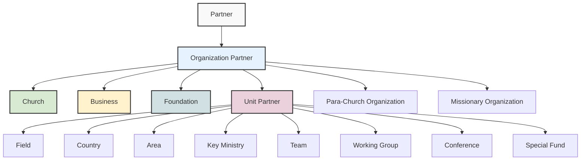
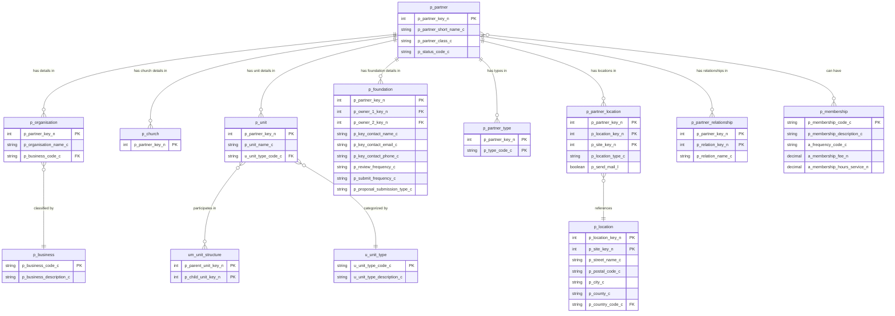
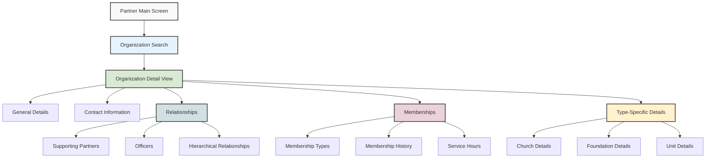

# Overview of Organization Partners in OpenPetra

## Overview of Organization Partners in OpenPetra

OpenPetra's organization partner management system provides a comprehensive framework for non-profit organizations to manage various types of organizational entities. Organizations in OpenPetra are treated as specialized partner entities, distinct from individual partners, with specific attributes and relationships tailored to their role in non-profit administration.

The system supports multiple organization types including churches, businesses, foundations, and organizational units (such as fields, countries, and areas). Each organization type has specialized data structures and functionality to support their unique requirements. Organizations can be categorized using business classifications and can participate in various relationship types with other partners, including hierarchical structures.

OpenPetra's organization management includes features for tracking contact information, addresses, officers, membership details, and reporting relationships. For churches specifically, the system provides specialized functionality for tracking supporting churches, church officers, and relationship management. The foundation management capabilities include tracking foundation owners, submission requirements, and reporting.

The organization partner framework is designed to be flexible enough to accommodate different organizational structures while providing specialized functionality for common non-profit organizational needs.

## Organization Partner Type Hierarchy



The diagram illustrates the hierarchical structure of organization partner types in OpenPetra. At the top level, all entities are partners, with organizations forming a major category. Organizations are further specialized into churches, businesses, foundations, and unit partners. Unit partners represent the organizational structure with entities like fields, countries, areas, and key ministries. Each organization type has specific attributes and functionality tailored to its role in the non-profit administration system.

The hierarchy reflects OpenPetra's design for managing different organizational relationships and structures. This classification system allows for specialized processing, reporting, and relationship management based on the organization type.

## Church Organizations Management

OpenPetra provides specialized functionality for managing church organizations as partners within the system. Churches are treated as a distinct organization type with specific attributes and relationships that support their role in non-profit administration.

The church management functionality includes:

1. **Church Identification and Classification**: Churches are identified with a specific partner type code (CHURCH-OM as seen in the code) and can be further categorized using business classifications.

2. **Supporting Church Relationships**: The system tracks relationships between churches and the partners they support, using the 'SUPPCHURCH' relationship type. This allows for comprehensive reporting on church support networks.

3. **Church Officer Management**: Churches can have officers (such as pastors, treasurers, or board members) associated with them through partner relationships. These relationships are tracked separately from supporting relationships.

4. **Address and Contact Management**: The system maintains comprehensive contact information for churches, including addresses, phone numbers, and email addresses, with appropriate consent tracking.

5. **Church Reporting**: OpenPetra includes specialized reports for churches, such as the "Supporting Churches Report" that displays churches along with their supported partners or officers, contact information, and relationships.

6. **Church Wizard Interface**: A specialized Church Shepherd wizard interface guides users through the process of adding new church partners with appropriate details and relationships.

The church management functionality is integrated with the broader partner management system, allowing churches to participate in the full range of partner relationships while providing specialized functionality for church-specific needs.

## Business Classifications and Organization Types

OpenPetra categorizes organizations using a comprehensive system of business classifications and organization types to facilitate effective partner management. This classification system allows users to segment and filter organization partners based on their industry, purpose, or organizational structure.

### Business Classifications

The system includes 24 predefined business classifications that categorize organizations by industry or sector:

1. **Industry-based Classifications**: Categories like "Agriculture, forestry and fishing," "Banking, financial services," "Healthcare," and "Education" allow organizations to be grouped by their primary business activity.

2. **Non-profit Specific Classifications**: Special categories like "Missionary Organisation" and "Para-Church Organisation" address the unique needs of faith-based non-profits.

3. **Service Provider Classifications**: Categories such as "Printer," "Shipper," and "Supplier" help identify organizations that provide services to the non-profit.

Each business classification has a code (e.g., "AFF" for agriculture) and a description, making it easy to categorize and search for organizations by their business type.

### Organization Types

Beyond business classifications, OpenPetra uses partner types to further categorize organizations:

1. **Church Types**: Churches can be specifically identified with the "CHURCH-OM" type code, distinguishing them from other organizations.

2. **Unit Types**: Organizational units like fields, countries, and areas have specific type codes that define their role in the organizational hierarchy.

3. **Special Types**: Organizations can be marked with special types like "LEDGER" to indicate their role in financial processes.

The combination of business classifications and organization types provides a flexible framework for categorizing organizations based on both their external business nature and their internal role within the non-profit's operations. This classification system supports advanced filtering, reporting, and relationship management based on organization characteristics.

## Organization Partner Data Structure



This entity relationship diagram illustrates the core database structure for organization partners in OpenPetra. The central `p_partner` table stores common partner attributes, while specialized tables like `p_organisation`, `p_church`, `p_unit`, and `p_foundation` contain type-specific details.

Organizations are classified using the `p_business` table, which provides industry categories. Unit partners are categorized using the `u_unit_type` table, defining organizational structures like fields and countries. The hierarchical relationships between units are managed through the `um_unit_structure` table.

Partner locations are stored in the `p_partner_location` table, linking to physical addresses in the `p_location` table. Relationships between partners (such as supporting churches or foundation owners) are tracked in the `p_partner_relationship` table.

This data structure provides a flexible framework for managing different types of organization partners while maintaining consistent core partner data and supporting specialized functionality for each organization type.

## Unit Partners and Organizational Structure

Unit partners in OpenPetra represent the hierarchical organizational structure of a non-profit organization. These specialized organization partners include fields, countries, areas, and other organizational divisions that form the backbone of the organization's operational structure.

### Types of Unit Partners

OpenPetra defines 11 different unit types to represent various organizational structures:

1. **Area (A)**: Represents geographical or functional areas that may contain multiple countries or fields
2. **Country (C)**: Represents country-level organizational units
3. **Field (F)**: Operational fields where ministry activities occur
4. **Conference (CONF)**: Units for managing conferences or events
5. **Key Ministry (KEY-MIN)**: Specialized ministry units within fields
6. **Team (T)**: Smaller operational units for specific tasks or projects
7. **Working Group (W)**: Collaborative units for specific initiatives
8. **Root (R)**: The top-level organizational unit
9. **Special Fund (D)**: Units for managing specialized funding
10. **Other (O)**: Generic unit type for miscellaneous organizational structures
11. **To be discussed (XYZ)**: Placeholder for undefined unit types

### Hierarchical Structure

Unit partners are organized in a hierarchical structure through the `um_unit_structure` table, which defines parent-child relationships between units. This allows OpenPetra to represent complex organizational structures such as:

- Countries belonging to areas
- Fields operating within countries
- Key ministries functioning within fields
- Teams working under key ministries

The sample data generation code demonstrates how these hierarchical relationships are established:

```csharp
// create unit hierarchy
UmUnitStructureRow UnitStructureRow = PartnerDS.UmUnitStructure.NewRowTyped();
UnitStructureRow.ParentUnitKey = 1000000; // Root unit
UnitStructureRow.ChildUnitKey = UnitRow.PartnerKey; // Field unit
PartnerDS.UmUnitStructure.Rows.Add(UnitStructureRow);
```

### Financial Integration

Unit partners are integrated with OpenPetra's financial system through cost centers and ledger connections. Each field unit typically has:

1. A corresponding cost center in the accounting system
2. A valid ledger number linking the partner to financial transactions
3. ILT (Inter-Ledger Transfer) processing center connections

This integration allows for financial reporting and tracking at the organizational unit level, supporting the non-profit's financial management needs.

The unit partner structure provides a flexible framework for representing diverse organizational structures while supporting both operational and financial management requirements.

## Membership Management for Organizations

OpenPetra provides comprehensive functionality for managing organization memberships, allowing non-profits to track membership types, fees, service hours, and frequency settings. This system supports organizations that operate with membership models, such as associations, clubs, or churches with formal membership structures.

### Membership Types and Configuration

The membership management system allows administrators to define different membership categories with specific attributes:

1. **Membership Codes and Descriptions**: Each membership type has a unique code and descriptive name for identification.

2. **Frequency Settings**: Memberships can be configured with different payment frequencies:
   - Annual: Yearly membership fees
   - Quarterly: Fees collected four times per year
   - Monthly: Monthly membership payments

3. **Fee Structure**: Each membership type can have a defined fee amount appropriate to the membership level and benefits.

4. **Service Hours**: Organizations can track expected service hours associated with each membership type, supporting volunteer management and engagement tracking.

### Membership Management Interface

The system provides a user-friendly interface for managing membership types through the `MaintainMemberships.html` template, which includes:

1. **Membership Listing**: A browsable list of all defined membership types with their codes.

2. **Detailed View**: Expandable sections showing complete membership details including description, frequency, fee, and service hours.

3. **Editing Capabilities**: Modal dialogs for editing existing membership types or creating new ones, with appropriate form fields for all membership attributes.

4. **Delete Functionality**: Options to remove outdated or unused membership types.

### Implementation Details

The membership data is stored in the `p_membership` table with the following structure:

- `p_membership_code_c`: Primary key identifying the membership type
- `p_membership_description_c`: Descriptive name of the membership
- `a_frequency_code_c`: Payment frequency (Annual/Quarterly/Monthly)
- `a_membership_fee_n`: The fee amount for this membership type
- `a_membership_hours_service_n`: Expected service hours associated with this membership

This membership management system provides organizations with the flexibility to define various membership structures while maintaining consistent tracking and reporting of membership data across the organization.

## Organization Management User Interface



The Organization Management interface in OpenPetra provides a comprehensive set of screens for managing organization partners. The interface follows a hierarchical structure, starting with partner search functionality and drilling down to specific organization details.

The main components of the interface include:

1. **Organization Search**: Users can search for organizations using various criteria including name, partner key, business type, and location. The search results display organization partners in a tabular format with key identifying information.

2. **Organization Detail View**: Once an organization is selected, users access a detailed view with multiple tabs:
   - General Details: Basic organization information including name, status, and business classification
   - Contact Information: Addresses, phone numbers, and email contacts
   - Relationships: Supporting partners, officers, and hierarchical relationships
   - Memberships: Membership types, history, and service hours
   - Type-Specific Details: Specialized information based on organization type (church, foundation, unit)

3. **Type Management Screens**: Separate interfaces exist for managing organization types, business classifications, and membership types. These screens allow administrators to define the taxonomies used throughout the system.

4. **Wizard Interfaces**: For creating new organizations, specialized wizards guide users through the process with type-specific forms, such as the Church Shepherd wizard that collects church-specific information.

The interface uses modern web components including collapsible sections, modal dialogs for editing, and responsive layouts to provide an intuitive user experience for managing organization partners of all types.

## Foundation Reporting and Management

OpenPetra provides specialized functionality for managing foundations as a distinct type of organization partner. Foundations in OpenPetra represent grant-making entities that may support the non-profit's work through funding opportunities. The system includes comprehensive tools for tracking foundation details, owners, submission requirements, and generating foundation reports.

### Foundation Data Structure

Foundations are stored in the `p_foundation` table with specialized attributes beyond the standard organization fields:

1. **Foundation Owners**: Each foundation can have up to two owners (`p_owner_1_key_n` and `p_owner_2_key_n`), typically representing the primary contacts or relationship managers for the foundation.

2. **Key Contact Information**: Dedicated fields store the foundation's key contact name, email, and phone number for direct communication.

3. **Review and Submission Details**: The system tracks review frequency (`p_review_frequency_c`), submission frequency (`p_submit_frequency_c`), and proposal submission type (`p_proposal_submission_type_c`) to help manage the grant application process.

### Foundation Reporting

The "Brief Foundation Report" provides a comprehensive view of foundation partners with their key details:

1. **Report Parameters**: Users can generate reports for a single partner, an extract of partners, or all current staff, with sorting options by partner name or key.

2. **Foundation Details**: The report displays foundation names, partner keys, owner information, and contact details.

3. **Address Information**: Complete address details are formatted and displayed for each foundation.

4. **Submission Information**: The report includes review frequency, submission frequency, and submission type to support grant application planning.

### Foundation Management Process

The foundation management functionality supports the following workflow:

1. **Foundation Record Creation**: Creating foundation partners with appropriate classification and specialized foundation details.

2. **Owner Assignment**: Linking foundation records to staff members who manage the relationship.

3. **Submission Tracking**: Recording submission requirements and schedules to ensure timely grant applications.

4. **Contact Management**: Maintaining up-to-date contact information for foundation representatives.

5. **Reporting**: Generating foundation reports for relationship management and grant application planning.

This specialized foundation management functionality helps non-profits maintain effective relationships with funding organizations and optimize their grant application processes.

## Organization Partner Relationships

OpenPetra provides a robust framework for managing relationships between organizations and other partners, supporting complex organizational structures and operational relationships. These relationships are fundamental to representing how organizations interact with individuals, other organizations, and the non-profit's internal structure.

### Types of Organization Relationships

The system supports several key relationship types:

1. **Supporting Relationships**: Churches and other organizations can be designated as "supporting" partners for individuals or other organizations. This is implemented through the 'SUPPCHURCH' relationship type, which links churches to the partners they support.

2. **Officer Relationships**: Organizations can have officers (such as board members, pastors, or directors) associated with them. These relationships connect individual partners to organizations in specific roles.

3. **Hierarchical Relationships**: Unit partners form hierarchical structures through parent-child relationships. For example:
   - Areas contain countries
   - Countries contain fields
   - Fields contain key ministries
   - Key ministries contain teams

4. **Foundation Owner Relationships**: Foundations have owner relationships that connect them to the staff members who manage the foundation relationship.

### Relationship Implementation

These relationships are implemented through two primary mechanisms:

1. **Partner Relationship Table**: The `p_partner_relationship` table stores direct relationships between partners with fields:
   - `p_partner_key_n`: The primary partner in the relationship
   - `p_relation_key_n`: The related partner
   - `p_relation_name_c`: The type of relationship (e.g., 'SUPPCHURCH')

2. **Unit Structure Table**: For hierarchical unit relationships, the `um_unit_structure` table defines parent-child connections:
   - `p_parent_unit_key_n`: The parent unit in the hierarchy
   - `p_child_unit_key_n`: The child unit

### Relationship Management

The system includes functionality for:

1. **Creating Relationships**: Adding new relationships between partners through the user interface.

2. **Querying Relationships**: Finding related partners based on relationship types, such as identifying all partners supported by a specific church.

3. **Reporting on Relationships**: Generating reports that show relationship networks, such as the "Supporting Churches Report" that displays churches along with their supported partners.

4. **Visualizing Hierarchies**: Representing organizational structures through hierarchical displays of unit relationships.

These relationship capabilities enable OpenPetra to represent complex organizational networks and support relationship-based operations and reporting essential to non-profit administration.

## Organization Partner Data Generation

OpenPetra includes comprehensive tools for generating sample organization data to support testing, demonstration, and training purposes. This functionality allows system administrators to populate the database with realistic organization partners representing various organization types, including businesses, churches, foundations, and organizational units.

### Organization Data Generation Components

The sample data generation system includes several specialized components:

1. **SampleDataOrganisations**: Generates general organization partners from CSV files created by Benerator. It creates partner records, organization details, locations, and supplier information when applicable.

2. **SampleDataUnitPartners**: Creates unit partners such as fields and key ministries, establishing the organizational hierarchy and connecting units to the financial system through cost centers and ledger numbers.

3. **TSampleDataConstructor**: Orchestrates the overall sample data generation process, connecting to the OpenPetra server and executing the various data generation components in the appropriate sequence.

### Data Generation Process

The organization data generation process follows these steps:

1. **Raw Data Preparation**: External tools like Benerator create CSV files with basic organization data including names, addresses, and classifications.

2. **Partner Key Allocation**: The system reserves blocks of partner keys (typically 100 at a time) to efficiently assign unique identifiers to new organization records.

3. **Organization Record Creation**: Basic organization records are created with appropriate partner class, status, and short name.

4. **Specialized Data Creation**: Depending on the organization type, additional records are created:
   - For general organizations: Organization name and business classification
   - For units: Unit name, type code, and hierarchical relationships
   - For churches: Church-specific attributes and relationships
   - For foundations: Owner information and submission details

5. **Location Data**: Address and contact information is generated and linked to the organization partners.

6. **Financial Integration**: For applicable organizations (like units and suppliers), appropriate financial records are created including cost centers, valid ledger numbers, and supplier accounts.

### Implementation Details

The data generation code uses a transaction-based approach to ensure data integrity:

```csharp
TDBTransaction Transaction = new TDBTransaction();
bool SubmitOK = false;
db.WriteTransaction(
    ref Transaction,
    ref SubmitOK,
    delegate
    {
        PartnerEditTDSAccess.SubmitChanges(MainDS, db);
        AApSupplierAccess.SubmitChanges(supplierTable, Transaction);
        SubmitOK = true;
    });
```

This approach ensures that all related records are created consistently, maintaining referential integrity across the database.

The organization partner data generation functionality provides a valuable tool for creating realistic test environments, supporting training activities, and demonstrating system capabilities with representative organization data.

[Generated by the Sage AI expert workbench: 2025-03-30 02:22:57  https://sage-tech.ai/workbench]: #