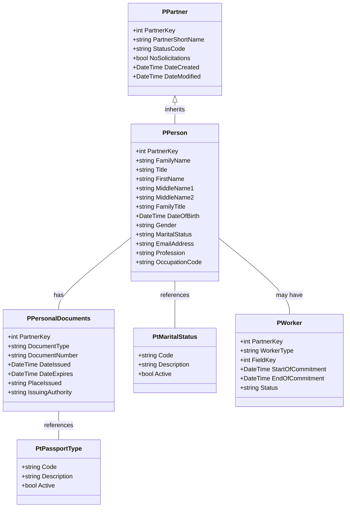
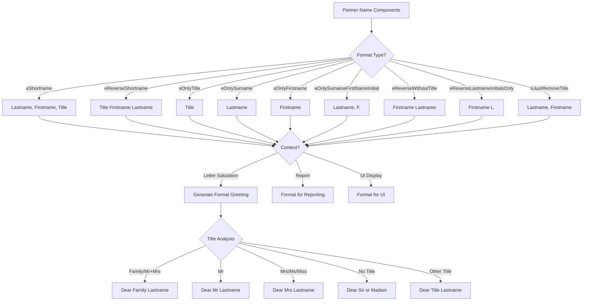
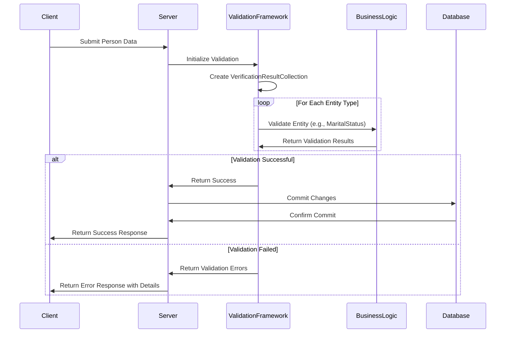
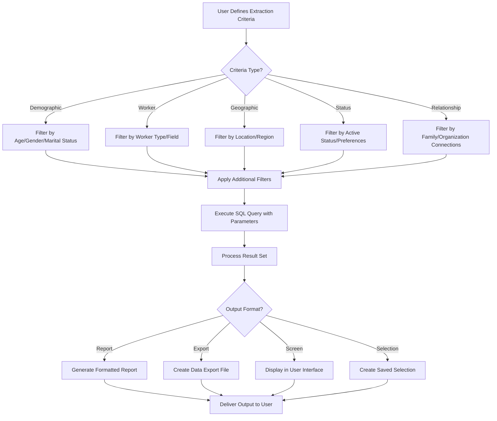

# Partner-Person Management in OpenPetra

## Introduction to Partner-Person Management

OpenPetra's partner-person management system forms a critical component of its broader partner framework, providing specialized handling for individual records within the non-profit organization context. The system is designed with a hierarchical approach where "Partner" serves as the base entity type, with "Person" being a specialized implementation focusing on individual human records. This architecture enables OpenPetra to maintain comprehensive records of individuals while leveraging common partner functionality such as contact management, relationship tracking, and communication preferences.

For non-profit organizations, effective person management is essential for maintaining donor relationships, tracking staff and volunteers, managing field workers, and supporting various organizational activities. The system's ability to store detailed personal information while maintaining data integrity through robust validation mechanisms ensures that organizations can rely on accurate and consistent person data for operational and strategic decision-making.

## Personal Identity Documentation

OpenPetra implements a sophisticated system for managing personal identification documents that is critical for organizations with international operations. The system supports multiple document types including passports, driving licenses, and ID cards, each with their specific attributes and validation requirements.

Passport management is particularly comprehensive, with the system supporting six predefined passport types:
- Diplomatic passports
- ID Cards
- Full Passports
- Residence Permits
- Short-term Passports (issued for 3-month periods)
- Visitor documents

Each document type is configured with parameters that control validation rules, expiry tracking, and usage contexts. The document management system stores critical information such as document numbers, issuing authorities, issue dates, and expiration dates. This enables organizations to proactively manage document renewals, verify identity information, and ensure compliance with international regulations.

The driving license document type is configured separately but follows a similar pattern, with appropriate fields for license-specific information. The system's extensible design allows for additional document types to be added as needed, with placeholder fields available for future customization.

## Person Data Structure



The person data structure in OpenPetra is built on a hierarchical model where person records inherit from the base partner entity while adding person-specific attributes. The core tables include PPartner for base information, PPerson for personal details, and specialized tables for documents, demographic information, and worker data.

Person records contain comprehensive personal information including names (with multiple components like title, first name, middle names, family name), demographic data (gender, date of birth, marital status), and contact information. The system maintains relationships between these entities through foreign key relationships, ensuring data integrity while allowing flexible querying and reporting.

Personal documents are stored in a separate table with references to document type definitions, enabling the system to track multiple documents per person with their respective validity periods and issuing authorities. This structure supports sophisticated document management workflows including expiry notifications and validation checks.

## Demographic Information Management

OpenPetra's demographic information management system provides a structured approach to storing and validating personal attributes such as marital status, gender, and age-related information. Marital status, for example, is implemented as a reference table (pt_marital_status) containing predefined status codes including Married, Divorced, Widowed, Single, Engaged, Separated, Child, and Unknown. Each status includes a description and an active flag to control availability in the user interface.

The system implements a validation framework that ensures demographic information adheres to business rules before being committed to the database. For marital status, the `ValidateMaritalStatusListManual` method in the `TPartnerCacheable` class validates each record against predefined rules, checking for required fields, valid codes, and logical consistency. This validation occurs during data entry and before database commits, ensuring data integrity throughout the system.

Demographic information serves multiple purposes within OpenPetra, including:
- Personalized communication through appropriate salutations and greetings
- Reporting and statistical analysis of constituent demographics
- Filtering and segmentation for targeted communications
- Compliance with organizational policies and legal requirements

The system's flexible design allows organizations to customize certain demographic attributes while maintaining core validation rules, ensuring consistency across implementations while accommodating organization-specific requirements.

## Name Formatting and Presentation

OpenPetra implements a sophisticated name formatting system that provides flexible presentation options for person names in different contexts. The `Calculations` class in the Partner module contains several methods dedicated to name formatting, with `DeterminePartnerShortName` serving as the primary method for standardizing name formats. This method combines surname, title, first name, and middle name components into a consistent format, handling edge cases such as missing components and length constraints.

The system supports multiple name formatting styles through the `FormatShortName` method, which accepts an enumeration parameter (`eShortNameFormat`) to specify the desired format:

- Standard shortname (e.g., "Smith, John, Mr")
- Reverse shortname (e.g., "Mr John Smith")
- Title only (e.g., "Mr")
- Surname only (e.g., "Smith")
- First name only (e.g., "John")
- Surname with first name initial (e.g., "Smith, J.")
- Reverse without title (e.g., "John Smith")
- Reverse with lastname initials only (e.g., "John S.")
- Standard format without title (e.g., "Smith, John")

For formal communications, the `FormalGreeting` method generates appropriate salutations based on the person's title and gender. The method intelligently handles different scenarios:
- Family greetings (e.g., "Dear Family Smith")
- Male-specific greetings (e.g., "Dear Mr Smith")
- Female-specific greetings (e.g., "Dear Mrs Smith")
- Default greetings for organizations (e.g., "Dear Sir or Madam")
- Generic greetings for unrecognized titles

This flexibility enables OpenPetra to generate contextually appropriate name formats for various communication channels, reports, and user interfaces.

## Name Formatting Options Flow



The diagram illustrates the decision process for formatting person names in OpenPetra. Starting with the basic name components (first name, last name, title), the system applies different formatting rules based on the requested format type. The formatted name is then further processed according to the usage context, with special handling for formal greetings in letters.

For formal greetings, the system analyzes the title to determine the appropriate salutation format. It recognizes family titles, gender-specific titles (Mr, Mrs, Ms, Miss), and handles cases where no title is available (typically for organizations). The result is a contextually appropriate greeting that can be used in letters, emails, and other formal communications.

This sophisticated name formatting capability ensures consistent and appropriate presentation of person names throughout the system, enhancing the professionalism of communications and improving user experience.

## Age Calculation and Date Handling

OpenPetra implements precise age calculation functionality through the `CalculateAge` methods in the `Calculations` class. These methods determine a person's age in years based on their birth date, with two variants available:

1. `CalculateAge(DateTime ABirthday)` - Calculates age as of the current date
2. `CalculateAge(DateTime ABirthday, DateTime ACalculationDate)` - Calculates age as of a specified date

The age calculation algorithm accounts for the exact day of birth, properly handling edge cases where the calculation date falls before the birthday in the current year. This ensures accurate age determination for reporting, eligibility checks, and demographic analysis.

```csharp
public static int CalculateAge(DateTime ABirthday, DateTime ACalculationDate)
{
    int years = ACalculationDate.Year - ABirthday.Year;

    // subtract another year if we're before the birthday in the current year
    if ((ACalculationDate.Month < ABirthday.Month)
        || ((ACalculationDate.Month == ABirthday.Month) && (ACalculationDate.Day < ABirthday.Day)))
    {
        years--;
    }

    return years;
}
```

Beyond age calculation, the system handles various date-related operations for person records, including:

- Validation of birth dates against logical constraints (e.g., not in the future)
- Tracking document expiry dates for passports and other identification
- Managing date ranges for commitments, assignments, and relationships
- Determining current status based on effective dates and expiry dates

The date handling functionality integrates with the broader validation framework to ensure data integrity while providing flexible reporting and filtering capabilities based on date-sensitive information.

## Data Validation Framework

OpenPetra implements a comprehensive validation framework for person records, ensuring data integrity and consistency throughout the system. The validation architecture follows a multi-layered approach, with validation occurring at both the client and server levels before data is committed to the database.

For person-related data, validation rules are implemented in specialized classes such as `TValidation_CacheableDataTables`, which contains methods for validating specific entity types. The `ValidateMaritalStatusListManual` method in the `TPartnerCacheable` class demonstrates this approach, iterating through submitted marital status records and applying validation rules to each non-deleted row.

Validation checks for person records typically include:

- Required field validation (ensuring mandatory fields are provided)
- Format validation (checking that values match expected patterns)
- Logical validation (ensuring values make sense in context)
- Reference validation (verifying that referenced entities exist)
- Business rule validation (applying organization-specific constraints)

Validation results are collected in a `TVerificationResultCollection` object, which accumulates errors, warnings, and information messages that can be returned to the client application. This allows for comprehensive feedback to users while preventing invalid data from being stored in the database.

The validation framework is extensible through the partial class pattern, allowing organizations to implement custom validation rules without modifying core system code. This ensures that the system can adapt to organization-specific requirements while maintaining a consistent validation approach.

## Person Record Validation Process



The sequence diagram illustrates the validation workflow for person data in OpenPetra. When a client submits person data (either new records or updates to existing ones), the server initiates the validation process by creating a verification result collection to track validation outcomes.

The validation framework then processes each entity type (such as marital status, personal documents, or demographic information) through specialized validation methods in the business logic layer. These methods apply business rules and validation checks, adding any errors or warnings to the verification result collection.

If all validations pass successfully, the changes are committed to the database and a success response is returned to the client. If any validation fails, the server returns the detailed validation errors to the client without committing the changes, allowing the user to correct the issues and resubmit.

This comprehensive validation process ensures data integrity while providing clear feedback to users, improving data quality and system reliability.

## Worker Classification and Management

OpenPetra provides specialized functionality for managing worker-type persons within the partner framework. Workers represent individuals who serve in various capacities within the organization, such as staff members, volunteers, field workers, or short-term participants. The system tracks worker-specific attributes beyond standard person information, including field assignments, commitment periods, worker types, and status.

The worker classification system is implemented through dedicated database tables and specialized extraction capabilities. The SQL query in `Partner.Queries.ExtractPartnerByField.WorkerField.sql` demonstrates how the system can extract partner data based on worker field criteria, with filtering options for:

- Worker type (using the `p_type_code_c` field with pattern matching)
- Field assignment (using the `p_field_key_n` parameter)
- Active status (optional filtering for active partners only)
- Solicitation preferences (optional exclusion of partners with no solicitations)

Worker records can be further classified by worker type, allowing organizations to distinguish between different categories of workers such as full-time staff, volunteers, short-term workers, or contractors. This classification drives various system behaviors including reporting options, access permissions, and communication preferences.

The worker management functionality integrates with other system components including:
- Field management for tracking geographical and organizational assignments
- Commitment tracking for managing start and end dates of service
- Skill and qualification tracking for matching workers to appropriate roles
- Reporting and extraction for workforce planning and analysis

This comprehensive approach to worker classification and management enables organizations to effectively track their human resources and optimize workforce allocation.

## Person Record Extraction and Reporting

OpenPetra provides powerful capabilities for extracting and reporting on person data based on various criteria. The system's extraction framework allows users to create targeted selections of person records for reporting, communication, or analysis purposes. The SQL query in `Partner.Queries.ExtractPartnerByField.WorkerField.sql` demonstrates one aspect of this functionality, focusing on worker-related extractions.

The extraction system supports filtering based on multiple criteria including:

1. **Demographic attributes**: Age, gender, marital status
2. **Worker characteristics**: Field assignments, worker types, commitment periods
3. **Geographic information**: Address location, postal regions, country
4. **Status indicators**: Active status, solicitation preferences
5. **Relationship data**: Family connections, organizational relationships

Extraction results can be customized to include various data fields beyond basic identification, with the placeholder `##address_filter_fields##` in the SQL query indicating where additional fields can be dynamically included based on user requirements.

The system also supports sophisticated ordering and grouping options, with the query demonstrating ordering by partner short name and optional address-based ordering through the `##address_filter_order_by_clause##` placeholder.

Extracted person data can be used for various purposes including:
- Generating mailing lists for targeted communications
- Creating statistical reports on demographic distributions
- Analyzing workforce composition and field coverage
- Identifying candidates for specific roles or opportunities
- Supporting strategic planning and resource allocation

The flexible extraction capabilities ensure that organizations can leverage their person data effectively for operational and strategic purposes.

## Person Data Extraction Flow



The diagram illustrates the process flow for extracting person records in OpenPetra. The extraction begins with the user defining criteria across various dimensions including demographics, worker attributes, geographic information, status indicators, and relationships. These criteria are combined into a comprehensive filter set that is applied to the database query.

The system executes the parameterized SQL query, which includes dynamic elements for flexible field selection and filtering conditions. The result set is then processed according to the desired output format, which could be a formatted report, a data export file, a screen display, or a saved selection for future use.

This flexible extraction framework enables users to create precisely targeted selections of person records for various purposes, enhancing the system's utility for communication, analysis, and decision support.

[Generated by the Sage AI expert workbench: 2025-03-30 02:22:57  https://sage-tech.ai/workbench]: #