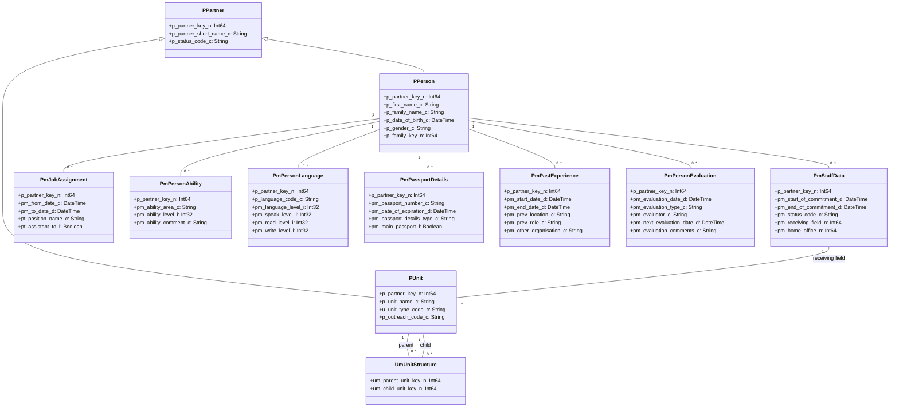

# Staff Management in OpenPetra

## Overview of Staff Management in OpenPetra

OpenPetra's staff management functionality provides a comprehensive system for managing personnel records, tracking commitments, handling job assignments, and maintaining organizational structures. The system is designed to support non-profit organizations in efficiently managing their workforce, whether they are employees, volunteers, or field workers.

The personnel module integrates with other parts of OpenPetra to provide a holistic view of staff members, including their personal information, skills, qualifications, job assignments, and commitment periods. It supports various personnel management processes such as recruitment, onboarding, skills tracking, and performance evaluation.

Key components of the staff management functionality include personnel records management, commitment tracking, job assignment management, skills and qualifications tracking, organizational structure management, and reporting capabilities. The system is designed to be flexible, accommodating different types of staff relationships and organizational structures.

## Personnel Data Structure

The diagram illustrates the core data structure for personnel management in OpenPetra. At the center is the PPartner entity, which is specialized into PPerson for individual staff members and PUnit for organizational units. Staff members have associated records for commitments (PmStaffData), job assignments (PmJobAssignment), skills (PmPersonAbility), languages (PmPersonLanguage), passports (PmPassportDetails), previous work experience (PmPastExperience), and evaluations (PmPersonEvaluation). The organizational structure is represented by PUnit entities connected through UmUnitStructure relationships, forming a hierarchical structure.

## Staff Records and Personal Information

OpenPetra's staff management system maintains comprehensive personnel records that serve as the foundation for all staff-related processes. These records include both basic personal information and detailed professional data.

Personal information management in OpenPetra encompasses:

1. **Basic Biographical Data**: The system stores fundamental information such as names, date of birth, gender, marital status, and contact details. This information is maintained in the PPerson table, which extends the base PPartner entity.

2. **Family Relationships**: OpenPetra tracks family relationships between personnel, allowing organizations to maintain connections between related staff members. This is particularly useful for organizations with family units serving together.

3. **Contact Information**: Multiple contact methods including addresses, phone numbers, and email addresses can be stored and designated as primary or alternate contact points.

4. **Document Management**: The system maintains records of personal documents such as passports, visas, and other identification documents. It tracks document numbers, issue dates, expiration dates, and issuing authorities.

5. **Emergency Contacts**: OpenPetra stores emergency contact information including relationship to the staff member, contact details, and address information. This data is critical for crisis management and duty of care.

6. **Medical Information**: Special needs, medical conditions, allergies, and other health-related information can be recorded to ensure appropriate accommodations and emergency response.

7. **Personal Data Protection**: The system includes features to manage consent and comply with data protection regulations, ensuring personal information is handled appropriately.

The personal data management functionality is designed to be comprehensive while maintaining flexibility for different organizational needs. Reports can be generated to provide overviews of staff personal information, emergency contacts, and document status, helping organizations maintain up-to-date records and identify documents that require renewal.

## Commitment Management

Commitment management is a core function of OpenPetra's personnel module, designed to track the formal relationship between staff members and the organization. This functionality allows organizations to monitor the tenure, status, and terms of service for each staff member.

Key aspects of commitment management include:

1. **Commitment Periods**: The system tracks start and end dates for each staff member's commitment to the organization. This information is stored in the PmStaffData table and forms the basis for determining active staff members at any given time.

2. **Commitment Types**: OpenPetra categorizes commitments using predefined types such as:
   - LONG-TERMER: For staff with long-term commitments
   - WORKER: For staff serving 6 months or longer but not yet long-term
   - SHORT-TERMER: For staff serving less than 6 months
   - STAFF: For paid employees
   - VOLUNTEER: For unpaid volunteers
   - GUEST: For associates needing temporary access
   - TRANSITION: For those who have left but need temporary access

3. **Status Tracking**: Each commitment has an associated status that indicates the current state of the relationship between the staff member and the organization.

4. **Field Assignments**: Commitments include information about the receiving field (where the staff member is assigned) and the home office (which manages the staff member), allowing organizations to track international placements.

5. **Commitment Reports**: The system provides reports for tracking:
   - Start of Commitment: New staff joining within a specified period
   - End of Commitment: Staff whose commitments are ending soon
   - Length of Commitment: Duration of service, useful for recognizing service milestones
   - Current Commitments: Active staff as of a specified date

6. **Anniversary Tracking**: OpenPetra can identify and report on service anniversaries, allowing organizations to recognize staff for their years of service.

The commitment management functionality enables organizations to maintain clear records of staff relationships, plan for transitions as commitments end, and ensure appropriate recognition for service milestones. It serves as the foundation for determining who is considered active staff at any point in time, which affects access to systems, inclusion in reports, and organizational planning.

## Organizational Structure

OpenPetra provides robust functionality for managing organizational structures, which is essential for staff management in complex organizations. The system allows organizations to define and maintain hierarchical relationships between different units, departments, fields, and teams.

Key features of the organizational structure management include:

1. **Unit Hierarchy**: OpenPetra represents organizational units as entities in the PUnit table, with hierarchical relationships defined in the UmUnitStructure table. This allows for the creation of multi-level organizational charts with parent-child relationships between units.

2. **Unit Types**: Different types of organizational units can be defined, such as departments, fields, teams, or projects. Each unit type can have specific attributes and behaviors.

3. **Unit Management**: The system provides interfaces for creating, modifying, and deactivating organizational units. Units can be moved within the hierarchy as organizational structures evolve.

4. **Staff Assignment**: Staff members can be assigned to specific units through their commitments and job assignments. This creates a link between the personnel structure and the organizational structure.

5. **Field Management**: For organizations with international operations, OpenPetra supports the concept of fields, which represent geographical or functional areas of operation. Fields can have specific attributes such as country codes and outreach codes.

6. **Reporting Lines**: The organizational structure implicitly defines reporting lines, which can be used for approval workflows and information access controls.

7. **Unit Hierarchy Reports**: The system can generate reports showing the complete organizational structure or specific branches of the hierarchy, providing visibility into how the organization is structured.

The organizational structure functionality in OpenPetra is designed to be flexible, accommodating various organizational models from simple hierarchies to complex matrix structures. This flexibility allows organizations to accurately represent their actual structure while maintaining the relationships needed for effective staff management.

## Job Assignments and Positions

OpenPetra's job assignment management functionality allows organizations to track the specific roles and responsibilities assigned to staff members. This system provides a more detailed level of assignment tracking than the basic commitment records, enabling organizations to maintain a history of positions held by each staff member.

Key aspects of job assignments and positions include:

1. **Position Definitions**: The system maintains a catalog of standard positions (in the pt_position table) with codes and descriptions, such as:
   - Field leadership roles (e.g., Field Leader, Team Leader)
   - Administrative positions (e.g., Office Manager, Secretary)
   - Technical roles (e.g., IT Administrator, Accountant)
   - Ministry positions (e.g., Youth Worker, Musician)

2. **Assignment Types**: Job assignments can be categorized by type:
   - Full-Time field (F)
   - Ministry roles like guest or speaker (M)
   - Part-Time Job (P)

3. **Assignment Periods**: Each job assignment has a defined start date and optional end date, allowing for tracking of a staff member's role changes over time.

4. **Role Hierarchy**: The system can track whether a position is an assistant role, establishing a basic hierarchy of positions within a unit.

5. **Multiple Assignments**: Staff members can hold multiple simultaneous job assignments, accommodating part-time roles or matrix organizational structures.

6. **Assignment History**: OpenPetra maintains a complete history of job assignments for each staff member, providing a record of career progression within the organization.

7. **Job Assignment Reports**: Reports can be generated showing:
   - Current job assignments across the organization
   - Staff members in specific roles
   - Assignment history for individual staff members
   - Upcoming assignment changes (starts and ends)

The job assignment functionality complements the broader commitment management system by providing more granular tracking of specific roles and responsibilities. This enables organizations to maintain detailed records of what staff members do within the organization, beyond just their general commitment status.

## Skills and Qualifications

OpenPetra provides comprehensive functionality for tracking staff skills, qualifications, and capabilities. This allows organizations to maintain a detailed inventory of their workforce's abilities, which is valuable for assignment planning, project staffing, and professional development.

Key features of skills and qualifications tracking include:

1. **Skill Categories**: The system organizes skills into categories such as:
   - COMMUNICATION (e.g., Graphic Designer, Journalist)
   - EDUCATION (e.g., Teacher, Lecturer)
   - FINANCE (e.g., Accountant, Auditor)
   - MEDICAL (e.g., Dentist, Doctor, Nurse)
   - MINISTRY (e.g., Pastor, Evangelist)
   - TECHNICAL (e.g., Engineer, Carpenter)
   - OFFICE (e.g., Manager, Secretary)

2. **Skill Levels**: Each skill can be rated on a standardized scale:
   - Basic
   - Moderate
   - Competent
   - Professional
   - Level not known (for skills that have been identified but not assessed)

3. **Ability Areas**: More specific abilities can be tracked within broader skill categories, with over 200 predefined ability codes covering diverse areas from programming to counseling to carpentry.

4. **Ability Levels**: Abilities can be rated on a detailed 0-10 scale:
   - 0: No clear information
   - 1-3: Limited exposure or minimal ability
   - 4-6: Moderate to competent ability
   - 7-10: Highly competent to expert level

5. **Professional Qualifications**: Formal qualifications, certifications, and degrees can be recorded with details about the issuing institution and date obtained.

6. **Language Proficiency**: The system tracks language skills with separate ratings for speaking, reading, writing, and overall proficiency.

7. **Previous Experience**: Work history and relevant experience can be recorded, including roles, organizations, locations, and dates.

8. **Leadership Ratings**: Staff can be assessed on leadership capability using a -1 to 5 scale, from "No information" to "Leader of 100+ - Seasoned veteran."

9. **Skills Reporting**: Reports can be generated to identify:
   - Staff with specific skills or qualifications
   - Language capabilities across the organization
   - Skill gaps that may need to be addressed
   - Leadership capacity within the organization

The skills and qualifications tracking functionality enables organizations to make informed decisions about staff assignments, identify training needs, and leverage the full range of capabilities within their workforce. It also helps in succession planning by identifying staff with the skills needed for future leadership roles.

## Personnel Reporting System

OpenPetra includes a robust reporting system for personnel management, providing organizations with the tools to generate a wide range of reports for operational needs, compliance requirements, and strategic planning. The reporting system is flexible, allowing for customization of report parameters and output formats.

Key features of the personnel reporting system include:

1. **Staff Directory Reports**:
   - Birthday Lists: Reports showing birthdays within specified date ranges
   - Staff Listings: Comprehensive or filtered lists of staff members
   - Contact Information: Reports with contact details for staff members
   - Emergency Contact Reports: Lists of emergency contacts for staff

2. **Commitment Reports**:
   - Start of Commitment: New staff joining within a specified period
   - End of Commitment: Staff whose commitments are ending soon
   - Length of Commitment: Duration of service for staff members
   - Service Anniversaries: Recognition of milestone service years

3. **Document Management Reports**:
   - Passport Expiry: Lists of passports expiring within a specified period
   - Personal Documents Expiry: Tracking of document renewal requirements
   - Missing Documentation: Identification of incomplete personnel records

4. **Skills and Qualifications Reports**:
   - Languages Report: Staff language capabilities
   - Abilities Report: Specialized skills and proficiency levels
   - Previous Experience Report: Work history and relevant experience

5. **Evaluation Reports**:
   - Progress Reports: Staff evaluations and development tracking
   - Leadership Assessments: Reports on leadership capacity and potential

6. **Organizational Structure Reports**:
   - Unit Hierarchy Report: Visualization of the organizational structure
   - Job Assignment Report: Current roles and responsibilities
   - Field Reports: Staff assignments by geographical or functional area

7. **Specialized Reports**:
   - Partner by Field: Staff members assigned to specific fields
   - Partner by Event: Staff participation in events or programs
   - Outreach Options: Available outreach opportunities and assignments

The reporting system supports various output formats and can be configured to meet specific organizational needs. Reports can be generated for individual staff members, specific groups (via extracts), or the entire organization. Parameters allow for filtering by date ranges, status, location, and other criteria to produce targeted reports for different purposes.

## Document Management

OpenPetra's personnel module includes robust document management capabilities that allow organizations to track and monitor various types of personnel-related documents. This functionality is crucial for ensuring compliance with legal requirements, maintaining up-to-date records, and managing document renewal processes.

Key aspects of document management include:

1. **Passport Tracking**: The system maintains detailed passport information including:
   - Passport number and type
   - Issuing country and authority
   - Issue and expiration dates
   - Full passport name (which may differ from everyday name)
   - Main passport designation (for individuals with multiple passports)
   - Nationality information derived from passports

2. **Personal Documents**: Beyond passports, OpenPetra tracks various personal documents such as:
   - Visas and residence permits
   - Work permits and authorizations
   - Driver's licenses
   - Birth certificates
   - Marriage certificates
   - Educational certificates
   - Professional licenses

3. **Document Metadata**: For each document, the system stores:
   - Document type and ID
   - Start and expiry dates
   - Issuing authority and location
   - Associated comments or notes
   - Links to scanned copies (where applicable)

4. **Expiry Monitoring**: OpenPetra provides reports to identify documents that:
   - Have already expired
   - Will expire within a specified timeframe
   - Require renewal or replacement

5. **Document History**: The system maintains a history of documents, allowing organizations to track document replacements and renewals over time.

6. **Document Verification**: Functionality exists to record verification of document authenticity and completeness.

7. **Document Reports**: Several reports are available including:
   - Passport Expiry Report
   - Personal Documents Expiry Report
   - Missing Documentation Report

The document management functionality helps organizations maintain compliance with immigration and employment requirements by ensuring staff have valid and appropriate documentation. It also supports duty of care by tracking important personal documents that may be needed in emergency situations.

## Staff Applications and Recruitment

OpenPetra includes functionality for managing the application and recruitment process for new staff members. This allows organizations to track potential staff from initial inquiry through the application process and eventual acceptance or rejection.

Key features of the staff applications and recruitment functionality include:

1. **Application Types**: The system supports different application forms:
   - SHORT FORM: Typically used for short-term positions or events
   - LONG FORM: Used for long-term positions requiring more detailed information

2. **Application Status Tracking**: Applications can be tracked through various statuses:
   - Enquiry (E): Initial interest expressed
   - On Hold (H): Processing paused for various reasons (e.g., awaiting references, medical reports)
   - Accepted (A): Application approved
   - Cancelled by Applicant (C1-C7): Various reasons for applicant withdrawal
   - Rejected by Organization (R1-R7): Various reasons for organizational rejection

3. **Application Data**: The system stores comprehensive application information including:
   - Personal details
   - Contact information
   - Educational background
   - Work experience
   - References
   - Position preferences
   - Availability dates

4. **Event Applications**: Applications can be linked to specific events or outreach opportunities, with tracking of event codes and roles.

5. **Application Processing**: The system supports workflow for application review, including:
   - Document collection and verification
   - Reference checking
   - Medical clearance
   - Financial arrangements
   - Placement matching

6. **Conversion to Staff Records**: Accepted applications can be converted to staff records, creating appropriate personnel records and commitment entries.

7. **Application Reports**: Reports can be generated showing:
   - Applications by status
   - Applications for specific events or positions
   - Application processing statistics

8. **Previous Experience Tracking**: Information from applications can be preserved as previous experience records even if the application is not accepted.

The application and recruitment functionality helps organizations standardize their recruitment process, ensure consistent evaluation of candidates, and maintain appropriate records of the application process. It provides a structured approach to bringing new staff into the organization and creates a seamless transition from applicant to staff member when applications are accepted.

## Personnel Evaluation and Progress Tracking

OpenPetra provides functionality for tracking staff evaluations, progress reports, and performance assessments. This allows organizations to maintain records of staff development, provide feedback, and plan for future growth and advancement.

Key aspects of personnel evaluation and progress tracking include:

1. **Evaluation Types**: The system supports different types of evaluations and progress reports, which can be customized to match organizational assessment processes.

2. **Evaluation Schedule**: For each staff member, organizations can track:
   - Past evaluation dates
   - Next scheduled evaluation date
   - Evaluation frequency

3. **Evaluation Content**: Progress reports can include:
   - Performance assessments
   - Goal achievement
   - Strengths and areas for development
   - Training recommendations
   - Future assignment considerations

4. **Evaluator Information**: The system records who conducted the evaluation, allowing for tracking of evaluation responsibilities and patterns.

5. **Comments and Feedback**: Detailed comments and feedback can be recorded for each evaluation, providing context and specific observations.

6. **Leadership Ratings**: Staff can be assessed on leadership capability using a standardized scale from -1 (No information) to 5 (Leader of 100+ - Seasoned veteran).

7. **Skill Development**: Progress in skill acquisition and development can be tracked over time, showing growth in capabilities.

8. **Progress Report Generation**: Reports can be generated showing:
   - Recent evaluations
   - Upcoming scheduled evaluations
   - Evaluation history for individual staff members
   - Organizational patterns in evaluations

The personnel evaluation and progress tracking functionality helps organizations maintain a structured approach to staff development and performance management. It provides a historical record of feedback and assessments, which is valuable for career planning, assignment decisions, and identifying training needs. The system supports a consistent evaluation process while allowing for customization to match specific organizational requirements.

[Generated by the Sage AI expert workbench: 2025-03-30 02:22:57  https://sage-tech.ai/workbench]: #