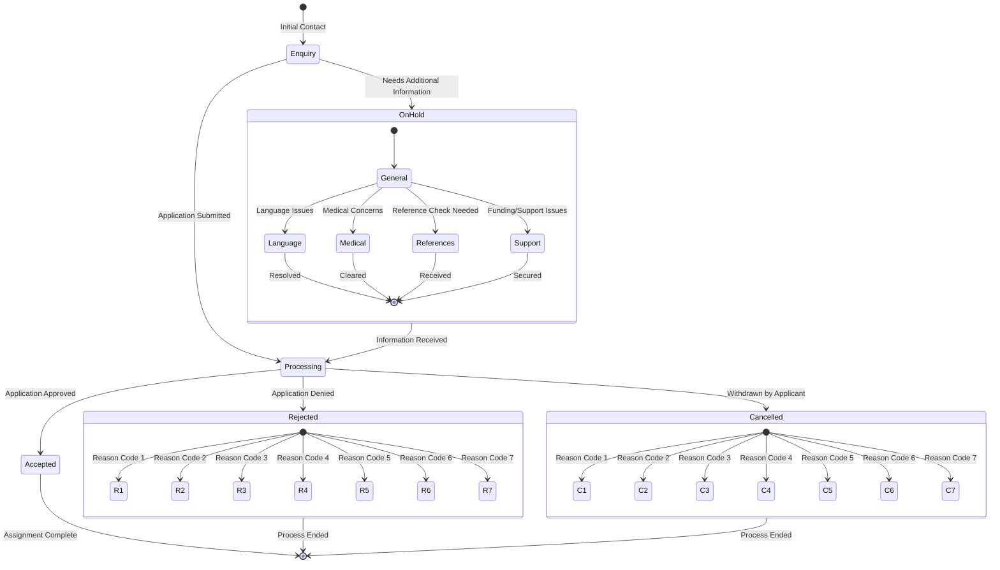
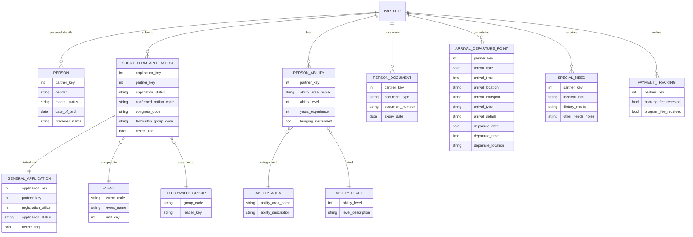
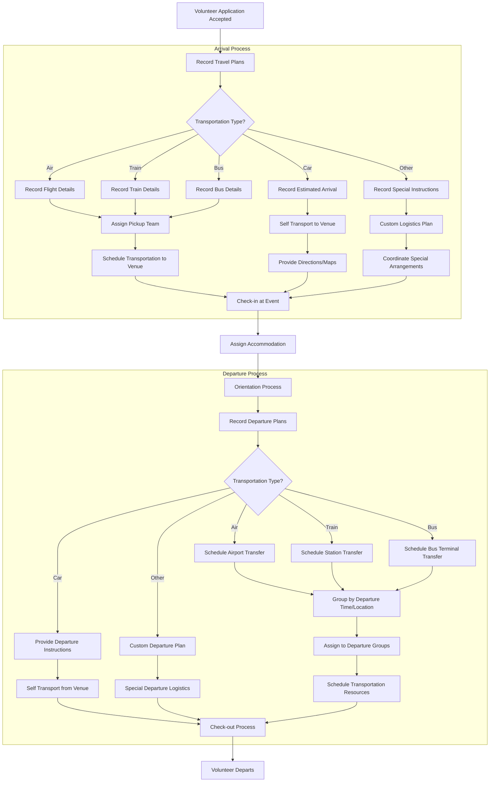
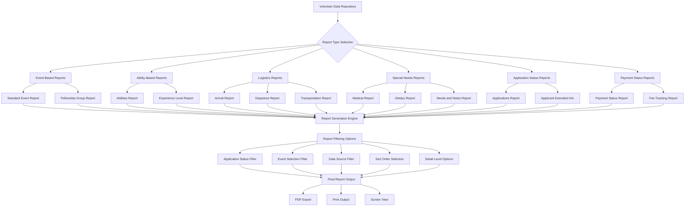

# Volunteer Management in OpenPetra

## Introduction to Volunteer Management in OpenPetra

OpenPetra provides comprehensive volunteer management capabilities designed specifically for non-profit organizations that rely on short-term volunteers for their operations. The system offers a structured approach to the entire volunteer lifecycle, from initial recruitment and application processing to assignment, tracking, and administration. 

OpenPetra's volunteer management module is particularly focused on short-term volunteers—individuals who commit to specific events, outreach opportunities, or limited-duration assignments. The system treats these volunteers as "Short Termers" within its personnel framework, allowing organizations to efficiently manage the often complex logistics associated with temporary volunteer engagements.

The platform enables organizations to maintain detailed profiles of volunteers, including personal information, skills, experience levels, application status, and assignment details. This comprehensive approach helps organizations match volunteers with appropriate roles based on their abilities, track their participation across multiple events, and manage the logistical aspects of volunteer coordination such as arrivals, departures, accommodations, and special requirements.

## Short-Term Volunteer Application Process

OpenPetra implements a structured workflow for managing the volunteer application lifecycle. The system tracks applications through various status stages, providing administrators with clear visibility into each applicant's progress through the recruitment process.

Applications in OpenPetra can exist in several distinct states:
- **Accepted (A)**: Applications that have been approved, indicating the volunteer has been accepted for service
- **Enquiry (E)**: Initial expressions of interest that have not yet been processed into formal applications
- **On Hold**: Applications temporarily paused in processing, with several sub-categories:
  - **H**: General hold status
  - **H-LANG**: On hold due to language requirements
  - **H-MED**: On hold due to medical considerations
  - **H-REF**: On hold pending references
  - **H-SUP**: On hold due to support/funding issues
- **Rejected**: Applications that have been declined, with multiple reason codes (R1-R7)
- **Cancelled**: Applications withdrawn by the applicant or cancelled by the organization, with multiple reason codes (C1-C7)

The system provides robust filtering capabilities that allow administrators to view applications based on their status, enabling focused work on specific subsets of applications such as new enquiries, applications on hold, or accepted volunteers. This filtering extends to reports, where administrators can include or exclude applications based on their status to generate targeted volunteer lists.

OpenPetra also tracks which field or event the volunteer has been accepted for, allowing organizations to manage volunteers across multiple simultaneous or sequential events.

## Volunteer Application Status Workflow

The volunteer application workflow in OpenPetra follows a structured path from initial enquiry through final disposition. Applications begin as enquiries and move through processing stages where they can be placed on hold for various reasons (language requirements, medical clearance, reference checks, or support/funding issues). Once all requirements are met, applications proceed to final disposition—either accepted for service, rejected with a specific reason code, or cancelled (either by the applicant or the organization) with appropriate documentation. This workflow ensures consistent processing of applications and maintains a clear audit trail of decisions and status changes throughout the volunteer recruitment process.

## Event-Based Volunteer Management

OpenPetra's volunteer management system is fundamentally organized around events, conferences, and outreach opportunities. This event-centric approach allows organizations to efficiently coordinate volunteers for specific activities, whether they are one-time events, recurring conferences, or ongoing outreach initiatives.

The system links volunteers directly to events through their applications, tracking which specific event or "confirmed option" a volunteer has been accepted for. This creates a clear association between volunteers and their assigned events, facilitating effective resource allocation and coordination.

Within each event, OpenPetra enables the assignment of specific roles to volunteers based on their skills, experience, and preferences. These roles (stored as "Conference Roles" in the system) define a volunteer's responsibilities and position within the event structure. Common roles might include team leaders, general participants, technical support, or specialized positions based on the event's needs.

The platform also supports tracking volunteer participation across multiple events over time, building a comprehensive history of a volunteer's involvement with the organization. This historical data can inform future role assignments and help identify experienced volunteers for leadership positions.

For complex events, OpenPetra provides additional organizational structures such as fellowship groups with designated leaders, allowing for hierarchical team management and clear lines of communication and responsibility during events.

Reports can be generated based on event participation, showing which volunteers are assigned to which events, their roles within those events, and other relevant details needed for effective event planning and execution.

## Volunteer Data Structure

This diagram illustrates how volunteer data is organized in OpenPetra. At the core is the PARTNER entity, which represents the volunteer and links to personal information (PERSON), applications (SHORT_TERM_APPLICATION), abilities (PERSON_ABILITY), and documents (PERSON_DOCUMENT). Applications are connected to events and fellowship groups, while also tracking status information. The system maintains detailed records of abilities with experience levels, travel logistics through arrival/departure points, special needs including medical and dietary requirements, and payment tracking for fees. This comprehensive data structure enables effective volunteer management across all aspects of recruitment, assignment, and coordination.

## Skills and Abilities Tracking

OpenPetra implements a sophisticated system for cataloging volunteer skills, experience levels, and special abilities. This functionality is crucial for effectively matching volunteers with appropriate roles and forming balanced teams with complementary skill sets.

The system organizes abilities into distinct categories (stored as "ability areas"), each representing a different domain of skills such as languages, musical talents, technical capabilities, leadership experience, or other specialized knowledge relevant to the organization's activities. Each ability area has a descriptive name and explanation to ensure consistent categorization.

Within each ability area, OpenPetra tracks multiple dimensions of a volunteer's proficiency:

1. **Skill Level**: The system uses a numeric rating system with corresponding descriptions (e.g., beginner, intermediate, advanced, expert) to indicate proficiency in each ability area.

2. **Years of Experience**: Quantitative measurement of how long a volunteer has practiced or utilized a particular skill, providing context to their proficiency level.

3. **Special Indicators**: For certain ability types, such as musical talents, the system tracks additional information like whether a volunteer will be bringing their own instrument.

This detailed ability tracking enables sophisticated volunteer assignment based on skill requirements. For example, event organizers can search for volunteers with specific language proficiencies, musical abilities at certain levels, or technical skills needed for particular roles.

The abilities reporting functionality allows administrators to generate lists of volunteers grouped by ability type, showing their respective proficiency levels and years of experience. This facilitates team formation and role assignment, ensuring that each position is filled by a volunteer with appropriate qualifications.

For recurring events or long-term volunteer relationships, the system maintains this skills information over time, allowing organizations to track skill development and identify volunteers who may be ready for more advanced responsibilities based on their growing experience.

## Logistics Management for Volunteers

OpenPetra provides comprehensive logistics management capabilities for coordinating volunteer movements, accommodations, and special requirements. This functionality is essential for organizations managing events with volunteers arriving from various locations, often with different schedules and needs.

The system meticulously tracks arrival and departure information for each volunteer, including:

1. **Dates and Times**: Precise scheduling of when volunteers will arrive at and depart from event locations, allowing for coordinated pickup and drop-off planning.

2. **Transportation Details**: The system records transportation methods (air, train, bus, car, etc.), flight or train numbers, and carrier information to facilitate tracking and coordination.

3. **Locations**: Arrival and departure points are documented, whether they are airports, train stations, bus terminals, or other locations, along with any relevant terminal or gate information.

4. **Special Transportation Requirements**: Any particular needs related to transportation, such as accessibility accommodations or assistance requirements.

Beyond transportation, OpenPetra manages accommodation needs by tracking:

1. **Housing Assignments**: Where volunteers will be staying during their service period, whether in dormitories, hotels, host homes, or other accommodations.

2. **Room Assignments**: For shared accommodations, the system can track room assignments and roommate pairings.

3. **Special Housing Requirements**: Any specific needs related to accommodations, such as accessibility features or environmental considerations.

The system also maintains detailed records of dietary requirements and restrictions, which is crucial for meal planning at events. This includes:

1. **General Dietary Preferences**: Vegetarian, vegan, pescatarian, or other broad dietary categories.

2. **Food Allergies and Restrictions**: Specific foods that must be avoided due to allergies, medical conditions, or other restrictions.

3. **Religious or Cultural Dietary Requirements**: Special dietary needs based on religious observances or cultural practices.

These logistics capabilities enable organizations to efficiently coordinate volunteer movements, ensure appropriate accommodations are available, and provide meals that meet all dietary requirements, creating a smooth experience for both volunteers and event organizers.

## Volunteer Arrival and Departure Process

The volunteer arrival and departure process in OpenPetra follows a structured workflow designed to ensure smooth logistics coordination. When a volunteer's application is accepted, their travel plans are recorded in the system, capturing transportation type (air, train, bus, car, or other), along with specific details like flight numbers or train schedules.

For arrivals, the system helps organize appropriate pickup arrangements based on transportation type, with different processes for those requiring pickup versus self-transport. Volunteers are then checked in at the event and assigned accommodations.

The departure process mirrors the arrival workflow, with departure plans recorded and appropriate transportation arranged. Volunteers are grouped by departure time and location to optimize transportation resources, and assigned to departure groups for coordinated transfers to airports, stations, or terminals. The process concludes with a formal check-out procedure before the volunteer departs.

Throughout both arrival and departure processes, OpenPetra maintains detailed records of all logistics information, enabling efficient coordination and providing a clear overview of volunteer movements for event administrators.

## Fellowship Group Organization

OpenPetra provides robust functionality for organizing volunteers into fellowship groups, creating a structured approach to team coordination and communication during events. This feature is particularly valuable for large events where breaking participants into smaller, manageable groups enhances the experience and facilitates more effective volunteer coordination.

Fellowship groups in OpenPetra are designated units within an event, each with a unique code identifier. Every group has an assigned leader who serves as the primary point of contact and coordinator for that group's activities and members. The leader is typically a more experienced volunteer or staff member who can provide guidance and support to group members.

The system allows administrators to assign volunteers to specific fellowship groups during the application process or as part of event preparation. This assignment is recorded in the volunteer's short-term application record, creating a clear association between the volunteer and their group. The fellowship group assignment becomes part of the volunteer's event profile, appearing in reports and coordination documents.

Fellowship groups serve multiple purposes within the volunteer management framework:

1. **Communication Channels**: Groups provide natural communication pathways, with leaders disseminating information to their group members and collecting feedback or questions.

2. **Pastoral Care**: The smaller group setting allows leaders to provide more personalized attention and support to volunteers, addressing concerns or challenges that arise during their service.

3. **Logistical Coordination**: Groups can be used as units for coordinating activities, accommodations, transportation, and other logistical aspects of event participation.

4. **Team Building**: Fellowship groups foster a sense of belonging and community among volunteers, enhancing their experience and encouraging relationship development.

OpenPetra's reporting capabilities support fellowship group management by generating group-specific reports showing member details, arrival/departure information, special needs, and other relevant data. These reports can be filtered and sorted by fellowship group, enabling leaders and administrators to access the information they need for effective group coordination.

The system also facilitates tracking group assignments across multiple events, allowing organizations to maintain consistent groupings for volunteers who participate in multiple activities, building continuity and deeper relationships over time.

## Special Needs and Requirements Tracking

OpenPetra incorporates comprehensive capabilities for recording and reporting on volunteer special needs and requirements, ensuring organizations can provide appropriate accommodations and support for all participants. This functionality is crucial for creating inclusive environments and addressing the diverse needs of volunteer populations.

The system maintains detailed records of volunteer medical information, including:

1. **Medical Conditions**: Ongoing health issues that may require attention or accommodation during the volunteer's service period.

2. **Medications**: Current prescription medications that volunteers are taking, which may need to be considered in emergency situations or for planning purposes.

3. **Allergies**: Both food and environmental allergies, with information on severity and required responses in case of exposure.

4. **Physical Limitations**: Any mobility or activity restrictions that should be considered when assigning roles or planning accommodations.

5. **Emergency Contacts**: Information on who to contact in case of medical emergencies, including relationship to the volunteer and contact details.

Dietary needs are tracked with particular attention to detail, as this affects daily meal planning for events:

1. **Dietary Restrictions**: Categories such as vegetarian, vegan, gluten-free, dairy-free, or other common dietary patterns.

2. **Food Allergies**: Specific foods that must be avoided, with information on severity and cross-contamination concerns.

3. **Religious Dietary Requirements**: Needs based on religious observances, such as kosher or halal meal requirements.

4. **Preference vs. Necessity**: The system distinguishes between preferences and medical or religious necessities to help prioritize accommodation efforts.

Beyond medical and dietary needs, OpenPetra tracks other special requirements:

1. **Accommodation Needs**: Special housing requirements such as ground floor rooms, accessible facilities, or specific environmental conditions.

2. **Communication Accommodations**: Requirements for interpreters, assistive listening devices, or materials in alternative formats.

3. **Other Notes and Requirements**: A flexible field for capturing any additional special needs not covered by standard categories.

The reporting system allows administrators to generate targeted reports of volunteers with specific needs, facilitating advance planning and appropriate resource allocation. These reports can be filtered by event, fellowship group, or need type, providing focused information to relevant staff members while maintaining appropriate privacy and confidentiality of sensitive health information.

## Volunteer Reporting System

OpenPetra's volunteer reporting system provides a comprehensive set of tools for generating actionable information from volunteer data. The system starts with a central volunteer data repository and branches into specialized report types addressing different aspects of volunteer management.

Event-based reports focus on volunteer participation in specific events, including standard event reports and fellowship group breakdowns. Ability-based reports highlight volunteer skills and experience levels, helping match people with appropriate roles. Logistics reports cover arrival, departure, and transportation details to facilitate movement coordination. Special needs reports address medical conditions, dietary requirements, and other accommodation needs. Application status reports track the recruitment pipeline, while payment status reports monitor financial aspects of volunteer participation.

Each report type connects to a central report generation engine that applies user-selected filters including application status (accepted, enquiry, on hold, etc.), event selection (specific event, related options, or all events), data source (event-based or extract-based), sort order, and detail level. The resulting reports can be exported to PDF, printed, or viewed on screen.

This interconnected reporting system ensures that administrators can access precisely the information they need for decision-making, planning, and coordination across all aspects of volunteer management.

## Payment and Financial Tracking for Volunteers

OpenPetra incorporates robust functionality for managing the financial aspects of volunteer participation, particularly focused on tracking booking fees, program fees, and payment status for short-term volunteers. This capability is essential for organizations that require participants to contribute financially toward event costs or program expenses.

The system maintains detailed records of fee requirements and payment status for each volunteer, tracking two primary fee types:

1. **Booking Fees**: Initial deposits or registration fees that secure a volunteer's place in an event or program. These fees often serve as a commitment indicator and may be non-refundable or partially refundable depending on organizational policies.

2. **Program Fees**: The main participation costs that cover expenses such as accommodations, meals, materials, and other program elements. These fees represent the bulk of a volunteer's financial contribution to their participation.

For each fee type, OpenPetra tracks payment status with boolean indicators (received/not received), allowing administrators to quickly identify which volunteers have fulfilled their financial obligations and which still have outstanding payments. This tracking is integrated with the volunteer's application record, creating a comprehensive view of both their application status and payment status.

The system supports financial reporting specific to volunteer payments, with capabilities to:

1. **Generate Payment Status Reports**: Lists of volunteers filtered by payment status, showing who has paid booking fees, program fees, both, or neither.

2. **Track Payment Deadlines**: Monitor upcoming payment due dates and identify volunteers with overdue payments.

3. **Calculate Outstanding Balances**: Determine the total amount still owed by volunteers individually and collectively.

4. **Reconcile Payments**: Match received payments with volunteer records to ensure accurate financial tracking.

This financial tracking functionality helps organizations maintain financial stability while managing volunteer programs by ensuring timely collection of participant fees. It also provides transparency for both administrators and volunteers regarding financial expectations and fulfillment.

The payment status information can be used in conjunction with other volunteer data to make informed decisions about resource allocation, acceptance of additional volunteers, or follow-up communications regarding outstanding payments. This integration of financial and administrative data streamlines the management process and helps ensure the financial sustainability of volunteer programs.

[Generated by the Sage AI expert workbench: 2025-03-30 02:22:57  https://sage-tech.ai/workbench]: #