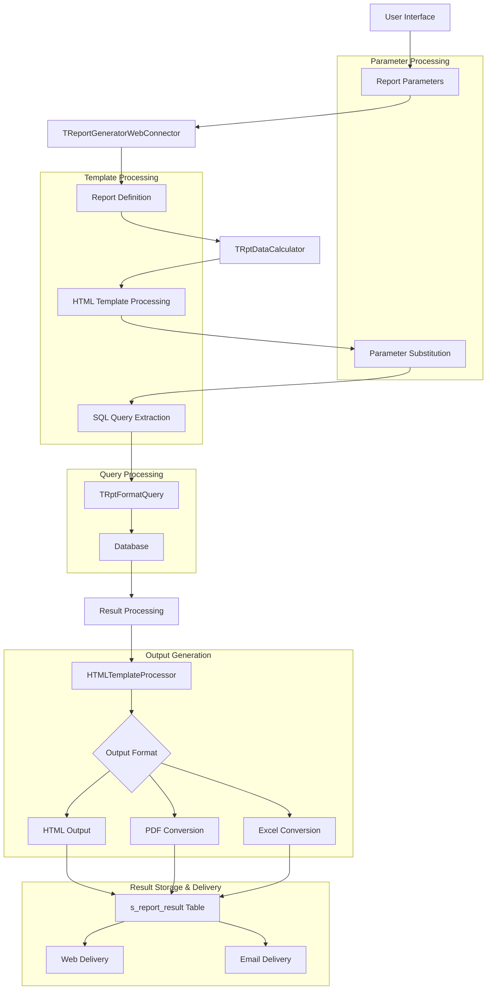
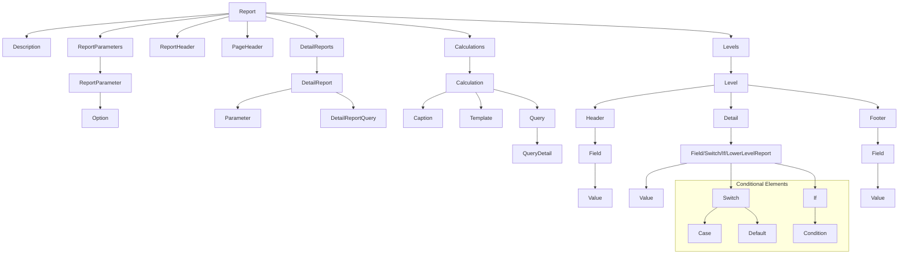
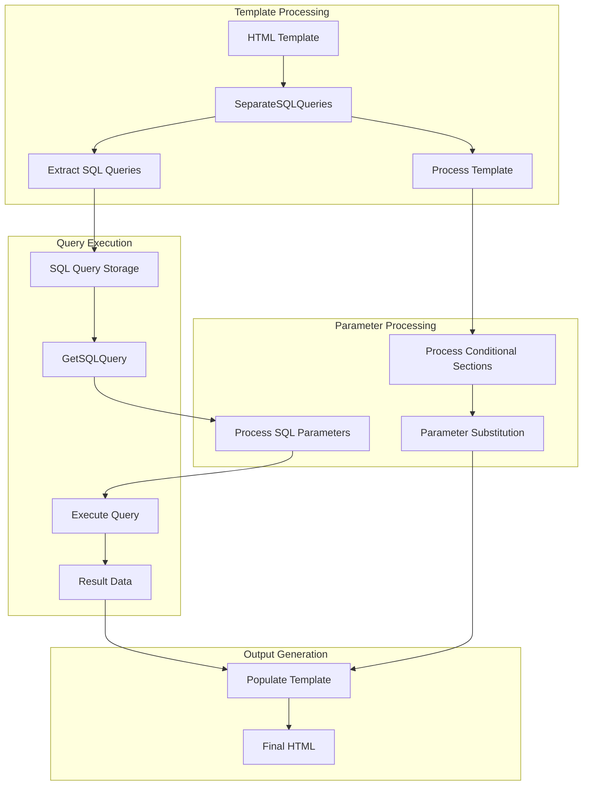
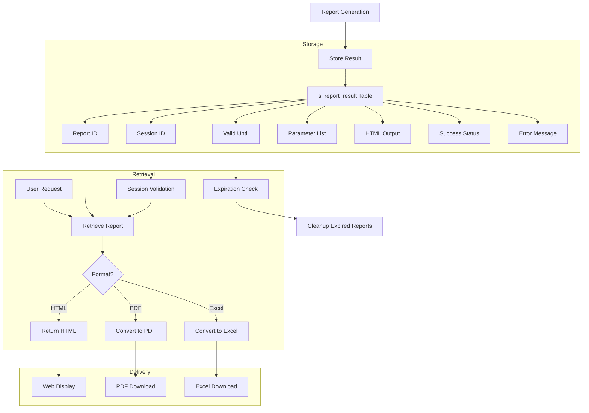

# Custom Report Architecture in OpenPetra

## Custom Report Architecture Overview

OpenPetra's custom reporting system provides a flexible framework for generating reports with user-defined parameters, layouts, and output formats. The architecture includes template processing, parameter management, SQL query generation, and multiple output formats.

The system is built around a hierarchical structure where reports are defined using XML templates that specify parameters, headers, calculations, and multi-level data presentation. The reporting engine processes these templates, substitutes parameters, executes SQL queries, and generates output in various formats including HTML, PDF, and Excel.

At its core, the architecture uses a parameter management system that organizes values hierarchically, allowing parameters to be associated with specific columns and levels. This enables sophisticated data presentation with conditional elements for dynamic content generation based on parameter values.

The reporting system supports asynchronous report generation with progress tracking, result storage in a database, and multiple delivery mechanisms including web interfaces and email distribution.

## Custom Report Processing Flow

The diagram illustrates the flow of data through OpenPetra's custom reporting system. The process begins with user-defined parameters that are passed to the TReportGeneratorWebConnector, which manages the entire reporting workflow. The report definition is loaded and processed by TRptDataCalculator, which handles HTML template processing, parameter substitution, and SQL query extraction.

The extracted SQL queries are formatted by TRptFormatQuery, which replaces parameter placeholders with actual values before executing against the database. The results are then processed and formatted using HTMLTemplateProcessor, which can generate output in HTML, PDF, or Excel formats. These outputs are stored in the s_report_result database table for later retrieval and can be delivered through web interfaces or email.

## Report Definition Structure

Reports are defined using XML templates with a hierarchical structure specified in reports.dtd. These definitions include parameters, headers, calculations, and multi-level data presentation with conditional elements for dynamic content generation.

The report definition starts with a root `report` element that contains descriptive information, parameter definitions, header/footer sections, and data levels. Each level represents a hierarchical data structure with its own header, detail, and footer sections. This allows for complex nested data presentation such as grouping transactions by account, then by date.

Parameters are defined with options that can be conditionally displayed based on other parameter values. Calculations are specified with SQL templates that can reference parameters and include conditional logic. The structure supports dynamic content generation through switch/case and if/else constructs that evaluate parameter values at runtime.

The XML structure also defines formatting options for fields, including alignment, width, and special formatting for dates and currency values. Detail reports can be linked to enable drill-down functionality, allowing users to navigate from summary data to detailed information.

## Report Definition Components

The diagram shows the hierarchical structure of report definition components in OpenPetra. At the top level, a report contains descriptive information, parameters, headers, calculations, and data levels. Parameters define user inputs with options that can be conditionally displayed. Calculations specify SQL queries with templates for data retrieval.

The levels section defines the hierarchical data structure with headers, details, and footers for each level. Fields within these sections control data presentation with formatting options. Conditional elements (switch/case and if/else) enable dynamic content generation based on parameter values.

Detail reports provide drill-down functionality with their own parameters and queries. The entire structure is designed to support complex data presentation with multiple levels of grouping and conditional formatting.

## Parameter Management System

The TParameterList class provides sophisticated parameter handling with hierarchical organization, allowing parameters to be associated with specific columns and levels. Parameters support various data types and can be serialized to/from JSON for persistence.

Parameters in OpenPetra's reporting system are more than simple name-value pairs. Each parameter has four key attributes: name, value, column, and level. The column attribute allows parameters to be associated with specific report columns, while the level attribute enables hierarchical organization of parameters for multi-level reports.

The parameter management system supports various data types including Boolean, Decimal, String, DateTime, and Integer values. Parameters can be retrieved using different fit strategies:
- `eExact`: Requires exact column and level match
- `eBestFit`: Finds the closest match in current or higher levels
- `eAllColumnFit`: Considers parameters marked as applicable to all columns
- `eBestFitEvenLowerLevel`: Allows accessing parameters from lower levels

This flexibility enables sophisticated parameter inheritance where values can cascade from higher to lower levels or be overridden at specific levels. The system also supports special column values like `ALLCOLUMNS` (99) to indicate parameters that apply across all columns.

Parameters can be serialized to/from JSON for persistence and sharing between client and server components. The system also provides utilities for formatting parameters according to locale-specific rules, particularly useful for date and currency values in reports.

## Dynamic SQL Query Processing

The TRptFormatQuery class transforms SQL templates by replacing parameter placeholders with actual values. It handles different parameter patterns, maintains SQL statement integrity, and supports variant values for non-SQL content.

The query processing system supports multiple parameter placeholder patterns:
- `{{parameter}}`: For standard parameter substitution
- `{#parameter#}`: For specialized formatting
- `{parameter}`: For general parameter substitution

When processing SQL templates, the system replaces these placeholders with properly formatted values based on the parameter's data type. String values are properly quoted, dates are formatted in SQL-compatible format, and numeric values are inserted without quotes.

The system also supports special parameter patterns like `{LIST parameter}` for generating comma-separated lists and `{LISTCMP parameter}` for comparison expressions. These are particularly useful for generating IN clauses and complex WHERE conditions.

For non-SQL content, the system supports "variant values" that represent direct values rather than SQL statements. This allows the same parameter processing mechanism to be used for both SQL queries and report content like headers and footers.

The query processor maintains SQL statement integrity by properly handling parameter types and ensuring that SQL injection is prevented through the use of parameterized queries. It also provides special handling for date values, stripping time components when appropriate for date-only comparisons.

## HTML Template Processing

The diagram illustrates how HTML templates are processed in OpenPetra's reporting system. The process begins with an HTML template that contains both presentation markup and embedded SQL queries. The HTMLTemplateProcessor first separates SQL queries from the template by extracting content between special comment markers (`<!-- BeginSQL -->` and `<!-- EndSQL -->`).

The template is then processed to evaluate conditional sections using `#if/#endif` directives, which allows for dynamic content generation based on parameter values. Parameter substitution is performed using various patterns (`{{parameter}}`, `{parameter}`, etc.) to insert actual values into the template.

When a report needs data, it calls GetSQLQuery to retrieve the stored SQL queries. These queries undergo parameter substitution before being executed against the database. The resulting data is then used to populate the template, generating the final HTML output.

This separation of concerns allows the same template to be used with different parameters, producing customized reports without modifying the template structure. The system also supports conversion of the final HTML to other formats like PDF and Excel.

## Report Calculation Engine

The TRptDataCalculator dynamically loads and executes report calculation classes through reflection. It processes parameters, invokes specialized calculators, and generates HTML output with support for caching loaded assemblies to improve performance.

The calculation engine is the core component that transforms report definitions and parameters into actual report output. It works by dynamically loading and executing specialized calculator classes that implement the calculation logic for specific report types.

When a report is requested, the calculation engine:
1. Loads the HTML template for the report
2. Processes the template to extract SQL queries and parameter placeholders
3. Uses reflection to dynamically load and instantiate the appropriate calculator class
4. Invokes the Calculate method on the calculator class, passing the template and parameters
5. Receives the processed HTML document and updated parameters from the calculator
6. Returns the final HTML output for display or conversion to other formats

The engine maintains a cache of loaded assemblies to improve performance when processing multiple reports that use the same calculator classes. It also provides error handling and progress tracking to inform users about the status of long-running report calculations.

Calculator classes are organized by namespace and follow a convention-based naming pattern that allows the engine to locate them dynamically. This extensible architecture enables developers to add new report types by simply implementing new calculator classes without modifying the core engine.

## Multi-Format Output Generation

Reports can be generated in HTML, PDF, and Excel formats. The system uses HTMLTemplateProcessor to transform HTML to Excel with proper formatting for dates and currencies, and Html2Pdf for PDF conversion.

The multi-format output generation system starts with HTML as the primary output format. The HTML output is generated by the report calculation engine and contains properly structured data with CSS classes that indicate special formatting for dates, currencies, and other data types.

For Excel output, the HTMLTemplateProcessor.HTMLToCalc method transforms the HTML document into an Excel workbook using the NPOI library. It processes the HTML structure, extracting data from table cells and applying appropriate Excel formatting:
- Date values are formatted using a standard date format
- Currency values are converted to proper numeric format
- Bold text in HTML is preserved as bold in Excel
- Column widths are automatically adjusted to fit content

For PDF output, the system uses the Html2Pdf utility to convert the HTML document to PDF format. This preserves the layout and formatting of the HTML report while providing a fixed-layout document suitable for printing or archiving.

The output generation system is designed to maintain consistent formatting across all output formats, ensuring that dates, currencies, and other specially formatted values are properly displayed regardless of the chosen format. This consistency is important for financial and administrative reports where precise formatting is essential.

## Report Storage and Retrieval

The diagram shows how report results are stored in the s_report_result database table and retrieved for viewing or download. When a report is generated, the result is stored in the database with a unique report ID, the user's session ID, an expiration timestamp, the parameter list (serialized as JSON), the HTML output, success status, and any error messages.

Reports can be retrieved using the report ID, with session validation to ensure that users can only access their own reports. The system checks the expiration timestamp and automatically cleans up expired reports during database operations.

When a user requests a report, they can choose the desired format (HTML, PDF, or Excel). The system retrieves the stored HTML output and, if necessary, converts it to the requested format before delivering it to the user. This approach allows the system to generate the report once and deliver it in multiple formats without recalculating.

The storage and retrieval system provides efficient access to report results while maintaining security and managing server resources through automatic cleanup of expired reports.

## Web-Based Report Delivery

TReportGeneratorWebConnector manages the entire reporting workflow including asynchronous report generation, progress tracking, result storage, and delivery through web interfaces with support for email distribution.

The web connector serves as the bridge between the client application and the report generation system. It provides a set of methods that allow the client to:
1. Create a new report request with a unique ID
2. Start the report generation process with specified parameters
3. Track the progress of report generation
4. Retrieve the completed report in various formats
5. Send the report via email to specified recipients

Report generation is performed asynchronously in a separate thread, allowing the user interface to remain responsive during long-running reports. The connector provides progress tracking through the TProgressTracker class, which maintains the current state of each report generation task.

When a report is completed, the result is stored in the s_report_result database table with a validity period (typically 12 hours). The connector provides methods to retrieve the report in HTML, PDF, or Excel format, converting the stored HTML output as needed.

For email distribution, the connector supports attaching the report in PDF and/or Excel format to an email message. It uses the system's email configuration settings and provides verification results to inform the user of success or failure.

The web connector also implements security checks to ensure that users can only access their own reports, and it manages server resources by automatically cleaning up expired report results during database operations.

## Data Format Conversion

The TCsv2Xml class provides utilities for converting between CSV, XML, and Excel formats while preserving structure and data types. It handles hierarchical data flattening, proper type conversion, and multi-worksheet Excel exports.

The data format conversion utilities support bidirectional conversion between different data formats commonly used in reporting:
- CSV to XML conversion for importing data from spreadsheets
- XML to CSV conversion for exporting hierarchical data to flat files
- XML to Excel conversion for creating formatted spreadsheets
- Excel to DataTable conversion for importing spreadsheet data
- DataTable to Excel conversion for exporting database query results

When converting from hierarchical XML to flat CSV or Excel formats, the system preserves parent-child relationships using a "childOf" column that indicates the parent of each record. This allows hierarchical data to be represented in a flat structure while maintaining relationships.

The conversion utilities handle proper data type conversion, ensuring that dates, numbers, and strings are correctly formatted in the target format. For Excel output, the system applies appropriate cell formatting for dates and numeric values.

For multi-worksheet Excel exports, the system supports creating multiple sheets in a single workbook, each with its own data and formatting. This is particularly useful for complex reports that need to present different aspects of the data in separate sheets.

The data format conversion utilities are essential for integrating OpenPetra's reporting system with external tools and systems that require data in specific formats.

[Generated by the Sage AI expert workbench: 2025-03-30 02:22:57  https://sage-tech.ai/workbench]: #