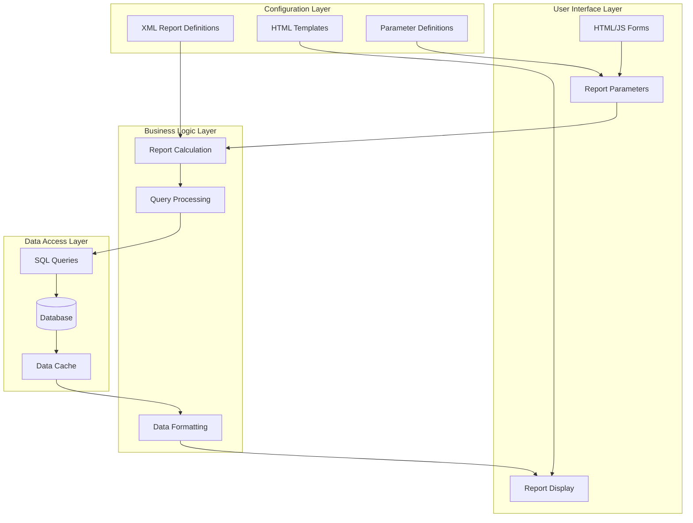
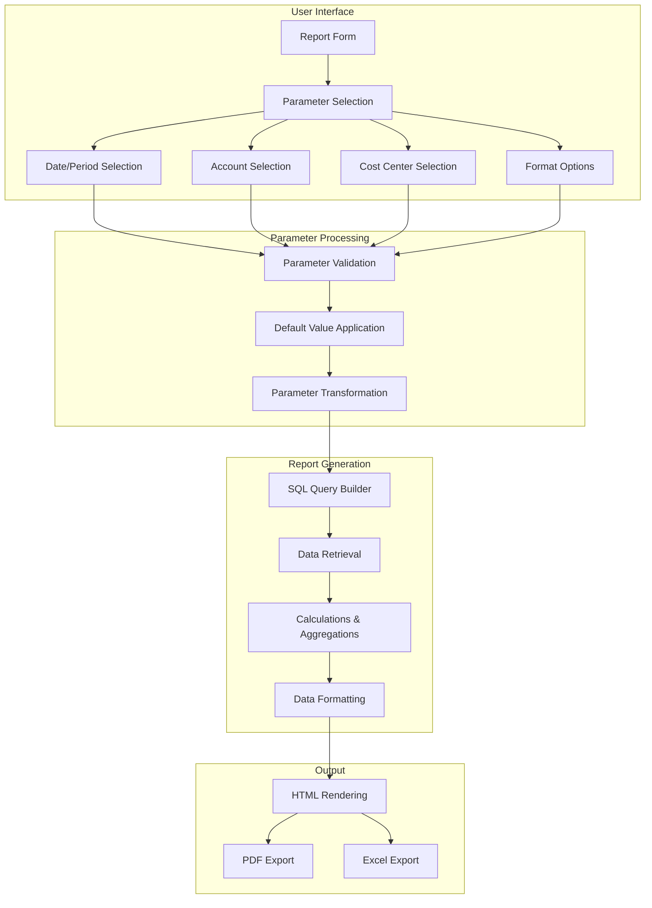
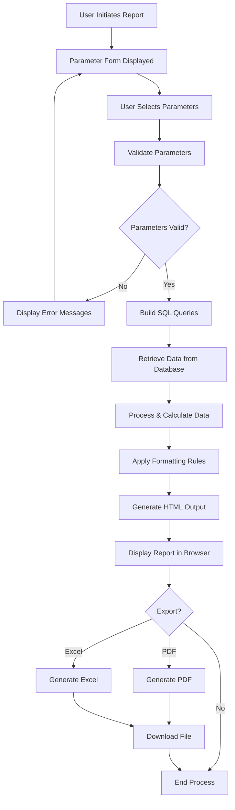
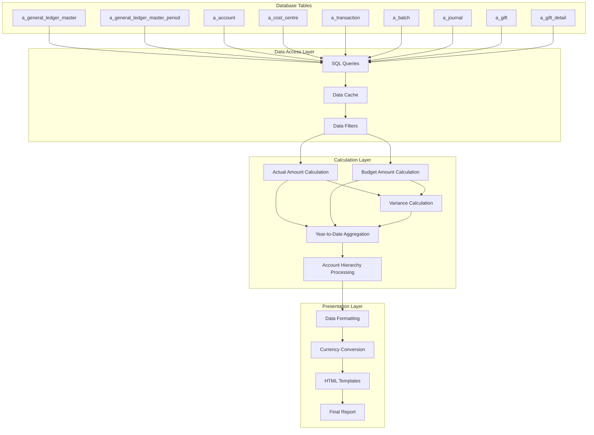

# Financial Statements in OpenPetra

## Overview of Financial Statements

OpenPetra's financial reporting system provides a comprehensive framework for non-profit organizations to track, analyze, and report their financial performance and position. The system is built around several core statement types, including Balance Sheets, Income and Expense Statements, Trial Balances, and Account Detail reports. These statements are highly configurable, allowing organizations to customize their reporting based on specific needs, such as comparing actual figures against budgets, analyzing data across multiple periods, or breaking down information by cost centers.

The reporting architecture is designed with flexibility in mind, using XML-based configuration files that define report parameters, calculations, and display options. This approach allows organizations to maintain standardized financial reporting while accommodating the unique requirements of non-profit accounting, such as fund accounting, gift tracking, and donor analysis. The system also supports multiple currencies and international operations, making it suitable for organizations working across borders.

OpenPetra's financial statements serve as critical tools for non-profit organizations to demonstrate accountability to donors, comply with regulatory requirements, and make informed financial decisions based on accurate and timely information.

## Financial Statement Architecture

The financial statement architecture in OpenPetra follows a multi-layered approach that separates concerns between data retrieval, business logic, and presentation. At the foundation, XML configuration files define report structures, parameters, and calculations. These definitions are processed by the reporting engine, which retrieves data through SQL queries from the database.

The system uses a combination of server-side processing (in C#) and client-side rendering (in JavaScript and HTML) to generate reports. Data flows from the database through calculation layers that apply accounting rules, perform currency conversions, and aggregate information according to the report specifications. The HTML templates then receive this processed data and render it in a user-friendly format.

A key strength of this architecture is its flexibility - the same underlying data can be presented in multiple formats (HTML, PDF, Excel) and can be filtered, grouped, and calculated in various ways without changing the core data model. This separation of concerns also makes it easier to maintain and extend the reporting system as requirements evolve.

## Balance Sheet Implementation

OpenPetra's Balance Sheet implementation provides a comprehensive view of an organization's financial position, displaying assets, liabilities, and equity at a specific point in time. The system supports multiple display formats, allowing organizations to compare current year figures with previous year data and calculate variances between periods.

The Balance Sheet report is configured through XML files that define parameters such as account hierarchy, currency settings, and display options. The core implementation is found in the `balancesheet.xml` file, which establishes the report structure and calculation methods. This structure supports three detail levels (detail, standard, and summary) to accommodate different reporting needs.

The report can display up to five columns of financial data, typically showing combinations of:
- Actual Selected Year
- Actual Previous Year
- Actual End of Previous Year
- Variance (calculated as the difference between columns)
- Variance Percentage

A key feature of the Balance Sheet implementation is its support for cost center breakdowns, allowing organizations to view assets and liabilities by organizational unit when needed. This is particularly valuable for non-profits with multiple departments or projects that need separate financial tracking.

The system also handles currency formatting appropriately, with options for displaying base currency or international currency values. The calculations are performed server-side in the `TFinanceReportingWebConnector` class, which builds account hierarchies recursively and ensures that parent accounts correctly reflect the sum of their children.

## Income and Expense Statements

OpenPetra's Income and Expense Statement functionality provides a detailed view of an organization's financial performance over a specified period. This report is highly configurable, offering multiple formats to meet different analytical needs, including period-by-period analysis, actual versus budget comparisons, and variance calculations.

The core implementation is defined in `incomeexpensestatement.xml`, which establishes a hierarchical structure for displaying financial data with varying levels of detail. Organizations can choose between detail, standard, and summary views depending on their reporting requirements. The report supports up to seven display columns, allowing for comprehensive financial analysis.

A key strength of the Income and Expense Statement is its ability to compare actual financial results against budgeted figures. The system calculates both absolute and percentage variances, providing valuable insights into financial performance. For example, the "standard Actual vs Budget with Variance" configuration displays:
- Actual figures for the current period
- Budgeted amounts for the current period
- Variance between actual and budget
- Year-to-date actual figures
- Year-to-date budget figures
- Year-to-date variance
- Whole-year budget projection

The report also supports quarterly reporting and multi-period analysis, allowing organizations to track trends over time. Cost center breakdowns can be included to show financial performance by department, project, or other organizational units.

For international organizations, the system handles multiple currencies appropriately, with options to display figures in base currency or international currency. The calculations are performed server-side, ensuring consistent results regardless of the client platform.

## Report Parameter Flow

The parameter flow in OpenPetra's reporting system follows a structured path from user input to final report presentation. When a user accesses a report form, such as the Trial Balance or Income Expense Statement, they are presented with parameter options defined in the corresponding JSON configuration files. These parameters typically include fiscal year, accounting periods, account codes, cost centers, and formatting preferences.

Once parameters are selected, the client-side JavaScript code extracts these values and prepares them for submission to the server. The `calculate_report()` function in report-specific JS files handles this process, ensuring that parameters are properly formatted and default values are applied where needed.

On the server side, the parameters are received by the appropriate report calculation class (e.g., `TrialBalance` or `AccountDetail`), which validates them and uses them to construct SQL queries. The `HTMLTemplateProcessor` class plays a crucial role here, substituting parameters into SQL query templates and handling conditional logic.

The parameters influence several aspects of report generation:
1. **Data Selection**: Determining which accounts, cost centers, and time periods to include
2. **Calculation Methods**: Specifying how to calculate values (e.g., actual vs. budget, YTD vs. period-specific)
3. **Formatting Options**: Controlling currency display, column widths, and other visual elements
4. **Output Options**: Determining whether to generate HTML, PDF, or Excel output

This parameter-driven approach provides flexibility while maintaining consistency in report generation, allowing users to customize reports to their specific needs without requiring technical knowledge of the underlying system.

## Trial Balance Reporting

OpenPetra's Trial Balance report implementation provides a fundamental accounting tool that verifies the balance of debits and credits across all accounts in the general ledger. This report serves as a critical checkpoint in the accounting cycle, ensuring that the accounting equation remains in balance and providing a foundation for preparing financial statements.

The Trial Balance report is implemented through a combination of XML configuration files, HTML templates, and server-side processing code. The core implementation is found in the `trialbalance.xml` file, which defines the report structure and calculation methods. The `TrialBalance.cs` class handles the server-side processing, retrieving transaction and balance data from the database and formatting it according to the template.

The report can be sorted by account, cost center, or department, with different display options (detail, standard, summary) to accommodate various reporting needs. It shows account codes, names, debit amounts, credit amounts, and ending balances for each account/cost center combination. A key optimization in the implementation is the intelligent skipping of account/cost center combinations with zero balances and no transactions, which streamlines the report output.

The Trial Balance supports filtering by account ranges, account lists, cost center ranges, and cost center lists, allowing organizations to focus on specific areas of interest. It also includes options for year-to-date calculations and different currency displays (base or international).

The HTML template (`trialbalance.html`) provides a clean, tabular presentation of the data with appropriate formatting for currency values. The system also supports exporting the report to Excel or PDF formats for further analysis or distribution.

## Account Detail Reports

OpenPetra's Account Detail reporting functionality provides a comprehensive transaction-level view of financial activity within specific accounts. This report type is essential for financial transparency, allowing organizations to examine individual transactions that contribute to account balances, verify posting accuracy, and track the flow of funds through the accounting system.

The Account Detail report displays chronologically ordered transactions for selected accounts and cost centers, showing transaction dates, reference numbers, narratives, debit and credit amounts, and running balances. Each transaction is fully traceable, with links to source documents and batch information, facilitating audit trails and financial verification.

The implementation is primarily defined in `accountdetail.xml` and `accountdetailcommon.xml`, which establish the report structure and reusable query components. The `AccountDetail.cs` class handles the server-side processing, retrieving transaction data and calculating running balances. The system supports filtering by account ranges, account lists, cost center ranges, and cost center lists, allowing organizations to focus on specific areas of interest.

A notable feature is the support for analysis attributes, which provide additional transaction categorization beyond standard account and cost center dimensions. This allows for more detailed financial analysis based on custom organizational needs.

The report includes intelligent handling of transaction narratives, references, and system-generated transactions (such as year-end reallocations), ensuring that the displayed information is relevant and understandable. Running balances are calculated and displayed for each account, showing the financial position after each transaction.

For international organizations, the system handles multiple currencies appropriately, displaying transaction currency codes alongside amounts and converting values as needed. The implementation also supports date range filtering and period-based reporting to accommodate different analytical timeframes.

## Report Generation Process

The report generation process in OpenPetra follows a structured workflow that transforms user parameters into formatted financial statements. The process begins when a user accesses a report form through the web interface, which loads the appropriate HTML template and JavaScript handlers.

First, the system presents a parameter selection form with options relevant to the specific report type. These parameters are defined in JSON configuration files and typically include fiscal year, accounting periods, account ranges, cost centers, and formatting preferences. The interface includes validation to ensure that selected parameters are valid and compatible.

Once parameters are submitted, the client-side JavaScript code extracts these values and sends them to the server through a web service call. On the server side, the request is handled by the appropriate report calculation class (e.g., `TrialBalance` or `AccountDetail`), which processes the parameters and builds SQL queries to retrieve the necessary data.

The `HTMLTemplateProcessor` class plays a crucial role in this process, handling parameter substitution in SQL queries and HTML templates. It processes conditional elements in the templates based on parameter values, ensuring that the report displays only relevant information.

After retrieving data from the database, the system performs calculations according to the report type - for example, summing debits and credits, calculating variances between actual and budget figures, or determining running balances. These calculations are performed server-side to ensure consistency and accuracy.

The processed data is then formatted according to the report specifications, with appropriate handling of currency values, dates, and other specialized formats. The final HTML report is generated by populating the template with the formatted data.

The completed report is returned to the client for display in the browser. Users can then choose to export the report to PDF or Excel format for further analysis or distribution. These export options are handled by client-side JavaScript functions that request the appropriate format from the server.

## Donor and Gift Analysis

OpenPetra's financial reporting system includes specialized capabilities for tracking and analyzing donations, providing non-profit organizations with valuable insights into their donor base and giving patterns. These reports help organizations understand donor behavior, recognize major contributors, and develop targeted fundraising strategies.

The donor ranking functionality, implemented in the `topdonorreport.xml` file, generates a ranked list of donors based on gift amounts within specified date ranges. This report calculates each donor's contribution as a percentage of total giving and displays cumulative percentages moving down the list from top donors. Organizations can filter this report by recipient, motivation codes, and donor extracts to focus on specific fundraising campaigns or initiatives.

Gift motivation analysis is another key feature, allowing organizations to categorize and track donations based on the purpose or motivation behind each gift. The system supports both motivation groups (broad categories) and motivation details (specific purposes), enabling multi-level analysis of giving patterns. Reports can show how giving is distributed across different motivations, helping organizations understand which causes resonate most with their donors.

For recipient-based analysis, the `TotalGivingForRecipients` report shows total giving for each recipient over multiple years, allowing organizations to track support trends for different fields, projects, or individuals. This historical perspective helps identify growing or declining areas of donor interest.

The `OneYearMonthlyGiving` report provides a month-by-month breakdown of donations, enabling organizations to identify seasonal giving patterns and plan accordingly. This report displays donor information alongside monthly giving amounts and yearly totals.

All these reports support various filtering options, including date ranges, currency selection, and donor characteristics. They can be generated in HTML format for online viewing or exported to PDF and Excel for further analysis and distribution. The underlying data model captures comprehensive gift information, including donor details, gift amounts, dates, motivations, and recipients, providing a solid foundation for sophisticated donor and gift analysis.

## Report Configuration System

OpenPetra's report configuration system is built around XML-based definitions that provide a flexible and extensible framework for financial reporting. This system allows for detailed customization of report parameters, calculations, and display options without requiring changes to the underlying application code.

At the core of this system are XML configuration files stored in the `XmlReports/Settings` directory, organized by report type. Each report typically has a `standard.xml` file that defines default parameters, and may have additional variants for specific reporting scenarios (e.g., "standard Actual vs Budget with Variance.xml").

The configuration files define several key aspects of financial statements:

1. **Report Parameters**: These include ledger number, accounting periods, year, account hierarchy code, and currency settings. Parameters can have default values and may include conditional logic to show or hide options based on other selections.

2. **Calculation Definitions**: The system supports various calculation types such as "Actual Selected Year," "Budget Selected Year," "Variance," and "Variance %". These calculations can be applied to different columns in the report, allowing for side-by-side comparisons.

3. **Column Configuration**: Each report column is individually configured with properties like width, position, calculation type, and year-to-date settings. This allows for highly customizable report layouts.

4. **Display Options**: Parameters control visual aspects such as currency formatting, report depth (detail, standard, summary), and cost center breakdown options.

5. **Data Filtering**: The configuration includes options for filtering by account codes, cost center codes, and other dimensions, allowing users to focus on specific areas of interest.

The XML files reference each other through the `xmlfiles` parameter, creating a hierarchy of configurations. Common elements are defined in shared files like `common.xml` and `finance.xml`, promoting reuse and consistency across reports.

This configuration system provides a powerful balance between standardization and flexibility, allowing organizations to maintain consistent financial reporting while adapting to their specific needs and preferences.

## Data Flow in Financial Reporting

The data flow in OpenPetra's financial reporting system begins with the core financial database tables that store transaction data, account information, and budget figures. These include tables for the general ledger master, accounts, cost centers, transactions, batches, journals, and gift processing.

When a report is requested, the system constructs SQL queries based on the report parameters and configuration. These queries retrieve the relevant financial data, applying filters for ledger number, accounting periods, account codes, and cost centers. The `QueryFinanceReport` class and various specialized query methods in the `TFinanceReportingWebConnector` handle this data retrieval process.

Retrieved data is often cached to improve performance, especially for frequently accessed reference data like account hierarchies and cost center lists. The data then flows through a series of calculation layers that transform raw transaction data into meaningful financial information.

For actual financial figures, the system aggregates transaction data according to the report specifications, calculating period totals or year-to-date figures as required. Budget calculations retrieve planned financial data for comparison with actuals. Variance calculations determine the differences between actual and budgeted figures, often expressed as both absolute amounts and percentages.

Account hierarchy processing is a critical step that organizes financial data according to the selected accounting hierarchy, ensuring that parent accounts correctly reflect the sum of their children. This hierarchical structure is essential for presenting financial information at different levels of detail.

The calculated data then moves to the presentation layer, where it undergoes formatting according to the report specifications. Currency values are formatted with appropriate symbols and decimal places, and may be converted between base and international currencies as needed. Dates, account codes, and other elements are formatted for readability.

Finally, the formatted data is inserted into HTML templates that define the visual structure of the report. The `HTMLTemplateProcessor` class handles this template population process, replacing placeholders with actual values and applying conditional formatting as needed. The completed HTML report is then returned to the user for display in the browser, with options for exporting to PDF or Excel formats.

## Future Directions and Challenges

OpenPetra's financial reporting system, while robust and flexible, faces several challenges and opportunities for future development. As non-profit financial reporting requirements continue to evolve, the system will need to adapt to maintain its relevance and effectiveness.

One significant challenge is the integration of modern data visualization capabilities. While the current system provides comprehensive tabular reports, there is growing demand for interactive charts, graphs, and dashboards that can make financial data more accessible and actionable. Implementing these features would require extending the current HTML-based reporting framework to incorporate JavaScript visualization libraries.

Another area for improvement is mobile compatibility. The current reporting interface is primarily designed for desktop use, but as more users access systems via mobile devices, there's a need to optimize reports for smaller screens and touch interfaces. This would involve responsive design enhancements and possibly dedicated mobile reporting views.

The system's reliance on XML configuration files, while providing flexibility, can become complex to maintain as the number of report variants grows. A more structured configuration management approach, possibly with a graphical report designer, could improve usability for system administrators and reduce the potential for configuration errors.

Performance optimization presents another challenge, particularly for large organizations with extensive transaction histories. Current optimizations like skipping zero-balance accounts are helpful, but additional strategies such as improved data indexing, pre-aggregation of common metrics, and more efficient query patterns could further enhance report generation speed.

Integration with external systems represents both a challenge and an opportunity. As organizations increasingly use multiple specialized systems (e.g., CRM, fundraising platforms), there's value in developing standardized interfaces to import and export financial data, enabling more comprehensive cross-system reporting.

Regulatory compliance is an ongoing concern, with reporting requirements varying by country and changing over time. The system will need to maintain flexibility to accommodate these variations while ensuring core financial reporting principles are consistently applied.

Finally, as artificial intelligence and machine learning technologies mature, there's potential to incorporate predictive analytics into financial reporting, helping organizations not just understand past performance but also forecast future trends and outcomes based on historical financial data.

Addressing these challenges while maintaining the system's core strengths of flexibility, accuracy, and usability will be key to ensuring OpenPetra's financial reporting capabilities continue to meet the evolving needs of non-profit organizations worldwide.

[Generated by the Sage AI expert workbench: 2025-03-30 02:22:57  https://sage-tech.ai/workbench]: #