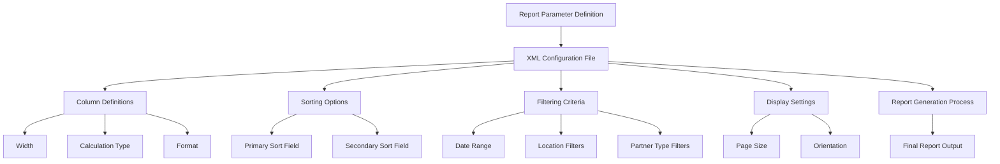
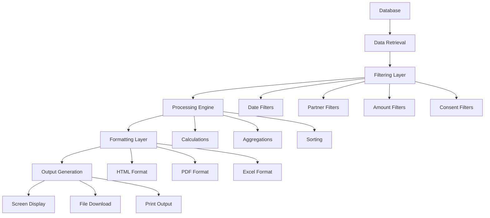
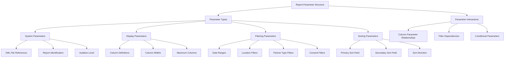

# Standard Reports in OpenPetra

## Overview of Standard Reports

OpenPetra provides a comprehensive reporting system that enables non-profit organizations to generate various types of reports across different modules. The reporting architecture is designed to be flexible, extensible, and configurable, allowing organizations to access critical information in formats suitable for their specific needs.

The reporting system is built around XML-based parameter files that define report structure, SQL queries, and display formatting. Reports are available across multiple modules including Partner Management, Financial Development, and Finance. The system supports various output formats including HTML, PDF, and Excel, making it suitable for both on-screen viewing and printed documentation.

OpenPetra's reporting system follows a modular design where report definitions are separated from the processing logic. This separation allows for customization of reports without changing the underlying code. Reports can be filtered based on various criteria such as location, date ranges, partner types, and consent permissions, ensuring that users can focus on the specific data they need.

## Report Configuration and Parameters

OpenPetra configures reports using XML parameter files that define columns, sorting options, filtering criteria, and display settings. These parameter files serve as templates that control how data is retrieved, processed, and presented in the final report output.

The parameter files follow a structured format with key elements:

1. **System Settings**: Basic configuration parameters that enable core functionality for the report.
2. **XML File References**: Links to external XML files that contain the report structure and SQL queries.
3. **Column Definitions**: Specifications for each column including width, calculation type, and formatting.
4. **Sorting Preferences**: Controls how data is ordered in the report.
5. **Filtering Options**: Parameters that allow users to restrict data based on specific criteria.

Each parameter has an ID attribute and a typed value attribute (e.g., `eString`, `eInteger`, `eBoolean`, `eDecimal`, `eDateTime`) that determines how the data should be processed. Column-specific parameters include calculation methods, widths, and year-to-date settings. This structured approach ensures consistency across reports while allowing for customization to meet specific reporting needs.

The parameter files also support advanced features such as conditional display, multi-level sorting, and specialized formatting for different data types (e.g., currency values, dates, partner keys). This flexibility enables OpenPetra to generate reports that range from simple listings to complex financial analyses.

## Partner Reports

OpenPetra offers a variety of standard reports for partner management that provide comprehensive views of partner data with flexible filtering capabilities. These reports help organizations maintain accurate records and gain insights into their partner relationships.

The Partner by City report displays partners filtered by specific cities, showing partner names, keys, addresses, postal codes, and partner classes. This report is particularly useful for organizations that need to identify and contact partners in specific geographic areas, such as for local events or targeted communications.

Partner by Special Types report allows filtering partners based on special type classifications, such as donors, volunteers, or board members. The report includes detailed contact information and can be further filtered by location parameters and consent permissions, ensuring compliance with privacy regulations.

The Partner by Subscription report provides information about partners who have subscribed to specific publications or communications. It displays partner details alongside subscription information, helping organizations manage their communication strategies effectively. The report can be filtered by publication code and consent permissions, allowing for targeted analysis of subscription data.

Additional partner reports include the Foundation Report, which displays foundation data including keys, names, owners, addresses, and contact information, and the Local Partner Data report, which provides detailed information about specific partners. These reports can be customized through parameter settings to focus on the most relevant information for specific organizational needs.

## Financial Development Reports

Financial Development Reports in OpenPetra provide essential tools for tracking donor activities, analyzing giving patterns, and identifying key supporters. These reports help organizations make informed decisions about fundraising strategies and donor engagement.

The Top Donor Report identifies the most significant contributors to an organization, displaying donor information alongside gift totals and percentage calculations. The report can be configured to show a specific percentage threshold of top donors (e.g., top 20%) and includes options for filtering by donor types and motivation groups. This report is valuable for identifying major supporters who may warrant special attention or recognition.

The Lapsed Donor Report tracks donors who have stopped giving according to specified parameters. It compares gift history across multiple years, helping organizations identify supporters who may need re-engagement. The report includes configurable parameters for tolerance days, frequency expectations, and minimum gift amounts, allowing organizations to define what constitutes a "lapsed" donor based on their specific context.

The Donors Per Recipient report provides detailed information about donors who have given to specific recipients, including gift amounts, dates, and motivation details. This report is particularly useful for organizations that manage gifts directed to multiple projects or field workers.

Other financial development reports include the Donor Report Short, which provides a concise summary of donor information and total giving, and specialized reports for tracking gift summaries by various criteria. These reports support statistical analysis of giving patterns, helping organizations understand donor behavior and optimize their fundraising efforts.

## HTML and PDF Generation

OpenPetra converts report data to HTML and PDF formats through a sophisticated rendering system that ensures consistent and professional output across different report types. The process involves multiple stages of data transformation, template processing, and formatting.

For HTML generation, OpenPetra uses an HTML template processor that takes report data and merges it with predefined templates. The system supports dynamic content generation through parameter substitution, where placeholders in the template are replaced with actual data values. The HTML output includes proper formatting through CSS stylesheets, which can be embedded directly in the HTML for standalone viewing or linked externally for web-based display.

PDF generation builds upon the HTML output using two primary methods:

1. **PdfSharp Library**: For direct PDF generation, OpenPetra uses the PdfSharp library through the `TPdfPrinter` class. This approach provides fine-grained control over PDF layout, fonts, and formatting. The system handles font resolution across different platforms (including Linux compatibility through the `MonoFontResolver` class) and supports features like text alignment, image embedding, and page management.

2. **wkhtmltopdf Tool**: For more complex HTML-to-PDF conversion, OpenPetra uses the external wkhtmltopdf tool through the `Html2Pdf` class. This approach leverages the rendering capabilities of WebKit to ensure that complex HTML layouts are accurately represented in the PDF output. The system handles temporary file management, CSS embedding, and command execution to generate the final PDF.

Both methods support important features for professional report output, including:
- Page breaks for multi-page reports
- Header and footer sections that repeat on each page
- Table layouts with proper column alignment and borders
- Image embedding for logos and graphics
- Font styling for emphasis and readability

The system also includes optimization techniques to handle large reports efficiently, such as removing unnecessary page breaks and managing resource usage during the conversion process.

## Report Templates and Customization

OpenPetra's report template system provides a flexible framework for customized reports with variable substitution, conditional sections, and formatting options. This system allows organizations to tailor reports to their specific needs without requiring programming knowledge.

Report templates are primarily HTML-based, with special markup for dynamic content. The template system supports several key customization features:

1. **Variable Substitution**: Templates can include placeholders (e.g., `{PartnerName}`, `{DonationStartDate}`) that are replaced with actual data values during report generation. This allows for dynamic content that reflects the current data and selected parameters.

2. **Conditional Sections**: Templates can include sections that are only displayed when certain conditions are met. For example, a section might only appear for partners with a specific classification or for donations above a certain threshold.

3. **Formatting Options**: Templates can specify how data should be formatted, including date formats, currency representations, and text styling. This ensures consistent presentation across reports.

4. **Template Inheritance**: The system supports a hierarchical approach to templates, where specific templates can inherit from more general ones. This allows for country-specific or form-specific variations while maintaining a consistent base structure.

5. **Section Repetition**: Templates can define sections that are repeated for each data row, such as partner listings or transaction details. This is implemented through template cloning and parameter insertion.

The customization process typically involves:
- Selecting an appropriate base template
- Configuring parameters for filtering and sorting
- Adjusting column definitions and widths
- Setting formatting preferences
- Applying any special conditions or calculations

Templates are stored in the database and can be uploaded and downloaded through the system's form template management interface. This allows organizations to maintain a library of customized templates for different reporting needs.

## Consent Management in Reports

OpenPetra handles data privacy and consent requirements with a sophisticated approach when generating reports containing personal information. The system ensures that only appropriately consented data is included in reports, aligning with GDPR and other privacy regulations.

The consent management system in reports operates through several key mechanisms:

1. **Consent Filtering**: Reports include parameters for filtering data based on consent purposes (e.g., "NEWSLETTER", "FUNDRAISING"). This allows organizations to ensure they only include partners who have explicitly consented to the relevant type of communication.

2. **Data Masking**: For partners without appropriate consent, sensitive fields like addresses and contact information are replaced with "NO_CONSENT" placeholders in the report output. This ensures that private information is not displayed while still indicating the partner's presence in the report.

3. **Consent Purpose Selection**: The reporting interface includes options for selecting specific consent purposes relevant to the report being generated. This is implemented through radio buttons that allow users to specify which consent purpose should be applied to the report filtering.

4. **Dynamic Consent Options**: The system dynamically loads available consent purposes from the server, ensuring that the reporting interface always reflects the current consent configuration in the system.

5. **Consent Validation**: Before including partner data in reports, the system validates that the partner has provided consent for the selected purpose. This validation is performed through the `PartnerRemoveUnconsentReportData` method, which filters out non-consented data.

The implementation ensures that consent management is consistently applied across different report types, including partner listings, financial reports, and subscription analyses. This approach helps organizations maintain compliance with privacy regulations while still accessing the information they need for operational purposes.

## Report Testing and Validation

OpenPetra employs rigorous methods to test and validate reports, ensuring accuracy, consistency, and proper functioning across different environments. The testing framework includes comparison with expected outputs, automated testing procedures, and specialized tools for report validation.

The report testing process involves several key components:

1. **Test Data Generation**: The system includes mechanisms to create controlled test data sets for report testing. This includes setting up test ledgers with predefined transactions for financial reports and creating partner records with specific characteristics for partner reports.

2. **Expected Output Comparison**: Reports are validated by comparing generated output against approved baseline files. The `TestResult` method in `TReportTestingTools` compares report output with expected results, accounting for variable elements like dates and ledger numbers through a dynamic replacement system.

3. **Parameter Testing**: The system validates that report parameters are correctly processed and applied to the report generation. This includes testing filter conditions, sorting options, and display settings to ensure they produce the expected results.

4. **Format Validation**: Tests verify that reports are correctly formatted in different output formats (HTML, PDF, Excel), ensuring that layout, pagination, and styling are consistent across formats.

5. **Consent Compliance Testing**: Special tests verify that consent management is correctly applied in reports, with appropriate masking of non-consented data and proper filtering based on consent parameters.

6. **Integration Testing**: Reports are tested within the broader context of the application to ensure they interact correctly with other components, such as parameter selection interfaces and export functionality.

The testing framework is implemented through NUnit test fixtures that automate the report generation and validation process. Test classes like `TPartnerReportsTest` provide structured testing for specific report types, with methods to set up test conditions, execute reports, and validate results.

This comprehensive testing approach helps ensure that reports provide accurate, consistent, and compliant information to users across different organizational contexts and technical environments.

# Standard Reports in OpenPetra - Technical Analysis

As a software architect examining OpenPetra's reporting system, I can see it implements a sophisticated architecture that balances flexibility, performance, and maintainability. The system follows a multi-layered approach with clear separation of concerns between report definition, data retrieval, processing, and presentation.

## Architecture Overview

The reporting system is built around XML parameter files that define report structure and behavior. These parameters control everything from column definitions and sorting to filtering and display settings. The system uses a combination of server-side processing and client-side rendering to generate reports in various formats.

Key architectural components include:

1. **XML Configuration Files**: Define report parameters, column layouts, and formatting options
2. **HTML Templates**: Provide the structure for report rendering with placeholders for dynamic content
3. **Server-side Processing**: Handles data retrieval, filtering, and calculation logic
4. **Client-side Rendering**: Manages final display formatting and user interaction
5. **Output Generation**: Converts processed data to HTML, PDF, or Excel formats

The system demonstrates good separation between the data model, processing logic, and presentation layer, allowing for independent evolution of each component.

## Implementation Analysis

The implementation shows several notable technical approaches:

1. **Parameter Typing System**: Parameters use a type prefix (e.g., `eString:`, `eBoolean:`, `eInteger:`) to ensure proper data handling across the system boundary.

2. **Template-based Generation**: Reports use HTML templates with placeholders that are populated with actual data, allowing for consistent styling and layout.

3. **Multi-format Output**: The system can generate reports in HTML (for screen display), PDF (for printing), and Excel (for further analysis).

4. **Consent Management**: The implementation includes robust handling of data privacy requirements, with filtering and masking based on consent settings.

5. **Cross-platform Compatibility**: The PDF generation system includes special handling for font resolution across different platforms, particularly for Linux environments.

## Performance Considerations

The reporting system includes several optimizations for performance:

1. **Selective Column Loading**: Reports can specify which columns to load, reducing database and memory overhead.

2. **Pagination Support**: Large reports are handled through pagination to manage memory usage.

3. **Caching Mechanisms**: Font caching and other resource caching improve rendering performance.

4. **Optimized SQL Queries**: The system uses parameterized SQL queries with appropriate filtering to minimize database load.

## Security Aspects

Security is well-addressed in the reporting system:

1. **Permission-based Access**: Reports require specific module permissions, enforced through the `RequireModulePermission` attribute.

2. **Parameterized Queries**: SQL injection is prevented through proper parameter handling.

3. **Consent Enforcement**: Privacy regulations are enforced through consent filtering and data masking.

## Extensibility

The system is designed for extensibility:

1. **Template Customization**: Reports can be customized without code changes by modifying templates.

2. **Parameter Configuration**: Report behavior can be adjusted through parameter settings.

3. **Module-specific Extensions**: The architecture allows for module-specific report functions while maintaining a consistent framework.

## Recommendations for Enhancement

While the system is well-designed, there are opportunities for enhancement:

1. **Modernize UI Components**: Some client-side code could benefit from modern JavaScript frameworks for more interactive reporting.

2. **Expand API Access**: Providing programmatic access to reports through a comprehensive API would enhance integration capabilities.

3. **Enhanced Visualization**: Adding more chart types and interactive visualizations would increase the analytical value of reports.

4. **Report Scheduling**: Implementing a scheduling system for automatic report generation and distribution would improve operational efficiency.

5. **Mobile Optimization**: Ensuring reports are fully responsive for mobile devices would enhance accessibility.

The OpenPetra reporting system demonstrates a mature architecture that balances flexibility, performance, and maintainability while addressing key concerns like security and privacy compliance.

[Generated by the Sage AI expert workbench: 2025-03-30 02:22:57  https://sage-tech.ai/workbench]: #