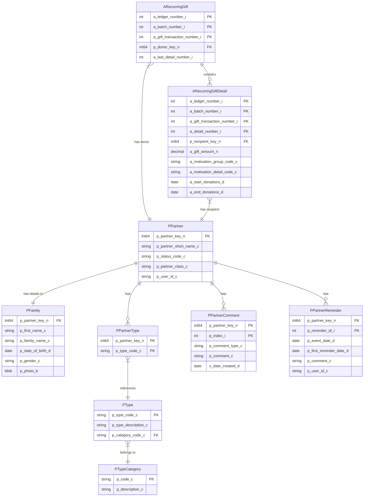
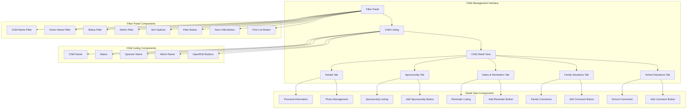
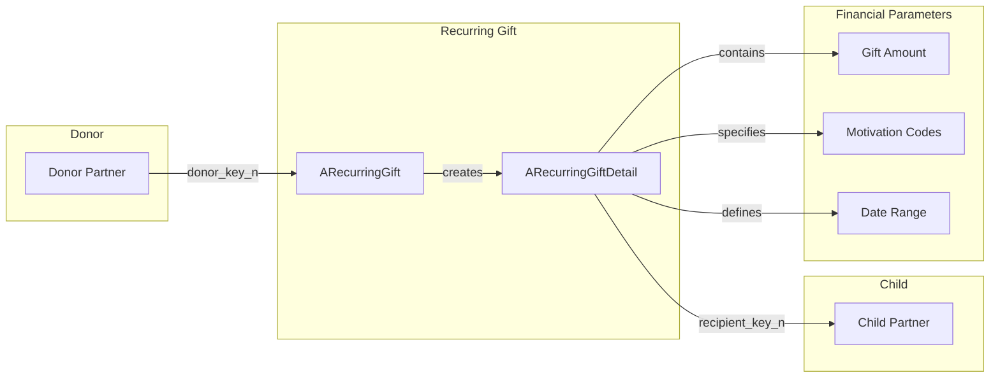

# Child Sponsorship Management in OpenPetra

## Child Sponsorship Overview

OpenPetra's child sponsorship management system serves as a comprehensive platform for connecting donors with sponsored children while maintaining detailed records of these relationships. The system facilitates the tracking of children's personal information, family situations, school progress, and sponsorship statuses. It enables administrators to manage the financial commitments between donors and children, including recurring gifts and payment schedules. The sponsorship module is designed to provide transparency in the relationship between sponsors and children, while offering administrative tools to ensure proper oversight, communication management, and financial tracking. This system forms a critical component of OpenPetra's nonprofit management capabilities, allowing organizations to efficiently run sponsorship programs that connect donors directly with beneficiaries.

## Child Management Data Model

The child management data model in OpenPetra centers around the PPartner entity, which serves as the foundation for all partner records, including sponsored children. Children are stored as partners with the FAMILY class and are linked to specific child status types through the PPartnerType table. The PFamily table extends the partner record with child-specific information such as first name, family name, date of birth, gender, and photo.

Child records are enriched with two types of comments stored in PPartnerComment: family situations and school situations, which are differentiated by the comment_type_c field. The PPartnerReminder table allows administrators to set up date-based reminders for important events related to each child.

The financial relationship between donors and children is managed through the ARecurringGift and ARecurringGiftDetail tables. Each recurring gift is created by a donor (linked via donor_key_n) and can have multiple gift details, each specifying a recipient child (recipient_key_n), amount, motivation codes, and date ranges for the sponsorship period.

This relational structure enables OpenPetra to maintain comprehensive records of each child, their sponsors, and the complete history of their sponsorship journey.

## Child Record Management

OpenPetra's child record management system provides administrators with comprehensive tools to create and maintain detailed profiles for each sponsored child. When creating a new child record, administrators enter essential personal information including the child's first and last name, gender, and date of birth. The system assigns each child a unique partner key for identification within the database.

Administrators can upload and manage photos of each child, with the system automatically resizing images to maintain consistent display quality. These photos are stored directly in the database as base64-encoded data and are accessible through the child's profile.

Each child record is assigned a specific status (such as boarding school, children's home, or home-based) which helps categorize children based on their living situation. Additionally, each child is assigned to a specific administrator who oversees their case and receives notifications about important events or required actions.

The system maintains complete audit trails of child record changes, tracking who created or modified records and when these changes occurred. This ensures accountability and provides a historical record of all administrative actions taken on a child's profile.

Child records can be easily filtered and searched using various criteria including child name, sponsor name, sponsorship status, and administrator assignment, making it efficient to locate specific children even in large sponsorship programs.

## Sponsorship Status Tracking

OpenPetra's sponsorship module implements a robust status tracking system for sponsored children, allowing organizations to categorize children based on their current living and care situations. The system uses a dedicated type category called 'SPONSORED_CHILD_STATUS' to maintain these status options.

The primary status options available in the system include:

1. **CHILDREN_HOME** - Indicates that the child resides in a children's home or orphanage facility
2. **BOARDING_SCHOOL** - Designates children who live at a boarding school facility
3. **HOME_BASED** - Identifies children who live with their families or guardians while receiving sponsorship support
4. **CHILD_DIED** - A status used to mark records of children who have passed away
5. **PREVIOUS_CHILD** - Used for children who were previously in the sponsorship program but are no longer active

These statuses are stored in the database through the relationship between the PPartner, PPartnerType, and PType tables. When a child's status changes, the system maintains this history by creating new type associations rather than simply updating existing ones, ensuring that historical status information is preserved.

Administrators can change a child's status through the child management interface, which automatically updates the underlying database relationships. The status is prominently displayed in the child listing view, making it easy for administrators to quickly identify the current situation of each child in the program.

The status tracking system is integral to reporting and filtering capabilities, allowing program managers to generate lists of children by status type for administrative purposes, donor communications, or program evaluation.

## Child Management Interface

The Child Management Interface in OpenPetra provides a comprehensive and intuitive user experience for administrators managing sponsored children. The interface is structured with three main components: the filter panel, child listing, and detail view with multiple tabs.

The filter panel offers extensive filtering options including child name, donor name, sponsorship status, and administrator assignment. Users can also filter for children without sponsors and sort results by different criteria. The panel includes buttons for creating new child records and generating printable PDF reports of filtered results.

The child listing displays search results in a tabular format with columns for child name, status, sponsor name, and administrator name. Each row includes buttons to open the child's detailed information or edit their basic details.

When a child record is opened, the detail view presents a tabbed interface with five main sections:
1. **Details** - Shows personal information (name, gender, birth date) and photo management
2. **Sponsorship** - Lists all sponsorships with donor information, motivation codes, amounts, and date ranges
3. **Dates & Reminders** - Displays scheduled reminders for important events with notification dates
4. **Family Situations** - Shows chronological comments documenting the child's family circumstances
5. **School Situations** - Contains dated comments about the child's educational progress

Each tab includes appropriate controls for adding, editing, or deleting records. The interface uses modal dialogs for editing operations, ensuring a clean and focused user experience. The design emphasizes efficiency for administrators who need to manage large numbers of child records while maintaining detailed information for each child.

## Family and School Situation Documentation

OpenPetra's child sponsorship system includes a robust feature for documenting children's family and school situations through a structured comment system. This functionality allows administrators to maintain a chronological record of each child's circumstances, challenges, and progress in both home and educational environments.

The system separates comments into two distinct categories: family situations and school situations. Each comment is stored in the PPartnerComment table with a specific comment_type_c value ('FAMILY' or 'SCHOOL') to distinguish between these categories. Comments are automatically timestamped upon creation, ensuring an accurate chronological record.

For family situations, administrators can document important information about the child's home environment, including:
- Changes in family composition or living arrangements
- Health issues affecting the family
- Economic challenges or improvements
- Significant family events or circumstances
- Support interventions provided to the family

School situation comments focus on the child's educational journey, allowing administrators to track:
- Academic performance and progress
- School attendance patterns
- Educational challenges or achievements
- Extracurricular activities and interests
- Educational support provided through the sponsorship program

The interface presents these comments in chronological order within their respective tabs in the child detail view. Each comment displays its creation date alongside the comment text, creating a timeline of the child's development and circumstances. For longer comments, the system shows a preview in the list view with the ability to view the full text.

This documentation system serves multiple purposes: it provides valuable context for administrators managing the child's case, creates accountability for the sponsorship program's impact, and generates content that can be used (with appropriate privacy controls) in communications with sponsors about the child's progress and needs.

## Reminder System

OpenPetra's child sponsorship module includes a sophisticated reminder system that helps administrators track important dates and events related to sponsored children. This feature ensures that critical activities are not overlooked and appropriate follow-up actions are taken in a timely manner.

Reminders are stored in the PPartnerReminder table and are associated with specific children through the partner key relationship. Each reminder contains several key components:

1. **Event Date** - The date when the actual event or activity is scheduled to occur
2. **First Reminder Date** - The date when the system should first notify the administrator about the upcoming event
3. **Comment** - A detailed description of the event or required action
4. **User ID** - The administrator who should receive the notification (automatically set to the child's assigned administrator)

Administrators can create reminders for various purposes, such as:
- Health check-ups or medical appointments
- School enrollment or graduation dates
- Document renewal deadlines (e.g., identification papers)
- Birthday celebrations
- Family visit schedules
- Program evaluation milestones
- Sponsorship renewal dates

The reminder system is integrated with the child management interface through a dedicated "Dates & Reminders" tab in the child detail view. This tab displays all reminders in chronological order and provides controls to add, edit, or delete reminder entries.

When the first reminder date is reached, the system generates notifications for the assigned administrator. These notifications help ensure that important events are not missed and that administrators can prepare adequately for upcoming activities or deadlines.

The reminder system plays a crucial role in maintaining consistent support for sponsored children by ensuring that administrative tasks and important milestones are properly tracked and addressed.

## Sponsorship Financial Flow

The sponsorship financial flow in OpenPetra is structured around recurring gifts that establish financial relationships between donors and sponsored children. This system enables consistent, scheduled support while maintaining detailed records of all financial commitments.

At the core of this flow is the recurring gift batch specifically designated for sponsorships (identified by the batch description "SPONSORSHIP"). Within this batch, individual recurring gift records (ARecurringGift) are created for each donor who sponsors one or more children. These gift records are linked to the donor through the donor_key_n field.

For each child sponsored by a donor, a recurring gift detail record (ARecurringGiftDetail) is created. This detail record contains critical financial information:

1. **Gift Amount** - The monetary value committed by the donor for this specific child
2. **Motivation Codes** - A group code and detail code that categorize the purpose of the gift (e.g., "SPONSOR/EDUCATION" or "SPONSOR/GENERAL")
3. **Start Donations Date** - When the financial commitment begins
4. **End Donations Date** - When the commitment ends (can be null for open-ended commitments)

The recurring gift detail connects to the sponsored child through the recipient_key_n field, creating a direct link between the donor's financial commitment and the specific child beneficiary.

This structure supports several important financial processes:
- Verification of incoming donations against expected sponsorship amounts
- Tracking of sponsorship duration and renewal dates
- Reporting on sponsorship financial commitments and fulfillment
- Managing multiple sponsorships from a single donor to different children
- Handling changes in sponsorship amounts or terms

The system also includes validation to ensure that sponsorship records are properly maintained, with appropriate motivation codes and valid date ranges. This helps maintain data integrity in the financial relationship between donors and sponsored children.

## Donor-Child Relationship Management

OpenPetra's sponsorship module provides comprehensive tools for managing the relationship between donors and their sponsored children. This relationship management is central to successful sponsorship programs, as it ensures clear communication channels and maintains accurate records of the connection between sponsors and beneficiaries.

When a sponsorship is established, the system creates a link between the donor and child through the recurring gift system. This relationship includes not only financial information but also important contact details that facilitate communication:

- **Donor Contact Information**: The system maintains complete donor records including postal address, email address, and phone numbers. This information is accessible directly from the child's sponsorship tab, allowing administrators to quickly contact sponsors when needed.

- **Sponsorship History**: The system tracks the complete history of each child's sponsorships, including current and past sponsors. This historical record helps administrators understand the child's support network over time.

- **Multiple Sponsorships**: OpenPetra supports scenarios where a child may have multiple sponsors (partial sponsorships) or where a donor sponsors multiple children. The interface clearly displays these relationships, making it easy to understand the complete sponsorship network.

- **Communication Management**: While the system doesn't directly handle the content of communications between donors and children, it provides the infrastructure to track and manage these interactions. Administrators can use the family and school situation comments as source material for updates to sponsors.

- **Sponsorship Changes**: When changes occur in the sponsorship relationship (such as amount changes, temporary pauses, or terminations), administrators can update the recurring gift details with new amounts or end dates. This ensures that the financial records accurately reflect the current state of each sponsorship.

The relationship management capabilities extend to reporting functions, allowing organizations to generate lists of donors by child or children by donor. This bidirectional view of relationships helps administrators maintain a holistic understanding of the sponsorship program's interconnections.

## Reporting and List Generation

OpenPetra's child sponsorship module includes robust reporting and list generation capabilities that help administrators manage and analyze their sponsorship programs effectively. These features provide flexible ways to extract, view, and distribute information about sponsored children based on various criteria.

The primary reporting function allows administrators to generate filtered lists of sponsored children. The system offers multiple filtering options:

- **Child Name**: Search for specific children by full or partial name
- **Donor Name**: Filter children by their sponsor's name
- **Sponsorship Status**: Select children with specific statuses (e.g., boarding school, home-based)
- **Administrator Assignment**: Filter by the staff member responsible for the child
- **Sponsorship Status**: Option to show only children without sponsors

Once filtered, the child list can be sorted by different criteria, including child name or administrator name, to organize the information in the most useful way for specific administrative purposes.

The system provides two main output formats for these filtered lists:

1. **On-screen Display**: The filtered results appear directly in the user interface, showing key information including child name, status, sponsor name, and administrator in a tabular format.

2. **PDF Generation**: Administrators can generate a formatted PDF report of the filtered list by clicking the "Print List" button. This report uses the SponsoredChildrenList.html template to create a professional document that can be saved, printed, or shared electronically.

The PDF generation process utilizes HTML templates and the HTML2PDF conversion functionality, ensuring consistent formatting and professional appearance. The generated PDF includes all the children matching the filter criteria, with their names, statuses, sponsors, and administrators clearly displayed.

These reporting capabilities support various administrative needs, such as:
- Preparing overview reports for program managers
- Creating lists for field visits or check-ins
- Identifying children without sponsors who need matching
- Generating reports for specific administrators about their assigned children
- Documenting the program status for board meetings or donor communications

The combination of flexible filtering, sorting options, and PDF output makes the reporting system a valuable tool for effective sponsorship program management.

[Generated by the Sage AI expert workbench: 2025-03-30 02:22:57  https://sage-tech.ai/workbench]: #