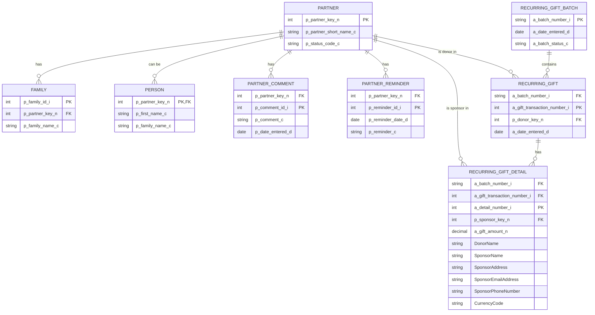
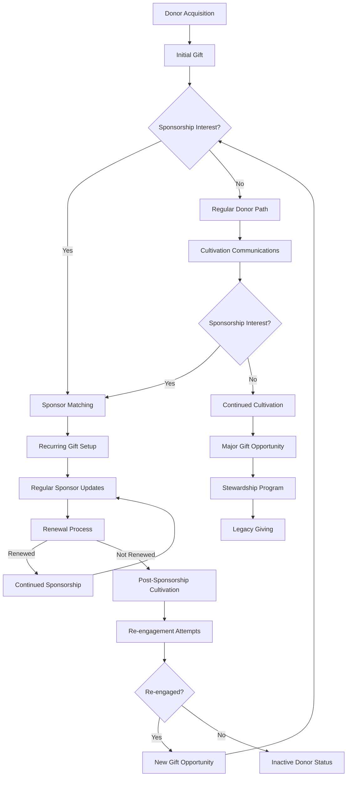
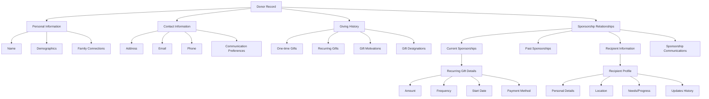

# Sponsorship and Donor Management in OpenPetra

## Introduction to Sponsorship and Donor Management in OpenPetra

OpenPetra's sponsorship module provides non-profit organizations with a comprehensive system for managing donor relationships, recurring gifts, and sponsorship programs. The module is designed to facilitate the complex relationships between donors, sponsors, and recipients while streamlining the management of recurring financial commitments. By integrating partner data with financial transactions, OpenPetra enables organizations to maintain detailed donor profiles, track giving patterns, manage recurring donations, and facilitate sponsor-recipient relationships. This integration allows organizations to efficiently handle the administrative aspects of sponsorship programs while maintaining meaningful connections with their donors and ensuring that funds are properly allocated to recipients.

## Data Structure for Donor Management

OpenPetra organizes donor data through a sophisticated integration of partner tables and financial tables. The core partner tables (`p_partner`, `p_family`) store fundamental information about individuals and organizations, while specialized tables like `p_partner_comment` and `p_partner_reminder` capture communication history and follow-up actions. Partner classification is handled through `p_type` and `p_partner_type` tables, allowing organizations to categorize donors according to their specific taxonomies. 

These partner tables are seamlessly connected to financial tables, particularly those related to recurring gifts (`a_recurring_gift_batch`, `a_recurring_gift`, `a_recurring_gift_detail`). This integration creates a comprehensive donor profile that includes not only personal information but also complete financial history, giving patterns, and sponsorship relationships. Custom fields extend the standard data structure to accommodate sponsorship-specific information, such as sponsor-recipient relationships and communication preferences, enabling organizations to track the full lifecycle of donor engagement from initial contact through ongoing sponsorship commitments.

## Sponsorship Data Relationship Model

The diagram illustrates the complex relationships in OpenPetra's sponsorship system. At the core is the PARTNER entity, which connects to both personal data (FAMILY, PERSON) and financial transactions (RECURRING_GIFT). The RECURRING_GIFT_DETAIL table serves as the critical junction where donor information meets sponsorship details, containing both financial data and extended fields for sponsor information. This model enables comprehensive tracking of the donor-sponsor-recipient relationship while maintaining the integrity of financial records. The custom fields in RECURRING_GIFT_DETAIL (SponsorName, SponsorAddress, etc.) facilitate efficient reporting and communication without requiring complex joins across multiple tables.

## Recurring Gift Management

OpenPetra's recurring gift management system is built around three key tables: `a_recurring_gift_batch`, `a_recurring_gift`, and `a_recurring_gift_detail`. This structure follows a hierarchical organization that enables efficient processing and tracking of ongoing donor commitments. The batch table (`a_recurring_gift_batch`) serves as a container for processing groups of recurring gifts, tracking their entry date and status. Individual recurring gift records (`a_recurring_gift`) link donors to their commitments, storing the donor's partner key (`p_donor_key_n`) and transaction metadata.

The most detailed level, `a_recurring_gift_detail`, captures the specifics of each recurring gift, including amount, frequency, and recipient information. This table is extended with custom fields that store sponsor information alongside the financial data, creating a direct link between the financial transaction and the sponsorship relationship. By organizing recurring gifts in this manner, OpenPetra enables organizations to reliably track ongoing donor commitments, generate accurate financial projections, process recurring transactions efficiently, and maintain the connection between donors and the recipients they support. This structure also facilitates reporting on recurring giving patterns and sponsorship relationships across the organization.

## Donor Communication and Reminders

OpenPetra manages donor communications through an integrated system of partner comments and reminders, enabling organizations to maintain comprehensive records of all donor interactions and schedule follow-up activities. The `p_partner_comment` table stores historical communications with donors, including meeting notes, phone conversations, and email exchanges, with timestamps to create a chronological interaction history. Complementing this, the `p_partner_reminder` table facilitates proactive relationship management by scheduling future communications and follow-ups.

This communication framework is tightly integrated with the sponsorship data structure, allowing staff to view a donor's complete history while managing their recurring gifts and sponsorship relationships. The system can associate comments and reminders with specific sponsorship activities, such as renewal notifications, thank-you communications, or updates about sponsored recipients. By centralizing communication history and scheduled reminders, OpenPetra ensures that donor relationships are maintained consistently across the organization, preventing missed follow-ups and enabling personalized engagement based on the donor's complete history with the organization.

## Donor Lifecycle Workflow

This workflow diagram illustrates the donor lifecycle in OpenPetra's sponsorship management system. The process begins with donor acquisition and follows multiple pathways depending on the donor's interest in sponsorship programs. For sponsors, the system manages the matching process, recurring gift setup, regular updates, and renewal cycles. For non-sponsors, the system supports cultivation communications with opportunities to convert to sponsorship. The workflow includes handling for both successful renewals and non-renewals, with re-engagement strategies for lapsed donors. Throughout this lifecycle, OpenPetra's integrated data structure maintains the relationship between donors, their gifts, and sponsorship commitments, enabling staff to access complete donor histories at any point in the workflow and ensuring appropriate communication based on the donor's current status and history.

## Sponsor-Recipient Relationship Tracking

OpenPetra's system maintains robust connections between sponsors and recipients through a specialized data structure that extends standard financial transactions with sponsorship-specific information. The `a_recurring_gift_detail` table serves as the primary junction for these relationships, using the `p_sponsor_key_n` field to identify the sponsor while custom fields store additional sponsor information alongside the financial transaction data. This approach creates a direct link between the financial commitment and the sponsorship relationship without requiring complex joins across multiple tables.

The system captures not only the basic sponsor-recipient connection but also enriches it with contact details (`SponsorAddress`, `SponsorEmailAddress`, `SponsorPhoneNumber`) that facilitate communication between the organization and sponsors. By storing this information within the recurring gift structure, OpenPetra enables organizations to efficiently manage sponsor communications, generate personalized updates about recipients, and maintain the integrity of the sponsor-recipient relationship even as financial details change over time. This integrated approach ensures that the organization can fulfill its commitments to both sponsors and recipients while maintaining accurate financial records of all sponsorship transactions.

## Search and Reporting Capabilities

The `SponsorshipFindTDS` structure in OpenPetra provides powerful search functionality across donor and sponsorship data, enabling comprehensive reporting and analysis. This custom dataset combines essential partner information (`p_partner_short_name_c`, `p_status_code_c`, `p_partner_key_n`) with person-specific details (`p_first_name_c`, `p_family_name_c`) and extends them with sponsorship-specific fields (`DonorName`, `SponsorName`, `SponsorContactDetails`). This integrated structure allows users to search across multiple dimensions of donor and sponsorship data simultaneously.

The search capabilities support complex queries that can filter by donor characteristics, sponsorship status, gift amounts, and recipient information. Reports generated from these searches provide insights into sponsorship program effectiveness, donor retention rates, giving patterns, and recipient coverage. The flexible structure allows organizations to analyze their sponsorship programs from multiple perspectives, identifying trends, gaps, and opportunities for growth. By combining partner data with financial information and sponsorship relationships in a single searchable structure, OpenPetra enables organizations to make data-driven decisions about their sponsorship programs while maintaining efficient access to individual donor and sponsor records.

## Donor Information Architecture

This hierarchical diagram illustrates how donor data is organized in OpenPetra's sponsorship module. The architecture begins with the core donor record and branches into four main categories: personal information, contact information, giving history, and sponsorship relationships. Each category contains multiple levels of detail, with sponsorship relationships further subdivided to track both current and past sponsorships, recipient information, and related communications. The recurring gift details connect directly to financial records, while recipient profiles maintain information about the individuals or projects being sponsored. This comprehensive architecture enables organizations to maintain complete donor profiles that integrate personal information with giving history and sponsorship relationships, facilitating personalized communication and effective program management. The structure supports both operational needs (processing gifts, sending communications) and analytical requirements (understanding giving patterns, evaluating program effectiveness).

## Contact Management Integration

OpenPetra's donor management system is deeply integrated with its broader contact management features, creating a seamless experience for managing donor relationships. The core partner tables (`p_partner`, `p_family`) serve as the foundation for both general contact management and donor-specific functions, ensuring that all donor information is maintained within a unified contact database. This integration extends to address management, where donor addresses are stored in the standard partner address tables, enabling consistent formatting and validation across all organizational contacts.

Communication preferences are captured within the partner data structure, allowing organizations to respect donor choices regarding contact methods, frequency, and content types. These preferences inform both general communications and sponsorship-specific updates. The contact history functionality, implemented through `p_partner_comment` and `p_partner_reminder` tables, provides a comprehensive view of all interactions with a donor, regardless of whether they were related to general engagement or specific sponsorship activities.

This integrated approach ensures that donor management benefits from all contact management features, including address validation, communication tracking, and relationship management. It also enables organizations to maintain a holistic view of each donor's relationship with the organization, encompassing both their role as a donor/sponsor and any other relationships they might have, such as volunteer, event attendee, or board member. By avoiding siloed donor data, OpenPetra facilitates more personalized and coordinated donor engagement across all organizational touchpoints.

## Financial Integration for Donor Tracking

OpenPetra's sponsorship module seamlessly connects to the system's financial components, creating an integrated platform for tracking donations, generating receipts, and managing recurring transactions. The recurring gift tables (`a_recurring_gift_batch`, `a_recurring_gift`, `a_recurring_gift_detail`) serve as the bridge between donor records and the financial system, ensuring that sponsorship commitments are properly recorded and processed within the organization's financial framework.

This integration enables automatic generation of financial transactions from recurring gift records, ensuring that sponsorship payments are consistently recorded in the general ledger with appropriate account codes and designations. The system maintains the relationship between each financial transaction and its corresponding donor and sponsorship information, facilitating accurate receipt generation and financial reporting.

For recurring gifts, the system can automatically schedule and process regular transactions based on the frequency and terms established in the recurring gift record. This automation reduces administrative overhead while maintaining accurate financial records. The financial integration also supports specialized sponsorship transactions, such as handling currency conversions for international sponsorships or applying administrative fees according to organizational policies.

By connecting donor management directly to financial systems, OpenPetra ensures that all sponsorship activities are properly reflected in the organization's financial records, supporting both donor-centric reporting (such as annual giving statements) and financial accountability (through accurate ledger entries and financial statements). This integration creates a complete financial picture of the organization's sponsorship program while maintaining the donor relationships that drive it.

## Sponsorship Module System Context

```mermaid
graph TB
    A[Sponsorship Module] --- B[Finance Module]
    A --- C[Partner Management Module]
    A --- D[Reporting System]
    A --- E[Gift Processing]
    
    B --- B1[General Ledger]
    B --- B2[Accounts Receivable]
    B --- B3[Financial Reporting]
    
    C --- C1[Contact Database]
    C --- C2[Communication History]
    C --- C3[Relationship Management]
    
    D --- D1[Donor Reports]
    D --- D2[Sponsorship Analytics]
    D --- D3[Financial Statements]
    
    E --- E1[Gift Entry]
    E --- E2[Receipt Generation]
    E --- E3[Recurring Gift Processing]
    
    A --- F[International Clearing House]
    F --- F1[Currency Exchange]
    F --- F2[Cross-Border Transfers]
    
    subgraph External Systems
        G[Payment Processors]
        H[Banking Systems]
        I[Email Communication]
    end
    
    A -.-> G
    B -.-> H
    A -.-> I
```

This diagram illustrates how the Sponsorship Module interfaces with other core components of the OpenPetra system. At the center is the Sponsorship Module, which connects bidirectionally with four primary internal systems: Finance Module, Partner Management Module, Reporting System, and Gift Processing. Each of these systems provides essential services that support sponsorship operations. The Finance Module handles general ledger entries, accounts receivable, and financial reporting for all sponsorship transactions. The Partner Management Module maintains the contact database, communication history, and relationship management features that support donor engagement. The Reporting System generates donor reports, sponsorship analytics, and financial statements that provide insights into program performance. The Gift Processing component manages gift entry, receipt generation, and recurring gift processing, ensuring that all donations are properly recorded and acknowledged.

Additionally, the diagram shows the connection to OpenPetra's International Clearing House, which facilitates currency exchange and cross-border transfers for international sponsorship programs. The dotted lines indicate interfaces with external systems such as payment processors, banking systems, and email communication platforms that extend the functionality of the sponsorship module. This comprehensive integration ensures that the sponsorship module can leverage all aspects of OpenPetra's functionality while maintaining specialized features for donor and sponsorship management.

[Generated by the Sage AI expert workbench: 2025-03-30 02:22:57  https://sage-tech.ai/workbench]: #