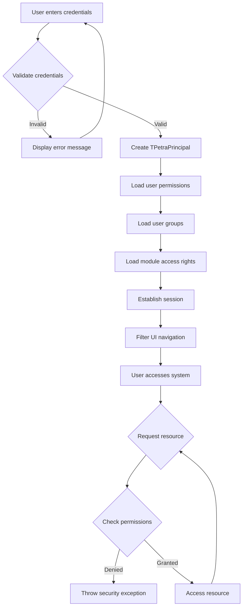
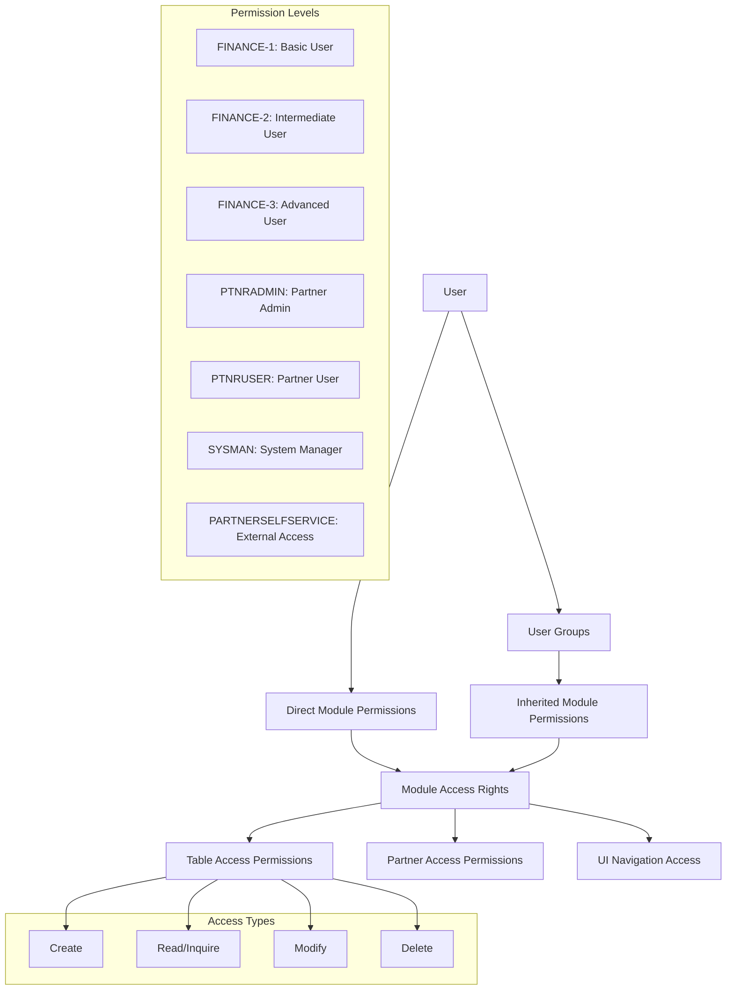
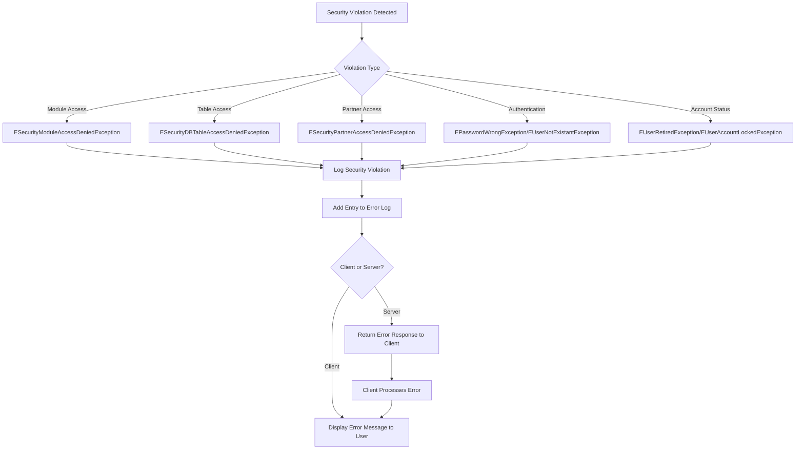

# System Management - Access Control in OpenPetra

## Authentication Framework Overview

OpenPetra implements a comprehensive authentication and access control system that secures resources across the application. The framework consists of multiple layers that work together to authenticate users, establish their identity, and enforce appropriate access restrictions based on permissions.

At its core, the authentication system begins with user login credentials validation against the database. Once authenticated, the system creates a `TPetraPrincipal` object that encapsulates the user's identity, including their user ID, partner key, and assigned permissions. This principal object serves as the security context for all subsequent operations.

The framework employs a modular approach to access control with several key components:
- Module-based permissions that control access to functional areas
- Group-based security that organizes users with similar access needs
- Table-level access controls for database operations
- Partner-specific security rules that protect sensitive partner information
- Foundation ownership restrictions for organizational partners

This multi-layered approach ensures that users can only access resources appropriate to their role and responsibilities within the system.

## Authentication Flow Diagram

The authentication flow begins when a user enters their credentials on the login screen. The system validates these credentials against the database, checking for existence, correctness, and account status (locked, retired, etc.). If validation fails, an appropriate error message is displayed.

Upon successful validation, the system creates a `TPetraPrincipal` object and populates it with the user's permissions, group memberships, and module access rights. These are loaded from database tables like `s_user_module_access_permission` and `s_user_group`.

The system then establishes a session and filters the UI navigation based on the user's permissions. As the user interacts with the system, each request for a resource (screen, function, data) is checked against their permissions. If access is denied, a security exception is thrown; otherwise, the resource is provided.

The diagram shows how security checkpoints are integrated throughout the user's interaction with the system, ensuring continuous enforcement of access controls.

## Permission Management Architecture

OpenPetra's permission management architecture is built on a multi-layered system that combines module permissions, group memberships, and table-level access controls. This architecture provides fine-grained control over what users can access and what operations they can perform.

At the highest level, permissions are organized by modules (such as FINANCE-1, PTNRADMIN, SYSMAN) that represent major functional areas of the application. Each module grants access to a set of related features and operations. The system defines several standard modules in the `s_module.csv` file, including tiered access levels for finance operations (basic, intermediate, advanced, and reporting).

Users are assigned to security groups that bundle common permission sets. These groups, defined in tables like `s_user_group`, simplify permission management by allowing administrators to assign multiple permissions at once. The `TGroupManager` class handles the loading and management of these group assignments.

Table-level access controls provide the most granular permission management. The `s_module_table_access_permission` and `s_user_table_access_permission` tables define which operations (create, read, modify, delete) users can perform on specific database tables. This is enforced by the `TDataBasePetra` class, which checks permissions before executing SQL queries.

The architecture also includes special handling for partner data with additional security layers based on partner type, foundation ownership, and user/group restrictions. This ensures sensitive partner information is only accessible to authorized users.

## Module Access Control

OpenPetra's module access control system provides a structured approach to managing permissions for server methods and functional areas. The core of this system is the `RequireModulePermissionAttribute` that decorates server methods with the permissions required to execute them.

This attribute-based system allows developers to declaratively specify permission requirements using logical expressions. For example, a method might require:
- A single module permission: `[RequireModulePermission("FINANCE-1")]`
- Multiple permissions using logical operators: `[RequireModulePermission("OR(SYSMAN,AND(PTNRADMIN,DEVADMIN))")]`

When a client calls a server method, the `TModuleAccessManager.CheckUserPermissionsForMethod()` uses reflection to examine the method's attributes and verify that the current user has the necessary permissions. This verification process:

1. Locates the method being called based on name and parameter types
2. Extracts the permission requirements from the `RequireModulePermissionAttribute`
3. Evaluates the logical expression against the user's assigned modules
4. Grants or denies access based on the evaluation result

The system also supports special permission tokens like "USER" (any authenticated user) and ledger-specific permissions formatted as "LEDGER0001" for access to specific ledgers.

For database operations, the `TModuleAccessManager.CheckUserPermissionsForTable()` method verifies that users have the appropriate permissions (read, create, modify, delete) for specific tables before allowing operations to proceed.

This module-based approach provides a consistent security model across the application while allowing for complex permission combinations to meet specific business needs.

## Permission Hierarchy

The diagram illustrates OpenPetra's hierarchical permission structure. At the top level, users receive permissions either directly or through membership in security groups. These permissions grant access to modules, which in turn control access to specific tables, partner data, and UI navigation elements.

The permission hierarchy includes several predefined permission levels, such as basic, intermediate, and advanced finance users, partner administrators, and system managers. Each level grants progressively more access to system functionality.

For database operations, permissions are further divided into specific access types: create, read/inquire, modify, and delete. These granular permissions allow administrators to precisely control what operations users can perform on specific data tables.

The hierarchical structure enables efficient permission management by allowing administrators to assign permissions at the appropriate level. For example, adding a user to the "FINANCE-1" group automatically grants all the permissions needed for basic finance operations without having to assign individual table permissions.

## Database Table Security

OpenPetra implements a robust database security system that validates user permissions before executing SQL queries. This security layer is primarily implemented in the `TDataBasePetra` class, which extends the base database functionality with permission checking.

When a SQL query is submitted, the system first parses the statement to determine:
1. The operation type (SELECT, INSERT, UPDATE, DELETE)
2. The required permission (inquire, create, modify, delete)
3. The target database tables

For each identified table, the system checks if the current user has the appropriate permission by querying the `s_user_table_access_permission` table. This table stores granular permissions for each user and table combination, specifying which operations they can perform.

The security implementation includes several optimizations:
- A SQL cache to store user permissions for performance
- Special handling for system tables like `S_USER_DEFAULTS` that always allow access
- Detailed error logging when access is denied

When access is denied, the system throws an `ESecurityDBTableAccessDeniedException` with information about the attempted operation, the table, and the missing permission. This exception is logged both to the application log and to the Petra error log table for audit purposes.

The `TTableAccessPermissionManager` class provides additional functionality for loading and managing table access permissions. It works in conjunction with the database security system to ensure that only authorized users can access sensitive data.

## Navigation and UI Access Control

OpenPetra implements a sophisticated UI access control system that dynamically filters navigation options based on user permissions. This ensures users only see menu items they're authorized to access, providing a clean and secure user experience.

The navigation system is defined in the `UINavigation.yml` configuration file, which organizes menu items hierarchically under main sections like Home, Partner, Finance, and SystemManager. Each menu entry specifies attributes including paths to forms, required permissions, and Font Awesome icons.

When a user logs in, the `TUINavigation` class processes this configuration file and filters it based on the user's permissions:

1. The YAML configuration is converted to an XML structure
2. Each navigation node is evaluated against the user's permissions
3. Nodes requiring permissions the user doesn't have are removed
4. The filtered navigation structure is converted to JSON and sent to the client

The permission checking supports complex boolean expressions using AND/OR operators, allowing for sophisticated access rules. For example, a menu item might require:
- A single permission: `PermissionsRequired=SYSMAN`
- Multiple permissions: `PermissionsRequired="OR(SPONSORVIEW,SPONSORADMIN)"`

This filtered navigation structure is then used to build both the top navigation bar and the sidebar navigation in the JavaScript client. The system also checks if HTML files exist for each navigation item, allowing it to indicate which features are implemented.

By filtering navigation at the server level rather than just hiding UI elements, the system provides true security rather than mere "security by obscurity," ensuring users cannot access unauthorized functionality even through direct URL manipulation.

## Security Exception Handling

OpenPetra implements a comprehensive security exception handling system that detects, logs, and communicates security violations. The flowchart illustrates how different types of security violations are processed through the system.

When a security violation occurs, the system first identifies the type of violation and throws an appropriate specialized exception. The exception hierarchy includes:

- `EPetraSecurityException` as the base class for all security exceptions
- `ESecurityModuleAccessDeniedException` for module permission violations
- `ESecurityDBTableAccessDeniedException` for database table access violations
- `ESecurityPartnerAccessDeniedException` for partner data access violations
- Authentication exceptions like `EPasswordWrongException` and `EUserNotExistantException`
- Account status exceptions like `EUserRetiredException` and `EUserAccountLockedException`

Each exception contains detailed information about the violation, including the user ID, the resource being accessed, and the required permission.

When an exception is thrown, it's logged to the application log and added to the Petra error log table using the `LogInPetraErrorLog` method. This creates an audit trail of security violations for compliance and troubleshooting purposes.

For server-side violations, an error response is returned to the client with appropriate information. The client then processes this error and displays a user-friendly message. For client-side violations (pre-checks), the error message is displayed directly.

This structured approach to security exceptions ensures that violations are properly detected, documented, and communicated, while providing sufficient information for administrators to investigate security incidents.

## Partner-Specific Access Controls

OpenPetra implements specialized security controls for partner data that go beyond the standard module and table permissions. These partner-specific controls protect sensitive information about individuals and organizations in the system.

Partner security is implemented through multiple layers:

1. **User-specific restrictions**: Partners can be restricted to specific users through the `p_partner.p_restricted_i` field with a value of `PARTNER_PRIVATE_USER (2)`. When this restriction is applied, only the designated user and system administrators can access the partner record.

2. **Group-specific restrictions**: Partners can be restricted to security groups using `p_partner.p_restricted_i` with a value of `PARTNER_PRIVATE_GROUP (1)`. This limits access to members of the specified group and system administrators.

3. **Foundation ownership restrictions**: For organizational partners that are foundations, additional security checks verify that the current user has permission to access the foundation based on ownership. The `CheckFoundationSecurity` method in `TSecurity` validates these permissions.

The partner security system is implemented in both server-side and shared code:

- `Ict.Petra.Server.MPartner.Common.TSecurity` provides server-side methods like `CanAccessPartner` and `CanAccessPartnerByKey` that check if the current user can access a specific partner.
- `Ict.Petra.Shared.MPartner.TSecurity` contains shared logic for partner access control that can be used by both client and server components.

When access is denied, the system throws an `ESecurityPartnerAccessDeniedException` with details about the partner and the reason for the denial. This exception includes the partner key, partner short name, and access level for logging and reporting purposes.

These partner-specific controls ensure that sensitive personal and organizational information is only accessible to authorized users, providing an additional layer of protection beyond the standard permission system.

## Self-Service and External Access

OpenPetra implements a specialized module called PARTNERSELFSERVICE that enables external partners to access limited functionality through a controlled interface. This module provides a secure way for partners to interact with the system without requiring full internal user access.

The PARTNERSELFSERVICE module is defined in the `s_module.csv` file and is specifically designed for external access. Unlike internal modules that grant broad permissions, this module provides a restricted set of capabilities focused on self-service operations.

Key aspects of the self-service implementation include:

1. **Dedicated navigation**: The UINavigation.yml file defines a specific navigation structure for self-service users, limiting what they can see and access.

2. **Permission isolation**: Self-service users are granted the PARTNERSELFSERVICE module permission but not other internal permissions, ensuring they can only access appropriate functionality.

3. **Form restrictions**: The navigation system only shows forms that self-service users are permitted to access, with specific paths like "SelfService/MaintainPartnerSelfService".

4. **Limited database access**: Self-service users have restricted table access permissions, allowing them to view and update only their own information.

The implementation leverages the existing permission framework but applies it in a more restricted context. When a partner logs in through the self-service interface, they receive a `TPetraPrincipal` object with the PARTNERSELFSERVICE module permission, but not other internal permissions.

This approach allows external partners to perform necessary operations like updating their contact information or viewing their own data, while maintaining the security of the overall system. It provides a controlled interface for external interaction without compromising the integrity of internal operations.

## Security Logging and Audit

OpenPetra implements comprehensive security logging and auditing capabilities to track access attempts, permission violations, and security-related events. This logging system serves multiple purposes including compliance, troubleshooting, and security monitoring.

The security logging framework captures several types of events:

1. **Authentication events**: Login attempts (both successful and failed) are logged with user IDs, timestamps, and IP addresses. Failed logins are tracked to detect potential brute force attacks, with account lockout after a configurable number of failures (defined in `SYSDEFAULT_FAILEDLOGINS_UNTIL_ACCOUNT_GETS_LOCKED`).

2. **Permission violations**: When access is denied due to insufficient permissions, the system logs detailed information about the attempted operation, the required permission, and the user who attempted it. This includes module access violations, table access denials, and partner access restrictions.

3. **Security-sensitive operations**: Actions like password changes, user creation, and permission modifications are logged for audit purposes.

The logging implementation spans multiple components:

- The `TDataBasePetra.LogInPetraErrorLog` method logs database access violations to the Petra error log table with error code `PetraErrorCodes.ERR_NOPERMISSIONTOACCESSTABLE`.
- Security exceptions like `ESecurityModuleAccessDeniedException` include context information that is logged when they're thrown.
- The `TLogging` class is used throughout the security components to write log entries with appropriate severity levels.

For security violations, the system typically logs:
- The type of violation (module access, table access, partner access)
- The user ID attempting the operation
- The resource being accessed (module, table, partner)
- The required permission that was missing
- A timestamp of the attempt

This comprehensive logging approach ensures that security events are properly documented for compliance purposes and provides the necessary information for investigating security incidents or troubleshooting access problems.

[Generated by the Sage AI expert workbench: 2025-03-30 02:22:57  https://sage-tech.ai/workbench]: #