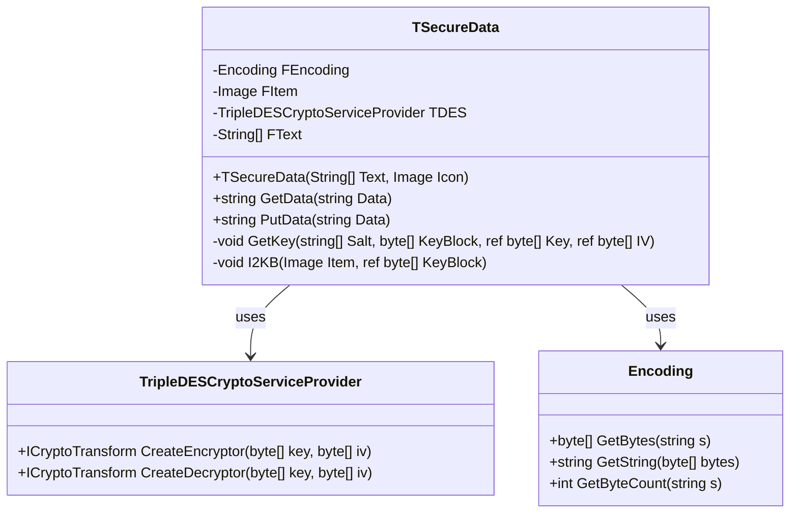
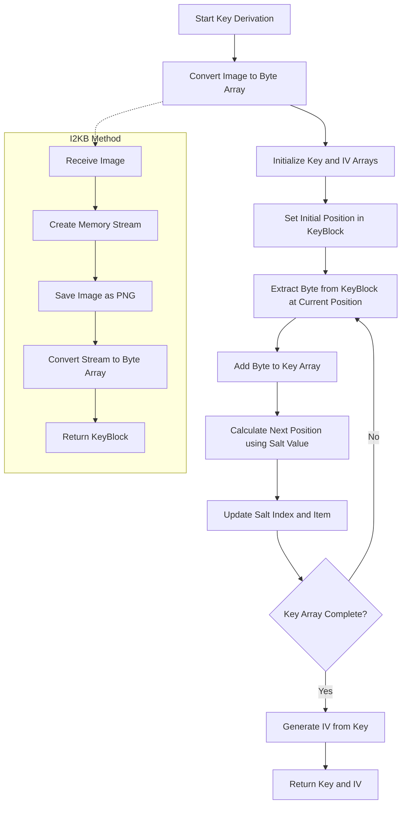
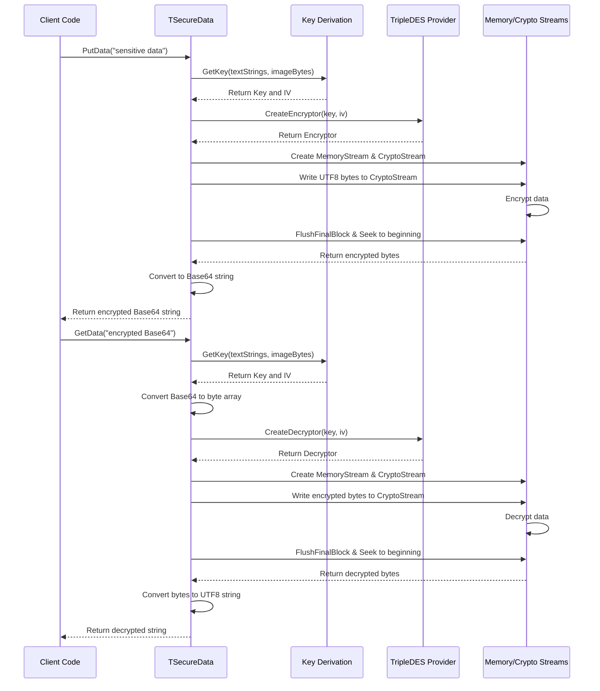
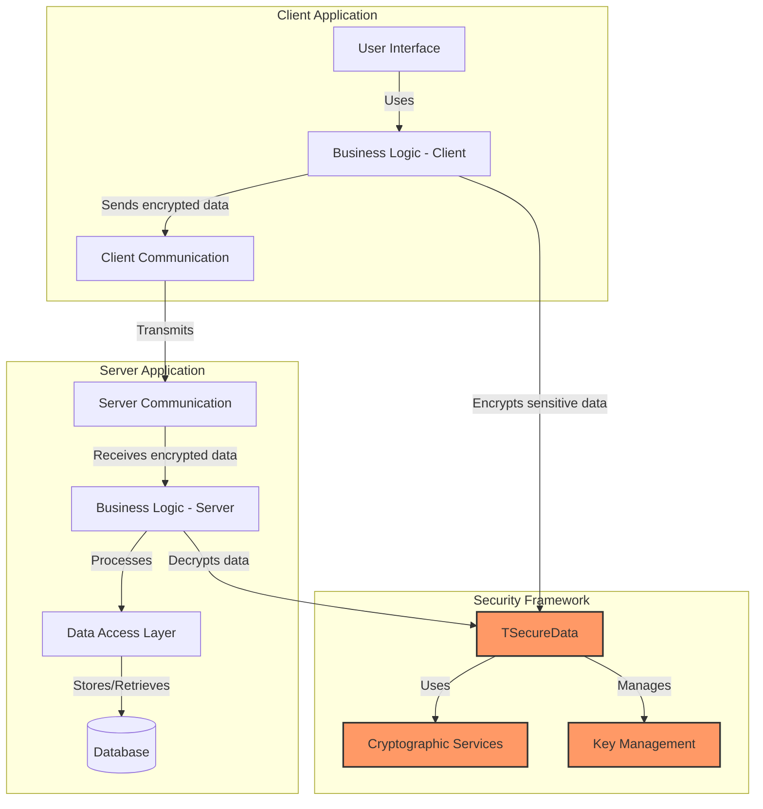

# OpenPetra Security Framework Analysis

## Introduction to OpenPetra's Security Framework

OpenPetra's security architecture implements a robust approach to protecting sensitive organizational data in this non-profit management system. Security is a critical cross-cutting concern within the application, as non-profit organizations often handle confidential donor information, financial records, and personal data of beneficiaries. The framework centers around encryption capabilities that safeguard data both at rest and during transmission. Rather than relying solely on standard encryption libraries, OpenPetra implements a custom security model through the TSecureData class, which provides a unique multi-factor approach to cryptographic operations. This approach combines traditional password-based security with visual elements (images) as entropy sources, creating a distinctive security posture that helps protect against common attack vectors. The security framework integrates seamlessly with other system components, ensuring that data protection is consistently applied across the application's various modules and functions.

## Core Encryption Implementation with TSecureData

The TSecureData class represents the cornerstone of OpenPetra's encryption capabilities, implementing a security model based on the TripleDES (Triple Data Encryption Standard) cryptographic algorithm. This class provides a comprehensive encryption and decryption pipeline that transforms plaintext data into secure, Base64-encoded ciphertext and vice versa. What distinguishes TSecureData from conventional encryption implementations is its innovative approach to key derivation, which combines textual passwords or passphrases (stored in string arrays) with image data to generate cryptographic keys. This dual-source entropy model significantly increases the complexity of brute force attacks, as an attacker would need both the correct passphrase and the specific image file to derive the correct encryption key. The class encapsulates all cryptographic operations behind a clean interface with two primary methods: PutData() for encryption and GetData() for decryption, making security implementation straightforward for other components in the system. The use of TripleDES, while not the most modern cryptographic algorithm, provides a reasonable security level for most non-profit operational needs, with the added benefit of being well-tested and widely supported across different platforms.

## TSecureData Class Structure

The diagram illustrates the TSecureData class structure, showing its relationship with the .NET cryptographic components. The class maintains four private member variables: FEncoding for character encoding (UTF-8), FItem to store the image used for key derivation, TDES as the cryptographic service provider, and FText to store the text-based salt values. The public interface consists of the constructor and two methods for encryption and decryption operations, while the private methods handle the specialized key derivation process. This encapsulated design ensures that the security implementation details remain hidden while providing a clean interface for other components to utilize encryption services.

## Multi-Factor Key Derivation Approach

OpenPetra's security framework implements a distinctive multi-factor key derivation approach that significantly enhances the system's cryptographic strength. Unlike conventional systems that rely solely on password-based key derivation functions, TSecureData combines two independent sources of entropy: text strings (potentially passwords or passphrases) and image data. This approach creates a two-factor authentication mechanism for the encryption process itself, requiring both knowledge (the text strings) and possession (the specific image) to successfully encrypt or decrypt data. The key derivation algorithm uses the image as a large pool of pseudo-random bytes, while the text strings determine how those bytes are sampled to construct the actual cryptographic key. This sampling process follows a non-linear pattern where each character in the text strings influences which byte is selected from the image data, creating a complex interdependency between the two factors. The resulting cryptographic key becomes extremely difficult to reproduce without possessing both the exact text strings and the precise image file, providing strong protection against brute force attacks and significantly raising the security bar for potential attackers. This approach is particularly valuable for protecting sensitive financial and donor information in non-profit organizations, where data confidentiality is paramount but sophisticated security infrastructure may be limited.

## Key Derivation Process Flow

The diagram illustrates the complex key derivation process in OpenPetra's security framework. The process begins by converting the input image to a byte array using the I2KB method, which serves as the primary entropy source. The GetKey method then uses the text strings as salt values to navigate through this byte array in a non-linear pattern, extracting specific bytes to construct the encryption key. The position within the byte array is calculated based on the ASCII values of characters in the salt strings, creating a deterministic but complex mapping between the text and image data. This approach ensures that even minor changes to either the image or text inputs result in completely different encryption keys, providing strong security through the combination of multiple entropy sources.

## Data Encryption and Decryption Workflow

The encryption and decryption processes in OpenPetra follow a carefully designed workflow that transforms data between plaintext and secure ciphertext formats. The encryption workflow, implemented in the PutData method, begins by deriving the cryptographic key and initialization vector (IV) from the combination of text strings and image data. It then creates a memory stream and a cryptographic stream using the TripleDES algorithm in encryption mode. The plaintext data is converted to bytes using UTF-8 encoding and written to the cryptographic stream, which performs the actual encryption. The resulting encrypted bytes are then converted to a Base64 string for safe storage or transmission. The decryption workflow in the GetData method follows the reverse process, starting with the Base64-encoded ciphertext and deriving the same cryptographic key and IV using identical text and image inputs. It creates a cryptographic stream in decryption mode, processes the encrypted data, and converts the resulting bytes back to a plaintext string using UTF-8 encoding. Both processes ensure that the cryptographic operations are properly finalized and resources are released by flushing and closing the streams. This symmetric encryption model requires that the same text strings and image be available for both encryption and decryption operations, emphasizing the importance of secure key management in the overall security architecture.

## Encryption/Decryption Workflow

This sequence diagram illustrates the step-by-step process of encryption and decryption in OpenPetra's security framework. The workflow shows how data flows through various components, from the initial client request through key derivation, cryptographic operations, and stream handling, ultimately returning the transformed data. Note how both encryption and decryption follow parallel but inverse paths, using the same key derivation process to ensure cryptographic symmetry. The diagram highlights the critical role of proper stream management and the consistent application of encoding standards throughout the process.

## Image-Based Cryptographic Elements

OpenPetra's security framework introduces an innovative approach to cryptographic key material generation through its I2KB (Image to Key Bytes) method. This technique leverages image data as a source of entropy for cryptographic operations, adding a unique dimension to the system's security model. The I2KB method works by converting an image to a standardized PNG format in memory and then extracting the raw byte representation of that image. This process yields a large array of pseudo-random bytes that serve as the foundation for key derivation. The use of image data provides several security advantages: images contain high entropy across their pixel data; they're difficult to guess or brute-force; and they can be easily replaced or rotated as part of security policies. The method specifically uses the PNG format to ensure consistent byte representation across different platforms, as other image formats might introduce compression artifacts or metadata variations that could affect the resulting byte array. By incorporating visual elements into the cryptographic process, OpenPetra creates a multi-factor security model where both knowledge (text passwords) and possession (specific image files) are required to successfully encrypt or decrypt data. This approach is particularly valuable in scenarios where traditional password-based security might be vulnerable to dictionary attacks or password reuse, as the image component provides an additional layer of security that's difficult to compromise through conventional means.

## Security Integration with OpenPetra's Architecture

The security components in OpenPetra are designed as cross-cutting concerns that integrate seamlessly with the broader application architecture. The TSecureData class resides in the Ict.Petra.Shared.Security namespace, positioning it as a shared utility that can be accessed by both client and server components. This architectural placement enables consistent security implementation across the entire application stack. The security framework integrates with OpenPetra's layered architecture through a clean interface that abstracts the complexities of cryptographic operations, allowing other components to focus on their primary business logic while delegating security concerns to specialized classes. The encryption services are particularly important for modules handling sensitive data, such as financial transactions, donor information, and personal records. The security framework also complements OpenPetra's data access layer, providing encryption capabilities that can be applied before data persistence or after data retrieval, ensuring that sensitive information remains protected throughout its lifecycle. Additionally, the security components are designed to work within OpenPetra's client-server model, supporting secure data transmission between distributed application components. This integration approach ensures that security is not an afterthought but a fundamental aspect of the system's architecture, providing consistent protection across all application modules and data flows.

## Security Component Integration

This architectural diagram illustrates how the security components integrate with OpenPetra's overall system architecture. The TSecureData class and related security services operate as a cross-cutting concern that interfaces with both client and server components. On the client side, business logic uses the security framework to encrypt sensitive data before transmission, while server components use the same framework to decrypt and process the data securely. This consistent security implementation across architectural boundaries ensures that data remains protected throughout its lifecycle within the application.

## Security Best Practices and Implementation

OpenPetra's security implementation demonstrates several strengths while also presenting opportunities for enhancement in line with evolving security best practices. The system's multi-factor key derivation approach, combining text strings and image data, represents an innovative security measure that significantly raises the bar for potential attackers. This approach effectively implements the security principle of "something you know" (text strings) combined with "something you have" (the specific image), creating a robust foundation for cryptographic operations. The encapsulation of all cryptographic functionality within the TSecureData class provides a clean abstraction that promotes consistent security implementation across the application. However, the reliance on TripleDES, while providing adequate security for many scenarios, represents an aging cryptographic standard that has been superseded by more modern algorithms like AES (Advanced Encryption Standard). The current implementation also lacks explicit key rotation mechanisms and formal key management processes, which are important aspects of comprehensive security frameworks. The system could benefit from additional security features such as integrity verification (through message authentication codes or digital signatures) and perfect forward secrecy for communication channels. From an implementation perspective, the code follows good practices in terms of resource management, properly closing streams and handling cryptographic objects. The security framework could be enhanced by implementing additional safeguards against timing attacks, memory analysis, and other sophisticated attack vectors that target cryptographic implementations. Overall, while the current security implementation provides solid protection for OpenPetra's operational needs, there are opportunities to strengthen the framework by adopting more modern cryptographic standards and implementing additional security controls.

## Future Security Considerations for OpenPetra

As OpenPetra continues to evolve, several security enhancements could strengthen its data protection capabilities and align with modern security standards. The most immediate opportunity is transitioning from TripleDES to AES (Advanced Encryption Standard), which offers improved security margins and performance characteristics. This transition would future-proof the encryption framework while potentially improving computational efficiency. Implementing formal key management processes, including key rotation policies, secure key storage mechanisms, and key recovery procedures, would enhance the operational security posture. The current image-based key derivation approach could be complemented with standardized key derivation functions like PBKDF2, Argon2, or scrypt, which are specifically designed to be computationally intensive and resistant to hardware-accelerated attacks. Adding integrity protection through authenticated encryption modes (like AES-GCM) would protect against tampering and ensure data authenticity in addition to confidentiality. As regulatory requirements around data protection continue to evolve globally (GDPR, CCPA, etc.), enhancing the security framework to support features like data minimization, right to erasure, and cryptographic compartmentalization would help maintain compliance. Implementing perfect forward secrecy for communication channels would ensure that compromise of long-term keys doesn't affect the confidentiality of past communications. From an architectural perspective, moving toward a more modular cryptographic framework that allows algorithm agility (the ability to easily switch between different cryptographic algorithms) would provide flexibility as security standards evolve. Finally, establishing a formal security testing regime, including penetration testing and cryptographic validation, would help identify and address potential vulnerabilities before they can be exploited. These enhancements would build upon OpenPetra's existing security foundation to create a more robust, flexible, and future-proof security framework.

[Generated by the Sage AI expert workbench: 2025-03-30 02:22:57  https://sage-tech.ai/workbench]: #