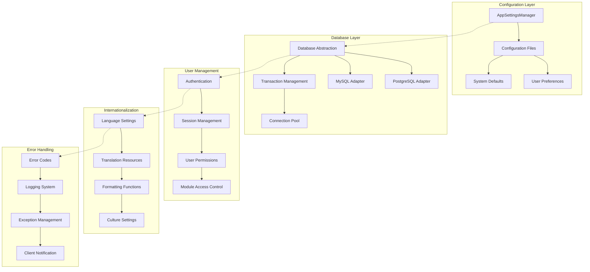
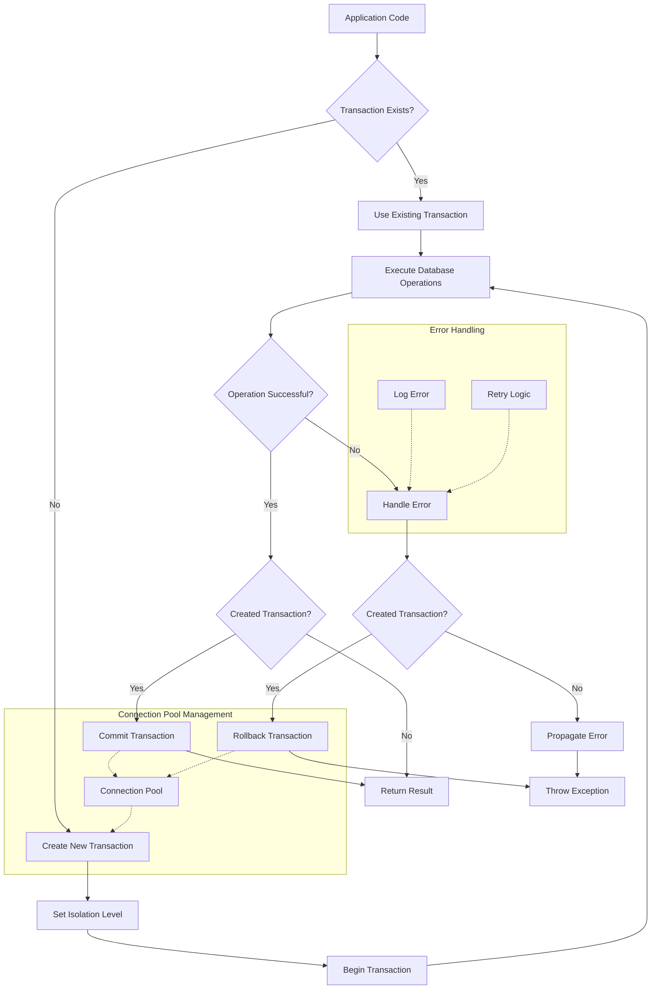
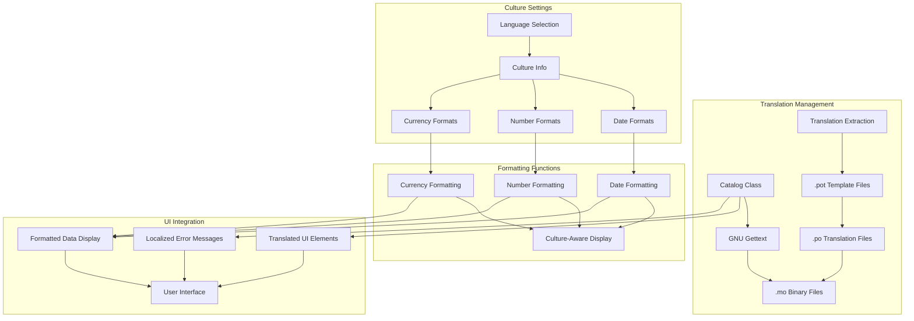
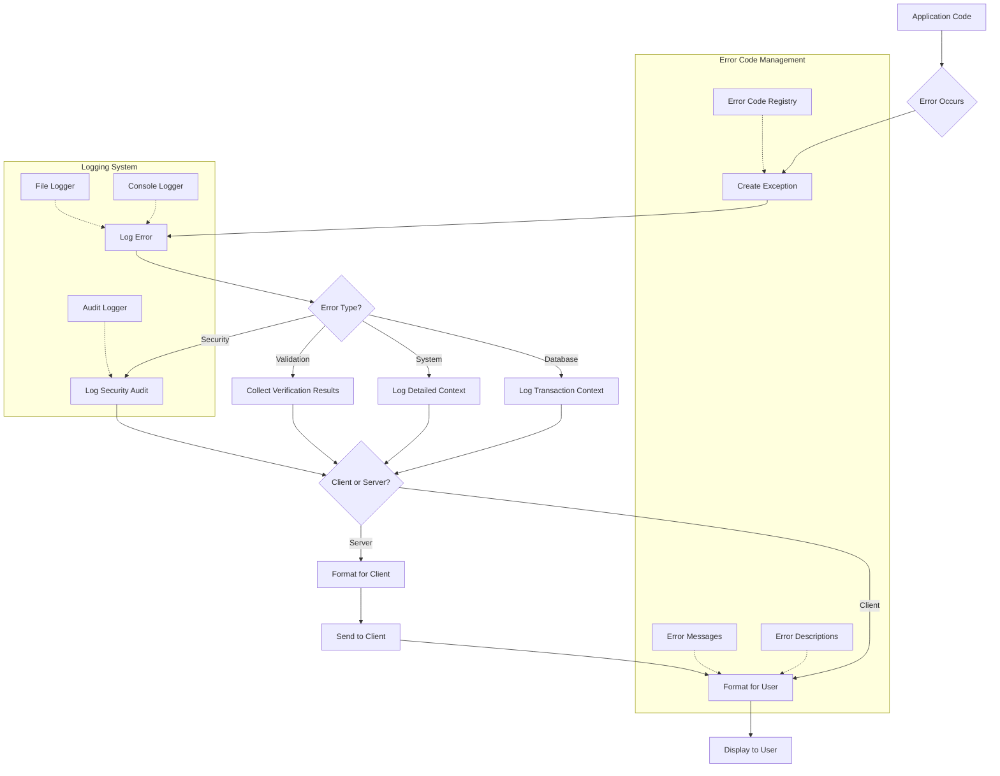

# System Management in OpenPetra: Settings and Configuration

## Overview of System Management in OpenPetra

OpenPetra is a comprehensive open-source software system designed to help non-profit organizations manage their administration efficiently. At its core, OpenPetra's system management architecture provides a robust foundation that enables the software to be highly configurable while maintaining stability and security. The system management components handle critical functions including configuration settings, database connections, user authentication, internationalization, and error handling.

OpenPetra's architecture follows a modular design that separates concerns between client and server components, with a strong emphasis on configurability. The system is designed to work across multiple platforms (Windows and Linux) and supports different database backends (PostgreSQL and MySQL). This flexibility is achieved through a sophisticated system management layer that abstracts platform-specific details and provides consistent interfaces for the application's business logic.

The system management components are fundamental to OpenPetra's ability to serve diverse non-profit organizations with varying needs, from small charities to international organizations with complex requirements for multi-currency operations, data privacy compliance, and internationalization.

## System Management Architecture

The architecture diagram illustrates the key components of OpenPetra's system management infrastructure. The configuration layer manages settings from various sources, feeding into the database layer which handles connections to different database systems. User management controls authentication and permissions, while internationalization enables multi-language support. The error handling system provides comprehensive logging and notification capabilities. These components work together to create a cohesive system management framework that supports the application's business functions.

## Configuration Management Framework

OpenPetra implements a sophisticated configuration management framework that handles settings from multiple sources in a hierarchical manner. At the core of this framework is the `TAppSettingsManager` class, which provides a centralized mechanism for accessing configuration values throughout the application. This class reads settings from various sources, including configuration files, command-line parameters, and environment variables, with a well-defined precedence order.

The configuration framework supports different types of settings:

1. **System-wide defaults**: These are hardcoded fallback values that ensure the application can function even with minimal configuration.
2. **Configuration files**: XML or JSON files that contain application settings, with separate files for server and client components.
3. **Command-line parameters**: Allow overriding configuration values during startup, particularly useful for testing and deployment scenarios.
4. **User preferences**: Settings that can be customized per user and are stored persistently.

The framework implements a caching mechanism to optimize access to frequently used settings, reducing the overhead of parsing configuration files repeatedly. It also provides type conversion utilities to retrieve settings as specific data types (strings, integers, booleans, etc.) with appropriate validation.

A key strength of OpenPetra's configuration management is its support for multi-tenant deployments, where different instances of the application can run with isolated configurations. This is achieved through instance-specific configuration files and environment variables that override default settings.

For developers, the configuration framework offers a clean API that abstracts the complexity of managing settings from multiple sources, allowing application code to simply request configuration values by key without needing to know where or how they are stored.

## Database Configuration and Management

OpenPetra's database layer provides a robust abstraction over different database management systems, currently supporting PostgreSQL and MySQL. This abstraction allows the application to work with either database system without changes to the business logic code. The database configuration and management components handle connection establishment, transaction management, query execution, and result processing.

The database layer is built around several key classes:

- `TDataBase`: The core class that provides database access methods and manages connections.
- `TDBTransaction`: Encapsulates database transactions with proper isolation levels and error handling.
- `IDataBaseRDBMS`: An interface implemented by database-specific adapters (PostgreSQL and MySQL).
- `DBAccess`: Provides simplified methods for common database operations.

Connection management is handled through connection pools that efficiently reuse database connections, reducing the overhead of establishing new connections for each operation. The system supports configurable connection parameters including server address, port, credentials, and connection timeouts.

Transaction management is particularly sophisticated, supporting different isolation levels (Read Committed, Serializable) based on the operation's requirements. The system includes automatic retry mechanisms for handling transaction conflicts in multi-user scenarios, and proper error handling to ensure data integrity even when errors occur.

The database layer also includes a caching mechanism (`TSQLCache`) that can store frequently accessed, relatively static data to reduce database load. This cache is automatically invalidated when relevant data changes, ensuring consistency between the cache and the database.

For database schema management, OpenPetra includes tools for creating database structures, upgrading schemas during version updates, and performing database maintenance operations like backup and restore. These operations can be performed through both command-line tools and administrative interfaces within the application.

## Database Transaction Flow

The diagram illustrates the flow of database transactions in OpenPetra. When application code needs to perform database operations, it first checks if a transaction already exists. If one does, it uses the existing transaction; otherwise, it creates a new one with the appropriate isolation level. After executing database operations, the system checks if they were successful. If so and the transaction was created by the current operation, it commits the transaction. If errors occur, the system handles them appropriately, rolling back the transaction if it was created by the current operation. Throughout this process, the connection pool manages database connections efficiently, and the error handling system provides logging and retry capabilities for certain types of errors.

## Internationalization and Localization

OpenPetra implements a comprehensive internationalization (i18n) and localization (l10n) system that enables the application to be used in multiple languages and adapt to different cultural conventions. The system is built around GNU Gettext for translation management, with additional components for handling culture-specific formatting and regional settings.

The internationalization framework consists of several key components:

1. **Translation Management**: The `Catalog` class provides methods for retrieving translated strings using GNU Gettext. It supports both simple string translations and plural forms based on language rules.

2. **Culture Settings**: The system manages culture-specific settings for date formats, number formats, and other regional preferences. These settings are applied both server-side and client-side to ensure consistent formatting.

3. **Resource Extraction**: Build tools automatically extract translatable strings from source code, YAML UI definitions, and other resources, generating template files (.pot) for translation.

4. **Translation Files**: Translated strings are stored in .po files (Portable Object) for each supported language, which are compiled into binary .mo files for efficient runtime access.

5. **Formatting Functions**: Specialized formatting functions handle culture-specific formatting of dates, numbers, and currencies, ensuring that data is presented according to the user's locale preferences.

The internationalization system is deeply integrated into OpenPetra's architecture. UI components automatically use translated strings, error messages are localized, and data formatting respects cultural conventions. This integration allows the application to provide a consistent user experience across different languages and regions.

OpenPetra currently supports multiple languages including English, German, and Norwegian, with the ability to add additional languages through translation files. The system also includes tools for managing translation workflows, including identifying untranslated strings and updating translation files when source strings change.

## Internationalization Components

The diagram illustrates the components of OpenPetra's internationalization system. The translation management section shows how strings are extracted from source code, translated, and compiled into binary files for runtime use. Culture settings determine how dates, numbers, and currencies should be formatted based on the user's locale. Formatting functions apply these settings to convert raw data into culturally appropriate display formats. Finally, the UI integration section shows how translations and formatted data come together in the user interface to provide a localized experience.

## User Management and Authentication

OpenPetra implements a comprehensive user management and authentication system that controls access to the application and its features. This system ensures that users can only access the functionality and data they are authorized to use, while maintaining audit trails of user actions.

The authentication process begins with user login, which can occur through various mechanisms:

1. **Traditional username/password authentication**: Users provide credentials that are verified against securely stored password hashes.
2. **Self-signup**: When enabled, allows users to create their own accounts with configurable approval workflows.
3. **Session management**: After successful authentication, the system creates and manages user sessions to maintain state across requests.

User management in OpenPetra is hierarchical, with several layers of access control:

- **User accounts**: Basic user information including credentials and personal details.
- **User groups**: Collections of users that share common permissions.
- **Module permissions**: Controls which functional modules users can access.
- **Table permissions**: Fine-grained control over which database tables users can view, modify, or delete.
- **Row-level security**: In some cases, access can be restricted to specific rows based on business rules.

The system includes administrative interfaces for managing users, groups, and permissions. These interfaces allow system administrators to create and modify user accounts, assign users to groups, and configure permissions at various levels.

Security features include password policy enforcement (complexity requirements, expiration), session timeout handling, and protection against common attacks like brute force attempts. The system also maintains audit logs of security-related events such as login attempts, permission changes, and sensitive data access.

For multi-tenant deployments, OpenPetra supports isolation between different organizations' data, ensuring that users from one organization cannot access data belonging to another organization. This is achieved through a combination of database schemas and application-level access controls.

## Error Handling and Logging

OpenPetra implements a sophisticated error handling and logging system that provides comprehensive monitoring, debugging, and user notification capabilities. This system ensures that errors are properly captured, logged, and communicated to users and administrators in appropriate ways.

The error handling architecture consists of several key components:

1. **Error Codes**: A centralized system of error codes with standardized formats (e.g., "GENC.00001V" for validation errors) that uniquely identify different error conditions. These codes include metadata such as severity, descriptions, and help text.

2. **Logging Framework**: The `TLogging` class provides methods for logging messages at different severity levels (Debug, Info, Warning, Error, Fatal). Logs can be directed to files, console output, or other destinations.

3. **Exception Hierarchy**: A structured hierarchy of exception classes tailored to different error scenarios, with base classes like `EOPException` for OpenPetra-specific exceptions and specialized subclasses for different subsystems.

4. **Verification Framework**: The `TVerificationResult` class and related components provide a structured way to collect and report validation errors, with support for different severity levels and contextual information.

5. **Client Notification**: Mechanisms to communicate errors to users through the user interface, with appropriate formatting and localization.

The system handles different types of errors in specialized ways:

- **Validation Errors**: Collected and presented to users to guide data correction.
- **System Errors**: Logged with detailed context for administrator troubleshooting.
- **Security Exceptions**: Logged with additional audit information for security monitoring.
- **Database Errors**: Include transaction context and SQL information for debugging.

Error handling across client-server boundaries is particularly sophisticated, with mechanisms to transmit error information between tiers while maintaining security (not exposing sensitive details) and providing appropriate user guidance.

## Error Handling Architecture

The diagram illustrates the flow of error handling in OpenPetra. When an error occurs in application code, an exception is created and logged. The system then processes the error based on its type (validation, system, security, or database), collecting appropriate context information. Depending on whether the error occurs on the server or client, it is formatted accordingly. Server-side errors are transmitted to the client, where they are formatted for user display. Throughout this process, the error code management system provides standardized error codes and messages, while the logging system records error details for troubleshooting and auditing.

## System Maintenance Tools

OpenPetra includes a comprehensive set of system maintenance tools that enable administrators to manage, monitor, and maintain the application. These tools cover database operations, system configuration, performance monitoring, and troubleshooting.

### Database Maintenance

The system provides several database maintenance capabilities:

1. **Backup and Restore**: Tools for creating database backups in various formats (SQL dumps, YAML.GZ files) and restoring from these backups. These operations can be performed through both command-line tools and administrative interfaces.

2. **Database Upgrade**: Mechanisms for safely upgrading the database schema during application updates, with support for version-specific migration scripts.

3. **Data Import/Export**: Utilities for importing and exporting data in various formats, supporting both full database transfers and selective data extraction.

4. **Database Verification**: Tools for checking database integrity, identifying inconsistencies, and repairing data issues.

### System Monitoring and Management

OpenPetra includes several tools for monitoring and managing the system:

1. **Server Management**: The server management interface provides capabilities for starting, stopping, and monitoring the OpenPetra server. It includes information about connected clients, memory usage, and server status.

2. **Log Analysis**: Tools for viewing, filtering, and analyzing log files to identify issues and monitor system activity.

3. **Performance Monitoring**: Utilities for tracking system performance metrics, identifying bottlenecks, and optimizing configuration.

4. **Cache Management**: Tools for viewing and managing cache contents, with options to clear caches when needed.

### Configuration Management

The system includes tools for managing configuration settings:

1. **Configuration Editor**: Interfaces for viewing and modifying configuration settings, with validation to prevent invalid configurations.

2. **Environment Information**: Tools for viewing information about the runtime environment, including operating system, .NET runtime, and installed components.

3. **Module Configuration**: Capabilities for enabling, disabling, and configuring specific application modules.

These maintenance tools are accessible through various interfaces, including command-line utilities, web-based administrative interfaces, and configuration files. They provide administrators with the capabilities needed to keep OpenPetra running smoothly and efficiently, while also supporting troubleshooting and recovery operations when issues arise.

## Web Interface Configuration

OpenPetra's web interface is built as a JavaScript client that communicates with the server through HTTP APIs. The configuration of this interface involves several components that control its behavior, appearance, and communication with the server.

### Client-Side Configuration

The JavaScript client's configuration includes several key aspects:

1. **Server Communication Settings**: Configuration for API endpoints, request timeouts, and error handling strategies. These settings determine how the client communicates with the server and handles various response scenarios.

2. **User Interface Configuration**: Settings that control the appearance and behavior of the user interface, including theme options, layout preferences, and feature toggles.

3. **Internationalization Settings**: Configuration for language selection, date/time formats, and number formatting based on locale preferences.

4. **Client-Side Caching**: Settings for caching behavior to optimize performance and reduce server load for frequently accessed data.

5. **Browser Compatibility**: Configuration to handle different browser capabilities and ensure consistent behavior across platforms.

The client configuration is typically loaded during application startup, with some settings coming from server-provided configuration and others from browser storage (for user preferences). The system supports dynamic reconfiguration for certain settings without requiring a page reload.

### Server-Side Web Configuration

On the server side, several components configure how the web interface is served and how it interacts with the backend:

1. **Web Server Configuration**: Settings for the web server (typically Nginx) that serves the client application, including URL routing rules, caching policies, and security headers.

2. **API Endpoint Configuration**: Configuration for the server-side API endpoints that the client communicates with, including authentication requirements, rate limiting, and response formatting.

3. **Session Management**: Settings for managing user sessions, including timeout periods, cookie configurations, and session storage options.

4. **Security Settings**: Configuration for security features such as CORS policies, CSP headers, and authentication mechanisms.

The web interface configuration is designed to be responsive, adapting to different screen sizes and device capabilities. This responsiveness is achieved through CSS media queries and JavaScript that adjusts the layout based on available screen space.

For deployment in different environments (development, testing, production), the configuration system supports environment-specific settings that can be applied without code changes. This allows the same codebase to be deployed across different environments with appropriate configuration for each context.

---

OpenPetra's system management framework provides a robust foundation for the application, handling critical functions like configuration, database access, user management, internationalization, and error handling. This comprehensive approach to system management enables OpenPetra to be flexible, maintainable, and adaptable to the diverse needs of non-profit organizations while maintaining security, performance, and reliability.

[Generated by the Sage AI expert workbench: 2025-03-30 02:22:57  https://sage-tech.ai/workbench]: #