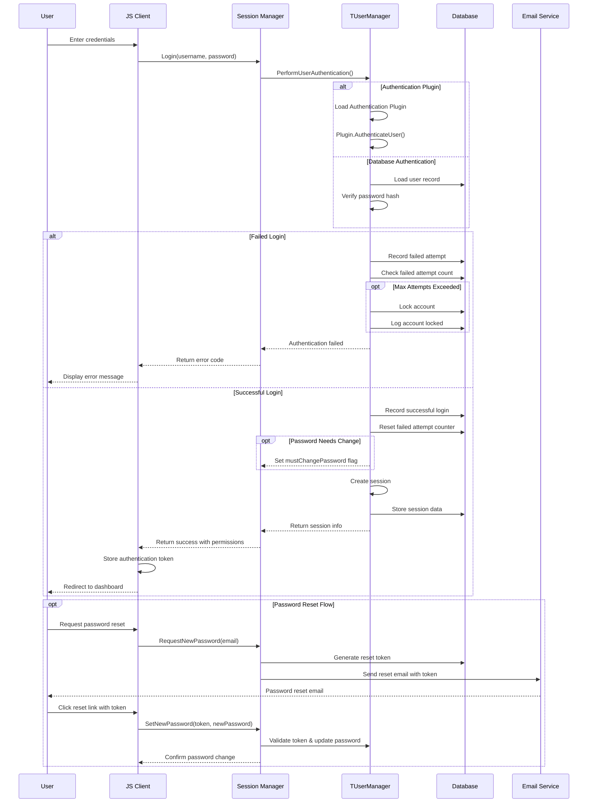
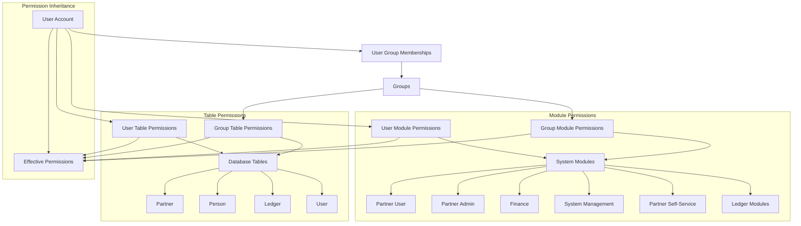
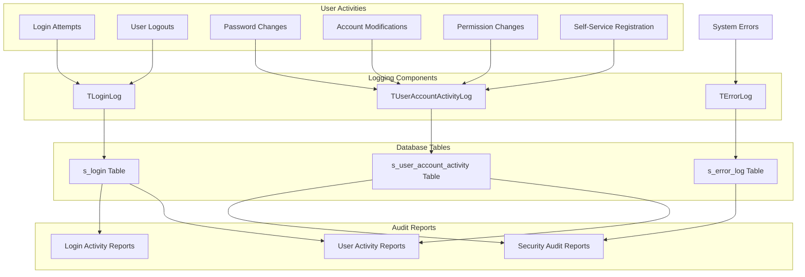

# User Management in OpenPetra

## User Management Overview

OpenPetra's user management system provides a comprehensive framework for handling user accounts, authentication, and authorization across the application. The system is designed with security as a primary concern, implementing multiple layers of protection including secure password hashing, account lockout mechanisms, and detailed activity logging.

The architecture follows a modular approach where user management functionality is distributed across several components:

1. **Authentication Layer**: Handles user login verification, password validation, and session management
2. **User Account Management**: Provides functionality for creating, modifying, and retiring user accounts
3. **Permission System**: Controls access to different modules and features based on user roles
4. **Self-Service Components**: Allows users to register accounts and manage their credentials
5. **Security Logging**: Tracks user activities for audit and security purposes

OpenPetra's user management system is particularly notable for its support of multiple authentication methods through a plugin architecture, allowing integration with external authentication systems while maintaining a consistent user experience. The system also implements progressive security improvements through its multi-version password hashing schemes, enabling seamless security upgrades without disrupting existing user accounts.

## User Authentication Flow

The authentication flow in OpenPetra begins when a user submits their credentials through the client interface. The credentials are sent to the SessionManager web service, which delegates authentication to the TUserManager component. This component can authenticate users either through the built-in database authentication or via a plugin system that supports external authentication providers.

During authentication, the system performs several security checks, including verifying the password hash, checking if the account is locked or retired, and tracking failed login attempts. If a user exceeds the maximum number of failed attempts, their account is automatically locked and the event is logged.

Upon successful authentication, the system creates a session, stores relevant user information, and returns the session details to the client. If the user's password needs to be changed (either because it's their first login or an administrator has reset it), a flag is set to prompt the user to update their password.

The system also supports a secure password reset flow where users can request a reset link via email. This link contains a secure token that allows them to set a new password without knowing their current one. All authentication activities are logged for security auditing purposes.

## Password Security Implementation

OpenPetra implements a sophisticated multi-version password hashing scheme that has evolved over time to maintain strong security standards while allowing for backward compatibility. The system currently supports four versions of password hashing schemes (V1-V4), with each new version introducing security improvements.

The password security implementation is centered around the Scrypt key stretching algorithm, which is designed to be computationally intensive and memory-hard, making it resistant to brute force attacks even with specialized hardware. This is implemented through the libsodium-net library, providing a well-tested and secure cryptographic foundation.

The evolution of OpenPetra's password hashing schemes shows a clear progression in security practices:

- **V1 Scheme**: The initial implementation used Scrypt with medium strength parameters but had a weakness in salt generation that reduced byte value representations from 256 to 128 when converting to ASCII. This scheme is now deprecated but still supported for backward compatibility.

- **V2 Scheme**: Improved upon V1 by fixing the salt generation issue and properly using Unicode encoding for passwords before hashing. This is currently the default scheme used by OpenPetra.

- **V3 Scheme**: Enhanced security by increasing the computational cost of password hashing through the use of the MediumSlow strength parameter in Scrypt, making brute force attacks more resource-intensive.

- **V4 Scheme**: The most secure implementation, using the Sensitive strength parameter in Scrypt for maximum protection against attacks.

A key feature of OpenPetra's password security is its automatic migration mechanism. When users authenticate with credentials stored using an older hashing scheme, the system transparently upgrades their password hash to the current scheme. This allows the system to improve security over time without requiring users to reset their passwords.

The implementation also includes protection against timing attacks by using constant-time comparison for password verification. This prevents attackers from inferring information about passwords based on the time taken to process authentication requests. For non-existent users, the system simulates the authentication process to ensure consistent response times regardless of whether a username exists in the system.

Password quality is enforced through regex-based validation that requires passwords to be at least 8 characters long and contain both letters and numbers. The system also generates secure random passwords with high entropy (>91 bits) when needed for initial account setup or password resets.

## User Account Lifecycle

The user account lifecycle in OpenPetra encompasses the complete journey from account creation through various states to eventual retirement. Each stage of this lifecycle is carefully managed with appropriate security controls and audit logging.

**Account Creation**
User accounts can be created through multiple pathways:
1. Administrator-initiated creation through the MaintainUsers interface
2. Self-service registration where users sign up themselves
3. System initialization where default accounts like SYSADMIN are created

During creation, accounts are assigned initial credentials, with administrator-created accounts typically receiving a system-generated secure password that must be changed on first login. Self-service accounts require email verification through a token-based confirmation process.

**Account Activation**
New accounts typically start in a state requiring password change. For administrator-created accounts, users receive an email with initial login instructions and a link to set their password. Self-service accounts require email verification before becoming active. The system enforces password quality requirements during this activation phase.

**Normal Operation**
During normal operation, users can authenticate to access the system based on their assigned permissions. The system tracks login activities, session information, and user actions for security purposes. Users can update their own passwords at any time, with changes being logged in the user account activity log.

**Password Management**
Password management is a critical aspect of the account lifecycle:
- Users can change their own passwords
- Administrators can reset passwords for users
- Password reset links can be requested via email
- Password history may be maintained to prevent reuse
- Password quality is enforced through validation rules

**Account Locking/Unlocking**
Accounts can become locked through:
- Exceeding the maximum number of failed login attempts
- Administrator action to temporarily disable access
- System security policies

Only administrators with appropriate permissions can unlock accounts. All locking and unlocking events are recorded in the security audit log.

**Account Retirement**
When users no longer need access to the system, their accounts can be retired rather than deleted. This preserves the historical record while preventing future logins. Retirement can be performed by administrators with appropriate permissions, and like other account status changes, is fully logged.

Throughout the entire lifecycle, comprehensive logging captures all significant events:
- Account creation
- Password changes and resets
- Failed login attempts
- Account locking/unlocking
- Permission changes
- Account retirement

This detailed audit trail provides accountability and supports security investigations when needed.

## User Permission Structure

OpenPetra implements a hierarchical permission system that controls user access to different parts of the application. This structure combines both role-based and resource-based access control mechanisms to provide fine-grained security management.

At the core of the permission system are two primary permission types:

1. **Module Permissions**: Control access to functional areas of the application (e.g., Partner Management, Finance, System Administration)
2. **Table Permissions**: Control access to specific database tables for data operations

Permissions can be assigned at two levels:

1. **Direct User Permissions**: Assigned specifically to individual user accounts
2. **Group Permissions**: Assigned to groups, which users can be members of

The system uses the s_user_module_access_permission and s_user_table_access_permission tables to store direct user permissions, while s_group_module_access_permission and s_group_table_access_permission tables store group-level permissions.

A user's effective permissions are calculated by combining their direct permissions with all permissions inherited from the groups they belong to. This allows administrators to efficiently manage permissions by assigning users to appropriate groups rather than configuring individual permissions for each user.

Special system users have predefined permission sets:

- **SYSADMIN**: Has access to all system management functions and can manage other users
- **SELFSERVICE**: A system account used for self-registration processes with limited permissions
- **DEMO**: In demo installations, has a predefined set of permissions for demonstration purposes

The permission structure supports the principle of least privilege by allowing administrators to grant users only the specific permissions they need for their roles. The MaintainUsers interface provides a visual representation of module permissions through checkboxes, making it easy to configure user access rights.

When users log in, their module permissions are loaded and stored in the session, allowing for efficient permission checking during their session without requiring repeated database queries. The TPetraPrincipal object encapsulates all permission information for the current user and provides methods to check if a user has access to specific modules or tables.

## Self-Service Registration

OpenPetra provides a self-service registration system that allows users to create their own accounts without administrator intervention. This feature streamlines the onboarding process while maintaining security through email verification and configurable approval workflows.

The self-signup functionality is implemented primarily through the TOpenPetraOrgSessionManager class in the server's web service layer, with supporting email templates for communication with users. The process can be enabled or disabled system-wide through configuration settings.

The self-registration process follows these steps:

1. **Registration Request**: Users provide their email address, first name, last name, and desired password through the signup form in the client interface.

2. **Initial Validation**: The system validates the provided information, ensuring the email address is properly formatted and the password meets security requirements (minimum length, complexity).

3. **Account Creation**: Upon successful validation, the system creates a preliminary user account in the database with a status that requires email verification. A unique confirmation token is generated and stored with the account.

4. **Email Verification**: The system sends an email to the provided address containing a verification link with the embedded token. This email uses the "selfservicesignup" template, which is available in multiple languages.

5. **Account Confirmation**: When the user clicks the verification link, the system validates the token against the stored value. If valid, the account is activated and a partner record is automatically created for the user.

6. **Partner Record Creation**: As part of the confirmation process, the system creates a partner record associated with the user account. This allows the user to be referenced within the partner management system.

7. **Welcome Communication**: Upon successful activation, the user receives a confirmation message and can immediately log in to the system.

The self-service registration system includes several security features:

- Email verification prevents unauthorized account creation using others' email addresses
- Tokens are cryptographically secure and time-limited
- Password quality is enforced during registration
- The system includes protection against automated registration attempts

Administrators can configure various aspects of the self-registration process:

- Enable or disable self-registration entirely
- Customize email templates for different languages
- Configure password complexity requirements
- Set token expiration timeframes

The self-signup functionality is particularly valuable for organizations that need to provide access to external partners or volunteers, reducing administrative overhead while maintaining security controls.

## Session Management

OpenPetra implements a robust session management system that maintains user state across requests while ensuring security and scalability. Unlike traditional ASP.NET session handling, OpenPetra uses a custom implementation that stores session data in the database, allowing for persistence across server restarts and supporting both web and desktop client scenarios.

The core of the session management system is the TSession class, which provides thread-safe access to session variables through a combination of thread-static variables and database persistence. This approach ensures that each web request operates with its own isolated session state, preventing cross-request contamination while maintaining session continuity for users.

Key aspects of OpenPetra's session management include:

**Session Initialization and Identification**
- Sessions are initialized per thread at the beginning of each request
- Session IDs are generated securely and stored in cookies for web clients
- The system can detect and recover existing sessions based on the session ID

**Session Data Storage**
- Session variables are stored in a thread-static SortedList for efficient in-memory access
- Session data is periodically persisted to the s_session database table
- Complex session data (like user permission objects) is serialized to JSON for storage

**Session Lifecycle Management**
- Sessions have a configurable validity period (default 24 hours)
- Inactive sessions are automatically expired and cleaned up
- The system includes mutex-based concurrency control to prevent deadlocks during parallel session operations

**User Authentication Integration**
- Upon successful authentication, user information is stored in the session
- The TPetraPrincipal object containing user permissions is serialized and stored in the session
- Session variables track whether users need to change their passwords

**Session Termination**
- Sessions can be explicitly terminated through user logout
- The system properly cleans up resources when sessions end
- Session termination events are logged for security auditing

**Security Considerations**
- Session IDs are cryptographically secure
- The system includes protection against session fixation attacks
- Session data is protected from cross-user access

The TConnectedClient class works alongside the session system to track client connections, maintaining information about connected users, their IP addresses, and connection types. This information is valuable for system monitoring and security auditing.

The session management system is designed to be resilient, with mechanisms to handle edge cases such as server restarts, network interruptions, and concurrent requests. It also includes special handling for demonstration users to ensure proper cleanup of their sessions.

## Security Audit System

OpenPetra implements a comprehensive security audit system that tracks user activities and system events to provide accountability and support security investigations. This system is designed to capture detailed information about user authentication, account management, and security-related events.

The security audit system is built around several specialized logging components:

**TLoginLog Component**
- Records all login attempts, both successful and failed
- Tracks user logouts and session terminations
- Stores information including user ID, timestamp, IP address, and client computer name
- Uses the s_login database table for persistent storage
- Defines specific login status types to categorize events:
  - LOGIN_SUCCESSFUL: Successful user authentication
  - LOGIN_ATTEMPT_PWD_WRONG: Failed login due to incorrect password
  - LOGIN_ATTEMPT_FOR_NONEXISTING_USER: Login attempt for non-existent user
  - LOGIN_ATTEMPT_FOR_LOCKED_USER: Login attempt for locked account
  - LOGIN_ATTEMPT_PWD_WRONG_ACCOUNT_GOT_LOCKED: Account locked due to excessive failed attempts

**TUserAccountActivityLog Component**
- Records user account management activities
- Tracks password changes, account status changes, and permission modifications
- Uses the s_user_account_activity table for storage
- Captures detailed information about each activity including:
  - User ID affected by the change
  - Type of activity (e.g., password change, account locking)
  - Timestamp of the activity
  - Details about the activity
- Defines specific activity types such as:
  - USER_RECORD_CREATED: New user account creation
  - PWD_CHANGE_BY_SYSADMIN: Password changed by administrator
  - PWD_CHANGE_BY_USER: Password changed by user
  - USER_ACCOUNT_GOT_LOCKED: Account locked
  - USER_ACCOUNT_GOT_UNLOCKED: Account unlocked
  - USER_CONFIRMED_SELF_SERVICE: Self-service registration confirmed

**Security Audit Features**
- All security events are timestamped with precise date and time
- User IDs are recorded for both the affected user and the user performing the action
- IP addresses and computer names are logged to trace the origin of activities
- Failed login attempts are counted to detect potential brute force attacks
- Account lockouts due to security policy violations are recorded
- Password changes and resets are tracked for security compliance

The security audit system is designed to be tamper-resistant, with logs stored in the database rather than in files that could be modified. The system also includes dual logging for critical events, with entries written both to the database and to the server log file for redundancy.

Administrators can access audit information through reports and queries, allowing them to investigate security incidents, monitor user activities, and demonstrate compliance with security policies. The comprehensive nature of the audit trail ensures that all significant security events are recorded and available for review when needed.

## Email Communication Templates

OpenPetra uses a template-based email communication system for user-related notifications. These templates support multiple languages and contain placeholders for dynamic content, enabling personalized communications for account management tasks. The system includes templates for welcome emails, password resets, and account confirmations.

The email templates are stored as plain text files in the `/inc/template/email/` directory, with naming conventions that indicate both the purpose and language of each template. For example, `welcomeemail_en.txt` is the English welcome email template, while `welcomeemail_de.txt` is the German version.

Key email templates in the system include:

**Welcome Emails (`welcomeemail_*.txt`)**
These templates are sent to new users when their accounts are created. They provide:
- A personalized greeting using the user's name
- Information about the OpenPetra instance they're accessing
- Details about their user accounts (both regular and admin accounts)
- Links to set initial passwords using secure tokens
- Instructions for password recovery
- Links to documentation and support resources

The welcome emails are particularly comprehensive, explaining that users typically have two accounts:
1. A SYSADMIN account for administrative tasks
2. A regular user account for everyday work

Each account has its own password reset link with a unique security token.

**Password Reset Templates (`requestnewpassword_*.txt`)**
These templates are sent when users request password resets. They include:
- User identification information
- A secure link with a reset token to set a new password
- Security notices for users who didn't request the reset
- Clear instructions on how to proceed

**New User Password Templates (`newuserpassword_*.txt`)**
These templates are used when administrators create new user accounts or reset passwords. They contain:
- The user's initial password in plaintext
- Instructions to change the password on first login
- Security disclaimers

**Self-Service Signup Templates (`selfservicesignup_*.txt`)**
These templates support the self-registration process with:
- Confirmation of the account request
- A verification link with a security token
- Security notices for recipients who didn't request an account

All templates use a simple placeholder system with curly braces (e.g., `{FirstName}`, `{Domain}`, `{Token}`) that get replaced with actual values when the email is generated. This approach allows for easy template maintenance and localization.

The multilingual support is implemented through separate template files for each language, with a suffix indicating the language code (e.g., `_en` for English, `_de` for German). This allows the system to select the appropriate template based on the user's preferred language setting.

The email communication system is an essential component of OpenPetra's user management, providing clear instructions and secure mechanisms for account setup and maintenance while supporting multiple languages for international deployments.

## Administrative User Management Interface

OpenPetra provides a comprehensive web-based interface for administrators to manage user accounts, implemented primarily through the MaintainUsers.html and MaintainUsers.js files. This interface offers a complete set of tools for creating, modifying, and managing user accounts and their associated permissions.

The administrative user management interface is designed with a clean, tabular layout that displays key user information at a glance. Users are listed with their user IDs, email addresses, account status (locked/retired), last login dates, and assigned permissions. This overview allows administrators to quickly assess the state of user accounts in the system.

Key features of the administrative interface include:

**User Creation**
Administrators can create new users through a modal dialog that collects essential information:
- User ID (unique identifier)
- First and last name
- Email address
- Language preference (with support for multiple languages)
- Initial account status (locked/retired)
- Module permissions

When creating new users, administrators have the option to send an automatic password reset link to the user's email address, allowing them to set their own initial password securely.

**User Editing**
The interface allows administrators to modify existing user accounts by:
- Updating personal information (name, email)
- Changing language preferences
- Modifying account status (locking/unlocking, retiring/unretiring)
- Adjusting module permissions

**Permission Management**
A key aspect of the interface is the permission management system, which displays available modules as a scrollable list of checkboxes. Administrators can quickly grant or revoke access to specific modules by checking or unchecking these boxes. The interface visually displays current permissions in the user list, showing which modules each user can access.

**Account Status Management**
The interface provides clear controls for managing account status:
- Locking accounts to temporarily prevent access
- Retiring accounts for users who no longer need access
- Viewing the last login date to identify inactive accounts

**Technical Implementation**
The interface is built using modern web technologies:
- Bootstrap for responsive layout and styling
- JavaScript for dynamic interactions
- AJAX for asynchronous communication with the server
- Template-based rendering for efficient DOM manipulation

The client-side code communicates with the server through API calls to endpoints like `TMaintenanceWebConnector_LoadUsersAndModulePermissions` and `TMaintenanceWebConnector_SaveUserAndModulePermissions`. These endpoints handle the database operations and security checks required for user management.

The interface includes several usability features:
- Collapsible rows for viewing additional user details
- Modal dialogs for focused editing
- Clear visual indicators of account status
- Internationalization support for multilingual deployments

Security is a primary concern in the administrative interface, with access restricted to users who have the SYSMAN module permission. All user management actions are logged in the security audit system, providing accountability and traceability for administrative actions.

The administrative user management interface exemplifies OpenPetra's approach to system administration: providing powerful tools with clear interfaces that enable efficient management while maintaining security and accountability.

[Generated by the Sage AI expert workbench: 2025-03-30 02:22:57  https://sage-tech.ai/workbench]: #