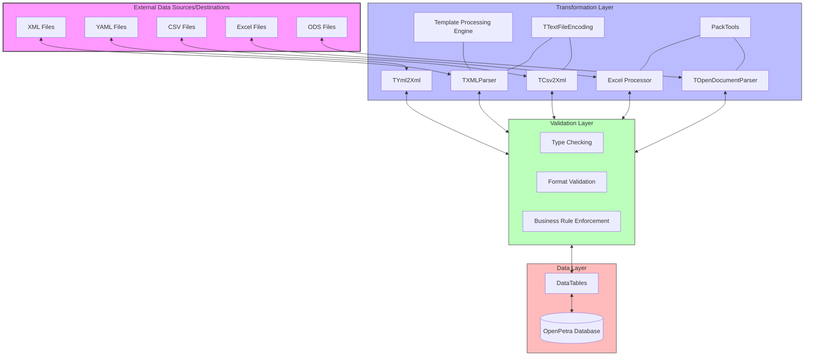
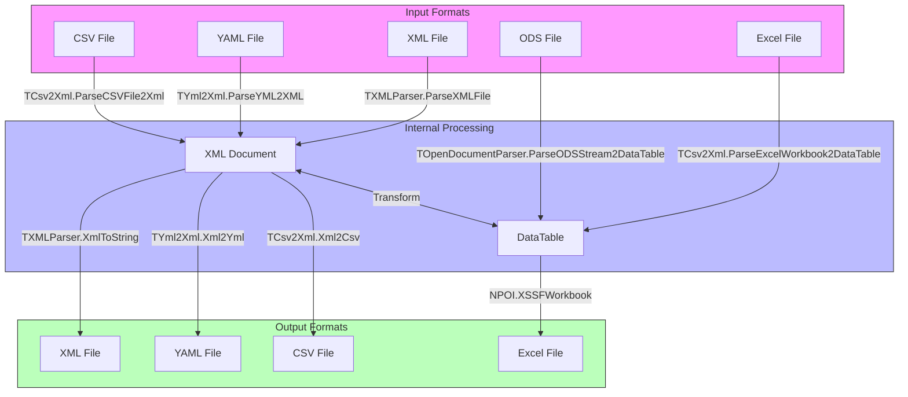
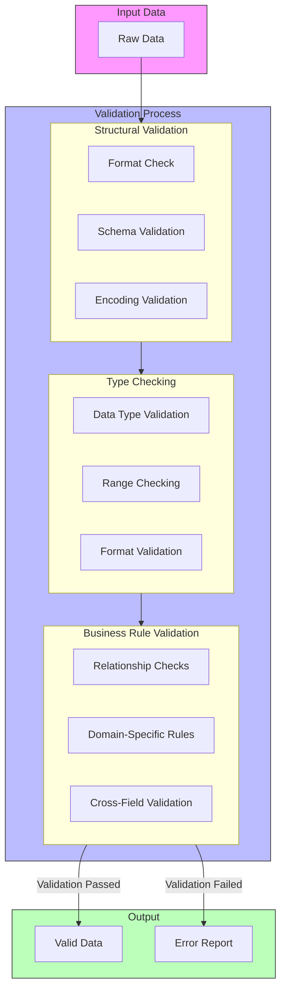

# Tools - Data Import-Export in OpenPetra

## Overview of Data Import-Export in OpenPetra

OpenPetra's data import-export capabilities form a critical foundation for non-profit organizations that need to exchange data between systems efficiently. The framework provides robust mechanisms for importing and exporting data in various formats, enabling seamless integration with external systems while maintaining data integrity throughout the transfer process. This functionality is particularly valuable for non-profit organizations that often need to exchange information with donors, partner organizations, financial institutions, and government agencies. OpenPetra's import-export tools handle complex transformations between different data representations, validate data according to business rules, and support internationalization requirements through comprehensive character encoding support. The system's architecture is designed to be extensible, allowing organizations to adapt to changing data exchange requirements while maintaining compatibility with existing systems.

## Supported File Formats

OpenPetra provides comprehensive support for multiple file formats to accommodate various data exchange scenarios. The system handles the following formats:

1. **XML (eXtensible Markup Language)**: OpenPetra implements robust XML parsing and generation capabilities, supporting hierarchical data structures with the `TXMLParser` class. The system can read, write, and transform XML documents, making it suitable for complex data exchange scenarios.

2. **YAML (YAML Ain't Markup Language)**: Through the `TYml2Xml` class, OpenPetra supports YAML format for configuration files and data exchange. The implementation handles special cases like backslash characters in path strings, which can be problematic in YAML parsing.

3. **CSV (Comma-Separated Values)**: The `TCsv2Xml` class provides functionality to import and export tabular data in CSV format, supporting standard CSV parsing rules with proper handling of delimiters, quotes, and escape characters.

4. **Excel (XLSX)**: OpenPetra uses the NPOI library to read and write Microsoft Excel files in the modern XLSX format. The system can extract data from specific worksheets, handle headers, and process various cell data types including text, numbers, dates, and boolean values.

5. **OpenDocument Spreadsheet (ODS)**: Through the `TOpenDocumentParser` class, OpenPetra supports reading data from OpenDocument spreadsheets, an open standard format used by LibreOffice and other office suites. The parser extracts data from the content.xml file within the ODS archive and converts it to DataTable structures.

Each format implementation includes validation mechanisms to ensure data integrity during the import and export processes, with appropriate error handling for malformed input files.

## Data Import-Export Architecture

The architecture diagram illustrates OpenPetra's import-export system, showing how data flows between external files and the application database. The system is organized into distinct layers:

1. **External Data Sources/Destinations**: These represent the various file formats supported by OpenPetra for data exchange.

2. **Transformation Layer**: This layer contains specialized components for each file format:
   - `TXMLParser` handles XML reading and writing
   - `TYml2Xml` converts between YAML and XML representations
   - `TCsv2Xml` processes CSV files and converts to/from XML
   - Excel Processor uses NPOI to handle Excel files
   - `TOpenDocumentParser` extracts data from ODS files
   - `TTextFileEncoding` manages character encoding across formats
   - `PackTools` provides compression/decompression functionality
   - Template Processing Engine handles template-based exports

3. **Validation Layer**: Before data reaches the application, it passes through validation to ensure integrity:
   - Type checking verifies data types match expected formats
   - Format validation ensures structural correctness
   - Business rule enforcement applies domain-specific constraints

4. **Data Layer**: The validated data is stored in DataTables as an intermediate representation before being persisted to the OpenPetra database.

This architecture provides flexibility for handling different formats while maintaining a consistent approach to validation and data processing. The separation of concerns allows for extending the system with new formats or validation rules without affecting existing functionality.

## Character Encoding Support

OpenPetra implements comprehensive character encoding support through the `TTextFileEncoding` class, ensuring proper handling of international data during import and export operations. This capability is crucial for non-profit organizations operating across multiple countries and languages. The system supports three main categories of character encodings:

1. **Unicode Encodings**: Full support for Unicode standards including UTF-8 (code page 65001), UTF-16 (code page 1200), UTF-16BE (code page 1201), UTF-32 (code page 12000), UTF-32BE (code page 12001), and UTF-7 (code page 65000). These encodings ensure proper representation of characters from virtually all writing systems worldwide.

2. **Single-byte ANSI Encodings**: Support for Windows code pages such as 1250 (Central European), 1251 (Cyrillic), 1252 (Western European), 1253 (Greek), 1254 (Turkish), and 1257 (Baltic). These encodings are important for compatibility with legacy systems and documents.

3. **Multi-byte Character Sets**: Support for East Asian writing systems through code pages like 949 (Korean), 932 (Japanese), and 950 (Chinese). These complex writing systems require multi-byte encodings to represent their extensive character sets.

The `TTextFileEncoding` class automatically detects and adds the user's default system encoding if it's not already included in the supported list, ensuring compatibility with the local environment. The class provides utility methods like `IsWindowsANSICodePage()` and `IsUnicodeCodePage()` to distinguish between encoding types, facilitating proper handling of text data during file operations.

This robust encoding support enables OpenPetra to correctly process data containing international characters during import and export operations, preventing character corruption issues that commonly plague data exchange between systems with different encoding assumptions.

## XML Processing Capabilities

OpenPetra's XML processing capabilities form a cornerstone of its data import-export functionality, providing robust mechanisms for handling structured data. The system implements comprehensive XML handling through several key components:

1. **XML Parsing**: The `TXMLParser` class provides methods for reading XML documents, navigating their structure, and extracting data. It includes functionality for finding nodes recursively, retrieving attribute values, and handling namespaces. This enables OpenPetra to process complex XML documents with deeply nested structures.

2. **XML Generation**: The system can create XML documents programmatically, setting attributes and building hierarchical structures. The `TXMLParser.XmlToString()` method serializes XML documents to string representations with proper formatting, while `XmlToString2()` provides alternative formatting options.

3. **XML Transformation**: OpenPetra implements bidirectional transformation between XML and other formats. The `TYml2Xml` class converts between YAML and XML representations, while `TCsv2Xml` handles conversion between CSV and XML formats. These transformations preserve the semantic structure of the data while adapting to the syntactic requirements of each format.

4. **XML as Intermediate Format**: XML serves as an intermediate representation in many import-export operations. For example, when importing from CSV or YAML, the data is first converted to an XML structure before further processing. This approach provides a consistent internal representation regardless of the source format.

5. **Attribute Handling**: The system includes specialized handling for XML attributes, with methods like `TXMLParser.GetAttribute()` and `TXMLParser.SetAttribute()` that abstract away the details of attribute manipulation. This is particularly important for formats like YAML that don't have a direct equivalent to XML attributes.

6. **Node Navigation**: Methods like `TXMLParser.GetChild()` and `TXMLParser.FindNodeRecursive()` facilitate navigation through XML document structures, making it easier to locate and extract specific data elements.

These capabilities enable OpenPetra to handle complex data structures and hierarchical information during import and export operations, providing a flexible foundation for data exchange with external systems.

## File Format Conversion Flow

The diagram illustrates the conversion processes between different file formats in OpenPetra's import-export system. The flow shows how data is transformed during import and export operations:

1. **Input Processing**:
   - XML files are parsed directly into XML Document objects using `TXMLParser.ParseXMLFile`
   - YAML files are converted to XML Document objects using `TYml2Xml.ParseYML2XML`
   - CSV files are transformed into XML Document objects using `TCsv2Xml.ParseCSVFile2Xml`
   - Excel files are converted to DataTable objects using `TCsv2Xml.ParseExcelWorkbook2DataTable`
   - ODS files are processed into DataTable objects using `TOpenDocumentParser.ParseODSStream2DataTable`

2. **Internal Representation**:
   - The system uses two primary internal representations: XML Document and DataTable
   - These representations can be transformed between each other as needed
   - XML Document is preferred for hierarchical data
   - DataTable is preferred for tabular data

3. **Output Generation**:
   - XML files are generated from XML Document objects using `TXMLParser.XmlToString`
   - YAML files are created from XML Document objects using `TYml2Xml.Xml2Yml`
   - CSV files are produced from XML Document objects using `TCsv2Xml.Xml2Csv`
   - Excel files are generated from DataTable objects using NPOI's XSSFWorkbook

This architecture provides flexibility in handling different formats while maintaining a consistent approach to data transformation. The use of intermediate representations (XML Document and DataTable) simplifies the addition of new formats, as only conversion to/from these intermediate formats needs to be implemented rather than direct conversions between each pair of formats.

## Spreadsheet Data Extraction

OpenPetra implements sophisticated mechanisms for extracting data from Excel (XLSX) and OpenDocument (ODS) spreadsheets, providing comprehensive support for importing tabular data from these widely used formats. The extraction process handles various aspects of spreadsheet structure and content:

1. **Worksheet Handling**: Both Excel and ODS parsers support multiple worksheets within a single file. The `TCsv2Xml.ParseExcelWorkbook2DataTable` and `TOpenDocumentParser.ParseODSStream2DataTable` methods accept a worksheet index parameter, allowing users to specify which sheet to import. This is essential for processing complex workbooks with multiple data sets.

2. **Header Row Processing**: The parsers can interpret the first row of a spreadsheet as column headers, using these values as field names in the resulting DataTable. This is controlled by the `AHasHeader` parameter, which when set to true, uses the first row values as column names instead of generating generic names like "Column 0", "Column 1", etc.

3. **Data Type Recognition**: The extraction process identifies and preserves the data types of spreadsheet cells:
   - For Excel files, the NPOI library provides cell type information (string, numeric, boolean, date)
   - For ODS files, the parser reads the `office:value-type` attribute (string, float, date, boolean) and processes accordingly
   - Type conversion is handled to ensure data is correctly represented in the resulting DataTable

4. **Cell Formatting**: The parsers handle various cell formatting scenarios:
   - Empty cells are properly recognized and represented as null values
   - Merged cells are processed according to their visible content
   - For ODS files, repeated columns (specified by `table:number-columns-repeated` attribute) are expanded appropriately

5. **Column Filtering**: Both parsers support selective column import through the `AColumnsToImport` parameter, which allows specifying a list of column names to include in the result. This enables efficient processing of large spreadsheets when only certain columns are needed.

6. **Structural Navigation**: The parsers navigate through the internal structure of the spreadsheet files:
   - Excel files are processed using NPOI's object model (Workbook, Sheet, Row, Cell)
   - ODS files are handled by extracting and parsing the content.xml file from the ODS archive using SharpZipLib

This comprehensive approach to spreadsheet data extraction enables OpenPetra to reliably import data from various sources while preserving data types, structure, and relationships, making it a powerful tool for data integration in non-profit organizations.

## Template Processing Engine

OpenPetra's template processing engine, implemented through the `ProcessTemplate` class, provides a powerful mechanism for generating dynamic content during data export operations. This engine supports conditional logic, variable substitution, and structured content generation, enabling the creation of sophisticated export templates that can adapt to different data contexts and requirements.

The template engine processes templates containing special directives enclosed in curly braces with hash symbols (`{#DIRECTIVE}`), which control the inclusion or exclusion of content based on runtime conditions. Key capabilities include:

1. **Conditional Logic**: The engine supports several conditional directives:
   - `{#IFDEF VARIABLE}...{#ENDIF VARIABLE}`: Includes content only if the specified variable is defined
   - `{#IFNDEF VARIABLE}...{#ENDIFN VARIABLE}`: Includes content only if the specified variable is not defined
   - Compound conditions using logical operators: `{#IFDEF VAR1 OR VAR2}` and `{#IFDEF VAR1 AND VAR2}`

2. **Variable Substitution**: Templates can include placeholders that are replaced with actual values during processing. The `SetCodelet` method associates variables with values, which are then substituted when the template is rendered.

3. **Nested Conditions**: The engine supports nested conditional blocks, allowing for complex decision trees within templates. This enables the creation of highly customized output based on multiple conditions.

4. **Template Composition**: Multiple template fragments can be combined to create complete documents, with each fragment potentially having its own conditional logic and variable substitutions.

5. **Whitespace Handling**: The engine preserves formatting and whitespace in the template, ensuring that the generated output maintains the intended structure and readability.

The template processing engine is particularly valuable for generating reports, export files, and documents that need to adapt to different contexts or user preferences. For example, it can be used to create financial reports with sections that appear only for certain types of organizations, or donor communications that include different content based on the donor's relationship with the organization.

## Data Validation Process

The diagram illustrates OpenPetra's comprehensive data validation process applied during import and export operations. This multi-layered approach ensures data integrity and compliance with both technical and business requirements:

1. **Structural Validation**:
   - **Format Check**: Verifies that the input file adheres to the expected format (XML, YAML, CSV, Excel, ODS)
   - **Schema Validation**: For structured formats like XML, validates against defined schemas or expected structures
   - **Encoding Validation**: Uses `TTextFileEncoding` to verify and handle character encoding issues, ensuring proper interpretation of international characters

2. **Type Checking**:
   - **Data Type Validation**: Ensures values match their expected types (string, number, date, boolean)
   - **Range Checking**: Verifies numeric values fall within acceptable ranges
   - **Format Validation**: Checks that strings conform to expected patterns (e.g., email addresses, phone numbers)

3. **Business Rule Validation**:
   - **Relationship Checks**: Validates relationships between different data elements
   - **Domain-Specific Rules**: Applies rules specific to the non-profit domain (e.g., donation amounts must be positive)
   - **Cross-Field Validation**: Ensures consistency between related fields

The validation process is progressive, with each stage building on the previous one. If validation fails at any stage, detailed error information is collected and reported to the user, allowing for correction of the input data. Only data that passes all validation stages is processed further and committed to the system.

This rigorous validation approach prevents data corruption, ensures consistency, and maintains the integrity of OpenPetra's database, which is crucial for non-profit organizations that rely on accurate data for financial reporting, donor management, and regulatory compliance.

## Compression and File Handling

OpenPetra implements robust compression and file handling capabilities that enhance data storage efficiency and transfer performance. These features are particularly important for handling large datasets and complex file formats like Excel and OpenDocument spreadsheets, which are internally zip archives containing XML and other resources.

Key compression and file handling capabilities include:

1. **String Compression**: The `PackTools.ZipString()` and `PackTools.UnzipString()` methods provide efficient compression and decompression of string data. This is particularly useful for storing large text blocks in the database or transmitting them over the network with reduced bandwidth requirements. The implementation ensures that compressed strings can be reliably decompressed without data loss.

2. **Excel File Handling**: OpenPetra uses the NPOI library to create and manipulate Excel files in the XLSX format. The system handles the complexities of the Office Open XML format, including:
   - Creating workbooks and worksheets
   - Populating cells with various data types
   - Applying formatting to cells and ranges
   - Reading data from existing Excel files

3. **ZIP Operations**: The `PackTools` class provides methods for working with ZIP archives, which is essential for handling modern document formats:
   - The `Unzip()` method extracts contents from ZIP archives to a specified directory
   - This functionality is used to extract content.xml from ODS files and various XML files from XLSX files

4. **OpenDocument Processing**: For ODS files, OpenPetra uses SharpZipLib to extract the content.xml file from the archive, which is then parsed to extract spreadsheet data. This approach allows for efficient processing of OpenDocument spreadsheets without loading the entire file into memory.

5. **Stream Handling**: The system works with various stream types (FileStream, MemoryStream) to efficiently process data without unnecessary copying. For example, the `TOpenDocumentParser.ParseODSStream2DataTable()` method accepts a MemoryStream parameter, allowing for processing of data that may come from different sources.

6. **Temporary File Management**: When processing large files, OpenPetra creates temporary files and directories as needed, ensuring they are properly cleaned up after use to prevent filesystem clutter.

These compression and file handling capabilities enable OpenPetra to efficiently process large datasets and complex file formats, providing a robust foundation for data import and export operations in non-profit organizations of all sizes.

## Testing and Quality Assurance

OpenPetra implements a comprehensive testing framework for its data import-export functionality, ensuring reliability and correctness across all supported formats and encoding types. The testing approach combines unit tests, integration tests, and validation of real-world scenarios to provide confidence in the system's ability to handle diverse data exchange requirements.

The `TTestCommonIO` class exemplifies this testing approach with a suite of tests that cover various aspects of the import-export functionality:

1. **Format-Specific Testing**: Each supported file format has dedicated test methods that verify both import and export capabilities:
   - `TestXmlWriter` and `TestYMLParser` validate XML handling
   - `TestYmlWriter` and `TestReadAndWriteYaml` verify YAML processing
   - `TestCSVWriter` and `TestCSVParser` test CSV functionality
   - `TestExcelExportFile` and `TestExcelImportStream` check Excel operations
   - `TestODSImportStream` validates OpenDocument spreadsheet handling

2. **Round-Trip Testing**: Several tests verify that data can be exported to a file and then imported back with the same content, ensuring data fidelity through the import-export cycle. This approach is used for XML, YAML, and CSV formats.

3. **Edge Case Handling**: Tests include scenarios that verify proper handling of edge cases:
   - `TestYMLBackSlashValue` specifically tests YAML processing with backslash characters in path strings
   - `TestCompressingString` verifies that string compression and decompression preserve data integrity

4. **Template Processing Validation**: The `TestTemplateEngine` method includes extensive testing of the template processing engine, verifying various conditional logic scenarios including nested conditions and logical operators (AND, OR).

5. **File Comparison**: The tests use `TTextFile.SameContent()` to verify that generated files match expected reference files, ensuring consistent output across different environments and code changes.

6. **Internationalization Testing**: Tests verify proper handling of different character encodings and international characters, ensuring the system can process data from various regions and languages.

7. **Cleanup Operations**: Test methods include proper cleanup of temporary files and resources, preventing test pollution and ensuring reliable test results across multiple runs.

This comprehensive testing approach ensures that OpenPetra's data import-export functionality remains reliable and consistent, providing non-profit organizations with a dependable foundation for their data exchange needs. The tests serve both as verification of current functionality and as regression tests to prevent future code changes from inadvertently breaking existing capabilities.

[Generated by the Sage AI expert workbench: 2025-03-30 02:22:57  https://sage-tech.ai/workbench]: #