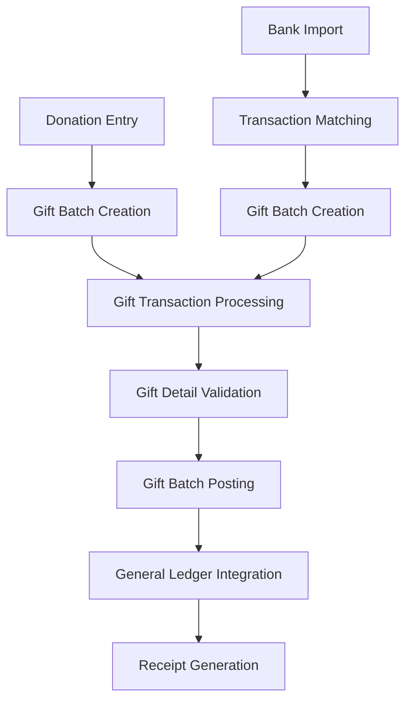

# Stripe Integration with OpenPetra Gift Processing
## Architecture Analysis & Implementation Strategy

## **Executive Summary**

Based on my analysis of OpenPetra's MFinance module, there are multiple viable approaches to integrate Stripe donations into the existing gift processing system. The architecture is well-designed with clear separation of concerns and multiple integration points that can accommodate external payment systems.

## **Current Architecture Analysis**

### **Gift Processing Flow**


### **Key Integration Points Identified**

1. **TGiftTransactionWebConnector** - Core gift processing
2. **TBankImportWebConnector** - Bank statement import and matching
3. **Gift Import System** - CSV/ESR payment import
4. **Banking Integration** - SEPA and payment processing

## **Stripe Integration Strategies**

### **Strategy 1: Bank Import Extension (Recommended)**

**Concept**: Treat Stripe as a "virtual bank" that provides transaction statements through their API.

**Implementation Points**:
- Extend `TBankImportWebConnector` with Stripe-specific import methods
- Create `ImportFromStripe.cs` following the pattern of `ImportFromCAMT.cs`
- Leverage existing transaction matching algorithms
- Reuse gift batch creation workflow

**Code Integration**:
```csharp
// New file: ImportFromStripe.cs
public class TBankStatementImportStripe
{
    public static bool ImportFromStripeAPI(
        int ALedgerNumber, 
        string AStripeAccountId,
        DateTime AFromDate,
        DateTime AToDate,
        out BankImportTDS AImportDS)
    {
        // Use Stripe API to fetch payment intents, charges, payouts
        // Convert to BankImportTDS format
        // Leverage existing matching and processing
    }
}

// Extension to TBankImportWebConnector.cs
[RequireModulePermission("FINANCE-1")]
public static bool ImportFromStripeAPI(
    Int32 ALedgerNumber,
    string AStripeAccountId, 
    DateTime AFromDate,
    DateTime AToDate)
{
    return TBankStatementImportStripe.ImportFromStripeAPI(
        ALedgerNumber, AStripeAccountId, AFromDate, AToDate, out BankImportTDS importDS);
}
```

**Benefits**:
- ✅ Leverages existing, battle-tested gift processing workflow
- ✅ Automatic donor matching through existing algorithms
- ✅ Standard validation and posting procedures
- ✅ Fits naturally into current bank reconciliation processes
- ✅ Minimal disruption to existing codebase

### **Strategy 2: Direct Gift API Integration**

**Concept**: Create new API endpoints that directly receive Stripe webhook notifications and immediately create gift transactions.

**Implementation Points**:
- Create new webhook endpoint controller
- Direct integration with `TGiftTransactionWebConnector.CreateAGiftBatch()`
- Real-time gift processing
- Immediate donor receipting

**Code Integration**:
```csharp
// New file: StripeWebhookConnector.cs
public class TStripeWebhookWebConnector
{
    [RequireModulePermission("FINANCE-1")]
    public static bool ProcessStripePayment(
        string AStripePaymentIntentId,
        decimal AAmount,
        string ACurrency,
        string ACustomerEmail,
        string ADescription,
        DateTime APaymentDate)
    {
        // Create gift batch directly
        var giftBatch = TGiftTransactionWebConnector.CreateAGiftBatch(ledgerNumber);
        
        // Resolve donor from email or create new
        var donorKey = ResolveDonorByEmail(ACustomerEmail);
        
        // Create gift transaction
        // Post immediately or queue for batch posting
    }
}

// Webhook endpoint (in web layer)
[HttpPost]
[Route("api/stripe/webhook")]
public IActionResult StripeWebhook([FromBody] StripeEvent stripeEvent)
{
    // Verify webhook signature
    // Process payment_intent.succeeded events
    // Call TStripeWebhookWebConnector.ProcessStripePayment()
}
```

**Benefits**:
- ✅ Real-time processing
- ✅ Immediate donor feedback
- ✅ Lower latency for receipting
- ❌ More complex error handling
- ❌ Requires additional security considerations

### **Strategy 3: Hybrid Approach (Most Flexible)**

**Concept**: Combine both approaches for maximum flexibility and reliability.

**Implementation**:
- Real-time webhook processing for immediate donor feedback
- Daily/periodic Stripe import for reconciliation and error recovery
- Duplicate detection between both systems

## **Detailed Implementation Plan**

### **Phase 1: Core Integration (Strategy 1 - Recommended)**

#### **1.1 Stripe Data Mapping**
Map Stripe payment data to OpenPetra's gift structure:

```csharp
// Stripe Payment Intent → OpenPetra Gift Detail
public class StripePaymentMapper
{
    public static AGiftDetailRow MapStripePayment(
        PaymentIntent stripePayment, 
        AGiftRow gift)
    {
        var detail = new AGiftDetailRow();
        detail.LedgerNumber = gift.LedgerNumber;
        detail.BatchNumber = gift.BatchNumber;
        detail.GiftTransactionNumber = gift.GiftTransactionNumber;
        detail.DetailNumber = ++gift.LastDetailNumber;
        
        // Map amounts
        detail.GiftTransactionAmount = (decimal)stripePayment.Amount / 100; // Stripe uses cents
        detail.GiftAmount = CalculateBaseAmount(detail.GiftTransactionAmount, exchangeRate);
        detail.GiftAmountIntl = CalculateIntlAmount(detail.GiftAmount);
        
        // Map donor information
        detail.DonorKey = ResolveDonorFromStripeCustomer(stripePayment.Customer);
        
        // Map recipient and motivation
        detail.RecipientKey = DetermineRecipientFromMetadata(stripePayment.Metadata);
        detail.MotivationGroupCode = DetermineMotivationGroup(stripePayment.Metadata);
        detail.MotivationDetailCode = DetermineMotivationDetail(stripePayment.Metadata);
        
        // Handle tax deductibility
        if (IsTaxDeductibleGift(stripePayment.Metadata))
        {
            TGift.SetDefaultTaxDeductibilityData(ref detail, gift.DateEntered, transaction);
        }
        
        return detail;
    }
}
```

#### **1.2 Stripe API Integration**
```csharp
public class StripeAPIClient
{
    private readonly StripeClient _stripeClient;
    
    public async Task<List<PaymentIntent>> GetPaymentIntents(
        DateTime fromDate, 
        DateTime toDate, 
        string accountId = null)
    {
        var options = new PaymentIntentListOptions
        {
            Created = new DateRangeOptions
            {
                GreaterThanOrEqual = fromDate,
                LessThanOrEqual = toDate
            },
            Limit = 100
        };
        
        var service = new PaymentIntentService(_stripeClient);
        var payments = await service.ListAsync(options);
        
        return payments.Data.Where(p => p.Status == "succeeded").ToList();
    }
    
    public async Task<List<Charge>> GetCharges(DateTime fromDate, DateTime toDate)
    {
        // Similar implementation for charges
    }
    
    public async Task<List<Payout>> GetPayouts(DateTime fromDate, DateTime toDate)
    {
        // For reconciliation with bank statements
    }
}
```

#### **1.3 Integration with Bank Import System**
```csharp
// Extension to existing TBankImportWebConnector
public static class TBankImportWebConnectorExtensions
{
    [RequireModulePermission("FINANCE-1")]
    public static bool ImportFromStripeAPI(
        Int32 ALedgerNumber,
        string AStripeAccountId,
        DateTime AFromDate, 
        DateTime AToDate,
        out TVerificationResultCollection AVerificationResult)
    {
        AVerificationResult = new TVerificationResultCollection();
        
        try
        {
            var stripeClient = new StripeAPIClient();
            var payments = await stripeClient.GetPaymentIntents(AFromDate, AToDate, AStripeAccountId);
            
            var importDS = new BankImportTDS();
            
            // Create statement record
            var statement = CreateStripeStatement(ALedgerNumber, AFromDate, AToDate);
            importDS.AEpStatement.Rows.Add(statement);
            
            // Convert payments to transactions
            foreach (var payment in payments)
            {
                var transaction = MapPaymentToTransaction(payment, statement);
                importDS.AEpTransaction.Rows.Add(transaction);
            }
            
            // Use existing import logic
            return TBankStatementImport.StoreNewBankStatement(importDS) > 0;
        }
        catch (Exception ex)
        {
            AVerificationResult.Add(new TVerificationResult(
                "Stripe Import",
                "Error importing from Stripe: " + ex.Message,
                TResultSeverity.Resv_Critical));
            return false;
        }
    }
}
```

### **Phase 2: Webhook Integration (Real-time Processing)**

#### **2.1 Webhook Security**
```csharp
public class StripeWebhookValidator
{
    public static bool ValidateWebhook(string payload, string signature, string secret)
    {
        try
        {
            StripeEventUtility.ValidateSignature(payload, signature, secret);
            return true;
        }
        catch (StripeException)
        {
            return false;
        }
    }
}
```

#### **2.2 Webhook Processing**
```csharp
[ApiController]
[Route("api/stripe")]
public class StripeWebhookController : ControllerBase
{
    [HttpPost("webhook")]
    public async Task<IActionResult> HandleWebhook()
    {
        var payload = await new StreamReader(Request.Body).ReadToEndAsync();
        var signature = Request.Headers["Stripe-Signature"];
        
        if (!StripeWebhookValidator.ValidateWebhook(payload, signature, webhookSecret))
        {
            return BadRequest("Invalid signature");
        }
        
        var stripeEvent = EventUtility.ParseEvent(payload);
        
        switch (stripeEvent.Type)
        {
            case Events.PaymentIntentSucceeded:
                var paymentIntent = stripeEvent.Data.Object as PaymentIntent;
                await ProcessPaymentSuccess(paymentIntent);
                break;
                
            case Events.ChargeDispute:
                var dispute = stripeEvent.Data.Object as Dispute;
                await ProcessDispute(dispute);
                break;
        }
        
        return Ok();
    }
    
    private async Task ProcessPaymentSuccess(PaymentIntent payment)
    {
        try
        {
            // Queue for processing or process immediately
            await TStripeWebhookWebConnector.ProcessStripePayment(
                payment.Id,
                (decimal)payment.Amount / 100,
                payment.Currency,
                payment.Customer?.Email ?? payment.Metadata["email"],
                payment.Description,
                DateTime.UtcNow);
        }
        catch (Exception ex)
        {
            // Log error and potentially retry
            TLogging.LogException(ex, "Stripe webhook processing");
        }
    }
}
```

### **Phase 3: Enhanced Features**

#### **3.1 Donor Identification**
```csharp
public class StripeDonorMatcher
{
    public static long ResolveDonorByEmail(string email, int ledgerNumber)
    {
        // Try to find existing donor by email
        var existingDonor = FindDonorByEmail(email);
        if (existingDonor != null)
            return existingDonor.PartnerKey;
        
        // Create new donor if configured to do so
        if (AutoCreateDonorsEnabled())
        {
            return CreateNewDonorFromEmail(email);
        }
        
        // Return default unknown donor key
        return GetUnknownDonorKey(ledgerNumber);
    }
    
    public static long ResolveDonorByStripeCustomer(string customerId)
    {
        // Enhanced matching using Stripe customer data
        var customer = stripeCustomerService.Get(customerId);
        
        // Try multiple matching strategies:
        // 1. Email address
        // 2. Phone number
        // 3. Name + address combination
        // 4. Custom metadata fields
        
        return MatchDonorByMultipleCriteria(customer);
    }
}
```

#### **3.2 Motivation and Project Mapping**
```csharp
public class StripeMotivationMapper
{
    public static (string GroupCode, string DetailCode) DetermineMotivation(
        PaymentIntent payment)
    {
        // Check metadata for specific project/fund designation
        if (payment.Metadata.ContainsKey("project_id"))
        {
            return MapProjectToMotivation(payment.Metadata["project_id"]);
        }
        
        // Check for campaign codes
        if (payment.Metadata.ContainsKey("campaign"))
        {
            return MapCampaignToMotivation(payment.Metadata["campaign"]);
        }
        
        // Default motivation
        return ("GIFT", "SUPPORT");
    }
    
    public static long DetermineRecipient(PaymentIntent payment)
    {
        // Similar logic for recipient determination
        // Could be based on:
        // - Metadata fields
        // - Product/price IDs
        // - Campaign attribution
        // - Default recipient
    }
}
```

#### **3.3 Reconciliation Tools**
```csharp
public class StripeReconciliation
{
    public static ReconciliationReport CompareStripeToGifts(
        DateTime fromDate,
        DateTime toDate,
        int ledgerNumber)
    {
        // Get Stripe payments
        var stripePayments = GetStripePayments(fromDate, toDate);
        
        // Get corresponding gifts
        var gifts = GetGiftsForPeriod(fromDate, toDate, ledgerNumber);
        
        // Compare and identify discrepancies
        var report = new ReconciliationReport();
        
        // Missing in OpenPetra but in Stripe
        report.MissingGifts = FindMissingGifts(stripePayments, gifts);
        
        // In OpenPetra but not in Stripe
        report.OrphanedGifts = FindOrphanedGifts(gifts, stripePayments);
        
        // Amount mismatches
        report.AmountMismatches = FindAmountMismatches(gifts, stripePayments);
        
        return report;
    }
}
```

## **Configuration & Setup**

### **System Defaults Configuration**
```csharp
// New system defaults for Stripe integration
public static class StripeSystemDefaults
{
    public const string STRIPE_API_KEY = "STRIPE_API_KEY";
    public const string STRIPE_WEBHOOK_SECRET = "STRIPE_WEBHOOK_SECRET";
    public const string STRIPE_AUTO_CREATE_DONORS = "STRIPE_AUTO_CREATE_DONORS";
    public const string STRIPE_DEFAULT_MOTIVATION_GROUP = "STRIPE_DEFAULT_MOTIVATION_GROUP";
    public const string STRIPE_DEFAULT_MOTIVATION_DETAIL = "STRIPE_DEFAULT_MOTIVATION_DETAIL";
    public const string STRIPE_DEFAULT_RECIPIENT = "STRIPE_DEFAULT_RECIPIENT";
    public const string STRIPE_IMPORT_SCHEDULE = "STRIPE_IMPORT_SCHEDULE";
}
```

### **Database Schema Extensions**
```sql
-- Track Stripe payment references in gift details
ALTER TABLE a_gift_detail ADD COLUMN s_stripe_payment_intent_id_c VARCHAR(255);
ALTER TABLE a_gift_detail ADD COLUMN s_stripe_charge_id_c VARCHAR(255);
ALTER TABLE a_gift_detail ADD COLUMN s_stripe_customer_id_c VARCHAR(255);

-- Create index for fast lookups
CREATE INDEX idx_gift_detail_stripe_payment ON a_gift_detail (s_stripe_payment_intent_id_c);

-- Store Stripe webhook processing log
CREATE TABLE s_stripe_webhook_log (
    s_id_i SERIAL PRIMARY KEY,
    s_event_id_c VARCHAR(255) NOT NULL,
    s_event_type_c VARCHAR(100) NOT NULL,
    s_processed_date_d TIMESTAMP NOT NULL,
    s_processing_status_c VARCHAR(50) NOT NULL,
    s_error_message_c TEXT,
    UNIQUE(s_event_id_c)
);
```

## **User Interface Integration**

### **Bank Import Enhancement**
```javascript
// Extension to js-client/src/forms/Finance/Gift/GiftEntry/BankImport.js

function import_stripe_payments() {
    var params = {
        'ALedgerNumber': window.currentLedger,
        'AFromDate': $('#stripe_from_date').val(),
        'AToDate': $('#stripe_to_date').val(),
        'AStripeAccountId': $('#stripe_account_id').val()
    };
    
    api.post('serverMFinanceBankImport.asmx/ImportFromStripeAPI', params)
        .then(function(data) {
            if (data.result === true) {
                display_message('Stripe payments imported successfully', 'success');
                display_list(); // Refresh the transaction list
            } else {
                display_error(data.AVerificationResult);
            }
        })
        .catch(function(error) {
            display_error('Error importing Stripe payments: ' + error.message);
        });
}

// Add Stripe import button to the UI
$('#btn_import_stripe').click(import_stripe_payments);
```

### **Gift Entry Enhancement**
```html
<!-- Add to gift entry form -->
<div class="stripe-info" style="display: none;">
    <label>Stripe Payment ID:</label>
    <input type="text" id="stripe_payment_id" readonly />
    
    <label>Stripe Customer:</label>
    <input type="text" id="stripe_customer" readonly />
    
    <button onclick="view_stripe_payment()">View in Stripe</button>
</div>
```

## **Error Handling & Monitoring**

### **Comprehensive Error Handling**
```csharp
public class StripeErrorHandler
{
    public static void HandleStripeException(StripeException ex, string context)
    {
        var errorMessage = $"Stripe error in {context}: {ex.Message}";
        
        switch (ex.StripeError.Type)
        {
            case "card_error":
                // Payment method was declined
                TLogging.Log(errorMessage, TLoggingType.ToLogfile);
                break;
                
            case "rate_limit_error":
                // Too many requests - implement backoff
                TLogging.Log(errorMessage, TLoggingType.ToLogfile);
                throw new Exception("Rate limited - retry later");
                
            case "api_error":
                // Stripe server error
                TLogging.LogException(ex, context);
                throw new Exception("Stripe API error");
                
            default:
                TLogging.LogException(ex, context);
                break;
        }
    }
}
```

## **Testing Strategy**

### **Integration Testing**
```csharp
[TestFixture]
public class StripeIntegrationTests
{
    [Test]
    public void TestStripePaymentImport()
    {
        // Test importing Stripe payments
        // Verify gift batch creation
        // Verify donor matching
        // Verify amounts and currencies
    }
    
    [Test]
    public void TestWebhookProcessing()
    {
        // Test webhook signature validation
        // Test payment processing
        // Test error handling
    }
    
    [Test]
    public void TestDonorMatching()
    {
        // Test email-based donor matching
        // Test customer ID matching
        // Test new donor creation
    }
}
```

## **Deployment Considerations**

### **Security Requirements**
1. **API Key Management**: Store Stripe keys securely
2. **Webhook Validation**: Always validate webhook signatures
3. **PCI Compliance**: Ensure OpenPetra never stores card data
4. **Rate Limiting**: Implement proper API rate limiting

### **Monitoring & Alerting**
1. **Failed Webhook Processing**: Alert on webhook failures
2. **Import Discrepancies**: Monitor reconciliation reports
3. **API Quota Usage**: Track Stripe API usage
4. **Payment Failures**: Alert on processing errors

## **Migration Strategy**

### **Phase 1: Foundation (Weeks 1-2)**
- Implement basic Stripe API client
- Create ImportFromStripe.cs
- Basic webhook endpoint
- Core testing

### **Phase 2: Integration (Weeks 3-4)**
- Integrate with existing gift processing
- Donor matching algorithms  
- UI enhancements
- Comprehensive testing

### **Phase 3: Enhancement (Weeks 5-6)**
- Advanced features (reconciliation, reporting)
- Error handling improvements
- Performance optimization
- Documentation

## **Conclusion**

The **Bank Import Extension approach (Strategy 1)** is the recommended implementation strategy because:

1. **Leverages Existing Architecture**: Minimal changes to proven gift processing workflow
2. **Consistent with Current Patterns**: Follows established patterns for payment import
3. **Robust Error Handling**: Benefits from existing validation and error handling
4. **Maintainable**: Uses familiar patterns for development team
5. **Flexible**: Allows for easy addition of other payment processors in the future

This approach treats Stripe as another "bank" that provides electronic statements, fitting naturally into OpenPetra's existing financial reconciliation and processing framework while maintaining the integrity and audit trails that are essential for non-profit financial management.
