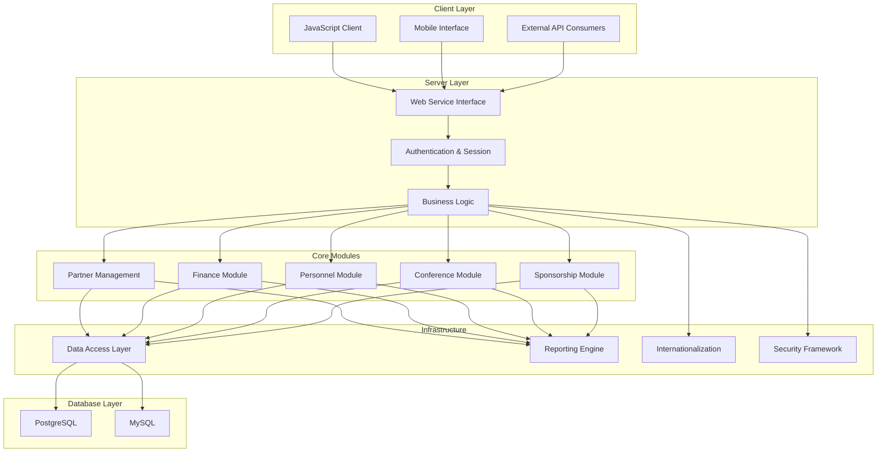
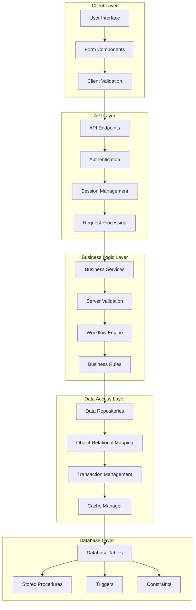

# OpenPetra: Comprehensive Analysis Document

## Executive Summary of OpenPetra

OpenPetra is a free, open-source administrative system for non-profit organizations that provides comprehensive management capabilities including contact management, accounting, and sponsorship tracking with multi-currency support. Designed to address the specific needs of charitable organizations, OpenPetra integrates essential administrative functions into a unified platform, reducing operational costs and simplifying organizational management. The system's robust feature set enables non-profits to efficiently handle partner relationships, financial transactions, and sponsorship programs while maintaining compliance with regulatory requirements across different jurisdictions.

## Core Architecture and Design

Built primarily in C# with a web-based interface, OpenPetra follows a multi-tier architecture separating presentation, business logic, and data access layers, enabling cross-platform compatibility and modular functionality. The system employs a service-oriented design where discrete functional components communicate through well-defined interfaces, allowing for independent development and maintenance of different modules. The architecture leverages modern web technologies for the client interface while maintaining robust server-side processing capabilities.

OpenPetra's codebase is organized into specialized modules (Partner, Finance, Personnel, etc.) that share common infrastructure components like authentication, internationalization, and database access. The system supports both PostgreSQL and MySQL databases through an abstraction layer that enables database independence. This modular approach allows organizations to deploy only the components they need while maintaining a consistent user experience and data model across the application.

## Purpose and Organizational Value

OpenPetra addresses the administrative challenges faced by non-profit organizations by providing integrated tools for contact management, financial accounting, and sponsorship tracking, reducing operational costs and training requirements. By consolidating these functions into a single platform, OpenPetra eliminates the need for multiple specialized systems and the associated integration challenges. This integrated approach enables smaller organizations to access enterprise-grade functionality without prohibitive costs, while larger organizations benefit from streamlined workflows and consistent data across departments.

The system's open-source nature provides additional value through transparency, community support, and freedom from vendor lock-in. Organizations can customize the platform to meet their specific needs without licensing restrictions, while benefiting from ongoing community development and security updates. The focus on non-profit-specific workflows ensures that OpenPetra addresses the unique requirements of charitable organizations, including donor management, gift processing, and regulatory compliance.

## International Operations Support

The system is designed for global deployment with multi-language capabilities, localized formatting, and an International Clearing House feature that minimizes currency exchange charges for international organizations. OpenPetra's internationalization framework supports dynamic language switching without application restart, with current implementations for English, German, and Norwegian. The system handles culture-specific formatting for dates, numbers, and currencies, ensuring consistent data presentation across different regions.

For organizations operating across multiple countries, the International Clearing House functionality provides significant cost savings by optimizing currency exchanges. Rather than converting currencies for each transaction, the system aggregates transactions and performs bulk exchanges at optimal rates. This approach reduces transaction fees and exchange rate losses, particularly beneficial for organizations with operations in multiple currency zones. The multi-currency accounting system maintains transaction values in both original and base currencies, providing accurate financial reporting regardless of exchange rate fluctuations.

## OpenPetra System Architecture

OpenPetra's architecture follows a modular design with clear separation between client interfaces, server components, core functional modules, and infrastructure services. The client layer supports multiple interfaces including a JavaScript web client, mobile interfaces, and API consumers. These connect to the server layer through a unified web service interface that handles authentication and session management before routing requests to the appropriate business logic.

The core modules (Partner, Finance, Personnel, Conference, and Sponsorship) implement the primary business functionality of the system, each with specialized components for their respective domains. These modules share common infrastructure services including the data access layer, reporting engine, internationalization framework, and security services.

The data access layer provides database abstraction, allowing OpenPetra to work with either PostgreSQL or MySQL databases without changes to the application code. This architecture enables flexibility in deployment while maintaining consistent functionality across different environments.

## Partner Management Functionality

The Partner module provides comprehensive contact management for various entity types (individuals, families, organizations) with relationship tracking, communication preferences, and GDPR-compliant consent management. This module serves as the foundation for OpenPetra's contact management capabilities, storing detailed information about all entities the organization interacts with. The system uses a flexible partner categorization system that supports multiple entity types while maintaining consistent data structures and relationships.

Key features include:
- Hierarchical partner organization with support for individuals, families, organizations, churches, banks, and venues
- Comprehensive address management with support for multiple locations per partner and "best address" determination
- Relationship tracking between partners with customizable relationship types
- Communication preferences management including preferred contact methods and language settings
- GDPR-compliant consent tracking for different communication channels and purposes
- Flexible attribute system for storing custom partner information
- Advanced search capabilities with multiple filtering options

The Partner module integrates with other OpenPetra components, providing contact information for financial transactions, conference registrations, and sponsorship relationships. This integration ensures consistent partner data across the application while maintaining appropriate access controls based on user permissions.

## Financial Management Capabilities

OpenPetra implements robust financial features including multi-currency accounting, gift processing with receipting, general ledger operations, accounts payable, and budgeting with comprehensive reporting capabilities. The Finance module follows standard accounting principles with a double-entry bookkeeping system that maintains financial integrity across all transactions. The system supports both cash-basis and accrual accounting methods, with flexible reporting options to meet various regulatory requirements.

The multi-currency functionality is particularly sophisticated, tracking transactions in both original and base currencies with automatic exchange rate application. For international organizations, the International Clearing House feature optimizes currency exchanges by aggregating transactions and performing bulk conversions at favorable rates, significantly reducing transaction costs.

Gift processing capabilities include:
- Batch-based gift entry with validation and balancing
- Automated receipting with customizable templates
- Tax deductibility tracking for different jurisdictions
- Recurring gift management with SEPA direct debit support
- Bank statement import with transaction matching

General ledger operations provide:
- Hierarchical chart of accounts with customizable structures
- Journal entry creation and posting
- Period-end processing with automatic year-end closing
- Budget management with variance reporting
- Cost center accounting for departmental tracking

The reporting system offers standard financial statements (balance sheet, income statement, trial balance) along with specialized reports for donor analysis, gift tracking, and financial performance metrics. Reports can be generated in multiple formats (HTML, PDF, Excel) with configurable parameters for different analytical needs.

## Conference and Event Management

The Conference module handles the complete lifecycle of events from setup and registration to attendee management, group assignments, transportation logistics, and financial tracking with specialized reporting. This comprehensive event management system supports both small gatherings and large international conferences with features designed specifically for non-profit organizational needs.

The module begins with conference setup, where administrators define event parameters including dates, venues, registration options, and cost structures. The registration process supports online applications with customizable forms, automated communication, and application status tracking. Once applications are approved, the system creates attendee records with detailed personal information, travel arrangements, accommodation needs, and financial obligations.

During the event, the system supports:
- Attendee check-in and presence tracking
- Group assignments (fellowship, discovery, and work groups)
- Transportation management with arrival/departure coordination
- Accommodation assignments with room allocation
- Role assignments for staff and volunteers

Financial aspects are fully integrated with OpenPetra's accounting system, tracking:
- Registration fees with early/late registration options
- Discounts and scholarships
- Extra costs for special activities or accommodations
- Payment tracking with outstanding balance reporting
- Field charging for distributed financial responsibility

The reporting system provides specialized conference reports including:
- Attendee listings with filtering options
- Demographic analysis (age, nationality, language)
- Group assignments and role distributions
- Transportation and accommodation schedules
- Financial summaries with payment status

This integrated approach ensures that all aspects of event management are coordinated within a single system, reducing administrative overhead and improving participant experience.

## Sponsorship Program Administration

OpenPetra provides specialized functionality for managing sponsorship relationships between donors and recipients, including child record management, recurring gift arrangements, and documentation tracking. The Sponsorship module creates a bridge between the Partner and Finance modules, linking donors with sponsored children or projects while managing the associated financial transactions.

The system maintains detailed records for sponsored children, including:
- Personal information and family background
- Educational status and achievements
- Health information and special needs
- Photos and documentation
- Development progress tracking

For sponsors, the system tracks:
- Sponsorship relationships with start/end dates
- Recurring gift arrangements with payment schedules
- Communication preferences and history
- Special requests or restrictions

The financial aspects of sponsorship are fully integrated with OpenPetra's accounting system, handling:
- Recurring gift processing with automatic transaction creation
- Payment tracking and reconciliation
- Financial reporting with sponsorship-specific metrics
- Budget allocation to sponsored programs

The module includes specialized reporting capabilities for both operational and donor communication purposes:
- Sponsor listings with filtering by status, location, or commitment level
- Recipient reports with demographic analysis and support levels
- Financial summaries showing sponsorship income and allocation
- Communication tracking for sponsor-recipient correspondence

This integrated approach ensures that sponsorship programs are efficiently managed while maintaining appropriate connections between donors, recipients, and financial transactions. The system supports both individual child sponsorship models and project-based sponsorship approaches, with flexibility to accommodate different organizational structures and program requirements.

## Security and User Management

The system implements comprehensive security with role-based access control, multi-version password hashing schemes, and detailed activity logging to protect sensitive organizational data. Security is implemented at multiple levels throughout the application, from authentication and authorization to data access controls and audit logging.

The authentication system supports both internal database authentication and external authentication providers through a plugin architecture. Password security employs a sophisticated multi-version hashing scheme using the Scrypt key stretching algorithm, with automatic migration to stronger schemes as users authenticate. The system includes protection against brute force attacks through account lockout mechanisms and implements secure password reset workflows with time-limited tokens.

Authorization is managed through a role-based access control system with:
- Module-level permissions controlling access to major functional areas
- Table-level permissions for fine-grained data access control
- Field-level permissions for sensitive data elements
- Special permissions for administrative functions

User management capabilities include:
- Comprehensive user account administration
- Group-based permission assignment
- Self-service account creation with email verification
- Password policy enforcement with complexity requirements
- Account lockout and retirement functionality

The system maintains detailed activity logs for security monitoring and compliance purposes:
- Authentication events (successful and failed login attempts)
- Critical data modifications
- Administrative actions
- Financial transaction details
- User session information

These security features ensure that sensitive organizational data is protected while providing appropriate access to authorized users based on their roles and responsibilities. The comprehensive logging system supports both operational troubleshooting and compliance with regulatory requirements for data protection and financial accountability.

## Client-Server Communication

OpenPetra employs a modern web-based interface with RESTful API endpoints, supporting both HTML and JSON responses for flexible client integration and cross-platform compatibility. The client-server architecture separates presentation concerns from business logic, allowing multiple client implementations to interact with the same server components.

The primary client interface is a JavaScript-based web application that provides a responsive user experience across different devices. This client communicates with the server through standardized API endpoints that handle authentication, data retrieval, and transaction processing. The API supports both HTML responses for browser-based rendering and JSON responses for programmatic interaction, enabling both traditional web interfaces and modern single-page application patterns.

The communication layer implements:
- RESTful API design with standardized endpoints for different functional areas
- Session-based authentication with secure token management
- Request/response formatting for both HTML and JSON content types
- Error handling with appropriate status codes and descriptive messages
- Progress tracking for long-running operations

This flexible approach allows OpenPetra to support various client scenarios:
- Browser-based web interfaces for standard user interaction
- Mobile-optimized views for field operations
- Programmatic API access for integration with other systems
- Specialized clients for specific operational needs

The server-side implementation uses C# with ASP.NET, while the client-side components are built with modern JavaScript frameworks and Bootstrap for responsive design. This architecture ensures that OpenPetra can adapt to different deployment scenarios and client requirements while maintaining consistent business logic and data integrity.

## Data Flow Architecture

The data flow in OpenPetra follows a structured path from user interface through multiple validation layers to the database and back. Starting at the client layer, user interactions with form components trigger client-side validation before requests are sent to API endpoints. The API layer handles authentication, session management, and initial request processing before passing validated requests to the business logic layer.

Within the business logic layer, specialized services apply additional validation rules and process the request through appropriate workflow engines and business rule processors. These components ensure that all operations conform to the system's business logic and maintain data integrity across related entities.

The data access layer provides an abstraction over database operations, using repositories and ORM components to translate between business objects and database structures. Transaction management ensures that related operations are processed atomically, while the cache manager optimizes performance for frequently accessed data.

At the database layer, tables store the actual data with constraints and triggers enforcing referential integrity and business rules at the database level. This multi-layered approach with validation at each step ensures data integrity while providing appropriate separation between presentation, business logic, and data storage concerns.

## Internationalization Framework

The system provides robust internationalization support with dynamic language switching, culture-specific formatting for dates and currencies, and a comprehensive translation management system. OpenPetra's internationalization framework is designed to support global deployment with minimal code changes, allowing the application to adapt to different languages and regional requirements.

The core of the internationalization system is built on GNU Gettext, providing a standardized approach to string translation and resource management. The framework supports:
- Dynamic language switching without application restart
- Culture-specific formatting for dates, numbers, and currencies
- Right-to-left text rendering for appropriate languages
- Translation resource management with fallback mechanisms
- Pluralization rules for different languages

Currently, OpenPetra includes translations for:
- English (default language)
- German
- Norwegian

The translation system is designed for easy extension, allowing new languages to be added without code changes. Translation resources are organized in a structured hierarchy that mirrors the application's modules, ensuring that translations remain contextually appropriate across different functional areas.

For developers, the internationalization framework provides a clean API that abstracts the complexity of managing translations and formatting rules. String externalization is consistently applied throughout the codebase, ensuring that all user-facing text can be translated. The system also includes tools for identifying untranslated strings and managing translation workflows, supporting ongoing localization efforts as the application evolves.

## Database Abstraction and Compatibility

OpenPetra implements database independence through abstraction layers supporting both PostgreSQL and MySQL, with transaction management and connection pooling for optimal performance. This database abstraction approach allows organizations to choose their preferred database system based on existing infrastructure, expertise, or specific requirements without compromising application functionality.

The database abstraction is implemented through multiple layers:
1. **Database Interface Layer**: Defines common interfaces for database operations regardless of the underlying database system
2. **Database-Specific Adapters**: Implement the common interfaces for each supported database (PostgreSQL and MySQL)
3. **SQL Generation**: Creates database-specific SQL statements based on the target database system
4. **Connection Management**: Handles connection pooling, transaction isolation, and resource cleanup

This architecture provides several benefits:
- Organizations can deploy OpenPetra with their preferred database system
- Database migration is simplified if organizational needs change
- Development and testing can occur on different database systems
- Database-specific optimizations can be implemented without affecting application code

The system handles database-specific differences in:
- SQL syntax and function names
- Data type mappings
- Transaction isolation levels
- Sequence generation and identity management
- Case sensitivity in queries

Connection pooling optimizes performance by reusing database connections rather than creating new connections for each operation. Transaction management ensures data integrity by grouping related operations into atomic units that either complete entirely or roll back completely if errors occur. These features ensure reliable database operations while maintaining flexibility in deployment options.

## Reporting and Data Export

The application offers extensive reporting capabilities with parameter-driven templates, multiple output formats (HTML, PDF, Excel), and flexible data export options for integration with external systems. OpenPetra's reporting framework is designed to meet both operational and compliance needs, providing standardized reports for financial statements, partner information, and organizational metrics.

The reporting system is built around a template-based architecture where report definitions are stored as XML files with embedded SQL queries. These templates define both the data retrieval logic and the presentation structure, allowing for consistent reporting while supporting customization for different organizational needs. Reports can be parameterized to filter data based on various criteria including date ranges, account codes, partner types, and other relevant factors.

Key reporting capabilities include:
- Financial statements (balance sheet, income statement, trial balance)
- Partner reports (by location, type, relationship, subscription)
- Gift analysis reports (by donor, motivation, amount)
- Personnel reports (birthdays, commitments, passport expiry)
- Conference reports (attendees, demographics, transportation)
- Sponsorship reports (children, donors, payments)

The system supports multiple output formats:
- HTML for on-screen viewing and basic printing
- PDF for professional printing and distribution
- Excel for further analysis and manipulation
- CSV for data integration with other systems

Data export functionality extends beyond standard reports, allowing organizations to extract structured data for integration with external systems. Export options include:
- YAML/GZ format for database backup and migration
- CSV exports for data analysis in spreadsheet applications
- Specialized formats for financial data exchange (SEPA, MT940)

This comprehensive reporting and export framework ensures that organizations can access their data in appropriate formats for different operational, analytical, and compliance needs.

## Plugin Architecture and Extensibility

OpenPetra's plugin-based architecture allows organizations to extend functionality without modifying core code, supporting customization for specific organizational requirements while maintaining a stable platform. This extensibility framework enables organizations to adapt the system to their unique needs without creating maintenance challenges when upgrading to new versions.

The plugin architecture is implemented through several mechanisms:
1. **Module-Based Design**: Core functionality is organized into discrete modules with well-defined interfaces
2. **Extension Points**: Specific locations in the codebase where plugins can register custom behavior
3. **Service Locator Pattern**: Dynamic discovery and loading of plugin implementations
4. **Configuration-Driven Activation**: Plugins can be enabled or disabled through configuration without code changes

This approach allows for various types of extensions:
- Custom reports and data exports
- Specialized business logic for unique organizational processes
- Integration with external systems (payment processors, CRM systems, etc.)
- Custom user interface components for specific operational needs
- Authentication plugins for integration with organizational identity systems

Plugins maintain isolation from core code through:
- Clear interface contracts that define expected behavior
- Dependency injection to avoid tight coupling
- Event-based communication for cross-module interaction
- Configuration-based customization rather than code modification

The plugin architecture is particularly valuable for organizations with specialized requirements that aren't addressed by the core system. Rather than maintaining a custom fork of the entire application, organizations can develop targeted plugins that address their specific needs while benefiting from ongoing updates and improvements to the core platform. This approach balances customization flexibility with long-term maintainability, ensuring that OpenPetra can evolve to meet changing requirements without creating upgrade challenges.

[Generated by the Sage AI expert workbench: 2025-03-30 02:22:57  https://sage-tech.ai/workbench]: #