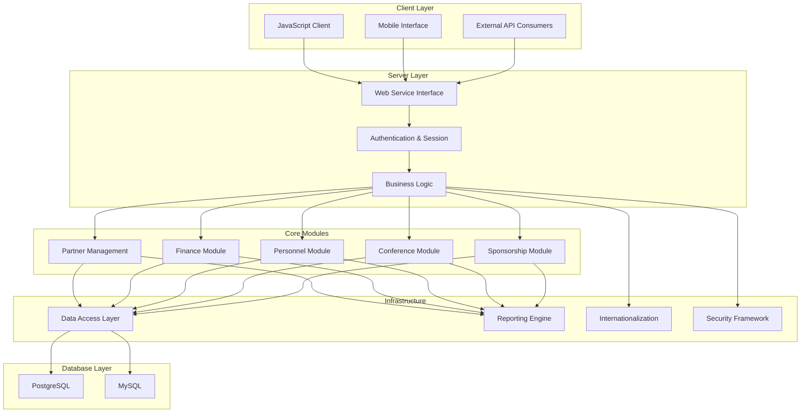
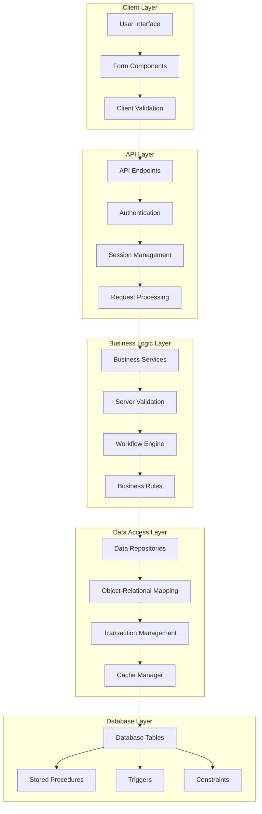

# OpenPetra: Comprehensive Analysis Document

## Executive Summary of OpenPetra

OpenPetra is a free, open-source administrative system for non-profit organizations that provides comprehensive management capabilities including contact management, accounting, and sponsorship tracking with multi-currency support. Designed to address the specific needs of charitable organizations, OpenPetra integrates essential administrative functions into a unified platform, reducing operational costs and simplifying organizational management. The system's robust feature set enables non-profits to efficiently handle partner relationships, financial transactions, and sponsorship programs while maintaining compliance with regulatory requirements across different jurisdictions.

## Core Architecture and Design

Built primarily in C# with a web-based interface, OpenPetra follows a multi-tier architecture separating presentation, business logic, and data access layers, enabling cross-platform compatibility and modular functionality. The system employs a service-oriented design where discrete functional components communicate through well-defined interfaces, allowing for independent development and maintenance of different modules. The architecture leverages modern web technologies for the client interface while maintaining robust server-side processing capabilities.

OpenPetra's codebase is organized into specialized modules (Partner, Finance, Personnel, etc.) that share common infrastructure components like authentication, internationalization, and database access. The system supports both PostgreSQL and MySQL databases through an abstraction layer that enables database independence. This modular approach allows organizations to deploy only the components they need while maintaining a consistent user experience and data model across the application.

## Purpose and Organizational Value

OpenPetra addresses the administrative challenges faced by non-profit organizations by providing integrated tools for contact management, financial accounting, and sponsorship tracking, reducing operational costs and training requirements. By consolidating these functions into a single platform, OpenPetra eliminates the need for multiple specialized systems and the associated integration challenges. This integrated approach enables smaller organizations to access enterprise-grade functionality without prohibitive costs, while larger organizations benefit from streamlined workflows and consistent data across departments.

The system's open-source nature provides additional value through transparency, community support, and freedom from vendor lock-in. Organizations can customize the platform to meet their specific needs without licensing restrictions, while benefiting from ongoing community development and security updates. The focus on non-profit-specific workflows ensures that OpenPetra addresses the unique requirements of charitable organizations, including donor management, gift processing, and regulatory compliance.

## International Operations Support

The system is designed for global deployment with multi-language capabilities, localized formatting, and an International Clearing House feature that minimizes currency exchange charges for international organizations. OpenPetra's internationalization framework supports dynamic language switching without application restart, with current implementations for English, German, and Norwegian. The system handles culture-specific formatting for dates, numbers, and currencies, ensuring consistent data presentation across different regions.

For organizations operating across multiple countries, the International Clearing House functionality provides significant cost savings by optimizing currency exchanges. Rather than converting currencies for each transaction, the system aggregates transactions and performs bulk exchanges at optimal rates. This approach reduces transaction fees and exchange rate losses, particularly beneficial for organizations with operations in multiple currency zones. The multi-currency accounting system maintains transaction values in both original and base currencies, providing accurate financial reporting regardless of exchange rate fluctuations.

## OpenPetra System Architecture

OpenPetra's architecture follows a modular design with clear separation between client interfaces, server components, core functional modules, and infrastructure services. The client layer supports multiple interfaces including a JavaScript web client, mobile interfaces, and API consumers. These connect to the server layer through a unified web service interface that handles authentication and session management before routing requests to the appropriate business logic.

The core modules (Partner, Finance, Personnel, Conference, and Sponsorship) implement the primary business functionality of the system, each with specialized components for their respective domains. These modules share common infrastructure services including the data access layer, reporting engine, internationalization framework, and security services.

The data access layer provides database abstraction, allowing OpenPetra to work with either PostgreSQL or MySQL databases without changes to the application code. This architecture enables flexibility in deployment while maintaining consistent functionality across different environments.

## Partner Management Functionality

The Partner module provides comprehensive contact management for various entity types (individuals, families, organizations) with relationship tracking, communication preferences, and GDPR-compliant consent management. This module serves as the foundation for OpenPetra's contact management capabilities, storing detailed information about all entities the organization interacts with. The system uses a flexible partner categorization system that supports multiple entity types while maintaining consistent data structures and relationships.

Key features include:
- Hierarchical partner organization with support for individuals, families, organizations, churches, banks, and venues
- Comprehensive address management with support for multiple locations per partner and "best address" determination
- Relationship tracking between partners with customizable relationship types
- Communication preferences management including preferred contact methods and language settings
- GDPR-compliant consent tracking for different communication channels and purposes
- Flexible attribute system for storing custom partner information
- Advanced search capabilities with multiple filtering options

The Partner module integrates with other OpenPetra components, providing contact information for financial transactions, conference registrations, and sponsorship relationships. This integration ensures consistent partner data across the application while maintaining appropriate access controls based on user permissions.

## Financial Management Capabilities

OpenPetra implements robust financial features including multi-currency accounting, gift processing with receipting, general ledger operations, accounts payable, and budgeting with comprehensive reporting capabilities. The Finance module follows standard accounting principles with a double-entry bookkeeping system that maintains financial integrity across all transactions. The system supports both cash-basis and accrual accounting methods, with flexible reporting options to meet various regulatory requirements.

The multi-currency functionality is particularly sophisticated, tracking transactions in both original and base currencies with automatic exchange rate application. For international organizations, the International Clearing House feature optimizes currency exchanges by aggregating transactions and performing bulk conversions at favorable rates, significantly reducing transaction costs.

Gift processing capabilities include:
- Batch-based gift entry with validation and balancing
- Automated receipting with customizable templates
- Tax deductibility tracking for different jurisdictions
- Recurring gift management with SEPA direct debit support
- Bank statement import with transaction matching

General ledger operations provide:
- Hierarchical chart of accounts with customizable structures
- Journal entry creation and posting
- Period-end processing with automatic year-end closing
- Budget management with variance reporting
- Cost center accounting for departmental tracking

The reporting system offers standard financial statements (balance sheet, income statement, trial balance) along with specialized reports for donor analysis, gift tracking, and financial performance metrics. Reports can be generated in multiple formats (HTML, PDF, Excel) with configurable parameters for different analytical needs.

## Conference and Event Management

The Conference module handles the complete lifecycle of events from setup and registration to attendee management, group assignments, transportation logistics, and financial tracking with specialized reporting. This comprehensive event management system supports both small gatherings and large international conferences with features designed specifically for non-profit organizational needs.

The module begins with conference setup, where administrators define event parameters including dates, venues, registration options, and cost structures. The registration process supports online applications with customizable forms, automated communication, and application status tracking. Once applications are approved, the system creates attendee records with detailed personal information, travel arrangements, accommodation needs, and financial obligations.

During the event, the system supports:
- Attendee check-in and presence tracking
- Group assignments (fellowship, discovery, and work groups)
- Transportation management with arrival/departure coordination
- Accommodation assignments with room allocation
- Role assignments for staff and volunteers

Financial aspects are fully integrated with OpenPetra's accounting system, tracking:
- Registration fees with early/late registration options
- Discounts and scholarships
- Extra costs for special activities or accommodations
- Payment tracking with outstanding balance reporting
- Field charging for distributed financial responsibility

The reporting system provides specialized conference reports including:
- Attendee listings with filtering options
- Demographic analysis (age, nationality, language)
- Group assignments and role distributions
- Transportation and accommodation schedules
- Financial summaries with payment status

This integrated approach ensures that all aspects of event management are coordinated within a single system, reducing administrative overhead and improving participant experience.

## Sponsorship Program Administration

OpenPetra provides specialized functionality for managing sponsorship relationships between donors and recipients, including child record management, recurring gift arrangements, and documentation tracking. The Sponsorship module creates a bridge between the Partner and Finance modules, linking donors with sponsored children or projects while managing the associated financial transactions.

The system maintains detailed records for sponsored children, including:
- Personal information and family background
- Educational status and achievements
- Health information and special needs
- Photos and documentation
- Development progress tracking

For sponsors, the system tracks:
- Sponsorship relationships with start/end dates
- Recurring gift arrangements with payment schedules
- Communication preferences and history
- Special requests or restrictions

The financial aspects of sponsorship are fully integrated with OpenPetra's accounting system, handling:
- Recurring gift processing with automatic transaction creation
- Payment tracking and reconciliation
- Financial reporting with sponsorship-specific metrics
- Budget allocation to sponsored programs

The module includes specialized reporting capabilities for both operational and donor communication purposes:
- Sponsor listings with filtering by status, location, or commitment level
- Recipient reports with demographic analysis and support levels
- Financial summaries showing sponsorship income and allocation
- Communication tracking for sponsor-recipient correspondence

This integrated approach ensures that sponsorship programs are efficiently managed while maintaining appropriate connections between donors, recipients, and financial transactions. The system supports both individual child sponsorship models and project-based sponsorship approaches, with flexibility to accommodate different organizational structures and program requirements.

## Security and User Management

The system implements comprehensive security with role-based access control, multi-version password hashing schemes, and detailed activity logging to protect sensitive organizational data. Security is implemented at multiple levels throughout the application, from authentication and authorization to data access controls and audit logging.

The authentication system supports both internal database authentication and external authentication providers through a plugin architecture. Password security employs a sophisticated multi-version hashing scheme using the Scrypt key stretching algorithm, with automatic migration to stronger schemes as users authenticate. The system includes protection against brute force attacks through account lockout mechanisms and implements secure password reset workflows with time-limited tokens.

Authorization is managed through a role-based access control system with:
- Module-level permissions controlling access to major functional areas
- Table-level permissions for fine-grained data access control
- Field-level permissions for sensitive data elements
- Special permissions for administrative functions

User management capabilities include:
- Comprehensive user account administration
- Group-based permission assignment
- Self-service account creation with email verification
- Password policy enforcement with complexity requirements
- Account lockout and retirement functionality

The system maintains detailed activity logs for security monitoring and compliance purposes:
- Authentication events (successful and failed login attempts)
- Critical data modifications
- Administrative actions
- Financial transaction details
- User session information

These security features ensure that sensitive organizational data is protected while providing appropriate access to authorized users based on their roles and responsibilities. The comprehensive logging system supports both operational troubleshooting and compliance with regulatory requirements for data protection and financial accountability.

## Client-Server Communication

OpenPetra employs a modern web-based interface with RESTful API endpoints, supporting both HTML and JSON responses for flexible client integration and cross-platform compatibility. The client-server architecture separates presentation concerns from business logic, allowing multiple client implementations to interact with the same server components.

The primary client interface is a JavaScript-based web application that provides a responsive user experience across different devices. This client communicates with the server through standardized API endpoints that handle authentication, data retrieval, and transaction processing. The API supports both HTML responses for browser-based rendering and JSON responses for programmatic interaction, enabling both traditional web interfaces and modern single-page application patterns.

The communication layer implements:
- RESTful API design with standardized endpoints for different functional areas
- Session-based authentication with secure token management
- Request/response formatting for both HTML and JSON content types
- Error handling with appropriate status codes and descriptive messages
- Progress tracking for long-running operations

This flexible approach allows OpenPetra to support various client scenarios:
- Browser-based web interfaces for standard user interaction
- Mobile-optimized views for field operations
- Programmatic API access for integration with other systems
- Specialized clients for specific operational needs

The server-side implementation uses C# with ASP.NET, while the client-side components are built with modern JavaScript frameworks and Bootstrap for responsive design. This architecture ensures that OpenPetra can adapt to different deployment scenarios and client requirements while maintaining consistent business logic and data integrity.

## Data Flow Architecture

The data flow in OpenPetra follows a structured path from user interface through multiple validation layers to the database and back. Starting at the client layer, user interactions with form components trigger client-side validation before requests are sent to API endpoints. The API layer handles authentication, session management, and initial request processing before passing validated requests to the business logic layer.

Within the business logic layer, specialized services apply additional validation rules and process the request through appropriate workflow engines and business rule processors. These components ensure that all operations conform to the system's business logic and maintain data integrity across related entities.

The data access layer provides an abstraction over database operations, using repositories and ORM components to translate between business objects and database structures. Transaction management ensures that related operations are processed atomically, while the cache manager optimizes performance for frequently accessed data.

At the database layer, tables store the actual data with constraints and triggers enforcing referential integrity and business rules at the database level. This multi-layered approach with validation at each step ensures data integrity while providing appropriate separation between presentation, business logic, and data storage concerns.

## Internationalization Framework

The system provides robust internationalization support with dynamic language switching, culture-specific formatting for dates and currencies, and a comprehensive translation management system. OpenPetra's internationalization framework is designed to support global deployment with minimal code changes, allowing the application to adapt to different languages and regional requirements.

The core of the internationalization system is built on GNU Gettext, providing a standardized approach to string translation and resource management. The framework supports:
- Dynamic language switching without application restart
- Culture-specific formatting for dates, numbers, and currencies
- Right-to-left text rendering for appropriate languages
- Translation resource management with fallback mechanisms
- Pluralization rules for different languages

Currently, OpenPetra includes translations for:
- English (default language)
- German
- Norwegian

The translation system is designed for easy extension, allowing new languages to be added without code changes. Translation resources are organized in a structured hierarchy that mirrors the application's modules, ensuring that translations remain contextually appropriate across different functional areas.

For developers, the internationalization framework provides a clean API that abstracts the complexity of managing translations and formatting rules. String externalization is consistently applied throughout the codebase, ensuring that all user-facing text can be translated. The system also includes tools for identifying untranslated strings and managing translation workflows, supporting ongoing localization efforts as the application evolves.

## Database Abstraction and Compatibility

OpenPetra implements database independence through abstraction layers supporting both PostgreSQL and MySQL, with transaction management and connection pooling for optimal performance. This database abstraction approach allows organizations to choose their preferred database system based on existing infrastructure, expertise, or specific requirements without compromising application functionality.

The database abstraction is implemented through multiple layers:
1. **Database Interface Layer**: Defines common interfaces for database operations regardless of the underlying database system
2. **Database-Specific Adapters**: Implement the common interfaces for each supported database (PostgreSQL and MySQL)
3. **SQL Generation**: Creates database-specific SQL statements based on the target database system
4. **Connection Management**: Handles connection pooling, transaction isolation, and resource cleanup

This architecture provides several benefits:
- Organizations can deploy OpenPetra with their preferred database system
- Database migration is simplified if organizational needs change
- Development and testing can occur on different database systems
- Database-specific optimizations can be implemented without affecting application code

The system handles database-specific differences in:
- SQL syntax and function names
- Data type mappings
- Transaction isolation levels
- Sequence generation and identity management
- Case sensitivity in queries

Connection pooling optimizes performance by reusing database connections rather than creating new connections for each operation. Transaction management ensures data integrity by grouping related operations into atomic units that either complete entirely or roll back completely if errors occur. These features ensure reliable database operations while maintaining flexibility in deployment options.

## Reporting and Data Export

The application offers extensive reporting capabilities with parameter-driven templates, multiple output formats (HTML, PDF, Excel), and flexible data export options for integration with external systems. OpenPetra's reporting framework is designed to meet both operational and compliance needs, providing standardized reports for financial statements, partner information, and organizational metrics.

The reporting system is built around a template-based architecture where report definitions are stored as XML files with embedded SQL queries. These templates define both the data retrieval logic and the presentation structure, allowing for consistent reporting while supporting customization for different organizational needs. Reports can be parameterized to filter data based on various criteria including date ranges, account codes, partner types, and other relevant factors.

Key reporting capabilities include:
- Financial statements (balance sheet, income statement, trial balance)
- Partner reports (by location, type, relationship, subscription)
- Gift analysis reports (by donor, motivation, amount)
- Personnel reports (birthdays, commitments, passport expiry)
- Conference reports (attendees, demographics, transportation)
- Sponsorship reports (children, donors, payments)

The system supports multiple output formats:
- HTML for on-screen viewing and basic printing
- PDF for professional printing and distribution
- Excel for further analysis and manipulation
- CSV for data integration with other systems

Data export functionality extends beyond standard reports, allowing organizations to extract structured data for integration with external systems. Export options include:
- YAML/GZ format for database backup and migration
- CSV exports for data analysis in spreadsheet applications
- Specialized formats for financial data exchange (SEPA, MT940)

This comprehensive reporting and export framework ensures that organizations can access their data in appropriate formats for different operational, analytical, and compliance needs.

## Plugin Architecture and Extensibility

OpenPetra's plugin-based architecture allows organizations to extend functionality without modifying core code, supporting customization for specific organizational requirements while maintaining a stable platform. This extensibility framework enables organizations to adapt the system to their unique needs without creating maintenance challenges when upgrading to new versions.

The plugin architecture is implemented through several mechanisms:
1. **Module-Based Design**: Core functionality is organized into discrete modules with well-defined interfaces
2. **Extension Points**: Specific locations in the codebase where plugins can register custom behavior
3. **Service Locator Pattern**: Dynamic discovery and loading of plugin implementations
4. **Configuration-Driven Activation**: Plugins can be enabled or disabled through configuration without code changes

This approach allows for various types of extensions:
- Custom reports and data exports
- Specialized business logic for unique organizational processes
- Integration with external systems (payment processors, CRM systems, etc.)
- Custom user interface components for specific operational needs
- Authentication plugins for integration with organizational identity systems

Plugins maintain isolation from core code through:
- Clear interface contracts that define expected behavior
- Dependency injection to avoid tight coupling
- Event-based communication for cross-module interaction
- Configuration-based customization rather than code modification

The plugin architecture is particularly valuable for organizations with specialized requirements that aren't addressed by the core system. Rather than maintaining a custom fork of the entire application, organizations can develop targeted plugins that address their specific needs while benefiting from ongoing updates and improvements to the core platform. This approach balances customization flexibility with long-term maintainability, ensuring that OpenPetra can evolve to meet changing requirements without creating upgrade challenges.

## Sub-Project Analysis 

### top-level

OpenPetra serves as a comprehensive open-source administrative platform for non-profit organizations, built primarily in C# with a web-based interface. The system integrates CRM and ERP functionality with specialized donation processing capabilities, enabling organizations to manage contacts, finances, and sponsorships through a unified platform. OpenPetra's architecture follows a modular design approach where core functionality is compartmentalized into distinct modules that communicate through well-defined interfaces, enhancing maintainability and extensibility. The platform emphasizes cross-platform compatibility through its web-first design, utilizing responsive frameworks to ensure accessibility across various devices. Security remains a priority with structured vulnerability reporting and a version support strategy that maintains secure deployments. The system accommodates international operations with multi-currency support and International Clearing House functionality, while its continuous integration pipeline maintains build integrity through automated testing on Ubuntu environments. OpenPetra's GPL v3 licensing ensures the codebase remains freely available while protecting user freedoms, adhering to open-source best practices with clear documentation and security policies.

### inc/nanttasks

The inc/nanttasks subproject implements custom NAnt build tasks and project generation utilities that enable OpenPetra's build system to function across different operating environments. This component provides critical cross-platform build automation for both Windows and Linux/Mono environments, integrating database operations with PostgreSQL and MySQL through dedicated tasks with configurable connection parameters. The architecture employs platform abstraction through tasks like ExecDotNet and ExecCmd that automatically detect the operating environment and adjust command execution accordingly. Project structure analysis is handled by GenerateNamespaceMap, which parses C# files to extract namespace declarations and build dependency maps, while GenerateProjectFiles uses templates to create consistent project files across different development environments. The design ensures OpenPetra can be built, tested, and deployed consistently across various operating systems by providing both high-level solution compilation and granular project-level compilation options, with fallback mechanisms when preferred tools aren't available. This subproject essentially forms the backbone of OpenPetra's build infrastructure, enabling developers to maintain a consistent development workflow regardless of their platform.

### inc/cfg/benerator

The inc/cfg/benerator subproject implements configuration files for the Benerator data generation framework, enabling synthetic test data creation for OpenPetra's testing environment. This Java-based component generates realistic sample data across multiple entity domains including organizations, people, and donations, while establishing meaningful relationships between these entities. The architecture employs centralized configuration management through the benerator.xml file, which serves as the main entry point by importing necessary domains and establishing global settings. Entity definitions follow a modular approach where each entity type has separate configuration blocks with specific generators and constraints, while locale-specific data generation is controlled through configuration files like default-location.ben.xml to ensure realistic regional settings. The framework supports generating complex data scenarios including family structures, financial transactions, and geographic information with appropriate constraints and distributions. Entity relationship modeling establishes connections between generated entities such as workers to fields and people to donations, creating a comprehensive test dataset that reflects real-world usage patterns. The output is formatted to CSV files suitable for database population, providing OpenPetra developers with realistic test data for development and quality assurance purposes.

### inc/cfg

The inc/cfg subproject manages configuration settings and documentation standards for the OpenPetra application, implementing code formatting standards and API documentation generation. This C# component ensures standardized code formatting across the codebase through Uncrustify configuration, which enforces consistent formatting rules including a 4-space indentation style, specific rules for brace placement, spacing around operators, and comment formatting. The documentation generation framework utilizes Doxygen configuration to provide automated API documentation generation specifically targeting C# files in the codebase, producing searchable documentation with class diagrams and cross-referencing capabilities that output to the delivery/API-Doc directory. Through cross-project standardization, this subproject ensures uniform code appearance and documentation across all OpenPetra modules, enhancing maintainability by standardizing code structure and providing accessible documentation. The architecture emphasizes code quality and maintainability, supporting OpenPetra's mission of providing accessible, maintainable open-source software for non-profit organizations by creating a consistent development environment that improves developer experience and ensures long-term sustainability of the codebase.

### inc/nant

The inc/nant subproject implements a comprehensive build automation framework that manages the compilation, deployment, and maintenance of the OpenPetra application. This component establishes a hierarchical build structure where core build files define common properties and targets, while subdirectory-specific build files handle component-specific operations through recursive subdirectory execution. The architecture emphasizes cross-platform compatibility between Windows and Unix environments through platform abstraction, where platform-specific operations are encapsulated behind common targets with conditional logic handling environmental differences. Extension points are provided through custom targets like 'custdepend' and 'custclean', offering hooks for extending the build system without modifying core files. The system incorporates embedded C# script functions within the build files to provide advanced functionality for path manipulation, GUID generation, and content replacement. Configuration management is centralized in OpenPetra.common.xml, establishing consistent settings across the build process. Beyond compilation, the framework manages server operations (initialization, start/stop), database settings, and code formatting through Uncrustify integration, providing a comprehensive foundation for building, deploying, and maintaining the OpenPetra application across different environments.
### inc/template/etc

The inc/template/etc subproject implements the template system for miscellaneous UI components and reusable interface patterns across the OpenPetra application. It establishes a component-based architecture where UI elements are modularized for maximum reuse, leveraging Bootstrap for consistent styling and responsive behavior. The template system incorporates inheritance mechanisms allowing base templates to define overall structure while child templates can override specific sections as needed. This subproject supports both server-side rendering for traditional web interfaces and client-side rendering for dynamic interactions, ensuring cross-browser compatibility. Key features include responsive design integration, localization support for internationalization of UI elements, and client-side validation patterns that complement server-side validation. The architecture prioritizes extensibility, allowing new components to be added with minimal changes to existing code, while maintaining consistent error handling and user feedback mechanisms throughout the templates to provide a cohesive user experience.

### inc/template/doc

The inc/template/doc subproject provides the HTML template infrastructure for OpenPetra's documentation generation system, specifically focusing on transforming structured error code data into human-readable reference documentation. It implements templating patterns for error code documentation with placeholder structures for dynamic content insertion, ensuring standardized formatting and organizational principles. The architecture emphasizes modular documentation structure, organizing error codes by module to create logical groupings aligned with the application's architecture. The templates enforce a consistent module.number.category pattern for all error codes and include placeholders for comprehensive error information including short descriptions, full descriptions, and declaring classes. This subproject integrates with the build process through the 'nant errorCodeDoc' tool, automatically generating documentation during builds. The system is designed to be maintainable and extensible, supporting the development workflow by providing a centralized reference for all error codes in the OpenPetra system.

### inc/template/email

The inc/template/email subproject implements a comprehensive email templating system that supports multilingual communication across various user workflows in OpenPetra. The system provides standardized email templates for critical user interactions with robust multilingual support, currently available in English and German through separate template files for each language. The architecture separates content from functionality through a flexible placeholder system that enables dynamic content insertion (e.g., {FirstName}, {LastName}) and conditional content rendering using {ifdef} tags to include optional sections based on available data. Security-focused workflows are supported through token-based security implementation for sensitive operations like password resets. The templates follow a consistent naming convention that identifies both function and language, ensuring a consistent user experience and brand identity. The design emphasizes human-readable text files that can be modified without programming knowledge while maintaining the necessary structure for dynamic content insertion.

### inc/template/vscode

The inc/template/vscode subproject provides standardized Visual Studio solution and project file templates for the OpenPetra ecosystem. It implements the foundational structure for Visual Studio integration and project organization, enabling consistent development environments across the codebase. The architecture employs template-based generation using placeholder variables (${ProjectName}, ${ProjectGuid}, etc.) that get replaced during project generation. These templates standardize Debug and Release configurations targeting x86 architecture and provide structured templates for solution folders to maintain code organization. The subproject ensures proper linking between projects and their parent solutions through cross-project integration features. By emphasizing consistency across the development environment, these templates make the codebase more maintainable and easier to navigate while supporting the build and deployment process with the necessary file structures required by Visual Studio to properly organize and build the OpenPetra application components.

### inc/template/src/ClientServerGlue

The inc/template/src/ClientServerGlue subproject implements the critical server-side web service generation templates and integration layer connecting client requests to server-side business logic in OpenPetra. It employs a template-based code generation approach where the ServerGlue.cs template is processed by build tools to generate consistent web service implementations across all OpenPetra modules. The architecture follows a service-oriented design where each top-level module receives its own WebService class with standardized method signatures, ensuring automated SOAP web service endpoint generation for all modules. Security is tightly integrated through built-in permission checking woven into all generated endpoints, with session management and authentication integration through TModuleAccessManager. The subproject implements consistent exception handling and logging patterns across all generated services, emphasizing maintainability through automated code generation. This template-based approach reduces manual coding errors and ensures best practices are consistently applied throughout the codebase, making it easier to extend functionality while maintaining architectural integrity.
### inc/template/src/ORM

The ORM subproject within Petra's template source implements a sophisticated object-relational mapping system that bridges the application's C# code with its database layer. Following the Table Access Object pattern, it generates strongly-typed data access classes through template-based code generation, ensuring consistency across the entire data layer. The architecture incorporates an efficient thread-static caching mechanism that optimizes performance for frequently accessed but rarely changed data tables, significantly reducing database load. Data integrity is maintained through comprehensive validation classes that enforce business rules before database operations occur, while cascading operations ensure referential integrity across related tables. The generated code supports both traditional database access patterns and modern web-based API interactions, providing a flexible foundation for Petra's data management needs. This subproject is particularly valuable for Petra's non-profit administrative management focus, where reliable data handling is essential for organizational record-keeping.

### inc/template/src

The Template Source subproject serves as a foundational component of OpenPetra that establishes standardization across the codebase through source code templates and assembly metadata definitions. It implements two primary template types: source code headers with proper GNU GPL licensing notices and .NET assembly metadata configurations. These templates utilize placeholder variables (like ${projectname} and ${projectversion}) that are dynamically replaced during build processes, ensuring consistency while allowing for customization. The architecture emphasizes license compliance management by guaranteeing all source files maintain proper GNU GPL requirements, which is critical for OpenPetra's open-source integrity. Assembly identity control is standardized through these templates, creating a cohesive ecosystem of .NET components that identify themselves consistently within the larger application. This subproject directly supports OpenPetra's mission to provide free, open-source administrative software by establishing the structural foundation for proper attribution and licensing across all code components.

### inc/template

The Include Templates subproject implements a flexible framework for generating and rendering user interface components within OpenPetra. This C# implementation serves as the presentation layer for both web interfaces and API responses, following MVC principles with clear separation between data models, view templates, and controller logic. The architecture features a sophisticated template inheritance system where base templates define layouts that can be extended by child templates, promoting consistency while reducing code duplication. Complex UI components are composed from smaller, reusable partial views through a modular approach, allowing independent maintenance of components. The subsystem supports multiple output formats (HTML, JSON) through format-agnostic controllers, enabling both traditional page rendering and modern single-page application patterns. A comprehensive data binding framework automatically connects UI elements with data models, providing type validation, while the integrated widget library offers pre-built components for common interface elements like forms, tables, and navigation controls.

### inc

The Includes subproject forms a core component of OpenPetra, providing reusable interface elements and templating functionality that establish consistent user experience patterns across the application. It implements a component-based architecture where UI elements can be assembled into complex interfaces while maintaining behavioral and visual consistency. The design incorporates template inheritance, allowing specific modules to extend base templates while preserving core functionality and styling. Responsive design principles are embedded throughout the framework, ensuring interfaces function properly across various device types and screen sizes. The architecture emphasizes separation between presentation logic and business functionality, with clear interfaces for data exchange between layers. Internationalization support is built into the system, providing mechanisms for language-specific text and formatting to accommodate OpenPetra's global user base. This modular approach reduces code duplication and ensures that interface changes can be efficiently propagated system-wide.

### resources

The Resources subproject serves as the centralized repository for all graphical assets and resource files that support Petra's user interface and visual components. It manages static content including icon files, visual indicators for navigation, UI components for consistent branding, and properly attributed third-party visual assets. The architecture follows best practices for resource management in open-source projects, with meticulous documentation and attribution of third-party resources like Nuvola icons to ensure legal compliance. By maintaining a single source of truth for visual elements, the subproject enforces consistency across the application while clearly separating functional code from visual resources. This approach enhances maintainability by allowing developers to easily locate and update visual assets when needed. The Resources subproject directly supports Petra's mission of providing administrative management solutions to non-profit organizations by establishing a consistent visual language that improves usability while maintaining compliance with open-source licensing requirements.
### setup

The Setup subproject serves as the foundational component of OpenPetra, managing system configuration, initialization, and maintenance operations. It implements a layered architecture with clear separation between configuration storage, business logic, and user interfaces, enabling comprehensive management of operational parameters and system bootstrapping. The configuration repository provides centralized storage and retrieval of system-wide settings with support for hierarchical structures, while the database initialization framework offers automated schema creation and migration tools to maintain database integrity across versions. The module employs a plugin-based extension model allowing other components to register configuration requirements while maintaining centralized management. The user management system handles account creation, authentication, and authorization, complemented by robust validation mechanisms to ensure system integrity and prevent misconfiguration. The subproject supports both interactive setup through web interfaces and automated deployment through configuration files and command-line tools, with transactional operations where possible to ensure system integrity and comprehensive logging for troubleshooting.

### setup/releasenotes

The Setup Release Notes subproject implements the documentation system and version history tracking for OpenPetra, an open-source software system designed to help non-profit organizations manage administration tasks. This component provides multilingual documentation of software changes, maintaining separate HTML files for different languages to support international operations. The architecture emphasizes clear communication of software changes to both technical and non-technical users, with chronological organization placing newest versions at the top for easy access to recent changes. The documentation is structured in a modular fashion, categorizing changes by functional modules such as Contacts, Donations, Accounting, Sponsorships, and System components. External reference integration through links to GitHub milestones provides deeper technical context for developers. The release notes serve dual purposes as both a historical record of development and a reference for users to understand changes between versions, aligning with OpenPetra's mission to serve non-profit organizations globally.

### setup/linuxserver

The Linux Server Setup subproject provides the deployment and operational infrastructure for OpenPetra on Linux-based systems, implementing server instance management and web server configuration. It follows a layered architecture with clear separation between web-facing components and backend services, enabling OpenPetra to function as a robust, multi-tenant web application. The instance isolation design ensures each OpenPetra instance has separate configurations, databases, and runtime environments to maintain security and stability. A unified management interface through the `openpetra-server.sh` script provides consistent access to all server administration tasks including lifecycle management operations like start, stop, backup, and restore. The architecture accommodates multiple database backends with standardized operations, while Nginx handles request routing, static content serving, and API proxying to internal services. This multi-tenant design allows for efficient resource utilization while maintaining isolation between customer instances, making it suitable for both single-organization deployments and service provider scenarios.

### setup/linuxserver/mysql

The Linux MySQL Setup subproject provides the infrastructure for deploying and configuring OpenPetra with MySQL database support on Linux environments. It implements a modular approach that separates database configuration from application logic, enabling easier maintenance and updates. The database abstraction layer provides a consistent interface between OpenPetra's application logic and the underlying MySQL database system, while the configuration management component handles environment-specific settings through templated configuration files. Installation automation scripts manage the complete setup process from database creation to application configuration, with security implementation handling user credentials, connection encryption, and access control mechanisms. The setup process is designed to be reproducible and idempotent, allowing for consistent deployments across different Linux environments. Maintenance utilities for database backup, restoration, and health monitoring complete this subproject, which serves as the foundation for OpenPetra's data persistence strategy, ensuring reliable storage for the application's contact management, accounting, and sponsorship features.

### setup/linuxserver/postgresql

The Linux PostgreSQL Setup subproject provides the necessary infrastructure to deploy and configure OpenPetra with PostgreSQL database backends on Linux environments. It follows a layered approach, first establishing the PostgreSQL environment, then configuring database users and permissions, followed by schema initialization, and finally connecting the OpenPetra application to the database. The distribution-aware configuration scripts detect the Linux distribution and adapt installation procedures accordingly, while idempotent operations ensure setup can be safely re-run without corrupting existing installations. The architecture maintains a clear separation of concerns between database setup, application configuration, and runtime management, implementing a security-first approach with best practices for database security including least-privilege access and encrypted connections. The modular design allows for flexible deployment scenarios and simplifies troubleshooting, with environment-specific configuration options for development, testing, and production. The subproject integrates with OpenPetra's configuration management system to ensure database connection details are properly propagated throughout the application.
### XmlReports/Finance/AccountsReceivable

The XmlReports/Finance/AccountsReceivable subproject implements XML-based reporting templates specifically for accounts receivable operations within OpenPetra. This component focuses on conference payment tracking and financial reconciliation between registrations and received payments. The architecture employs a template-based approach that separates presentation logic from data retrieval, allowing for consistent styling while maintaining flexibility. The design incorporates parameterized queries that accept multiple inputs such as ledger number, conference key, date ranges, and motivation codes to filter and customize output. The system handles complex data relationships between participant registrations and corresponding payment records, enabling conference organizers to identify discrepancies between expected and actual payments. The templates define precise presentation formatting for tabular data with consistent column structures, supporting financial reconciliation workflows by highlighting participants with outstanding balances for follow-up activities.

### XmlReports/Finance/AccountsPayable

The XmlReports/Finance/AccountsPayable subproject delivers templated XML definitions that power OpenPetra's accounts payable reporting capabilities. This component implements a hierarchical report structure with nested levels (main, supplier, payment, document, detail) to organize financial data logically. The architecture emphasizes separation between presentation logic and application code through XML templates that define both data retrieval logic and presentation structure. Reports include calculation sections that define database queries with configurable parameters, supporting flexible filtering for date ranges and payment criteria. The system provides comprehensive multi-currency support, handling both original and base currencies with appropriate conversion and display functionality. Specialized templates enable aging analysis for overdue payments with configurable aging periods, while maintaining consistent formatting through standardized headers, footers, and calculation sections across all report templates. This design supports accounts payable workflows including payment tracking, supplier aging analysis, and detailed transaction reporting.

### XmlReports/Finance

The XmlReports/Finance subproject serves as the core financial reporting infrastructure for OpenPetra, implementing XML-based templates and HTML renderers for generating essential financial reports. This component provides standardized generation of critical financial documents including Trial Balance, Balance Sheet, and Income/Expense Statements. The architecture employs a hierarchical report structure with reports organized in nested levels (main, summary, detail) to enable proper grouping and totaling of financial data. A key design element is the implementation of reusable calculation components, with common SQL queries and calculations defined in shared files for consistent use across multiple reports. The system supports extensive parameterization, allowing reports to be filtered by date ranges, account codes, cost centers, and currencies. Multiple output formats are supported, including both XML-based and HTML-based rendering to accommodate different use cases. The template-based approach ensures consistency while allowing specialized reports to address unique organizational needs such as donor statements, gift summaries, and tax reporting.

### XmlReports/Partner

The XmlReports/Partner subproject implements reporting and template functionality for partner-related data within Petra, providing a critical interface between the database and presentation layers. This component employs a dual template system supporting both XML-based report definitions and HTML templates with embedded SQL for different reporting needs. The architecture organizes complex relationships through hierarchical data structures using nested levels in XML reports to properly represent partners and their attributes. Flexible filtering is achieved through parameterized queries that allow selection by partner type, date ranges, and various display options. The system integrates data across multiple database tables to provide comprehensive views of partner information, including addresses, relationships, and financial data. Conditional formatting logic applies different display rules based on partner types, data availability, and user preferences. This design maintains consistent data presentation across different output formats while handling complex relationships between different partner types (individuals, organizations, churches) to generate targeted reports for specific administrative needs.

### XmlReports/Settings/Finance/RecipientGiftStatement

The XmlReports/Settings/Finance/RecipientGiftStatement subproject implements a specialized financial reporting component that generates detailed gift statements for recipients within Petra's finance system. This module employs an XML-based configuration architecture where report parameters, data sources, and display settings are defined through configuration files rather than code changes. The report implements a structured 11-column format that organizes donor information, gift details, and financial data in a standardized layout. The system includes specialized handling for currency values with formatting options and calculation parameters to ensure accurate financial representation. Built-in filtering and sorting mechanisms allow for customizing recipient selection and organizing both donors and recipients according to configurable criteria. The architecture follows a configuration-driven approach that provides flexibility for customizing reports without modifying application code, while integrating with Petra's finance module to access donor and gift data. This infrastructure layer positioning allows the report to leverage core system capabilities while maintaining separation of concerns.
### XmlReports/Settings/Finance/Recipient By Field

The Recipient By Field Report subproject implements specialized financial reporting functionality within OpenPetra that organizes recipient data by geographical or organizational fields. This component employs an XML-based configuration architecture that separates report generation logic from parameter definitions, enabling non-technical users to customize reports without code modifications. The subproject features a parameter-driven design where the standard.xml file serves as the central configuration point, defining recipient data organization and ledger inclusion rules. It incorporates a ledger selection system supporting specific filtering or comprehensive inclusion based on configuration parameters. The architecture integrates with OpenPetra's broader financial management capabilities while maintaining focused functionality for analyzing financial distribution patterns. System settings integration allows incorporation of system-wide parameters through the 'systemsettings' parameter, enhancing report customization flexibility. This configuration-driven approach promotes maintainability by isolating implementation details from user-facing parameters.

### XmlReports/Settings/Finance/DonorGiftStatement

The Donor Gift Statement Report subproject provides XML-based configuration for generating donor financial reports in Petra. This component supports multiple report formats including "Complete" views with detailed transaction-level information and "Total" views offering summarized financial aggregations. The architecture follows a declarative configuration approach where XML files externalize report definitions, enabling customization without code changes. The system implements parameterized filtering capabilities that support selection by donor ranges, date periods, and motivation categories. The component features a hierarchical data organization structure for donor, recipient, and gift information, alongside a calculation framework supporting various aggregation types across different time periods. Multi-currency support with formatting controls ensures consistent financial presentation across reports. The design balances detailed operational reporting needs with summary financial requirements through flexible column definitions with width specifications, allowing organizations to generate compliance-ready financial statements.

### XmlReports/Settings/Finance/Income Expense Statement

The Income Expense Statement Report subproject implements a configuration-driven financial reporting component that generates standardized comparisons between actual and budgeted figures in OpenPetra. The architecture emphasizes configuration over code through XML-based definition files that control report parameters, calculation types, and display options without requiring programming changes. This component features a modular configuration structure that references shared configuration components across incomeexpensestatement.xml, finance.xml, and common.xml to maintain consistency between report variants. The flexible column definition system supports multiple calculation types and comparison methods, enabling monthly, quarterly, and year-to-date reporting through the same underlying engine with different parameter sets. The hierarchical data presentation system includes configurable depth settings for varying levels of financial detail. The component supports multiple currency display formats and cost center filtering options that can be combined to create comprehensive financial statements tailored to different organizational reporting needs.

### XmlReports/Settings/Finance/Surplus Deficit

The Surplus Deficit Report subproject implements a configuration-driven financial reporting component that generates standardized surplus/deficit statements within OpenPetra. This component employs an XML-based configuration framework where the standard.xml file defines all report parameters, creating separation between report definition and the rendering engine. The architecture supports multi-currency transaction handling with appropriate conversion and display options for international financial operations. The component implements financial data structuring capabilities that represent account hierarchies and calculate balances according to non-profit accounting requirements. The report features a configurable six-column layout with precise positioning and width specifications to ensure consistent financial presentation. This declarative configuration approach makes it easier to create new financial report variants without modifying the underlying code, supporting diverse organizational reporting requirements while maintaining the specialized accounting needs of non-profit organizations using OpenPetra.

### XmlReports/Settings/Finance/Inc Exp Multi Ledger

The Income Expense Multi Ledger Report subproject implements specialized financial reporting capabilities that enable organizations to compare and analyze income and expense data across multiple ledgers in Petra. The component follows a declarative configuration approach using XML definition files that control report generation behavior, with standard.xml serving as the foundation for report parameters. The architecture features a columnar data structure supporting multiple data columns with different calculation types including actual values, variances, and percentages. The system implements hierarchical account representation allowing financial data display according to configurable account hierarchy settings. Built-in currency transformation capabilities support formatting and conversion between different currency types for international reporting. The component integrates with Petra's cost center framework, enabling reports to filter and aggregate data across organizational divisions. This design supports year-to-date reporting options and provides flexible display preferences while maintaining integration with Petra's broader financial management capabilities.
### XmlReports/Settings/Finance/Donor By Motivation

The Donor By Motivation report subproject implements a specialized reporting component within OpenPetra that analyzes donor data categorized by motivation factors. This module employs an XML-based configuration framework to define report parameters and settings, enabling consistent report generation without requiring code modifications. The architecture follows a declarative approach that separates report logic from presentation concerns, with standard.xml serving as the configuration backbone. The subproject features a boolean parameter system that controls report behavior through flags for active donors, mailing address types, family grouping, and solicitation preferences. By integrating with OpenPetra's broader finance and donor management systems, this component maintains a focused purpose on motivation-based donor analysis while providing customizable filtering options. The design enables non-technical users to generate complex financial reports while allowing developers to extend functionality through XML definition modifications rather than application code changes.

### XmlReports/Settings/Finance/Donor By Miscellaneous

The Donor By Miscellaneous report subproject provides a specialized reporting module within OpenPetra's finance subsystem for generating filtered donor reports based on configurable parameters. The architecture employs an XML-based configuration approach where report behavior is defined through parameter settings, promoting maintainability by centralizing report configuration and separating reporting logic from parameter definition. This component implements a boolean parameter system with four key parameters controlling active status, mailing address filtering, family grouping, and solicitation preferences that determine report output. The module operates within OpenPetra's finance subsystem while focusing specifically on donor filtering and selection criteria. Its extensible parameter framework uses standard.xml configuration as a template that can be extended for additional filtering options, providing financial administrators with flexible reporting capabilities while maintaining consistent output formats across the application.

### XmlReports/Settings/Finance/Stewardship

The Stewardship report subproject implements a configuration-driven financial reporting component within OpenPetra that enables standardized generation of financial reports for non-profit organizations. The architecture emphasizes configuration-driven behavior through XML definitions, maintaining consistent reporting standards while allowing customization through the standard.xml file that serves as the central configuration point. This component supports multiple report types (HOSA, Stewardship, Fees) with type-specific parameters and enables different delivery mechanisms (Email or ByField) to be specified per report type. The module provides standardized handling of financial reporting periods and implements boolean feature flags for enabling or disabling specific report functionality. This approach supports OpenPetra's non-profit focus by enabling flexible financial reporting that adapts to different organizational needs while maintaining consistency in output formats and delivery methods, all without requiring code modifications to implement new report variations.

### XmlReports/Settings/Finance/Balance Sheet Multi Ledger

The Balance Sheet Multi Ledger report subproject enables financial comparison across multiple ledgers within OpenPetra, implementing configurable balance sheet generation with variance analysis capabilities. The implementation follows a configuration-first approach where report behavior is externalized in XML, enabling non-technical users to modify report parameters while maintaining consistent calculation logic. This component features parameterized ledger selection for financial data extraction, multi-column report generation with configurable data sources, and automated variance calculations between ledger values. The architecture separates data extraction, calculation logic, and presentation concerns through its XML-driven configuration, dynamic calculation engine for variances and percentage differences, and support for hierarchical account structures with configurable display depth. The system provides formatting controls for currency and presentation options, making it maintainable and extensible for future reporting requirements while delivering essential financial insights for non-profit organizations.

### XmlReports/Settings/Finance/Donor By Field

The Donor By Field report subproject implements a specialized reporting component within OpenPetra's Finance module that generates donor information organized by specific fields. The architecture follows a declarative configuration approach where report behavior is defined through XML rather than code, promoting separation between report definition and implementation logic. This component provides parameter-driven report generation with eight distinct parameters controlling output and filtering, including temporal analysis through receipt letter frequency and date range parameters. The standard.xml file serves as the configuration blueprint, defining the parameter structure that the reporting engine uses to generate donor reports according to user-specified criteria. By integrating seamlessly with OpenPetra's Finance module and broader reporting infrastructure, this subproject enables selective data retrieval with granular control over which donor records appear in generated reports, allowing non-profit organizations to extract and analyze donor data according to customizable parameters.
### XmlReports/Settings/Finance/HOSA

The HOSA Report subproject implements XML-based configuration for Hierarchical Organization of Standard Accounts financial reporting within OpenPetra. This component enables standardized financial reporting through a configuration-driven architecture that separates report definitions from application code. The system utilizes XML files to define report structures, parameters, and display options, allowing non-technical users to customize reports without requiring code changes. The architecture supports parameterized reporting with options for account hierarchy types, currency settings, and period-based financial data presentation. A key strength of this subproject is its flexible cost center filtering and hierarchy management capabilities, which enable organizations to organize financial data in meaningful structures. The standard.xml file serves as the central configuration point, defining everything from system settings to display options while maintaining consistent financial reporting standards across the application.

### XmlReports/Settings/Finance/RecipientTaxDeductPct

The Recipient Tax Deduct Percentage Report subproject implements specialized tax reporting functionality within Petra's financial management system. This component generates standardized tax deduction percentage reports for recipients through a configuration-driven approach using XML definition files. The architecture supports different recipient selection modes with 'one_partner' as the default configuration, allowing organizations to generate partner-specific tax deduction reports with flexible selection criteria. The subproject seamlessly integrates with Petra's finance module to access relevant tax and transaction data while implementing default parameter values that can be overridden at runtime. By separating report configuration from implementation logic through files like standard.xml, the design enables administrators to modify report parameters without developer intervention while maintaining integration with Petra's partner management system for calculating appropriate tax deduction percentages.

### XmlReports/Settings/Finance/OneYearMonthlyGiving

The One Year Monthly Giving Report subproject implements a standardized XML-based configuration framework for generating comprehensive monthly donor contribution reports across a one-year period. This component transforms raw financial transaction data into actionable donor giving insights through a structured data presentation model featuring 15 distinct data columns (donor details, 12 months, and total). The architecture employs a declarative report configuration approach using XML to define report structure without requiring code changes. The design supports donor-centric transaction aggregation across monthly periods with customizable currency formatting and calculation rules. The subproject integrates with OpenPetra's broader reporting infrastructure to maintain consistent styling while providing specialized functionality for tracking donor giving patterns. Its column-based data architecture with configurable widths and calculation types enables non-profit organizations to efficiently analyze donor contributions over time without requiring custom development.

### XmlReports/Settings/Finance/Account Detail

The Account Detail Report subproject implements a configuration-driven financial reporting component that generates detailed account transaction reports within OpenPetra. This component utilizes XML-based report configuration to define a structured column layout system with precise positioning and width controls for displaying financial transaction details. The architecture supports a seven-column layout for transaction information including Cost Centre, Account Code, and Debit/Credit amounts, along with balance calculation capabilities for start and end balances. The design connects with OpenPetra's accounting engine to perform financial calculations while supporting hierarchical account representation for complex organizational structures. The configuration-over-code approach enables report customization through parameterized reporting with boolean feature flags and configurable sorting and filtering options. This subproject maintains consistency across the financial reporting system while supporting OpenPetra's goal of providing flexible administrative tools for non-profit organizations.

### XmlReports/Settings/Finance/Gift Batch Detail

The Gift Batch Detail Report subproject implements a configuration-driven component within OpenPetra's finance module for generating detailed reports of gift batch transactions. This component uses declarative XML to define report parameters, ensuring separation of reporting logic from application code while providing structured parameter definitions for gift batch reporting. The architecture supports configurable parameters including system settings and currency display options, connecting seamlessly with OpenPetra's financial transaction tracking system. The standard.xml file serves as the primary configuration point, defining critical parameters that control report behavior and presentation within a standardized report structure. This subproject fits within OpenPetra's Infrastructure.Configuration.Reports layer, providing a consistent interface for generating financial reports that support non-profit administration needs while promoting maintainability through externalized report definitions that allow modifications without code changes.
### XmlReports/Settings/Finance/Total Gifts Through Field

The Total Gifts Through Field Report subproject implements a specialized financial reporting component within Petra's reporting infrastructure. It focuses on tracking gift transactions across various field offices through configuration-driven financial data aggregation and presentation. The architecture employs a layered XML configuration approach that references multiple definition files (totalgiftsthroughfield.xml, finance.xml, common.xml) for modular report construction. This design follows Petra's configuration-over-code philosophy, allowing report customization through XML parameter adjustments rather than code changes. The subproject supports both detailed short-term (4-year) and broader long-term (8-year) financial analysis through configurable time period parameters. It also implements currency normalization to standardize financial data to a base currency, enabling meaningful cross-field comparisons. The parameter-driven processing system controls data selection, filtering, and presentation logic, making the report highly adaptable to different organizational needs while maintaining integration with Petra's broader financial tracking system.

### XmlReports/Settings/Finance/StewardshipForPeriod

The Stewardship For Period Report subproject delivers standardized financial stewardship reporting capabilities for non-profit organizations using Petra. It implements XML-based configuration and templating for period-based financial reporting, enabling organizations to track and analyze financial stewardship across different time intervals including standard periods, quarters, or custom date ranges. The architecture is built around a declarative configuration model using XML to define all report parameters, making customization possible without code changes. The subproject features a sophisticated financial period abstraction that supports multiple time-based reporting models through boolean flags controlling period type selection. Currency normalization functionality implements base currency conversion for standardized reporting across international operations. The design includes year-based financial boundaries to configure fiscal year parameters for accurate period-based calculations. The parameter inheritance system allows report instances to inherit and override standard configurations, balancing customization flexibility with consistency in financial reporting outputs across the Petra platform.

### XmlReports/Settings/Finance/Trial Balance

The Trial Balance Report subproject implements a critical financial reporting capability within Petra's financial management system. It provides configurable financial statement generation with account hierarchy representation, multi-currency reporting support, flexible period-based reporting, and customizable filtering options. The architecture employs a declarative report configuration approach using XML, allowing for report customization without code changes. Report behavior and appearance are controlled through well-defined parameters in the standard.xml file, creating a clean separation between the reporting engine and specific report implementations. The financial hierarchy support accommodates different account hierarchy types for organizational flexibility, while the built-in currency management handles multiple currencies and exchange rates in financial reporting. The comprehensive filtering framework enables detailed control over accounts and cost centers. This subproject serves as a fundamental financial statement component that presents account balances at specific points in time, supporting both detailed and summary views while maintaining consistency in the underlying data processing.

### XmlReports/Settings/Finance/Executive Summary

The Executive Summary Report subproject implements a configuration-driven component for generating standardized financial reports targeted at executive-level decision makers. It provides a consistent interface for producing summary financial data across non-profit organizations using Petra. The architecture employs XML-based configuration to define report parameters, enabling separation of report definition from application code. The parameter standardization establishes default settings that ensure consistent report generation across the application. The subproject integrates with Petra's account hierarchy system, linking reports specifically to the STANDARD account hierarchy for organized financial data presentation. Period-based reporting capabilities configure reporting periods to align with organizational financial cycles. The standard.xml file serves as the foundation for Executive Summary reports, defining critical parameters that control report behavior and presentation. This design approach enhances maintainability and extensibility, as report modifications can often be implemented through configuration changes rather than code updates, while still providing specialized executive-level reporting capabilities within Petra's broader financial management system.

### XmlReports/Settings/Finance/DonorGiftsToFields

The Donor Gifts To Fields Report subproject implements a configurable reporting framework for tracking and analyzing donor gifts allocated to specific fields within Petra's financial management system. It supports multiple report variants including complete, summary, and tax claim report types through separate configuration files. The architecture employs an XML-based configuration approach that defines report parameters, display columns, and filtering options without requiring code changes. A parameterized filtering system implements donor selection, amount range filtering, and field selection parameters to generate targeted reports. The flexible column configuration allows customization of display columns, widths, and formatting for different reporting needs. Each report variant extends a standard base configuration with specialized display columns and calculations, enabling non-profit organizations to generate specialized reports for different purposes such as operational tracking, donor communications, and tax documentation. This design maintains consistency in the underlying data model while providing the flexibility needed to address various reporting requirements for donation tracking and financial management.
### XmlReports/Settings/Finance/Motivation Response

The Motivation Response Report subproject implements specialized financial reporting capabilities focused on analyzing donation patterns and financial motivations within Petra's ecosystem. This component utilizes a configuration-driven architecture where XML files define report structure and behavior, with standard.xml serving as the foundation for establishing default parameters. The design emphasizes separation between report definition and implementation logic, enabling non-technical users to modify reports without code changes. Key technical features include parameterized XML-based report configuration, flexible filtering by motivation groups and details, and support for multiple detail levels ranging from summary to detailed reporting. The architecture provides an extensible report definition framework that allows for adding new report parameters and types while maintaining integration with Petra's broader finance subsystem. This approach creates a structured framework for developers to extend reporting capabilities while making reports accessible to business users.

### XmlReports/Settings/Finance/APAccountDetailReport

The AP Account Detail Report subproject delivers specialized accounts payable transaction reporting through an XML-based configuration approach. This component generates detailed financial reports with structured data presentation including configurable columns for date, reference number, debits, credits, and transaction details. The architecture follows a declarative configuration pattern centered around standard.xml, which defines both visual presentation elements and calculation logic. This separation of concerns enables accounting teams to adjust report parameters while maintaining calculation integrity. The subproject implements precise account range filtering capabilities, allowing users to target specific AP transaction sets (e.g., accounts 9100-9200) for focused financial analysis. Additional features include currency-aware calculation and formatting for international accounting needs, ledger-specific reporting with transaction detail extraction, and column width management for consistent report presentation. The component integrates with Petra's broader financial reporting framework while providing specialized AP account detail functionality.

### XmlReports/Settings/Finance/TotalGivingForRecipients

The Total Giving For Recipients Report subproject implements a configuration-driven reporting component that generates comprehensive donor contribution summaries across multiple fiscal years. Following a configuration-over-code approach, this component externalizes report definitions in XML files, enabling non-developers to modify report structures without requiring code changes. The architecture centers around standard.xml as the configuration hub, defining both visual presentation elements and data extraction parameters. Key capabilities include multi-year financial contribution tracking, customizable report column definitions with precise width specifications, flexible partner/donor classification filtering, and standardized currency formatting. The design employs a hierarchical parameter organization that logically groups settings for recipient selection, currency handling, and data extraction. The component integrates with Petra's partner and financial subsystems to retrieve and format donor contribution data, presenting it in a configurable columnar format that supports displaying multiple years of giving data in a single report view.

### XmlReports/Settings/Finance/Donor By Amount

The Donor By Amount Report subproject implements specialized financial reporting capabilities that allow organizations to analyze donor contributions based on monetary thresholds. This component follows a declarative configuration approach where report parameters are externalized in XML format, promoting separation between the reporting engine and specific report definitions. The standard.xml file serves as the configuration backbone, defining all filtering options and report parameters. Key features include configurable donor contribution analysis by amount ranges, currency-specific reporting parameters, and flexible donor filtering mechanisms including gift count thresholds. The architecture incorporates a parameterized filtering system supporting multiple dimensions including gift amounts, donor status, and address requirements. The implementation provides built-in support for handling different currencies in financial reporting and includes capabilities to distinguish between family units and individual donors. This design enhances maintainability while supporting comprehensive donor analysis with fine-grained control over which donors appear in reports based on their giving patterns, status, and organizational relationships.

### XmlReports/Settings/Finance/Balance Sheet Standard

The Balance Sheet Standard Report subproject implements the structural template that determines how financial balance sheet data is processed, calculated, and presented within Petra's reporting framework. Following a configuration-as-code approach, this component uses XML to define report layout, calculations, and presentation rules without requiring code changes. The architecture provides clear separation between data processing logic and presentation concerns, enabling consistent financial reporting across the application. Key capabilities include flexible financial data presentation with five distinct calculation columns, comparative financial analysis through year-over-year variance calculations, and customizable reporting depth with cost center filtering. The design incorporates a multi-period financial comparison framework that configures display columns for current year, previous year, and variance calculations. Additional features include currency formatting standardization and parameterized report generation for consistent financial statements. This approach supports extensibility through parameter customization while maintaining a standardized financial reporting framework that integrates with Petra's broader financial system.
### XmlReports/Settings/Finance/FieldLeaderGiftSummary

The Field Leader Gift Summary report subproject implements specialized financial reporting functionality within Petra's financial management system. This component enables non-profit organizations to generate standardized gift summaries specifically tailored for field leaders. The architecture employs a declarative XML-based configuration approach that separates report structure from implementation logic, allowing for modifications without code changes. The report supports up to five independently configured data columns including Partner Key, Partner Name, Motivation Detail, Motivation Group, and Gift Amount. Each column features specific data sources, widths, and calculation methods. The subproject integrates with Petra's core financial data structures while providing specialized formatting controls for currency presentation, year-to-date calculations, and field selection options. This design promotes maintainability while addressing the specific financial reporting needs of field leaders in non-profit contexts.

### XmlReports/Settings/Finance/FieldLeaderGiftSummary-2

The Field Leader Gift Summary 2 report subproject extends OpenPetra's financial reporting capabilities with an enhanced version of gift summary reporting for field leaders. This component operates within OpenPetra's Infrastructure.Configuration.Reports layer and utilizes XML-driven configuration to define report structure and behavior. The architecture supports seven distinct calculation types including Detail, Credits, Debits, Motivation Detail, Motivation Group, Partner Key, and Partner Name. This modular parameter system effectively separates system settings from display configuration, enabling non-technical administrators to modify report behavior without software development skills. The subproject implements standardized financial formatting rules for consistent currency presentation and includes year-to-date calculation support for financial aggregation. By leveraging OpenPetra's financial data model while providing specialized presentation logic, this component delivers flexible financial reporting tailored to field leadership requirements.

### XmlReports/Settings/Finance/FieldGiftTotalsReport

The Field Gift Totals Report subproject provides comprehensive gift tracking and analysis capabilities within OpenPetra's financial management system. This component generates standardized reports showing donation totals across different organizational contexts, specifically at worker and field levels. The architecture follows a configuration-driven approach using declarative XML files to define report structure, columns, and formatting without requiring code changes. The subproject supports seven predefined calculation types and implements specialized calculation logic for summarizing donation data across organizational hierarchies. Key technical features include multi-currency support with standardized formatting options, temporal analysis capabilities with month/year range selection, and aggregated totals with count and amount metrics. The design emphasizes consistent reporting while maintaining flexibility for different organizational contexts and time periods, making it particularly valuable for non-profit organizations tracking donations across complex structures.

### XmlReports/Settings/Finance/Income Expense Mul Period

The Income Expense Multiple Period Report subproject implements XML-based configuration and rendering of multi-period financial comparison reports within OpenPetra's .NET-based application framework. This component enables non-profit organizations to analyze financial data across multiple time periods with configurable account hierarchy representations. The architecture follows a declarative configuration approach through XML, allowing extensive customization without code changes. Key design elements include hierarchical account structure support with configurable depth and grouping options, multi-currency support with conversion and display options for international reporting, and flexible calculation methods for financial metrics based on organizational needs. The subproject also features cost center integration that enables filtering and grouping of financial data by organizational units. This design accommodates different accounting structures, currencies, and reporting requirements while maintaining consistency in financial presentation across multiple time periods.

### XmlReports/Settings/Finance/APAgedSupplierList

The AP Aged Supplier List Report subproject implements specialized accounts payable aging analysis capabilities within OpenPetra's financial reporting system. This component provides detailed tracking of supplier payment obligations with configurable time periods for aging analysis. The architecture employs a configuration-driven approach where report definitions are externalized in XML files, separating report structure from the rendering engine to promote maintainability and extensibility. The design features columnar financial data organization with nine distinct columns presenting document codes, references, and aging periods with appropriate calculations. The subproject supports parameterized report generation with runtime filtering options and implements currency-aware financial calculations for international financial operations. The standard.xml file serves as the central configuration point, defining both visual presentation and calculation logic for this critical financial management component used by non-profit organizations to track and manage their accounts payable obligations.
### XmlReports/Settings/Finance/Account Analysis Attribute

The Account Analysis Attribute report subproject implements specialized financial reporting functionality within OpenPetra's XML reporting framework. It provides detailed financial data presentation with attribute-based analysis capabilities, allowing non-profit organizations to gain enhanced financial insights through configurable columns for debits, credits, and balances. The architecture follows a configuration-driven design pattern where report definitions are externalized in XML files, effectively separating reporting logic from presentation concerns. This approach enables flexible customization without requiring code modifications, making the system highly adaptable to different organizational needs. The implementation includes robust financial data aggregation capabilities that support complex grouping and calculations based on analysis attributes, while also providing extensive parameterization options for account hierarchies and cost centers. The modular report structure employs a component-based approach with configurable column positions and widths, ensuring consistent presentation across different report instances. Additionally, the system handles multiple currencies, making it suitable for international organizations that operate across different financial jurisdictions.

### XmlReports/Settings/Finance/AFO

The Account Financial Overview (AFO) report subproject delivers standardized financial reporting capabilities within OpenPetra's XML reporting framework. It implements XML-based financial report generation with a focus on consistent account hierarchy implementation and period-based financial data presentation. The architecture employs a configuration-driven approach where report definitions and parameters are externalized in XML files, allowing for customization without modifying application code. This separation of reporting logic from configuration details enhances maintainability and flexibility. The system implements the STANDARD account hierarchy structure to ensure consistent financial reporting across the organization, while also providing period-based financial reporting with defined start points for reliable financial analysis. The parameter-driven report generation mechanism uses system settings to control report behavior and presentation options, making it adaptable to different organizational requirements. This subproject supports OpenPetra's broader financial management capabilities while focusing specifically on structured financial reporting that follows accounting best practices.

### XmlReports/Settings/Finance

The XML Finance Reports subproject serves as the core financial reporting component within OpenPetra, handling the generation and processing of financial reports in XML format. It acts as a bridge between OpenPetra's accounting data and standardized financial reporting requirements, transforming internal financial data structures into well-formed XML documents that conform to various reporting standards. The architecture follows a modular design pattern with clear separation between data retrieval, transformation logic, and output formatting. This component maintains and validates against multiple financial reporting XML schemas while employing a template-based approach to generate consistently formatted reports. The data transformation layer converts internal data structures to standardized XML elements, with support for multi-currency reporting to accommodate international organizations. Performance optimization is achieved through report caching mechanisms for frequently generated reports, and the system supports transformation of XML reports to various formats including PDF and CSV. This comprehensive approach enables OpenPetra to meet both internal management and external compliance requirements through standardized financial reporting.

### XmlReports/Settings/Personnel/End of Commitment Report

The End of Commitment Report subproject implements a specialized reporting component within Petra's Personnel module that tracks and displays commitment-related data. This report provides critical visibility into partner commitments, their durations, and associated metadata through an XML-based configuration architecture that allows for flexible report definition. The implementation follows Petra's Infrastructure.Configuration.Reports pattern, using XML-based configuration to define report parameters, data sources, and presentation rules. This declarative configuration model separates the report definition from the rendering logic, enabling easier maintenance and extension without modifying core application code. The report supports parameterized generation with multiple sorting options including End Date, Partner Key, and Partner Name, accommodating different analytical needs. It features structured data column specifications with precise width controls for consistent layout across seven core data columns. The system integrates with Petra's partner management system to correlate commitment data with organizational entities, providing a comprehensive view of personnel commitments within the organization.

### XmlReports/Settings/Personnel/Partner by Event

The Partner by Event Report subproject implements XML-based reporting functionality for generating partner information filtered by event participation within OpenPetra. This component provides configurable report generation capabilities with flexible filtering options through standardized parameter definitions, allowing organizations to analyze partner participation across various events. The architecture emphasizes configuration-driven reporting through XML definitions in the standard.xml file, which defines default parameter settings that control report behavior and filtering options. This approach allows for flexible report generation without requiring code changes. The system features comprehensive filtering capabilities including status-based participant filtering (cancelled, rejected, accepted, hold, enquiry) and partner attribute filtering (active status, mailing addresses, family grouping). The boolean parameter system leverages flags to enable or disable specific filtering criteria, while the hierarchical parameter organization structures parameters in logical groups for system settings, event selection, and status filters. This design supports maintainability and extensibility while providing consistent reporting capabilities across the OpenPetra platform.
### XmlReports/Settings/Personnel/Passport Expiry Report

The Passport Expiry Report subproject implements specialized reporting functionality within OpenPetra's Personnel module, focusing on tracking passport expiration dates for organization members. Built on an XML-based configuration framework, this component enables flexible report definition without requiring code modifications. The architecture employs declarative XML to define the report structure, with a hierarchical data organization that supports multiple sorting levels (by expiry date, partner name, or partner key). The implementation centers around the `standard.xml` configuration file, which separates report definition from rendering logic, facilitating easier maintenance and customization. The subproject features parameterized sorting capabilities, customizable column layouts with width specifications, and integrated partner selection mechanisms for filtering specific subsets of personnel data. This design approach ensures consistent data extraction and presentation while maintaining seamless integration with OpenPetra's core partner management functionality.

### XmlReports/Settings/Personnel/Personal Documents Expiry

The Personal Documents Expiry Report subproject provides a specialized configuration component within OpenPetra's Personnel module for tracking and reporting document expiration dates. This implementation utilizes an XML-based report configuration approach that defines report structure, parameters, and display characteristics without requiring code changes. The architecture implements seven core data columns with predefined widths for consistent reporting and employs a three-tier sorting hierarchy (Expiry Date → Document Type → Partner Name) for intuitive data presentation. The design follows OpenPetra's configuration-driven approach, separating report definitions from application logic through the standard.xml file, which serves as the central configuration point for both visual presentation and data extraction parameters. This structure enables non-technical users to modify report behavior while maintaining integration with OpenPetra's broader Personnel and Partner Management modules, effectively balancing comprehensive document tracking with clear presentation of critical expiration information.

### XmlReports/Settings/Personnel/Length Of Commitment

The Length Of Commitment Report subproject implements a configurable personnel reporting mechanism within OpenPetra that tracks and analyzes commitment durations for organization members or partners. Using an XML-based configuration approach, this component provides standardized personnel commitment tracking with configurable display options and multi-dimensional sorting capabilities (by anniversary date, commitment length, and partner name). The architecture follows a configuration-driven design where report behavior and appearance are externalized in XML files, promoting maintainability by separating report definitions from application code. This implementation includes structured data presentation with predefined column layouts and widths, along with specialized calculation parameters for determining commitment lengths and anniversary dates. The subproject integrates with OpenPetra's broader data infrastructure to retrieve and process personnel information, ensuring consistent data presentation while providing accurate metrics for organizational planning and personnel management that can be modified by non-technical users.

### XmlReports/Settings/Personnel/Partner by Outreach

The Partner by Outreach Report subproject implements XML-based configuration for generating partner reports related to outreach events within OpenPetra. This component provides configurable partner filtering based on event participation status through a boolean flag system that controls inclusion or exclusion of partners based on specific criteria. The architecture follows a declarative configuration approach, allowing report parameters to be defined externally in XML rather than hardcoded in the application. The implementation offers granular control over which event participation statuses (cancelled, rejected, accepted, hold, enquiry) should be included in reports, along with supplementary filtering based on active status, mailing address availability, family-only filtering, and solicitation preferences. The standard.xml file serves as the foundation for the "Partner by Event Role" report, defining default parameter settings that control which partners appear in generated reports, facilitating maintenance and extension of reporting capabilities while maintaining separation between reporting logic and filtering criteria.

### XmlReports/Settings/Personnel/Emergency Data Report

The Emergency Data Report subproject implements a specialized reporting component within OpenPetra's Personnel module that generates structured emergency information documents for non-profit organizations. This implementation leverages XML configuration to define report parameters, content selection, and formatting rules without requiring code changes. The architecture follows a configuration-driven approach where the standard.xml file serves as the central definition point for report generation, separating reporting logic from presentation concerns. The subproject provides configurable partner selection criteria for targeted report generation and structured data extraction from multiple personnel-related domains (contacts, documents, skills). The design organizes emergency data into logical sections (personal documents, special needs, emergency contacts) that can be independently configured, with flexible display options for family members, addresses, and personal documentation. This extensive parameterization controls what information appears and how it's formatted, enabling non-technical users to modify report content through configuration changes rather than code modifications.
### XmlReports/Settings/Personnel/Start of Commitment Report

The Start of Commitment Report subproject implements a configuration-driven reporting component within OpenPetra that generates personnel commitment reports for non-profit organizations. It employs a configuration-over-code approach using XML definitions to drive report generation, with standard.xml serving as the central configuration point. This design promotes maintainability by isolating report definitions from implementation code, allowing non-technical users to modify report parameters without code changes. The subproject features configurable date range filtering, customizable sorting options (by Start Date, End Date, or Partner Name), flexible column definition with precise width specifications, and partner-centric data presentation that integrates contact information. The architecture integrates with OpenPetra's broader data management system to pull commitment information, partner details, and related fields into a cohesive reporting structure, making it adaptable to various organizational needs while maintaining consistent data representation.

### XmlReports/Settings/Personnel/Partner by Field

The Partner by Field Report subproject implements a specialized reporting mechanism within OpenPetra that allows organizations to filter and extract partner data based on geographical and organizational parameters. The architecture follows a parameter-driven approach where report behavior is controlled through 16 configurable parameters defined in standard.xml, enabling flexible reporting without code changes. This XML-based configuration uses a hierarchical parameter organization structure with system settings, field selections, and filtering criteria. The implementation supports sophisticated filtering mechanisms including geographical boundaries (country, region, city, postcode), partner types through a boolean flag system, address validity checks, and commitment types. The report integrates with OpenPetra's Personnel module to provide targeted data extraction capabilities while maintaining consistent data representation across the system, making it particularly valuable for organizations that need to analyze their partner relationships across different geographical and organizational dimensions.

### XmlReports/Settings/Personnel/Emergency Contact Staff

The Emergency Contact Staff Report subproject implements a specialized reporting capability within OpenPetra's Personnel module that provides structured access to critical emergency contact information for staff members. It employs a declarative configuration architecture using XML to separate report structure from application logic, with the standard.xml file serving as the template defining how emergency contact data is structured, formatted, and presented. The design includes parameterized column definitions that enable consistent report formatting with 11 predefined data columns covering contact relationship types, personal details, addressing information, and multiple communication channels (phone, mobile, email). This configuration-driven approach promotes maintainability by separating presentation logic from data retrieval, allowing for modifications to report layout without changing application code. The subproject addresses the critical organizational need for quick access to emergency contact information in a clear, standardized format that can be easily understood during urgent situations.

### XmlReports/Settings/Personnel/Unit Hierarchy Report

The Unit Hierarchy Report subproject implements a declarative reporting framework within OpenPetra's Personnel module that transforms organizational unit data into hierarchical reports through XML configuration. Following a configuration-over-code approach, it allows non-technical users to modify report behavior through XML settings in the standard.xml file, which serves as the central configuration point defining data sources, display parameters, and column specifications. The subproject features hierarchical visualization of organizational units with customizable display options, configurable column definitions for unit properties (UnitKey, UnitType, UnitName), and flexible filtering mechanisms for unit code selection and hierarchy depth. It implements specialized algorithms to transform flat unit data into properly indented hierarchical structures, providing a clear visualization of organizational relationships. This approach enables easy maintenance and extension of reporting capabilities without modifying core application code, making it valuable for organizations that need to understand and communicate their internal structure.

### XmlReports/Settings/Personnel/Local Personnel Data

The Local Personnel Data Report subproject implements a structured reporting framework for extracting, formatting, and presenting partner information across various organizational contexts within OpenPetra. It follows a configuration-as-code approach, where report definitions in XML format drive the report generation process, separating reporting logic from the presentation layer to allow flexible report customization without modifying application code. The standard.xml file serves as the central configuration point, defining both data sources and presentation rules. The subproject supports multiple partner categories (Person, Family, Organization) through a unified reporting interface and implements hierarchical data organization with primary and secondary sorting mechanisms for organized data presentation. Its customizable display formatting includes configurable column definitions with width specifications, sortable output with multi-level ordering capabilities, and label type specifications for different data contexts. This design provides granular control over visual presentation while maintaining a consistent reporting framework across different organizational needs.
### XmlReports/Settings/Personnel/Abilities Report

The Abilities Report subproject implements a specialized reporting component within the OpenPetra ecosystem focused on generating structured personnel abilities data for non-profit organizations. It employs a declarative configuration approach where XML schemas define report structures, allowing administrators to modify report behavior without developer intervention. The architecture features an event-based filtering system for targeted data extraction, structured column-based output formatting with configurable widths, and multi-status application filtering that supports various personnel statuses (accepted, cancelled, enquiry, hold, rejected). The design emphasizes configuration over code, with XML-driven report configuration enabling flexible report definition without requiring application recompilation. The subproject integrates with OpenPetra's core partner management system for data sourcing and relationship mapping, leveraging a hierarchical data filtering mechanism for precise selection based on events, partner information, and application status. This approach aligns with OpenPetra's mission of reducing administrative overhead while maintaining robust data management capabilities.

### XmlReports/Settings/Personnel/Outreach Options

The Outreach Options Report subproject provides specialized reporting functionality for personnel outreach information within the OpenPetra system. It implements a configuration-driven report generation module with standardized layouts and sorting capabilities. The architecture follows a configuration-over-code approach using XML-based report configuration and parameter definition, allowing non-technical users to modify report layouts without code changes. The subproject features a column-based layout system supporting up to six display columns with configurable widths for consistent formatting, along with multi-level sorting options that implement hierarchical sorting by Outreach Code, Unit Name, and Start Date. Data field mapping connects database fields to display columns for Unit Key, Unit Name, Unit Code, Outreach Code, and date fields. The standard.xml file serves as the central configuration point, defining both data sources and presentation layer, while integrating with OpenPetra's broader reporting infrastructure to provide specialized functionality for personnel outreach tracking and analysis.

### XmlReports/Settings/Personnel/Progress Report

The Progress Report subproject implements a configuration-driven component for personnel progress reporting within OpenPetra. It provides structured data representation capabilities through XML-based configuration files, enabling standardized personnel progress tracking with configurable column layouts and data presentation. The architecture employs a declarative configuration approach where the standard.xml file defines all report parameters, separating report logic from application code. Key design elements include a columnar data organization system that arranges personnel data into well-defined columns with precise width specifications, a flexible sorting framework allowing customized data presentation through configurable multi-level sorting preferences, and explicit XML data source definitions that enable the report to pull from various system components. This design supports OpenPetra's non-profit focus by making personnel progress reporting accessible and configurable while maintaining a consistent structure that integrates with the broader system's data management capabilities.

### XmlReports/Settings/Personnel/Languages Report

The Languages Report subproject implements specialized reporting capability for personnel language proficiency tracking and assessment within OpenPetra. It provides standardized language proficiency reporting with configurable display parameters, flexible data sorting and filtering by language attributes, and partner-centric language skill assessment. The architecture features a configurable column layout supporting up to eight display columns with customizable widths and content, hierarchical data organization linking partner information to language proficiency data, and flexible sorting mechanisms allowing reports to be sorted by Language, Translation capability, and Experience level. The design follows a declarative XML-based configuration approach with the standard.xml file serving as the template definition, establishing report structure, data sources, and presentation parameters. This separation of report definition from underlying data enables administrators to modify report behavior through configuration rather than code changes, supporting OpenPetra's goal of reducing administrative overhead while maintaining flexibility for different organizational needs.

### XmlReports/Settings/Personnel/Birthday List

The Birthday List Report subproject implements a specialized reporting capability that generates formatted birthday lists for personnel management within the Petra application. It leverages XML configuration to define report structure, data sources, and presentation parameters, providing configurable personnel birthday reporting with customizable display columns and flexible sorting options by birth date and partner name. The architecture employs XML-based configuration using declarative XML to define report structure without requiring code changes, standardized column definitions implementing seven predefined columns with specific widths and calculation methods, and flexible data filtering supporting complex options for staff selection, anniversaries, and partner types. The subproject integrates with Petra's core partner database to extract relevant personnel information and includes internationalization support with country of service tracking for global organizations. This configuration-driven approach promotes maintainability by separating report specifications from application code, allowing for easy customization without modifying application code and supporting Petra's goal of reducing administrative overhead for non-profit organizations.
### XmlReports/Settings/Personnel/Previous Experience Report

The Previous Experience Report subproject implements a configuration-driven reporting framework within OpenPetra that generates structured displays of personnel historical experience data. Using an XML-based approach, this component separates presentation logic from application code, allowing for flexible report generation without requiring code changes. The architecture employs declarative report configuration through XML definitions that specify report structure, column layouts with defined widths, and multiple sorting options including Partner Name, Partner Key, and Start Date. The design incorporates dynamic column stretching to optimize display area utilization across different screen sizes, ensuring consistent readability. This subproject integrates directly with OpenPetra's partner and personnel data sources, enabling non-technical administrators to modify report layouts while maintaining system integrity and consistent styling throughout the application.

### XmlReports/Settings/Personnel/Partner by Commitment

The Partner by Commitment Report subproject provides a specialized XML configuration component for generating partner reports based on commitment criteria within OpenPetra. This implementation uses structured XML to define report parameters, establishing a declarative configuration approach that isolates report behavior settings from the underlying application logic. The architecture centers around a boolean parameter system that implements a series of flags to control report behavior and filtering options, offering flexibility while maintaining simplicity. Designed specifically to work within OpenPetra's Personnel module reporting framework, this component establishes standard configuration settings that serve as both documentation and default implementation. This approach ensures consistent report generation across the system while allowing users to customize reports through parameter manipulation without requiring code changes.

### XmlReports/Settings/Personnel/Short Termer Report

The Short Termer Report subproject implements a configurable reporting framework for managing short-term personnel data within OpenPetra's Personnel module. This component employs a modular report configuration approach where each report type is defined in separate XML files, allowing for independent maintenance and customization. The architecture features a consistent parameter structure across all reports for system settings, data sources, and display options, promoting standardization while supporting diverse reporting needs. The implementation provides flexible data filtering capabilities by event selection, application status, dates, and other personnel attributes, alongside customizable column layouts with width specifications and sorting preferences. The design supports multiple specialized report types including applicant information, arrival and departure tracking, medical requirements, payment status, and fellowship group organization. The hierarchical data organization allows reports to be sorted by multiple criteria with defined priority levels, while conditional display logic controls visibility of empty lines and optional detail sections.

### XmlReports/Settings/Personnel/Emergency Contact Report

The Emergency Contact Report subproject provides a specialized reporting component that generates structured emergency contact information for individuals within OpenPetra's Personnel module. The architecture follows a declarative configuration approach using XML files that clearly separate data sources, filtering parameters, and presentation specifications. This design enables report customization without code modifications while promoting maintainability. The implementation features a modular data source integration that separates data retrieval from presentation logic, allowing flexible integration with personnel and emergency contact XML repositories. A robust parameterized filtering system enables users to narrow report results based on multiple organizational criteria including event, conference, unit, and application status. The component provides standardized column layouts with customizable widths for presenting comprehensive contact data including contact type, personal details, address information, and multiple communication channels. This focused design supports OpenPetra's mission to help non-profit organizations efficiently manage critical administrative information.

### XmlReports/Settings/Personnel/Job Assignment Report

The Job Assignment Report subproject implements a configuration-driven reporting component within OpenPetra's Personnel module that generates structured job assignment data for non-profit organizations. Following a configuration-over-code approach, this component uses declarative XML report configuration to define report parameters, data sources, and display options without requiring code changes. The architecture implements hierarchical data organization through multiple sorting criteria including Partner Name, Start Date, and Role Key to structure personnel information logically. The design features flexible column management with eight standard columns having specified widths and calculation parameters for consistent data presentation. A comprehensive filtering framework provides mechanisms to filter staff records based on organizational requirements. The XML structure serves as both documentation and implementation, defining how the Personnel module retrieves and presents job assignment data while integrating with OpenPetra's broader data management capabilities. This design supports efficient tracking of personnel roles, assignments, and relationships within non-profit organizations.
### XmlReports/Settings/Personnel/Personal Data Report

The Personal Data Report subproject serves as a configuration-driven component within OpenPetra that generates comprehensive personnel reports from partner data. It implements an XML-based reporting framework that transforms partner data into standardized personnel reports with configurable sections and formatting. The architecture employs a section-based configuration approach allowing administrators to selectively include or exclude specific personnel data sections such as job assignments, commitments, and passports through boolean flags. Report definitions are maintained in XML configuration files that specify data sources, display columns, and formatting parameters. Personnel data is organized into logical sections that can be independently configured and rendered. The component operates within OpenPetra's Infrastructure.Configuration.Reports layer, connecting report definitions to the application's data sources. This architecture emphasizes configurability through XML-based definitions, enabling organizations to tailor personnel reports to their specific needs without requiring code changes, with the standard.xml file serving as the central configuration point.

### XmlReports/Settings/Personnel

The Personnel Reports subproject functions as a specialized component within OpenPetra that handles the generation and management of personnel-related reports in XML format. It bridges the core data structures of OpenPetra with standardized XML output formats required for personnel management, regulatory compliance, and data exchange with external systems. The module implements XML schema validation and transformation capabilities alongside report template management. Its architecture follows a modular design pattern that separates concerns between data access, transformation logic, and presentation formatting. Key components include XML schema management for validating against defined personnel data structures, a flexible template system for defining report layouts, a data transformation layer that converts internal OpenPetra data models to XML representations, specialized export handlers for different output formats, and a caching system that optimizes performance. The XML-based approach ensures interoperability with external systems while maintaining flexibility for diverse reporting requirements, allowing organizations to customize reports without code changes.

### XmlReports/Settings/FinancialDevelopment/TopDonorReport

The Top Donor Report subproject implements a specialized reporting component within OpenPetra's financial development module for analyzing and identifying significant contributors. It provides a configurable reporting framework that processes donor data and generates structured reports based on customizable thresholds and parameters. The architecture follows a declarative configuration approach using XML configuration files to define report parameters, allowing for customization without code changes. System parameters, data sources, and display options are organized in a logical hierarchy within the configuration. The design includes flexible data filtering supporting multiple criteria including percentage thresholds and donor classifications, along with columnar output formatting providing precise control over presentation with defined column widths and data presentation rules. This approach promotes maintainability by centralizing report definitions and separating presentation concerns from data processing. The report integrates with OpenPetra's broader financial development module while maintaining its own configuration scope, making it adaptable to different organizational needs.

### XmlReports/Settings/FinancialDevelopment/GiftsOverAmount

The Gifts Over Amount Report subproject implements specialized financial reporting capabilities focused on identifying and analyzing gifts exceeding specified monetary thresholds. It delivers configurable financial intelligence with customizable minimum amount settings, currency-aware financial data presentation, flexible donor filtering options, customizable column display with width specifications, and year-to-date calculation capabilities for longitudinal analysis. The architecture employs an XML-based configuration approach that defines report parameters through declarative XML, enabling non-programmatic customization. Key design elements include a financial data filtering system implementing threshold-based filtering, multi-currency support with formatting capabilities for international organizations, columnar data presentation configuring four primary data columns with customizable widths, and donor segmentation mechanisms for analyzing specific donor categories. This configuration-driven approach promotes flexibility and maintainability by allowing report modifications without code changes, supporting the financial development and donor relationship management needs of non-profit organizations.

### XmlReports/Settings/FinancialDevelopment/FDDonorsPerRecipient

The Donors Per Recipient Report subproject implements a specialized configuration component within OpenPetra's financial development reporting system. It provides a structured XML-based definition for generating detailed donor-to-recipient relationship reports, enabling non-profit organizations to track donation flows effectively. The configuration architecture takes a declarative approach to report generation, separating presentation concerns from data extraction logic. Technical features include configurable column definitions with 17 pre-defined display fields, parameterized calculation types for financial aggregation, flexible sorting mechanisms with multi-level donor key prioritization, and currency formatting with internationalization support. The design employs a declarative report configuration using XML to define structure, hierarchical data organization structuring donor information in a parent-child relationship model, a financial calculation framework supporting various monetary aggregation methods, and an extensible column system allowing modification of displayed fields without code changes. The report configuration integrates with OpenPetra's Infrastructure.Configuration.Reports layer, with the standard.xml file serving as the central definition point for report behavior.
### XmlReports/Settings/FinancialDevelopment/LapsedDonorReport

The Lapsed Donor Report subproject implements specialized donor tracking functionality within Petra's Financial Development module. It enables organizations to identify and analyze donors who have ceased their regular contributions through a configuration-driven architecture based on XML definitions. The system employs parameter-driven configuration that allows for customization without code changes, supporting features such as configurable lapsed donor identification based on customizable time periods, multi-year gift comparison analysis, and parameterized filtering by donation amount, currency, and motivation groups. The architecture follows a declarative configuration approach where report behavior is defined through structured XML rather than procedural code, enabling non-technical users to modify report parameters while maintaining consistent data extraction and presentation logic. The subproject integrates with Petra's partner management and financial subsystems to provide comprehensive donor tracking capabilities while supporting the international nature of non-profit operations through built-in multi-currency support and flexible data extraction mechanisms.

### XmlReports/Settings/FinancialDevelopment/IncomeLocalSplit

The Income Local Split Report subproject implements standardized financial report generation with a focus on income splitting for local accounting purposes within Petra's accounting framework. This component operates through XML-based configuration files that define report parameters, calculation methods, and display formats, emphasizing configurability and standardization. The architecture enables organizations to maintain consistent financial reporting while adapting to specific accounting needs without requiring code changes. Key capabilities include configurable financial report generation with standardized layouts, multiple calculation perspectives (absolute amounts and percentages), year-to-date financial tracking and comparison, and hierarchical account structure representation. The design incorporates multi-column financial analysis supporting comparative financial analysis through multiple calculation methods in parallel columns, and temporal analysis support providing both current-period and year-to-date calculations for comprehensive financial review. The subproject integrates with the FinancialDevelopment module, leveraging core financial data processing capabilities while adding specialized reporting features tailored to income splitting requirements.

### XmlReports/Settings/FinancialDevelopment/NewDonorReport

The New Donor Report subproject implements standardized donor reporting capabilities through XML-based configuration within Petra's financial development module. Following a declarative approach, report behavior and appearance are defined through structured XML configuration rather than hard-coded logic, allowing for consistent and customizable presentation of new donor information. The architecture emphasizes configuration over code, enabling administrators to modify report appearance and filtering criteria without developer intervention while maintaining consistent formatting and calculation methods. Key capabilities include configurable donor information reporting with customizable parameters, flexible sorting mechanisms primarily by partner name, parameterized filtering of donor data based on gift dates and amounts, and standardized column layout with currency-aware display formatting. The design incorporates parameter-driven filtering with configurable thresholds and date ranges, flexible column configuration providing detailed control over column widths and formatting, and motivation grouping to support categorization of donors based on motivation groups. The standard.xml file serves as the central definition point for report behavior, establishing a clear separation between reporting logic and presentation details.

### XmlReports/Settings/FinancialDevelopment/DonorReportShort

The Donor Short Report subproject implements standardized donor financial reporting capabilities through XML-based configuration templates within the Petra ecosystem. This component enables consistent financial data presentation across the application through a configuration architecture that allows for flexible column definitions, data filtering, and formatting rules without requiring code changes. The architecture emphasizes configuration over code, allowing financial report customization without programming through a declarative approach to defining report parameters, calculations, and presentation rules. Key capabilities include parameterized financial report generation for donor contributions, configurable column definitions with specialized calculation types, partner data filtering and classification, and standardized currency formatting with year-to-date financial aggregation. The design incorporates flexible column definitions supporting up to 9 configurable columns with different calculation types including DonorKey, Partner Class, Partner Name, Address details, and Total Given. The XML template structure centralizes report definitions in standardized configuration files, while the calculation types provide extensibility for different financial reporting needs across the broader Petra application.

### XmlReports/Settings/FinancialDevelopment/SYBUNTReport

The SYBUNT Report subproject implements specialized financial reporting capabilities focused on donor retention analysis within Petra's financial development module. SYBUNT (Some Year But Unfortunately Not This) reporting enables organizations to identify donors who have given in previous years but not in the current period, providing critical insights for donor retention strategies. The architecture employs XML-based report configuration using declarative XML structures to define report parameters, data sources, and display formats without requiring code changes. Key capabilities include configurable financial development tracking, parameterized report generation for donor retention metrics, and multi-currency gift amount formatting and thresholds. The design incorporates a columnar data organization with eight standard columns including Partner Key, Partner Name, Partner Class, and financial metrics, along with a flexible parameter system controlling report behavior including date ranges, minimum thresholds, and comparison periods. The system supports internationalization through currency formatting options and provides flexible sorting and filtering capabilities while integrating with Petra's broader financial management system to deliver focused donor retention analysis.
### XmlReports/Settings/FinancialDevelopment

The Financial Development Reports subproject serves as the foundational framework for Petra's XML-based financial reporting system. It acts as a bridge between Petra's financial data repositories and external reporting requirements, enabling non-profit organizations to generate standardized financial documentation in compliance with various regulatory standards. The architecture follows a modular design pattern that clearly separates data extraction, transformation, and presentation concerns. Core components include an XML schema implementation for defining and validating report structures, a data transformation layer for converting internal financial models to XML-compatible formats, and a template engine providing customizable report templates. The system also features a robust validation framework ensuring compliance with financial reporting standards and flexible export functionality supporting multiple output formats including XML, PDF, and CSV. This subproject is designed with extensibility in mind, allowing for adaptation to new reporting requirements while maintaining integration with Petra's core accounting modules to ensure data consistency across all financial reports.

### XmlReports/Settings/FinancialDevelopment/TotalGiftsPerDonor

The Total Gifts Per Donor Report subproject implements a specialized financial reporting component that generates comprehensive donor contribution summaries. It employs a structured XML-based configuration approach that emphasizes configuration over coding, allowing non-programmers to modify report layouts and behaviors without requiring code changes. The architecture features a declarative report configuration system using XML definitions, parameter-driven processing for flexible filtering through system parameters, and a column definition framework providing standardized width settings and calculation types. This subproject connects to Petra's core financial data structures to ensure accurate gift totals and donor information, supporting nine standardized display columns for presenting donor information including keys, names, and address details alongside gift totals. The design maintains a clear separation between report definition and data processing logic, enabling financial administrators to generate detailed donor contribution reports while supporting Petra's mission of helping non-profit organizations efficiently manage their financial administration.

### XmlReports/Settings/FinancialDevelopment/DonorReportDetail

The Donor Detail Report subproject provides a structured framework for generating comprehensive donor activity reports within Petra's financial development module. Following a configuration-as-code approach, it uses XML-based configuration for report definition and customization, with the standard.xml file serving as the central definition point for report behavior. The technical architecture includes a modular parameter system enabling easy modification of report behavior through configuration rather than code changes, a financial calculation framework supporting complex financial aggregations and year-to-date calculations, and flexible display options with configurable column widths, sorting preferences, and detail level settings. The subproject integrates with Petra's broader financial development module while maintaining separation of concerns through the Infrastructure.Configuration.Reports layer. This design emphasizes maintainability and extensibility, allowing organizations to analyze donation patterns and financial contributions effectively while easily adapting to changing reporting requirements without significant code modifications.

### XmlReports/Settings/FinancialDevelopment/MethodOfGiving

The Method Of Giving Report subproject focuses on analyzing and presenting donation data categorized by giving methods within the Petra system. It implements configuration-driven financial report generation through XML-based parameter definitions, with the standard.xml file serving as the central definition point for report behavior. The architecture follows a configuration-driven approach that separates report logic from presentation concerns, allowing financial administrators to customize reports without developer intervention. Key design elements include XML-based configuration for flexible report customization, comprehensive financial parameter management for handling currency settings and account hierarchies, standardized report identification within Petra's broader reporting framework, and detailed display formatting controls. The subproject provides structured financial data presentation based on giving methods, configurable report formatting and currency handling, flexible period comparison options for trend analysis, and hierarchical account representation with adjustable depth levels, creating a flexible reporting framework specifically tailored for analyzing donation methods within nonprofit financial management.

### XmlReports/Settings/FinancialDevelopment/FDIncomeByFund

The Income By Fund Report subproject generates financial development reports organized by fund through XML-based definitions that establish the structure, calculations, and presentation of fund-based income data. Following Petra's configuration-driven architecture, it uses declarative XML to define report structure, calculations, and display parameters, with the standard.xml file serving as the blueprint for report generation. The technical implementation includes flexible period handling supporting various time ranges and comparative period analysis, motivation filtering allowing financial data filtering based on gift motivation categories, hierarchical data presentation with configurable display depth for account hierarchies, and standardized currency display with configurable formatting options. The subproject provides configurable multi-column financial reporting with eight display columns, a GiftsByMotivation calculation engine for donation analysis, period-based financial comparisons between current and previous periods, Year-to-Date calculation support, percentage-based financial analysis, and customizable column widths and formatting. This approach enables non-technical users to modify report behavior through configuration rather than code changes while maintaining consistent financial calculation logic across the application.
### XmlReports/Settings/Partner/Partner By Special Type

The Partner By Special Type Report subproject implements a configuration-driven reporting component within Petra that generates specialized partner listings based on partner types and classifications. It employs a declarative XML-based report definition system that enables flexible partner data extraction and presentation without requiring code changes. The architecture follows a configuration-over-code approach, with the `standard.xml` file serving as the central definition point for report behavior. This design enables administrators to modify report outputs without developer intervention. The component features configurable column definitions with customizable widths and calculation parameters, comprehensive partner data filtering based on multiple criteria, flexible sorting and organization of partner records, and conditional display options for active/inactive partners and mailing addresses. The report integrates with Petra's partner management system to extract and present partner data according to specialized business rules, making it particularly valuable for organizations that need to segment their contact database for different operational purposes.

### XmlReports/Settings/Partner/Print Partner

The Print Partner Report subproject defines how partner information is formatted and presented in printed reports within Petra. This component implements a report definition framework and parameter configuration for partner-related data extraction, along with conditional display logic for various partner information sections. The architecture follows a declarative configuration approach using structured XML to define report parameters, enabling consistent and maintainable report definitions without code changes. The standard.xml file serves as the central configuration point, defining both system-level settings and user-configurable parameters. Key features include conditional section rendering through boolean flags that control visibility of specific partner information sections, hierarchical data organization that structures partner data into logical sections (class data, interests, subscriptions, etc.), and empty section handling with configuration options to hide empty sections. The design separates content selection from presentation concerns, enabling flexible report generation while maintaining consistency across the Petra ecosystem.

### XmlReports/Settings/Partner/Foundation Report

The Foundation Report subproject provides configuration-driven reporting capabilities for foundation data within Petra. Operating within the Infrastructure.Configuration.Reports layer, this component implements XML-based report definitions and parameter configurations that enable standardized data presentation for non-profit organizations. The architecture emphasizes configuration over code, enabling report modifications without requiring code changes while maintaining consistent data representation for foundation entities. Technical capabilities include XML-based report configuration, structured column definitions with precise width and data type specifications, parameter-driven report generation, and support for diverse data fields including keys, names, addresses, and contact details. The system implements a 12-column layout with specific width allocations for consistent report presentation, with each column configured with appropriate data types to ensure proper formatting and calculation of foundation data. The report configuration connects with broader system parameters to maintain consistency across the application.

### XmlReports/Settings/Partner/ESR Inpayment Slip

The ESR Inpayment Slip Report subproject implements specialized Swiss payment processing functionality within Petra's financial management system. This module generates standardized ESR (Einzahlungsschein mit Referenznummer) payment slips that comply with Swiss banking requirements, enabling users to process donations and payments through the Swiss banking system. The architecture follows a configuration-first approach where report definitions are externalized in XML files, allowing for flexible customization while maintaining strict formatting requirements. The system uses a declarative XML structure (`standard.xml`) to define report parameters and integrates with Petra's core accounting functionality to populate payment data. Key features include parameter-driven report generation with configurable settings for extract text, copy count, mailing codes, and date formats, structured approach to XML file path handling, and standardized output formatting that ensures generated payment slips conform to Swiss banking requirements. This design provides specialized functionality for the Swiss context while maintaining integration with Petra's broader financial infrastructure.

### XmlReports/Settings/Partner/Partner By Subscription

The Partner By Subscription Report subproject generates subscription-based partner information reports within the Petra system. This component leverages XML configuration to define structured partner data output with consistent formatting and filtering capabilities. The architecture follows a declarative approach where report behavior is externalized in configuration, allowing for modifications without code changes. The report operates within Petra's reporting infrastructure, consuming partner data from the system's data layer and transforming it according to the XML configuration. Key technical features include XML-driven configuration using declarative schema to define report structure and behavior, parameterized filtering for active partners and mailing addresses, structured data output in a standardized columnar format, multi-level sorting capabilities, and display customization options. The design implements standardized column definitions with predefined widths and formatting, hierarchical data organization, conditional data filtering based on business rules, and metadata-driven rendering. This supports Petra's broader goals of providing flexible administrative tools for non-profit organizations.
### XmlReports/Settings/Partner/Pub. Statistics

The XML Publication Statistics Report subproject implements a specialized reporting component within the OpenPetra system focused on generating statistical analyses of publication-related data. This component processes various entity types including donors, participants, churches, and applicants, presenting their publication statistics in a structured tabular format. The architecture follows a configuration-driven approach where XML files define report parameters, column structures, and display settings, eliminating the need for code changes when modifying reports. This design creates a clear separation between reporting logic and presentation concerns, enabling flexible report generation while maintaining consistent styling. The subproject organizes data around key entity types with a multi-column approach for comparative statistical presentation. It seamlessly integrates with OpenPetra's broader reporting infrastructure, leveraging common display and processing capabilities to ensure consistency across the platform while providing specialized publication-related metrics and analyses.

### XmlReports/Settings/Partner/Supporting Churches

The XML Supporting Churches Report subproject provides a specialized configuration component for generating formatted reports of supporting churches and related organizations within OpenPetra. Using structured XML-based report definitions, this component implements configurable partner information displays with customizable columns, flexible sorting and filtering mechanisms, standardized report formatting with defined column widths, and parameter-driven selection criteria. The architecture follows a declarative configuration approach that separates report definitions from core application logic, with standard.xml serving as the central configuration point defining both data source and presentation aspects. The report structure configures seven distinct information columns with specific widths and calculation parameters, implements partner data filtering through selection criteria, and establishes standardized sorting mechanisms. This separation allows for easy modification of report parameters without changing application code, supporting OpenPetra's mission of helping non-profit organizations efficiently manage their administrative relationships.

### XmlReports/Settings/Partner/Local Partner Data

The XML Local Partner Data Report subproject implements a configuration-driven component for OpenPetra's partner data reporting capabilities. This module defines the structure, appearance, and behavior of partner data reports through XML configuration files, enabling non-profit organizations to extract and present partner information in standardized formats. Following a configuration-as-code approach, the architecture externalizes report definitions in XML files, promoting maintainability by allowing report modifications without code changes. The component features parameterized partner selection criteria for targeted reporting, configurable display columns with customizable widths, flexible sorting mechanisms, and partner categorization by label types and usage categories. This design supports extensibility through the addition of new parameters or columns while enabling consistent reporting across the OpenPetra platform through standardized configuration patterns. The subproject integrates with OpenPetra's broader contact management system, referencing XML data source files to populate reports with relevant partner information.

### XmlReports/Settings/Partner/Partner By Contact Log

The XML Partner By Contact Log Report subproject implements a specialized reporting component within OpenPetra's reporting infrastructure focused on generating reports that detail partner contact log activities. This component provides a comprehensive view of interactions with partners across the organization through a minimalist configuration approach, using an empty Parameters element in the standard.xml file to operate with system defaults. The architecture follows OpenPetra's XML reporting paradigm, emphasizing simplicity and reusability while maintaining consistency with other system reports. The implementation features parameter-less report generation designed to function with minimal configuration requirements, XML-driven configuration using declarative structure to define report behavior, direct integration with OpenPetra's contact management database, and standardized output formatting for contact log data. By leveraging the existing reporting infrastructure, this component reduces maintenance overhead while still allowing for future extension of parameters as reporting requirements evolve.

### XmlReports/Settings/Partner/Partner By Relationship

The XML Partner By Relationship Report subproject implements a specialized reporting component within OpenPetra that generates structured relationship data between partners in the system. Following a declarative configuration approach, this component uses XML-based definitions to control data selection, filtering, and presentation layout, separating report definition from implementation logic. The subproject provides configurable partner selection criteria with multiple filtering options, a structured 8-column report layout with customizable column widths, relationship data extraction and formatting between different partner entities, and support for active partner filtering, mailing address selection, and solicitation preferences. The architecture features XML-driven configuration allowing for flexible customization without code changes, parameterized filtering for precise selection of partner relationships, structured layout definition for consistent presentation of partner information, and direct integration with OpenPetra's core partner data structures. This design promotes maintainability while providing comprehensive relationship visibility across the organization.
### XmlReports/Settings/Partner/Partner by City

The Partner by City report subproject implements XML-based reporting capabilities for generating partner listings organized by city within the OpenPetra system. This component follows a configuration-over-code approach, allowing report definitions to be maintained separately from application logic through structured XML configuration. The report features columnar data organization with specific column definitions for Partner Name, Partner Key, City, PostCode, and Partner Class, each with controlled widths for consistent presentation. The architecture implements multi-level sorting logic that applies hierarchical sorting by City, Short Name, and Partner Key, creating intuitive data organization for users. Parameter-driven filtering enables dynamic report generation through configurable city-based filtering parameters, enhancing flexibility. This design enables non-technical users to adjust report layouts while maintaining consistent data presentation across the application, integrating seamlessly with OpenPetra's broader partner management capabilities while providing specialized city-based organizational views of partner data.

### XmlReports/Settings/Partner/Bulk Address

The Bulk Address report subproject provides a configuration-driven component for generating standardized address reports within OpenPetra. The architecture follows a configuration-first approach where report structures and behaviors are externalized in XML files rather than hardcoded in the application. This component implements eight standardized columns—Partner Key, Partner Name, Street Name, Post Code, City, Country, Copies, and Subscription—each with predefined widths and calculation parameters that determine how data is processed and displayed. The system implements partner data extraction with consistent ordering by partner key, ensuring reliable output formatting. By separating report definitions from application logic, this design promotes maintainability and allows non-developers to modify report structures as needed. The standard.xml file serves as the blueprint for address report generation, defining both visual presentation and data extraction rules in a format that integrates with OpenPetra's broader partner management capabilities.

### XmlReports/Settings/Partner/Valid Bank Account Report

The Valid Bank Account Report subproject provides a specialized reporting mechanism for verifying and auditing banking information through standardized output formats. This component uses a configuration-driven architecture where the standard.xml file serves as the central configuration point, allowing report modifications without code changes. The design implements multi-dimensional data organization structured around partner entities with class-based categorization for flexible reporting. A sophisticated three-level sorting mechanism (Partner Class → Reason → Account Number) enables intuitive data presentation, while parameterized column definitions include width constraints and display properties for consistent report formatting. The report leverages OpenPetra's partner management subsystem for contextual data enrichment, ensuring comprehensive validation reporting. The technical implementation uses XML schema definitions to establish report parameters, column specifications, and sorting rules, enabling report customization while maintaining structural integrity across the application's reporting framework.

### XmlReports/Settings/Partner/Subscription Report

The Subscription Report subproject implements a configuration-driven reporting component that generates standardized subscription reports through declarative XML definitions. This component features a typed parameter system where each configuration parameter has an ID and typed value attribute for proper data processing, supporting nine standard display fields with precise width and calculation types. The architecture implements dimensional reporting that supports multiple calculation types across different data dimensions, along with flexible partner selection and filtering mechanisms. The design includes customizable ordering and display limitations, as well as currency-aware gift amount reporting for financial accuracy. By leveraging OpenPetra's partner data model for report generation, this component aligns with the system's broader goals of reducing administrative overhead by providing configurable reporting capabilities that can be adapted to different organizational needs without programming expertise, making it accessible to non-technical users.

### XmlReports/Settings/Partner/Partner Contact

The Partner Contact Report subproject implements a configuration-driven reporting component that generates standardized views of partner contact information through XML configuration files. The architecture resides in the Infrastructure.Configuration.Reports layer, serving as a bridge between the data model and presentation layer with a template-based approach where the standard.xml file defines the report structure. This component features a standardized column layout with nine predefined data fields for contact information, including Contactor, Method, and Contact ID. The design implements parameterized filtering that supports dynamic report generation based on user-selected criteria for partners and contacts. Width management provides explicit control over column widths for optimal report layout, while calculation support enables computed values and conditional formatting within report columns. By using XML schema to define report structure, parameters, and display options without code changes, this component transforms partner contact data into formatted reports with consistent styling and layout that supports OpenPetra's broader contact management functionality.
### XmlReports/Settings/Partner/Partner Addresses

The Partner Addresses report subproject implements a configuration-driven component for generating standardized address listings within the OpenPetra system. Using an XML-based declarative approach, this module separates report definition from implementation logic, allowing non-technical users to modify report behavior without code changes. The architecture supports extracting partner address data across 11 distinct data columns with customizable display formatting, including configurable column widths and sorting preferences. Key design elements include hierarchical data organization by partner class and address types, address validity filtering based on date ranges, and best address selection logic for partners with multiple addresses. The implementation leverages multi-level sorting capabilities through configurable sort orders (Short Name, Address Type, Valid From date) and integrates directly with OpenPetra's underlying partner and address data structures. This component serves both detailed and summary views of partner address information, supporting various administrative and operational use cases within nonprofit organizations.

### XmlReports/Settings/Partner/Partner By Gen Criteria

The Partner By General Criteria Report subproject provides a configurable reporting component that enables filtering and extraction of partner data based on user-defined criteria. This module implements a template-driven architecture that separates report definition from execution logic through XML-based configuration templates. The implementation features three primary control flags: active partner filtering, mailing address selection, and solicitation-based exclusion. The standard.xml file serves as a configuration contract between the reporting engine and the partner data subsystem, establishing a clear division between report definition and data processing logic. The design incorporates an extensible parameter system with default values while allowing runtime overrides, accommodating additional filtering criteria as requirements evolve. Following OpenPetra's Infrastructure.Configuration.Reports architecture pattern, this subproject provides a standardized interface for report generation while maintaining flexibility through configuration, enabling developers to extend reporting capabilities without modifying core application code.

### XmlReports/Settings/Partner

The XML Partner Reports subproject serves as a specialized component handling the generation and processing of partner-related reports in XML format. This module functions as a critical data exchange layer within OpenPetra's architecture, providing a standardized mechanism for extracting, formatting, and delivering partner data from the database in structured XML format. The implementation follows a modular design pattern with clear separation between data access, business logic, and output formatting. Key features include XML schema definition for data integrity, a report generation engine that transforms database queries into XML documents, and a caching mechanism that optimizes performance for frequently requested report data. The architecture also incorporates a transformation layer supporting conversion between XML and other formats (PDF, CSV) as needed, along with security controls that enforce access permissions to protect sensitive partner data. This subproject enables both internal system components and external applications to access partner information through a consistent interface.

### XmlReports/Settings/Conference/Nationality Summary Report

The Conference Nationality Report subproject generates structured nationality distribution data for conference attendees within OpenPetra. This component implements a configurable reporting framework that processes attendee demographic information and presents it in a standardized format. The architecture follows a declarative configuration approach where report structure and behavior are defined in XML rather than code, enabling non-technical users to adjust report parameters while maintaining consistent output formats. The implementation features a standardized 6-column layout (Nationalities, Total, Female, Male, Other, Languages) with predefined widths, supporting nationality-based demographic analysis, gender distribution reporting, and language distribution tracking. The system correlates nationality data with gender and language information through parameterized report generation, allowing customization through parameters for conference selection and attendee filtering. This report serves as a critical tool for conference organizers to understand participant demographics, plan language services, and ensure appropriate accommodations across different conference instances.

### XmlReports/Settings/Conference/Registering Field Report

The Conference Registering Field Report subproject handles conference registration data processing and presentation through XML-based configuration for structured reporting of attendee information. This component implements a configuration-driven approach where the standard.xml file serves as the central definition point for report structure and behavior, separating reporting logic from presentation concerns. The architecture supports configurable report generation with structured data presentation using customizable columns and widths, comprehensive filtering options for targeted reporting, and integration of both attendee personal details and financial information. Key design elements include flexible data filtering across multiple dimensions (conference selection, attendee attributes, financial status), standardized column definitions with controlled widths, and integrated financial reporting that combines personal attendee information with financial status data. This versatile tool within the nonprofit management ecosystem supports both operational needs for tracking registrations and administrative requirements for financial reconciliation.
### XmlReports/Settings/Conference/Languages Report

The Languages Report subproject is a specialized configuration component within Petra's reporting infrastructure focused on generating language-related data for conference management. It employs an XML-based configuration architecture that defines report parameters declaratively, separating report logic from presentation concerns. The subproject integrates with dual data sources (languagesreport.xml and conference.xml) to combine language proficiency data with conference registration information. Its parameterized filtering system enables dynamic report generation based on configurable criteria such as conference selection and attendee characteristics. The design follows a configuration-as-code approach where report definitions are externalized in XML rather than hardcoded, promoting maintainability. The standard.xml file serves as the configuration template that the reporting engine interprets to generate appropriate outputs for conference language reporting needs, ensuring consistent formatting and presentation across generated reports.

### XmlReports/Settings/Conference/Absentee Report

The Absentee Report subproject implements specialized reporting functionality for tracking conference attendance information within Petra. It utilizes XML-driven configuration to define report structures, display parameters, and calculation types without requiring code changes. The architecture supports 12 configurable columns for customizable display of attendee information, along with flexible data filtering and sorting mechanisms for comprehensive attendance analysis. The system employs parameterized reporting that enables dynamic report generation based on conference selection, attendee filtering, and sorting preferences. Following a configuration-driven approach, the standard.xml configuration file serves as the blueprint for report generation, defining both data acquisition parameters and presentation formatting. The subproject integrates with Petra's partner management and conference organization modules, supporting multi-level data relationships between partners, conferences, and attendance records while maintaining consistency with the broader application's data model and user experience.

### XmlReports/Settings/Conference/Age Summary Report

The Age Summary Report subproject provides demographic analysis capabilities for conference management within Petra. It processes attendee data to generate statistical breakdowns by gender and age categories through configurable data aggregation and presentation options. The component supports demographic data processing with gender-specific breakdowns (Total, Female, Male, Other) and implements specialized calculations for age-based demographic analysis. Its XML-driven parameter configuration enables flexible report customization, including column width specifications for consistent report formatting. The architecture follows Petra's infrastructure configuration pattern for reports, using XML-defined parameters to control report generation while separating configuration from implementation. This approach allows for customization without code changes while maintaining consistent report structures. The subproject integrates with Petra's partner management system through partner key references and supports various conference selection modes for identifying and filtering conference data.

### XmlReports/Settings/Conference/Arrivals Listing Report

The Arrivals Listing Report subproject generates structured listings of conference attendee arrival information within the Petra system. It implements a configuration-driven component that defines report structure through XML configuration, enabling administrators to track and manage conference participant logistics efficiently. The report configuration provides structured data presentation with consistent column formatting across nine configurable columns with defined widths. It supports multiple sorting options including Partner Name, Nationality, and Charged Office through a hierarchical sorting system that implements multi-level sorting priorities. The architecture employs a typed parameter system supporting multiple data types (eString, eInteger, eDecimal, eBoolean) for proper data validation and display. Following Petra's configuration-driven reporting framework, the standard.xml configuration file serves as the single source of truth for report structure, focusing on critical arrival logistics including transportation needs, room assignments, and timing details to enable efficient management of participant arrivals and resource allocation.

### XmlReports/Settings/Conference/Children Report

The Children Report subproject provides specialized reporting capabilities for tracking and managing children attending conferences within Petra. It implements XML-based configuration to define report parameters and display settings without requiring code changes. The subproject features conference attendee filtering by age range (specifically targeting 0-17 years) and customizable sorting options by age, partner name, or arrival date. Its columnar data representation defines 11 specific data columns with precise width specifications for consistent reporting of comprehensive child attendee information. The architecture follows a configuration-driven approach where report definitions are externalized in XML files, enabling non-technical users to modify report parameters without changing application code. The standard.xml file serves as the central configuration point, defining both data acquisition parameters and presentation specifications. This design supports the specialized reporting needs for tracking children at conferences, including critical information like passport numbers, room assignments, and arrival/departure dates while maintaining integration with Petra's broader conference management functionality.
### XmlReports/Settings/Conference/Present Attendee Report

The Present Attendee Report subproject implements XML-based reporting functionality for conference participant information within OpenPetra. This component employs a declarative configuration approach where report structures and behaviors are defined in XML rather than code, enabling non-technical users to modify report layouts without programming knowledge. The architecture centers around a standardized XML framework that defines report parameters and ensures consistency across the reporting system. It supports multi-dimensional data organization with various sorting options including Partner Name, Partner Key, and Age, allowing administrators to view attendee information according to different organizational needs. The component integrates seamlessly with OpenPetra's partner management system to retrieve comprehensive attendee information including personal details, accommodation assignments, and conference roles. Each data field features configurable display properties with precise width specifications, making the reports highly customizable while maintaining a consistent structure.

### XmlReports/Settings/Conference/Arrival Departure Group

The Arrival Departure Group subproject provides configuration-driven reporting capabilities focused on managing arrival and departure logistics for conference attendees in OpenPetra. This component utilizes an XML-based configuration architecture that externalizes report definitions, allowing for customization without requiring code changes. The system implements standardized parameter structures with consistent definitions including IDs, value types, and specific configurations across all reports. Reports are structured around predefined columns with specified widths to ensure consistent display of critical logistical information. A key feature is the group-based filtering mechanism that supports organizing attendees by specific groups (such as DepartureGroup) with options to include attendees without assigned groups. This declarative configuration approach effectively separates report definitions from application logic, making the system highly adaptable to various conference management scenarios while maintaining structural consistency across different report types.

### XmlReports/Settings/Conference/Attendee Report

The Attendee Report subproject implements configurable report generation for conference management within OpenPetra through XML definition files. This component emphasizes configuration over coding, allowing administrators to generate appropriate attendee reports for different operational needs while maintaining consistent data presentation. The architecture supports multiple specialized report variants including alphabetical listings, police listings, and registration date-based reports, each tailored to specific administrative requirements. Each report template specifies its data sources, sorting criteria, and display columns with appropriate formatting parameters through standardized column definitions that ensure consistent data presentation. The system implements configurable sorting logic where each report template defines specific sorting criteria appropriate to its intended use case. This approach provides OpenPetra users with flexible reporting options that can be adapted to various conference management scenarios without requiring programming knowledge.

### XmlReports/Settings/Conference/Sending Field Report

The Sending Field Report subproject implements a specialized reporting framework within OpenPetra that generates detailed participant information for conferences and events. Following a configuration-over-code approach, this component uses declarative XML files to define report structure, data sources, and display parameters without requiring code changes. The system implements parameter-based filtering with configurable options for conference selection, attendee status, and data inclusion criteria. Its column-based data presentation supports 13 distinct data columns with configurable widths and display properties, covering critical conference management data points including personal details, travel information, and financial status. The architecture separates data sourcing, filtering logic, and presentation concerns, making reports highly adaptable to different conference management scenarios. By integrating with OpenPetra's core database while providing specialized views for conference administration needs, this design allows for straightforward maintenance and extension of report capabilities without disrupting the core system.

### XmlReports/Settings/Conference/Accommodation Report

The Accommodation Report subproject provides specialized reporting capabilities for conference accommodation management within OpenPetra. This component implements XML-based configuration and templating for accommodation reporting with parameter-driven data extraction and formatting. The architecture centers around a standard.xml file that serves as the central configuration point, defining all report parameters, data sources, and formatting rules. A built-in calculation framework supports specialized column calculations that process accommodation data into meaningful metrics for Room, CheckDate, and Cost information. The system implements comprehensive filtering mechanisms including partner key value filtering and conference selection to narrow report scope according to administrative needs. Precise formatting controls enable customization of column widths, layout, and visual presentation of accommodation data. This declarative XML approach to report definition separates report structure from underlying data processing logic, supporting OpenPetra's non-profit focus by enabling flexible reporting for diverse conference accommodation scenarios.
### XmlReports/Settings/Conference/Comments Report

The XML Conference Comments Report subproject serves as a specialized reporting component within OpenPetra that generates structured attendee information for conference management. It employs a declarative configuration architecture using XML to define report structures, which effectively separates presentation logic from application code. This design allows for flexible report generation and formatting without requiring code modifications. The subproject implements sophisticated sorting mechanisms by Partner Name, Nationality, and Comments, along with customizable column display featuring precise width specifications. Conference organizers benefit from conditional data filtering capabilities that show or hide entries based on comment availability. The implementation centers around the `standard.xml` configuration file that defines report structure, data sources, and display parameters. This configuration-driven approach enhances maintainability and supports the extensibility needs of different non-profit organizations using the OpenPetra platform, making it a critical tool for effective conference administration.

### XmlReports/Settings/Conference/Conference Role Report

The XML Conference Role Report subproject provides statistical analysis capabilities for conference attendee roles within OpenPetra. It generates structured statistical data with configurable report formatting and filtering options, offering a demographic breakdown of conference roles across multiple dimensions including gender and relationship status. The architecture follows OpenPetra's configuration-driven reporting framework, where report definitions are externalized in XML files to separate report structure from processing logic. This approach enhances maintainability while allowing for flexible customization without code changes. The subproject implements consistent column formatting with uniform column widths across all data categories for visual consistency. Its parameter-driven filtering system processes conference and attendee selection parameters to generate targeted role analyses. The standardized column structure ensures consistent data presentation while enabling administrators to gain valuable demographic insights into conference attendance patterns, supporting informed decision-making for conference planning and management.

### XmlReports/Settings/Conference/Extra Costs Report

The XML Conference Extra Costs Report subproject implements a configurable reporting framework for tracking and analyzing conference-related expenses within OpenPetra. It processes financial data and presents it in a structured format using XML configuration to define report parameters, data sources, and presentation options. The architecture follows a configuration-driven approach that separates report configuration from processing logic, promoting flexibility and maintainability. The subproject implements hierarchical data organization with three-level sorting (Cost Type, Amount, Partner Name) for logical data presentation. It structures information into six standardized columns with defined widths for consistent reporting while supporting parameter-driven filtering to customize report output. The report integrates with OpenPetra's partner management system to provide context for expense information and supports authorization tracking for financial governance. This comprehensive approach enables detailed tracking of conference-related expenses, partner-specific cost reporting, and standardized formatting of financial information, supporting effective financial management of conference operations.

### XmlReports/Settings/Conference/Family Listing Report

The XML Conference Family Listing Report subproject implements a configuration-driven reporting component that generates structured family listings for conference management within OpenPetra. It employs an XML configuration framework where the standard.xml file defines the report structure, allowing for declarative configuration rather than hard-coded report layouts. This design enables non-programmers to modify report layouts and included fields without code changes. The subproject supports parameterized report generation using defined parameters with specific data types to control report behavior and appearance. It implements multi-column data presentation with 11 distinct data columns featuring configurable widths for comprehensive attendee information display. The architecture follows a configuration-over-code approach while maintaining clean separation between data retrieval, business logic, and presentation concerns. The report integrates with OpenPetra's broader conference management functionality to pull relevant conference participant information, providing conference organizers with customizable views of family attendance data.

### XmlReports/Settings/Conference/Outreach Report

The XML Conference Outreach Report subproject implements a specialized reporting module within OpenPetra for tracking conference participation and outreach activities. It employs a declarative configuration model using XML schema to define report structure, allowing for modification without code changes. The architecture follows a configuration-driven approach where report definitions are externalized in XML files, supporting extensibility through parameter modification rather than code changes. This design makes it adaptable to changing reporting requirements while maintaining core processing logic. The subproject implements a column-based data architecture with 14 configurable data columns featuring adjustable widths and calculation types. It supports multi-dimensional filtering by conference criteria, participant status, and outreach codes, along with integrated financial reporting that connects participant data with financial systems. The implementation includes specialized functionality to identify incomplete participant records, providing comprehensive support for tracking complex participant data including personal details, travel information, and financial status. This robust reporting framework enables effective management of outreach activities associated with conferences.
### XmlReports/Settings/Conference/Charged Field Report

The Charged Field Report subproject within OpenPetra's XML reporting framework specializes in generating detailed financial and attendance reports for conference management. It employs an XML-driven configuration approach that processes attendee data to produce standardized outputs for administrative and financial tracking. The architecture features a declarative report configuration system with 13 customizable data columns, allowing extensive customization without code modifications. The implementation integrates partner and attendee data with financial tracking capabilities, providing flexible filtering options for conference selection and attendee categorization. The columnar data architecture supports configurable widths and calculations, while the multi-dimensional data integration combines partner information, conference attendance details, and financial data into cohesive reports. The reporting engine processes XML configurations to generate reports used for financial reconciliation, attendance tracking, and administrative purposes in conference management workflows, following OpenPetra's configuration-driven design philosophy.

### XmlReports/Settings/Conference/Attendance Summary Report

The Attendance Summary Report subproject transforms raw attendance data into actionable insights for non-profit organization administrators through XML-based configuration and report generation. This component operates within OpenPetra's Infrastructure.Configuration.Reports architecture layer, implementing a structured approach to managing conference keys, partner keys, and selection modes. The design follows a configuration-driven pattern where report generation is controlled through XML files, primarily standard.xml, which defines default parameters that can be overridden at runtime. This separation of report definition from implementation logic enables customization without code changes. The subproject features standardized report generation with configurable filtering options, conference selection mechanisms, and partner information integration. It connects with OpenPetra's core partner management system to incorporate relationship data while maintaining focused responsibility for attendance reporting. The flexible report generation supports various filtering options and display configurations, making it adaptable to different organizational needs.

### XmlReports/Settings/Conference/Group Reports

The Group Reports subproject provides configurable reporting templates for OpenPetra's conference management functionality, focusing on different conference grouping structures including Fellowship Groups, Discovery Groups, and Work Groups. The architecture employs a declarative approach where report parameters, data sources, and visual presentation are defined in structured XML templates. This design emphasizes configuration over code, allowing report customization without programming intervention. The subproject implements standardized report configuration with consistent XML structure defining system settings, data sources, and display options. Its modular group reporting approach uses separate templates for different group types while maintaining shared structural elements. The flexible data selection capabilities enable filtering conference participants based on roles and attributes, while consistent data presentation ensures standardized column definitions across reports for personal details, demographics, and group affiliations. This design supports OpenPetra's non-profit focus by providing efficient ways to organize and report on conference participants across various organizational groupings.

### XmlReports/Settings/Conference/Receiving Field Report

The Receiving Field Report subproject implements a configuration-driven reporting component that generates standardized field reports for conference management within OpenPetra. Using an XML configuration framework, this component defines report structure, data sources, and display parameters without requiring code changes. The architecture follows a configuration-over-code approach, with the standard.xml file serving as the central definition point for report behavior. The system integrates with OpenPetra's partner management and financial modules to provide comprehensive conference management capabilities through multi-dimensional data integration that combines partner information, conference roles, financial status, and logistical details into unified reports. The implementation supports parameterized reporting with filtering by conference selection, attendee criteria, and detail level options. Its column-based data presentation implements a 13-column structure covering biographical, logistical, and financial dimensions. The reporting framework allows administrators to adjust display parameters and data inclusion without technical intervention, exemplifying OpenPetra's commitment to providing customizable administrative tools for non-profit organizations.

### XmlReports/Settings/Conference/Transport Report

The Transport Report subproject provides a configuration-driven reporting component that generates standardized transportation reports for conference management within OpenPetra. This component enables conference organizers to track, manage, and coordinate participant transportation needs for both arrivals and departures through XML-based report definitions. The architecture emphasizes configuration over code, using declarative XML configuration files that define report parameters, data sources, column definitions, and sorting preferences. The implementation features parameterized report generation with configurable filters for showing specific transportation needs, such as travel days or incomplete details. Its flexible data presentation supports customizable column widths and display formats, while the multi-directional transport management provides separate configurations for arrival and departure logistics. The design includes sorting capabilities with multi-level sorting by date, time, and participant information, as well as conditional display logic with rules for showing or hiding participants based on transport requirements. The XML definitions serve as templates that the OpenPetra reporting engine processes to generate final reports for conference transportation coordination.
### XmlReports/Settings/Conference

The XmlReports/Settings/Conference subproject serves as a specialized component within OpenPetra that manages the generation and processing of conference-related reports in XML format. It establishes a bridge between OpenPetra's core system and various reporting interfaces, enabling non-profit organizations to effectively track and analyze conference activities, attendance, and financial metrics. The architecture follows a modular design pattern with clear separation between data extraction, transformation, and presentation layers. At its core, the subproject implements XML schema definitions that ensure data integrity and validation, alongside an XSLT transformation pipeline that processes raw data through multiple stages to generate human-readable reports. The report template system maintains reusable templates that organizations can customize without modifying core code. A dedicated data extraction layer interfaces with OpenPetra's database to retrieve relevant conference information, while the multi-format rendering capability converts XML reports into various output formats including PDF, HTML, and CSV based on specific user requirements. This XML-centric approach ensures interoperability with external systems while maintaining data consistency across different reporting contexts.

### XmlReports/Settings

The XmlReports/Settings subproject provides the foundational framework for defining, configuring, and rendering reports within OpenPetra. It functions as the essential connection between raw application data and formatted output by utilizing XML-based configuration files to define report structures, parameters, and presentation rules. The architecture employs a modular design that deliberately separates report definition from data processing and rendering, allowing non-technical users to modify report layouts without altering application code. Central to this subproject is the XML configuration schema that defines a structured format for report definitions, including data sources, parameters, and layout specifications. The parameter processing engine handles user-provided inputs, applying validation rules and default values as specified in configurations. Reports are generated through a rendering pipeline that transforms XML configurations and data into requested output formats through sequential processing steps. Performance optimization is achieved through a caching mechanism that stores frequently used report definitions and rendered components. The template system offers reusable report elements like headers, footers, and tables that maintain consistent styling across different report types, while supporting multiple output formats including PDF, HTML, and CSV.

### XmlReports/FinancialDevelopment

The XmlReports/FinancialDevelopment subproject implements report templates for financial development and donor management within the Petra application. This component delivers standardized reporting capabilities through XML-defined templates that query the database and format financial information in consistent, meaningful ways for non-profit organizations. The architecture follows a template-based approach where each report is self-contained within its XML definition, serving as the presentation layer for financial data while connecting to the underlying database through embedded SQL queries. These templates incorporate hierarchical data organization that implements multi-level structures for logical data presentation across main sections, donor information, and transaction details. The subproject supports both detailed transaction-level reporting and summarized analytical views through specialized functions like MakeTopDonor and GetPartnerBestAddress that enhance report functionality. All reports feature extensive parameterized filtering options for customized analysis, allowing users to filter by date ranges, minimum amounts, currencies, and other criteria. This comprehensive approach enables critical insights into donation patterns, gift tracking across different time periods, and recipient-based reporting that analyzes donations by fund or motivation code.

### XmlReports/Sponsorship

The XmlReports/Sponsorship subproject implements the sponsorship management functionality within Petra, providing critical support for non-profit organizations that connect donors with beneficiaries. The architecture follows a template-driven approach where sponsorship data is structured in XML and rendered through HTML templates with clear separation between data and presentation layers. This design pattern utilizes placeholder variables in templates that get populated at runtime, enabling flexible reporting while maintaining data integrity throughout the sponsorship management process. The template-based report generation system uses HTML templates with variable placeholders to create consistent sponsorship reports, while responsive layout implementation employs CSS classes to ensure proper display across different devices and screen sizes. Data binding architecture connects backend sponsorship data to presentation templates through variable substitution, and the modular component structure separates data representation from display logic for improved maintainability. The system supports both tabular and detailed views of sponsorship information with consistent styling and formatting, facilitating structured data exchange between the sponsorship module and other system components while providing XML-based data representation for sponsorship relationships.

### XmlReports/Personnel

The XmlReports/Personnel subproject implements a configuration-driven reporting framework within OpenPetra that delivers comprehensive personnel data reporting capabilities. This component follows a template-based architecture where report definitions encapsulate both data retrieval logic and presentation formatting, emphasizing reusability through shared calculation components and standardized data handling. The architecture features a shared calculation library where common personnel calculations are centralized in personnel.xml and commonpersonnel.xml files, providing reusable query components across multiple reports. Reports utilize a hierarchical structure to represent relationships between data entities such as partners, family members, and documents. The data transformation pipeline processes raw database values through calculation functions to produce formatted display values, while parameterized SQL queries accept runtime parameters for flexible data filtering and presentation. Conditional rendering capabilities allow report sections to be dynamically shown or hidden based on user-selected parameters. Reports are organized by functional domain including emergency contacts, commitments, and documents, with clear separation between data retrieval logic and presentation formatting, enabling consistent, flexible reporting across the personnel management domain with standardized formatting for personnel-specific data types.
### XmlReports/Conference

The XmlReports/Conference subproject implements specialized conference management reporting capabilities within OpenPetra's administrative framework for non-profit organizations. It utilizes an XML-based template system that separates report parameters, calculations, and presentation elements to deliver comprehensive attendee reporting with sophisticated filtering options. The architecture follows a declarative approach where report definitions are structured in XML format, enabling clear separation between data retrieval through SQL queries, processing through calculations, and final presentation formatting. The system incorporates reusable calculation components defined in shared files like conference.xml, promoting code reuse across different reports. Reports are organized hierarchically to present information by fields, families, or groups, supporting various output formats from summary statistics to detailed attendee listings with financial information. The flexible selection parameters allow consistent filtering by attendees, conferences, and date ranges, while the template-based approach enables extension of reporting capabilities without modifying core application code.

### XmlReports

The XmlReports subproject serves as the foundational reporting framework for OpenPetra, providing a flexible template-based system for generating financial and administrative reports. It implements a declarative XML-based approach that clearly separates data retrieval mechanisms from presentation logic, enabling standardized report definitions through XML templates. The architecture follows a template-based design where report definitions remain independent from the rendering engine, with DTD schema validation ensuring structural integrity while maintaining presentation flexibility. The framework incorporates a shared query repository in common.xml that centralizes financial queries to ensure consistency across reports. Reports support complex hierarchical data representation with headers, details, and footers, along with conditional formatting through switch/case statements and conditional elements. The system implements standardized calculations for financial metrics like variances and percentages, ensuring consistency across reports. This parameter-driven design allows reports to be customized at runtime while maintaining a standardized structure, minimizing code duplication for non-profit organizations.

### js-client/cypress/integration

The js-client/cypress/integration subproject implements client-side integration testing for the Petra application, focusing on validating the JavaScript-based administrative management system for non-profit organizations. It provides comprehensive end-to-end testing capabilities that verify core functionality including authentication workflows and partner data management. The architecture emphasizes thorough validation of user workflows through automated tests that simulate real user interactions, with particular attention to edge cases such as case sensitivity in credentials. The testing framework implements an authentication testing component that validates both case-sensitive and case-insensitive login scenarios, alongside a partner data management workflow that tests the complete editing lifecycle from search to modification to verification. The system handles asynchronous operations through route aliases and wait commands to properly test server communications, while maintaining test isolation through state restoration procedures that return the system to its original state after testing. This approach ensures reliable verification of both successful and failure paths with maintainable, readable tests that provide comprehensive coverage of Petra's core functionality.

### js-client/cypress

The js-client/cypress subproject provides a comprehensive end-to-end testing framework for the OpenPetra web interface, implementing automated test suites that validate functionality and user experience across different browsers and environments. Built on Cypress, it follows modern testing best practices with clear separation between test specifications, page objects, and utilities. The architecture implements the Page Object Model pattern to encapsulate UI elements and interactions into reusable components, improving test maintainability. The framework extends Cypress with domain-specific custom commands tailored to OpenPetra's unique requirements, while providing robust test data management utilities for creating, manipulating, and cleaning test data across application modules. Tests are organized by functional area to mirror the application's structure, focusing on critical user workflows including contact management, accounting, and sponsorship. The system seamlessly integrates with continuous integration pipelines to provide automated quality gates, emphasizing readability and maintainability through consistent patterns and extensive documentation that allows tests to focus on business requirements rather than implementation details.

### js-client/etc

The js-client/etc subproject implements the core navigation infrastructure and UI configuration elements for the Petra JavaScript client framework, serving as the user interface layer for the OpenPetra administration system. It employs a configuration-driven design that emphasizes configuration over code, utilizing YAML-based declarative navigation configuration to separate UI structure from implementation code. The architecture implements role-based access control that conditionally displays navigation elements based on user permissions such as PTNRUSER, FINANCE-1, and SYSMAN, ensuring users only see relevant sections based on their role. The system maintains a consistent visual language through integrated Font Awesome icon definitions, while organizing functionality into clearly separated modules including Home, SelfService, Partner, Finance, SystemManager, and Sponsorship. This configuration-driven approach simplifies the addition of new features and modules to the OpenPetra ecosystem, allowing for flexible UI adjustments without requiring code changes while maintaining a consistent navigation pattern throughout the application.
### js-client/src/lib

The JavaScript Client Library serves as the foundation for OpenPetra's frontend functionality, providing a comprehensive web interface for nonprofit organization management. It employs a layered architecture with clear separation between presentation components, integration services, and cross-cutting utilities. The library implements essential features including an authentication system for user session management, a dynamic navigation framework that handles routing based on permissions, and robust internationalization support for multilingual capabilities. Communication with the backend occurs through a standardized AJAX layer with built-in error handling. The UI component library provides reusable interface elements while specialized components handle financial data operations. Notable design elements include template-based UI rendering with security validation, a modular autocomplete system for different entity types, and session management using localStorage. The architecture emphasizes component reusability, consistent styling through Bootstrap integration, and progressive enhancement with browser compatibility detection to ensure a cohesive user experience across different environments.

### js-client/src/forms/SystemManager

The System Manager module implements administrative functionality for OpenPetra, providing critical management capabilities for nonprofit organizations. It handles user account management including creation, editing, and permission assignment, along with system settings configuration and database import/export operations. The module also manages first-time system initialization through SysManAssistantInit components. The architecture follows a modular component approach that separates functionality into distinct HTML templates and JavaScript controllers for improved maintainability. Communication with the server occurs through consistent API-based patterns, while internationalization support enables multilingual deployment. The design leverages Bootstrap for consistent UI styling and responsive design, with modal dialog patterns used for focused user interactions like editing settings or users. The implementation balances UI-based interactions with programmatic API access to core functionality, establishing consistent patterns for displaying operation status and handling asynchronous operations throughout the system.

### js-client/src/forms/Finance/GeneralLedger/GLBatchMaintenance

The GL Batch Maintenance module provides comprehensive general ledger functionality for nonprofit organizations within the OpenPetra system. It enables complete batch lifecycle management including creation, editing, posting, cancellation, and reversal of financial transactions. The architecture maintains a clean separation between presentation templates (GLBatches.html) and functional JavaScript code (GLBatches.js), organizing financial data in a hierarchical batch-to-transaction structure. Users can perform transaction-level operations such as adding, editing, and importing/exporting data, with advanced filtering capabilities by fiscal year, period, and batch status. The design incorporates modal dialog interfaces for batch and transaction editing operations, along with interactive account and cost center selection through autocomplete functionality. The implementation leverages modern JavaScript patterns to create a responsive financial management interface that balances usability for complex accounting operations with the flexibility required for nonprofit financial management.

### js-client/src/forms/Finance/GeneralLedger/PeriodEnd

The Period End module handles critical financial period transition processes within OpenPetra, managing both month-end and year-end closing procedures for nonprofit organizations. The architecture maintains a clear separation between HTML templates and JavaScript functionality, with shared patterns between month-end and year-end components that provide specialized interfaces for their respective operations. The module implements confirmation workflow patterns through modal dialogs to prevent accidental execution of critical financial operations that could affect accounting periods. Dynamic information display components retrieve and present current ledger information including period dates and posting ranges, giving users contextual awareness before executing period transitions. The JavaScript components handle API communication with backend services through specific connector endpoints, manage user interactions, and update content dynamically. This design prioritizes financial data integrity through careful workflow management while providing the necessary tools for proper fiscal period management.

### js-client/src/forms/Finance/GeneralLedger/Reports

The Ledger Reports module implements comprehensive financial reporting capabilities for OpenPetra, enabling nonprofit organizations to generate, customize, and export financial analyses. The architecture follows a configuration-driven approach where each report type has a corresponding JSON configuration file defining parameters, templates, and server-side calculation classes. Report-specific JavaScript controllers handle initialization, parameter collection, and report generation requests, while standardized HTML templates provide consistent Bootstrap-based interfaces with common filtering options. The module supports dynamic financial report generation with configurable parameters, interactive form interfaces for customization, and multi-format export capabilities including HTML, PDF, and Excel. Users can leverage account code and cost center selection with autocomplete functionality for precise report filtering. The design emphasizes reusability through consistent patterns across different report types like Trial Balance and Account Detail, making the system extensible while maintaining a unified user experience for financial reporting functions.
### js-client/src/forms/Finance/GeneralLedger/Info

The General Ledger Information subproject implements client-side functionality for retrieving and displaying ledger information within Petra's financial management system for non-profit organizations. It employs a clean architectural separation between presentation and logic, using HTML templates (LedgerInfo.html) for structure and JavaScript (LedgerInfo.js) for functionality. The component orchestrates multiple backend API calls to assemble comprehensive ledger views, including ledger details, posting range dates, and period information. For persistent user sessions, the system utilizes browser local storage to maintain current ledger context. The presentation layer leverages Bootstrap's responsive grid system to ensure consistent layouts across various devices. This modular design approach facilitates maintainability and provides clear extension points for future financial reporting capabilities, allowing non-profit organizations to efficiently access and interpret their accounting data through the browser interface.

### js-client/src/forms/Finance/GeneralLedger

The General Ledger subproject implements the browser-based user interface for Petra's accounting operations, enabling non-profit organizations to manage financial records efficiently. Built as a single-page application (SPA), it provides responsive user experience while communicating with the OpenPetra server through RESTful API integration. The system features a component-based architecture with reusable modules for ledger operations, reporting, and data visualization, complemented by centralized state management for data consistency. Key capabilities include dynamic form generation and validation for ledger entries, interactive financial reporting with customizable parameters, multi-currency transaction support with automatic exchange rate calculations, and batch processing for efficient data entry. The implementation incorporates asynchronous data operations to maintain UI responsiveness during financial calculations, a templating system for dynamic rendering based on user permissions, internationalization support for global deployment, and comprehensive audit trail integration for compliance requirements.

### js-client/src/forms/Finance/Setup/Gift

The Gift Setup subproject implements client-side gift motivation management functionality within Petra's finance module, providing a structured interface for organizing and categorizing financial contributions in non-profit organizations. Following MVC principles, the architecture maintains a clear separation between HTML templates (Motivations.html) and JavaScript functionality (Motivations.js). The system supports hierarchical management of gift motivations and motivation groups through a two-level structure, enabling dynamic creation, editing, and deletion of motivation entries. It employs modal-based interfaces for editing operations, maintaining a clean user experience without page reloads. The component handles account and cost center association with financial motivations, allowing for default motivation settings that streamline gift processing. The implementation uses Bootstrap for consistent UI styling and responsive design, while the JavaScript component manages client-side state, form validation, and server communication through structured AJAX calls to backend endpoints, with targeted DOM manipulation for efficient UI updates.

### js-client/src/forms/Finance/Setup/GL

The GL Setup subproject implements client-side JavaScript functionality for General Ledger setup operations in Petra, enabling non-profit organizations to manage their financial structures effectively. The system provides account hierarchy management and cost center hierarchy visualization through intuitive tree-based interfaces, allowing users to navigate and manipulate complex financial organizational elements. A key feature is the YAML-based import/export functionality for finance structures, supported by client-side file processing that handles YAML files through the browser's File API. The architecture maintains a clean separation between presentation templates and functional JavaScript code, with components making API calls to TGLSetupWebConnector methods for retrieving and updating financial data. Both the Account Tree and Cost Center Tree components share similar patterns with load, import, and export capabilities, while the templates provide a consistent interface using Bootstrap styling with modal dialogs for user interaction and comprehensive error handling and success notifications for all operations.

### js-client/src/forms/Finance/Setup

The Finance Setup subproject serves as the configuration foundation for Petra's financial operations, providing a responsive and interactive user interface for non-profit organizations to customize their accounting structures. This module enables financial account hierarchy configuration, fiscal year and period management, currency and exchange rate setup, cost center and department configuration, budget initialization, financial reporting parameter configuration, and user permission settings for financial operations. The architecture follows modern JavaScript practices with a component-based design featuring reusable financial setup components that can be composed to create complex configuration screens. The system implements centralized state management for financial configuration data with proper validation and persistence, standardized communication with server-side endpoints, and responsive layouts that adapt to different device sizes. Additional features include internationalization support for global non-profit organizations and audit trail functionality for tracking configuration changes to ensure compliance and accountability in financial operations.
### js-client/src/forms/Finance/Gift/GiftEntry

The GiftEntry subproject implements critical financial transaction management capabilities within OpenPetra's JavaScript client. It provides a modern web-based interface for handling gift entry, batch management, and bank import operations essential to non-profit financial administration. The architecture follows a template-controller pattern where HTML files define the UI structure while JavaScript controllers implement business logic and server interactions. The system is organized around three primary functional areas: gift batch management for creating and posting transaction batches, recurring gift processing for handling SEPA direct debits and recurring donations, and bank statement import functionality supporting various formats including CSV, CAMT, and MT940. The design incorporates rich UI components with autocomplete functionality for donors, motivation codes, accounts, and cost centers, enhancing user efficiency. Transaction transformation logic enables conversion of imported bank data into gifts or general ledger entries, while export capabilities support multiple output formats including Excel and SEPA. The module integrates with OpenPetra's broader authentication and data management systems while leveraging Bootstrap for consistent styling across the application.

### js-client/src/forms/Finance/Gift/GiftReceipting

The GiftReceipting subproject provides comprehensive receipt generation functionality within Petra's web-based non-profit management system. It enables organizations to create, customize, and distribute annual gift receipts through multiple channels including PDF download, print, and email. The architecture employs a client-side JavaScript approach that interfaces with Petra's backend services, emphasizing flexibility in receipt customization while maintaining consistent user experience. Central to its design is a template management system that handles HTML templates, logos, and signatures for receipt generation, along with configuration persistence capabilities that allow users to save default settings for streamlined workflows. The module implements robust server-client communication for receipt generation and donor data retrieval, featuring interactive user interface elements for date range selection and donor filtering with autocomplete functionality. The system supports both batch processing for multiple donors and targeted receipt generation for specific individuals, providing comprehensive error handling and processing feedback through modal dialogs. This subproject effectively balances the need for customization with operational efficiency in managing donor acknowledgments.

### js-client/src/forms/Finance/Gift

The Gift module serves as the central donation management component within Petra's JavaScript client, implementing user interfaces for gift entry, processing, and reporting. Built on modern JavaScript frameworks, this subproject employs an MVC architecture that clearly separates data models, view templates, and controller logic for gift processing operations. The system communicates with server-side components through standardized RESTful API endpoints, handling CRUD operations on gift data with comprehensive client-side validation to ensure data integrity before submission. The architecture follows a component-based approach with reusable UI elements for gift entry forms, batch management interfaces, and reporting tools, all utilizing Bootstrap for responsive design across desktop and mobile devices. State management capabilities maintain gift processing context across multiple form steps and batch operations, while integration with Petra's core authentication and permission systems enforces appropriate access controls. Data synchronization with the server occurs through asynchronous requests with robust error handling and user feedback mechanisms, creating a maintainable codebase through consistent patterns and comprehensive documentation of gift processing business logic.

### js-client/src/forms/Finance

The Finance module delivers comprehensive financial management capabilities through a browser-based interface for the OpenPetra platform. Built on JavaScript and Bootstrap frameworks, this subproject implements client-side financial transaction processing, interactive reporting with data visualization, and form-based data entry with validation. The architecture follows component-based design principles with clear MVC separation, organizing financial components like ledgers, transactions, and reports as reusable modules. RESTful API integration enables standardized communication with server-side components, while event-driven updates maintain UI consistency when financial data changes. The module features robust multi-currency support with automatic conversion and historical exchange rate tracking, all implemented with internationalization patterns for multi-language financial terminology and formatting. The design emphasizes responsive interfaces for cross-device compatibility while maintaining strict financial data integrity. Financial calculations are strategically distributed between client and server, performing appropriate operations client-side to reduce server load while verifying critical transactions server-side. Modern JavaScript patterns including promises for asynchronous operations enhance maintainability and performance across the financial management ecosystem.

### js-client/src/forms/SponsorShip/Children

The Sponsorship Children subproject implements client-side management interfaces for child sponsorship programs within Petra's non-profit administration platform. This module provides comprehensive child record management with advanced filtering and search capabilities, organizing information through a multi-tabbed interface that separates details, sponsorship status, reminders, and family/school information. The architecture demonstrates clear separation between HTML templates and JavaScript functionality, following object-oriented principles with specialized classes handling different aspects of child management. The design employs a modal dialog pattern for editing various record components without requiring page navigation, enhancing user efficiency. Information is logically segmented through tab-based organization, improving usability for sponsorship administrators. The system supports both summary views in list format and detailed record management through expandable sections and modal dialogs, with additional capabilities for photo upload and management of child profiles. PDF report generation functionality enables creation of sponsorship documentation for administrative and donor communication purposes. This component-based approach creates a comprehensive yet user-friendly interface for managing the complex relationships between sponsored children and their sponsors.
### js-client/src/forms/SponsorShip

The SponsorShip subproject implements the frontend interface for sponsorship management within the Petra application, a comprehensive management system for non-profit organizations. It enables organizations to efficiently manage donor relationships and sponsored entities through a single-page application architecture. The subproject employs RESTful API integration to communicate with backend services, organizing functionality into reusable components following a component-based structure. The architecture maintains clear separation between data models, view components, and controller logic, leveraging asynchronous patterns for API communication. Key capabilities include dynamic sponsorship data visualization, interactive donor-recipient relationship tracking, sponsorship workflow automation, real-time validation of sponsorship data, and cross-platform compatibility through responsive design principles. The component hierarchy mirrors the business domain model of sponsorship relationships, making the codebase intuitive to navigate and extend with new features while supporting internationalization for global deployment.

### js-client/src/forms/Partner/Partners

The Partners subproject serves as the primary user-facing component for partner management within the OpenPetra system. It implements responsive web interfaces for comprehensive partner data management, including creation, editing, and deletion of partner records for individuals, families, and organizations. The module utilizes Bootstrap for consistent styling and responsive design across different screen sizes, organizing complex partner data into logical sections through a tabbed interface architecture. Modal dialogs are implemented for focused data entry and confirmation actions, enhancing user experience. The subproject handles multiple file formats (CSV, ODS, XLSX) for importing partner data with appropriate validation, while maintaining compliance with data protection regulations through consent tracking features. The architecture maintains a clean separation between presentation (HTML templates) and behavior (JavaScript), with client-side JavaScript communicating with server endpoints for data operations, emphasizing user experience with responsive interfaces and clear data organization.

### js-client/src/forms/Partner/Setup/Types

The Partner Types subproject implements the user interface for managing partner type definitions within the OpenPetra system. Following a template-based architecture, it provides a complete interface for viewing, creating, editing, and deleting partner types through a browser-based interface. The implementation maintains application state in JavaScript variables like `last_requested_data` to preserve context between operations, while leveraging Bootstrap components for a consistent and responsive user interface. The architecture follows modern web application patterns with clear separation between structure (HTML) and behavior (JavaScript), with MaintainTypes.js handling all dynamic functionality including data loading, user interactions, and server communication. The subproject implements create/edit operations through modal dialogs rather than page transitions and communicates with the server through standardized API calls for data operations. This design promotes maintainability by isolating UI components and facilitates future enhancements to the partner type management functionality.

### js-client/src/forms/Partner/Setup/Memberships

The Partner Memberships subproject implements the frontend functionality for managing membership types within the Partner module of the Petra application. It follows an MVC pattern implementation with clear separation between HTML templates (view) and JavaScript controllers (controller), with data models defined through API interactions. The architecture employs template-based rendering using phantom storage templates for consistent UI components that can be dynamically populated. User interactions are handled through a modal dialog workflow, implementing a user-friendly approach to data editing rather than page transitions. The subproject communicates with server endpoints (serverMPartner.asmx) for data persistence operations, supporting comprehensive membership management including properties like codes, descriptions, frequencies (Annual/Quarterly/Monthly), fees, and service hours. The design emphasizes reusability through templating, maintains consistent styling, and provides a clean workflow for administrators managing organization membership types.

### js-client/src/forms/Partner/Setup/Subscription

The Partner Subscription subproject implements client-side publication management functionality for the Petra web-based application. It follows a client-server architecture with clear separation between presentation logic in JavaScript and server-side data operations through API calls. The subproject uses HTML templates stored in phantom storage for rendering different views of publication data, implementing create/edit operations through modal overlays rather than page transitions. The design employs collapsible sections to show detailed publication information without cluttering the main list view. The MaintainPublications.js file contains the core functionality for CRUD operations on publication records, making appropriate API calls to the server and updating the UI accordingly, while the companion HTML file provides the templates needed for rendering lists, detail views, and edit forms. The architecture emphasizes usability through collapsible sections and modal dialogs, maintaining a clean separation between presentation and business logic while providing publication record management through a responsive web interface.
### js-client/src/forms/Partner/Setup

The Partner Setup module within Petra's JavaScript client implements essential functionality for GDPR compliance and partner communication preferences management. This subproject focuses on consent management, providing comprehensive tools for handling both communication channels (methods) and purposes (reasons for communication). The architecture follows a modular approach with a clean separation between HTML templates and JavaScript functionality, adhering to separation of concerns principles. The module communicates with server-side components through the TPartnerSetupWebConnector for all data operations. UI implementation leverages Bootstrap for styling while maintaining consistent patterns for browsing, viewing, editing, and creating records across different entity types. The design incorporates internationalization support to accommodate global deployment requirements, making the interface adaptable to different languages and regional settings. The modular organization around specific entity types with standardized CRUD operations promotes maintainability and extensibility while ensuring a consistent user experience throughout the partner management components.

### js-client/src/forms/Partner/Reports/PartnerReports

The Partner Reports Templates module provides comprehensive reporting capabilities for partner-related data within Petra. This subproject implements a configuration-driven architecture where JSON configuration files define the relationships between client templates and server processing classes. The design follows a modular approach with each report consisting of an HTML template, JavaScript controller, and JSON configuration file. Reports offer dynamic generation with customizable filters and support multiple export formats including HTML, Excel, and PDF. The JavaScript controllers handle dynamic content loading, form validation, and report generation requests while emphasizing reusability through common utility functions. The module integrates consent management features for privacy compliance, allowing filtering based on communication consent preferences. Reports cover various partner categorizations including special types, city, subscription status, and annual reporting requirements, providing non-profit organizations with valuable insights into their partner relationships while maintaining compliance with privacy regulations.

### js-client/src/forms/Partner/Reports

The Partner Reports module serves as the frontend reporting framework within Petra's JavaScript client, implementing a component-based architecture that separates concerns between data retrieval, report generation, and UI presentation. This subproject follows an MVC pattern with clear separation between data models, view templates, and controller logic. The module features asynchronous API integration for fetching partner data without page reloads, parameterized report generation with dynamic filtering capabilities, and client-side data transformation to minimize server load. Reports can be exported in various formats including PDF, CSV, and Excel, all generated directly in the browser. The architecture incorporates state management through client-side caching of report parameters and results to improve performance, while an event-driven approach enables report components to communicate through a publish-subscribe pattern. The design prioritizes both performance through client-side processing and security through proper data access controls, while supporting internationalization to adapt report labels and formatting to user language preferences.

### js-client/src/forms/Partner

The Partner module serves as the primary frontend interface for partner management within Petra, implementing a client-side MVC architecture that mirrors the server-side structure for consistency and maintainability. This subproject provides dynamic HTML interface generation based on server-side data models, client-side form validation, asynchronous communication with the server API, and responsive UI components using the Bootstrap framework. The architecture emphasizes separation of concerns through its component-based structure, with distinct modules handling data access, UI rendering, and business logic. Template-based rendering is employed with JavaScript data binding for efficient UI updates, while communication with the server occurs through standardized REST patterns for data retrieval and submission. The module implements event-driven interaction through listeners and handlers to manage user interactions and UI state changes. Form components automatically validate input against server-defined data models before submission, with comprehensive error handling that includes both client-side validation and graceful handling of server-side errors with appropriate user feedback.

### js-client/src/forms/SelfService

The Self Service module provides a JavaScript-based interface enabling partners to manage their own information within Petra. This subproject implements a responsive design that works across various devices, featuring a modal-based editing interface with tabbed organization for intuitive navigation. The architecture supports dual-format response handling, accommodating both HTML rendering for browser display and JSON responses for API consumers. Partner data is logically segmented into tabs covering personal details, addresses, contact information, subscriptions, and financial preferences. The system dynamically adjusts form fields and validation based on partner type (person, family, organization, unit, bank), ensuring appropriate data collection for each category. The implementation maintains a clean separation between HTML templates and JavaScript functionality, with the presentation layer leveraging Bootstrap for consistent styling and responsive design. The JavaScript component handles all dynamic aspects including data loading, form population, validation, and server communication, while the modal dialog pattern for edit operations maintains context and improves user experience throughout the self-service workflow.
### js-client/src/forms/CrossLedgerSetup

The CrossLedgerSetup subproject implements the client-side interface for configuring and managing ledgers within the Petra financial management system for non-profit organizations. It provides comprehensive ledger configuration capabilities including currency selection, country code management, accounting period setup, and SEPA creditor information handling. The architecture maintains a clean separation between presentation and behavior, with HTML templates defining the UI structure and JavaScript handling the interaction logic and API calls. The subproject communicates with serverMFinance.asmx endpoints to perform CRUD operations on ledger configurations, while implementing modal dialog management for user interactions such as creating, editing, and deleting ledgers. Dynamic form generation populates dropdown selections from server data, and responsive UI components utilize collapsible detail views to present ledger information efficiently. This design supports Petra's goal of simplifying administrative financial tasks through intuitive management tools that allow organizations to configure ledgers with appropriate accounting periods, currencies, and regional settings.

### js-client/src/forms/Settings

The Settings subproject provides user preference management and localization features within the Petra web client. It implements a comprehensive interface for language selection between English, German, and Norwegian, secure password management with validation, and consistent Bootstrap-styled UI components. The architecture maintains separation between HTML templates and JavaScript behavior while integrating with the i18next library for seamless language switching without page reloads. The security-focused password management system implements comprehensive validation including matching checks and complexity requirements, communicating securely with server endpoints like TMaintenanceWebConnector_SetUserPassword2 for persistent settings changes. User preferences are maintained in local storage for persistence across sessions, with proper error handling for failed operations. The templates use placeholder text that gets replaced with localized content at runtime, ensuring a consistent multilingual experience throughout the application while maintaining responsive design principles through Bootstrap integration.

### js-client/src/forms

The Forms subproject implements client-side form handling and UI components for Petra's web interface, supporting non-profit organizations in managing administration tasks through an integrated platform. It provides dynamic version information display, localized content rendering through i18next integration, responsive UI components using jQuery and Bootstrap, and asynchronous data loading with Axios. The architecture follows a modular approach with clear separation between presentation templates (.html) and functional logic (.js) for maintainability. The design includes a content placeholder system where templates use {placeholder} syntax for dynamic content injection, and implements graceful degradation with fallback mechanisms for content loading. The subproject handles specific functional areas like application information (About) and version updates (ReleaseNotes), prioritizing user experience while maintaining a maintainable and extensible codebase. The asynchronous API communication system uses Axios and jQuery AJAX to fetch data from server endpoints, supporting the responsive nature of the application.

### js-client/src

The JavaScript Client Source subproject serves as the foundation for Petra's frontend, implementing a single-page application architecture that provides a responsive user experience for OpenPetra's non-profit management capabilities. It establishes the client-side application structure with index.js as the main entry point that initializes global dependencies and application framework. The architecture follows modern JavaScript patterns with clear separation between presentation layer and business logic through modular component design. Components are organized into separate JavaScript files for authentication, navigation, and functional areas, facilitating maintenance and extension. The subproject implements asynchronous communication with the backend using axios for HTTP requests, internationalization support through i18next integration for multiple language support, and responsive UI components built on the Bootstrap framework for consistent cross-device user experience. This modular design allows engineers to focus on implementing specific features without modifying core application structure while supporting OpenPetra's mission to serve non-profit organizations worldwide.

### js-client/img

The Images subproject implements client-side image handling and processing capabilities for Petra's JavaScript-based administrative management system for non-profit organizations. It provides dynamic image loading and caching for improved performance, client-side resizing and optimization, responsive display across different device types, and comprehensive upload validation including format verification and automatic scaling. The architecture follows modern JavaScript patterns with asynchronous image loading using promises to prevent blocking the main UI thread, progressive enhancement that gracefully handles varying browser capabilities, and efficient memory management through image caching and disposal to prevent leaks during long sessions. The system integrates with Petra's data models to associate images with contacts, projects, and other entities while coordinating with CSS frameworks to ensure proper scaling and presentation. Error handling includes graceful degradation when images fail to load and comprehensive logging for debugging, with a structure designed to accommodate future expansion for additional image formats and processing capabilities.
### js-client/css

The js-client/css subproject provides the styling foundation for OpenPetra's web-based interface, establishing a consistent visual language and responsive behavior throughout the application. Built on Bootstrap with custom extensions for OpenPetra-specific components, this styling system enables responsive layouts across various screen sizes, consistent UI component styling, specialized financial data presentation with appropriate debit/credit coloring, support for interactive elements like autocomplete fields, and hierarchical navigation through a collapsible sidebar. The CSS architecture follows a component-based approach with clear separation of concerns, where main.css establishes core layout and shared styling while specialized components have dedicated files such as sidebar.css and autocomplete.css. This modular structure supports both traditional web interfaces and specialized report formatting, with careful attention to responsive behavior across device sizes. The design system implements visual hierarchy through consistent spacing, typography, and color schemes, while also providing utility classes for contextual display of elements based on the current application state.

### js-client/locales/de-DE

The js-client/locales/de-DE subproject delivers German language localization for OpenPetra's web client interface, making the application accessible to German-speaking non-profit organizations. This component consists primarily of structured JSON translation resources that map UI elements, system messages, and functional terminology to their German equivalents. The translations comprehensively cover user authentication, partner management interfaces, financial operations terminology, reporting system labels, system configuration options, and specialized module terminology for functions like gifts and sponsorships. The localization follows a structured hierarchy that mirrors the application's architecture, facilitating maintenance and updates while providing comprehensive coverage of all interactive elements including forms, navigation, buttons, and system messages. The architecture adheres to internationalization best practices with clear key-value mappings that can be loaded dynamically, maintaining consistency with other language implementations while addressing German-specific linguistic requirements. The translation structure includes specialized vocabulary for financial, partner management, and sponsorship modules, as well as German translations for system errors and validation messages.

### js-client/locales/en

The js-client/locales/en subproject implements English language localization resources for OpenPetra's client-side JavaScript components, providing text resources and translations for the user interface, error messages, and descriptive content. This component delivers complete English language support for all user-facing elements with consistent terminology across application modules, localized error messages and validation feedback, and module-specific terminology for specialized non-profit operations. The translations follow a structured JSON-based approach to localization, organized into logical sections such as login, navigation, forms, and errors to enable modular maintenance. The architecture aligns translations with the application's functional modules, supporting both general interface elements and specialized non-profit operations terminology including donations, sponsorships, and memberships. This design facilitates maintenance and extension of language resources as new features are added while maintaining linguistic consistency across the user experience. The subproject provides comprehensive coverage of all interface elements including labels, buttons, messages, and form fields with specialized vocabulary for partner management, finance, and system administration.

### js-client/locales/nb-NO

The js-client/locales/nb-NO subproject implements Norwegian language localization for OpenPetra's JavaScript client interface, providing culturally appropriate translations for all user-facing elements of the system. This component delivers complete Norwegian language support across the entire application interface, culturally appropriate translations for specialized financial and administrative terminology, localized error messages and system notifications, and region-specific formatting for dates, numbers, and currency values. The translations are organized in a hierarchical JSON structure that mirrors the application's component architecture, containing specialized vocabulary for partner management, general ledger, gift processing, and other functional areas. The architecture follows internationalization best practices by separating content from presentation, enabling Norwegian-speaking users to access the full functionality of OpenPetra while maintaining semantic accuracy in financial, administrative, and technical terminology. The translation file structure facilitates maintenance and updates as the application evolves, ensuring that Norwegian users can effectively utilize all features of the system within the application's internationalization framework.

### js-client/locales

The js-client/locales subproject implements the core localization framework for OpenPetra's JavaScript client interface, providing the infrastructure and language-specific translation resources that enable internationalization across the application. This component enables dynamic language switching without page reloads, consistent terminology across the interface, localized error messages and validation feedback, and culture-specific formatting for dates, numbers, and currencies. The architecture follows a key-value approach with nested JSON objects representing the application's structure, organized in a modular fashion by functional areas such as login, navigation, and forms for better maintainability. The translation system provides comprehensive coverage for all UI elements from buttons and labels to complex error messages, with distinct translation sections for partner management, financial operations, gift processing, and system administration. The localization system supports OpenPetra's core features including contact management, accounting, sponsorship management, and reporting functions, with translation files designed to be maintainable by non-developers to facilitate community contributions while maintaining technical consistency in the application.
### js-client

The JavaScript Client serves as the modern web frontend for OpenPetra, providing a browser-based interface to the application's administrative and financial management capabilities. Built using contemporary web technologies, it implements a responsive user interface through Bootstrap for cross-device compatibility while handling communication with the OpenPetra server backend via the Axios HTTP client. The client follows an Application Shell Architecture where a main application shell (index.html) loads different functional components based on user navigation. The architecture maintains a clear separation between the presentation layer and data access, with modular JavaScript code packaged into optimized bundles using Browserify. For user experience, the client incorporates internationalization support through i18next and modern UI components with jQuery and FontAwesome integration. The development environment includes an automated testing framework with Cypress for functional verification of UI components, along with configurable build processes that support both debugging and production optimization. Browser compatibility is managed through fallback mechanisms for unsupported browsers, ensuring reliability across different platforms.

### db/demodataGermany

The Database Germany Demo Data subproject provides a comprehensive set of sample data files specifically tailored for German implementations of OpenPetra. It implements localized financial structures including a German-specific chart of accounts with hierarchical structure, along with partner data samples and country-specific configurations for accounting, banking, and organizational management. The data is organized into distinct CSV files by functional domain (accounting, partners, publications) to enhance maintainability. The architecture incorporates dynamic date handling using template variables like `${datetime::get-year(datetime::now())}` to ensure demo data remains relevant regardless of installation date. Financial data follows standard accounting principles with localized adaptations for German requirements, including a comprehensive chart of accounts with parent-child relationships for financial reporting. The subproject also supports internationalization through multi-currency handling with EUR as the base currency and exchange rates to USD. The demo data covers all major functional areas of OpenPetra including partner management, accounting, gift processing, publications, and supplier management, providing a realistic testing and training environment for German implementations.

### db/demodataPublicInstaller

The Database Public Demo Data Installer manages the initialization and configuration of demonstration data for testing and evaluation purposes in OpenPetra. This component consists of SQL scripts that perform targeted database modifications to prepare a clean demonstration environment. It automatically configures all non-anonymous user accounts to require password changes on first login, establishing core system configuration parameters for the demonstration environment. The installer also configures OpenPetra to use its built-in XML Report engine rather than external reporting solutions. The implementation follows a straightforward SQL-based approach that targets specific system tables for configuration updates while maintaining security best practices by requiring password resets. It configures the reporting subsystem for standalone operation and ensures consistent behavior across demonstration instances. This component serves as the foundation for OpenPetra demonstrations, enabling evaluators and developers to experience a properly configured system without manual setup steps, thereby streamlining the evaluation process.

### db/html

The Database HTML subproject provides comprehensive documentation for OpenPetra's database structure through an interactive web-based interface. It implements a frameset-based documentation system with JavaScript functionality to navigate and display database schema information. The interface features a dual-view design showing table groups and detailed table information, with dynamic content loading based on URL parameters. The architecture uses HTML frames to create a consistent layout with navigation sections and content areas that can be updated independently. JavaScript functions parse URL parameters to dynamically load specific table documentation without page refreshes. Visual differentiation between database elements like primary keys and foreign keys is achieved through CSS styling, creating visual hierarchy and readability for complex database information. The subproject also implements a cross-browser compatible popup description system that follows the cursor for enhanced usability. External documentation integration links to SchemaSpy documentation showing database schema with row counts for different database configurations, helping developers understand table relationships, field constraints, and database structure.

### db/basedata

The Database Base Data subproject implements the foundational reference data and initialization scripts that populate OpenPetra's database with essential lookup values. It provides standardized reference data across all modules, with hierarchical organization into functional domains including Partner, Personnel, Finance, and Geographic entities. The architecture emphasizes data consistency through predefined reference values while supporting international operations with comprehensive geographic and currency information. The subproject implements extensible classification systems for partners, attributes, and relationships using flexible categorization schemes that can be adapted to different organizational needs. Internationalization support is provided through country, language, and currency definitions that enable global operations. The subproject also includes GDPR compliance framework with consent tracking mechanisms for different communication channels and purposes. The database initialization process ensures all required lookup tables are populated during system setup, covering diverse functional areas including contact management, personnel tracking, financial operations, and system configuration, thereby providing a solid foundation for the application's business logic.
### db/doc

The Database Documentation subproject serves as a vital component of OpenPetra, providing automated and comprehensive documentation of the database structure. It employs a sophisticated Schema Extraction Engine that directly queries database metadata to generate accurate documentation without manual intervention. The system creates visual representations of table relationships and dependencies through its Relationship Mapping functionality, offering developers clear insights into data flow patterns. Documentation is generated in multiple formats including HTML, PDF, and interactive web-based visualizations to accommodate different use cases. The architecture follows a modular approach separating schema extraction, documentation generation, and presentation concerns. This subproject integrates with version control systems to track schema changes over time, providing historical context for database evolution. Particularly valuable for onboarding new developers and maintaining consistency during schema modifications, the Database Documentation subproject ensures that up-to-date reference materials are always available as the system evolves.

### db

The Database subproject forms the foundation of OpenPetra by providing the core data structure definitions that support all storage and retrieval operations. It implements a comprehensive entity modeling system for partner management, accounting, and gift processing through an XML-based schema definition approach. This design choice enables programmatic generation of database scripts and data access code while maintaining platform independence. The schema organizes tables into functional domains including system management, partner management, accounting, and gift processing to enhance maintainability. Each field contains detailed metadata specifications including data types, formats, constraints, and documentation that support robust validation throughout the application. The architecture follows a declarative approach to database design, separating schema definitions from implementation code. A structured versioning system using the YYYY.MM.PATCH-BUILD format enables tracking of database schema changes and compatibility, ensuring smooth upgrades and migrations as the application evolves.

### doc

The Documentation subproject of Petra serves as a critical knowledge repository focused particularly on the Shepherd Framework, which enables developers to create consistent installer-like dialog interfaces. This subproject provides comprehensive technical documentation and visual architecture representations through UML diagrams in both editable (.ncp) and viewable (PNG) formats. It defines standardized UI component specifications with consistent layout patterns including Top Panel, Content Panel, and Buttons Panel, ensuring interface consistency across the application. The documentation emphasizes visual inheritance through .NET WinForms and offers a YAML configuration structure for a declarative approach to defining Shepherd interfaces without extensive coding. This standardization helps maintain a cohesive user experience while simplifying the development of complex multi-step interfaces. The Documentation subproject plays a crucial role in developer onboarding by providing clear specifications and visual representations that guide implementation with proper separation between navigation elements and content areas.

### csharp/ThirdParty/GNU

The C# GNU Libraries subproject implements internationalization capabilities for OpenPetra through GNU gettext integration. It provides a robust framework for multi-language support across the entire application by extending the standard .NET ResourceManager with a custom GettextResourceManager implementation. This system supports translation lookups across multiple assemblies, enabling modular internationalization while maintaining performance through an efficient caching mechanism. The architecture follows GNU gettext internationalization principles while integrating seamlessly with .NET's resource management framework. A sophisticated plural form handling system with culture-specific rules ensures proper linguistic representation across different languages. The implementation also supports particular context translations where the same term might have different meanings in different contexts. This approach enables OpenPetra developers to create applications that can be easily localized to different languages and regions, making the software accessible to a global audience while maintaining a consistent codebase.

### csharp/ThirdParty/PasswordUtilities

The Third Party C# Password Utilities subproject implements secure password management functionality for OpenPetra with configurable policies and cryptographic operations. It provides secure password generation with customizable character sets including lowercase, uppercase, numeric, punctuation, and brackets that can be individually enabled or disabled based on organizational requirements. The system implements both SHA1-160 and SHA2-256 hashing algorithms with configurable work factors for enhanced security. Password validation is performed against configurable policies including minimum/maximum length and character distribution rules, with detailed failure reporting to guide users. The architecture emphasizes security best practices through salt generation, multiple hashing algorithms, and configurable work factors to protect user credentials. The MIT-licensed code has been customized for OpenPetra's specific needs while maintaining GPL v3 compatibility, making it both secure and legally compliant for open-source use in this non-profit organization management system.
### csharp/ThirdParty/ICSharpCode

The ICSharpCode component of OpenPetra integrates essential third-party libraries from the SharpDevelop project to extend the application's functionality in file handling and code analysis. This subproject specifically incorporates SharpZipLib (version 0.86.0.518) for compression and archiving capabilities, supporting ZIP, GZIP, and TAR formats crucial for data exchange and storage operations. It also includes NRefactory (version 4.1.0.8000) for code analysis and refactoring capabilities. These libraries are carefully compiled for .NET 4.0 to ensure cross-platform compatibility across both Windows and Linux environments, which aligns with OpenPetra's mission to serve non-profit organizations regardless of their IT infrastructure. The integration approach treats these components as external dependencies rather than modified source code, with custom compilation parameters to suppress warnings on Linux build servers. This design choice prioritizes stability and maintainability while ensuring consistent behavior across different deployment scenarios.

### csharp/ThirdParty

The ThirdParty subproject serves as OpenPetra's dependency management layer, centralizing and organizing all external libraries that the application relies on. Rather than containing application code itself, this component functions as a structured repository for third-party dependencies, ensuring consistent versioning across the entire application. It includes critical libraries for PDF generation (PDFsharp), internationalization (GNU.Gettext), data compression (SharpZipLib), database connectivity (Npgsql, MySqlConnector), JSON processing (Newtonsoft.Json), and testing (NUnit). The subproject implements a namespace mapping system through a namespace.map file that provides build system resolution by connecting namespace references to corresponding DLL paths. The architecture emphasizes clean dependency isolation with distinct licensing documentation, multi-database support enabling deployment flexibility, and careful selection of libraries that maintain OpenPetra's cross-platform compatibility requirements. This centralized approach simplifies the process of updating external dependencies when needed.

### csharp/ICT/Testing/lib/MPartner/server

The Partner Server subproject implements the core server-side functionality for managing partner data within OpenPetra. This component handles all partner-related operations including creation, modification, merging, and reporting through a robust API layer supporting both HTML and JSON responses. The architecture follows a modular design with clear separation between partner data management, reporting, and utility functions while enforcing business rules about relationships and dependencies. It implements sophisticated address selection algorithms that determine the most appropriate address based on validity dates and mailing preferences, along with GDPR-compliant consent tracking for contact information. The reporting system uses a parameter-driven approach with flexible output formatting, supporting multiple report types including partner listings by city, special type, and subscription status. The subproject includes a comprehensive testing framework using XML parameter files and expected result templates to validate the various partner operations and edge cases, ensuring reliability of this critical system component.

### csharp/ICT/Testing/lib/MPartner/shared

The Partner Shared subproject implements the foundational data structures and relationship models for partner entities within OpenPetra. It defines a comprehensive partner type system that includes various entity types such as families, individuals, organizations, churches, banks, venues, and units, along with the relationships between them. This component serves as a bridge between partner management and other system modules including financial systems through banking details, gift transactions, and accounts payable documents. The architecture emphasizes a robust data model with clear relationships that support both simple partner records and complex organizational hierarchies. Beyond defining the data structures, this subproject also provides test data generation capabilities that create properly structured test scenarios with appropriate keys and relationships. This makes it a foundational component for many of OpenPetra's core features including contact management, financial transactions, and organizational relationship tracking used throughout the application.

### csharp/ICT/Testing/lib/MPartner/SampleData

The Partner Sample Data subproject provides comprehensive test datasets and validation scenarios for OpenPetra's partner data import functionality. It contains sample data files in multiple formats (CSV and YAML) that test various aspects of the import system, including international date format handling for both DMY and MDY conventions. The test data deliberately includes both valid and invalid records to validate the system's error handling and validation mechanisms. The sample datasets model complex partner relationships including hierarchical structures with different classifications and special designations. The YAML structures demonstrate sophisticated partner grouping hierarchies and shared attributes like addresses. This subproject ensures OpenPetra's partner management system can properly handle diverse data formats, correctly interpret international date conventions, and appropriately validate incoming data while rejecting or flagging problematic records. The comprehensive test coverage helps maintain data integrity throughout the partner management system.
### csharp/ICT/Testing/lib/MPartner

The Partner Module serves as the foundational component of OpenPetra, providing comprehensive contact management functionality. This module implements a domain-driven design structure with clear separation between domain entities, repositories, and service layers. It manages all entity relationships within the system, handling both individual and organizational contacts through a flexible data access layer using the repository pattern. The Partner Module supports complete contact management for individuals, organizations, and families, with robust address and communication data handling that includes international format support. A key strength is its comprehensive validation framework ensuring data integrity across all partner-related operations. The architecture emphasizes scalability and extensibility through an event-based design where changes to partner data trigger appropriate events for dependent modules. The module follows SOLID principles with clear boundaries between data access, business logic, and presentation concerns, while providing well-defined interfaces for integration with other OpenPetra components like accounting, sponsorship, and reporting functionality.

### csharp/ICT/Testing/lib/MFinance/SampleData

The Finance Sample Data subproject provides essential testing resources and templates for OpenPetra's financial operations. This component implements sample financial data templates and test datasets along with import/export configurations specifically designed for the finance module. It delivers financial document generation capabilities through HTML templates for receipts and statements, ensuring tax compliance while supporting multiple languages and currencies. The architecture emphasizes standardized data formats for financial information exchange, with YAML configuration files defining mappings between external data formats and internal financial structures. The subproject demonstrates OpenPetra's multi-currency support through sample data that illustrates international financial operations with different currencies such as KES. Budget modeling is facilitated through CSV files that provide examples of various budget types including Same, Split, Adhoc, and Inflation-based approaches. These comprehensive test datasets cover diverse financial scenarios, demonstrating the system's capacity to handle complex operations including budget planning, gift processing, and general ledger transactions across different accounting periods and currencies.

### csharp/ICT/Testing/lib/MFinance/server

The Finance Server subproject implements the core financial processing capabilities of Petra, providing robust accounting functionality for non-profit organizations. This component delivers General Ledger management with period-end processing, Accounts Payable operations with multi-currency support, gift processing with receipt generation, bank statement reconciliation, and comprehensive financial reporting. The architecture follows standard accounting principles with a strong focus on data integrity and auditability, featuring modular financial components with clear separation between GL, AP, Gift, and ICH (International Clearing House) modules. Multi-currency support is a standout feature, with comprehensive handling of foreign currencies including exchange rate management, revaluation processes, and proper accounting entries. The system supports complex workflows including month-end and year-end processes, gift batch management, and international fund transfers. The reporting capabilities are extensive, offering both standard financial statements and specialized reports for non-profit operations with support for cost center accounting across international operations. The flexible import/export functionality accommodates multiple banking formats including CSV, CAMT.052, CAMT.053, and MT940 for financial data interchange.

### csharp/ICT/Testing/lib/MFinance

The Finance Module provides comprehensive accounting and financial management capabilities for Petra, implementing double-entry bookkeeping principles and multi-currency transaction processing. This module employs a domain-driven financial model that implements accounting principles as domain objects with clear separation from persistence mechanisms. The architecture follows a layered approach that separates business logic, data access, and presentation concerns while maintaining financial data integrity through a comprehensive validation layer. The multi-currency engine maintains both base and foreign currency values with configurable exchange rate sources, enabling organizations to operate across multiple countries. The batch processing system groups transactions for review, approval, and posting workflows, ensuring proper financial controls. The reporting framework offers an extensible system with customizable templates and export formats, providing both standard financial statements and organization-specific reports. Particularly notable is the International Clearing House functionality that reduces currency exchange costs through internal settlement processes, making this module especially valuable for international non-profit organizations managing finances across multiple currencies and jurisdictions.

### csharp/ICT/Testing/lib/MSponsorship

The Sponsorship Module implements child sponsorship management functionality within Petra, providing non-profit organizations with structured tools for tracking sponsored children and their relationships with sponsors. This component delivers child record management with unique identifiers, a reminder system for sponsorship-related actions, comment tracking for sponsored children, and comprehensive sponsorship relationship management between donors and children. The architecture follows a layered approach with clear separation between data access, business logic, and testing components, emphasizing testability through comprehensive test coverage. The module connects to a database backend for storing and retrieving sponsorship data while supporting random data generation for testing purposes. The TSponsorshipWebConnector facilitates web-based interactions with the sponsorship system, enabling broader accessibility. The data model supports complex relationships between sponsors and children while maintaining data integrity through verification systems that confirm successful creation and modification of sponsorship records. This module integrates with the broader Petra application by leveraging shared components while providing specialized functionality specifically designed for sponsorship management.
### csharp/ICT/Testing/lib/NUnitTools

The NUnitTools subproject provides specialized testing infrastructure for OpenPetra's automated test suite. It implements critical testing capabilities including database initialization and management, event verification frameworks, and server administration tools during test execution. The architecture emphasizes test isolation through comprehensive database reset capabilities that ensure each test runs in a clean environment. Database test environment management utilities allow for initializing test databases, loading predefined test data sets, and systematically resetting database state between test runs. The event testing framework captures and verifies event raising during test execution, providing assertions for event-driven code paths. Server control interfaces enable tests to start, stop, and manage the OpenPetra server during integration testing scenarios, facilitating end-to-end validation. The subproject also implements automated ledger creation specifically designed for financial testing, allowing test cases to validate complex accounting operations with predefined data structures. The tools maintain a clear separation between database management and event verification concerns, supporting both unit and integration testing needs across the OpenPetra application.

### csharp/ICT/Testing/lib/Reporting/TestData

The Reporting TestData subproject implements the testing framework and sample data sets for validating OpenPetra's reporting system. It provides standardized test data for comprehensive report validation across both financial and partner management domains. The architecture follows a consistent pattern of input data, configuration parameters, and expected output for each report type. XML-based report configuration defines report parameters, data sources, column specifications, and sorting preferences in a structured format that mirrors production usage. The framework supports multiple data formats including CSV input data, XML configuration files, and text-based expected output templates. Domain-specific testing capabilities are implemented with specialized test data for different functional areas including Partner Management and Financial Accounting reports. Parameter-driven testing allows tests to be configured with specific business parameters such as ledger numbers, date ranges, and account codes to validate complex business logic. This testing infrastructure ensures OpenPetra's reporting capabilities remain reliable across software updates by enabling automated verification of report formatting, data filtering, and calculation logic.

### csharp/ICT/Testing/lib/Reporting

The Reporting module subproject implements the core reporting infrastructure for OpenPetra along with testing frameworks for report validation. It provides parameter processing and management for report generation, financial report generation with configurable outputs, and configuration management specific to the reporting subsystem. The parameter management system is built around the TParameterList class, which provides a robust framework for handling report parameters including saving and loading from JSON and parameter retrieval with different fit options. Financial data simulation utilities create sample ledgers with accounting data to validate report generation in controlled test environments. The architecture emphasizes testability through comprehensive test fixtures and maintains consistent reporting outputs via parameter standardization. Report output validation implements automated comparison of generated reports against baseline expectations with support for variable substitution to accommodate dynamic content. The module maintains clear separation between the reporting engine and test infrastructure while supporting complex data types including currency formatting and multi-level parameter access. Configuration isolation is achieved through specialized configuration handling for the reporting system that maintains separation from the main application settings.

### csharp/ICT/Testing/lib/Common/Data

The Common Data testing subproject implements database integration testing and performance benchmarking for OpenPetra's data management capabilities. It provides database transaction testing with timestamp validation, performance benchmarking for data loading operations, and data integrity verification during record updates. The architecture focuses on validating the reliability and performance of database operations critical to OpenPetra's functionality. Database connection management establishes and tears down database connections using TPetraServerConnector methods to ensure proper test isolation between test cases. Transaction integrity testing validates that record updates maintain proper modification timestamps and data integrity across complex operations. Performance benchmarking implements comparative analysis of different data loading approaches to identify optimization opportunities within the application. The integration testing framework provides a structured approach to testing database operations within the broader OpenPetra system context. This subproject specifically targets the Ict.Common.Data library, ensuring that database transactions maintain data integrity while providing insights into performance optimization opportunities through its comprehensive yet maintainable testing framework.

### csharp/ICT/Testing/lib/Common/Printing

The Common Printing testing subproject implements and validates PDF document generation capabilities within OpenPetra. It focuses on the conversion of HTML templates to properly formatted PDF documents, enabling critical reporting functionality for financial transactions and administrative outputs. The implementation follows a template-driven architecture that uses HTML templates with placeholder tokens like #PRINTDATE and #PAGENR that get replaced with dynamic content during rendering. The HTML-to-PDF conversion is handled by TPdfPrinter and TPrinterHtml classes that transform structured data into professional printable documents. Form letter capabilities implement specialized behavior for generating standardized documents with variable content for organizational communications. The architecture provides precise layout control with fine-grained management over table structures, column widths, and text alignment specifically optimized for financial data presentation. Special content support incorporates specialized elements like barcodes through font embedding and custom rendering techniques. The design maintains a clear separation between content definition in HTML templates and rendering logic in C# printer classes, allowing report templates to be modified independently from the rendering code while ensuring consistent formatting for administrative and compliance purposes.
### csharp/ICT/Testing/lib/Common/DB

The Common/DB testing subproject provides comprehensive validation for OpenPetra's database layer functionality. It focuses on ensuring data integrity through rigorous testing of PostgreSQL-specific features, constraint validation, and transaction management. The architecture implements specialized test cases for foreign key constraints, transaction isolation levels, sequence operations, and timestamp handling to verify database operations behave correctly under various conditions. A significant strength of this subproject is its multithreaded testing infrastructure, which uses ManualResetEvent objects and carefully designed thread management to create reproducible concurrency scenarios. This approach validates that OpenPetra's database operations remain thread-safe and reliable under simultaneous access patterns. The test suite methodically verifies both fundamental database functionality and complex scenarios involving multiple concurrent connections, ensuring the database layer remains robust across different deployment scenarios and load conditions.

### csharp/ICT/Testing/lib/Common/IO

The Common/IO testing subproject validates OpenPetra's input/output operations across multiple data formats and communication channels. It implements comprehensive testing for file format operations including XML, YAML, CSV, Excel, and ODS formats, ensuring consistent data handling regardless of source or destination format. The architecture includes dedicated validation for communication layers, with tests verifying both HTTP client functionality for API interactions and email capabilities including address formatting and SMTP operations. Template processing verification ensures proper handling of conditional logic and data substitution, while string manipulation tests validate compression algorithms and path handling with special attention to backslash processing. The subproject also verifies hierarchical data structure handling, validating proper parent-child relationships and attribute inheritance. This testing infrastructure ensures OpenPetra's I/O components maintain reliability across diverse data formats and communication protocols.

### csharp/ICT/Testing/lib/Common/Verification

The Common/Verification testing subproject implements validation for OpenPetra's data verification framework, which serves as a critical foundation for data integrity throughout the application. It centers around the TVerificationResultCollection class, which manages hierarchical collections of validation results with different severity levels (critical, error, warning). The architecture supports polymorphic validation across different data types while maintaining consistent interfaces and error reporting mechanisms. Flexible search capabilities allow finding and filtering validation results by criteria, context, or severity, enabling sophisticated error tracking with contextual information about validation failures. The subproject also validates formatted output generation for both user-facing feedback and system-level error handling. This verification layer ensures thorough input validation for various data types including numerical values, strings, and dates, providing both immediate feedback and structured error collection.

### csharp/ICT/Testing/lib/Common

The Common testing subproject provides comprehensive validation for OpenPetra's foundational utility functions, ensuring reliability across different deployment environments and cultural settings. It implements cross-cultural testing that validates functionality across different locales, verifying proper handling of regional formats for dates, numbers, and currencies. The test cases cover essential utilities including date parsing, CSV operations, number formatting, and currency handling, with particular attention to the TVariant type operations. The architecture incorporates flexible logging configuration through XML-based log4net settings, allowing developers to direct test output to console, files, or filtered views as needed during debugging. This subproject serves dual purposes: validating existing functionality while also documenting expected behavior for developers implementing new features or maintaining existing code. The comprehensive coverage of common library components ensures the foundation of OpenPetra remains solid and predictable.

### csharp/ICT/Testing/lib/NUnitPetraServer

The NUnitPetraServer subproject implements the automated testing infrastructure for OpenPetra's server components, focusing on proper test isolation and connection management. It centers around the TPetraServerConnector class, which provides static methods to initialize and terminate server connections during test execution. The architecture handles credential management through configuration files with support for both automatic and specified paths, ensuring consistent authentication across test cases. Session state information is stored in domain objects for reliable access throughout the testing process. A key strength of this subproject is its transaction isolation approach, which ensures tests can run independently without interfering with each other through proper connection setup and teardown procedures. The design emphasizes maintainability and extensibility with clear separation between server initialization and test execution concerns, allowing developers to focus on writing effective tests rather than managing infrastructure details.
### csharp/ICT/Testing/lib/Shared

The Shared Testing subproject provides essential unit testing infrastructure for OpenPetra's core shared library components. It focuses on validating fundamental functionality that underpins the entire application, ensuring the reliability of critical operations. The subproject implements standardized test fixtures that verify data conversion operations, particularly for date and time handling mechanisms which are crucial for financial transactions and scheduling. The architecture adheres to standard unit testing practices with clear test case isolation and proper setup/teardown procedures. Special attention is given to ensuring conversions are lossless and maintain data integrity across shared components. The testing framework incorporates logging initialization during test setup to provide comprehensive diagnostic capabilities when issues arise. By maintaining separate test cases for different conversion scenarios, the subproject effectively isolates potential issues, making it easier to identify and resolve bugs in the shared library components.

### csharp/ICT/Testing/lib

The Testing Library subproject serves as a comprehensive testing framework specifically designed for OpenPetra's C# components. It provides a suite of testing utilities that enable developers to validate functionality across various modules including contact management, accounting, and data processing. The architecture implements test isolation through environment setup and teardown procedures, ensuring tests run independently without side effects. A sophisticated database mocking layer simulates database operations without requiring actual connections, significantly improving test execution speed. The library includes module-specific test helpers for core functions like accounting and contact management, alongside custom assertion extensions tailored to OpenPetra's data structures and business rules. Tests are organized hierarchically by module and function, with shared fixtures reducing duplication and improving maintainability. The subproject emphasizes readability through descriptive test naming conventions and clear failure messages, while also supporting continuous integration through specialized test runners and reporting tools designed for CI/CD pipelines.

### csharp/ICT/Testing/exe/I18N

The Internationalization Testing subproject implements a robust localization framework that enables multilingual support across OpenPetra. Using GNU Gettext, this critical infrastructure allows the application to serve international non-profit organizations by providing localized interfaces in multiple languages. The architecture follows internationalization best practices by separating translatable content from code and supporting dynamic locale switching without application restart. The subproject handles translation resource management, automated pluralization rules, and culture-specific formatting for dates, numbers, and currencies. It leverages the established Gettext toolchain for managing translation workflows and PO/MO files, with catalog management systems that handle initialization, loading, and switching between different locale catalogs. A comprehensive translation testing framework verifies translation completeness and accuracy, ensuring that localization remains functional as the application evolves. This subproject is fundamental to OpenPetra's mission of serving international organizations in their preferred languages while maintaining consistent functionality.

### csharp/ICT/Testing/exe/I18N_GNU_Gettext/bin

The I18N Binaries subproject focuses on the compiled resources aspect of OpenPetra's internationalization system. It provides the infrastructure for resource compilation, converting .resx files into compiled satellite assemblies for efficient runtime access. The architecture implements a hierarchical culture fallback mechanism that ensures graceful degradation when translations are incomplete, maintaining a smooth user experience regardless of translation status. A sophisticated string interpolation system handles parameterized messages with proper grammatical rules for different languages, while the central Localization Manager service coordinates resource loading and caching for optimal performance. The subproject follows a provider pattern where localization services are injected into application components, with resources organized hierarchically by module. The binary compilation process significantly optimizes runtime performance by pre-processing resource files into efficient binary formats, reducing the overhead of string lookups in production environments and ensuring responsive application behavior across different languages.

### csharp/ICT/Testing/exe/I18N_GNU_Gettext

The I18N GNU Gettext subproject implements the core internationalization capabilities for OpenPetra using the GNU Gettext framework. This module enables OpenPetra to be accessible across multiple languages and cultures through a lightweight yet powerful implementation that adapts established GNU Gettext patterns to the C# environment. The GettextResourceManager handles loading and accessing translated strings from catalog files, with seamless integration with standard GNU Gettext .po/.mo formats. The architecture supports string extraction from C# source code and provides translation context to ensure accurate translations. Developers can mark strings for translation using simple method calls like GetString(), maintaining code readability while enabling comprehensive internationalization. The subproject includes sophisticated pluralization support that handles complex plural forms across different languages, a crucial feature for accurate localization. This implementation serves as the foundation for OpenPetra's multilingual capabilities, allowing runtime language switching without application restart and ensuring proper culture-specific formatting of dates, numbers, and currencies.
### csharp/ICT/Testing/exe

The C# Executables subproject serves as the operational foundation for OpenPetra, providing the core application executables and entry points for the non-profit management platform. It implements a service-oriented architecture that separates the application into distinct functional components that can be deployed and managed independently. The subproject handles server process management, command-line tools for administration, client application entry points, and batch processing capabilities for scheduled operations. Built on .NET Core, it offers cross-platform compatibility while maintaining backward compatibility with existing systems. The architecture incorporates robust configuration management with environment-specific settings, multi-tenant support for hosting multiple organizations with proper data isolation, comprehensive internationalization capabilities, and a security infrastructure implementing authentication, authorization, and audit logging across all executable components. This subproject essentially forms the runtime environment for OpenPetra's business logic, handling everything from server operations to specialized data processing tasks.

### csharp/ICT/Testing

The C# Testing subproject provides a comprehensive testing framework for OpenPetra's .NET components, implementing automated test suites and quality assurance tools specifically designed for the C# codebase. The framework ensures reliability and stability across OpenPetra's core functionality through automated unit testing for business logic, integration testing for database interactions, mock services for isolated component testing, regression testing for financial calculations, and performance benchmarking. The architecture follows standard C# testing practices using NUnit as the primary framework, with tests organized by functional domain to maintain clear separation of concerns. The subproject includes utilities for generating realistic test data, transaction isolation to prevent cross-test contamination, continuous integration support for CI/CD pipelines, and configuration switching to validate behavior across deployment scenarios. The test structure mirrors the application's architecture, using mock objects and dependency injection for isolated component testing, while integration tests verify cross-component functionality with specialized tools for testing financial calculations and data integrity.

### csharp/ICT/Common/Verification

The C# Verification subproject implements a comprehensive cross-platform validation framework that operates consistently across both client and server components of OpenPetra without requiring database access. It provides the foundation for data integrity throughout the application through type-specific validation for strings, dates, numbers, and general objects, serializable validation results that can traverse application boundaries, internationalized error messages through GNU.Gettext integration, and severity-based validation classification. The architecture centers around the TVerificationResult class as the core data structure for all validation outcomes, with specialized extensions for different contexts. Type-specialized validators (TStringChecks, TDateChecks, TNumericalChecks) provide focused validation logic for specific data types, while remoting-compatible exceptions enable validation errors to be serialized and transmitted between application tiers. The framework emphasizes consistency and reusability while maintaining a clean separation of concerns, supporting both programmatic validation and user-friendly error reporting with internationalization support, all while avoiding database dependencies to ensure identical execution on both client and server sides.

### csharp/ICT/Common/Remoting/Server

The C# Remoting Server subproject enables distributed communication within OpenPetra through a service-oriented architecture with clearly defined interfaces. It manages client connections, authentication, session state, and bidirectional communication between clients and the server. The session management architecture utilizes DomainManager and ConnectedClient classes to maintain session state and track client connections, while the asynchronous client communication system implements a queue-based approach for server-initiated communication. The architecture follows an interface-driven design with core functionality defined through interfaces like IUserManager and IImportExportManager, promoting loose coupling between components. Centralized exception handling provides comprehensive error logging and first-chance exception handling throughout the system. The subproject emphasizes security through robust authentication mechanisms, scalability through efficient client connection tracking, and reliability through comprehensive error handling. It manages the complete client lifecycle from connection through authentication to disconnection, while providing administrative capabilities for monitoring and control, with an efficient polling mechanism for bidirectional communication that minimizes network overhead.

### csharp/ICT/Common/Remoting/Shared

The C# Remoting Shared subproject implements the core remoting infrastructure enabling distributed communication between clients and servers within OpenPetra. It establishes a communication foundation with clear separation between interface definitions and implementation, handling data transformation, security validation, and protocol management. The standardized remote interface architecture uses the IInterface base interface as a foundation for all remoting interfaces, enabling consistent type casting across the distributed system. The flexible serialization system handles conversion between .NET objects and various formats with special handling for complex data structures, while format-aware communication detects client types and adapts serialization formats accordingly. Security is prioritized through built-in validation that prevents HTML injection attacks during serialization and deserialization processes. The comprehensive server management interface provides robust capabilities for monitoring and controlling server operations remotely. This subproject serves as the critical integration layer that enables OpenPetra's distributed architecture to function seamlessly across network boundaries, supporting binary and JSON serialization for cross-platform compatibility, interface definitions for remote procedure calls, and caching mechanisms for performance optimization.
### csharp/ICT/Common/Remoting/Client

The C# Remoting Client subproject serves as a critical integration component within OpenPetra, enabling client applications to communicate seamlessly with the OpenPetra server through HTTP protocols. It implements a comprehensive client-side communication layer that abstracts the complexities of remote procedure calls, allowing client applications to interact with server components as if they were local objects. The subproject handles parameter serialization and response deserialization, converting method parameters into name-value collections suitable for HTTP transmission and processing XML/JSON responses back into appropriate .NET types. Security is managed through authentication token handling and secure session maintenance. The architecture follows a clean separation of concerns with the HTTPConnector class serving as the primary interface for all server interactions. This design effectively isolates communication details from business logic, providing transparent network communication and error translation that enables OpenPetra's distributed architecture to function efficiently even across network boundaries.

### csharp/ICT/Common/Remoting

The C# Remoting subproject provides the foundational distributed communication infrastructure for OpenPetra, enabling the system to operate effectively in a client-server architecture. This component implements a comprehensive .NET Remoting framework that facilitates transparent method calls between distributed system components while maintaining a cohesive user experience. The architecture follows a service-oriented approach with clear separation between interface definitions and implementations, allowing developers to focus on business logic rather than communication details. Key design elements include service interface contracts that define communication boundaries, automatic proxy generation that makes remote calls appear local, and sophisticated connection management with pooling for optimal performance. The subproject handles data marshalling to transform complex .NET objects into serializable formats for network transmission and implements a security layer for authentication and authorization. Performance optimizations include connection pooling, batched operations, and efficient serialization techniques specifically designed to minimize network overhead in multi-user environments, making it a critical enabler for OpenPetra's distributed functionality.

### csharp/ICT/Common/Session

The Session subproject implements a sophisticated thread-safe session state management system for OpenPetra that goes beyond standard ASP.NET session handling. It provides database-backed session storage for persistence across application restarts, combined with mutex-based concurrency control to prevent deadlocks during parallel operations. The architecture employs thread-static variables to maintain session state per thread, enabling clean separation of concerns across concurrent operations. A notable feature is its context-independent design, allowing session functionality to work consistently regardless of whether it's accessed from web or non-web contexts. The session management system provides a unified interface for storing and retrieving typed session variables while handling the complete session lifecycle including initialization, refresh, and cleanup of expired sessions. This approach enhances OpenPetra's reliability through database persistence, scalability through thread-safe operations, and flexibility by decoupling from standard session handling mechanisms, enabling state maintenance across both web and non-web components of the application.

### csharp/ICT/Common/Conversion

The Conversion subproject implements essential date handling and conversion utilities that function across both server and client components of OpenPetra. This cross-cutting concern provides robust capabilities for culture-aware date parsing from various input formats, including numeric formats, relative dates, and special values like "today." The implementation features intelligent date validation with automatic correction of common errors such as month/day transposition, along with bidirectional conversion between DateTime objects and localized string representations. The architecture employs a progressive validation approach that attempts multiple parsing strategies before failing, enhancing user experience through flexible input handling. The utilities maintain cultural awareness by properly handling different regional date formats through culture-specific parsing and formatting, supporting OpenPetra's international focus. By implementing these utilities as a cross-cutting concern available throughout the application without creating dependencies between functional modules, the Conversion subproject ensures consistent date handling critical for OpenPetra's financial and administrative operations.

### csharp/ICT/Common/DB

The Database subproject implements a sophisticated database abstraction layer for OpenPetra that enables database-agnostic data access with support for PostgreSQL and MySQL. The architecture centers around the IDataBaseRDBMS interface, which allows OpenPetra to work with different database systems through database-specific implementations without code changes. Transaction management is handled through TDBTransaction, which provides a wrapper for ADO.NET transactions with additional tracking and debugging information, ensuring proper isolation levels and thread safety. Performance optimization is achieved through TDBConnection's connection pooling and TSQLCache's query result caching. The subproject includes comprehensive error handling with specialized database exceptions that provide detailed error information and support automatic retry mechanisms for transient errors. This robust foundation supports OpenPetra's data-intensive features including contact management, accounting, and sponsorship tracking, while maintaining database independence that allows organizations to choose their preferred database system without compromising functionality.
### csharp/ICT/Common/IO

The OpenPetra C# Input/Output subproject serves as the foundation for data processing and external system integration. This component provides standardized interfaces for diverse file operations, handling various formats including text, XML, YAML, and CSV. The architecture employs a modular design with specialized components maintaining consistent interfaces, clearly separating low-level file operations from higher-level data transformations. The Format Conversion Framework offers multiple specialized parsers with consistent interfaces for transforming between data representations, while Compression Utilities provide a unified API for handling various compression formats with streaming capabilities. External Protocol Adapters create abstraction layers for SMTP, HTTP, and financial protocols, effectively shielding application code from implementation details. The subproject also implements a sophisticated Text Processing Pipeline for encoding detection and template processing, alongside a robust Security Infrastructure with encryption services using the Rijndael algorithm for protecting sensitive information. Error handling is comprehensive throughout the codebase, with specialized exceptions for different failure scenarios, balancing performance considerations with developer ergonomics.

### csharp/ICT/Common/Printing

The Printing subproject of Petra implements document generation and printing functionality for the non-profit management system. It provides PDF document generation from HTML templates, flexible printing layouts for reports, letters, and labels, barcode generation in Code 128 format, and multi-format output support including PDF, HTML, and TXT. The architecture follows a modular design with a layered printing architecture where abstract base classes like TPrinter and TPrinterLayout provide core functionality extended by format-specific implementations such as TPdfPrinter and TTxtPrinter. Document generation relies on HTML templates with variable substitution for form letters, labels, and reports. The system ensures cross-platform compatibility through careful font resolution and rendering to maintain consistent output across Windows and Linux environments. A flexible positioning system supports both absolute positioning for precise layouts and flow-based positioning for dynamic content. The HTML-to-PDF conversion leverages external tools (wkhtmltopdf) while maintaining a consistent API, handling complex layout requirements including tables, images, and text with various formatting options while automatically managing pagination.

### csharp/ICT/Common/Data

The Data subproject forms the foundation of OpenPetra's data access strategy, implementing a core data access layer with typed dataset functionality and exception handling for database operations. It provides strongly-typed data access with automatic SQL generation, cross-platform compatible database abstraction, serializable exception handling for client-server communication, and advanced data manipulation utilities with change tracking. The architecture emphasizes type safety through a Typed Data Architecture that implements strongly-typed representations of database tables with metadata, constraints, and relationships via TTypedDataSet and TTypedDataTable classes. The Database Operation Abstraction automatically generates SQL statements based on typed data structures, while Remoting-Compatible Exception Handling provides custom exception classes specifically designed for serialization across .NET Remoting boundaries. Concurrency Management offers built-in mechanisms for detecting and handling concurrent data modifications with detailed conflict information. The subproject includes specific accommodations for differences between Mono and Microsoft .NET implementations to ensure cross-platform compatibility. This comprehensive foundation enables higher-level components to interact with the database through a consistent, strongly-typed interface.

### csharp/ICT/Common

The C# Common Library serves as a foundational component of OpenPetra, providing cross-cutting concerns, infrastructure services, and utility functions throughout the application. It implements comprehensive error handling with a serializable exception hierarchy for remoting, standardized error codes, and a flexible logging system supporting multiple output destinations. Security and authentication features include password management with multiple hashing schemes (V1-V4) using Scrypt key stretching, security exceptions, and access control mechanisms. The library manages configuration through server settings, application configuration, and command-line parameter processing. Internationalization support includes multiple languages through GNU Gettext, number-to-words conversion, and culture-aware formatting. The architecture emphasizes security, internationalization, and cross-platform compatibility with a Versioned Security Implementation allowing secure migration paths as security requirements evolve. Utilities detect the operating environment and adapt behavior for different platforms through an Extensible Error System with centralized error code inventory. The library provides a foundation for both client and server components with clear separation between infrastructure concerns and application-specific logic, maintaining backward compatibility while allowing for extension and maintenance.

### csharp/ICT/BuildTools/CodeChecker

The Code Checker subproject implements static code analysis for the OpenPetra codebase, focusing on pattern-based detection of potential runtime issues. It identifies static variables that could cause problems in ASP.NET environments, detects improper database transaction handling patterns, performs regex-based code scanning for problematic coding patterns, and includes a false-positive filtering system to reduce noise in analysis results. The architecture employs Pattern-Based Code Analysis using regular expressions to identify potentially problematic code patterns in C# source files. Recursive File Scanning automatically traverses the codebase to locate and analyze all relevant source files. The Configurable False-Positive System allows developers to mark known exceptions to avoid repeated flagging, while CI/Build Integration returns numeric exit codes that can be interpreted by continuous integration systems. The tool emphasizes code quality assurance through automated static analysis, focusing particularly on database transaction handling patterns critical for data integrity. Developers can extend the tool by adding new regex patterns or false-positive filters, with both console output and log files provided for review. This subproject serves as a quality gate to prevent problematic code patterns from entering the production codebase.
### csharp/ICT/BuildTools/DeleteButtonWiki

The DeleteButtonWiki subproject serves as an automated analysis and documentation tool for delete functionality across the OpenPetra codebase. It performs static code analysis to identify and validate delete button implementation patterns, ensuring proper reference counting mechanisms are in place for data integrity. The architecture centers around YAML configuration analysis that parses screen definition files to identify templates and their delete button implementations. The system employs pattern recognition to distinguish between automatic and manual delete implementation approaches, while also validating reference integrity to verify proper mechanisms for data deletion. A key output is the generation of wiki-style documentation that provides developers with a comprehensive view of delete button implementations across screens, highlighting potential issues and inconsistencies between client and server table names. This tooling helps maintain consistency in data deletion handling across different modules, supporting OpenPetra's overall data integrity requirements for non-profit organizational management.

### csharp/ICT/BuildTools/CodeGeneration

The CodeGeneration subproject provides essential tooling for automated code analysis, manipulation, and generation within OpenPetra. It follows a modular architecture with distinct components handling different aspects of the code generation pipeline. The system integrates with SharpDevelop's NRefactory to parse and analyze C# source files, implementing caching mechanisms for performance optimization. The architecture includes specialized components for database-driven validation code generation based on schema constraints, handling everything from NULL checks to numeric range validation. The system employs sophisticated namespace management to ensure proper type references across the codebase, while its region-based code insertion capability preserves manually written code while updating generated sections through region markers. Code formatting utilities maintain consistent style through parameter formatting and type reference normalization. Together, these components create a comprehensive pipeline for analyzing existing code, generating properly validated new code, and inserting it into appropriate locations while maintaining code quality and consistency throughout the OpenPetra ecosystem.

### csharp/ICT/BuildTools/GenerateGlue

The GenerateGlue subproject implements code generation tooling that creates the necessary "glue" code to facilitate client-server communication in OpenPetra. Its architecture emphasizes clear separation between client and server components while providing seamless communication through automatically generated interfaces. The system manages namespace hierarchies to organize code generation across modules and implements connector discovery to automatically identify classes in namespaces ending with 'Connectors' for API exposure. Security integration is a core design element, with generated code including permission checks and validation for all exposed methods. The architecture distinguishes between core modules and plugins, generating appropriate interfaces for each with special namespace handling for plugins. Parameter handling capabilities implement automatic type conversion and binary serialization for complex parameter types. The code generation process begins by parsing C# source files, identifying connector classes, and generating server-side glue code based on templates, ensuring robust client-server communication with proper security checks throughout OpenPetra's administrative management capabilities.

### csharp/ICT/BuildTools/GenerateORM

The GenerateORM subproject implements a sophisticated code generation system for OpenPetra's Object-Relational Mapping layer. It employs a template-based code generation approach to create strongly-typed dataset and table classes directly from database schema definitions in petra.xml. The architecture is relationship-aware, automatically generating LoadVia methods based on foreign key relationships and supporting cascading operations for maintaining referential integrity. Type safety is emphasized throughout, with generated properties and methods precisely matching database column definitions. The system integrates validation by generating constraint validation code based on database schema rules. The modular architecture separates generation concerns into specialized classes for tables, datasets, validation, and other aspects. Performance optimization is addressed through cached table generation and topologically sorted table lists based on dependencies. This generated ORM layer forms the foundation of OpenPetra's data access strategy, enabling critical non-profit management features like contact management, accounting, and sponsorship tracking while eliminating boilerplate code and ensuring consistency across the data access layer.

### csharp/ICT/BuildTools/CheckHtml

The CheckHtml subproject implements HTML validation tooling for quality control of OpenPetra's js-client forms. It provides a command-line interface that can be integrated into build processes or run manually to ensure HTML quality across the application. The architecture employs regex-based validation to identify structural issues without requiring a full HTML parser, making it lightweight and efficient. The system performs content normalization by removing whitespace and standardizing HTML content for consistent analysis. It features recursive directory processing to automatically handle nested folder structures and validate all relevant files. The validation focuses on detecting modal component requirements (header, body, footer) and preventing ID conflicts by identifying improper 'for' attributes in labels. This tooling helps maintain the integrity of OpenPetra's user interface by preventing common issues that could cause rendering problems or functional conflicts, reducing the likelihood of UI-related bugs reaching production environments and ensuring a consistent user experience across the application.
### csharp/ICT/BuildTools/TinyWebServer

The TinyWebServer subproject provides a lightweight HTTP server implementation for OpenPetra when Mono's XSP server is unavailable. It serves as a critical infrastructure component enabling the application to expose its ASMX web services and web interfaces without external web server dependencies. The architecture centers around two primary components: a ThreadedHttpListenerWrapper that manages concurrent connections through multi-threaded request processing, and a TMyHttpWorkerRequest class that extends the standard HttpWorkerRequest to handle web request processing. The server supports configurable port binding, comprehensive HTTP request/response handling, virtual-to-physical path translation for web resources, and an integrated logging system. This implementation balances simplicity with necessary features, prioritizing lightweight operation while maintaining full compatibility with OpenPetra's web service requirements and administrative interfaces. The design allows for runtime configuration through command-line parameters, including port selection, log file location, and maximum execution time settings.

### csharp/ICT/BuildTools/DevelopersAssistantUpdater

The DevelopersAssistantUpdater subproject implements an automated update mechanism for the Developer's Assistant component of Petra. This utility ensures seamless version transitions without requiring manual intervention, providing critical application lifecycle management functionality. The updater monitors the target application's process state to determine when it's safe to perform updates, implementing intelligent process management that waits for application shutdown before proceeding. It features configurable deployment through command-line arguments to specify target paths, making it adaptable to different environments. The architecture follows a straightforward procedural approach focused on reliability and minimal disruption, operating as a standalone utility that can be triggered externally. This makes it suitable for integration with CI/CD pipelines or manual update processes. The updater focuses on critical application files (executables and PDB files) to minimize update time, implements robust error handling with appropriate user feedback and logging, and manages the complete update cycle from shutdown detection through to application restart.

### csharp/ICT/BuildTools/DataMigrateStatistics

The DataMigrateStatistics subproject implements data migration verification capabilities and statistical analysis for OpenPetra, a C# program providing administrative management tools for non-profit organizations. This utility ensures database migration integrity through validation processes and provides quantitative assessment of migration success rates. The architecture demonstrates database schema awareness by connecting to the database and understanding the Petra XML schema structure to verify appropriate tables. It employs configuration-driven verification using external configuration files to define expected data volumes, and performs statistical analysis to calculate and report migration completeness as percentage metrics. The tool operates independently as a command-line utility that can be integrated into deployment pipelines or run manually, providing both detailed table-level diagnostics and high-level statistical summaries of migration success. This verification layer ensures data integrity when moving between environments or during system upgrades, serving as a critical quality assurance component for the broader OpenPetra application.

### csharp/ICT/BuildTools/DBXML

The DBXML subproject implements the database schema definition and parsing infrastructure for OpenPetra, along with XML-based configuration management. This component provides database schema representation in memory, XML-based database definition parsing, type conversion between SQL and .NET types, automated schema generation, and relationship management between database tables. The architecture centers around the TDataDefinitionStore class, which serves as a container for all database structure elements, providing methods to retrieve, add, and manipulate tables and sequences. The TDataDefinitionParser extends TXMLParser to read and validate database schema definitions from XML files, while a type mapping system ensures automatic conversion between SQL and .NET types for data integrity across the application stack. The design emphasizes a clear separation between schema definition and implementation, allowing for database-agnostic operations. This XML-based approach provides a declarative way to define database structures that can be validated, documented, and transformed into various outputs including SQL scripts and code-generated data access layers.

### csharp/ICT/BuildTools/GuidedTranslation

The GuidedTranslation subproject implements automated translation template analysis and derivate management for OpenPetra, supporting the application's internationalization requirements. This component identifies and manages translation string variations, analyzes POT (Portable Object Template) files for duplicate entries, processes translation templates to identify items differing by special characters or casing, and generates comprehensive translation analysis reports. The architecture is built around the ItemWithDerivates class that maintains original strings and their variations, enabling efficient internationalization. The TProcessPot component analyzes POT files to identify duplicates and variations, categorizing items by word count and derivation patterns. The system reduces translation workload by identifying similar strings and variations, generating comprehensive analysis reports to guide translation efforts. The modular design spans multiple architectural layers including Cross-Cutting Concerns, Build & Deployment Tools, and Data Import-Export functionality, providing a cohesive approach to managing translations across the OpenPetra application through a command-line interface that processes translation templates with configuration via application settings.
### csharp/ICT/BuildTools/FilterButtonWiki

The FilterButtonWiki subproject serves as an automated UI analysis and documentation generation tool for OpenPetra's filter/find functionality. It systematically scans client-side YAML UI definition files to identify screens that either have or require filter functionality, categorizing them through a template-based system. The architecture employs a metadata-driven approach using XML to track special cases and implementation notes, ensuring comprehensive documentation. The tool integrates with the Mantis issue tracking system, mapping UI components to specific feature requests to facilitate development tracking. By generating documentation in wiki format, the subproject provides developers with clear visibility into the implementation status of filter functionality across the application, supporting consistent UI behavior while maintaining a centralized reference for component status. This automation significantly reduces manual effort in tracking and documenting UI requirements across OpenPetra's extensive screen inventory.

### csharp/ICT/BuildTools/GenerateSQL

The GenerateSQL subproject forms the critical database management foundation of OpenPetra, bridging the gap between XML data definitions and actual database implementations. It implements a sophisticated database abstraction layer that supports both PostgreSQL and MySQL systems through automated SQL script generation for schema creation, constraints, and indexes. The architecture employs XML-driven schema definitions as the source of truth, enabling database-agnostic application development while handling syntax differences between database systems transparently. A key technical innovation is its topological dependency resolution system, which ensures tables are created in the correct order based on their relationships. The subproject also provides CSV data import capabilities for database initialization and integrates seamlessly with OpenPetra's build pipeline. Following a modular design with clear separation of concerns, the system delegates specialized tasks to components like TWriteSQL for script generation and TLoadMysql for data loading operations, emphasizing database portability throughout.

### csharp/ICT/BuildTools/GenerateI18N

The GenerateI18N subproject implements comprehensive internationalization functionality for OpenPetra, enabling multilingual support through automated extraction and management of translatable strings. It processes C#, UI designer files, and YAML navigation definitions to prepare user-facing text for translation using the gettext framework. The architecture follows a modular approach with specialized classes handling different aspects of the internationalization process, including catalog string generation that automatically injects `Catalog.GetString()` calls into C# files. The system manages PO (Portable Object) translation files with UTF-8 encoding support while implementing a "Do Not Translate" mechanism to exclude technical strings from translation files. The subproject also generates internationalized HTML documentation for application error codes organized by module. By integrating with the build pipeline, the tooling ensures translations are consistently maintained while reducing manual effort in preparing strings for translation, providing comprehensive coverage of user-facing text throughout the application.

### csharp/ICT/BuildTools

The BuildTools subproject provides the essential infrastructure for building, testing, and deploying the OpenPetra application across multiple platforms. It implements automated build processes and dependency management through custom MSBuild tasks and targets that extend the standard build process for OpenPetra-specific requirements. The architecture incorporates NuGet package management for automated handling of dependencies and versioning across the entire solution, while ensuring cross-platform compatibility between Windows and Linux environments. The subproject supports continuous integration through integration with CI/CD systems for automated testing and deployment, and includes configuration management tools for handling different build configurations with appropriate settings. Following modern .NET build practices while accommodating OpenPetra's specific needs as an open-source non-profit management system, the BuildTools are designed to simplify the development workflow, ensure consistent builds across environments, and facilitate contributions from the open-source community.

### csharp/ICT/Petra/Plugins

The Plugins subproject implements a sophisticated plugin-based extensibility architecture for OpenPetra, enabling dynamic feature extension without core code modification. It provides a flexible framework for customizable business logic implementation tailored to different organizational needs through modular components for specialized functionality. The architecture centers around a plugin registration system that discovers and loads plugin assemblies at runtime, using interface-based contracts to define integration points with the core system. The design incorporates configuration-driven activation allowing plugins to be enabled or disabled without code changes, and supports dependency injection for service consumption and provision through a standardized container. Communication between plugins and the core system occurs through an event-based mechanism, allowing components to interact without direct coupling. This modular approach enables organizations to extend OpenPetra with custom reporting, external system integrations, or specialized workflows while maintaining isolation of plugin dependencies and ensuring a stable core platform.
### csharp/ICT/Petra/Definitions

The Definitions subproject serves as the foundational layer for OpenPetra, providing core configuration and metadata that drives functionality across the system. It implements a configuration-driven architecture using YAML files to define cacheable data structures and UI workflows, enabling both code generation and runtime behavior configuration. The subproject organizes data into logical domains such as Partner and Finance with clear hierarchical relationships. A key component is the Shepherd system, a modular wizard framework that provides reusable, configurable interfaces for complex data entry workflows through composable components. The project also implements a cross-reference documentation system that maps UI components directly to help documentation through XML configuration. By emphasizing configuration over code, this subproject allows many system behaviors to be defined declaratively rather than programmatically, serving as the backbone for code generation, UI composition, and system behavior across OpenPetra's various modules.

### csharp/ICT/Petra/ServerAdmin/app/Core

The Server Admin Core subproject implements essential server administration functionality and client-server communication interfaces for OpenPetra's remote management operations. It follows a client-proxy pattern where the TMServerAdminNamespace class constructs parameter lists and forwards calls to server-side web connectors, maintaining clean separation between client and server concerns. The architecture provides comprehensive server monitoring capabilities to retrieve state information, version details, and memory usage statistics. It encapsulates complex database operations behind a simplified API for tasks such as backup, restore, and upgrades. The subproject also implements a secure user management system for handling user creation and credential management. An operational control interface enables remote server administration including shutdown and garbage collection functions. The implementation prioritizes security and robustness for critical operations while offering the monitoring capabilities essential for operational maintenance.

### csharp/ICT/Petra/ServerAdmin/app

The Server Admin Applications subproject delivers the web-based administrative interface for OpenPetra as a set of ASP.NET MVC controllers and views. It bridges OpenPetra's server business logic with browser-based user interfaces, providing both interactive HTML interfaces and programmatic JSON APIs from the same codebase. The architecture follows modern ASP.NET MVC patterns while maintaining backward compatibility with legacy components. Controllers are organized by functional domain with shared functionality extracted to base classes that provide common services like authentication and response formatting. The view layer leverages Bootstrap for responsive design while maintaining OpenPetra's established UI conventions. The subproject implements dynamic form generation based on data model introspection, widget-based UI composition for complex screens, and a permission-based access control system that protects administrative functions with granular permissions at the action level. This subproject serves as the primary administrative interface for system operators.

### csharp/ICT/Petra/ServerAdmin/PetraServerAdminConsole

The PetraServerAdminConsole subproject implements a command-line interface for OpenPetra server administration, providing system administrators with direct control over the server environment. It follows a simple entry point pattern with the main application logic delegated to the TAdminConsole class, offering a lightweight interface to critical server management functions without requiring direct database access. The console connects to the server using security token authentication to ensure proper authorization for administrative operations. It supports both menu-driven interactive usage and command-line parameter-based execution for automation purposes. The architecture emphasizes cross-platform compatibility, designed to run consistently on both Windows and Linux environments. Administrative commands are implemented as discrete operations that can be invoked individually, enabling server connection monitoring, database import/export functionality, server maintenance operations, and an administrative messaging system. The design prioritizes simplicity and functionality for essential administrative capabilities.

### csharp/ICT/Petra/ServerAdmin

The ServerAdmin subproject provides comprehensive web-based management interfaces for OpenPetra deployments, serving as the control center for the broader OpenPetra ecosystem. It implements an MVC architecture to separate business logic from presentation, enhancing maintainability across the codebase. The module offers a RESTful API layer with standardized endpoints for both the web interface and potential third-party integrations. Security is addressed through an authentication and authorization framework implementing role-based access control for administrative functions. The architecture follows modern web application design principles with clear separation between data, business logic, and presentation layers while maintaining loose coupling with core OpenPetra services through well-defined interfaces. The subproject centralizes system settings with validation and persistence mechanisms for configuration management. It provides server monitoring, user account management, system health diagnostics, database maintenance operations, backup and restoration functionality, and internationalization settings administration. The codebase emphasizes security best practices, comprehensive logging for audit trails, and internationalization support.
### csharp/ICT/Petra/Shared/lib/MReporting

The MReporting module serves as the shared reporting infrastructure for OpenPetra, providing essential capabilities for generating reports across the non-profit management platform. It implements a sophisticated parameter management system with hierarchical organization, allowing for structured arrangement of reporting values through column and level attributes. The module offers type-safe parameter handling for various data types including Boolean, Decimal, String, DateTime, and Int32, ensuring data integrity throughout the reporting pipeline. Parameter lookup functionality includes multiple fit strategies (exact, best fit, all columns) that enable both precise and approximate parameter matching depending on reporting needs. The architecture emphasizes flexibility and maintainability with clear separation between parameter handling and column management components. Built-in JSON serialization facilitates seamless data exchange between system components, while dedicated classes manage report column layouts and dimensions. Despite the TResultList component being marked for removal, the parameter infrastructure remains robust and well-structured, serving as a critical bridge between data sources and report presentation for non-profit organizations.

### csharp/ICT/Petra/Shared/lib/MSysMan

The MSysMan module functions as the backbone for authentication, authorization, and system administration within OpenPetra. It implements foundational data structures and constants required for comprehensive user management, permissions, and system-wide configuration settings. The module employs a typed dataset architecture that provides strongly-typed interfaces to underlying database tables with built-in validation capabilities. Its modular configuration system organizes constants by functional area, enabling centralized management of system settings across the application. The hierarchical permission model implements multi-level access controls spanning users, groups, modules, and tables, creating a granular authorization framework. A standardized user preference framework facilitates storing and retrieving user-specific settings across all modules, enhancing personalization capabilities. The architecture follows a data-centric approach with clear separation between data structures and constants, facilitating consistent access to system settings throughout the application. Cross-module integration enables MSysMan to interface with partner management, finance, and other modules through well-defined constants, making it a central coordination point for system-wide administration functions.

### csharp/ICT/Petra/Shared/lib/MSponsorship

The MSponsorship module provides the essential data structures and business logic for managing sponsorship relationships between donors and recipients within OpenPetra. It creates a comprehensive sponsorship tracking solution by integrating with the platform's partner management and financial systems. The module implements an integrated data model that links partner records with financial transactions through typed datasets, while extending standard partner records with sponsorship-specific attributes through custom field support. Its architecture is built around two primary typed datasets: SponsorshipTDS for core sponsorship data management and SponsorshipFindTDS for optimized search operations. These datasets establish a bridge between partner information (p_partner, p_family) and financial transactions (a_recurring_gift_batch, a_recurring_gift_detail), enabling the system to track the complete lifecycle of sponsorship relationships. The relational data structure maintains relationships between donors, sponsors, and recurring gifts, while module dependency management imports and extends data structures from Partner and Gift modules. Custom table implementations like SearchResult combine data from multiple sources to facilitate efficient sponsorship queries and reporting.

### csharp/ICT/Petra/Shared/lib/MConference

The MConference module implements the core conference management capabilities for OpenPetra, providing standardized data structures and constants that support conference operations throughout the system. It employs a typed dataset architecture with three primary datasets (SelectConferenceTDS, ConferenceSetupTDS, and ConferenceApplicationTDS) that provide structured data access patterns for different conference management functions. The module enables conference application status tracking and management through centralized definition of application types and statuses, ensuring consistency across the conference functionality. An enumeration-based categorization system using TUnitTypeEnum provides a type-safe way to categorize different field types for reporting purposes. The architecture establishes strong relational data integration by maintaining relationships between conferences, venues, partners, and attendees, enabling comprehensive application management. This foundation supports the full lifecycle of conference management from setup and configuration to application processing and reporting, allowing non-profit organizations to efficiently manage conference operations while integrating with OpenPetra's broader partner management and financial capabilities.

### csharp/ICT/Petra/Shared/lib/MHospitality

The MHospitality module implements facility and accommodation management functionality for OpenPetra, providing capabilities for resource allocation and booking management. It employs a strongly-typed data structure using TypedDataSets to ensure type safety and provide compile-time checking for hospitality data operations. The module implements a relational data model that establishes relationships between buildings, rooms, bookings, and allocations through a well-defined schema. A flexible attribute system enables dynamic room classification and categorization, allowing resources to be filtered and assigned based on specific organizational needs. The temporal resource management capabilities handle time-based allocation of resources with booking start/end date tracking, ensuring efficient use of facilities. The architecture follows a data-centric design where the TypedDataSet definition serves as the foundation for all hospitality operations, ensuring data integrity while providing a clear interface between the data layer and business logic. The module integrates with other OpenPetra components through imported data structures, maintaining consistency across the application while remaining extensible to accommodate evolving organizational requirements for facility management.
### csharp/ICT/Petra/Shared/lib/MPartner

The MPartner module serves as the foundation for partner management functionality within OpenPetra. It implements a robust data model using XML-defined typed datasets that ensure type safety and relationship integrity across partner entities. The module employs a layered security model that provides granular access control based on user permissions, group membership, and foundation ownership, ensuring that partner data is properly protected. MPartner defines standardized constants and enumerations for partner types, statuses, and attributes, guaranteeing uniform handling of partner data throughout the application. The module also implements specialized exception handling for partner operations, enhancing troubleshooting capabilities by providing clear error information. Additionally, it includes dedicated structures for managing partner locations with proper equality comparison and deep copy capabilities. The architecture prioritizes type safety, security enforcement, and data integrity while supporting extensibility for partner management operations.

### csharp/ICT/Petra/Shared/lib/Interfaces

The Interfaces module establishes the contract-based architecture that enables OpenPetra's plugin-based extensibility and standardized communication between system components. Following a contract-first design approach, this module defines clear boundaries between system components through interfaces organized by functional domains. The architecture implements a plugin system that allows third-party implementations to integrate with core OpenPetra functionality without modifying the application code. A key feature is the authentication abstraction through the IUserAuthentication interface, providing a consistent API for different authentication mechanisms such as LDAP. The module also handles namespace dependency management through structured YAML configuration that controls interface dependencies across the application. This design enables the development of loosely coupled modules that can evolve independently while maintaining compatibility through stable interface contracts, exemplified by the authentication plugin system that supports various authentication mechanisms.

### csharp/ICT/Petra/Shared/lib/MPersonnel

The MPersonnel module implements personnel management functionality and organizational hierarchy structures for OpenPetra. It provides comprehensive personnel data validation, including sophisticated checks for family relationship changes with particular attention to access control implications. The module features advanced nationality determination logic based on passport records, handling complex scenarios including expired documents. Organizational structures are represented through a tree-based hierarchy of units with parent-child relationships, allowing for flexible organizational modeling. The architecture employs strongly-typed datasets that define relationships between personnel data entities, creating a comprehensive data model that combines information from multiple database tables. Personnel information is organized through enumeration-based categorization for consistent UI presentation. The module integrates with other OpenPetra components through shared data structures and constants while supporting both basic staff data management and complex scenarios like application processing and qualification tracking.

### csharp/ICT/Petra/Shared/lib/MCommon

The MCommon module provides foundational functionality and cross-cutting concerns that support the entire OpenPetra ecosystem. It implements centralized constants management for system-wide consistency, defining isolation levels, data types, form design codes, and localized strings used throughout the application. The module features a partner classification system with conversion utilities between different representations of partner types to standardize handling across modules. Address management is facilitated through a framework providing default location and addressee types based on partner classification. The module implements comprehensive form letter generation capabilities with data structures for mail merge operations supporting various entity types and specialized formatting contexts. Performance optimization is achieved through cached data access utilities for retrieving country-specific information from cached data tables. The architecture emphasizes reusability through shared constants and utilities while maintaining a clear separation between data structures, utility functions, and type definitions.

### csharp/ICT/Petra/Shared/lib/MFinance

The MFinance module provides comprehensive financial management capabilities for non-profit organizations within OpenPetra. It implements a strongly-typed dataset architecture that defines data structures for different financial subsystems, ensuring type safety and clear data relationships. The module features a comprehensive financial constants system that standardizes transaction types, account codes, and financial identifiers across the application. Cross-currency operations are supported through built-in exchange rate management with optimization algorithms for finding the best available rates. Financial data integrity is maintained through a robust validation framework for banking information, including IBAN/BIC verification according to international standards. The module also implements a specialized tax calculation engine for determining tax-deductible portions of financial transactions. The architecture separates concerns between data definition, business logic, and system constants, creating a maintainable structure that accommodates country-specific financial requirements and complex non-profit accounting scenarios including general ledger management, gift processing, and accounts payable operations.
### csharp/ICT/Petra/Shared/lib

The Shared Libraries component forms the foundation of OpenPetra, a C# application designed for non-profit organizations' administrative management. This subproject implements essential cross-cutting functionality through a well-structured architecture that follows modern design patterns. At its core, it provides a data access abstraction layer implementing the repository pattern, effectively decoupling business logic from database operations and supporting multiple database backends. The domain model implementation contains core business entities and validation logic, while the service layer architecture encapsulates business rules between controllers and data repositories. The shared libraries also centralize critical cross-cutting concerns including logging, error handling, security, and configuration management. Additionally, the internationalization framework supports multiple languages and regional formatting, essential for OpenPetra's global deployment. The architecture's modular design promotes code reuse and maintainability while providing consistent abstractions that support both web-based and desktop interfaces.

### csharp/ICT/Petra/Shared

The Petra Shared Components subproject provides the foundational cross-cutting functionality for the entire Petra ecosystem, a C# application helping non-profit organizations manage administration, contact management, accounting, and sponsorship operations. This component implements a comprehensive security framework featuring multi-layered security with user permissions, module access controls, and TripleDES data encryption. Performance optimization is achieved through a thread-safe caching system utilizing sophisticated reader-writer locks to prevent concurrency issues. The architecture emphasizes consistent data representation through a standardized type system defining core enumerations and conversion utilities. Error management is handled through a centralized error handling system with structured error codes organized by module and internationalization support. The Partner Access Control system implements granular access levels for partner data with restrictions based on user, group, and foundation ownership. This modular design separates concerns like security, data access, and error handling, enabling other Petra modules to operate with consistent behavior while reducing code duplication.

### csharp/ICT/Petra/Tools/YmlGzImportExport

The YAML/GZ Import Export tool provides essential database backup and restoration functionality for OpenPetra, using compressed YAML files. This utility implements a straightforward command-line interface that processes arguments to determine operation mode (dump or load) and target file paths. The architecture follows a command-line utility pattern focused on two primary operations: database export (DumpYmlGz) and import (LoadYmlGz). The tool handles environment initialization by setting up the necessary application environment for database operations, while managing server connections to the OpenPetra database. GZip compression integration reduces backup file sizes while maintaining the human readability benefits of the YAML format. The actual data operations are delegated to the TImportExportWebConnector through web connector integration. This design enables easy integration with automated backup systems and provides a reliable method for database migration and backup in OpenPetra deployments, balancing human readability of data with efficient storage requirements.

### csharp/ICT/Petra/Tools/SampleDataConstructor

The Sample Data Constructor serves as a specialized testing and demonstration tool within the OpenPetra ecosystem, generating comprehensive sample data for development, testing, and demonstration purposes. Its architecture follows a command-line interface pattern where the main Program class orchestrates the generation process by invoking specialized generator classes for each data domain. The system implements modular data generation with dedicated generator classes for specific entity types while maintaining referential integrity across the system. It utilizes CSV-based input from Benerator-created files as source data, allowing for controlled randomization and realistic data patterns. The constructor ensures database consistency through transactional processing, using OpenPetra's existing data access layer and transaction management. Data is built progressively in a logical sequence where dependent entities are created after their prerequisites, creating interconnected partner, financial, and operational records that reflect real-world usage patterns. The system is designed for repeatability and can generate consistent datasets while supporting variable parameters for different testing scenarios.

### csharp/ICT/Petra/Tools/FinanceGDPdUExportIncomeTax

The Finance GDPdU Income Tax Export module enables non-profit organizations to comply with German tax authority requirements through standardized financial data extraction and formatting. The architecture follows a modular approach with specialized classes for each export type, allowing for independent maintenance and extension. This subproject implements transaction export functionality that retrieves and processes GL transactions with related entries and analysis attributes. The account and cost center export manages hierarchical cost center structures and account information with filtering capabilities for personnel-related costs. Balance export calculations format start and end balances for specified financial periods, while worker data export extracts staff information based on employment periods and office assignments. The main orchestration component coordinates the overall export process with configurable parameters. The system integrates with OpenPetra's database layer through TDBTransaction to ensure data consistency while providing standardized CSV export with configurable separators and proper encoding specifically designed for German tax compliance requirements.
### csharp/ICT/Petra/Tools/FinanceGDPdUExport

The FinanceGDPdUExport subproject implements specialized financial data export functionality for German tax compliance within OpenPetra. It provides standardized exports that meet the German tax authority's digital data access (GDPdU) requirements, enabling non-profit organizations to efficiently comply with German regulatory standards. The architecture follows a command-line interface design that connects to the Petra server to orchestrate various financial data exports. The system employs a modular approach with specialized classes handling different aspects of financial data, including transactions, accounts payable, balances, and gift transactions. A configurable filtering system allows exports to be tailored by cost centers, accounts, transaction references, and financial years, providing flexibility while maintaining compliance. Database query optimization techniques ensure efficient retrieval of complex financial data from multiple tables, while standardized output formatting guarantees consistent CSV exports with proper encoding for German tax authority requirements.

### csharp/ICT/Petra/Tools

The Petra Tools subproject serves as a foundational component of OpenPetra, providing core utility functions and shared components that support the main application architecture. It implements cross-cutting utilities for data manipulation and validation, specialized tools for currency exchange and international transactions, and reusable UI components for data presentation. The architecture follows a modular approach with clear separation between business logic and presentation layers, ensuring consistency across the application. Key design elements include international financial processing tools for handling multi-currency transactions and exchange rates, a comprehensive data export/import framework for system interoperability, contact management utilities, publication and label generation capabilities, and configuration management utilities. The tools are designed with extensibility in mind, accommodating new features while maintaining backward compatibility, and supporting both web-based and desktop interfaces through appropriate abstractions.

### csharp/ICT/Petra/Server/sql

The Server/sql subproject implements the data access foundation for OpenPetra through structured SQL queries and reference data definitions. It provides parameterized SQL queries organized by functional domains including Finance, Partner, Gift, Personnel, and Conference, enabling efficient data retrieval and manipulation. The architecture employs modular query organization for maintainability, with parameterized queries using placeholders for dynamic parameter substitution. Many queries incorporate conditional query building through preprocessor directives for flexible SQL clause inclusion. The subproject also defines hierarchical reference data through YAML configuration files, establishing standardized templates for accounts, cost centers, and motivations. A common extract pattern is implemented for retrieving partner information based on various criteria for reporting and processing. The SQL components support both operational queries and reporting functions, with particular attention to international financial operations through the ICH subsystem.

### csharp/ICT/Petra/Server/lib/MFinance

The MFinance module forms the financial backbone of OpenPetra, implementing comprehensive accounting functionality for non-profit organizations. It provides multi-currency accounting with exchange rate management, complete gift processing with receipting capabilities, general ledger operations with batch processing, accounts payable functionality, budget management, and International Clearing House (ICH) support for cross-ledger transactions. The architecture employs modular financial components organized into distinct functional areas that share common validation and data access patterns. Financial operations follow a transaction-based processing model using batch/journal/transaction hierarchies with validation at each level to maintain accounting integrity. The module features robust multi-currency support with comprehensive handling of base, foreign, and international currencies, structured accounting periods with month-end and year-end procedures, and a standardized framework for importing and exporting financial data in various formats including CSV, MT940, CAMT, and SEPA.

### csharp/ICT/Petra/Server/lib/MSysMan

The MSysMan module provides critical infrastructure services for OpenPetra, handling authentication, authorization, user management, database versioning, and system configuration. It implements a layered security architecture with multiple security components including authentication, authorization, and comprehensive audit logging for system access and user activities. The module features a robust database versioning system that tracks database versions and applies incremental upgrades through reflection-based method discovery. Authentication is implemented through a pluggable system supporting both database-based authentication and plugin-based methods for flexible identity management. Configuration management follows a hierarchical approach with system-wide defaults and user-specific preferences. Data portability is enabled through comprehensive import/export capabilities for database content in compressed YML format. The architecture follows a service-oriented approach with clear separation between authentication, authorization, and user management concerns, serving as the administrative backbone of OpenPetra.
### csharp/ICT/Petra/Server/lib/MFinDev

The Financial Development Module serves as OpenPetra's foundation for donor relationship management and fundraising activities. Built on a module-based permission system requiring specific 'FINANCE-2' credentials, it implements a web connector architecture that bridges web interfaces with core financial functionality. The module follows OpenPetra's modular design principles, focusing on fundraising and donor management capabilities through a standardized interface for web-based client access. While currently in early development with placeholder functionality, the framework is structured to support comprehensive financial development operations including donor tracking, campaign management, and fundraising analytics. The architecture maintains clear separation of concerns through organized namespacing within Ict.Petra.Server.MFinDev.WebConnectors, allowing the module to integrate seamlessly with OpenPetra's broader financial management system while maintaining specialized domain logic for fundraising activities.

### csharp/ICT/Petra/Server/lib/MPartner

The Partner Module forms a core component of OpenPetra, implementing comprehensive contact management functionality across diverse entity types including individuals, families, organizations, churches, banks, and venues. Its modular architecture organizes functionality into logical components (web, processing, queries, common, connect, data, validation) with clear separation of concerns. The module employs sophisticated patterns including data aggregation for collecting related information from multiple sources, UI connector patterns for efficient client-server communication, strategic caching for performance optimization, and a robust validation framework ensuring data integrity at multiple levels. The architecture emphasizes relationship management between different partner types while supporting internationalization through country-specific address formatting and multi-language capabilities. Security is implemented via permission-based access controls with special handling for sensitive information. The Partner Module integrates with other OpenPetra components like accounting and sponsorship through well-defined interfaces, providing essential services such as address handling with "best address" determination, extract creation for targeted communications, form letter generation, duplicate detection, and partner data import/export capabilities.

### csharp/ICT/Petra/Server/lib/MCommon

The Common Module serves as OpenPetra's architectural backbone, providing essential cross-cutting functionality that supports the entire application ecosystem. Organized in a layered architecture with distinct Data, Integration, and Cross-Cutting Concerns layers, the module implements foundational services including database sequence management for unique identifiers, cacheable data table handling, progress tracking for long-running operations, form template management, data extraction capabilities, and office-specific data label customization. Its comprehensive validation framework ensures data integrity through specialized validators for different data types and business rules, while an efficient caching mechanism reduces database load while maintaining data consistency. The module features a client-server communication system for monitoring long-running processes and an extensible data processing framework that enables automated consistency verification through configurable SQL-based rules. The architecture emphasizes reusability through shared utilities and validation logic, providing essential services that enable OpenPetra's non-profit management capabilities while ensuring data consistency and reliability across the application.

### csharp/ICT/Petra/Server/lib/MConference

The Conference Module provides comprehensive conference management capabilities within OpenPetra, handling the complete lifecycle from setup and registration to attendee management and financial processing. Its layered architecture clearly separates data access, business logic, and web service layers for maintainable organization, while implementing transaction management to ensure data integrity across related operations. The module follows a service-oriented approach with specialized classes handling distinct functional areas: TConferenceMasterData manages conference settings, TApplicationManagement handles registrations, TAttendeeManagement maintains attendee records, and TFormLettersConference generates communications. Security is implemented through permission-based access control requiring specific module permissions (CONFERENCE, PTNRUSER), and performance is optimized through client-side caching of reference data tables. The module integrates with OpenPetra's partner management system to link conferences with organizing partners and uses dataset-based data transfer objects for efficient data exchange, while a robust validation framework ensures business rules are consistently enforced throughout the application.

### csharp/ICT/Petra/Server/lib/MSponsorship

The Sponsorship Module creates a critical bridge between donors and recipients within the OpenPetra ecosystem, implementing comprehensive sponsorship management functionality. The architecture follows a server-side implementation pattern through the TSponsorshipWebConnector class, which exposes methods for all sponsorship-related operations while maintaining clear separation between record management, financial processing, and media handling components. The module features strong cross-module integration, interfacing with partner, finance, and gift modules to create a cohesive sponsorship management system with comprehensive search functionality for locating children based on various attributes. It handles media management for photos associated with sponsored children records and implements financial processing to validate incoming donations against sponsorship records while managing recurring gift arrangements. The module serves as a vital link between donor management and financial tracking systems, enabling non-profits to efficiently administer child sponsorship programs while maintaining proper financial records and communication channels for sponsored children.
### csharp/ICT/Petra/Server/lib/MPersonnel

The MPersonnel module provides comprehensive personnel management capabilities for non-profit organizations within the OpenPetra system. It implements a layered architecture with clear separation between web connectors (application services), validation logic, and data access components. The module handles organizational unit hierarchies, staff records, commitments, applications, and specialized reporting functions. It employs an effective caching strategy for frequently accessed reference data to optimize performance. Data integrity is maintained through extensive validation rules that ensure business logic compliance across personnel operations. The module implements permission-based access control with specific permissions (PERSONNEL, PTNRUSER) enforced at the method level. Integration with partner management functionality is maintained while preserving personnel-specific data structures. The reporting capabilities utilize query-based approaches with parameter-driven filtering to generate specialized personnel reports including birthdays, length of commitment, and other personnel-specific metrics.

### csharp/ICT/Petra/Server/lib/MReporting

The MReporting module implements a flexible reporting framework for OpenPetra, enabling non-profit organizations to generate comprehensive reports across various domains. The module utilizes a template-based report generation approach with HTML templates containing embedded SQL queries that are dynamically processed. Domain-specific calculator classes handle different report types (TrialBalance, AccountDetail, PartnerByCity) through reflection-based instantiation, allowing for specialized processing logic. The architecture maintains clear separation between report definition, data calculation, and output formatting through the HTMLTemplateProcessor and specialized calculator components. The module supports multiple output formats including HTML, PDF, and Excel, making it adaptable to different user needs. GDPR compliance is built into the reporting system with automatic filtering of sensitive data based on consent requirements. The extensible function framework allows domain-specific reporting capabilities to be implemented in separate classes for finance, partner, and personnel domains, facilitating maintenance and future enhancements.

### csharp/ICT/Petra/Server/lib/MHospitality

The MHospitality module provides hospitality management functionality within OpenPetra, though currently in a preliminary implementation state. It follows OpenPetra's web connector architecture pattern for server-client communication and integrates with the platform's permission-based security model through the CONFERENCE module security context. While currently implemented as a placeholder structure, the module is designed to support conference and event management, participant registration and tracking, and resource allocation for hospitality events. The architecture maintains a clear separation of concerns while integrating with OpenPetra's existing systems. The module's structure demonstrates adherence to OpenPetra's architectural patterns, preparing for future development of hospitality management features to support non-profit organizations in managing events and participant logistics. The modular design positions it as a distinct component within the larger application architecture, ready for feature expansion.

### csharp/ICT/Petra/Server/lib

The Petra Server Libraries implement the core server-side business logic, data access components, and API interfaces for OpenPetra. The architecture follows a multi-tier design with clear separation between data access, business logic, and service interfaces. It employs a service-oriented architecture where core functionality is organized into discrete services accessible through standardized interfaces. The data access layer uses abstraction through a provider model, enabling support for multiple database backends. The codebase implements dependency injection patterns to maintain loose coupling between components. Security is implemented through a comprehensive permission system controlling access at both feature and data levels. The libraries support internationalization with built-in capabilities for multiple languages and regional formatting requirements. The server components are designed for both local deployment and cloud hosting scenarios, with configuration options for various operational environments. The modular design separates functionality into distinct modules that can be maintained independently.

### csharp/ICT/Petra/Server/app/Core

The Petra Server Core implements essential server functionality and security mechanisms for the Petra system. It features a layered security model that combines both table-level and module-level access controls to ensure proper authorization for all operations. The module provides centralized error handling with structured logging that captures context information, timestamps, and user details for comprehensive audit trails. An administrative web interface exposes server management capabilities through a web connector for remote administration. The architecture includes a progress tracking system for monitoring long-running operations and a scheduled job processing framework that supports timed execution of maintenance tasks with manual override capabilities. The core follows a modular design with clear separation between infrastructure, security, and application layers. System state management encompasses both configuration defaults and progress tracking, while the logging subsystem documents security events, errors, and user activities to maintain operational integrity.
### csharp/ICT/Petra/Server/app/JsClient

The JsClient subproject implements the JavaScript client interface layer and supporting server-side controllers for Petra, a C# application designed for non-profit organizations' administrative and financial management. At its core is a permission-based navigation system that dynamically generates menus from YAML configuration files based on user access rights. The architecture establishes a clear separation between navigation structure and rendering logic, organizing navigation items in a hierarchical folder-based structure that can be transformed between YAML, XML, and JSON formats. This design emphasizes security through comprehensive access control mechanisms while promoting configurability through external YAML definitions rather than code changes. The navigation component effectively bridges the server-side authorization system with the client-side UI, ensuring users only see and access features they're permitted to use. This approach allows for straightforward extension of the navigation structure without compromising security controls, making the system both flexible and secure.

### csharp/ICT/Petra/Server/app/WebService

The WebService subproject implements the RESTful API interface layer and session management for OpenPetra. This component provides essential capabilities including user authentication, persistent session tracking, self-service account functionality, and server environment initialization for web requests. The session management architecture delivers comprehensive authentication with login/logout functionality and password management, while self-service capabilities enable account creation, confirmation workflows, and password reset without administrator intervention. The system automatically prepares the server context for each incoming web request and maintains active client connections with polling mechanisms for asynchronous task monitoring. The architecture emphasizes security through robust authentication, reduces administrative overhead via self-service features, and maintains clean separation between client and server concerns. This web service layer serves as a critical integration point between the client interface and OpenPetra's core business logic, designed for reliability and scalability with comprehensive error handling and efficient resource management to support non-profit organizations' administrative requirements.

### csharp/ICT/Petra/Server/app/Delegates

The Delegates subproject implements cross-module communication infrastructure and state management between server-side DLLs in OpenPetra, effectively eliminating circular dependencies. This component provides thread-safe delegate initialization for server components, cross-module validation mechanisms for partner and finance operations, cacheable data table connections across system modules, and runtime binding of implementation methods to validation helpers. The delegate system enables communication between server-side DLLs without creating circular dependencies and uses ThreadStatic variables to maintain separate cache populators for each thread, ensuring request isolation. It establishes connections between Common, Conference, Finance, Partner, and Personnel modules while managing the request lifecycle by initializing delegates at the start of each web request. The architecture emphasizes loose coupling through delegate-based communication, maintains thread safety for web request processing, and provides comprehensive validation mechanisms across system modules, resulting in a maintainable and extensible system with clear separation between modules and robust state management.

### csharp/ICT/Petra/Server/app

The Server Applications subproject implements the server-side application logic, API endpoints, and core business logic processing for OpenPetra. This component delivers RESTful API services for client applications, business logic implementation for financial and administrative operations, data persistence and retrieval operations, multi-tenant architecture support, and security and authentication services. The architecture follows a service-oriented approach with discrete services handling specific business domains like accounting, personnel, and donor management. It employs a multi-layered design with clear separation between presentation, business logic, and data access layers, while supporting internationalization for multiple languages, currencies, and regional formats. The system includes a modular plugin system for extending core functionality and distributed transaction management to ensure data integrity across complex financial operations. The architecture implements enterprise application patterns with dependency injection, handles both synchronous and asynchronous processing, and provides robust error handling and logging for mission-critical environments, with security implemented at multiple levels including role-based access control and data segregation.

### csharp/ICT/Petra/Server

The C# Petra Server subproject implements the server-side components of the Petra platform, providing backend infrastructure that supports the application's core functionality through a service-oriented architecture. This implementation handles data processing, business logic, and client-server communication with a multi-tier architecture that separates presentation, business logic, and data access layers. It provides RESTful API endpoints supporting both JSON and XML formats and implements a comprehensive data model for non-profit administration workflows including contact management, financial accounting, sponsorship program administration, and publication management. The architecture employs modular services with well-defined interfaces, a data persistence layer abstracting database operations, role-based access control for authentication and authorization, internationalization support for multilingual deployment, and specialized components for international financial transaction processing. Built on the .NET platform using C# for type safety and maintainability, the server implements a stateless design for scalability and follows RESTful principles for API design, emphasizing separation of concerns for independent development and testing of different functional modules.
### csharp/ICT/Petra

The csharp/ICT/Petra subproject forms the core business logic and data processing foundation of the Petra system. It implements a comprehensive web-based platform with client-server architecture, utilizing .NET Core for backend processing and Bootstrap for responsive frontend interfaces. The system employs a Service-Oriented Architecture where business logic is exposed through well-defined service interfaces that abstract underlying data operations. Data access is managed through repositories, creating a clean separation between business logic and database interactions. The architecture emphasizes scalability and configurability, supporting organizations of varying sizes and needs through modular design where functionality is organized into discrete modules such as accounting, contact management, and sponsorship that can be enabled or disabled per deployment. Notable features include multi-tenant data management with organization-specific configurations, financial transaction processing with multi-currency support, international clearing house functionality for minimizing currency exchange fees, and an extensible contact and relationship management system. The codebase follows SOLID principles with dependency injection for testability and maintainability, while data validation occurs at multiple levels to ensure integrity.

### csharp/ICT

The csharp/ICT subproject implements the International Clearing House functionality for OpenPetra, providing critical cross-border financial management capabilities. It establishes the infrastructure for cross-currency transaction management, international payment clearing and reconciliation, multi-organization financial data exchange, and automated currency conversion with fee calculation. The architecture follows a modular design with a transaction processing pipeline that structures workflows from initiation through clearing and settlement. The Currency Management System handles exchange rates, conversion calculations, and fee structures across multiple currencies, while the Organization Interface Layer provides standardized communication protocols between participating organizations. An Audit and Compliance Framework ensures all transactions are properly tracked, documented, and compliant with international regulations. The system minimizes currency exchange costs through intelligent routing and batching of transactions. The codebase emphasizes maintainability through clear separation of concerns between financial logic, data persistence, and the API layer that serves both internal OpenPetra components and external organizational systems.

### csharp

The csharp subproject constitutes the foundational codebase for OpenPetra, implementing server-side processing components and client-facing interfaces. Built using a multi-tier architecture, it maintains clear separation between presentation, business logic, and data access layers. The system organizes functionality into discrete modules covering Finance, Personnel, Partner, and other domains. The architecture follows service-oriented principles with business logic exposed through well-defined interfaces that abstract implementation details. Database interactions utilize NHibernate for ORM capabilities, enabling database independence, while dependency injection supports better testability and component decoupling. The security framework provides comprehensive authentication and authorization with role-based access control. Performance optimization is achieved through intelligent caching strategies for frequently accessed data. The codebase adheres to SOLID principles, emphasizing maintainability and extensibility through its modular design, allowing targeted enhancements without affecting the entire system. Cross-platform compatibility ensures the application runs on both Windows and Linux environments, while a RESTful API provides programmatic access to all system functions.

### i18n

The Internationalization subproject enables Petra to function globally across different languages and cultural contexts. It implements a comprehensive framework for multilingual capabilities, allowing dynamic language switching during runtime without application restart. The architecture follows a provider-based approach where localization services are injected into components requiring translation, using a combination of resource files and database-stored translations to support both static and dynamic content localization. Core components include the Translation Service for retrieving localized strings based on current culture settings, a Resource Manager that handles loading and caching language resource files for optimal performance, and a Culture Handler that detects user preferences and applies appropriate formatting rules. The system supports culture-specific formatting for dates, numbers, and currencies, as well as right-to-left text rendering for languages like Arabic and Hebrew. Performance is maintained through caching mechanisms while preserving the flexibility to incorporate new languages with minimal code changes. The design includes fallback mechanisms when translations are missing, ensuring graceful degradation of the user experience.

### demodata/formletters

The Demo Form Letters subproject provides templating functionality for generating standardized financial and donor communications within OpenPetra. Implemented as HTML templates with dynamic data binding capabilities, the system uses a placeholder system (prefixed with #) that gets replaced with actual data during document generation. The architecture emphasizes separation between presentation and data, allowing business logic to focus on data preparation while templates handle formatting and layout. Templates are organized by functional domain (Finance Management, Reports, Gift Receipts) and follow HTML standards with embedded styling. The design incorporates a template inheritance system where base templates can be extended for specific document types while maintaining consistent styling and structure. The templates feature responsive layout design to adapt to different output formats, specialized handling for financial data formatting, multi-page support with page break controls, and regulatory compliance elements including required legal disclaimers and tax information formatting. The system supports both print and digital distribution formats and includes localization support with region-specific templates for international compliance.
### demodata/databases

The Demo Databases subproject provides the foundational data structures and reference datasets essential for initializing and testing OpenPetra installations. At its core is the `empty.yml` file, which serves as the canonical database template containing the complete hierarchical structure of OpenPetra's data model. This YAML-based approach enables both human readability and programmatic manipulation, making the database definitions easily maintainable and version-controlled. The database structure is organized into logical modules including system management tables (MSysMan), common reference data (MCommon), partner/contact management structures (MPartnerPartner), financial module schemas (MFinance), and personnel management data models (MPersonnel). This component establishes the baseline database state required for proper application operation, ensuring consistency across all OpenPetra installations by providing essential lookup values like country codes, currencies, partner types, and bootstrap credentials for initial system access.

### demodata/finance/bankstatements

The Demo Bank Statements subproject enables OpenPetra to import and process bank statement data from external financial institutions through configuration-based data mapping and transformation. It implements CSV column mapping configurations with field transformation rules that standardize external banking data into OpenPetra's internal data model. The architecture emphasizes configuration over code, allowing adaptation to different bank statement formats without requiring programming changes. This declarative data mapping approach explicitly connects external CSV columns to internal data fields, with field selection logic specifying which elements are relevant for processing. The subproject supports international banking standards through proper handling of identifiers like IBAN and BIC codes for cross-border transaction processing. Financial data normalization ensures transaction dates, amounts, and currency information are correctly interpreted regardless of source format, supporting OpenPetra's international focus for organizations dealing with multiple currencies and financial institutions across different countries.

### demodata/finance/skr49

The Demo SKR49 Chart of Accounts subproject implements the German standard chart of accounts (SKR49) for non-profit organizations within OpenPetra's financial management system. It consists of a YAML-based account definition file structuring the hierarchical chart of accounts, a Python conversion utility transforming GnuCash XML account data to OpenPetra format, and implementation documentation. The hierarchical account structure features 10 main classes covering all financial aspects of German non-profits, with account metadata including active status, account type, debit/credit nature, and validity periods. The architecture emphasizes standards compliance for German financial reporting while maintaining flexibility for various non-profit operational models. Multilingual support provides both short and long descriptions for financial reporting, while specialized account categorization handles tax-exempt versus taxable operations. The data transformation pipeline enables migration from other accounting systems, supporting both basic and advanced accounting needs for German charitable organizations while maintaining proper parent-child relationships for financial reporting and analysis.

### demodata/finance

The Demo Finance Data subproject provides essential test and reference data for OpenPetra's financial modules, serving as the foundation for testing financial operations, currency conversions, and accounting functionality. It implements comprehensive sample datasets for general ledger transactions, currency exchange rates, and account hierarchies through standardized CSV structures with semicolon or pipe delimiters for easy parsing and integration. The subproject includes a complete accounting framework with a comprehensive chart of accounts supporting assets, liabilities, equity, income, and expense tracking. Multi-currency support is enabled through reference exchange rate data for currency conversion operations. The transaction batch processing component provides sample batch headers and transaction records demonstrating the batch processing model, while varied transaction samples cover different financial scenarios including donations and cross-currency operations. This subproject integrates with OpenPetra's finance module by providing the reference and test data necessary for development, testing, and demonstration, ensuring developers can effectively implement and validate financial processing features while maintaining accounting integrity.

### demodata/partners

The Demo Partners subproject provides sample partner data structures and import formats for testing and demonstrating OpenPetra's contact management capabilities for non-profit organizations. It consists primarily of CSV-based sample data files that model the expected structure and format for partner imports, supporting multiple partner entity types (FAMILY, ORGANISATION, UNIT) and demonstrating complex relationship modeling between partner entities. The design employs multi-row entity representation where partner records span multiple rows with hierarchical relationships between primary entities and their associated details. Comprehensive field typing demonstrates proper formatting for various data types including text, dates, numeric identifiers, and specialized formats. The subproject implements OpenPetra's partner categorization framework with status indicators and special type designations, while also providing reference implementations for consent tracking and GDPR compliance fields. International support includes country-specific formatting examples for addresses and banking information, making these sample files serve as both documentation and test fixtures for developers implementing the partner data model.Based on the provided JSON data, I'll analyze the "demodata" subproject of Petra:

### demodata

The Demo Data subproject serves as a critical testing and development infrastructure component for OpenPetra by generating realistic sample data that mimics a functioning non-profit organization environment. It employs a sophisticated architecture built around template-based generation systems that ensure data consistency and referential integrity across all modules of the application. The subproject implements specialized generators for each functional domain—accounting, contacts, and sponsorship—with each generator incorporating the specific business rules and data relationships relevant to its domain. These generators utilize deterministic randomization through seeded random generation, allowing for varied yet reproducible datasets that support consistent testing scenarios. A particularly notable feature is the time-series simulation capability, which creates chronologically appropriate data patterns for financial transactions, correspondence, and organizational changes. This temporal awareness enables more realistic testing of reporting and analysis features. The modular architecture allows developers to configure data volume and complexity parameters, supporting scenarios ranging from small demonstrations to enterprise-level stress testing with proper accounting relationships and organizational hierarchies. This flexibility makes the Demo Data subproject an essential tool for ensuring OpenPetra's functionality across its entire feature set, from basic operations to complex multi-currency financial reconciliation.

[Generated by the Sage AI expert workbench: 2025-03-30 02:22:57  https://sage-tech.ai/workbench]: #