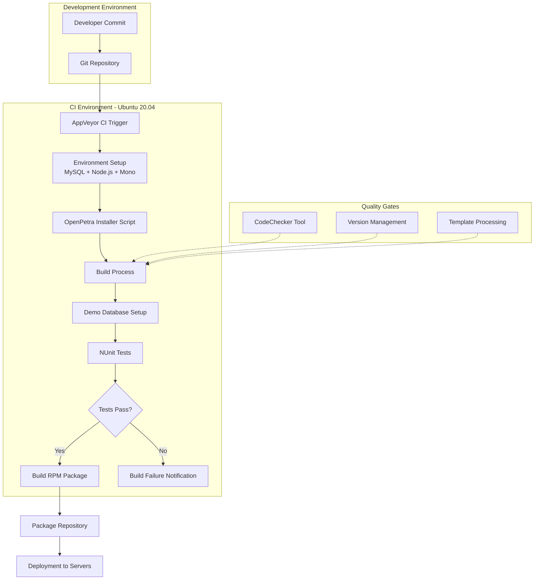
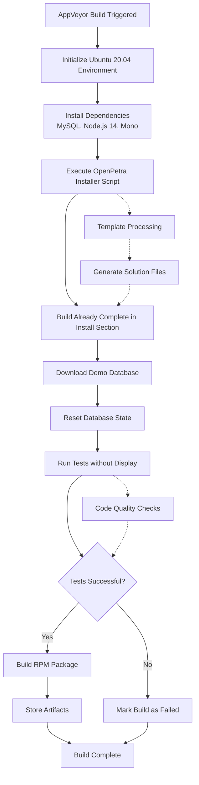
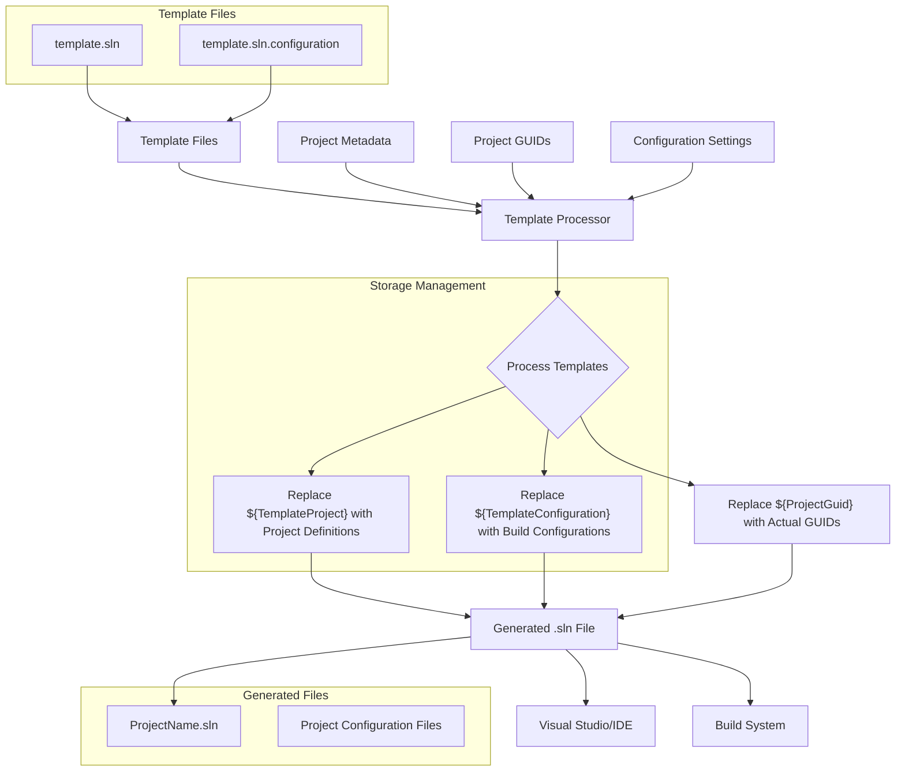
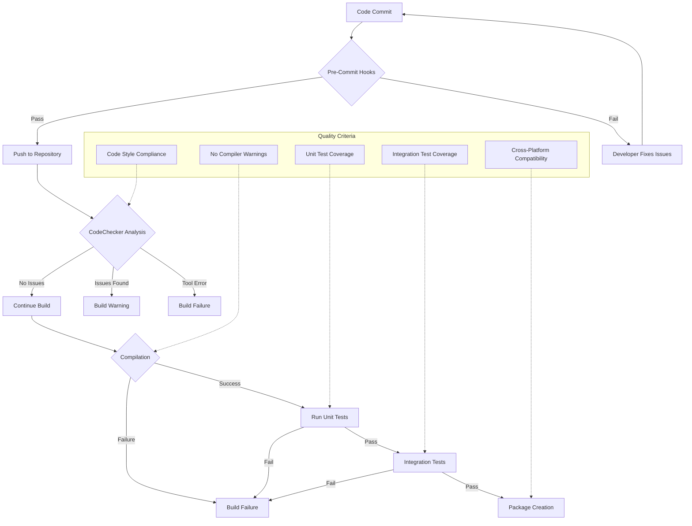
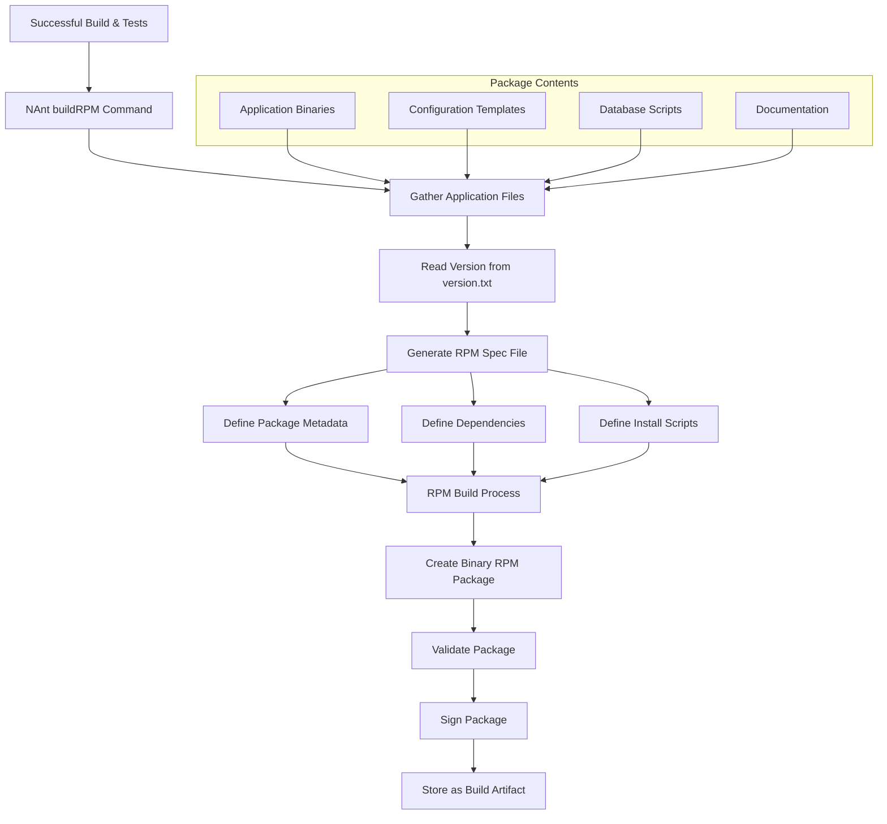

# OpenPetra's CI/CD Pipeline Analysis

## Introduction to OpenPetra's CI/CD Pipeline

OpenPetra's continuous integration and continuous deployment infrastructure represents a sophisticated approach to automating the build, test, and deployment lifecycle for this open-source non-profit management system. The pipeline is designed to support cross-platform compatibility, with particular emphasis on Linux environments while maintaining Windows development capabilities. The architecture leverages AppVeyor as the primary CI service, running on Ubuntu 20.04 with MySQL as the database backend and Node.js 14 for frontend components. 

The pipeline incorporates several key architectural components: version management following a YYYY.MM.PATCH-BUILD format, template-based project structure generation for IDE integration, automated code quality checks, and RPM package creation for Linux deployment. This infrastructure enables developers to commit changes with confidence, knowing that automated processes will validate functionality across platforms before releasing to end users. The system's architecture balances the needs of rapid development iteration with the stability requirements of financial and administrative software used by non-profit organizations.

## OpenPetra CI/CD Pipeline Overview

The diagram illustrates OpenPetra's complete CI/CD workflow from code commit to deployment. When developers commit code to the Git repository, AppVeyor CI is triggered to start the build process on Ubuntu 20.04. The environment is set up with MySQL, Node.js 14, and Mono for .NET compatibility. The OpenPetra installer script (`getopenpetra.sh`) configures the development environment, after which the build process begins.

A demo database is downloaded for testing purposes, and NUnit tests are executed using the `nant test-without-display` command. If tests pass, an RPM package is created using the `nant buildRPM` command, which can then be deployed to production servers. Throughout this process, quality gates such as the CodeChecker tool ensure code standards are maintained, while version management and template processing support the build infrastructure. The pipeline demonstrates a well-integrated approach to continuous integration and deployment that accommodates OpenPetra's cross-platform requirements.

## AppVeyor Configuration for Cross-Platform CI

OpenPetra's AppVeyor configuration demonstrates a sophisticated approach to cross-platform continuous integration. The configuration explicitly targets Ubuntu 20.04 as the build environment, which represents a strategic choice for an application that needs to function across different operating systems. By testing on Linux while supporting Windows development, the team ensures broader compatibility from a single CI pipeline.

The environment setup is particularly noteworthy for its comprehensive approach. It specifies MySQL as the database backend, Node.js 14 for frontend components, and Mono for cross-platform .NET execution. This combination creates a complete runtime environment that closely mirrors production deployments. The configuration also sets a MySQL root password, ensuring consistent database access during automated testing.

Rather than manually configuring each component, the pipeline leverages a single installer script (`getopenpetra.sh`) that bootstraps the entire development environment. This approach significantly reduces configuration complexity and ensures consistency between development, testing, and production environments. The script is executed with the `devenv` parameter and an explicit acknowledgment flag (`--iknowwhatiamdoing=yes`), suggesting that it performs potentially impactful system modifications that require explicit consent.

The testing phase demonstrates particular attention to data requirements. The pipeline downloads a specific demo database from GitHub, ensuring that tests run against a consistent, known dataset. Tests are executed using NAnt, a .NET build tool, with the `test-without-display` target, indicating that the tests are designed to run in headless environments without GUI requirements—essential for CI servers.

Finally, the configuration includes package creation, generating an RPM file suitable for deployment to Linux servers. This step transforms successful builds into deployable artifacts, completing the continuous integration cycle and preparing for continuous deployment.

## AppVeyor Build Process Flow

The AppVeyor build process for OpenPetra follows a well-defined flow that begins with environment initialization and ends with package creation. The process starts by setting up an Ubuntu 20.04 environment with essential dependencies: MySQL for database operations, Node.js 14 for frontend components, and Mono for cross-platform .NET execution.

A key efficiency in the pipeline is the use of the OpenPetra installer script (`getopenpetra.sh`), which automates the entire development environment setup. This script likely handles multiple tasks including dependency resolution, configuration, and initial build steps, as indicated by the note that "building was already done in install section."

For testing, the pipeline downloads a specific demo database from GitHub and resets the database state to ensure consistent test conditions. Tests are then executed using the NAnt build tool with the `test-without-display` target, allowing them to run in headless environments.

Behind the scenes, the build process involves template processing to generate solution files from templates like those found in `/inc/template/vscode/`. These templates contain placeholders that are replaced with actual project information during the build.

If tests pass, the pipeline proceeds to build an RPM package suitable for Linux deployment. This package becomes the deployment artifact. Throughout the process, code quality checks are performed to ensure adherence to project standards. The entire flow is designed to validate changes across platforms while producing deployment-ready artifacts, exemplifying a mature CI/CD approach.

## Version Management Strategy

OpenPetra employs a clear and systematic version numbering system that follows the pattern YYYY.MM.PATCH-BUILD. This approach provides immediate temporal context for each release while supporting traditional semantic versioning concepts. As evidenced in the `db/version.txt` file, which contains the version "2023.02.0-0", the system identifies releases first by year and month of release (2023.02), followed by a patch level (0) and build number (0).

This versioning strategy offers several advantages for a complex, cross-platform application like OpenPetra. The year-month prefix creates an intuitive chronology that helps users and developers immediately understand the recency of a release without needing to interpret abstract version numbers. The patch level allows for incremental updates within a monthly release cycle, while the build number likely corresponds to specific CI/CD pipeline executions, enabling precise tracking of binaries back to their source commits.

The version information is stored in a dedicated file rather than being hardcoded throughout the application, suggesting a centralized approach to version management. This design choice facilitates automated version bumping during the build process and ensures consistency across all components of the application. The build system likely reads this file to embed version information into assemblies, database schemas, and deployment packages.

For database compatibility, storing the version in `db/version.txt` indicates that the version number is also used to track database schema versions, ensuring that application code and database structures remain synchronized during upgrades. This is particularly important for financial software like OpenPetra, where data integrity across versions is critical.

The versioning strategy aligns well with modern continuous delivery practices, providing both human-readable temporal context and machine-processable incremental versioning that supports automated build and deployment processes.

## Project Structure Templates for IDE Integration

OpenPetra employs a sophisticated template-based approach for generating Visual Studio solution files, demonstrating a commitment to maintaining consistent project structures across diverse development environments. This approach is particularly valuable for cross-platform projects where developers may work in different IDEs while contributing to the same codebase.

The system utilizes template files like `template.sln` and `template.sln.configuration` found in the `/inc/template/vscode/` directory. These templates contain strategic placeholders such as `${TemplateProject}`, `${TemplateConfiguration}`, and `${ProjectGuid}` that are dynamically replaced during project generation. This abstraction layer allows the build system to maintain a single source of truth for project structure while accommodating IDE-specific requirements.

The `template.sln` file provides the basic Visual Studio solution structure, defining solution configuration platforms for both Debug and Release builds targeting x86 architecture. This standardization ensures that all developers work with consistent build configurations regardless of their development environment. The template approach also simplifies the maintenance of solution files across the project, as changes to the project structure can be made once in the templates and then propagated to all generated files.

The companion `template.sln.configuration` file contains more granular build settings, defining both Build.0 and ActiveCfg properties for each project configuration. This separation of concerns between the overall solution structure and the specific build configurations demonstrates architectural foresight, making the system more maintainable as it evolves.

This template-based approach also facilitates integration with the continuous integration pipeline. By generating solution files programmatically, the build system can ensure that the project structures used in development environments match those used in automated builds, reducing "works on my machine" issues. The system likely includes a build step that processes these templates to create the actual solution files used by the CI/CD pipeline, ensuring consistency between development and build environments.

## Template Replacement Process

The template replacement process in OpenPetra transforms generic template files into specific project configurations through a systematic placeholder substitution mechanism. The process begins with template files like `template.sln` and `template.sln.configuration`, which contain strategic placeholders that will be replaced with actual project information.

During processing, the system replaces three key types of placeholders:

1. `${TemplateProject}` is replaced with actual project definitions, including project paths, names, and types.
2. `${TemplateConfiguration}` is replaced with specific build configurations for each project, defining how projects should be built in different environments (Debug/Release).
3. `${ProjectGuid}` is replaced with unique GUIDs that identify each project within the solution.

This replacement process is likely executed as part of the build initialization, ensuring that developers and the CI/CD pipeline work with consistent project structures. The process draws from project metadata, configuration settings, and a registry of project GUIDs to populate the templates.

The resulting files are standard Visual Studio solution files that can be opened directly in IDEs or processed by build tools. This approach offers significant advantages: it centralizes project structure definitions, ensures consistency across environments, and simplifies maintenance by allowing structural changes to be made once in templates rather than across multiple solution files.

The template replacement mechanism exemplifies a sophisticated approach to managing project complexity in a cross-platform environment, where development might occur on Windows using Visual Studio while deployment targets Linux servers. By abstracting the project structure into templates, OpenPetra maintains consistency between these diverse environments while accommodating their specific requirements.

## Code Quality Assurance in the Pipeline

OpenPetra's build process incorporates automated code quality checks as a fundamental component of its CI/CD pipeline, with the CodeChecker tool playing a central role in maintaining code standards. This tool, executed via the `RunCodeChecker.bat` script, performs static analysis on the codebase to identify potential issues before they reach production.

The CodeChecker implementation demonstrates sophisticated error handling and result interpretation. The batch script executes `Ict.Tools.CodeChecker.exe` and then evaluates its exit code using a three-way conditional structure. This approach distinguishes between three possible outcomes: errors in the tool itself (negative exit code), successful execution with no issues found (zero exit code), or successful execution that identified code issues (positive exit code). This granular result handling allows the CI/CD pipeline to make informed decisions about whether to proceed with the build or fail fast when quality standards are not met.

The integration of CodeChecker into the build process likely occurs at multiple stages. It may run as a pre-commit hook in development environments, as part of the AppVeyor build process, or both. This multi-layered approach ensures that code quality issues are caught as early as possible in the development lifecycle, reducing the cost of fixes.

While the specific rules enforced by CodeChecker are not explicitly documented in the provided files, the tool likely checks for common issues such as coding standard violations, potential bugs, security vulnerabilities, and performance concerns. The fact that it returns the number of matches found (as indicated by the "MATCHESFOUND" section of the script) suggests that it performs pattern-based analysis against a predefined ruleset.

This automated code quality assurance approach is particularly valuable for an open-source project like OpenPetra, where contributions may come from developers with varying levels of familiarity with the codebase and its standards. By automating these checks, the project maintains consistent quality while reducing the burden on human reviewers to catch routine issues.

## Code Quality Gates

OpenPetra's CI/CD pipeline implements multiple code quality gates that code must pass before reaching production. The process begins with pre-commit hooks that may run initial checks locally before code is pushed to the repository. Once committed, the code enters the formal quality assessment process.

The first major quality gate is the CodeChecker analysis, which performs static code analysis to identify potential issues. As shown in the `RunCodeChecker.bat` script, this tool can produce three distinct outcomes: no issues found (success), issues identified (warning), or tool execution errors (failure). The number of issues found is captured in the exit code, allowing for quantitative tracking of code quality over time.

If code passes the static analysis, it proceeds to compilation. This gate verifies that the code builds successfully across target platforms, with special attention to cross-platform compatibility between Windows development environments and Linux deployment targets. The AppVeyor configuration shows that builds occur on Ubuntu 20.04, ensuring Linux compatibility.

Successful compilation leads to unit testing, where the code must pass automated tests executed via NAnt with the `test-without-display` target. These tests run against a consistent demo database to ensure reproducible results. Following unit tests, integration tests likely verify the interaction between different components of the system.

Finally, if all previous gates are passed, the code reaches the package creation stage, where an RPM package is built for deployment. This final gate ensures that the code can be properly packaged for distribution.

Throughout these gates, multiple quality criteria are enforced: code style compliance (via CodeChecker), absence of compiler warnings, adequate test coverage, and cross-platform compatibility. This multi-layered approach to quality assurance helps maintain the reliability and maintainability of the OpenPetra codebase across its diverse deployment environments.

## Third-Party Dependency Management

OpenPetra's approach to third-party dependency management demonstrates careful consideration of cross-platform compatibility requirements, particularly for a system that must function across Windows development environments and Linux deployment targets. The project's handling of ICSharpCode libraries provides insight into this strategy.

As documented in the `csharp/ThirdParty/ICSharpCode/readme.txt` file, OpenPetra incorporates specific versions of third-party libraries with deliberate modifications to ensure cross-platform compatibility. For instance, ICSharpCode.SharpZipLib.dll is compiled specifically for .NET 4.0 to "avoid warnings on the linux build server." This custom compilation indicates a proactive approach to dependency management, where the team doesn't simply use off-the-shelf libraries but adapts them to meet the project's specific cross-platform requirements.

The documentation also precisely specifies the versions of incorporated libraries (SharpZipLib version 0.86.0.518 and NRefactory from SharpDevelop 4.1.0.8000), establishing clear traceability for these dependencies. This level of detail facilitates future updates and security audits by making it immediately clear which versions are in use.

The organization of third-party code in a dedicated directory (`csharp/ThirdParty/`) suggests a centralized approach to dependency management. This structure likely simplifies license compliance, updates, and security audits by keeping external code clearly separated from OpenPetra's own codebase.

The build process likely incorporates these dependencies through explicit references in project files or through the template-based project generation system. The template approach would allow the build system to adapt dependency references based on the target platform, potentially using different references or compilation flags for Windows versus Linux builds.

This thoughtful approach to third-party dependency management helps OpenPetra maintain compatibility across diverse environments while minimizing the maintenance burden associated with external code. By carefully documenting and sometimes modifying third-party libraries, the project ensures that dependencies support rather than hinder its cross-platform objectives.

## Packaging and Deployment Strategies

OpenPetra employs a Linux-centric packaging and deployment strategy, with RPM (Red Hat Package Manager) packages serving as the primary deployment artifact. This approach aligns with the project's emphasis on Linux server deployments while maintaining Windows development capabilities.

The AppVeyor configuration reveals that RPM package creation is a distinct step in the CI/CD pipeline, executed after successful testing with the command `nant buildRPM`. This integration of packaging into the automated build process ensures that every successful build produces a deployable artifact, facilitating continuous deployment practices.

The use of RPM packages offers several advantages for OpenPetra's deployment context. RPM provides robust dependency management, ensuring that all required components are installed alongside the application. It supports clean installation, upgrade, and removal processes, which are essential for maintaining production systems. Additionally, RPM packages can include scripts for pre-installation and post-installation tasks, allowing OpenPetra to handle database migrations, configuration updates, and service management during deployment.

The choice of RPM also indicates a target deployment environment of Red Hat-compatible Linux distributions (such as CentOS, Fedora, or RHEL), which are common choices for server deployments due to their stability and long-term support options. This packaging strategy suggests that while OpenPetra supports cross-platform development, its primary deployment target is Linux server environments.

The version numbering system (YYYY.MM.PATCH-BUILD) likely integrates with the packaging process, with the version information from `db/version.txt` being incorporated into the RPM package metadata. This ensures that deployed packages are clearly identifiable and that version compatibility can be verified during upgrades.

While the provided files don't detail the specific deployment mechanisms after package creation, the RPM-based approach suggests that OpenPetra likely uses standard Linux package repositories or configuration management tools (such as Ansible, Puppet, or Chef) for deployment to production environments. This would allow for consistent, repeatable deployments across multiple servers while maintaining an audit trail of installed versions.

## Deployment Package Creation Process

The deployment package creation process for OpenPetra transforms a successful build into a deployable RPM package through a series of well-defined steps. The process begins after all tests have passed, triggered by the `nant buildRPM` command as specified in the AppVeyor configuration.

First, the system gathers all necessary application files, including compiled binaries, configuration templates, database scripts, and documentation. It then reads the current version from `db/version.txt` (e.g., "2023.02.0-0"), which will be incorporated into the package metadata to ensure proper versioning and upgrade paths.

Next, the process generates an RPM specification file that defines the package characteristics. This includes package metadata (name, version, release, summary, description), dependencies on other packages (such as Mono for .NET execution), and installation scripts that handle tasks like database initialization, user creation, and service configuration.

The RPM build process then compiles these components into a binary RPM package. This package is validated to ensure it contains all required files and that installation scripts function correctly. The package may also be digitally signed to verify its authenticity before being stored as a build artifact.

The resulting RPM package encapsulates everything needed to deploy OpenPetra to a Linux server, including the application itself and the logic to configure it properly in the target environment. This comprehensive packaging approach simplifies deployment and ensures consistency across installations.

The integration of this package creation process into the CI/CD pipeline means that every successful build produces a deployment-ready artifact. This tight coupling between building, testing, and packaging enables rapid, reliable deployments and supports OpenPetra's continuous delivery objectives while maintaining the quality standards necessary for financial and administrative software.

[Generated by the Sage AI expert workbench: 2025-03-30 02:22:57  https://sage-tech.ai/workbench]: #