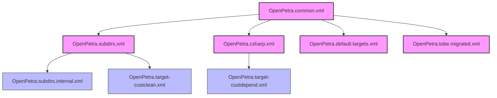
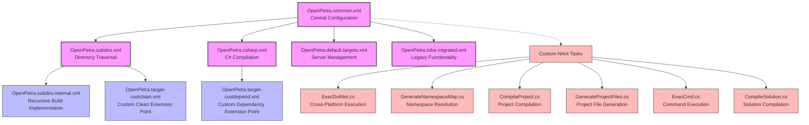
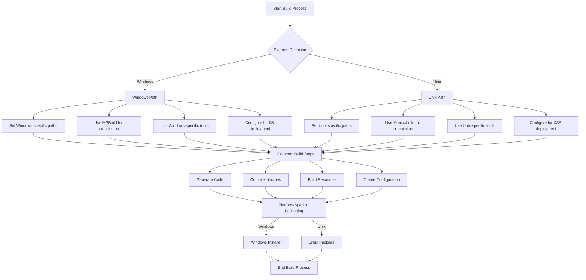
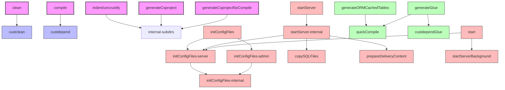

# NAnt Scripts in OpenPetra: Building a Cross-Platform Foundation

## Introduction to NAnt in OpenPetra

OpenPetra's build system is built upon NAnt, an XML-based build tool similar to Apache Ant but designed specifically for the .NET ecosystem. This choice provides OpenPetra with a robust, cross-platform foundation for its build processes, enabling consistent compilation and deployment across Windows and Unix environments. NAnt serves as the orchestration layer that coordinates the various build tasks, from code compilation to resource generation, ensuring that OpenPetra's components are properly assembled regardless of the underlying operating system.

The NAnt scripts in OpenPetra form a hierarchical structure of build files that define targets, properties, and tasks. These scripts handle everything from basic compilation to more complex operations like code generation, database setup, and deployment packaging. By leveraging NAnt's extensibility, OpenPetra has also implemented custom tasks that address specific build requirements not covered by NAnt's standard functionality.

## Core NAnt Script Structure

OpenPetra's NAnt build system is organized around a set of core script files that define the fundamental build infrastructure. At the heart of this system is `OpenPetra.common.xml`, which serves as the central configuration file defining essential properties, paths, and utility functions used throughout the build process. This file establishes directory structures, version information, database settings, and platform-specific configurations.

The build system uses `OpenPetra.subdirs.xml` to define targets that operate recursively across subdirectories, enabling modular build processes. This file includes default targets like `clean`, `indent` (alias `uncrustify`), `depend`, `compile`, and `generateCsproject` variants. Each target sets a property and calls the `internal-subdirs` target, which is implemented in `OpenPetra.subdirs.internal.xml`.

For C# code compilation, `OpenPetra.csharp.xml` defines targets for building and formatting C# code, integrating with MSBuild when available or falling back to a custom CSC-based approach. The script also handles code formatting through the `indent`/`uncrustify` targets.

Additional specialized files like `OpenPetra.default.targets.xml` implement functionality for managing the OpenPetra server environment, including initializing configuration files, starting and stopping the server, and preparing delivery content.

Extension points are provided through files like `OpenPetra.target-custdepend.xml` and `OpenPetra.target-custclean.xml`, which define empty targets that can be overridden to customize the build process without modifying core build files.



## NAnt Script Hierarchy

The NAnt script hierarchy in OpenPetra follows a well-structured organization that enables modular and extensible build processes. The diagram below illustrates the relationships between core scripts, specialized targets, and custom tasks.



The hierarchy starts with `OpenPetra.common.xml` as the foundation, which defines essential properties and paths used throughout the build system. This file includes utility functions implemented in C# script for path manipulation, GUID generation, and program file location detection.

The directory traversal mechanism is implemented through `OpenPetra.subdirs.xml` and its internal implementation `OpenPetra.subdirs.internal.xml`, which enable recursive execution of build files across the project structure.

Custom NAnt tasks extend the build system's capabilities, providing specialized functionality for cross-platform execution, namespace mapping, project compilation, and file generation. These tasks are implemented in C# and integrated into the NAnt framework through attributes and inheritance.

Extension points like `OpenPetra.target-custclean.xml` and `OpenPetra.target-custdepend.xml` allow for customization of the build process without modifying core build files, promoting a modular and maintainable build system.

## Custom NAnt Tasks

OpenPetra extends NAnt's functionality through a collection of custom tasks implemented in C#. These tasks enhance the build system's capabilities, particularly in areas specific to OpenPetra's cross-platform requirements and code generation needs.

The `ExecDotNet` task extends NAnt's standard `ExecTask` to provide cross-platform execution of .NET programs. It automatically detects when running on Linux/Mono environments and modifies the execution command accordingly, prefixing it with 'mono' and adjusting arguments. This task is crucial for ensuring that .NET executables can be run consistently across different operating systems.

```csharp
[TaskName("ExecDotNet")]
public class ExecDotNetTask : NAnt.Core.Tasks.ExecTask
{
    protected override void ExecuteTask()
    {
        if (NAnt.Core.PlatformHelper.IsMono)
        {
            string origProgramFileName = ProgramFileName;
            this.FileName = "mono";
            this.CommandLineArguments = origProgramFileName + " " + this.CommandLineArguments;
        }
        
        base.ExecuteTask();
    }
}
```

The `GenerateNamespaceMap` task creates mapping files between namespaces and their containing directories/DLLs. It parses C# files to extract namespace declarations and using statements, building a comprehensive map of project dependencies. This task is essential for resolving dependencies during the build process and generating appropriate project files.

The `CompileProject` task compiles C# projects from .csproj files, supporting compilation by project name, specific C# file, or direct .csproj file path. It offers two compilation methods: using the C# compiler directly or generating a solution for MSBuild, with platform-specific handling for Windows and Linux.

Other custom tasks include `ExecCmd` for executing shell commands with platform-specific adaptations, `CompileSolution` for compiling Visual Studio solution files, and `GenerateProjectFiles` for creating project files and solution files based on dependency maps.

These custom tasks significantly extend NAnt's capabilities, enabling OpenPetra to implement a sophisticated build system that handles cross-platform compilation, code generation, and project management.

## Cross-Platform Compatibility

OpenPetra's NAnt build scripts are designed with cross-platform compatibility as a core principle, enabling the software to be built and deployed on both Windows and Unix environments. This compatibility is achieved through careful platform detection and conditional logic throughout the build scripts.

The foundation of this cross-platform support is established in `OpenPetra.common.xml`, which uses platform detection to set appropriate paths, tools, and configurations:

```xml
<if test="${'win32'==platform::get-name()}" >
  <echo>Running on MS Windows</echo>
  <!-- Windows-specific settings -->
</if>
<if test="${'unix'==platform::get-name()}">
  <echo>Running on Unix</echo>
  <!-- Unix-specific settings -->
</if>
```

For external tools and dependencies, the build system uses different approaches depending on the platform. On Windows, it searches for programs in standard Program Files directories (handling both 32-bit and 64-bit paths), while on Unix it relies on tools being available in the system path or in specific locations common to Linux distributions.

The custom `ExecDotNet` task exemplifies this cross-platform approach by automatically detecting the runtime environment and adjusting the execution command accordingly:

```csharp
if (NAnt.Core.PlatformHelper.IsMono)
{
    string origProgramFileName = ProgramFileName;
    this.FileName = "mono";
    this.CommandLineArguments = origProgramFileName + " " + this.CommandLineArguments;
}
```

Similarly, the `CompileProject` task handles platform-specific compiler options by replacing '/' with '-' for Unix systems when invoking the C# compiler.

For server operations, the build scripts implement different approaches for starting and stopping the OpenPetra server based on the platform, using xsp4 on Unix and different mechanisms on Windows.

This comprehensive approach to cross-platform compatibility ensures that OpenPetra can be built, deployed, and operated consistently across different operating systems, making it accessible to a wider range of users and developers.

## Platform-Specific Build Flow

The OpenPetra build process adapts to different operating systems through platform-specific execution paths. The following diagram illustrates how the build flow diverges for Windows and Unix environments while maintaining a common core structure.



The build process begins with platform detection, which determines whether the build is running on Windows or Unix. Based on this detection, platform-specific paths, tools, and configurations are set.

On Windows, the build process typically uses MSBuild for compilation when available, leveraging the native .NET build system. It configures paths to find tools in Program Files directories and prepares for deployment in Windows environments, potentially with IIS integration.

On Unix systems, the build process uses Mono and its associated tools like xbuild or mcs for compilation. It relies on tools being available in the system path and configures for deployment with XSP, Mono's web server.

Despite these platform-specific differences, the core build steps remain consistent across platforms: generating code, compiling libraries, building resources, and creating configurations. This ensures that the resulting application behaves consistently regardless of the build environment.

The final packaging step again diverges based on platform, producing appropriate installation packages for each target environment: Windows installers for Windows systems and Linux packages (like DEB or RPM) for Unix systems.

This adaptive build flow enables OpenPetra to maintain a single codebase while supporting multiple deployment environments, a key requirement for cross-platform open-source software.

## Directory Structure and Path Management

OpenPetra's NAnt build scripts implement a sophisticated approach to directory structure and path management that ensures consistency across different environments. The system defines a hierarchical directory structure with clear separation of concerns, managed through properties defined in `OpenPetra.common.xml`.

The root directory structure is established early in the build process:

```xml
<property name="dir.buildfiles" value="${OP::get-current-buildfile()}" overwrite="false" />
<property name="dir.incdir" value="${directory::get-parent-directory(dir.buildfiles)}" overwrite="false" />
<property name="dir.root" value="${directory::get-parent-directory(dir.incdir)}" overwrite="false" />
```

From these foundational paths, the build system defines more specific directories:

1. **Include directories** - Templates, configurations, and NAnt tasks
   ```xml
   <property name="dir.incdir.template" value="${path::combine(dir.incdir, 'template')}" overwrite="false" />
   <property name="dir.incdir.template.etc" value="${path::combine(dir.incdir.template, 'etc')}" overwrite="false" />
   <property name="dir.incdir.template.src" value="${path::combine(dir.incdir.template, 'src')}" overwrite="false" />
   ```

2. **Source code directories** - C# code, third-party libraries, and SQL scripts
   ```xml
   <property name="dir.csharp" value="${path::combine(dir.root, 'csharp')}" overwrite="false" />
   <property name="dir.3rdParty" value="${path::combine(dir.csharp, 'ThirdParty')}" overwrite="false" />
   <property name="dir.sql" value="${path::combine(dir.csharp, 'ICT/Petra/Server/sql')}" overwrite="false" />
   ```

3. **Output directories** - Compiled binaries, object files, and deployment packages
   ```xml
   <property name="dir.delivery" value="${path::combine(dir.root, 'delivery')}" overwrite="false" />
   <property name="dir.bin" value="${path::combine(dir.delivery, 'bin')}" overwrite="false" />
   <property name="dir.obj" value="${path::combine(dir.delivery, 'obj')}" overwrite="false" />
   <property name="dir.setup" value="${path::combine(dir.delivery, 'setup')}" overwrite="false" />
   ```

To handle path differences between platforms, the build system includes utility functions implemented in C# script:

1. **GetRelativePath** - Calculates relative paths between directories, handling cross-platform path separators
2. **MakeAbsolute** - Converts relative paths to absolute paths
3. **GetFileInProgramDirectory** - Locates files in platform-specific program directories

For Windows systems, the build scripts include special handling for mapped drives using the `GetRealPath` function, which reverses the effect of the MSDOS subst command to ensure consistent path resolution.

The build system also manages symbolic links differently based on the platform. On Unix systems, it creates symbolic links for web service files, SQL upgrade files, and JavaScript client files, while on Windows it uses direct file copying.

This comprehensive approach to directory structure and path management ensures that OpenPetra's build process works consistently across different environments, a critical requirement for cross-platform software.

## Build Targets and Dependencies

OpenPetra's NAnt build system defines a comprehensive set of build targets with carefully managed dependencies. These targets represent the various operations that can be performed during the build process, from cleaning the workspace to compiling code and generating documentation.

The core targets are defined in `OpenPetra.subdirs.xml` and include:

1. **clean** - Removes all generated files and build artifacts
2. **indent/uncrustify** - Formats code according to project guidelines
3. **depend** - Resolves dependencies between projects
4. **compile** - Compiles the source code
5. **generateCsproject** - Generates C# project files

Additional specialized targets are defined in other build files:

- **initConfigFiles** - Generates configuration files for server and testing
- **startServer/stopServer** - Manages the OpenPetra server
- **prepareDeliveryContent** - Sets up necessary files for server deployment
- **generateORMCachedTables** - Generates cached tables for ORM
- **generateGlue** - Creates interface glue code between client and server

Dependencies between targets are managed through the `depends` attribute, which ensures that prerequisite targets are executed before the current target:

```xml
<target name="clean" depends="custclean">
  <property name="target" value="clean" />
  <call target="internal-subdirs" />
</target>
```

The `custdepend` and `custclean` targets serve as extension points where custom build logic can be injected without modifying the core build files. These targets are conditionally included if they don't already exist:

```xml
<if test="${not target::exists('custdepend')}">
  <include buildfile="OpenPetra.target-custdepend.xml"/>
</if>

<target name="compile" depends="custdepend"/>
```

The recursive build mechanism implemented in `OpenPetra.subdirs.internal.xml` enables targets to be executed across all subdirectories, ensuring that operations like cleaning and compilation are applied consistently throughout the project structure.

## Target Dependency Graph

The following diagram illustrates the dependencies between major build targets in OpenPetra's NAnt build system, showing the order of execution and relationships between different build operations.



The dependency graph shows several key target groups:

1. **Core Build Targets** - Basic operations like clean, compile, and indent that form the foundation of the build process. These targets typically depend on extension points like custclean and custdepend, allowing for customization.

2. **Configuration Targets** - The initConfigFiles hierarchy prepares configuration files for different components of the system, with specialized targets for server and admin configurations.

3. **Server Management Targets** - Targets like startServer, stopServer, and prepareDeliveryContent handle the deployment and operation of the OpenPetra server.

4. **Code Generation Targets** - Specialized targets like generateORMCachedTables and generateGlue produce code artifacts that are then compiled into the final application.

The graph also illustrates how targets are organized hierarchically, with high-level targets depending on more specialized ones. For example, the startServer target depends on startServer-internal, which in turn depends on initConfigFiles-server, copySQLFiles, and prepareDeliveryContent.

This structured approach to target dependencies ensures that build operations are executed in the correct order, with prerequisites satisfied before dependent operations are performed. It also provides clear entry points for different build scenarios, from full builds to more targeted operations like code generation or server management.

## Code Generation Integration

OpenPetra's NAnt build system integrates sophisticated code generation tools that produce interfaces, glue code, and other artifacts during the build process. This code generation is a critical part of OpenPetra's architecture, enabling the separation of client and server components while maintaining type safety and consistency.

The primary code generation targets are defined in `OpenPetra.tobe.migrated.xml`:

```xml
<target name="generateORMCachedTables" depends="" description="Generates the cached tables">
  <loadtasks assembly="${Ict.Tools.NAntTasks.DLL}" unless="${task::exists('ExecDotNet')}"/> 
  <property name="CachedTableParameters" value="-petraxml:${PetraXML.file} -outputshared:${dir.root}/csharp/ICT/Petra/Shared -TemplateDir:${dir.incdir.template.src}"/>
  <ExecDotNet program="${tool-generateORM}" commandline="-do:cachedtables ${CachedTableParameters} -cachedef:${dir.root}/csharp/ICT/Petra/Definitions/CacheableTablesAndLists.yaml"/>
  <!-- Additional commands -->
</target>

<target name="generateGlue" depends="" description="Generate the glue between client and server, ie. interfaces and instantiators">
  <loadtasks assembly="${Ict.Tools.NAntTasks.DLL}" unless="${task::exists('ExecDotNet')}"/>
  <property name="module" value="all" overwrite="false"/>
  <property name="compileForStandalone" value="false" overwrite="false"/>
  <nant inheritall="true" target="custdependGlue" buildfile="${path::combine(dir.csharp, 'ICT/Petra/Plugins/Plugins.build')}" verbose="${verbose}"/>
  <ExecDotNet program="${dir.bin}/Ict.Tools.GenerateGlue.exe" commandline="-ymlfile:${dir.root}/csharp/ICT/Petra/Definitions/NamespaceHierarchy.yml -outputdir:${dir.root}/csharp/ICT/Petra -TemplateDir:${dir.incdir.template.src} -module:${module} -compileForStandalone:${compileForStandalone}"/>
  <!-- Additional commands -->
</target>
```

These targets invoke specialized tools that analyze the codebase and generate appropriate artifacts:

1. **ORM Cached Tables Generation** - Creates cached table definitions based on YAML configuration files, enabling efficient data access patterns.

2. **Glue Code Generation** - Produces interface definitions and implementation classes that bridge the client and server components, facilitating remote method invocation.

The code generation tools themselves are implemented as C# applications in the `csharp/ICT/BuildTools` directory:

- **CSParser** - Parses C# source files to extract namespace, class, and method information
- **AutoGenerationTools** - Provides utility functions for code generation
- **TInsertIntoRegion** - Modifies existing source files by replacing content within specified regions
- **CreateInterfaces** - Generates interface files for shared code
- **TNamespace** - Manages namespace hierarchies for code generation

The integration between NAnt and these code generation tools is facilitated by custom NAnt tasks like `GenerateNamespaceMap`, which creates mappings between namespaces and their containing directories/DLLs, and `ExecDotNet`, which ensures cross-platform execution of the code generation tools.

After code generation, the build system triggers a compilation step to incorporate the generated code into the final assemblies:

```xml
<echo message="now run: nant quickCompile -D:onlyonce=true"/>
```

This integration of code generation into the build process enables OpenPetra to maintain a clean separation between components while ensuring type safety and consistency across the codebase.

## Extension Points and Customization

OpenPetra's NAnt build system incorporates a thoughtful design for extensibility through well-defined extension points. These extension points allow for customization of the build process without modifying the core build files, promoting maintainability and enabling project-specific adaptations.

The primary extension mechanisms are the `custdepend` and `custclean` targets, which are defined in separate files and conditionally included in the build process:

```xml
<if test="${not target::exists('custclean')}">
  <include buildfile="OpenPetra.target-custclean.xml"/>
</if>

<target name="clean" depends="custclean">
  <property name="target" value="clean" />
  <call target="internal-subdirs" />
</target>
```

```xml
<if test="${not target::exists('custdepend')}">
  <include buildfile="OpenPetra.target-custdepend.xml"/>
</if>

<target name="compile" depends="custdepend"/>
```

These targets are initially defined as empty placeholders:

```xml
<target name="custclean" />
```

```xml
<target name="custdepend" />
```

However, they can be overridden by providing custom implementations in project-specific build files. This allows projects to inject custom logic into the build process at well-defined points without modifying the core build infrastructure.

Another extension mechanism is the conditional inclusion of the `internal-subdirs` implementation:

```xml
<if test="${not target::exists('internal-subdirs')}">
  <include buildfile="OpenPetra.subdirs.internal.xml"/>
</if>
```

This allows for overriding the core subdirectory processing logic if needed, providing flexibility for projects with specialized directory structures or build requirements.

The build system also supports user-specific configuration through property files:

```xml
<property name="userconfig.file" value="${path::combine(dir.root,'OpenPetra.build.config.my')}" overwrite="false" />
<include buildfile="${userconfig.file}" verbose="true" if="${file::exists(userconfig.file)}"/>
```

This enables developers to customize build settings without modifying the shared build files, promoting collaboration in team environments.

For plugin development, the build system includes specialized extension points like `custdependGlue`:

```xml
<nant inheritall="true" target="custdependGlue" buildfile="${path::combine(dir.csharp, 'ICT/Petra/Plugins/Plugins.build')}" verbose="${verbose}"/>
```

This allows plugins to participate in the code generation process, ensuring that their interfaces and glue code are properly generated.

These extension mechanisms collectively provide a flexible and maintainable build system that can be adapted to various project requirements without compromising the core build infrastructure.

## Conclusion and Best Practices

OpenPetra's NAnt build system exemplifies a well-designed approach to cross-platform build automation for complex .NET applications. Through careful analysis of the build scripts and supporting code, several key strengths and best practices emerge:

**Modular Structure**: The build system is organized into a hierarchy of specialized build files, each with a clear responsibility. This modular approach enhances maintainability by keeping individual files focused and manageable. The separation of core functionality from extension points allows for customization without modifying central files.

**Cross-Platform Support**: The build scripts incorporate comprehensive platform detection and conditional logic to handle differences between Windows and Unix environments. Custom tasks like `ExecDotNet` abstract away platform-specific details, providing a consistent interface for build operations across different operating systems.

**Extensibility**: Well-defined extension points like `custdepend` and `custclean` enable customization without modifying core build files. This approach promotes maintainability and allows for project-specific adaptations while preserving the integrity of the shared build infrastructure.

**Code Generation Integration**: The build system seamlessly integrates sophisticated code generation tools that produce interfaces, glue code, and other artifacts. This integration enables OpenPetra's architecture to maintain clean separation between components while ensuring type safety and consistency.

**Path Management**: Robust path handling mechanisms ensure that file and directory references work correctly across different environments. Utility functions for path manipulation, relative path calculation, and platform-specific directory resolution contribute to the system's reliability.

**Dependency Management**: Clear definition of target dependencies ensures that build operations are executed in the correct order, with prerequisites satisfied before dependent operations are performed. This structured approach provides clear entry points for different build scenarios.

**Custom Task Implementation**: The system extends NAnt's capabilities through well-designed custom tasks implemented in C#. These tasks address specific requirements not covered by NAnt's standard functionality, enhancing the build system's power and flexibility.

For developers working with or extending OpenPetra's build system, several best practices should be followed:

1. Leverage existing extension points rather than modifying core build files
2. Maintain cross-platform compatibility when adding new build functionality
3. Document dependencies between targets to ensure proper execution order
4. Use platform detection for environment-specific operations
5. Implement custom tasks for specialized functionality rather than complex inline script
6. Maintain separation between build logic and build configuration

OpenPetra's NAnt build system demonstrates that even with modern build tools available, a well-designed NAnt-based system can provide a robust, flexible, and maintainable foundation for cross-platform .NET applications. Its modular structure, cross-platform support, and extensibility make it a valuable reference for similar projects facing complex build requirements.

[Generated by the Sage AI expert workbench: 2025-03-30 02:22:57  https://sage-tech.ai/workbench]: #