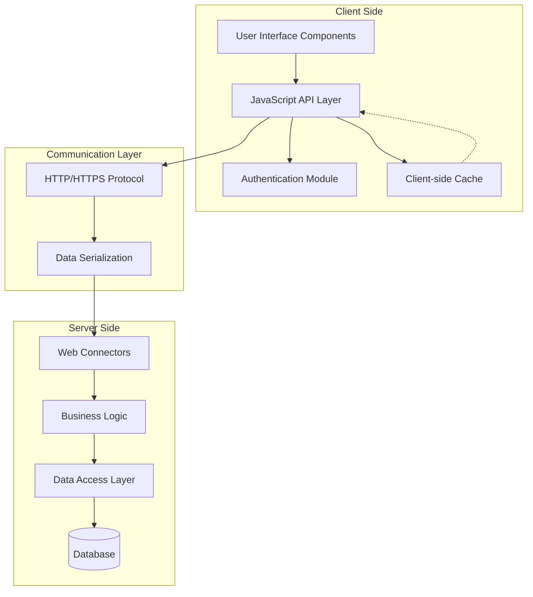
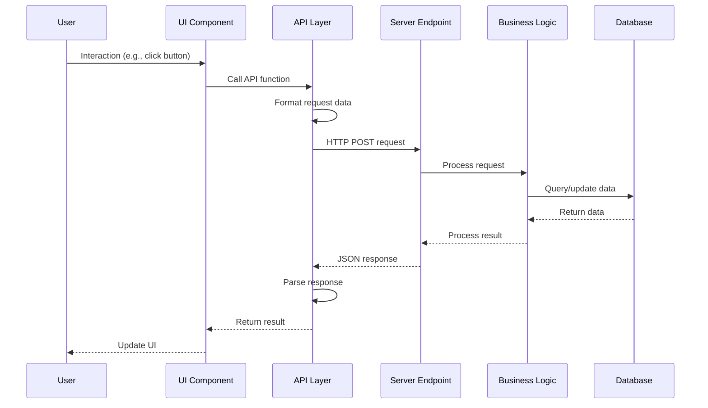
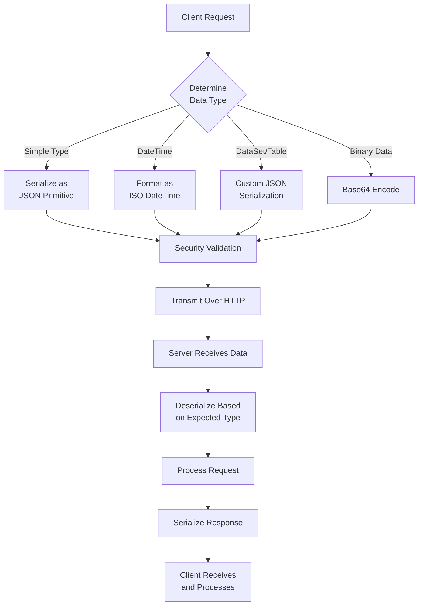
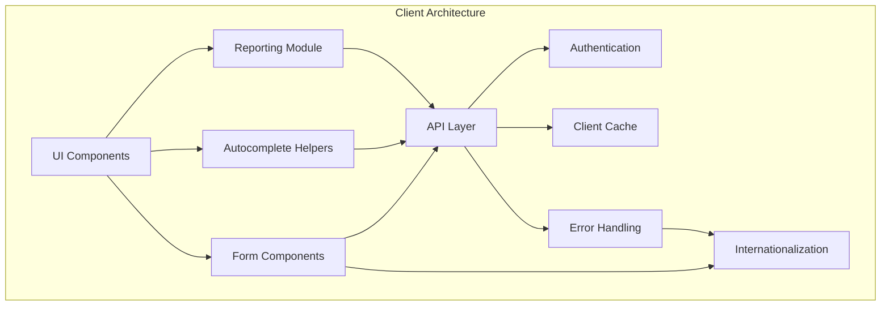

# Client-Server Communication in OpenPetra

## Architecture Overview

OpenPetra implements a client-server architecture with a JavaScript web client communicating with a C# server through HTTP API calls, enabling cross-platform access to non-profit management functionality. The system uses a modern web-based approach where the JavaScript client runs in the browser and makes asynchronous calls to the server-side components. This architecture allows OpenPetra to provide a responsive user experience while maintaining centralized business logic and data management on the server.

## OpenPetra Communication Architecture

The architecture diagram illustrates how OpenPetra's components interact across the client-server boundary. The JavaScript client contains UI components that interact with the API layer, which handles authentication and caching. Communication occurs over HTTP/HTTPS, with data serialization transforming objects between client and server formats. On the server side, web connectors receive requests and route them to the appropriate business logic components, which interact with the database through the data access layer.

## HTTP Communication Protocol

Communication between client and server uses HTTP POST requests to ASMX web service endpoints, with parameters and responses serialized as JSON for JavaScript clients. The client sends requests to specific endpoints like `serverMFinance.asmx/TGiftSetupWebConnector_LoadMotivationDetails` with parameters encoded as JSON in the request body. The server processes these requests and returns responses in a standardized JSON format that includes both result data and verification information for error handling. This approach leverages standard web technologies while providing a structured interface for the application's functionality.

## Client-Side API Framework

The client uses a custom Axios-based API framework (ajax.js) that handles content types, error responses, and provides consistent interfaces for all server communications. This framework configures Axios instances with appropriate base URLs and response types, sets up JSON content type headers for POST requests, and implements response interceptors for error handling. The framework provides two main Axios instances: 'api' for server API communication and 'src' for accessing report parameter files. This abstraction simplifies the client-side code by providing a consistent interface for all server interactions.

## Request-Response Flow

This sequence diagram shows a typical flow for client-server communication in OpenPetra. When a user interacts with the UI, the component calls the API layer, which formats the request data and sends an HTTP POST request to the server endpoint. The server processes the request through its business logic layer, interacts with the database as needed, and returns a JSON response. The API layer parses this response and returns the result to the UI component, which updates the interface accordingly.

## Authentication and Session Management

The Auth class manages user authentication state using localStorage for persistence and implements session validation through regular polling to maintain connectivity. It provides methods for login, logout, session validation, and self-service account management. Authentication state is stored in localStorage variables including 'username', 'authenticated' timestamp, and 'mustchangepassword' flag. The system maintains session validity by polling the server every 30 seconds with a keepConnection() function, and performs more thorough session validation checks every 5 minutes. If a session expires, the client automatically logs out the user and reloads the page.

## Data Serialization

THttpBinarySerializer handles conversion between .NET objects and JSON strings, with special handling for complex types like DataSets and verification results. This class detects whether requests come from JavaScript or fat clients and formats data accordingly. For JavaScript clients, it implements special handling for various data types including DataSets, DataTables, DateTime values, and verification results. The serializer also includes security validation to prevent HTML injection attacks in deserialized strings, and provides Base64 encoding/decoding functionality for binary data.

## Data Serialization Process

The flowchart illustrates how data is serialized between client and server. When a client makes a request, the system determines the data type and applies appropriate serialization: simple types become JSON primitives, DateTime values are formatted in ISO format, complex types like DataSets receive custom JSON serialization, and binary data is Base64 encoded. All data undergoes security validation before transmission over HTTP. On the server side, data is deserialized based on the expected type, the request is processed, and the response is serialized for the client to receive and process.

## Error Handling and Verification

The system implements structured error handling with verification results passed from server to client, and client-side display of user-friendly error messages. Server-side errors are captured in TVerificationResultCollection objects that contain error codes and messages. These are serialized and returned to the client as part of the response. The client-side API framework includes response interceptors that detect error responses, parse the verification results, and display appropriate messages to the user. This approach ensures that users receive meaningful feedback when operations fail, while developers have access to detailed error information for troubleshooting.

## Caching Mechanism

OpenPetra optimizes performance through client-side caching of reference data tables, with server endpoints specifically designed to provide cacheable data. The system implements a caching mechanism that identifies tables that change infrequently and can be safely cached on the client side. Server endpoints with "ACacheableTable" parameters support this functionality by returning data with hash codes for cache validation. The client stores these tables in memory and can determine when to refresh the cache by comparing hash codes. This approach significantly reduces network traffic and improves application responsiveness for frequently accessed reference data.

## Client-Side Component Architecture

The client-side architecture consists of several interconnected components. UI components include forms, autocomplete helpers, and reporting modules, all of which interact with the API layer. The API layer manages communication with the server and integrates with authentication, caching, and error handling systems. Internationalization (i18n) is integrated throughout the UI components and error handling to provide localized user experiences. This modular architecture promotes code reuse and separation of concerns, making the system easier to maintain and extend.

## Security Considerations

The communication layer implements security measures including HTML injection prevention, session validation, and proper authentication token management. The system prevents HTML injection attacks by validating input strings for potentially dangerous characters like angle brackets and equals signs. Session validation occurs regularly to ensure that only authenticated users can access protected resources. Authentication tokens are stored securely in localStorage and transmitted to the server with each request. The system also implements proper password handling, with passwords never stored in plain text and secure password reset functionality. These measures help protect both the application and its data from common security threats.

[Generated by the Sage AI expert workbench: 2025-03-30 02:22:57  https://sage-tech.ai/workbench]: #