# Client Architecture in OpenPetra: HTML/CSS Analysis

## Introduction to OpenPetra's Client Architecture

OpenPetra's client-side architecture represents a thoughtful approach to creating a responsive web interface for non-profit administration. The system employs a modern HTML/CSS frontend built on Bootstrap's responsive framework, with a clean separation between structure and presentation. The architecture follows a template-based design where HTML files define the structural components while CSS provides styling and responsive behaviors. 

The client architecture is organized around a central application shell (index.html) that loads modular components based on user navigation. This approach allows OpenPetra to maintain a consistent user experience while dynamically loading only the necessary interface elements for specific tasks. The system leverages placeholders extensively throughout its templates, which get replaced with actual data during rendering, enabling internationalization and dynamic content generation without modifying the core HTML structure.

OpenPetra's client architecture balances modern web development practices with the practical needs of a complex administrative system, providing a foundation that can be extended and maintained across different deployment environments.

## Core HTML Structure and Organization

OpenPetra's HTML structure follows a modular, component-based organization that promotes reusability and maintainability. The system is built around a main application shell (index.html) that provides the foundational structure, including the top navigation bar, sidebar, and content area where specific functionality is loaded.

Templates are organized hierarchically by functional domain (Partner, Finance, SystemManager, etc.) and further subdivided by specific functionality. This organization mirrors the application's logical structure, making it easier for developers to locate and modify relevant components.

A distinctive feature of OpenPetra's HTML organization is the "phantom" storage pattern. Many templates include a `
` section at the beginning that contains reusable HTML fragments like row templates, modal dialogs, and form elements. These fragments are cloned and populated with data dynamically by JavaScript, allowing complex interfaces to be built from simple, reusable components.

Modal dialogs follow a consistent structure with header, body, and footer sections, ensuring uniform user experience across the application. Forms are organized with Bootstrap's grid system, typically using row and column classes to create responsive layouts. The system also employs specialized templates for different contexts, such as maintenance screens (with browse, edit, and create modes), report interfaces, and setup screens.

OpenPetra's HTML structure demonstrates a thoughtful balance between consistency and flexibility, providing a unified user experience while accommodating the diverse requirements of non-profit administration tasks.

## OpenPetra Client Architecture Overview

The diagram illustrates how OpenPetra's client architecture is organized around a central application shell that loads CSS styles and JavaScript files. The JavaScript then dynamically loads HTML templates as needed. The CSS structure shows the hierarchy of stylesheets, with main.css providing core styling that's extended by specialized stylesheets. Templates are categorized by their purpose (forms, reports, modals, emails), and dynamic content is managed through placeholders, phantom storage elements, and template cloning mechanisms.

This architecture enables OpenPetra to provide a responsive, modular interface that can be easily extended and maintained while delivering a consistent user experience across different functional areas of the application.

## CSS Framework and Styling Approach

OpenPetra employs a structured CSS approach built on Bootstrap 4.6.1 as its foundation, providing a responsive grid system and consistent component styling. The CSS architecture is organized into several specialized stylesheets, each with a distinct purpose:

1. **main.css** - The core stylesheet that defines the application's primary layout, including navigation, content areas, and common UI elements. It establishes consistent spacing, typography, and color schemes.

2. **sidebar.css** - Dedicated to the collapsible sidebar navigation, handling its appearance, behavior, and responsive adaptations.

3. **login.css** - Styles the authentication screens with a focused, centered layout and specialized callout components.

4. **autocomplete.css** - Provides styling for the autocomplete functionality used throughout the application for user input assistance.

5. **report.css** - A minimal stylesheet focused on report presentation with appropriate spacing and typography.

The styling approach demonstrates several key principles:

- **Responsive Design**: The CSS implements responsive behaviors using media queries, particularly for the sidebar which collapses to an icon-only view on smaller screens.

- **Utility Classes**: The system includes utility classes for common styling needs like showing/hiding elements, formatting currency values, and handling text overflow.

- **Semantic Styling**: CSS classes often reflect their purpose (e.g., `modal-wide`, `container-list`, `format_currency`) rather than their appearance, promoting maintainability.

- **Mode-Based Display**: The CSS includes attribute selectors for controlling visibility based on application mode (create/edit), allowing the same HTML to serve multiple contexts.

- **Z-index Management**: The CSS carefully manages z-index values to ensure proper layering of elements, particularly for dropdown menus and modal dialogs.

OpenPetra's CSS approach balances the benefits of a standardized framework with custom styling tailored to the specific needs of non-profit administration, resulting in a consistent, responsive interface that works across different devices and screen sizes.

## CSS Structure and Inheritance

The diagram illustrates OpenPetra's CSS structure and inheritance patterns. Bootstrap serves as the foundation, imported by app.css. The main.css file provides core application styling that's extended by specialized stylesheets for specific components. The key styling categories show how different aspects of the interface are managed across the CSS files, with clear responsibilities for layout, navigation, forms, modals, tables, typography, and utilities. This structured approach ensures consistent styling throughout the application while allowing for specialized treatment of different interface elements.

## Template System and Dynamic Content

OpenPetra employs a sophisticated template system that enables dynamic content generation and internationalization without modifying the core HTML structure. This system is built around several key mechanisms:

1. **Placeholder Variables**: Templates use curly brace notation (`{variable}`) for text that should be replaced with dynamic content. These placeholders can represent translated strings, data values, or computed properties. For example, `{caption}` might be replaced with a localized form title, while `{val_p_partner_key_n}` would be replaced with a specific partner's ID.

2. **Phantom Storage**: Many templates include a `
` section that contains reusable HTML fragments. These fragments serve as templates for dynamic content generation and are not directly displayed. The phantom storage pattern allows complex interfaces to be built from simple, reusable components without cluttering the DOM.

3. **Template Cloning**: JavaScript utilities clone elements from phantom storage, populate them with data, and insert them into the visible DOM. This approach enables efficient rendering of lists, tables, and other repeating structures without duplicating HTML.

4. **Conditional Rendering**: Templates use attributes like `mode="create"` or `mode-hide="edit"` to control element visibility based on the current context. This allows the same HTML to serve multiple purposes depending on the application state.

5. **Internationalization**: The template system integrates with i18next for internationalization, allowing all user-facing text to be translated without modifying the HTML structure.

6. **Dynamic Classes and Attributes**: Templates include data attributes and class names that control styling and behavior based on data values or application state.

This template system provides several benefits:

- **Separation of Concerns**: HTML structure is separated from data and behavior, making templates easier to maintain.
- **Reusability**: Common patterns can be defined once and reused throughout the application.
- **Performance**: Only the necessary DOM elements are created and displayed, improving rendering performance.
- **Maintainability**: Changes to layout or structure can be made in one place and applied consistently.

OpenPetra's template system demonstrates a thoughtful approach to dynamic content generation that balances flexibility, performance, and maintainability.

## Template Processing Flow

This diagram illustrates the flow of template processing in OpenPetra, from loading HTML templates with placeholders to rendering the final UI. The process begins with loading the template and server data, then proceeds through template cloning from phantom storage and placeholder replacement with formatted data. The cloned and populated templates are inserted into content containers, conditional display rules are applied, and event handlers are bound to create the final rendered UI. The internationalization process runs in parallel, looking up translations based on the current language and providing them for placeholder replacement.

## Form Design and User Input Handling

OpenPetra's form design follows a structured approach that balances usability with the complex data entry requirements of non-profit administration. Forms are constructed using Bootstrap's grid system with consistent row and column classes, creating a responsive layout that adapts to different screen sizes.

Input fields are organized logically, with related fields grouped together and clear visual separation between different sections. Labels are positioned consistently, typically to the left of their associated input fields, providing a clean and predictable interface. Required fields are visually distinguished, helping users understand what information must be provided.

The system employs several specialized input mechanisms:

1. **Autocomplete Fields**: For complex lookups like partner selection or account codes, OpenPetra implements custom autocomplete functionality that helps users find values while typing. These fields often include a key-name attribute that stores the actual database ID while displaying a more user-friendly value.

2. **Date Inputs**: The system uses HTML5 date inputs where appropriate, providing calendar selection for date fields.

3. **Dropdown Selects**: For fields with predefined options, select elements provide a consistent interface for choosing from available values.

4. **Checkboxes and Radio Buttons**: Boolean options and mutually exclusive choices are represented with standard form controls, styled consistently with Bootstrap classes.

Form validation occurs at multiple levels:

- **Client-side Validation**: JavaScript validates user input before submission, providing immediate feedback on format errors or missing required fields.
- **Server-side Validation**: All input is validated again on the server to ensure data integrity regardless of client-side validation.
- **Visual Feedback**: Validation errors are displayed prominently, with clear messaging about what needs to be corrected.

Form submission is handled through JavaScript event handlers that collect form data, validate it, and send it to the server via AJAX requests. Success and error states are clearly communicated to the user, with appropriate actions taken based on the server response.

OpenPetra's form design demonstrates attention to both usability and data integrity, providing a consistent interface for the complex data entry tasks required in non-profit administration.

## Modal Dialog System

OpenPetra implements a sophisticated modal dialog system for editing data, providing a consistent interface for creating, viewing, and modifying information throughout the application. The modal system is one of the core UI patterns in OpenPetra, handling everything from simple confirmations to complex multi-tab editing interfaces.

The modal dialog system is built on Bootstrap's modal component but extends it with custom functionality for stacking, dynamic content loading, and form handling. Each modal follows a consistent structure with three main sections:

1. **Modal Header**: Contains the dialog title, which changes based on whether the user is creating a new record or editing an existing one.

2. **Modal Body**: Houses the form fields organized in a responsive grid layout. Complex forms are often divided into tabs for better organization.

3. **Modal Footer**: Contains action buttons like Save, Delete, and Close, consistently positioned for predictable user interaction.

The HTML structure for modals is typically defined in the phantom storage section of templates and cloned when needed. This approach allows the same modal structure to be used for both creating and editing records, with minor variations controlled through CSS classes and data attributes.

Key features of the modal dialog system include:

- **Z-index Management**: The system automatically adjusts z-index values to ensure proper stacking when multiple modals are open simultaneously.

- **Dynamic Content**: Modals are populated with data dynamically, either from server responses or from the current view context.

- **Validation Integration**: Form validation is integrated directly into the modal system, with error messages displayed within the modal context.

- **Responsive Design**: Modals adapt to different screen sizes, with the `modal-wide` class providing additional space for complex forms.

- **Consistent Button Placement**: Action buttons follow a consistent pattern across all modals, with destructive actions (like Delete) visually distinguished from standard actions.

The modal dialog system exemplifies OpenPetra's approach to UI design: consistent patterns that can be easily extended and customized for specific use cases while maintaining a cohesive user experience.

## Modal Dialog Components

```mermaid
flowchart TD
    subgraph "Modal Dialog Components"
        ModalTemplate["Modal Template in Phantom Storage"]
        
        ModalTemplate --> ModalStructure["Modal Structure"]
        
        subgraph "Modal Structure"
            ModalDialog["modal-dialog"]
            ModalContent["modal-content"]
            ModalHeader["modal-header"]
            ModalBody["modal-body"]
            ModalFooter["modal-footer"]
            
            ModalDialog --> ModalContent
            ModalContent --> ModalHeader
            ModalContent --> ModalBody
            ModalContent --> ModalFooter
        end
        
        subgraph "Header Components"
            Title["Dialog Title (h3)"]
            CloseButton["Close Button (×)"]
            
            ModalHeader --> Title
            ModalHeader --> CloseButton
        end
        
        subgraph "Body Components"
            Container["Container"]
            FormGroups["Form Groups"]
            InputFields["Input Fields"]
            Labels["Labels"]
            ValidationMessages["Validation Messages"]
            
            ModalBody --> Container
            Container --> FormGroups
            FormGroups --> InputFields
            FormGroups --> Labels
            InputFields --> ValidationMessages
        end
        
        subgraph "Footer Components"
            SaveButton["Save Button"]
            DeleteButton["Delete Button"]
            CloseModalButton["Close Button"]
            
            ModalFooter --> DeleteButton
            ModalFooter --> SaveButton
            ModalFooter --> CloseModalButton
        end
        
        subgraph "Styling Classes"
            ModalWide["modal-wide"]
            BtnPrimary["btn-primary"]
            BtnDanger["btn-danger"]
            BtnLight["btn-light"]
            
            ModalTemplate --> ModalWide
            SaveButton --> BtnPrimary
            DeleteButton --> BtnDanger
            CloseModalButton --> BtnLight
        end
        
        subgraph "JavaScript Functions"
            ShowModal["ShowModal()"]
            CloseModal["CloseModal()"]
            FindModal["FindModal()"]
            ZIndexManagement["Z-index Management"]
            
            ShowModal --> ZIndexManagement
            CloseModal --> ModalTemplate
            FindModal --> ModalTemplate
        end
    end
```

This diagram illustrates the components of OpenPetra's modal dialog system. The modal template is stored in phantom storage and consists of a structured hierarchy including dialog, content, header, body, and footer elements. Each section contains specific components: the header has a title and close button; the body contains a container with form groups, input fields, labels, and validation messages; and the footer includes save, delete, and close buttons with appropriate styling classes. The JavaScript functions manage showing and closing modals, finding modal elements, and handling z-index for proper stacking. This structured approach ensures consistent modal behavior and appearance throughout the application.

## Navigation and Layout Patterns

OpenPetra implements a comprehensive navigation system that combines top navigation, sidebar navigation, and contextual controls to provide intuitive access to the application's functionality. The navigation architecture is designed to balance ease of use with the complex hierarchical structure of a non-profit administration system.

The primary navigation components include:

1. **Top Navigation Bar**: A fixed-position horizontal bar at the top of the screen that contains:
   - Application logo and name
   - Ledger selection dropdown for financial functions
   - User settings and authentication controls
   - Language selection options

2. **Sidebar Navigation**: A collapsible vertical menu that provides hierarchical access to application features:
   - Organized by functional domains (Partner, Finance, System, etc.)
   - Expandable sections with nested menu items
   - Collapsible to a narrow icon bar on smaller screens
   - Visual indicators for current section and expandable items

3. **Contextual Toolbars**: Within specific screens, toolbars provide relevant actions:
   - New/Add buttons for creating records
   - Filter controls for searching and sorting
   - Export/Import functionality
   - Batch operation controls

The layout follows a consistent pattern across the application:

- Fixed-position top navigation bar
- Collapsible sidebar navigation
- Main content area with responsive padding
- Consistent spacing between elements
- Modal dialogs for editing and detailed views

Responsive behaviors are carefully implemented:

- Sidebar collapses to an icon-only view on smaller screens
- Content area adjusts margins to maximize available space
- Tables and grids adapt to available width
- Modal dialogs adjust size based on screen dimensions

Navigation state is preserved across page transitions, maintaining the user's context when moving between different sections of the application. The sidebar remembers expanded sections, and the application restores the user's position when returning to previously visited areas.

OpenPetra's navigation and layout patterns demonstrate a thoughtful approach to information architecture, providing consistent access to functionality while adapting to different screen sizes and user workflows.

## Report Templates and Printing

OpenPetra's report templates and printing system provide a flexible framework for generating formatted documents ranging from financial statements to partner listings. The system uses HTML-based templates with CSS styling to define the structure and appearance of reports, which can then be rendered for screen display, PDF generation, or direct printing.

Report templates follow a consistent structure:

1. **Header Section**: Contains the report title, ledger information, and filtering criteria. This section is often enclosed in a `
` element with nested divs for specific header components.

2. **Column Headings**: Define the structure of tabular data with appropriate column widths and labels.

3. **Content Area**: Contains placeholders for dynamic data, often using ID attributes that will be populated during report generation.

4. **Footer Section**: Optional area for totals, page numbers, and other summary information.

The report system supports several key features:

- **Dynamic Data Binding**: Report templates include placeholders that are replaced with actual data during rendering.

- **SQL Integration**: Many report templates include embedded SQL queries that define the data to be retrieved, with parameters for filtering and customization.

- **Responsive Layout**: Reports use CSS grid classes to create responsive layouts that adapt to different display and printing contexts.

- **Page Breaks**: Templates can include explicit page break instructions for multi-page reports.

- **Conditional Sections**: Parts of a report can be conditionally displayed based on parameters or data values.

- **Formatting Controls**: Special CSS classes provide consistent formatting for dates, currency values, and other data types.

The printing system converts these HTML templates to various output formats:

- **Screen Display**: Reports can be previewed directly in the browser.
- **PDF Generation**: HTML reports are converted to PDF for distribution and archiving.
- **Direct Printing**: Reports can be sent directly to printers.
- **Excel Export**: Data can be exported to Excel for further analysis.

OpenPetra's report templates demonstrate a pragmatic approach to document generation, leveraging web technologies for flexible, consistent reporting across different output formats.

## Future Directions and Improvements

OpenPetra's client-side HTML/CSS architecture has established a solid foundation, but several opportunities for modernization and improvement could enhance the system's maintainability, performance, and user experience.

### Architectural Modernization

1. **Component-Based Architecture**: Moving toward a more formal component-based architecture using modern frameworks like React, Vue, or Angular would improve code organization and reusability. This would replace the current phantom storage pattern with more standardized component definitions.

2. **CSS Preprocessing**: Implementing a CSS preprocessor like SASS or LESS would enable better organization of styles through variables, mixins, and nested rules, reducing duplication and improving maintainability.

3. **CSS-in-JS or CSS Modules**: Adopting scoped CSS approaches would prevent style conflicts and make components more self-contained.

### Technical Improvements

1. **Responsive Design Enhancement**: While the current system includes responsive elements, a more comprehensive approach using modern CSS features like Grid and Flexbox would improve adaptability across devices.

2. **Accessibility Compliance**: Systematically implementing ARIA attributes, keyboard navigation, and other accessibility features would make the application more inclusive.

3. **Performance Optimization**: Implementing code splitting, lazy loading, and modern bundling techniques would improve initial load times and overall performance.

4. **Browser Compatibility**: Updating the browser detection approach to use feature detection rather than user agent strings would provide more reliable compatibility.

### User Experience Enhancements

1. **Consistent Form Validation**: Implementing a standardized form validation system with immediate feedback would improve the user experience during data entry.

2. **Enhanced Mobile Experience**: Optimizing the interface specifically for mobile devices would better support users working outside traditional office environments.

3. **Dark Mode Support**: Adding theme support, including a dark mode option, would improve accessibility and user comfort.

4. **Animation and Transitions**: Thoughtful use of animations and transitions could provide better visual feedback and improve the perceived performance of the application.

### Development Experience

1. **Standardized Documentation**: Implementing a component documentation system like Storybook would improve developer onboarding and ensure consistent implementation.

2. **Design System**: Formalizing the existing UI patterns into a comprehensive design system would ensure consistency as the application evolves.

3. **Testing Infrastructure**: Adding automated testing for UI components would improve reliability and prevent regressions.

By addressing these areas, OpenPetra could maintain its functional strengths while adopting modern web development practices that would improve both the user and developer experience. The modular nature of the current architecture provides a good foundation for incremental improvements without requiring a complete rewrite.

[Generated by the Sage AI expert workbench: 2025-03-30 02:22:57  https://sage-tech.ai/workbench]: #