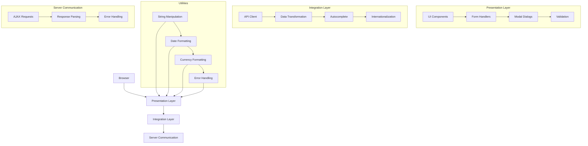
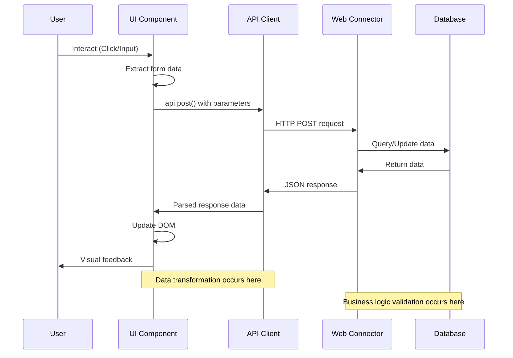
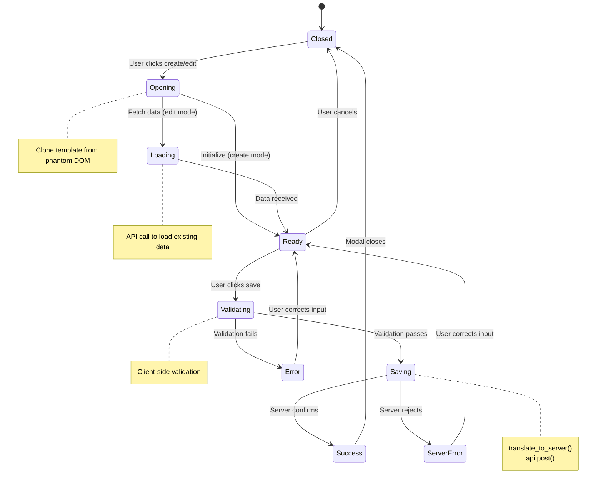
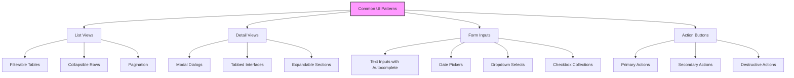

# OpenPetra's JavaScript Client Architecture

## Overview of OpenPetra's JavaScript Client Architecture

OpenPetra's JavaScript client architecture represents a modern web interface for this open-source ERP system. The architecture follows a modular approach that separates concerns between UI components, API integration, and utility functions. Built primarily with jQuery and Bootstrap, the client communicates with server-side web connectors through standardized AJAX calls.

The architecture emphasizes a consistent pattern for displaying, editing, and saving data across different modules. Each functional area (Partner Management, Finance, Sponsorship, etc.) follows similar patterns while implementing domain-specific business logic. The client handles form data extraction, validation, and submission, with a focus on providing immediate feedback to users through notifications and error messages.

The JavaScript client is designed to work with minimal page reloads, instead fetching data asynchronously and updating the DOM as needed. This creates a more responsive user experience while maintaining compatibility with a wide range of browsers.

## JavaScript Client Architecture Layers



The JavaScript client architecture is organized into distinct layers that work together to provide a cohesive user experience. At the top level, the Presentation Layer handles all user interface components, including forms, modals, and validation. The Integration Layer manages communication with the server through the API client, transforming data between client and server formats, and providing services like autocomplete. 

Utility functions support both layers with common operations like string manipulation, date formatting, and currency handling. The Server Communication layer handles the actual AJAX requests, response parsing, and error handling. This layered approach allows for separation of concerns and makes the codebase more maintainable.

## Core UI Component Structure

OpenPetra's JavaScript client implements a consistent UI component structure across the application. Components typically follow a pattern of display, edit, and save operations. The core structure revolves around:

1. **List Views**: Components display tabular data with sortable columns and filtering capabilities. These views are populated through API calls and rendered using HTML templates.

2. **Detail Views**: When a user selects an item from a list, a detail view is presented, often within a collapsible section or modal dialog. This pattern is seen in components like `MaintainPartnerSelfService.js` and `MaintainUsers.js`.

3. **Edit Forms**: Forms for creating or editing data follow a consistent structure with field validation, autocomplete functionality, and standardized save/cancel actions.

The component lifecycle typically begins with a document-ready function that initializes the component, loads necessary data, and sets up event handlers. Components maintain their state using a combination of DOM attributes and JavaScript variables, with a focus on keeping the UI in sync with the underlying data.

Data binding is primarily handled through template functions like `format_tpl()` and `extract_data()`, which map between JavaScript objects and form elements. This approach ensures consistency in how data is displayed and collected across the application.

## API Communication Pattern

The JavaScript client communicates with the server through a standardized API communication pattern. This pattern is built around AJAX calls to server-side web connectors, which expose business logic functionality to the client.

The primary mechanism for API communication is the `api.post()` function, which wraps axios HTTP requests. This function handles the details of communicating with the server, including URL construction, request formatting, and response parsing. A typical API call follows this pattern:

```javascript
api.post('serverMPartner.asmx/TSimplePartnerEditWebConnector_GetPartnerDetails', request)
  .then(function(data) {
    parsed = JSON.parse(data.data.d);
    // Process the response data
  })
  .catch(function(error) {
    // Handle errors
  });
```

Request parameters are typically constructed as JavaScript objects, which are then passed to the API function. Responses are returned as JSON strings wrapped in a standard format, which are then parsed and processed by the client.

The API communication pattern includes error handling at multiple levels. Server-side validation errors are returned in a structured format that can be displayed to the user, while network or other technical errors are caught and handled appropriately.

## Client-Server Data Flow



The diagram illustrates the flow of data between the client-side JavaScript and server-side web connectors in OpenPetra. When a user interacts with the UI, the component extracts form data and prepares it for submission. The API client sends this data to the server via HTTP POST requests to specific web connector endpoints.

On the server side, the web connector processes the request, performs business logic operations, and interacts with the database. The results are then returned to the client as a JSON response. The API client parses this response and passes it back to the UI component, which updates the DOM accordingly and provides visual feedback to the user.

Key aspects of this data flow include:
1. Data transformation between client and server formats
2. Validation at both client and server levels
3. Asynchronous communication to maintain UI responsiveness
4. Standardized error handling and user feedback

## Form Data Management

OpenPetra's JavaScript client implements a sophisticated approach to form data management. The system revolves around two key functions: `extract_data()` and `translate_to_server()`.

The `extract_data()` function traverses a jQuery object representing a form and extracts values from input elements, select dropdowns, checkboxes, and other form controls. It creates a JavaScript object with properties named after the form fields, making it easy to work with the data programmatically. This function handles various input types appropriately, converting values to appropriate types and handling special cases like date fields.

The `translate_to_server()` function takes the extracted data and transforms it into a format expected by the server-side web connectors. This includes:

1. Converting field names from client-side conventions (camelCase or lowercase) to server-side conventions (PascalCase with 'A' prefix)
2. Transforming date formats to be compatible with server expectations
3. Converting boolean values to their appropriate representation
4. Handling special fields like partner keys, transaction numbers, and other identifiers

For example, in `MaintainPartnerSelfService.js`, the form data management process includes:
```javascript
let x = extract_data(obj);
let updated_data = replace_data(last_opened_entry_data, x);
```

This pattern allows the client to maintain a clean separation between the UI representation of data and the server-side data model, while providing a consistent way to transform between the two.

## Modal Dialog Implementation

OpenPetra's JavaScript client extensively uses modal dialogs for creating, editing, and viewing detailed information. These modals provide a focused interface for users to interact with specific data without navigating away from the current context.

Modal dialogs are implemented using Bootstrap's modal component and follow a consistent pattern across the application. Typically, a modal template is defined in the HTML with the `phantom` attribute, then cloned and populated with data when needed. For example:

```javascript
let m = $('[phantom] .tpl_edit').clone();
m = format_tpl(m, data);
$('#modal_space').html(m);
$('#modal_space .modal').modal('show');
```

Modals handle various operations including:

1. **Creating new records**: Functions like `open_new()` initialize a modal with empty fields or default values.
2. **Editing existing records**: Functions like `open_edit()` populate the modal with existing data fetched from the server.
3. **Viewing details**: Some modals are used just for displaying detailed information without editing capabilities.

Modal dialogs include validation logic to ensure data integrity before submission. They also manage their own state, tracking whether they're in "create" or "edit" mode to determine the appropriate server action when saving.

The modal implementation includes proper cleanup when closing, ensuring that resources are released and the UI state remains consistent. This is handled through functions like `CloseModal()` which remove the modal from the DOM and clean up any associated event handlers.

## Modal Dialog Lifecycle



The diagram illustrates the lifecycle of a modal dialog in OpenPetra's JavaScript client. The process begins when a user initiates an action to create or edit data, which triggers the opening of a modal dialog. Depending on whether this is a new record or an existing one, the modal either initializes with default values or loads data from the server.

Once the modal is ready, users can interact with the form fields. When they attempt to save, the system validates the input data. If validation passes, the data is transformed into the server format and submitted via an API call. The server may either confirm the operation or reject it with validation errors.

Throughout this lifecycle, the modal maintains its state and provides appropriate feedback to the user. Success results in the modal closing and the parent view being updated, while errors are displayed to guide the user in correcting their input.

## Client-Side Internationalization

OpenPetra's JavaScript client implements internationalization using the i18next library to support multiple languages. This approach allows the application to present its interface in the user's preferred language without requiring server-side rendering for each language change.

The internationalization system is initialized during application startup, detecting the user's browser language and loading the appropriate translation files. Translation keys are organized hierarchically, with namespaces for different modules and functional areas.

Translation is applied through the `i18next.t()` function, which takes a translation key and optional parameters:

```javascript
display_message(i18next.t('forms.saved'), "success");
```

The system handles various aspects of internationalization:

1. **Text translation**: UI labels, messages, and other text elements are translated based on the current language.
2. **Date formatting**: Dates are formatted according to the conventions of the selected language.
3. **Number formatting**: Numbers, especially currency values, are formatted with appropriate decimal and thousands separators.
4. **Dynamic content**: Translation can be applied to dynamically generated content, ensuring that all parts of the UI are consistently localized.

The client supports language switching without requiring a page reload, instantly updating all translated elements when the language is changed. This is particularly important for organizations operating in multiple countries or regions.

Translation files are loaded asynchronously, ensuring that the application remains responsive even when switching languages or loading additional translations.

## Error Handling and User Feedback

OpenPetra's JavaScript client implements a comprehensive approach to error handling and user feedback. The system provides clear, contextual information to users about the results of their actions, whether successful or not.

Error handling occurs at multiple levels:

1. **Client-side validation**: Forms validate input before submission, providing immediate feedback about invalid data. This includes required fields, format validation, and business rule checks.

2. **Server-side validation**: When the server detects validation issues, it returns structured error information that the client displays to the user. This is handled through the `display_error()` function, which can process both simple messages and complex validation results.

3. **Technical errors**: Network issues, server errors, and other technical problems are caught and presented to users in a user-friendly manner.

User feedback is provided through several mechanisms:

1. **Toast notifications**: The `display_message()` function shows temporary notifications for successful operations or minor issues.

2. **Inline validation messages**: Form fields with validation errors are highlighted, with specific error messages displayed nearby.

3. **Modal dialogs**: Critical errors or important confirmations may be presented in modal dialogs that require user acknowledgment.

4. **Visual indicators**: Loading states, success/error icons, and color coding provide visual feedback about the status of operations.

For example, in `MaintainPartnerSelfService.js`, after saving changes:
```javascript
if (parsed.result == true) {
    CloseModal(obj);
    display_message(i18next.t('forms.saved'), "success");
    display_list();
}
else {
    display_error(parsed.AVerificationResult);
}
```

This approach ensures that users always understand the outcome of their actions and can take appropriate steps to resolve any issues.

## Common UI Patterns



OpenPetra's JavaScript client employs consistent UI patterns across different modules to provide a cohesive user experience. These patterns include:

1. **List Views**: Tables displaying collections of items with filtering, sorting, and selection capabilities. These views typically include action buttons for creating new items or performing bulk operations.

2. **Detail Views**: Expanded information about a selected item, often shown in a collapsible section beneath the item in a list or in a modal dialog. These views provide comprehensive information and access to related actions.

3. **Form Inputs**: Standardized input controls including text fields with autocomplete functionality, date pickers, dropdown selects, and checkbox collections. These inputs follow consistent validation and feedback patterns.

4. **Action Buttons**: Clearly distinguished buttons for primary actions (save, create), secondary actions (cancel, back), and destructive actions (delete). These buttons use consistent styling and positioning across the application.

5. **Tabbed Interfaces**: Complex forms or detail views are organized into logical tabs, allowing users to focus on specific aspects of the data without overwhelming them with all information at once.

6. **Notification Areas**: Consistent placement and styling of success messages, warnings, and errors to provide clear feedback to users.

These patterns are implemented consistently across modules like Partner Management, Finance, Gift Entry, and System Administration, creating a familiar experience regardless of which part of the system the user is working with.

## Client-Side Utilities and Helpers

OpenPetra's JavaScript client includes a robust set of utility functions and helper libraries that support the application's functionality. These utilities provide common services that are used across different modules, promoting code reuse and consistency.

Key utility functions and helpers include:

1. **Autocomplete**: The `autocomplete.js` library provides sophisticated typeahead functionality for input fields. It supports keyboard navigation, selection events, and can store additional metadata with each suggestion. This is particularly valuable for partner selection, account codes, and other reference data.

2. **String Manipulation**: The `string.js` library includes functions like `replaceAll()` that extend JavaScript's native string capabilities, making it easier to work with text data throughout the application.

3. **Date Formatting**: Utilities for parsing, formatting, and manipulating dates ensure consistent date handling across the application. These functions handle the complexities of different date formats and time zones.

4. **Currency Formatting**: Functions like `format_currency()` ensure that monetary values are displayed consistently with appropriate currency symbols, decimal places, and thousands separators.

5. **Data Extraction**: The `extract_data()` function provides a standardized way to collect form data, while `translate_to_server()` transforms it into the format expected by server APIs.

6. **DOM Manipulation**: Helper functions for working with the DOM, including creating, updating, and removing elements in a consistent manner.

7. **Modal Management**: Utilities for creating, displaying, and managing modal dialogs, ensuring consistent behavior across the application.

8. **Error Handling**: Functions like `display_error()` and `display_message()` provide standardized ways to show feedback to users.

These utilities and helpers form a foundation that the application's specific modules build upon, ensuring consistency in behavior and appearance while reducing code duplication.

[Generated by the Sage AI expert workbench: 2025-03-30 02:22:57  https://sage-tech.ai/workbench]: #