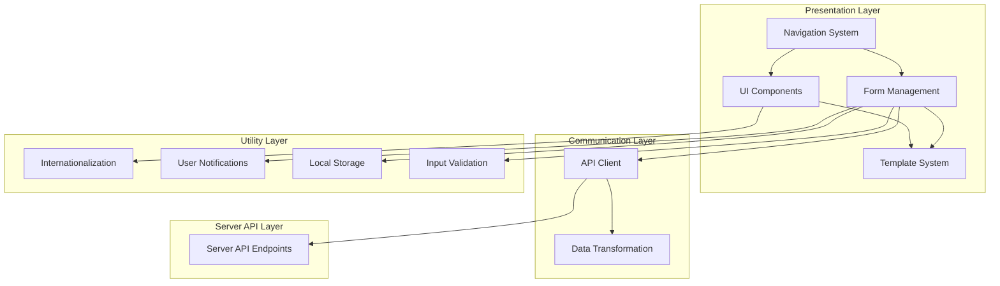
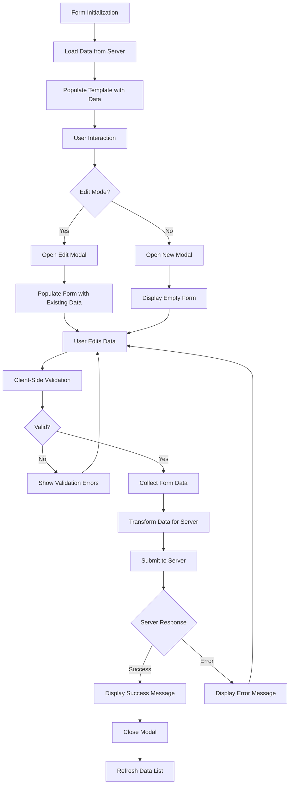
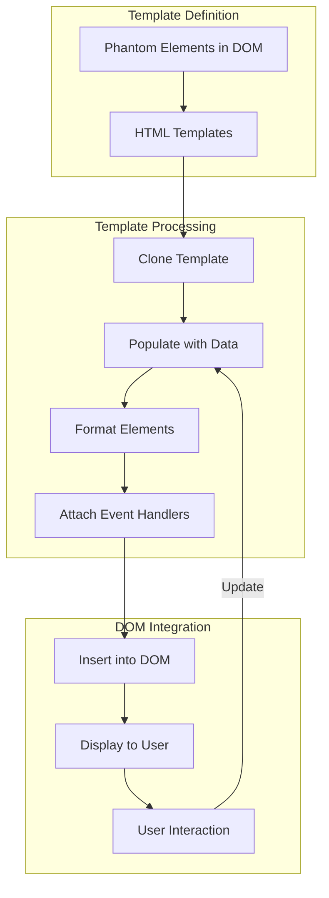
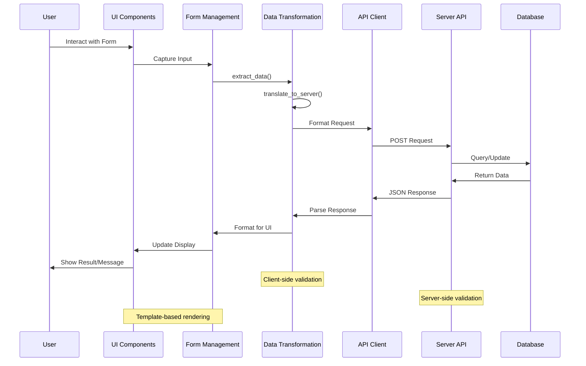

# Client-Side Architecture Analysis: OpenPetra TypeScript/JavaScript

## Client-Side Architecture Overview

OpenPetra's client-side architecture implements a single-page application (SPA) approach using JavaScript/TypeScript patterns, even though many files use the `.js` extension. The architecture follows a modular design that separates concerns across navigation, form management, API communication, and UI rendering components.

The client architecture is built around dynamic form loading and template-based UI generation. At its core, the system uses a navigation framework that handles URL routing and browser history management, allowing users to navigate between different functional areas while maintaining application state. Forms are loaded on demand and populated with data retrieved from server API calls.

A key architectural pattern is the use of phantom templates - HTML elements defined in the DOM but not displayed - which are cloned and populated with data to create UI components dynamically. This approach allows for consistent UI generation across the application while minimizing code duplication.

The architecture also emphasizes separation between data retrieval (via API calls), data transformation (using utility functions), and UI rendering (through template manipulation). This separation facilitates maintenance and extension of the system while providing a consistent user experience.

## Client Architecture Layers



The client architecture is organized into distinct layers that work together to provide a cohesive user experience. The Navigation System sits at the top, controlling application flow and URL routing. It interacts with the Form Management layer which handles loading, displaying, and processing forms. The Template System provides reusable UI components that are populated with data. The Communication Layer manages API calls and data transformation between client and server formats. The Utility Layer provides cross-cutting concerns like internationalization, notifications, and local storage management.

## Navigation and Routing System

OpenPetra's client-side navigation system is implemented primarily in `navigation.js`, which provides a sophisticated routing mechanism that maps URL paths to application functionality. The system handles both direct URL navigation and in-app navigation through menu selections.

The navigation system maintains the application state by tracking the current module and submodule, which determines what content is displayed in both the top navigation bar and the side menu. When a user navigates to a new section, the system updates the browser's URL using the History API (`history.pushState`), allowing for proper back/forward button functionality while maintaining the single-page application context.

The system loads navigation configuration from the server via an API call to `serverSessionManager.asmx/GetNavigationMenu`, which returns a JSON structure defining the available modules, submodules, and forms. This configuration is stored in `localStorage` for quick access during navigation operations.

A key feature of the navigation system is its ability to dynamically load JavaScript files for specific forms using the `LoadJavascript` function, which handles caching based on whether the application is in development or production mode. The system also supports deep linking, allowing users to navigate directly to specific forms via URL.

The navigation system also handles permission-based UI adaptation, such as showing or hiding the ledger selection dropdown based on the user's finance permissions, demonstrating how the navigation layer integrates with the application's security model.

## Form Management and Data Binding

OpenPetra's form management system provides a structured approach to handling user input, data binding, and form submission. Forms are dynamically loaded into the DOM when requested through the navigation system, and their associated JavaScript files are loaded to provide form-specific functionality.

When a form is loaded, it typically initializes by retrieving necessary data from the server through API calls. For example, in `MaintainTypes.js`, the `display_list()` function loads partner types from the server and populates the UI. The form management system maintains state in variables like `last_requested_data` or `last_opened_entry_data`, which store the current data being displayed or edited.

Data binding is implemented through utility functions like `format_tpl()` and `insertData()`, which populate HTML templates with data from JavaScript objects. When users modify data in forms, the changes are collected using the `extract_data()` function, which traverses the DOM to gather input values.

Form validation occurs both on the client side through JavaScript validation and on the server side after submission. When validation errors occur, they are displayed to the user through the notification system.

The form lifecycle typically follows this pattern:
1. Form initialization and loading
2. Data retrieval from server
3. Template population with data
4. User interaction and data modification
5. Data collection and validation
6. Submission to server
7. Response handling (success or error)

This pattern is consistent across different forms in the application, providing a unified user experience despite the diverse functionality.

## Form Lifecycle Flow



The form lifecycle flow diagram illustrates the complete process from form initialization to data submission and response handling. The process begins with form initialization, which triggers data loading from the server. Once data is loaded, templates are populated to display the information to the user.

When a user wants to edit existing data or create new entries, the system opens the appropriate modal dialog. For editing, the modal is pre-populated with existing data; for new entries, an empty form is displayed. After the user makes changes and submits the form, client-side validation occurs first. If validation fails, errors are displayed and the user can correct their input.

If validation passes, the form data is collected and transformed into the format expected by the server. After submission, the server response determines the next steps: success messages and list refreshing for successful operations, or error messages for failed operations. This consistent pattern across different forms provides users with a predictable interaction model throughout the application.

## API Communication Pattern

OpenPetra's client-side code uses a consistent pattern for communicating with the server through API calls. The application primarily uses Axios (referenced as `api` in the code) to make AJAX requests to server endpoints.

API calls follow a standard structure where the client sends a POST request to a specific server endpoint (typically an ASMX web service), passing parameters as a JavaScript object. The server processes the request and returns a JSON response, which is then parsed and handled by the client.

For example, in `MaintainTypes.js`, the `display_list()` function makes an API call to load partner types:

```javascript
api.post('serverMPartner.asmx/TPartnerSetupWebConnector_LoadPartnerTypes', {}).then(function (data) {
  data = JSON.parse(data.data.d);
  // Process the response data
})
```

The response handling typically includes:
1. Parsing the JSON response
2. Checking for success/failure indicators
3. Processing the returned data (e.g., formatting, storing in variables)
4. Updating the UI based on the response

For data modification operations (create, update, delete), the pattern includes additional steps:
1. Collecting form data using `extract_data()`
2. Transforming the data to server format using `translate_to_server()`
3. Adding an action parameter (e.g., 'create', 'update', 'delete')
4. Sending the request to the server
5. Handling the response (displaying success/error messages, refreshing data)

Error handling is implemented through the `display_error()` function, which processes error messages from the server and displays them to the user. This function can handle both simple error strings and complex error objects with multiple messages.

The API communication pattern also includes handling of specialized data types, such as file uploads through the `uploadFile()` function, which uses XMLHttpRequest to send form data to the server.

## Template-Based UI Generation

OpenPetra employs a template-based approach to UI generation that leverages HTML templates defined in "phantom" elements - hidden elements in the DOM that serve as blueprints for UI components. This approach allows for consistent UI generation while minimizing code duplication.

The template system works by defining HTML templates within elements with the `[phantom]` attribute or within a container with that attribute. These templates are not displayed directly but are cloned and modified to create visible UI elements.

For example, in `MaintainTypes.js`, the `format_item()` function clones templates for rows and detail views:

```javascript
function format_item(item) {
  let row = format_tpl($("[phantom] .tpl_row").clone(), item);
  let view = format_tpl($("[phantom] .tpl_view").clone(), item);
  $('#browse_container').append(row);
  $('#type'+item['p_type_code_c_clean']).find('.collapse_col').append(view);
}
```

The `format_tpl()` function (not shown in the provided code but referenced) populates the cloned template with data from a JavaScript object, replacing placeholders or setting attributes based on the data.

This template-based approach is used throughout the application for various UI components:
- List rows and detail views
- Modal dialogs for editing and creating records
- Form fields and input controls
- Report parameter forms
- Dashboard cards and navigation elements

The system also supports conditional rendering within templates, allowing different parts of a template to be shown or hidden based on data values or user permissions.

A key advantage of this approach is that it separates the HTML structure from the JavaScript logic, making it easier to maintain and modify the UI without changing the underlying functionality. It also allows for consistent styling and behavior across similar components.

## Template-Based UI Pattern



The template-based UI pattern diagram illustrates how OpenPetra generates dynamic UI components from templates. The process begins with template definition, where HTML templates are defined within phantom elements in the DOM. These templates serve as blueprints for UI components but are not directly visible to users.

When a UI component needs to be created or updated, the system clones the appropriate template from the phantom elements. The cloned template is then populated with data, typically from a JavaScript object retrieved from the server. During this population process, placeholders in the template are replaced with actual values, and attributes are set based on the data.

After populating the template with data, additional formatting may be applied, such as adding CSS classes or styles based on data values. Event handlers are then attached to elements within the template to handle user interactions like clicks, form submissions, or other events.

The fully processed template is then inserted into the visible DOM at the appropriate location. This makes the UI component visible to the user, who can then interact with it. When user interactions require updates to the UI, the process may repeat, with new data being populated into cloned templates.

This pattern provides a flexible and maintainable approach to UI generation, allowing for consistent styling and behavior while accommodating dynamic data and user interactions.

## User Notification System

OpenPetra implements a comprehensive user notification system that provides feedback to users about the results of their actions. The system is primarily implemented in `utils.js` through the `display_message()` and `display_error()` functions.

The notification system creates message elements that appear at the top of the screen, with different styling based on the message type (success, error, etc.). Messages automatically disappear after a timeout period unless pinned by the user.

Key features of the notification system include:

1. **Message Types**: Different styling for success and error messages, with the ability to customize styling through parameters.

2. **Message Pinning**: Users can pin messages to prevent them from automatically disappearing, using the `toggle_pin_message()` function. The pinned state is stored in `localStorage` to persist across page loads.

3. **Timeout Control**: Messages automatically disappear after a configurable timeout period (default is 5000ms), with error messages having a longer timeout (2x) to ensure users have time to read them.

4. **Large Message Handling**: For messages that exceed a reasonable display size, the system creates a downloadable text file and provides a link to download it, preventing the UI from being overwhelmed by large error messages.

5. **Internationalization**: Error messages are automatically translated using the i18next library, with fallbacks to raw messages if translations are not available.

6. **Dynamic DOM Creation**: If the message container doesn't exist in the DOM, the system creates it dynamically, ensuring messages can be displayed regardless of the current page state.

The error handling specifically supports multiple formats:
- Simple string messages
- Error objects with code and message properties
- Arrays of error objects for multiple errors
- Base64-encoded error messages for complex content

This notification system provides consistent user feedback across the application, enhancing usability by clearly communicating the results of user actions and system processes.

## Internationalization Implementation

OpenPetra implements internationalization using the i18next library to provide translations for UI elements, messages, and dynamic content. The implementation allows the application to be used in multiple languages while maintaining a consistent user experience.

The internationalization system is integrated throughout the client-side code, with translation functions used for various types of content:

1. **UI Elements**: Static UI elements like labels, buttons, and headers are translated using the `i18next.t()` function, often during template population or DOM manipulation.

2. **Error Messages**: Error messages from the server are translated using error codes as translation keys, with fallbacks to raw messages if translations are not available.

3. **Dynamic Content**: Some dynamic content, such as partner type descriptions or consent purpose names, is translated based on content-specific keys.

4. **Navigation Items**: Menu items and page titles are translated using keys from the navigation configuration, typically prefixed with "navigation.".

The system supports fallback mechanisms for missing translations. For example, in `MaintainConsentPurposes.js`, the code checks if a translation exists before using it:

```javascript
if (i18next.t("MaintainPartners."+item['p_name_c']) == "MaintainPartners."+item['p_name_c']) {
  item['TranslatedName'] = item['p_name_c'];
} else {
  item['TranslatedName'] = i18next.t("MaintainPartners."+item['p_name_c']);
}
```

The internationalization implementation also includes language selection functionality, allowing users to change their preferred language through the "Change Language" option in the settings menu.

Translation keys are organized hierarchically, with namespaces based on form names or functional areas, making it easier to manage translations for specific parts of the application. This structure also allows for context-specific translations where the same term might be translated differently in different contexts.

## Data Flow Between Client and Server



The data flow diagram illustrates the complete cycle of data movement between the client and server in OpenPetra. The process begins with user interaction in the UI, such as filling out a form or clicking a button. The UI components capture this input and pass it to the form management layer.

The form management layer uses the `extract_data()` function to collect all relevant input values from the DOM. This raw data is then transformed into a server-compatible format using the `translate_to_server()` function, which handles naming conventions and data structure transformations.

The transformed data is passed to the API client, which formats it into a proper request and sends it to the server via a POST request. The server processes the request, performing any necessary database operations and validation.

After processing, the server returns a JSON response, which the API client receives and parses. The parsed data is then transformed back into a client-friendly format and passed to the form management layer.

The form management layer uses this data to update the UI display, often using template-based rendering to populate UI components with the new data. Finally, the UI shows the result to the user, including any success or error messages.

Throughout this flow, validation occurs at multiple points: client-side validation before sending data to the server, and server-side validation to ensure data integrity. The template-based rendering system ensures consistent UI presentation regardless of the data being displayed.

This bidirectional data flow, with appropriate transformations at each step, allows OpenPetra to maintain a clean separation between client and server concerns while providing a responsive and consistent user experience.

## Client-Side Utilities and Helpers

OpenPetra's client-side implementation includes a comprehensive set of utility functions and helpers that support common operations throughout the application. These utilities, primarily defined in `utils.js` and other library files, provide consistent approaches to common tasks.

Key utility functions include:

1. **Data Transformation**:
   - `translate_to_server()`: Transforms client-side data structures to server-expected formats, handling naming conventions and data types.
   - `replace_data()`: Updates object properties with values from another object, supporting nested structures.
   - `capitalizeFirstLetter()`: Utility for text formatting.
   - `b64DecodeUnicode()`: Properly decodes base64 strings with Unicode characters.

2. **DOM Manipulation**:
   - `format_tpl()`: Populates templates with data.
   - `extract_data()`: Collects form input values from the DOM.
   - `insertData()`: Inserts data into DOM elements.
   - `CloseModal()`: Handles modal dialog closing.

3. **Local Storage Management**:
   - `save_preset()`: Saves form values to localStorage for later use.
   - Functions to store and retrieve user preferences, current ledger, and navigation state.

4. **File Handling**:
   - `uploadFile()`: Handles file uploads to the server.
   - Functions to create downloadable text files from large messages.

5. **UI Helpers**:
   - `allow_modal()`: Prevents multiple modals from opening simultaneously.
   - `isEmpty()`: Checks if an object is empty, handling different data types.
   - `RemoveBackDropOnBrowserBack()`: Fixes modal backdrop issues with browser navigation.

6. **API Communication**:
   - Specialized functions for common API operations, such as `autocomplete_a()` and `autocomplete_cc()` for account and cost center lookups.
   - Functions to handle API responses and error conditions.

7. **Form Management**:
   - Functions to load available years and periods for financial reports.
   - Functions to handle form submission and response processing.

These utility functions provide a consistent approach to common tasks across the application, reducing code duplication and ensuring consistent behavior. They abstract away complex operations into simple function calls, making the main application code cleaner and more focused on business logic rather than technical details.

[Generated by the Sage AI expert workbench: 2025-03-30 02:22:57  https://sage-tech.ai/workbench]: #