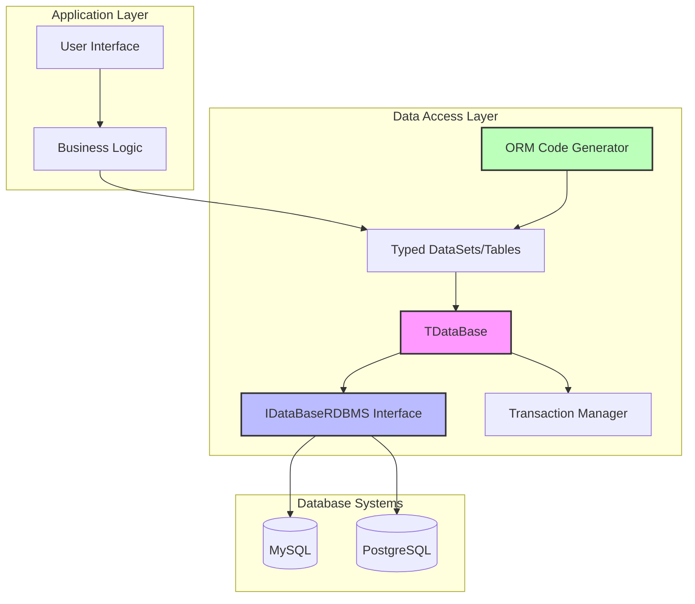
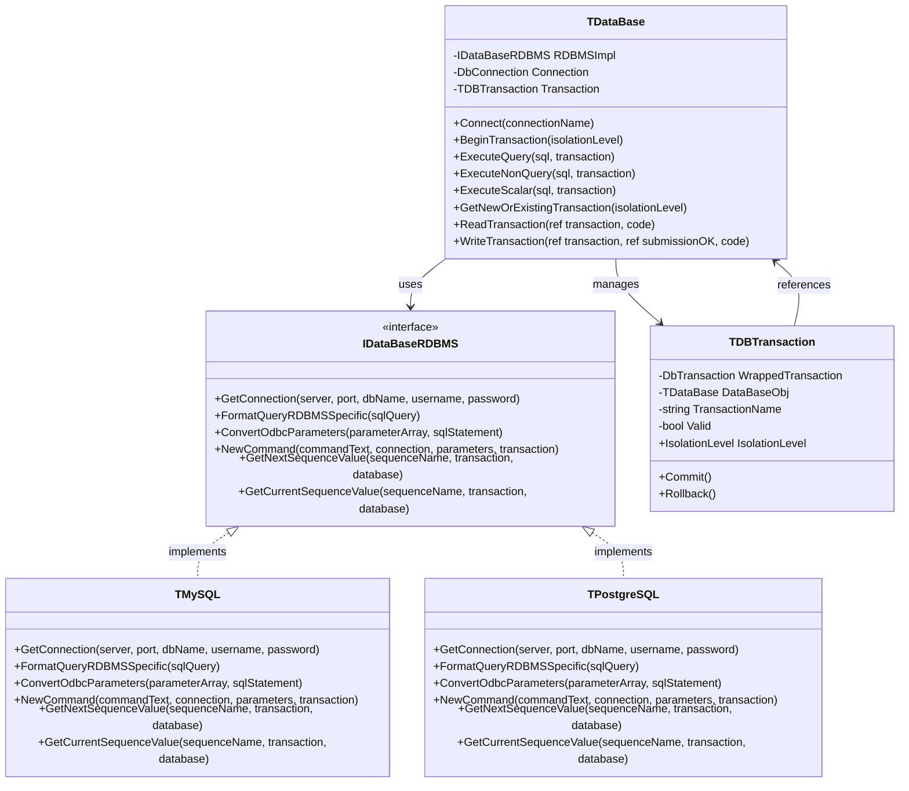
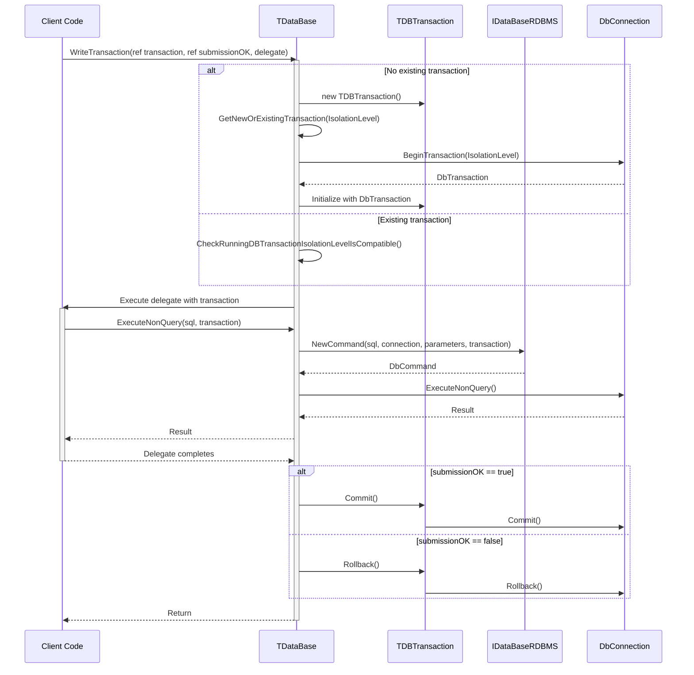
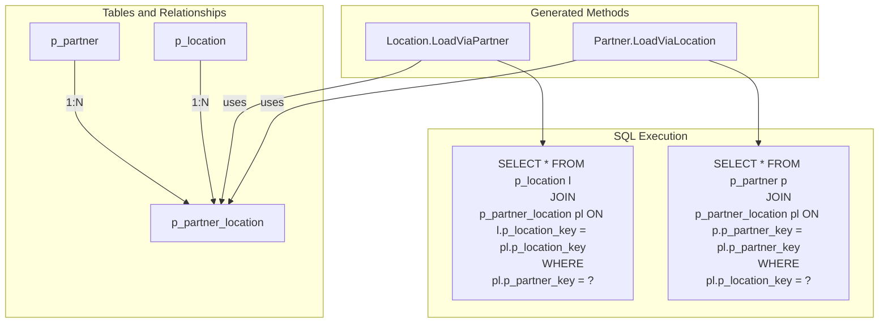

# OpenPetra's Data Access Layer

## Overview of OpenPetra's Data Access Layer

OpenPetra implements a sophisticated data access layer that provides abstraction between the application logic and the underlying database systems. This layer serves as a bridge that enables the application to interact with different relational database management systems (RDBMS) without modifying the core business logic. The data access layer in OpenPetra is designed with several key objectives:

1. **Database Agnosticism**: Allowing the application to work with different database systems (MySQL, PostgreSQL) through a unified interface.
2. **Type Safety**: Providing strongly-typed data access through code generation to minimize runtime errors.
3. **Relationship Navigation**: Enabling intuitive navigation between related tables based on foreign key relationships.
4. **Transaction Management**: Supporting robust transaction handling with different isolation levels.
5. **Performance Optimization**: Implementing efficient parameter handling and query generation techniques.

The architecture employs a custom Object-Relational Mapping (ORM) approach that generates data access code from XML table definitions, creating a strongly-typed interface to the database while maintaining flexibility across different database systems.

## Data Access Layer Architecture



The diagram illustrates the layered architecture of OpenPetra's data access system. The TDataBase class serves as the central component that coordinates database operations. It interacts with the IDataBaseRDBMS interface, which provides database-specific implementations for different RDBMS systems. The ORM Code Generator creates strongly-typed DataSets and access methods based on XML table definitions. The Transaction Manager handles transaction lifecycle, ensuring data integrity across operations. This architecture allows the application layers to work with typed data objects while remaining isolated from the specifics of the underlying database system.

## Object-Relational Mapping (ORM) Implementation

OpenPetra implements a custom Object-Relational Mapping (ORM) system that generates data access code from table definitions stored in XML format. This approach differs from traditional ORM frameworks by focusing on generating strongly-typed data tables and access methods at build time rather than relying on runtime reflection.

The ORM implementation centers around the `CodeGenerationAccess` class, which analyzes table relationships defined in XML and generates C# code for:

1. **Strongly-typed DataTables**: Type-safe representations of database tables with properly typed columns.
2. **CRUD Operations**: Standard methods for creating, reading, updating, and deleting records.
3. **Relationship Navigation**: Specialized methods for traversing relationships between tables.
4. **Constraint Validation**: Code that enforces database constraints at the application level.

The code generation process examines primary keys, foreign keys, and unique constraints to create appropriate data access patterns. For example, when it identifies a foreign key relationship between tables, it generates specialized `LoadVia` methods that allow retrieving related records. Similarly, for many-to-many relationships implemented through bridge tables, it creates `LoadViaLink` methods.

This approach provides several advantages:
- Compile-time type checking that catches errors before runtime
- Optimized data access patterns based on table relationships
- Consistent API for database operations across the application
- Reduced boilerplate code for developers

The generated code leverages ADO.NET DataSets and DataTables but extends them with OpenPetra-specific functionality to handle relationships, constraints, and database-specific features.

## Database Abstraction and RDBMS Support

OpenPetra's database abstraction is implemented through the `IDataBaseRDBMS` interface, which defines a contract for database-specific operations. This interface allows the application to interact with different database systems through a unified API, while each database system has its own implementation that handles its specific requirements.

The key components of this abstraction include:

1. **Connection Management**: Each RDBMS implementation provides methods for establishing and managing database connections with appropriate connection strings and parameters.

2. **Query Formatting**: The `FormatQueryRDBMSSpecific` method transforms standard SQL queries into database-specific syntax. For example, the MySQL implementation handles schema prefixes differently than PostgreSQL, and date formats may need adjustment.

3. **Parameter Handling**: The `ConvertOdbcParameters` method translates generic ODBC parameters into database-specific parameter objects, ensuring proper type mapping and naming conventions.

4. **Command Creation**: The `NewCommand` method creates database-specific command objects with appropriate settings and parameter bindings.

5. **Sequence Management**: Methods like `GetNextSequenceValue` and `GetCurrentSequenceValue` provide a consistent API for sequence operations, even when the underlying database implements sequences differently (e.g., MySQL uses tables for sequences while PostgreSQL has native sequence objects).

The current implementations include:

- **TMySQL**: Provides MySQL-specific functionality, handling its parameter syntax, query formatting, and sequence emulation.
- **TPostgreSQL**: Implements PostgreSQL-specific features, including case-insensitive search through ILIKE substitution and native sequence support.

This abstraction layer allows OpenPetra to support multiple database systems without modifying the core application logic, making it more flexible and adaptable to different deployment environments.

## Database Access Class Hierarchy



The diagram illustrates the class hierarchy of OpenPetra's database access system. At the core is the `TDataBase` class, which serves as the primary interface for database operations. It uses the Strategy pattern through the `IDataBaseRDBMS` interface to delegate database-specific operations to concrete implementations like `TMySQL` and `TPostgreSQL`. 

The `TDBTransaction` class encapsulates transaction management, maintaining a reference to its parent `TDataBase` instance and wrapping the native database transaction object. This design allows for consistent transaction handling across different database systems while preserving database-specific transaction capabilities.

The `TDataBase` class provides high-level methods like `ReadTransaction` and `WriteTransaction` that handle the transaction lifecycle, while delegating the actual SQL execution to the appropriate RDBMS implementation. This separation of concerns allows the application to work with a consistent API while leveraging database-specific optimizations under the hood.

## Transaction Management

OpenPetra implements a comprehensive transaction management system to ensure data integrity across database operations. The system supports different isolation levels, nested transactions, and connection management to provide a robust foundation for database interactions.

The transaction management is primarily handled through the `TDBTransaction` class, which encapsulates a database transaction and provides methods for committing or rolling back changes. The `TDataBase` class offers several methods for working with transactions:

1. **Explicit Transaction Control**:
   - `BeginTransaction`: Creates a new transaction with a specified isolation level
   - `GetNewOrExistingTransaction`: Either creates a new transaction or returns an existing one if compatible

2. **Transaction Blocks**:
   - `ReadTransaction`: Executes a delegate within a read-only transaction context
   - `WriteTransaction`: Executes a delegate within a transaction that can modify data

The system supports different isolation levels (ReadCommitted, Serializable, etc.) and ensures that operations requiring higher isolation levels don't run in transactions with lower isolation levels. This is enforced through the `CheckRunningDBTransactionIsolationLevelIsCompatible` method, which verifies that a transaction meets the minimum isolation requirements.

OpenPetra also handles nested transactions through a reference counting mechanism. When a nested transaction is requested, the system either:
- Returns the existing transaction if it meets the isolation level requirements
- Throws an exception if the existing transaction has an incompatible isolation level
- Creates a new transaction if none exists

This approach allows for composing operations that require transactions without worrying about transaction boundaries, while still maintaining proper isolation guarantees.

Connection management is tightly integrated with transaction management. The system maintains a connection pool and associates connections with transactions, ensuring that connections are properly released when transactions complete. This helps prevent connection leaks and improves application performance.

## Transaction Flow



The sequence diagram illustrates the lifecycle of a database transaction in OpenPetra, from creation through execution to commit or rollback. The process begins when client code calls the `WriteTransaction` method, passing a delegate containing the database operations to execute.

If no transaction exists, the system creates a new `TDBTransaction` and begins a database transaction with the specified isolation level. If a transaction already exists, the system checks that it meets the required isolation level.

The client's delegate is then executed within the transaction context. During execution, the client can perform database operations like `ExecuteNonQuery`, which are routed through the appropriate RDBMS implementation to create commands and execute them against the database connection.

After the delegate completes, the system either commits or rolls back the transaction based on the `submissionOK` flag. This pattern ensures that transactions are properly managed even if exceptions occur during execution, preventing partial updates and maintaining data integrity.

## Relationship Navigation and Data Access Patterns

OpenPetra's data access layer generates specialized methods for navigating relationships between tables based on the foreign key constraints defined in the database schema. This approach provides a type-safe and intuitive way to work with related data without writing complex join queries manually.

The system generates two main types of relationship navigation methods:

1. **LoadVia Methods**: These methods allow loading records from one table based on a foreign key relationship with another table. For example, if a `Person` table has a foreign key to a `Country` table, the system generates a `LoadViaCountry` method that retrieves all persons from a specific country.

2. **LoadViaLink Methods**: These methods handle many-to-many relationships implemented through bridge tables. For instance, if `Person` and `Skill` tables are related through a `PersonSkill` bridge table, the system generates methods to retrieve all persons with a specific skill or all skills for a specific person.

The code generation process analyzes the database schema to identify these relationships:

- Direct relationships are detected by examining foreign key constraints
- Bridge tables are identified by analyzing tables with composite primary keys that reference other tables
- Unique constraints are considered to generate optimized lookup methods

For each relationship, the system generates appropriate SQL queries with parameter handling and result mapping. The generated methods include variations for:

- Counting related records without retrieving them
- Retrieving specific fields rather than entire records
- Filtering related records with additional criteria

This approach offers several advantages:
- It enforces referential integrity at the application level
- It provides a discoverable API for working with related data
- It optimizes queries based on the known relationship structure
- It maintains type safety through strongly-typed return values

The relationship navigation system is particularly valuable for complex data models with many interrelated tables, as it simplifies data access code and reduces the potential for errors in query construction.

## Relationship Navigation Example



This diagram illustrates how the relationship navigation methods work with a real-world example from OpenPetra. In this case, we have a many-to-many relationship between partners (organizations or individuals) and locations, implemented through a bridge table called `p_partner_location`.

The ORM code generator analyzes this relationship structure and generates two specialized methods:

1. **Location.LoadViaPartner**: This method retrieves all locations associated with a specific partner. It takes a partner key as input and returns a typed dataset containing location records. Under the hood, it constructs a SQL query that joins the `p_location` table with the `p_partner_location` bridge table, filtering by the specified partner key.

2. **Partner.LoadViaLocation**: This method retrieves all partners associated with a specific location. It takes a location key as input and returns a typed dataset containing partner records. The implementation joins the `p_partner` table with the `p_partner_location` bridge table, filtering by the specified location key.

These methods abstract away the complexity of the underlying SQL joins and provide a type-safe interface for navigating the relationships. The code generator handles parameter creation, SQL query construction, and result mapping, ensuring that the relationship navigation is both efficient and correct.

This approach is particularly valuable for complex data models like OpenPetra's, where many entities have multiple relationships. By generating specialized methods for each relationship, the system provides a clear and intuitive API for working with related data while maintaining type safety and performance.

## Parameter Handling and SQL Query Generation

OpenPetra's data access layer implements a sophisticated parameter handling system that ensures secure and efficient SQL query execution. This system converts between ODBC parameters (which provide a database-agnostic interface) and database-specific parameters, while also preventing SQL injection attacks.

The parameter handling process involves several key components:

1. **Parameter Definition**: Parameters are initially defined as ODBC parameters with appropriate types and sizes. This provides a standard interface regardless of the underlying database system.

2. **Parameter Conversion**: The `ConvertOdbcParameters` method in each RDBMS implementation transforms ODBC parameters into database-specific parameters. For example:
   - In MySQL, parameters are converted to `MySqlParameter` objects
   - In PostgreSQL, parameters are converted to `NpgsqlParameter` objects
   - Type mappings are adjusted based on database-specific requirements

3. **Parameter Naming**: If parameters don't have explicit names, the system assigns names based on their position in the parameter array. This ensures that parameters can be properly referenced in the SQL query.

4. **Query Transformation**: The SQL query is modified to use the appropriate parameter syntax for the target database:
   - Question marks (`?`) are replaced with named parameters
   - Parameter placeholders are formatted according to database conventions (e.g., `@paramName` for MySQL, `:paramName` for PostgreSQL)

5. **Command Creation**: The `NewCommand` method creates a database-specific command object with the transformed SQL and parameters. This command is then executed against the database connection.

This approach offers several advantages:

- **Security**: By using parameterized queries, the system prevents SQL injection attacks that could occur with string concatenation
- **Performance**: Parameterized queries allow the database to cache execution plans, improving performance for repeated queries
- **Type Safety**: Parameter types are explicitly defined, ensuring proper data conversion between .NET and database types
- **Database Agnosticism**: The application code can use a consistent parameter style regardless of the underlying database system

The parameter handling system is tightly integrated with the query generation process, which formats SQL statements to be compatible with the target database system. This includes handling differences in schema naming, date formats, boolean representations, and function syntax.

## Sequence Management

OpenPetra implements a flexible sequence management system to generate unique identifiers across different database systems, even those that don't natively support sequences. This system provides a consistent API for sequence operations while adapting to the capabilities of the underlying database.

The sequence management functionality is defined in the `IDataBaseRDBMS` interface with three key methods:

1. **GetNextSequenceValue**: Retrieves the next value from a sequence and increments the sequence counter
2. **GetCurrentSequenceValue**: Retrieves the current value of a sequence without incrementing it
3. **RestartSequence**: Resets a sequence to start from a specified value

Each database implementation provides its own version of these methods:

- **PostgreSQL Implementation**: Uses native sequence objects with `nextval()` and `currval()` functions
- **MySQL Implementation**: Emulates sequences using tables, since MySQL doesn't have native sequence objects

The MySQL implementation is particularly interesting as it demonstrates how to adapt to database limitations:

```csharp
public System.Int64 GetNextSequenceValue(String ASequenceName, TDBTransaction ATransaction, TDataBase ADatabase)
{
    string stmt = "INSERT INTO " + ASequenceName + " VALUES(NULL, -1);";
    using (MySqlCommand cmd = new MySqlCommand(stmt, (MySqlConnection)ATransaction.Connection, (MySqlTransaction)ATransaction.WrappedTransaction))
    {
        cmd.ExecuteNonQuery();
    }
    return GetCurrentSequenceValue(ASequenceName, ATransaction, ADatabase);
}

public System.Int64 GetCurrentSequenceValue(String ASequenceName, TDBTransaction ATransaction, TDataBase ADatabase)
{
    string stmt = "SELECT MAX(sequence) FROM " + ASequenceName + ";";
    using (MySqlCommand cmd = new MySqlCommand(stmt, (MySqlConnection)ATransaction.Connection, (MySqlTransaction)ATransaction.WrappedTransaction))
    {
        return Convert.ToInt64(cmd.ExecuteScalar());
    }
}
```

The sequence management system is used throughout OpenPetra for generating primary keys and other unique identifiers. The ORM code generator detects sequence fields in table definitions and automatically generates code to assign sequence values when inserting new records.

This approach provides several benefits:
- Consistent API for sequence operations across different database systems
- Centralized management of unique identifier generation
- Ability to restart sequences for testing or data migration
- Automatic detection and handling of sequence fields during code generation

By abstracting sequence operations through the database interface, OpenPetra maintains database agnosticism while still leveraging efficient, database-specific implementations for unique identifier generation.

## Error Handling and Exception Management

OpenPetra's data access layer implements a comprehensive error handling and exception management system that captures database-specific errors and translates them into meaningful application-level exceptions. This approach provides several benefits:

1. **Consistent Error Handling**: Database-specific errors are wrapped in standardized exceptions, allowing application code to handle errors consistently regardless of the underlying database system.

2. **Contextual Information**: Exceptions include detailed information about the operation that failed, including SQL statements, parameter values, and transaction context, making troubleshooting easier.

3. **Error Classification**: Different types of database errors (constraint violations, connection issues, timeout errors) are mapped to specific exception types, enabling targeted error handling.

4. **Transaction Management**: Exceptions are integrated with the transaction management system to ensure proper rollback of failed transactions.

The error handling process involves several components:

- **Database-Specific Error Logging**: Each RDBMS implementation provides a `LogException` method that formats database-specific error information. For example, the MySQL implementation extracts error codes and messages from `MySqlException` objects.

- **Exception Hierarchy**: OpenPetra defines a hierarchy of database-related exceptions in the `Ict.Common.DB.Exceptions` namespace, including:
  - `EOPDBException`: Base class for all database exceptions
  - `EDBConnectionException`: Indicates connection problems
  - `EDBConstraintException`: Indicates constraint violations
  - `EDBTransactionIsolationLevelTooLowException`: Indicates incompatible transaction isolation levels

- **Exception Wrapping**: When a database operation fails, the system catches the native database exception, extracts relevant information, and wraps it in an appropriate application exception with additional context.

- **Transaction Integration**: When an exception occurs within a transaction block, the system automatically rolls back the transaction and includes transaction information in the exception details.

This approach helps developers quickly identify and resolve database-related issues while maintaining a clean separation between application logic and database-specific error handling. It also ensures that database connections and transactions are properly managed even when errors occur, preventing resource leaks and data inconsistencies.

[Generated by the Sage AI expert workbench: 2025-03-30 02:22:57  https://sage-tech.ai/workbench]: #