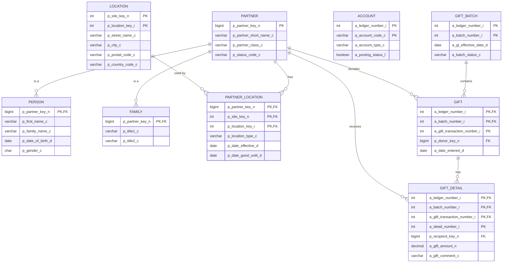

# OpenPetra Database Models Analysis

## Introduction to OpenPetra Database Models

OpenPetra's database architecture forms the backbone of its comprehensive non-profit management system, providing a robust foundation for organizations to manage administration, accounting, and contact management. The database model is designed with flexibility and extensibility in mind, supporting the diverse needs of non-profit organizations across various operational domains.

At its core, OpenPetra employs a relational database structure that organizes data into logical modules including Partner (contact management), Finance (accounting and gifts), Personnel (human resources), and Conference (event management). This modular approach allows organizations to use only the components they need while maintaining data integrity across the system. The database design emphasizes relationships between entities, enabling powerful reporting and analysis capabilities that help non-profits make informed decisions.

The architecture incorporates comprehensive reference data tables that provide standardized values throughout the system, a robust validation framework to ensure data integrity, and a sophisticated caching mechanism to optimize performance. This foundation supports OpenPetra's mission of helping non-profit organizations reduce administrative overhead and focus on their core mission.

## Core Database Structure and Schema Definition

OpenPetra's database schema is meticulously defined in the `petra.xml` file, which serves as the authoritative source for the system's data model. This XML-based definition establishes a comprehensive structure of tables, fields, constraints, and relationships that form the foundation of the application's data layer.

The schema follows a Document Type Definition (DTD) that enforces strict rules about how database elements are defined. Each table is described with attributes including name, description, area, and permissions for custom reporting. Fields within tables are defined with specific data types, constraints, formats, and validation rules. The schema also explicitly defines primary keys, unique keys, foreign keys, and indexes to maintain data integrity and optimize query performance.

OpenPetra's schema is particularly notable for its comprehensive approach to metadata. Each field includes descriptive information such as labels, help text, and formatting instructions that are used throughout the application to provide consistent user experiences. The schema also supports special attributes for fields like auto-increment values, default values, and validation expressions.

The database structure is organized into logical domains that align with the application's modules. For example, the Partner module includes tables for contacts, organizations, locations, and relationships, while the Finance module encompasses ledgers, accounts, transactions, and gifts. This modular approach allows for clear separation of concerns while maintaining necessary relationships between domains.

The schema definition serves not only as documentation but as a source of truth that drives code generation, database creation scripts, and application behavior. This approach ensures consistency between the database structure and the application code that interacts with it, reducing the risk of errors and simplifying maintenance.

## OpenPetra Database Schema Overview

This diagram shows the core relationships between key entities in OpenPetra's database schema. The Partner entity serves as the central hub, connecting to specialized partner types (Person, Family) and locations. The financial side shows the relationship between gift batches, gifts, and gift details, which connect back to partners as donors and recipients. This structure enables OpenPetra to track both the financial and relational aspects of non-profit operations in an integrated manner.

## ORM Layer and Typed Tables

OpenPetra implements a sophisticated Object-Relational Mapping (ORM) system that bridges the gap between the relational database and object-oriented application code. This system automatically generates strongly-typed C# classes from the database definitions in petra.xml, providing type safety, compile-time checking, and rich IntelliSense support for developers.

The ORM layer is built around the concept of typed tables, which are C# classes that represent database tables with strongly-typed properties for each column. These classes inherit from a base `TTypedDataTable` class that provides common functionality for all tables, including change tracking, serialization support, and database interaction capabilities.

For each database table, the ORM system generates two primary classes:
1. A table class (e.g., `PPartnerTable`) that defines the structure of the table, including column definitions and constraints
2. A row class (e.g., `PPartnerRow`) that represents individual records with strongly-typed properties for each column

The table classes include static metadata about the table structure, such as column names, data types, and constraints. They also provide methods for creating new rows, accessing rows by primary key, and performing table-level operations. The row classes implement properties for each column with appropriate data types, null-handling logic, and change tracking.

A key feature of OpenPetra's ORM system is its handling of relationships between tables. Foreign key relationships defined in the database schema are reflected in the generated code, enabling navigation between related entities. This allows developers to work with the data model in a natural, object-oriented way while the ORM layer handles the translation to SQL operations.

The ORM layer also includes validation logic that enforces business rules and constraints before data is committed to the database. This validation occurs at both the field level (checking data types, lengths, and formats) and the record level (ensuring cross-field consistency and business rule compliance).

## ORM Code Generation Process

The diagram illustrates how OpenPetra transforms database definitions into strongly-typed C# classes through its code generation system. The process begins with parsing the petra.xml file, which contains the complete database schema definition. The TDataDefinitionParser reads this XML and populates a TDataDefinitionStore object with structured information about tables, fields, and relationships.

From this store, two main tools process the data: GenerateORM for code generation and GenerateSQL for database script creation. The GenerateORM tool produces multiple outputs including typed tables (with separate table and row classes), typed datasets that group related tables, validation code that enforces business rules, and cacheable table definitions for performance optimization.

The code generation process uses templates (found in the inc/template directory) that define the structure of the generated code. These templates contain placeholders that are replaced with specific values from the database definition during generation. This approach ensures consistency across the generated code while allowing for customization of the output format.

The final output includes strongly-typed C# classes that provide a type-safe interface to the database, complete with IntelliSense support, validation logic, and relationship navigation capabilities. This generated code forms the foundation of OpenPetra's data access layer, providing a bridge between the relational database and the object-oriented application code.

## Reference Data and Base Tables

OpenPetra's database architecture includes an extensive collection of reference data tables that provide standardized values for classifications, types, and categories across the system. These tables serve as controlled vocabularies that ensure consistency in data entry and reporting while supporting internationalization and localization.

The reference data is organized into logical domains that align with the application's modules. For example, the Partner module includes reference tables for partner types, acquisition methods, and relationship categories, while the Finance module includes tables for currencies, account types, and transaction codes.

Key reference tables include:

1. **Geographic Data**: Country codes (p_country), languages (p_language), and location types (p_location_type) provide standardized geographic references.

2. **Partner Classification**: Partner classes (p_partner_classes), types (p_type), and statuses (p_partner_status) enable categorization of contacts.

3. **Relationship Management**: Relation types (p_relation) and categories (p_relation_category) define how partners can be connected to each other.

4. **Financial References**: Currencies (a_currency), account types (a_account_property_code), and frequency types (a_frequency) support financial operations.

5. **Personnel Management**: Position codes (pt_position), skill categories (pt_skill_category), and commitment statuses (pm_commitment_status) facilitate personnel tracking.

Each reference table typically includes a code field that serves as the primary key, a description field that provides a human-readable label, and various flags that control behavior in the application. Many reference tables also include fields for internationalization, allowing descriptions to be translated into multiple languages.

The reference data is loaded into the database during initialization from CSV files stored in the db/basedata directory. This approach allows the reference data to be version-controlled alongside the application code while making it easy to customize for specific deployments.

OpenPetra's reference data tables play a crucial role in maintaining data integrity and consistency throughout the system. By providing standardized values for common attributes, they reduce data entry errors, simplify reporting, and ensure that data can be properly interpreted across different contexts and languages.

## Data Validation Framework

OpenPetra implements a comprehensive validation framework that ensures data integrity through multiple layers of validation before information is committed to the database. This framework combines automatic validation based on database schema constraints with custom business rules to provide robust data quality assurance.

The validation system operates at multiple levels:

1. **Field-level validation** enforces basic constraints such as data types, required fields (NOT NULL), string length limits, and numeric ranges. These validations are automatically generated from the database schema definitions in petra.xml.

2. **Cross-field validation** ensures logical consistency between related fields within a record. For example, ensuring that start dates precede end dates or that hierarchical relationships are properly maintained.

3. **Record-level validation** applies business rules that span multiple fields or require complex logic. This includes validations like ensuring that financial transactions balance or that partner relationships are reciprocal.

4. **Cross-table validation** verifies relationships between records in different tables, such as checking that foreign keys reference valid primary keys or that dependent records are properly maintained.

The validation framework is implemented through the `TVerificationResultCollection` class, which accumulates validation results during processing. Each validation check adds a `TVerificationResult` object to this collection if an issue is detected. These results include information about the nature of the validation failure, the affected fields, and suggestions for correction.

Validation code is automatically generated for each table based on the constraints defined in the database schema. The `DataTableValidation.cs` template generates validation classes with methods for validating individual rows and entire tables. These generated methods handle common validations like required fields, string lengths, and data types.

For more complex business rules, developers can extend the generated validation classes with custom validation logic. This is typically done in partial classes that complement the generated code, allowing custom validations to be preserved when the code is regenerated.

The validation framework is integrated with the ORM layer, ensuring that data is validated before any database operations are performed. This prevents invalid data from being committed to the database and provides meaningful feedback to users when validation issues occur.

## Data Validation Process

This sequence diagram illustrates the validation process that occurs when data is created, updated, or deleted in OpenPetra. The process begins when a client submits data to the server, which then passes it through the validation layer before any database operations are performed.

The validation process occurs in multiple stages, starting with basic field-level validations that check data types, required fields, and format constraints. This is followed by cross-field validations that ensure logical consistency between related fields, such as date ranges or hierarchical relationships.

Business rule validations apply domain-specific logic that may require checking related data from other tables. For example, when validating a gift transaction, the system might need to verify that the donor and recipient are valid partners with appropriate statuses. These validations often involve querying the database for reference data or related records.

If any validation fails, the process stops and returns detailed error messages to the client, explaining what went wrong and how to fix it. If all validations pass, the data is committed to the database through the ORM layer, which translates the object changes into appropriate SQL statements.

The validation framework is particularly important for delete operations, where it ensures that removing a record won't violate referential integrity or business rules. For example, it prevents deleting a partner that has associated gifts or relationships unless those dependencies are properly handled.

This comprehensive validation approach ensures data integrity throughout the system while providing meaningful feedback to users when issues arise.

## Caching System for Performance Optimization

OpenPetra implements a sophisticated table caching mechanism that significantly improves performance by storing frequently accessed reference data in memory. This caching system is particularly valuable for tables that change infrequently but are referenced often during normal operations, such as country codes, currencies, and partner types.

The caching architecture is defined in the `CacheableTablesAndLists.yaml` configuration file, which specifies which tables should be cached and how they should be organized. Tables are grouped by module (Partner, Finance, Personnel, etc.) and submodule, creating a logical organization that aligns with the application's structure.

For each cacheable table, the system generates both server-side implementation code and shared enumeration definitions. The enumerations provide type-safe references to cached tables throughout the application, while the server implementation handles the actual caching logic, including loading data from the database, tracking changes, and managing cache invalidation.

The caching system supports two types of cached data:

1. **Database Tables**: Direct caches of database tables that are loaded once and kept in memory. These are defined in the `DatabaseTables` section of the configuration file.

2. **Calculated Lists**: Custom data structures that are populated through specific queries or calculations rather than directly mapping to database tables. These are defined in the `CalculatedLists` section and require custom implementation code.

Some cached tables are marked with special attributes like `DependsOnLedger`, indicating that their content varies based on the selected accounting ledger. This allows the caching system to maintain separate caches for different contexts, ensuring that users always see the appropriate data.

The caching system includes mechanisms for tracking when cached data becomes stale and needs to be refreshed. It also handles synchronization between multiple server instances in distributed deployments, ensuring cache consistency across the system.

By keeping frequently accessed reference data in memory, the caching system reduces database load and improves response times for common operations. This is particularly important for operations that involve lookups across multiple reference tables, such as formatting addresses with country-specific rules or validating financial transactions against account structures.

## Database Upgrade Mechanism

OpenPetra employs a version-based database upgrade system that manages schema evolution while preserving data integrity. This mechanism allows the application to evolve over time, adding new features and capabilities without requiring manual database migrations or risking data loss.

The upgrade system is implemented in the `MSysMan.DBUpgrades` namespace, with a central `TDBUpgrades` class that orchestrates the upgrade process. Each version transition is implemented as a separate method following a naming convention of `UpgradeDatabase[FromVersion]_[ToVersion]`, such as `UpgradeDatabase202207_202301`.

When OpenPetra starts, it checks the current database version (stored in the `s_system_defaults` table) against the application version. If the database version is older, the system identifies the necessary upgrade steps and applies them in sequence. This approach ensures that databases can be upgraded across multiple versions in a single operation, applying each intermediate upgrade in the correct order.

Each upgrade method is responsible for making the necessary changes to transition the database from one version to the next. These changes can include:

1. **Schema modifications**: Adding new tables, columns, or constraints to support new features
2. **Data migrations**: Transforming existing data to fit new structures or requirements
3. **Reference data updates**: Adding or modifying entries in reference tables
4. **Cleanup operations**: Removing deprecated structures or data

The upgrade methods use a transaction-based approach to ensure that upgrades are atomic—either all changes for a version are applied successfully, or none are. This prevents the database from being left in an inconsistent state if an upgrade encounters an error.

For complex schema changes, the upgrade system can execute SQL scripts stored in separate files. This approach is used for operations that are difficult to express in C# code or that benefit from database-specific optimizations.

The upgrade mechanism includes safeguards to prevent incompatible upgrades. It checks that the target version is compatible with the current application version before proceeding, and it validates the success of each step in the upgrade process.

This version-based approach to database upgrades provides several benefits:

1. **Incremental evolution**: The database can evolve gradually over time without requiring complete rebuilds
2. **Data preservation**: Existing data is preserved and migrated to new structures as needed
3. **Backward compatibility**: Older application versions can work with newer database versions when appropriate
4. **Automated deployment**: Database upgrades can be performed automatically during application startup

## Partner Data Model

```mermaid
erDiagram
    PARTNER {
        bigint p_partner_key_n PK
        varchar p_partner_short_name_c
        varchar p_partner_class_c
        varchar p_status_code_c
        date p_date_created_d
        varchar p_created_by_c
    }
    
    PERSON {
        bigint p_partner_key_n PK,FK
        varchar p_first_name_c
        varchar p_family_name_c
        date p_date_of_birth_d
        char p_gender_c
        varchar p_marital_status_c
    }
    
    FAMILY {
        bigint p_partner_key_n PK,FK
        varchar p_title1_c
        varchar p_title2_c
    }
    
    ORGANISATION {
        bigint p_partner_key_n PK,FK
        varchar p_business_code_c
        varchar p_registration_number_c
    }
    
    CHURCH {
        bigint p_partner_key_n PK,FK
        varchar p_denomination_code_c
    }
    
    BANK {
        bigint p_partner_key_n PK,FK
        varchar p_bic_c
    }
    
    LOCATION {
        int p_site_key_n PK
        int p_location_key_i PK
        varchar p_street_name_c
        varchar p_city_c
        varchar p_postal_code_c
        varchar p_country_code_c
    }
    
    PARTNER_LOCATION {
        bigint p_partner_key_n PK,FK
        int p_site_key_n PK,FK
        int p_location_key_i PK,FK
        varchar p_location_type_c
        date p_date_effective_d
        date p_date_good_until_d
    }
    
    PARTNER_ATTRIBUTE {
        bigint p_partner_key_n PK,FK
        varchar p_attribute_type_c PK
        int p_index_i PK
        varchar p_value_c
    }
    
    PARTNER_RELATIONSHIP {
        bigint p_partner_key_n PK,FK
        bigint p_relation_key_n PK,FK
        varchar p_relation_name_c
        date p_date_effective_d
        date p_date_expires_d
    }
    
    PARTNER_TYPE {
        bigint p_partner_key_n PK,FK
        varchar p_type_code_c PK
    }
    
    PARTNER ||--o{ PERSON : "is a"
    PARTNER ||--o{ FAMILY : "is a"
    PARTNER ||--o{ ORGANISATION : "is a"
    PARTNER ||--o{ CHURCH : "is a"
    PARTNER ||--o{ BANK : "is a"
    PARTNER ||--o{ PARTNER_LOCATION : "has"
    PARTNER ||--o{ PARTNER_ATTRIBUTE : "has"
    PARTNER ||--o{ PARTNER_RELATIONSHIP : "has"
    PARTNER ||--o{ PARTNER_TYPE : "has"
    LOCATION ||--o{ PARTNER_LOCATION : "used by"
    PARTNER ||--o{ PARTNER_RELATIONSHIP : "related to"
```

The Partner Data Model is a cornerstone of OpenPetra's architecture, providing a flexible and comprehensive approach to managing contacts, organizations, and their relationships. At its center is the p_partner table, which serves as the foundation for all contact entities in the system.

The model uses a class-based inheritance pattern where each partner has a specific class (PERSON, FAMILY, ORGANISATION, CHURCH, BANK) that determines which specialized table contains additional details. This approach allows for common operations across all partner types while supporting type-specific attributes and behaviors.

Locations are managed through a separate structure that allows partners to have multiple addresses with different types (home, business, mailing) and effective dates. This enables tracking of address history and supports complex scenarios like seasonal addresses or temporary relocations.

Partner attributes provide a flexible extension mechanism for storing contact information such as phone numbers, email addresses, and social media accounts. The attribute system uses categories and types to organize different kinds of information while maintaining a consistent structure.

Relationships between partners are tracked through the partner_relationship table, which supports bidirectional connections with specific relationship types (family, business, church) and temporal validity. This enables modeling of complex networks of relationships between individuals, families, organizations, and other entities.

Partner types allow for additional classification beyond the basic partner class, supporting scenarios where a partner might belong to multiple categories (e.g., a person who is both a STAFF and a VOLUNTEER).

This comprehensive partner data model provides the foundation for many of OpenPetra's features, including contact management, communication, gift processing, and reporting. Its flexible design accommodates diverse organizational needs while maintaining data integrity and supporting complex relationship networks.

## Financial Data Models

OpenPetra's financial data models provide a comprehensive framework for non-profit accounting, supporting both standard accounting functions and specialized non-profit needs like gift processing and donor management. The financial models are organized into several interconnected subsystems:

### General Ledger System

The core accounting structure is built around a chart of accounts defined in the `a_account` table, which organizes financial data into a hierarchical structure of accounts. Each account has a type (Asset, Liability, Income, Expense, Equity) and various attributes that control its behavior in the system.

Transactions are recorded through a batch-based system that includes:
- `a_batch` for grouping related transactions
- `a_journal` for organizing transactions within a batch
- `a_transaction` for individual financial entries

This structure supports double-entry accounting with debits and credits, ensuring that transactions always balance. The system also includes support for multiple accounting periods, fiscal years, and reporting periods.

### Gift Processing System

For non-profits, gift processing is a critical function that requires specialized data models. OpenPetra implements this through:
- `a_gift_batch` for organizing groups of gifts
- `a_gift` for tracking individual donations
- `a_gift_detail` for allocating gifts to specific purposes or recipients

The gift system integrates with the general ledger, automatically generating the appropriate accounting entries when gifts are processed. It also connects to the partner system, linking donations to donor and recipient records.

### Recurring Gifts and Sponsorship

OpenPetra supports recurring gifts and sponsorships through:
- `a_recurring_gift_batch` for organizing recurring gift programs
- `a_recurring_gift` for defining individual recurring donations
- `a_recurring_gift_detail` for allocating recurring gifts

This structure enables organizations to manage ongoing financial commitments like monthly donations, sponsorships, and pledges. The system includes support for tracking payment methods, frequency, and status.

### Multi-Currency Support

For international organizations, OpenPetra provides robust multi-currency capabilities through:
- `a_currency` for defining available currencies
- `a_corporate_exchange_rate` for standard exchange rates
- `a_daily_exchange_rate` for date-specific rates

The system automatically handles currency conversion for transactions, gifts, and reporting, ensuring accurate financial records regardless of the currencies involved.

### Budget Management

Financial planning is supported through:
- `a_budget` for defining budget allocations
- `a_budget_period` for period-specific budget amounts

This allows organizations to plan and track financial performance against budgets at various levels of detail.

### Cost Center Structure

OpenPetra implements a cost center approach that allows for multi-dimensional analysis of financial data:
- `a_cost_centre` defines organizational units for financial tracking
- `a_cost_centre_hierarchy` organizes cost centers into a hierarchical structure

This enables reporting and analysis by department, project, program, or other organizational dimensions.

The financial data models are designed to work together as an integrated system, supporting the full range of financial operations needed by non-profit organizations. From basic accounting to specialized gift processing and multi-currency operations, OpenPetra provides a comprehensive solution for non-profit financial management.

[Generated by the Sage AI expert workbench: 2025-03-30 02:22:57  https://sage-tech.ai/workbench]: #