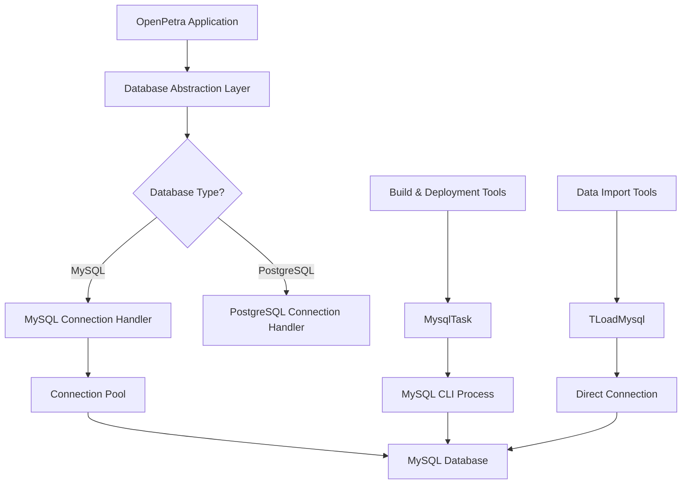
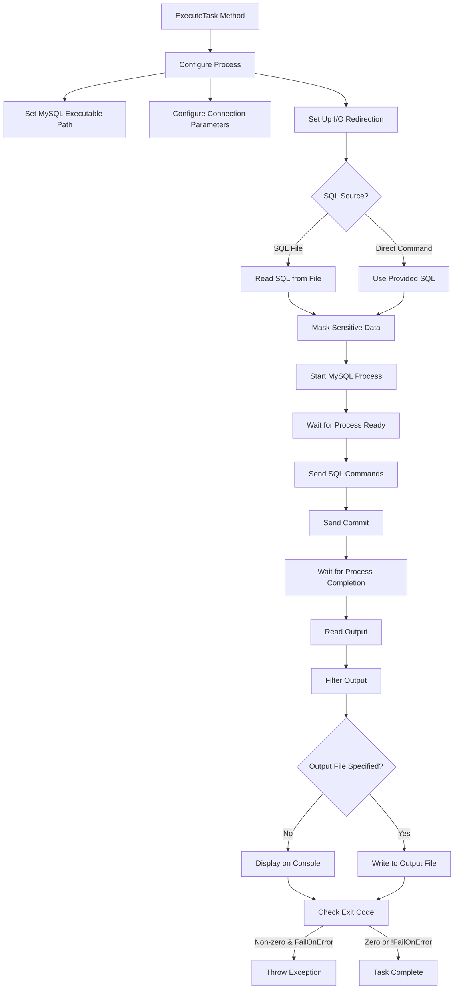
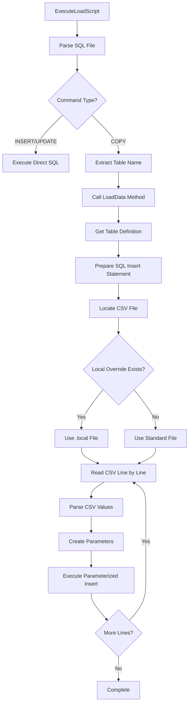
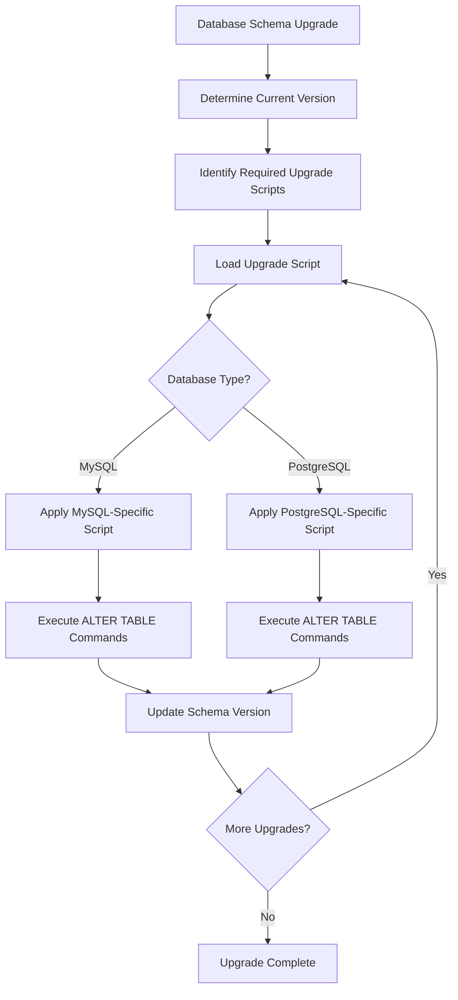

# MySQL in OpenPetra: Analysis and Architecture

## Introduction to MySQL in OpenPetra

OpenPetra's adoption of MySQL as a database backend represents a strategic choice for this open-source non-profit management system. MySQL was selected primarily for its combination of robust performance, widespread adoption, and zero licensing costs - all critical factors for an open-source project aimed at non-profit organizations with limited resources. MySQL serves as one of the primary database options in OpenPetra's architecture, alongside PostgreSQL, providing the persistent data storage layer that underpins all of OpenPetra's functionality from contact management to accounting and sponsorship tracking.

The integration of MySQL into OpenPetra reflects a deliberate architectural decision to support multiple database backends, allowing organizations to leverage existing database infrastructure or choose the option that best fits their technical expertise and requirements. MySQL's role is particularly significant as it offers a balance of enterprise-grade features with relatively straightforward administration, making it accessible to organizations with varying levels of technical capability. The database layer abstracts the specific implementation details, allowing OpenPetra to maintain consistent business logic regardless of the chosen database backend.

## MySQL Integration Architecture

OpenPetra employs a layered architecture for database integration, with MySQL connections managed through a dedicated abstraction layer. The system uses a combination of direct database access through the TDataBase class (which supports multiple database types including MySQL) and specialized tools for administrative operations like database initialization and schema upgrades.

Connection management follows a standard pattern where connections are established through the TDataBase class, which handles connection pooling, transaction management, and the execution of SQL commands. The architecture maintains a clear separation between the database access layer and business logic, with database-specific code isolated to ensure portability across different database backends.

For MySQL specifically, connections are established using standard connection parameters (hostname, database name, username, and password), with transactions explicitly managed to ensure data integrity. The system handles connection lifecycle management, ensuring connections are properly closed after use and that transactions are either committed or rolled back appropriately.

The integration architecture also includes specialized components for database administration tasks, such as the MysqlTask NAnt task for build and deployment operations, and the TLoadMysql class for data initialization. These components work outside the normal application flow but follow the same architectural principles of abstraction and separation of concerns.

## OpenPetra-MySQL Connection Flow



The diagram illustrates the connection flow between OpenPetra and MySQL databases. The main application connects through a database abstraction layer that determines the appropriate connection handler based on the configured database type. For MySQL connections, a dedicated handler manages a connection pool to optimize performance and resource usage.

Outside the main application flow, two specialized paths exist: the build and deployment tools use the MysqlTask to execute commands via the MySQL command-line interface, while data import tools use TLoadMysql to establish direct connections for efficient data loading. All paths ultimately connect to the same MySQL database instance, but through different mechanisms optimized for their specific use cases.

This architecture allows OpenPetra to maintain consistent business logic while accommodating the specific requirements and optimizations of MySQL connections in different operational contexts.

## Custom NAnt MySQL Task

The MysqlTask class implements a custom NAnt task specifically designed for executing commands against MySQL databases during build and deployment processes. This task provides a bridge between OpenPetra's build system and MySQL databases, allowing automated database operations as part of the build pipeline.

The task is highly configurable, supporting various connection parameters (host, user, password, database) and command sources (direct SQL commands or SQL files). It creates a process that runs the MySQL command-line client, feeds it the specified commands, and captures the output for logging or further processing. This approach leverages the MySQL client's capabilities while integrating seamlessly with NAnt's task-based build system.

Several notable features enhance the task's utility and security:

1. Password masking in logs to prevent credential exposure
2. Support for both direct SQL commands and SQL files
3. Output filtering to reduce verbosity by suppressing certain common SQL commands
4. Optional output capture to files for later analysis
5. Delayed command execution to ensure the MySQL process is fully initialized

The implementation demonstrates careful attention to process management, including proper handling of standard input/output streams and error conditions. This task plays a crucial role in OpenPetra's deployment process, enabling automated database initialization, schema updates, and data migrations as part of the build pipeline.

## MysqlTask Execution Process



The diagram illustrates the execution process of the MysqlTask, showing how it handles MySQL commands from initialization to completion. The process begins with configuration, where the task sets up the MySQL process with the appropriate executable path, connection parameters, and I/O redirection.

The task then determines the SQL source (either from a file or direct command) and performs security measures like password masking before starting the MySQL process. After a brief delay to ensure the process is ready, it sends the SQL commands followed by a commit statement.

Once the process completes, the task reads and filters the output, optionally writing it to a file or displaying it on the console. Finally, it checks the exit code and either completes successfully or throws an exception if an error occurred and the FailOnError flag is set.

This structured approach ensures reliable execution of MySQL commands while maintaining security and providing appropriate feedback through the build process.

## Data Loading Mechanisms

The TLoadMysql class provides specialized functionality for initializing MySQL databases by loading data from CSV files and executing SQL statements. This class is particularly important during system setup and data migration processes, offering a more controlled and secure alternative to MySQL's native LOAD DATA LOCAL INFILE command.

The class implements two primary operations:

1. **ExecuteLoadScript**: Processes SQL files containing a mix of direct SQL statements (INSERT, UPDATE) and COPY commands for data loading. It establishes a database connection, reads the script file line by line, and executes each command appropriately.

2. **LoadData**: Handles the conversion of PostgreSQL-style COPY commands to direct data loading operations. This method parses CSV files and uses parameterized queries to insert the data, providing better security than direct SQL string concatenation.

A key architectural decision in TLoadMysql is the approach to data loading. Rather than using MySQL's LOAD DATA LOCAL INFILE command, which faces security restrictions in MySQL 8, the class implements a row-by-row loading mechanism using parameterized queries. While this may be less performant for very large datasets, it offers better security and cross-database compatibility.

The class also supports local file overrides with a .local extension, allowing deployment-specific data to be used without modifying the standard data files. This feature is particularly valuable for customized deployments where certain reference data needs to differ from the standard distribution.

## CSV to MySQL Data Loading Process



The diagram illustrates the process of loading CSV data into MySQL tables in OpenPetra. The process begins with the ExecuteLoadScript method parsing an SQL file to identify commands. For direct SQL statements (INSERT/UPDATE), the system executes them immediately. For COPY commands (PostgreSQL syntax), the system extracts the table name and calls the LoadData method.

LoadData retrieves the table definition from the data definition store, prepares an SQL INSERT statement, and locates the appropriate CSV file, checking for local overrides with a .local extension. It then reads the CSV file line by line, parsing each line into values and creating parameters for a parameterized insert statement. This approach prevents SQL injection by properly escaping and typing all values.

The use of parameterized queries instead of MySQL's LOAD DATA LOCAL INFILE command represents a security-focused design decision, addressing the restrictions in MySQL 8 while maintaining compatibility with the PostgreSQL-oriented data files. While this approach may be less performant for very large datasets, it provides better security and cross-database compatibility, aligning with OpenPetra's architectural goals.

## Security Considerations

Security is a paramount concern in OpenPetra's MySQL integration, with several measures implemented to protect sensitive data and prevent common attack vectors. The most notable security features include:

1. **Password Masking**: The MysqlTask class implements explicit password masking in logs, replacing actual passwords with 'xxx' when displaying SQL commands that contain IDENTIFIED BY clauses. This prevents credential exposure in build logs and console output, addressing a common security vulnerability in automated database operations.

2. **Parameterized Queries**: The TLoadMysql class uses parameterized queries for data loading rather than string concatenation, effectively preventing SQL injection attacks. This approach ensures that all user data is properly escaped and typed before being sent to the database, regardless of the content of the CSV files being loaded.

3. **Avoidance of LOAD DATA LOCAL INFILE**: Rather than using MySQL's LOAD DATA LOCAL INFILE command, which has security restrictions in MySQL 8, OpenPetra implements a row-by-row loading mechanism. This approach provides better control over the data being loaded and eliminates potential security issues related to file access permissions and path traversal attacks.

4. **Controlled Process Creation**: The MysqlTask carefully manages the creation and execution of MySQL client processes, controlling input and output streams to prevent command injection and ensuring that sensitive information is not leaked through standard output or error streams.

5. **Transaction Management**: Proper transaction management ensures data integrity and prevents partial updates that could leave the database in an inconsistent state. The system explicitly commits transactions only after successful completion of operations.

These security measures reflect a defense-in-depth approach, addressing multiple potential attack vectors while maintaining the functionality required for efficient database operations. The implementation demonstrates awareness of database-specific security concerns and incorporates best practices for secure database access and management.

## MySQL-Specific Schema Adaptations

OpenPetra's database schema requires specific adaptations to accommodate MySQL's data type system and syntax requirements. These adaptations are evident in the database upgrade scripts and schema definition code, where MySQL-specific considerations are handled separately from the PostgreSQL implementation.

A key example is the handling of large text fields. In the Upgrade202002_202003.sql script, we see explicit MySQL-specific alterations to change column types to 'longtext':

```sql
-- this will only work for mysql. postgresql should use text
alter table s_report_result modify s_result_html_c longtext;
alter table p_form modify p_template_document_c longtext;
```

This script explicitly notes that PostgreSQL should use the 'text' data type instead, highlighting the need for database-specific schema definitions. The 'longtext' type in MySQL provides storage for large documents and HTML content that might exceed the limits of standard VARCHAR fields.

Other MySQL-specific adaptations include:

1. **Syntax differences in ALTER TABLE statements**: MySQL uses the 'MODIFY' keyword rather than PostgreSQL's 'ALTER COLUMN' syntax.

2. **Index creation and constraints**: MySQL has specific syntax and behavior for indexes and foreign key constraints that differ from PostgreSQL.

3. **Auto-increment handling**: MySQL's auto-increment functionality is implemented differently from PostgreSQL's serial types, requiring specific handling in table creation scripts.

These adaptations are managed through conditional SQL generation in the schema definition tools, ensuring that the appropriate syntax is used for each database backend while maintaining logical schema consistency across implementations.

## Database Schema Upgrade Process



The diagram illustrates the database schema upgrade process in OpenPetra, showing how upgrades are handled for different database backends. The process begins by determining the current schema version and identifying the required upgrade scripts to reach the target version.

For each upgrade step, the system loads the appropriate script and determines whether to apply MySQL-specific or PostgreSQL-specific commands based on the configured database type. The example from Upgrade202002_202003.sql shows how MySQL uses the 'longtext' data type while PostgreSQL would use 'text'.

After executing the appropriate ALTER TABLE commands for the database type, the system updates the schema version in the database metadata. This process continues iteratively until all required upgrades have been applied, ensuring that the database schema remains compatible with the application code regardless of which database backend is used.

This approach allows OpenPetra to maintain a consistent logical schema across different database implementations while accommodating the specific syntax and data type requirements of each database system.

## Cross-Database Compatibility

OpenPetra maintains compatibility between MySQL and PostgreSQL through a carefully designed abstraction layer and database-specific adaptations. This cross-database compatibility is a core architectural feature, allowing organizations to choose the database system that best fits their needs without sacrificing functionality.

The compatibility strategy includes several key components:

1. **Database Type Abstraction**: The TDataBase class provides a unified interface for database operations, abstracting the specific implementation details of MySQL and PostgreSQL. This allows the application code to remain database-agnostic, with the appropriate database-specific code selected at runtime based on configuration.

2. **SQL Generation**: OpenPetra generates database-specific SQL statements when necessary, accounting for syntax differences between MySQL and PostgreSQL. This is particularly evident in schema creation and upgrade scripts, where different SQL syntax is used for each database type.

3. **Data Type Mapping**: The system maps logical data types to the appropriate database-specific types, such as using 'longtext' in MySQL and 'text' in PostgreSQL for large text fields. This ensures that data is stored and retrieved correctly regardless of the underlying database.

4. **Parameterized Queries**: By using parameterized queries extensively, OpenPetra minimizes the impact of SQL syntax differences and ensures proper handling of data types and escaping across different database systems.

5. **Conditional Logic**: Where necessary, the system includes conditional logic to handle database-specific behaviors, such as the different approaches to data loading seen in the TLoadMysql class.

This comprehensive approach to cross-database compatibility allows OpenPetra to leverage the strengths of each database system while maintaining a consistent application experience. It also provides a migration path for organizations that may need to switch database backends in the future, as the application code remains compatible with either database system.

## Performance Considerations and Optimizations

OpenPetra's MySQL integration includes several performance considerations and optimizations tailored to the characteristics of MySQL databases. These optimizations balance performance with security, maintainability, and cross-database compatibility.

Key performance considerations include:

1. **Query Filtering**: The MysqlTask class implements output filtering to reduce verbosity by suppressing certain common SQL commands (INSERT, GRANT, COPY, DELETE) from console output. This improves the signal-to-noise ratio in logs and reduces the processing overhead for large operations.

2. **Row-by-Row Loading vs. Bulk Loading**: While MySQL's LOAD DATA LOCAL INFILE command would offer better performance for large data imports, OpenPetra opts for a row-by-row loading approach using parameterized queries. This trade-off prioritizes security and cross-database compatibility over raw performance, a reasonable choice given that data loading is typically an infrequent operation.

3. **Connection Management**: The database abstraction layer manages connections efficiently, ensuring that connections are properly closed after use and that connection pooling is utilized where appropriate to reduce the overhead of establishing new connections.

4. **Transaction Handling**: Explicit transaction management ensures that operations are committed efficiently, with appropriate batching of operations to balance transaction overhead with data integrity requirements.

5. **Prepared Statements**: The use of prepared statements with parameters allows MySQL to optimize query execution plans, improving performance for repeated operations with different data values.

These optimizations reflect a pragmatic approach to database performance, focusing on areas that provide meaningful benefits without compromising other architectural goals. The system prioritizes reliable operation and maintainability over extreme performance optimizations, which aligns with OpenPetra's target use case of small to medium-sized non-profit organizations where ease of administration and reliability are often more important than raw performance.

[Generated by the Sage AI expert workbench: 2025-03-30 02:22:57  https://sage-tech.ai/workbench]: #