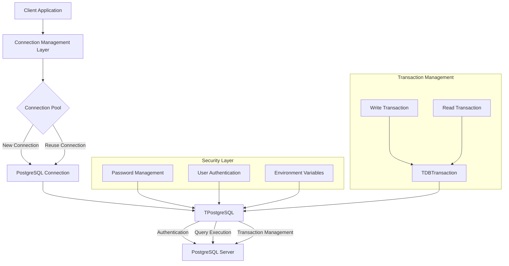
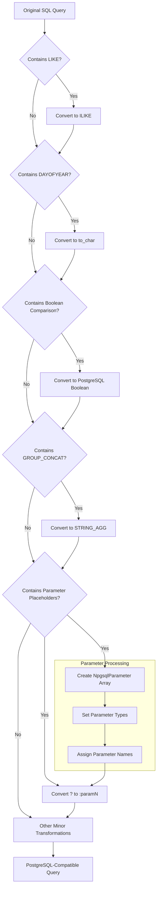
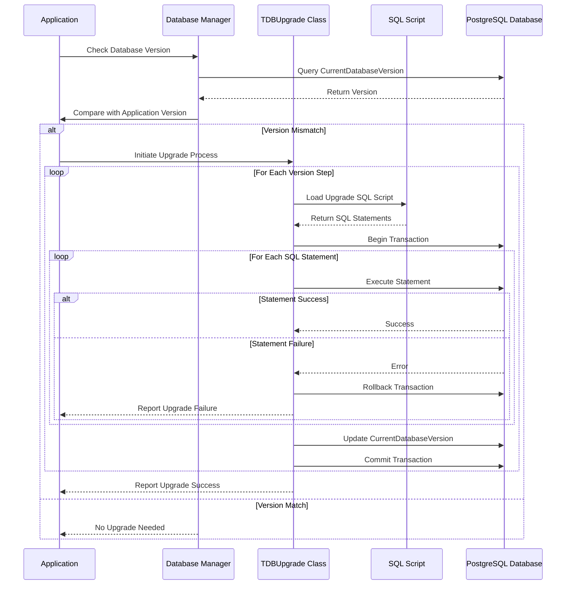

# PostgreSQL as OpenPetra's Primary Database

## PostgreSQL's Role in OpenPetra

OpenPetra has chosen PostgreSQL as its primary database system to support its mission of helping non-profit organizations manage their administration efficiently. This choice reflects PostgreSQL's unique combination of enterprise-grade features, reliability, and open-source licensing, which aligns perfectly with OpenPetra's own open-source philosophy.

PostgreSQL offers several key advantages that make it particularly suitable for non-profit organizations:

1. **Cost-effectiveness**: As an open-source database, PostgreSQL eliminates licensing costs, allowing non-profits to allocate their limited resources elsewhere.

2. **Robustness and reliability**: PostgreSQL is known for its data integrity, transaction support, and ACID compliance, ensuring that critical financial and donor data remains consistent and reliable.

3. **Cross-platform compatibility**: PostgreSQL runs on various operating systems, including Windows and Linux, supporting OpenPetra's cross-platform deployment strategy.

4. **Advanced features**: PostgreSQL provides sophisticated features like complex queries, foreign keys, triggers, and updatable views that OpenPetra leverages for its complex data relationships.

5. **Scalability**: PostgreSQL can handle databases from small to large, allowing OpenPetra to serve organizations of varying sizes.

The codebase demonstrates OpenPetra's commitment to PostgreSQL through specialized classes like `TPostgreSQL` that implement database-specific functionality while maintaining a clean abstraction layer.

# Database Connection Management

OpenPetra manages PostgreSQL connections through the `TPostgreSQL` class, which implements the `IDataBaseRDBMS` interface. This class provides a comprehensive set of methods for establishing and managing database connections, with careful attention to security and performance considerations.

## Connection Pooling

Connection pooling is a critical aspect of OpenPetra's database management strategy. The system leverages PostgreSQL's native connection pooling capabilities through the Npgsql .NET data provider. Connection parameters such as timeout, idle lifetime, and command timeout are configurable through application settings:

```csharp
AConnectionString = String.Format(
    "Server={0};Port={1};User Id={2};Database={3};Timeout={4};ConnectionIdleLifeTime={5};CommandTimeout={6}" +
    ";Password=", AServer, APort, AUsername, ADatabaseName,
    TAppSettingsManager.GetInt32("Server.DBConnectionTimeout", 10),
    TAppSettingsManager.GetInt32("Server.DBConnectionLifeTime", 300),
    TAppSettingsManager.GetInt32("Server.DBCommandTimeout", 3600));
```

This approach allows OpenPetra to efficiently reuse database connections, reducing the overhead of repeatedly establishing new connections and improving overall application performance.

## Security Considerations

Security is paramount in OpenPetra's connection management. The system implements several security measures:

1. **Password handling**: Passwords are never stored in plain text within the code and are passed securely to the connection string.

2. **Environment variables**: For command-line operations, PostgreSQL passwords are set via environment variables rather than command-line arguments:
   ```csharp
   Environment.SetEnvironmentVariable("PGPASSWORD", FPassword, EnvironmentVariableTarget.Process);
   ```

3. **Special user handling**: When running on Unix systems as the postgres user, OpenPetra uses sudo for proper privilege separation:
   ```csharp
   if (NAnt.Core.PlatformHelper.IsUnix && (FUsername == "postgres"))
   {
       SuperUser = "postgres";
   }
   ```

4. **Connection pool clearing**: The system provides methods to clear connection pools when necessary, though these are primarily used for testing to avoid security issues with lingering connections.

OpenPetra's connection management system strikes a balance between performance optimization through connection pooling and maintaining robust security practices.

# PostgreSQL Connection Architecture



## Connection Architecture Explanation

OpenPetra's PostgreSQL connection architecture is designed for efficiency, security, and reliability. The diagram illustrates how database connections are managed throughout the application lifecycle.

At the core of this architecture is the connection pooling mechanism, which maintains a collection of reusable database connections. When a client application requires database access, it first requests a connection from the pool. If an idle connection is available, it's immediately provided; otherwise, a new connection is established.

The `TPostgreSQL` class serves as the central component that interfaces with the Npgsql provider. It handles all PostgreSQL-specific operations, including authentication, query formatting, and transaction management. This class encapsulates the complexities of database interaction, providing a clean API for the rest of the application.

Security is implemented as a cross-cutting concern, with password management, user authentication, and environment variables all contributing to a secure connection process. For command-line operations, passwords are stored in environment variables rather than passed as command arguments, reducing security risks.

Transaction management is handled through the `TDBTransaction` class, which provides methods for both read and write operations. The architecture ensures that transactions are properly scoped and that resources are released appropriately when operations complete.

This well-structured connection architecture allows OpenPetra to maintain high performance while ensuring data integrity and security across all database operations.

# SQL Query Adaptation for PostgreSQL

OpenPetra employs sophisticated techniques to transform standard SQL queries into PostgreSQL-compatible format. This adaptation layer is crucial for maintaining database portability while leveraging PostgreSQL-specific features for optimal performance.

## Case-Insensitive Searches

One of the most significant adaptations is the transformation of case-sensitive `LIKE` operations to PostgreSQL's case-insensitive `ILIKE`. The `TPostgreSQL` class implements a complex parsing algorithm to ensure this conversion happens correctly:

```csharp
int posLike = -1;
int posStartQuote = -1;
bool inQuotes = false;
int pos = -1;

while (true)
{
    posLike = ReturnValue.IndexOf("LIKE", ++pos);
    posStartQuote = ReturnValue.IndexOf('\'', pos);

    if (posLike == -1)
    {
        break;
    }
    else if ((posLike > 0) && ReturnValue[posLike - 1] == 'I')
    {
        // nothing to do, it has already been replaced
        pos = posLike + 4;
    }
    else if ((posLike >= 0) && ((posStartQuote > posLike) || (posStartQuote == -1)) && !inQuotes)
    {
        // found a LIKE that needs changing
        ReturnValue = ReturnValue.Substring(0, posLike) + "I" + ReturnValue.Substring(posLike);
        pos = posLike + 4;
    }
    else if (posStartQuote >= 0)
    {
        inQuotes = !inQuotes;
        pos = posStartQuote;
    }
    else
    {
        break;
    }
}
```

This algorithm carefully tracks quoted strings to avoid modifying `LIKE` operators that appear within string literals, which could otherwise corrupt data.

## Date Function Conversions

PostgreSQL uses different date functions than standard SQL or other database systems. OpenPetra automatically converts these functions:

```csharp
// Get the correct function for DAYOFYEAR
while (ReturnValue.Contains("DAYOFYEAR("))
{
    ReturnValue = ReplaceDayOfYear(ReturnValue);
}
```

The `ReplaceDayOfYear` method transforms `DAYOFYEAR()` functions into PostgreSQL's `to_char()` function with appropriate format parameters:

```csharp
private String ReplaceDayOfYear(String ASqlCommand)
{
    // Implementation details...
    ReplacedDate = ReplacedDate + ", 'MMDD'";
    return ASqlCommand.Substring(0, StartIndex) + "to_char(" + ReplacedDate + ASqlCommand.Substring(EndBracketIndex);
}
```

## Parameter Handling

PostgreSQL uses named parameters (`:param1`) rather than positional parameters (`?`). OpenPetra's query adaptation layer automatically converts between these formats:

```csharp
StringBuilder SqlStatementBuilder = new StringBuilder();
int QMarkPos = 0;
int LastQMarkPos = -1;
int ParamCounter = 0;

while ((QMarkPos = ASqlStatement.IndexOf("?", QMarkPos + 1)) > 0)
{
    SqlStatementBuilder.Append(ASqlStatement.Substring(
            LastQMarkPos + 1, QMarkPos - LastQMarkPos - 1));
    SqlStatementBuilder.Append(":").Append(ReturnValue[ParamCounter].ParameterName);

    ParamCounter++;
    LastQMarkPos = QMarkPos;
}
```

## Other Adaptations

Additional PostgreSQL-specific adaptations include:

1. **Boolean conversions**: Converting numeric boolean representations to PostgreSQL's native boolean type:
   ```csharp
   ReturnValue = ReturnValue.Replace("_l = 1", "_l = true");
   ReturnValue = ReturnValue.Replace("_l = 0", "_l = false");
   ```

2. **String aggregation**: Converting `GROUP_CONCAT` to PostgreSQL's `STRING_AGG`:
   ```csharp
   ReturnValue = ReturnValue.Replace("GROUP_CONCAT(", "STRING_AGG(");
   ReturnValue = ReturnValue.Replace(" SEPARATOR ',')", ",',')");
   ```

3. **Schema handling**: Standardizing schema references:
   ```csharp
   ReturnValue = Regex.Replace(ReturnValue, "PUB_|PUB\\.", "public.", RegexOptions.IgnoreCase);
   ```

These adaptations ensure that OpenPetra's SQL queries work seamlessly with PostgreSQL while maintaining compatibility with the application's data access layer.

# SQL Query Transformation Process



## Query Transformation Process Explanation

The diagram illustrates OpenPetra's comprehensive SQL query transformation process that converts standard SQL queries into PostgreSQL-compatible format. This multi-stage process ensures that all aspects of SQL syntax are properly adapted.

The transformation begins with the original SQL query and proceeds through a series of checks and conversions. Each step addresses a specific aspect of PostgreSQL compatibility:

1. **LIKE to ILIKE Conversion**: PostgreSQL's `LIKE` operator is case-sensitive by default, unlike many other databases. OpenPetra converts `LIKE` to `ILIKE` for case-insensitive searches, but carefully avoids modifying `LIKE` operators within quoted strings.

2. **Date Function Conversion**: The `DAYOFYEAR()` function is replaced with PostgreSQL's `to_char()` function with appropriate format parameters. This handles differences in date manipulation between database systems.

3. **Boolean Conversion**: Numeric boolean representations (`_l = 1`, `_l = 0`) are converted to PostgreSQL's native boolean values (`true`, `false`).

4. **Aggregate Function Conversion**: SQL's `GROUP_CONCAT` function is replaced with PostgreSQL's equivalent `STRING_AGG` function.

5. **Parameter Placeholder Conversion**: ODBC-style parameter placeholders (`?`) are replaced with PostgreSQL's named parameters (`:param1`, `:param2`, etc.).

6. **Parameter Processing**: For parameterized queries, the system creates an array of `NpgsqlParameter` objects, sets appropriate types based on the original parameters, and assigns names that correspond to the placeholders in the transformed query.

7. **Other Transformations**: Additional minor transformations include handling schema references, removing backticks, and adjusting INSERT statements.

This sophisticated transformation process allows OpenPetra to maintain a database-agnostic application layer while fully leveraging PostgreSQL's capabilities and syntax requirements. The result is a query that is optimized for PostgreSQL execution while preserving the original semantic intent.

# Database Schema Versioning and Upgrades

OpenPetra implements a robust database schema versioning and upgrade system through the `TDBUpgrade` class. This system ensures that the database schema can evolve alongside the application while maintaining data integrity and backward compatibility.

## Version Tracking

The current database version is stored in the `s_system_defaults` table:

```sql
INSERT INTO s_system_defaults(s_default_code_c, s_default_description_c, s_default_value_c) 
VALUES ('CurrentDatabaseVersion', 'the currently installed release number, set by installer/patchtool', '{#RELEASEVERSION}');
```

This value is replaced during the build process with the actual release version, allowing the application to detect version mismatches between the code and database.

## Upgrade Process

The upgrade process is managed through a series of version-specific upgrade methods in the `TDBUpgrade` class. Each method follows a naming convention `UpgradeDatabaseYYYYMM_YYYYMM`, where the first date represents the source version and the second represents the target version.

For example, the method to upgrade from version 2020-04 to 2020-06 is implemented as:

```csharp
public static bool UpgradeDatabase202004_202006(TDataBase ADataBase)
{
    // add new tables for data consent, and some values
    // add permission for p_country
    TDBTransaction SubmitChangesTransaction = new TDBTransaction();
    bool SubmitOK = false;

    ADataBase.WriteTransaction(ref SubmitChangesTransaction,
        ref SubmitOK,
        delegate
        {
            string[] SqlStmts = TDataBase.ReadSqlFile("Upgrade202004_202006.sql").Split(new char[]{';'});

            foreach (string stmt in SqlStmts)
            {
                if (stmt.Trim().Length > 0)
                {
                    ADataBase.ExecuteNonQuery(stmt, SubmitChangesTransaction);
                }
            }

            SubmitOK = true;
        });
    return true;
}
```

## SQL Migration Scripts

The actual schema changes are defined in SQL migration scripts, which are stored in separate files following the same naming convention as the upgrade methods. This separation of code and SQL allows for clearer version control and easier review of schema changes.

For example, the `Upgrade202003_202004.sql` script contains:

```sql
INSERT INTO p_type(p_type_code_c, p_type_description_c) VALUES('BOARDING_SCHOOL','Child at school');
INSERT INTO p_type(p_type_code_c, p_type_description_c) VALUES('CHILDREN_HOME','Child at Orphanage');
-- Additional statements...
```

## Transaction Handling

All schema changes are executed within a transaction to ensure atomicity. If any part of the upgrade fails, the entire transaction is rolled back, preventing partial upgrades that could leave the database in an inconsistent state:

```csharp
ADataBase.WriteTransaction(ref SubmitChangesTransaction,
    ref SubmitOK,
    delegate
    {
        // SQL execution code...
        SubmitOK = true;
    });
```

## Incremental Upgrades

OpenPetra's upgrade system is designed to support incremental upgrades. Each upgrade method handles the transition between two specific versions, and the system can chain these methods together to upgrade across multiple versions if necessary.

Some upgrade methods may not require any schema changes:

```csharp
public static bool UpgradeDatabase202006_202009(TDataBase ADataBase)
{
    // no changes in the database structure
    return true;
}
```

These "empty" upgrades maintain version continuity and allow for non-schema changes in the application code.

# Database Upgrade Workflow



## Database Upgrade Workflow Explanation

The sequence diagram illustrates the comprehensive workflow for upgrading the PostgreSQL database schema in OpenPetra. This process ensures safe, transactional upgrades between versions while maintaining data integrity.

The upgrade process begins when the application starts and checks the current database version against the application version. If a mismatch is detected, the upgrade process is initiated through the `TDBUpgrade` class.

For each version step (e.g., from 2020-04 to 2020-06, then from 2020-06 to 2020-09), the following sequence occurs:

1. **Load SQL Script**: The appropriate upgrade SQL script is loaded from the file system. These scripts follow a naming convention like `Upgrade202004_202006.sql`.

2. **Begin Transaction**: A database transaction is started to ensure atomicity of the upgrade process.

3. **Execute SQL Statements**: The SQL statements from the script are executed sequentially within the transaction:
   ```csharp
   foreach (string stmt in SqlStmts)
   {
       if (stmt.Trim().Length > 0)
       {
           ADataBase.ExecuteNonQuery(stmt, SubmitChangesTransaction);
       }
   }
   ```

4. **Error Handling**: If any statement fails, the entire transaction is rolled back, preserving the database in its original state, and an error is reported.

5. **Update Version**: Upon successful execution of all statements, the `CurrentDatabaseVersion` in the `s_system_defaults` table is updated to reflect the new version.

6. **Commit Transaction**: The transaction is committed, making all changes permanent.

This process repeats for each version step until the database reaches the current application version. The transactional nature of the process ensures that the database is always in a consistent state—either at the original version if the upgrade fails, or at the target version if it succeeds.

The workflow also accommodates "empty" upgrades where no schema changes are needed but version numbers still need to be incremented. This flexibility allows OpenPetra to maintain version compatibility across all components of the system.

# Bulk Data Loading with COPY Command

OpenPetra leverages PostgreSQL's `COPY` command for efficient bulk data loading, particularly for reference and initialization data. This approach significantly outperforms individual `INSERT` statements when loading large datasets, making it ideal for system initialization and data migration scenarios.

## Implementation in OpenPetra

The `COPY` command is extensively used in initialization scripts like `init.sql` to populate reference tables with base data:

```sql
COPY p_location_type FROM '{#ABSOLUTEBASEDATAPATH}/p_location_type.csv' WITH DELIMITER AS ',' NULL AS '?' CSV QUOTE AS '"' ESCAPE AS '"';
COPY u_unit_type FROM '{#ABSOLUTEBASEDATAPATH}/u_unit_type.csv' WITH DELIMITER AS ',' NULL AS '?' CSV QUOTE AS '"' ESCAPE AS '"';
COPY p_international_postal_type FROM '{#ABSOLUTEBASEDATAPATH}/p_international_postal_type.csv' WITH DELIMITER AS ',' NULL AS '?' CSV QUOTE AS '"' ESCAPE AS '"';
```

The system uses a standardized format for all `COPY` commands:
- Comma (`,`) as the delimiter
- Question mark (`?`) to represent NULL values
- Double quotes (`"`) for quoting and escaping

## Path Placeholders

The SQL scripts use placeholders like `{#ABSOLUTEBASEDATAPATH}` that are replaced during the build process with actual file paths:

```sql
COPY a_ledger FROM '{#ABSOLUTEBASEDATAPATH}/a_ledger.csv' WITH DELIMITER AS ',' NULL AS '?' CSV QUOTE AS '"' ESCAPE AS '"';
```

This approach allows the same scripts to work across different environments and installation paths.

## Performance Optimization

The `COPY` command offers several performance advantages:
1. **Reduced overhead**: A single `COPY` command replaces potentially thousands of individual `INSERT` statements
2. **Batch processing**: Data is processed in batches rather than row-by-row
3. **Reduced logging**: Minimal transaction log entries compared to individual inserts
4. **Network efficiency**: Data is streamed efficiently from files to the database

## Integration with Build Process

The bulk loading process is integrated with OpenPetra's build system through the `PsqlTask` NAnt task, which executes PostgreSQL commands:

```csharp
process.StartInfo.Arguments = "-q -f \"" + FSQLFile + "\"";
```

This task handles the execution of SQL scripts containing `COPY` commands, managing authentication and error handling.

## Error Handling

The `PsqlTask` includes specific error handling for the `COPY` command:

```csharp
foreach (string line in output)
{
    if (!(line.Trim().StartsWith("INSERT") || line.Trim().StartsWith("GRANT") || line.Trim().StartsWith("COPY")
          || line.Trim().StartsWith("DELETE")))
    {
        Console.WriteLine(line);
    }
}
```

This code filters common output messages to reduce console noise while still capturing actual errors.

By leveraging PostgreSQL's `COPY` command, OpenPetra achieves efficient data loading during system initialization, database migration, and testing scenarios, contributing to faster deployment and setup times.

# Sequence Management in PostgreSQL

OpenPetra implements a comprehensive approach to managing auto-incrementing values using PostgreSQL sequences. This system handles the generation of unique identifiers for various entities while addressing the specific behavior of sequences in PostgreSQL transactions.

## Sequence Implementation

PostgreSQL sequences are used throughout OpenPetra to generate primary key values. The `TPostgreSQL` class provides methods for interacting with these sequences:

```csharp
public System.Int64 GetNextSequenceValue(String ASequenceName, TDBTransaction ATransaction, TDataBase ADatabase)
{
    return Convert.ToInt64(ADatabase.ExecuteScalar("SELECT NEXTVAL('" + ASequenceName + "')", ATransaction));
}

public System.Int64 GetCurrentSequenceValue(String ASequenceName, TDBTransaction ATransaction, TDataBase ADatabase)
{
    return Convert.ToInt64(ADatabase.ExecuteScalar("SELECT last_value FROM " + ASequenceName + "", ATransaction));
}
```

## Transaction Behavior Considerations

A critical aspect of PostgreSQL sequence management is that sequence values persist even if the transaction is rolled back. The code explicitly warns about this behavior:

```csharp
/// <summary>
/// Returns the next Sequence Value for the given Sequence from the DB. - IMPORTANT: This increasing of the
/// Value of the Sequence PERSISTS in the PostgreSQL implmentation even if the DB Transction gets rolled back!!!
/// --> See https://wiki.openpetra.org/index.php/PostgreSQL:_Sequences_Not_Tied_to_DB_Transactions
/// </summary>
```

This behavior differs from some other database systems and requires careful consideration in transaction design.

## Sequence Creation and Initialization

Sequences are created during database initialization or upgrade processes. For example, the `Upgrade202003_202004.sql` script creates a sequence for partner reminders:

```sql
CREATE TABLE seq_partner_reminder (sequence INTEGER AUTO_INCREMENT, dummy INTEGER, PRIMARY KEY(sequence));
```

## Sequence Resetting

OpenPetra provides functionality to reset sequences to specific values when necessary:

```csharp
public void RestartSequence(String ASequenceName,
    TDBTransaction ATransaction,
    TDataBase ADatabase,
    Int64 ARestartValue)
{
    ADatabase.ExecuteScalar(
        "SELECT pg_catalog.setval('" + ASequenceName + "', " + ARestartValue.ToString() + ", true);", ATransaction);
}
```

This is particularly useful during data migration or when synchronizing sequences across systems.

## ID Generation in Practice

In practice, sequence values are typically obtained within a transaction and immediately used to create new records. For example, when creating a new partner, the system might:

1. Get the next value from the partner sequence
2. Use this value as the primary key for the new partner record
3. Commit the transaction to persist both the sequence increment and the new record

The demo data initialization shows how sequence values are managed after bulk loading:

```sql
UPDATE p_partner_ledger SET p_last_partner_id_i = 5004 WHERE p_partner_key_n = 43000000; 
-- increase sequence
SELECT nextval('seq_bank_details');
SELECT nextval('seq_bank_details');
SELECT nextval('seq_location_number');
```

This ensures that subsequent auto-generated IDs will not conflict with the loaded data.

By carefully managing PostgreSQL sequences, OpenPetra ensures reliable ID generation while accounting for the specific transaction behavior of sequences in PostgreSQL.

# Database Schema Overview

```mermaid
erDiagram
    p_partner {
        int p_partner_key_n PK
        string p_partner_short_name_c
        string p_partner_class_c
        string p_status_code_c
        longtext p_comment_c
    }
    
    p_partner_type {
        int p_partner_key_n PK,FK
        string p_type_code_c PK
    }
    
    p_person {
        int p_partner_key_n PK,FK
        string p_first_name_c
        string p_family_name_c
        date p_date_of_birth_d
        string p_gender_c
    }
    
    p_family {
        int p_partner_key_n PK,FK
        string p_marital_status_c
        date p_date_of_birth_d
        string p_gender_c
        longtext p_photo_b
    }
    
    p_organisation {
        int p_partner_key_n PK,FK
        string p_organisation_name_c
    }
    
    p_unit {
        int p_partner_key_n PK,FK
        string p_unit_name_c
        string u_unit_type_code_c
    }
    
    p_location {
        int p_site_key_n PK
        int p_location_key_i PK
        string p_street_name_c
        string p_country_code_c
    }
    
    p_partner_location {
        int p_partner_key_n PK,FK
        int p_site_key_n PK,FK
        int p_location_key_i PK,FK
    }
    
    a_ledger {
        int a_ledger_number_i PK
        string a_ledger_name_c
        string a_currency_code_c FK
    }
    
    a_account {
        int a_ledger_number_i PK,FK
        string a_account_code_c PK
        string a_account_description_c
        string a_account_type_c
    }
    
    a_cost_centre {
        int a_ledger_number_i PK,FK
        string a_cost_centre_code_c PK
        string a_cost_centre_name_c
        bool a_posting_cost_centre_flag_l
    }
    
    a_transaction {
        int a_ledger_number_i PK,FK
        int a_batch_number_i PK,FK
        int a_journal_number_i PK,FK
        int a_transaction_number_i PK
        date a_transaction_date_d
        string a_narrative_c
    }
    
    a_gift_batch {
        int a_ledger_number_i PK,FK
        int a_batch_number_i PK
        date a_gl_effective_date_d
        string a_bank_account_code_c
        string a_bank_cost_centre_c
    }
    
    p_banking_details {
        int p_banking_details_key_i PK
        int p_banking_type_i
        string p_account_name_c
        int p_bank_key_n FK
        string p_bank_account_number_c
    }
    
    p_partner ||--o{ p_partner_type : "has types"
    p_partner ||--o| p_person : "can be"
    p_partner ||--o| p_family : "can be"
    p_partner ||--o| p_organisation : "can be"
    p_partner ||--o| p_unit : "can be"
    p_partner ||--o{ p_partner_location : "has locations"
    p_partner_location }o--|| p_location : "refers to"
    a_ledger ||--o{ a_account : "has accounts"
    a_ledger ||--o{ a_cost_centre : "has cost centers"
    a_ledger ||--o{ a_transaction : "has transactions"
    a_ledger ||--o{ a_gift_batch : "has gift batches"
    p_partner ||--o{ p_banking_details : "has banking details"
```



## Database Schema Overview Explanation

OpenPetra's PostgreSQL database schema is designed to support the diverse needs of non-profit organizations, with particular emphasis on partner management and accounting functionality. The entity-relationship diagram illustrates the core tables and their relationships.

### Partner Management Module

The partner management system is built around the central `p_partner` table, which serves as the foundation for all entity types in the system. This flexible design allows different types of entities to share common attributes while maintaining specialized information in related tables:

- **Partner Base**: The `p_partner` table stores common attributes like partner key, short name, class, and status.
- **Partner Types**: The `p_partner_type` table implements a many-to-many relationship allowing partners to have multiple classifications.
- **Specialized Partner Types**: Tables like `p_person`, `p_family`, `p_organisation`, and `p_unit` extend the base partner with type-specific attributes.
- **Location Management**: The `p_location` and `p_partner_location` tables manage physical addresses and their association with partners.

This design supports OpenPetra's ability to handle diverse entity types including individuals, families, organizations, and internal units, all within a unified partner framework.

### Accounting Module

The accounting system is centered around the `a_ledger` table, which represents a set of financial books:

- **Chart of Accounts**: The `a_account` table defines the accounts used within each ledger.
- **Cost Centers**: The `a_cost_centre` table provides dimensional analysis for financial transactions.
- **Transactions**: The `a_transaction` table stores individual financial entries.
- **Gift Processing**: The `a_gift_batch` table manages batches of donations and gifts.

### Banking Integration

Banking information is managed through the `p_banking_details` table, which stores account information that can be associated with partners. This supports features like direct debits, bank transfers, and bank statement reconciliation.

### Key Design Principles

The schema demonstrates several important design principles:

1. **Hierarchical Organization**: Many tables use hierarchical relationships (e.g., cost centers can report to parent cost centers).
2. **Flexible Classification**: The type system allows for dynamic classification of entities.
3. **Separation of Concerns**: Financial data is clearly separated from partner information while maintaining necessary relationships.
4. **Internationalization**: Support for multiple currencies, languages, and country-specific requirements.

This well-structured database schema provides the foundation for OpenPetra's comprehensive functionality while maintaining flexibility for diverse organizational needs.

# PostgreSQL in Build and Deployment

OpenPetra integrates PostgreSQL into its build and deployment processes through a sophisticated set of NAnt tasks and scripts. This integration ensures consistent database initialization, testing, and deployment across different environments.

## NAnt Tasks for PostgreSQL

The `PsqlTask` class implements a NAnt task specifically for executing PostgreSQL commands during the build process:

```csharp
[TaskName("psql")]
public class PsqlTask : NAnt.Core.Task
{
    // Properties and implementation...
}
```

This task provides a bridge between the build system and PostgreSQL, allowing build scripts to execute SQL commands or scripts with configurable connection parameters.

## Database Initialization

During the build process, OpenPetra initializes the PostgreSQL database using SQL scripts that create the schema and load initial data:

```csharp
process.StartInfo.Arguments = "-q -f \"" + FSQLFile + "\"";
Log(Level.Info, "Load sql commands from file: " + FSQLFile);
```

The initialization scripts use PostgreSQL's `COPY` command to efficiently load reference data:

```sql
COPY p_location_type FROM '{#ABSOLUTEBASEDATAPATH}/p_location_type.csv' WITH DELIMITER AS ',' NULL AS '?' CSV QUOTE AS '"' ESCAPE AS '"';
COPY u_unit_type FROM '{#ABSOLUTEBASEDATAPATH}/u_unit_type.csv' WITH DELIMITER AS ',' NULL AS '?' CSV QUOTE AS '"' ESCAPE AS '"';
// Additional COPY commands...
```

## Password Management

The build process handles sensitive information like database passwords securely:

```csharp
Environment.SetEnvironmentVariable("PGPASSWORD", FPassword, EnvironmentVariableTarget.Process);
Environment.SetEnvironmentVariable("PGOPTIONS", "--client-min-messages=warning", EnvironmentVariableTarget.Process);
```

Passwords are also inserted into SQL scripts through placeholders that are replaced during the build:

```sql
-- passwords are inserted by OpenPetra.build
INSERT INTO s_user(s_user_id_c, s_password_hash_c, s_password_salt_c, s_pwd_scheme_version_i, s_password_needs_change_l) 
VALUES('SYSADMIN', '{#PASSWORDHASHSYSADMIN}', '{#PASSWORDSALTSYSADMIN}', 0, true);
```

## Platform-Specific Handling

The build system accommodates platform differences between Windows and Unix systems:

```csharp
if (NAnt.Core.PlatformHelper.IsUnix && (FUsername == "postgres"))
{
    SuperUser = "postgres";
}

if (SuperUser.Length > 0)
{
    process.StartInfo.FileName = "sudo";
    process.StartInfo.Arguments = "-u " + SuperUser + " " + FPsqlExecutable + " " + process.StartInfo.Arguments;
}
```

This ensures that PostgreSQL commands execute with the appropriate permissions regardless of the operating system.

## Test Data Generation

OpenPetra's build process includes the generation of test databases with sample data:

```sql
-- import sample partners (donor and supplier)
COPY p_partner FROM '{#ABSOLUTEBASEDATAPATH}/p_partner.csv' WITH DELIMITER AS ',' NULL AS '?' CSV QUOTE AS '"' ESCAPE AS '"';
COPY p_family FROM '{#ABSOLUTEBASEDATAPATH}/p_family.csv' WITH DELIMITER AS ',' NULL AS '?' CSV QUOTE AS '"' ESCAPE AS '"';
// Additional COPY commands...
```

These test databases are used for automated testing and demonstrations.

## Database Versioning

The build system sets the database version to match the application release version:

```sql
INSERT INTO s_system_defaults(s_default_code_c, s_default_description_c, s_default_value_c) 
VALUES ('CurrentDatabaseVersion', 'the currently installed release number, set by installer/patchtool', '{#RELEASEVERSION}');
```

This ensures consistency between the application and database versions.

By integrating PostgreSQL into the build and deployment processes, OpenPetra ensures reliable database setup and consistent behavior across development, testing, and production environments.

# Performance Considerations and Optimization

OpenPetra implements several PostgreSQL-specific performance optimizations to ensure efficient database operations, particularly important for non-profit organizations that may have limited IT resources.

## Connection Pooling

Connection pooling is a critical optimization that reduces the overhead of repeatedly establishing database connections:

```csharp
AConnectionString = String.Format(
    "Server={0};Port={1};User Id={2};Database={3};Timeout={4};ConnectionIdleLifeTime={5};CommandTimeout={6}" +
    ";Password=", AServer, APort, AUsername, ADatabaseName,
    TAppSettingsManager.GetInt32("Server.DBConnectionTimeout", 10),
    TAppSettingsManager.GetInt32("Server.DBConnectionLifeTime", 300),
    TAppSettingsManager.GetInt32("Server.DBCommandTimeout", 3600));
```

The `ConnectionIdleLifeTime` parameter configures how long connections remain in the pool before being closed, balancing resource usage with connection availability.

## Bulk Data Loading

For large data imports, OpenPetra uses PostgreSQL's `COPY` command instead of individual `INSERT` statements:

```sql
COPY p_partner FROM '{#ABSOLUTEBASEDATAPATH}/p_partner.csv' WITH DELIMITER AS ',' NULL AS '?' CSV QUOTE AS '"' ESCAPE AS '"';
```

This approach can be orders of magnitude faster than individual inserts, particularly for initial data loading and migrations.

## Query Optimization

The `TPostgreSQL` class transforms queries to leverage PostgreSQL-specific optimizations:

1. **Case-insensitive searches**: Converting `LIKE` to `ILIKE` for case-insensitive searches without requiring function calls on indexed columns:
   ```csharp
   ReturnValue = ReturnValue.Substring(0, posLike) + "I" + ReturnValue.Substring(posLike);
   ```

2. **Date function optimization**: Converting standard SQL date functions to PostgreSQL's more efficient equivalents:
   ```csharp
   private String ReplaceDayOfYear(String ASqlCommand)
   {
       // Implementation that converts to PostgreSQL's to_char function
   }
   ```

3. **Parameter handling**: Using PostgreSQL's native parameter handling to prevent SQL injection and improve query plan caching:
   ```csharp
   SqlStatementBuilder.Append(":").Append(ReturnValue[ParamCounter].ParameterName);
   ```

## Transaction Management

OpenPetra carefully manages transactions to balance data integrity with performance:

```csharp
ADataBase.WriteTransaction(ref SubmitChangesTransaction,
    ref SubmitOK,
    delegate
    {
        // Database operations
        SubmitOK = true;
    });
```

This pattern ensures that related operations are grouped in a single transaction, reducing overhead while maintaining ACID properties.

## Sequence Optimization

The system is designed to efficiently handle PostgreSQL sequences for ID generation:

```csharp
public System.Int64 GetNextSequenceValue(String ASequenceName, TDBTransaction ATransaction, TDataBase ADatabase)
{
    return Convert.ToInt64(ADatabase.ExecuteScalar("SELECT NEXTVAL('" + ASequenceName + "')", ATransaction));
}
```

This approach minimizes round-trips to the database when generating IDs for new records.

## Command Timeout Configuration

Long-running operations like reports and batch processes benefit from configurable command timeouts:

```csharp
TAppSettingsManager.GetInt32("Server.DBCommandTimeout", 3600)
```

This prevents premature termination of legitimate long-running queries while still providing protection against runaway queries.

By implementing these PostgreSQL-specific optimizations, OpenPetra achieves good performance even on modest hardware, making it suitable for non-profit organizations with limited IT resources.

[Generated by the Sage AI expert workbench: 2025-03-30 02:22:57  https://sage-tech.ai/workbench]: #