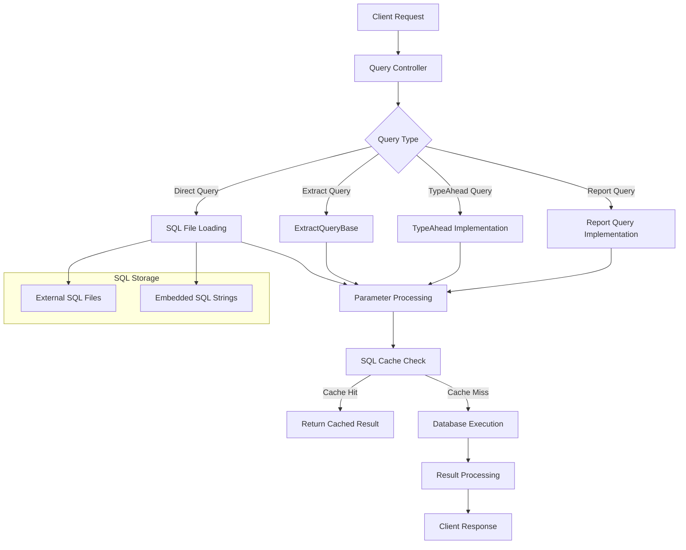
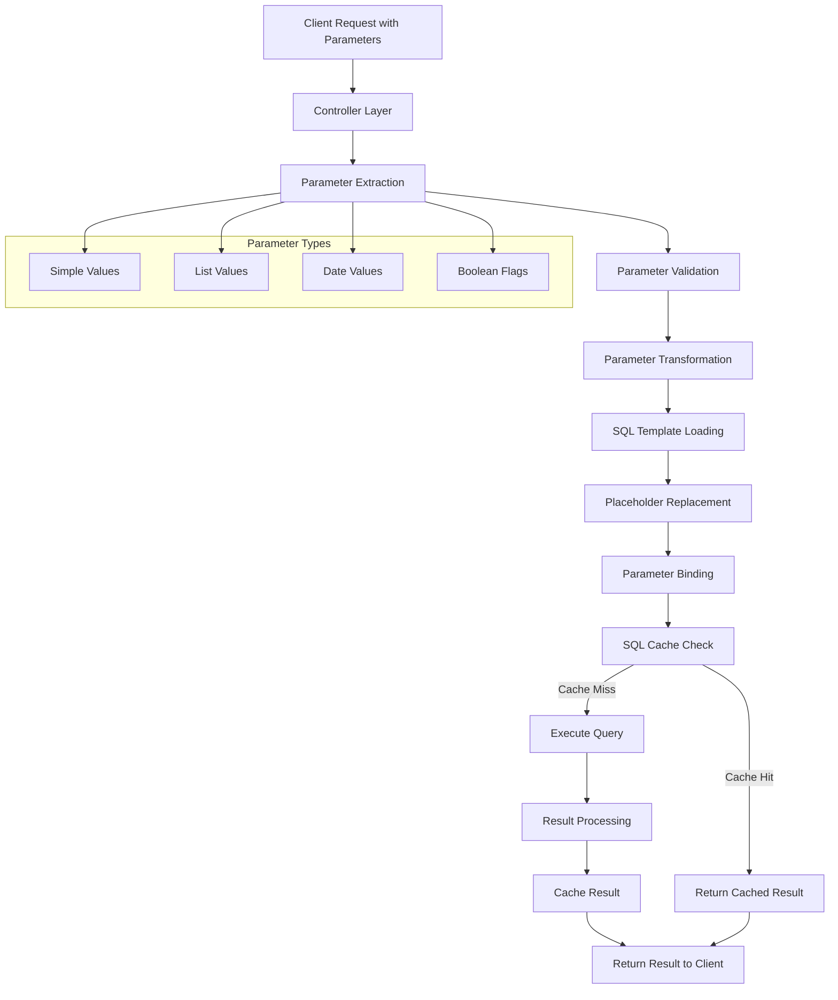
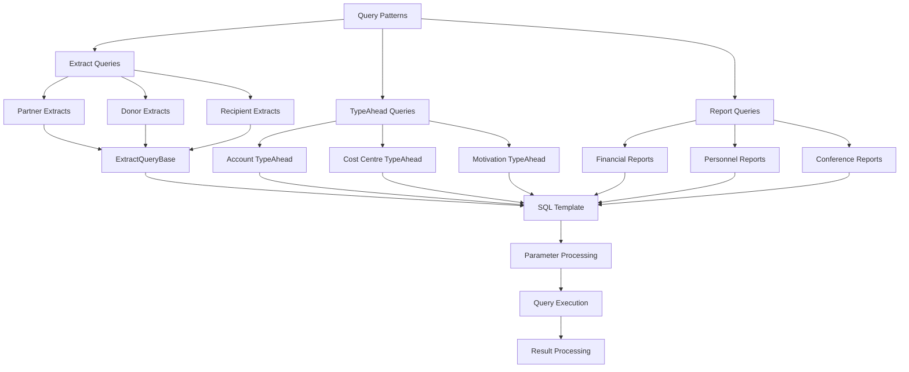

# Overview of Database Query Architecture in OpenPetra

## Overview of Database Query Architecture in OpenPetra

OpenPetra implements a multi-layered database query architecture that separates SQL definition from execution logic, supporting parameterized queries for security and flexibility. The system employs a combination of object-oriented design patterns and SQL abstraction techniques to provide a robust framework for database operations across various modules including finance, personnel, and partner management.

## SQL Query Organization and Storage

OpenPetra stores SQL queries in both external .sql files and embedded within C# code, using a file-based approach for complex queries and direct string definitions for simpler ones. This separation of concerns allows for better maintainability and reuse of SQL statements. SQL files are organized by functional domain (e.g., Finance, Partner, Personnel) and query purpose (e.g., Extract, TypeAhead, Report). The system uses a consistent naming convention that reflects the module, operation type, and specific functionality, such as "Gift.Queries.ExtractDonorByField.sql" or "Finance.TypeAheadAccountCode.sql". The `TDataBase.ReadSqlFile()` method provides a centralized mechanism for loading these external SQL files when needed.

## OpenPetra Query Architecture Layers

## Parameter Handling and Security

The system uses parameterized queries with ODBC parameters to prevent SQL injection, supporting various parameter types including lists, dates, and boolean flags. Parameter handling is implemented through the `OdbcParameter` class and specialized helper classes like `TDbListParameterValue` for list parameters. The architecture includes robust type conversion and validation to ensure parameters are correctly formatted before being passed to the database. For example, in `ExtractQueryBase.cs`, the system handles complex parameter types including postal codes, date ranges, and partner keys with appropriate validation and formatting.

The parameter handling system supports:
- Simple value parameters (strings, numbers, dates)
- List parameters for IN clauses
- Boolean parameters for conditional filtering
- Date parameters with time component handling
- Nullable parameters with appropriate default values

## Dynamic Query Construction

OpenPetra implements techniques for dynamic query construction including placeholder replacement, conditional SQL blocks, and runtime SQL modification based on user parameters. The system uses several approaches for dynamic query construction:

1. **Placeholder Replacement**: SQL files contain tokens like `##address_filter_fields##` that are replaced at runtime with appropriate SQL fragments.

2. **Conditional SQL Blocks**: Using preprocessor-like directives such as `{#IFDEF BYEXTRACT}` and `{#ENDIF BYEXTRACT}` to include or exclude SQL segments based on runtime conditions.

3. **Parameter-Based Conditions**: Using patterns like `(? OR field = ?)` to create optional filtering conditions.

4. **Dynamic JOIN Construction**: Building complex join clauses based on the query requirements and available data.

The `TRptFormatQuery` class in `FormatQuery.cs` provides sophisticated functionality for replacing variables in SQL templates with actual values, handling different parameter formats, and maintaining SQL statement integrity.

## Query Parameter Flow

## Extract Query Pattern

The Extract Query pattern is extensively used to retrieve filtered datasets of partners, donors, and other entities based on complex criteria for reporting and analysis. This pattern is implemented through the `ExtractQueryBase` abstract class, which provides a framework for building extract queries with consistent parameter handling, transaction management, and result processing. Specialized extract implementations like `QueryDonorByField`, `QueryPartnerByCity`, and `QueryPartnerByEvent` extend this base class to provide domain-specific extraction logic.

The Extract Query pattern supports:
- Filtering by multiple criteria
- Address-based filtering with postal code ranges
- Date range filtering
- Partner status and type filtering
- Integration with the extract management system for storing results

## Query Caching Mechanism

TSQLCache provides query result caching to improve performance by storing datasets for frequently executed queries, with mechanisms for cache invalidation when data changes. The cache stores SQL queries as strings along with their parameters and corresponding datasets. Key functionality includes retrieving cached datasets or executing new queries when needed, comparing SQL statements and parameters to identify matches, and invalidating cache entries when tables are modified.

The caching system is implemented in `Cache.cs` and provides methods for:
- Getting datasets (`GetDataSet`)
- Getting data tables (`GetDataTable`)
- Getting string lists (`GetStringList`)
- Invalidating cache entries for specific tables

The cache maintains internal state through `storedDataSet`, `storedSQLQuery`, and `storedParameters` ArrayLists. The implementation includes safeguards to return copies of cached datasets to prevent modifications affecting the cache.

## Common Query Patterns in OpenPetra

## Database Upgrade Queries

OpenPetra implements a versioned database upgrade system with SQL scripts that modify schema and data, executed within transactions to ensure database integrity. The upgrade system is implemented through the `TDBUpgrade` class with version-specific upgrade methods like `UpgradeDatabase201909_201910`. These methods typically read SQL statements from external files, split them by semicolons, and execute each statement within a transaction. The system supports both schema changes and data migrations, with appropriate error handling and transaction management to ensure database consistency.

The upgrade process follows these steps:
1. Determine the current database version
2. Identify the required upgrade path
3. Execute each upgrade step in sequence
4. Verify the upgrade was successful
5. Update the database version

## Specialized Financial Queries

Financial modules use complex queries for gift processing, accounting, and reporting with support for multi-currency operations, tax calculations, and fiscal period handling. These queries often join multiple tables to retrieve comprehensive financial information, including:

- Gift details with donor and recipient information
- Account transactions with ledger and journal details
- Banking information for electronic funds transfers
- Tax-deductible amounts for receipt generation
- Currency conversion for international operations

The financial queries handle complex business rules such as:
- Gift batch processing and posting
- Motivation-based accounting
- International Clearing House (ICH) operations
- Receipt generation with tax implications
- Bank statement reconciliation

## Query Performance Considerations

The system addresses performance through techniques like pagination for large result sets, selective column retrieval, and optimized join strategies for complex relationships. Performance optimization strategies include:

1. **Pagination**: The `TPagedDataSet` class provides infrastructure for retrieving large result sets in manageable chunks.

2. **Selective Column Retrieval**: Queries are designed to retrieve only the necessary columns rather than using `SELECT *`.

3. **Optimized Joins**: Complex queries use appropriate join types (INNER, LEFT OUTER) based on the data relationships.

4. **Query Caching**: The `TSQLCache` class provides caching for frequently executed queries.

5. **Indexing Awareness**: Queries are designed to leverage database indexes for efficient execution.

6. **Transaction Management**: Appropriate transaction isolation levels are used to balance consistency and performance.

The architecture demonstrates a well-designed approach to database access that balances flexibility, security, and performance while maintaining separation of concerns between SQL definition and execution logic.

[Generated by the Sage AI expert workbench: 2025-03-30 02:22:57  https://sage-tech.ai/workbench]: #