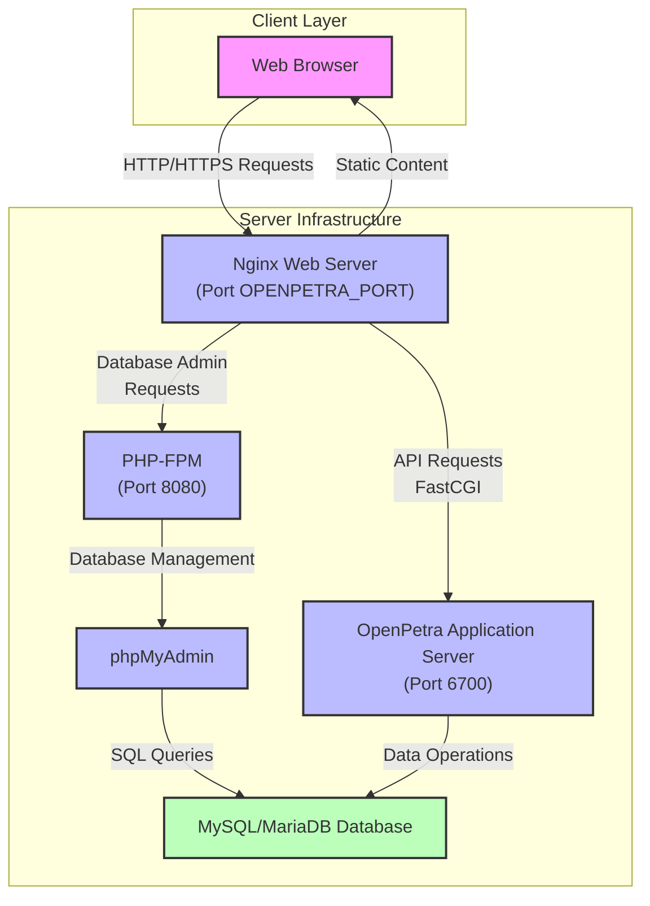
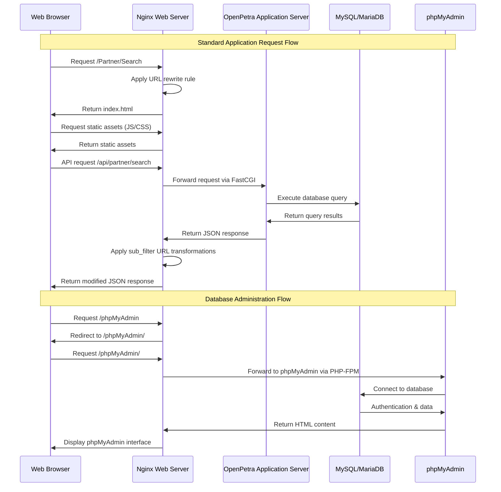
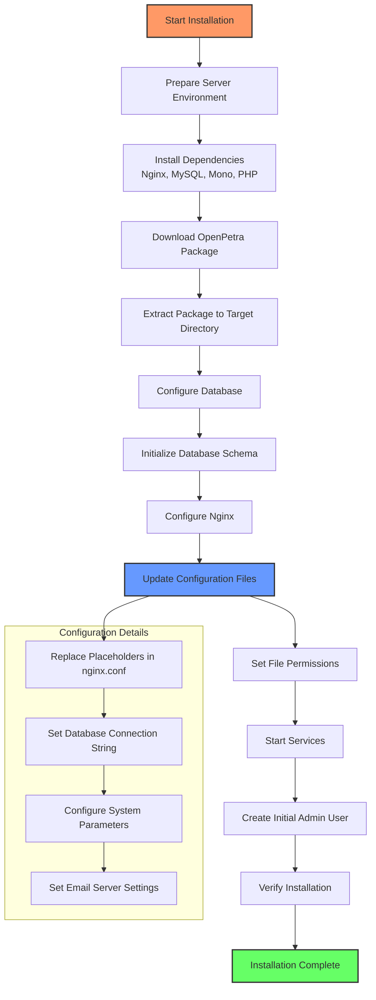
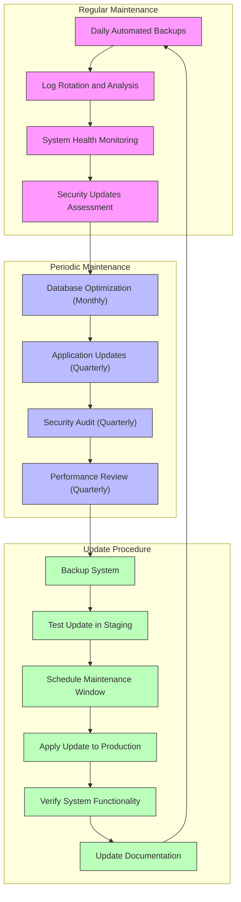

# Self-Hosted OpenPetra Deployment Guide

## Introduction to Self-Hosted OpenPetra Deployment

OpenPetra's self-hosted deployment option provides non-profit organizations with complete control over their administrative and financial management systems. This deployment model offers enhanced data sovereignty, customization flexibility, and potential cost savings over cloud-based alternatives. Self-hosting OpenPetra enables organizations to maintain sensitive financial and donor information within their own infrastructure while still benefiting from OpenPetra's comprehensive feature set including contact management, accounting, sponsorship tracking, and international clearing house capabilities. The key components in a self-hosted deployment include a web server (typically Nginx), the OpenPetra application server, a database backend, and client-side components that together form a cohesive system tailored to the organization's specific requirements and security policies.

## System Requirements and Prerequisites

A successful self-hosted OpenPetra deployment requires careful consideration of both hardware and software requirements. From a hardware perspective, organizations should provision a server with at least 4GB RAM, 2 CPU cores, and 20GB of storage space for the application and initial database (with additional storage planned for database growth). The system is designed to run on Linux distributions, with Ubuntu 20.04 LTS or newer being the recommended platform for optimal compatibility and support. Required software components include Nginx (version 1.18+) as the web server, Mono runtime environment (version 6.8+) for the application server, MySQL/MariaDB (version 10.5+) for the database backend, and PHP (version 7.4+) with FastCGI for phpMyAdmin integration. Additionally, organizations should ensure their server has a static IP address, properly configured DNS records if public access is required, and appropriate firewall rules to secure the deployment while allowing necessary access. Network bandwidth requirements will vary based on the number of concurrent users, but a minimum of 10 Mbps symmetric connection is recommended for small to medium deployments.

## OpenPetra Self-Hosted Architecture Overview

The architecture diagram illustrates the key components of a self-hosted OpenPetra deployment. At the core of this architecture is the Nginx web server, which serves as the entry point for all client requests. Nginx handles static content delivery directly to clients while proxying API requests to the OpenPetra application server running on port 6700 via FastCGI. The application server processes business logic and interacts with the MySQL/MariaDB database for data persistence. For database administration, the architecture incorporates phpMyAdmin, which is accessed through Nginx and processed by PHP-FPM running on port 8080. This modular design allows for separation of concerns, with each component optimized for its specific role in the system, while maintaining secure and efficient communication pathways between the various layers.

## Web Server Configuration with Nginx

The Nginx configuration for OpenPetra plays a critical role in the self-hosted deployment architecture. The configuration establishes a server block that listens on a specified port (represented by the OPENPETRA_PORT placeholder) and serves content from the OpenPetra client directory. A key aspect of this configuration is the URL rewriting mechanism that supports OpenPetra's single-page application architecture. The rewrite rules redirect various application paths (like /Selfservice, /Partner, /Finance) back to the root, allowing the client-side router to handle these routes internally. This approach ensures proper deep-linking functionality while maintaining a clean URL structure.

For API requests, Nginx proxies them to the internal OpenPetra application server running on port 6700 using FastCGI. The configuration includes a sophisticated text substitution mechanism using `sub_filter` directives that dynamically replace server URLs in API responses, ensuring that references remain consistent regardless of the deployment environment. This is particularly important when the application is accessed through different domains or ports.

The configuration also integrates phpMyAdmin for database administration, with a nested location block that routes phpMyAdmin requests to a PHP FastCGI processor on port 8080. Security considerations are evident in the configuration, with redirects that prevent access to sensitive directories like .git and /etc. Additionally, the server imposes a 30MB maximum upload size limit, balancing functionality with resource protection. This carefully crafted Nginx configuration ensures that all components of the OpenPetra system work together seamlessly while maintaining appropriate security boundaries.

## Request Flow in Self-Hosted OpenPetra

This sequence diagram illustrates the complete request flow in a self-hosted OpenPetra deployment, showing how different types of requests are processed through the system. The diagram highlights two primary flows: the standard application request flow and the database administration flow.

In the standard application flow, when a client requests an application route like `/Partner/Search`, Nginx applies the configured URL rewrite rules to serve the main index.html file, allowing the single-page application to initialize. The client then requests necessary static assets (JavaScript, CSS) directly from Nginx. When the application makes API requests (e.g., `/api/partner/search`), Nginx forwards these to the OpenPetra application server via FastCGI on port 6700. The application server processes the request, interacts with the database as needed, and returns a JSON response. Before sending this response back to the client, Nginx applies URL transformations using the `sub_filter` directive to ensure all URLs in the response are correctly formatted for the client environment.

The database administration flow shows how phpMyAdmin requests are handled differently. When a user accesses the phpMyAdmin interface, Nginx routes these requests to the PHP-FPM processor on port 8080, which serves the phpMyAdmin application. This application then connects directly to the MySQL/MariaDB database, allowing administrators to manage the database through a web interface.

This comprehensive request flow demonstrates how the various components of the self-hosted OpenPetra system interact to provide both application functionality and administrative capabilities while maintaining proper separation of concerns and security boundaries.

## Database Setup and Management

Setting up the database backend for OpenPetra requires careful planning and configuration to ensure optimal performance, security, and data integrity. The system primarily uses MySQL or MariaDB as its database engine, with version 10.5 or newer recommended for full compatibility with all OpenPetra features. During initial setup, administrators must create a dedicated database user with appropriate permissions for the OpenPetra application, typically with SELECT, INSERT, UPDATE, DELETE, CREATE, ALTER, and INDEX privileges, but not administrative privileges like GRANT or DROP DATABASE to maintain security boundaries.

The OpenPetra installation process includes database initialization scripts that create the necessary schema and populate initial reference data. These scripts establish the complex relational structure required for OpenPetra's comprehensive accounting, contact management, and sponsorship tracking features. After installation, database configuration parameters are stored in the OpenPetra server configuration file, including connection strings, pooling settings, and timeout values that can be tuned based on the specific deployment environment.

For ongoing database administration, the self-hosted deployment includes phpMyAdmin integration, which is configured through the Nginx server. This web-based tool provides a graphical interface for database management tasks such as viewing table structures, executing queries, managing indexes, and performing backups. The phpMyAdmin configuration in the Nginx setup routes requests to a PHP-FPM processor on port 8080, ensuring that database administration is properly isolated from the main application flow. Administrators should implement additional security measures for phpMyAdmin access, such as IP restrictions or strong authentication requirements, to prevent unauthorized database access. Regular database maintenance tasks, including optimization, index rebuilding, and consistency checks, should be scheduled to maintain optimal performance as the database grows with organizational data.

## Security Considerations for Self-Hosted Deployments

Securing a self-hosted OpenPetra installation requires a multi-layered approach that addresses various potential attack vectors. At the network level, organizations should implement a properly configured firewall that restricts access to only the necessary ports (typically just the web server port for external access) while blocking all other incoming connections. For production environments, implementing HTTPS with valid SSL/TLS certificates is essential to encrypt data transmission between clients and the server. This requires modifying the Nginx configuration to include SSL certificate paths and proper cipher configurations.

Authentication security is another critical consideration. The default OpenPetra authentication system should be strengthened by enforcing strong password policies, implementing account lockout mechanisms after failed login attempts, and potentially integrating with organizational single sign-on (SSO) systems for centralized identity management. Administrative access to both the application and database should be strictly controlled, with separate accounts for different administrative functions to maintain the principle of least privilege.

Data protection strategies should include regular encrypted backups stored in secure, off-site locations. Database connection strings and other sensitive configuration information should be properly secured, avoiding hardcoded credentials in configuration files when possible. File system permissions must be carefully set to ensure that application files cannot be modified by unauthorized users and that data directories are properly protected.

For organizations with heightened security requirements, additional measures such as network segmentation (placing the database server on a separate network from the web-facing components), intrusion detection systems, and regular security audits should be implemented. Log monitoring and alerting systems should be configured to detect and respond to suspicious activities, such as repeated authentication failures or unusual data access patterns. Finally, organizations must establish a process for regularly applying security patches to all components of the stack, including the operating system, web server, database, and the OpenPetra application itself, to address newly discovered vulnerabilities.

## OpenPetra Installation Process

The OpenPetra installation process for self-hosted deployments follows a systematic approach that ensures all components are properly configured and integrated. The process begins with preparing the server environment, which includes updating the operating system and ensuring all necessary system packages are available. Next, the core dependencies are installed: Nginx web server, MySQL/MariaDB database, Mono runtime environment, and PHP with FastCGI for phpMyAdmin support.

After downloading and extracting the OpenPetra package to the target directory, the database setup phase begins. This involves creating a dedicated database and user with appropriate permissions, followed by initializing the database schema using the provided scripts. The Nginx configuration is then set up using the template provided in the package, with particular attention to the server name, listening port, and FastCGI proxy settings.

A critical phase in the installation process is updating the configuration files, which includes replacing placeholders in the nginx.conf file (such as OPENPETRA_PORT, OPENPETRA_SERVERNAME, and OPENPETRA_HOME), setting the database connection string with proper credentials, configuring system-specific parameters, and establishing email server settings for notifications. Proper file permissions must be set to ensure security while allowing the necessary access for the web server and application processes.

Once all configurations are in place, the services are started in the correct order: first the database, then the OpenPetra application server, and finally the Nginx web server. An initial administrative user is created during this process, which will be used for subsequent system configuration. The installation concludes with a verification step that confirms all components are functioning correctly by accessing the application through a web browser and performing basic operations. This structured installation process ensures a reliable and secure self-hosted OpenPetra deployment that can be customized to the organization's specific requirements.

## Backup and Recovery Strategies

Implementing robust backup and recovery procedures is essential for ensuring data integrity and business continuity in self-hosted OpenPetra deployments. A comprehensive backup strategy should address both database and file system components, with different retention policies based on data criticality. For the database, organizations should implement automated daily backups using MySQL's native tools like mysqldump or more advanced solutions like Percona XtraBackup for hot backups that don't require downtime. These backups should capture not only the data but also the database schema to facilitate complete restoration if needed.

File system backups should include the OpenPetra application directory, configuration files, and any custom modifications or extensions. Particularly important are the uploaded documents and reports that may not be stored in the database but represent critical organizational records. Implementing a version control system for configuration files and custom code can provide additional protection and change tracking capabilities.

The backup strategy should follow the 3-2-1 principle: maintain at least three copies of data, store backups on two different types of media, and keep one copy offsite or in the cloud. Encryption of backup files is essential, especially for offsite storage, to protect sensitive organizational and financial data. Automated verification of backup integrity should be implemented to ensure backups are valid and restorable.

For recovery planning, organizations should develop documented procedures for different failure scenarios, ranging from single file restoration to complete system recovery. These procedures should specify the responsible personnel, necessary steps, and estimated recovery times. Regular recovery testing is crucial—organizations should periodically restore backups to a test environment to verify the effectiveness of their backup procedures and to ensure staff familiarity with recovery processes.

Incremental backup approaches can be implemented to reduce storage requirements and backup windows, with periodic full backups complemented by more frequent incremental backups that capture only changes since the last backup. Finally, the backup strategy should be integrated with the organization's broader disaster recovery plan, considering scenarios like hardware failure, data corruption, or facility loss, with clearly defined recovery point objectives (RPO) and recovery time objectives (RTO) aligned with the organization's operational requirements.

## Performance Tuning and Optimization

Optimizing the performance of a self-hosted OpenPetra deployment requires a systematic approach that addresses each component of the architecture. Starting with the Nginx web server, performance can be enhanced by implementing appropriate caching strategies for static content, optimizing worker processes and connection settings based on available server resources, and enabling HTTP/2 support for more efficient client-server communication. The configuration should be tuned to handle the expected concurrent user load while maintaining responsive service.

For the OpenPetra application server, performance optimization involves adjusting the Mono runtime settings, particularly garbage collection parameters and thread pool configurations to match the workload characteristics. Memory allocation limits should be set to prevent resource exhaustion while allowing sufficient memory for peak operations. Application-specific optimizations include fine-tuning database connection pooling parameters to maintain efficient database connectivity without overwhelming the database server.

Database optimization is particularly critical for overall system performance. This includes proper indexing strategies based on common query patterns, regular table optimization and defragmentation, and configuration of MySQL/MariaDB buffer pools and cache sizes appropriate for the available server memory. For larger deployments, implementing database query caching and considering read replicas for reporting workloads can significantly improve performance.

Resource allocation should be carefully balanced across the system components. In multi-service environments, container technologies or resource control mechanisms like cgroups can help ensure that each component receives appropriate CPU, memory, and I/O resources without one service starving others during peak loads.

Network optimization techniques such as enabling compression for API responses, minimizing request sizes, and implementing connection keep-alive can improve perceived performance, especially for users with limited bandwidth. For geographically distributed organizations, implementing a content delivery network (CDN) for static assets can reduce latency.

Performance monitoring is essential for ongoing optimization. Implementing tools that track key metrics such as response times, resource utilization, and error rates allows administrators to identify bottlenecks and validate the effectiveness of optimization efforts. This monitoring should inform a continuous improvement process where configuration adjustments are made based on actual usage patterns and performance data rather than theoretical assumptions.

## Maintenance Workflow

The maintenance workflow for self-hosted OpenPetra deployments encompasses regular activities, periodic maintenance tasks, and a structured update procedure to ensure system reliability, security, and performance. This comprehensive approach helps organizations maintain a stable OpenPetra environment while minimizing downtime and risk.

Regular maintenance forms the foundation of the workflow, with daily automated backups ensuring data protection and business continuity. Log rotation and analysis help prevent disk space issues while providing valuable insights into system behavior and potential problems. Continuous system health monitoring tracks key metrics like CPU usage, memory consumption, disk space, and service availability, often using tools like Nagios or Prometheus. Security updates assessment involves reviewing vendor announcements for all system components to identify critical patches that need immediate attention.

Periodic maintenance activities occur on a monthly or quarterly schedule. Database optimization includes tasks like rebuilding indexes, analyzing query performance, and reclaiming unused space. Application updates follow OpenPetra's release schedule, typically quarterly, bringing new features and bug fixes. Quarterly security audits examine system configurations, access controls, and potential vulnerabilities, while performance reviews analyze system metrics to identify optimization opportunities.

The update procedure follows a structured approach to minimize risks. Before any update, a complete system backup ensures rollback capability if issues arise. Updates should first be tested in a staging environment that mirrors the production configuration. Organizations should schedule a maintenance window during off-peak hours and communicate it to users. When applying updates to production, administrators should follow a checklist that includes stopping services in the correct order, applying updates, and restarting services. Post-update verification confirms that all system functionality works correctly, and documentation should be updated to reflect any configuration changes or new features.

This systematic maintenance workflow helps organizations maintain a reliable, secure, and efficient OpenPetra deployment while minimizing disruptions to operations and ensuring that the system continues to meet the organization's needs over time.

## Troubleshooting Common Issues

Effective troubleshooting of self-hosted OpenPetra deployments requires a systematic approach to identifying and resolving issues across the various system components. When encountering problems, administrators should first consult the application logs, which are typically located in the OpenPetra log directory and the Nginx error logs (/var/log/nginx/). These logs often contain valuable information about the root cause of issues, including stack traces, error codes, and warning messages that can guide the troubleshooting process.

For connectivity issues, administrators should verify that all services are running correctly using system tools like `systemctl status` for systemd-managed services or process monitoring commands. Network connectivity between components should be confirmed using tools like `netstat` or `ss` to ensure that expected ports (6700 for the application server, 3306 for MySQL, etc.) are open and accepting connections. Firewall configurations should be reviewed to ensure they're not blocking necessary communication between components.

Database-related problems often manifest as slow performance or application errors. Diagnostic approaches include checking for long-running queries using MySQL's performance schema or slow query log, verifying database connection pool settings, and ensuring that database indexes are properly maintained. For persistent database issues, examining the table structures and running integrity checks with `mysqlcheck` can identify and repair corrupted tables.

Authentication failures may occur due to misconfigured user accounts, password issues, or permission problems. Administrators should verify user credentials in both the OpenPetra application and database, check file permissions on configuration files containing connection strings, and ensure that the application server has appropriate access to required resources.

Performance degradation often requires a multi-faceted investigation. Key areas to examine include server resource utilization (CPU, memory, disk I/O), database query performance, network latency, and client-side rendering performance. Tools like `top`, `htop`, `iotop`, and browser developer tools can help identify bottlenecks in different parts of the system.

For update-related issues, comparing configuration files with their default templates can help identify misconfigurations introduced during the update process. If an update causes significant problems, having a documented rollback procedure and recent backups is essential for restoring service quickly.

When standard troubleshooting approaches fail to resolve an issue, administrators should consult the OpenPetra community resources, including the official documentation, forums, and issue trackers. For complex problems, creating a detailed report that includes system specifications, error messages, and steps to reproduce the issue can help community members provide targeted assistance.

[Generated by the Sage AI expert workbench: 2025-03-30 02:22:57  https://sage-tech.ai/workbench]: #