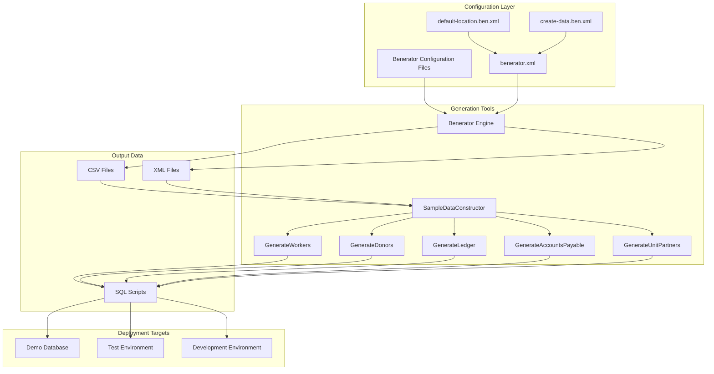
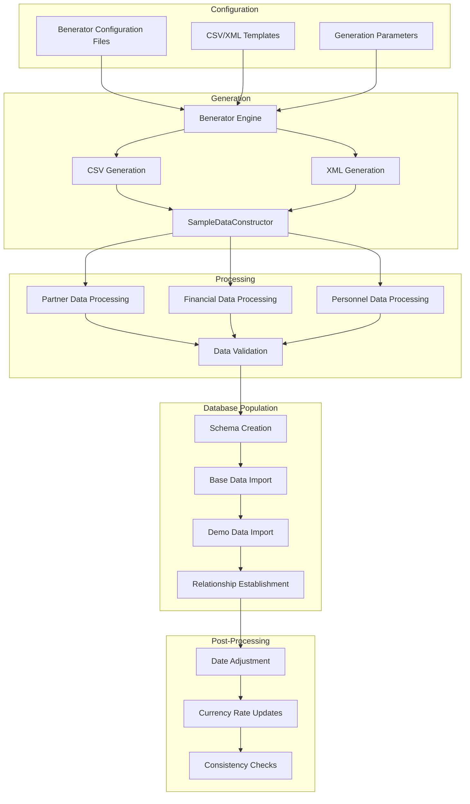
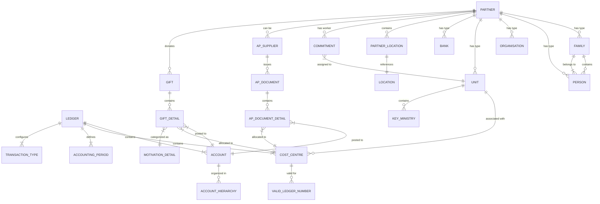
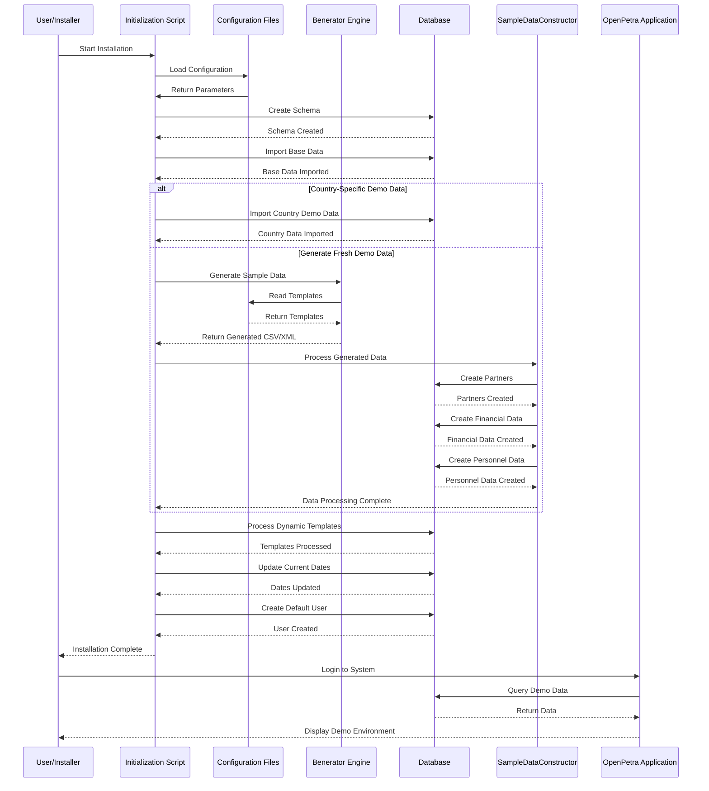

# Testing Data in OpenPetra

## Overview of Testing Data in OpenPetra

OpenPetra's testing data architecture forms a critical component of the system's development, deployment, and demonstration processes. The architecture is designed to provide realistic, configurable, and consistent data that can be used across different environments - from development testing to end-user demonstrations. 

OpenPetra employs a sophisticated approach to test data generation that combines static reference data with dynamically generated content. This ensures that the test data remains relevant regardless of when the system is deployed, while maintaining realistic relationships between different data entities. The system uses a combination of CSV files, XML configurations, and programmatic generation to create comprehensive datasets that exercise all aspects of the application's functionality.

The testing data architecture serves multiple purposes:
1. Supporting automated unit and integration tests
2. Providing realistic demonstration data for potential users
3. Enabling developers to test new features with meaningful data
4. Creating training environments with predictable data scenarios
5. Validating system behavior across different locales and configurations

The architecture is particularly notable for its ability to generate country-specific datasets, allowing OpenPetra to demonstrate its international capabilities and support for different accounting standards, currencies, and organizational structures.

## Benerator Framework for Data Generation

OpenPetra leverages the Benerator framework as its primary engine for generating realistic test data. Benerator is an open-source tool designed specifically for creating high-volume, high-quality test data with configurable parameters and relationships.

The implementation in OpenPetra uses Benerator through a set of XML configuration files that define the structure, relationships, and constraints for generated data. These files are located in the `/inc/cfg/benerator/` directory and include:

- `benerator.xml`: The main configuration file that sets global parameters like encoding, locale, and dataset defaults
- `default-location.ben.xml`: Configures location-specific settings for data generation
- `create-data.ben.xml`: Defines the actual data generation rules for various entity types

The Benerator configuration in OpenPetra is particularly sophisticated in how it handles:

1. **Entity Relationships**: The system creates realistic relationships between partners, organizations, fields, workers, and financial data
2. **Realistic Personal Information**: Using specialized generators like `PersonGenerator` and `AddressGenerator` to create plausible names and addresses based on locale
3. **Financial Data**: Generating transactions, donations, and invoices with appropriate patterns and distributions
4. **Family Structures**: Creating realistic family units with appropriate relationships between spouses and children
5. **Temporal Data**: Using date generators to create time-based data that remains relevant regardless of when the system is deployed

The framework allows OpenPetra to generate test data that reflects real-world scenarios while maintaining referential integrity across the system. This is crucial for testing complex operations like financial reconciliation, reporting, and partner relationship management.

For example, the `create-data.ben.xml` file defines how organizations are generated:

```xml
<generate type="Organisation" count="${organisations_count}" consumer="new CSVEntityExporter(uri='${dir.data.output}/organisations.csv')">
    <variable name="organisation" generator="CompanyNameGenerator" />    
    <attribute name="OrganisationName" script="organisation.fullName" /> 
    <variable name="address" generator="AddressGenerator" />
    <attribute name="Addr2" script="address.street + ' ' + address.houseNumber" />
    <attribute name="PostCode" script="address.postalCode" />
    <attribute name="City" script="address.city.name" />
    <attribute name="Province" script="address.city.state.name" />
    <attribute name="CountryCode" script="address.city.state.country.isoCode" />
</generate>
```

This configuration ensures that generated organizations have realistic names and addresses appropriate to the selected locale and dataset.

## Testing Data Architecture



The diagram above illustrates OpenPetra's testing data architecture, showing the flow from configuration files through generation tools to the final deployment targets. The architecture is designed to be flexible and extensible, allowing for different types of data to be generated for different purposes.

The configuration layer defines the parameters and rules for data generation, which are then processed by the Benerator engine to produce CSV and XML output files. These files are further processed by the SampleDataConstructor tools, which create SQL scripts that can be executed to populate the database. The resulting data can be deployed to various environments, including demo databases, test environments, and development instances.

This architecture ensures consistency across different deployments while allowing for customization based on specific requirements. The use of template variables like `${datetime::get-year(datetime::now())}` ensures that date-based data remains relevant regardless of when the system is deployed, making the test data suitable for long-term use in demonstration and training environments.

## Demo Data Organization by Country

OpenPetra organizes its demo data by country or region, allowing for localized demonstrations that reflect the specific requirements and practices of different geographical areas. This approach is particularly important for a system designed to support international non-profit organizations with operations across multiple countries.

The German implementation serves as a prime example of this country-specific organization. Located in the `/db/demodataGermany/` directory, this dataset includes:

1. **Partner Data**: 
   - `p_partner.csv`: Defines basic partner entities with German-specific IDs (43005001-43005004)
   - `p_family.csv`: Contains family records with appropriate German naming conventions
   - `p_organisation.csv`: Includes German organizations with EUR and GBP currency configurations

2. **Financial Data**:
   - `a_ledger.csv`: Configures ledger 43 specifically for Germany with EUR as the base currency
   - `a_account_hierarchy.csv`: Defines the German chart of accounts structure
   - `a_corporate_exchange_rate.csv`: Contains EUR to USD exchange rates
   - `a_fees_payable.csv` and `a_fees_receivable.csv`: Define German-specific fee structures

3. **Location Data**:
   - `p_location.csv`: Contains address formats following German conventions
   - `p_partner_location.csv`: Links partners to their locations

4. **Banking Data**:
   - `p_bank.csv`: Includes German bank information with appropriate account number formats

The German implementation illustrates several key aspects of OpenPetra's country-specific approach:

- **Consistent Identifiers**: All German-specific records use ledger number 43 and partner keys in a specific range (43xxxxxx)
- **Currency Configuration**: Primary use of EUR with support for foreign currencies like GBP
- **Localized Structures**: Accounting structures that follow German financial practices
- **Language Support**: Data prepared for German language interfaces

This organization allows OpenPetra to demonstrate its capabilities in a way that resonates with users in specific regions while maintaining the system's core functionality across all implementations. Other country-specific datasets can be created following the same pattern, enabling truly localized demonstrations.

## Financial Testing Data Structure

OpenPetra's financial testing data is structured to provide a comprehensive representation of a non-profit organization's financial operations. The data encompasses ledgers, accounts, exchange rates, transactions, and various financial documents, all designed to validate the system's accounting capabilities.

The financial data structure is built around several key components:

1. **Ledger Configuration**: 
   - Defined in `a_ledger.csv` with settings for fiscal year, reporting periods, and base currency
   - Each ledger has a unique identifier (e.g., 43 for Germany) and country-specific settings

2. **Chart of Accounts**:
   - Hierarchical structure defined in `a_account_hierarchy_detail.csv`
   - Accounts organized into categories like GIFT, CASH, ASSETS, LIABILITIES, INCOME, and EXPENSES
   - Parent-child relationships established for reporting purposes

3. **Cost Centers**:
   - Defined in `a_cost_centre_types.csv` and related files
   - Categorized as Local or Foreign with appropriate accounting parameters
   - Linked to specific accounts for clearing and retained earnings

4. **Exchange Rates**:
   - Stored in `a_corporate_exchange_rate.csv`
   - Includes historical rates with dynamic date expressions to ensure relevance
   - Supports multiple currency pairs (e.g., EUR to USD)

5. **Transaction Types**:
   - Defined in `a_transaction_type.csv`
   - Includes standard types like AP invoices, GL allocations, and gift processing
   - Each type has associated debit and credit account codes

6. **Sample Transactions**:
   - Stored in files like `gltransactions.csv`
   - Balanced entries with corresponding debits and credits
   - Realistic descriptions, references, and amounts

7. **Accounting Periods**:
   - Defined in `a_accounting_period.csv`
   - Monthly periods with dynamic dates based on current year
   - Special handling for February to account for leap years

The financial testing data is particularly sophisticated in how it handles temporal aspects. By using template variables like `${datetime::get-year(datetime::now())}`, the system ensures that accounting periods and exchange rates remain relevant regardless of when the database is deployed. This approach allows for realistic testing of period-end processes, year-end closings, and financial reporting across multiple periods.

## Sample Data Generation Process



The diagram above illustrates the process of generating sample data for OpenPetra, from initial configuration to final deployment. This process ensures that the generated data is realistic, consistent, and suitable for testing and demonstration purposes.

The sample data generation process begins with configuration files that define the parameters and templates for data generation. These configurations are processed by the Benerator engine, which generates CSV and XML files containing raw data. The SampleDataConstructor tools then process this data, creating partner records, financial transactions, and personnel data.

A critical aspect of this process is the validation step, which ensures that the generated data maintains referential integrity and business rule compliance. After validation, the data is imported into the database through a series of steps: schema creation, base data import, demo data import, and relationship establishment.

Post-processing steps include date adjustment (to ensure temporal relevance), currency rate updates, and consistency checks. These steps ensure that the final dataset is coherent and realistic, providing a solid foundation for testing and demonstration.

The process is designed to be repeatable and configurable, allowing for different datasets to be generated for different purposes. By adjusting the configuration parameters, it's possible to create datasets of varying sizes and complexities, from simple demonstration data to comprehensive test scenarios that exercise all aspects of the system.

## Partner and Personnel Test Data

OpenPetra generates sophisticated partner and personnel test data that realistically represents the complex relationships found in non-profit organizations. This data encompasses families, individuals, organizations, workers, and their interconnections, providing a comprehensive foundation for testing partner management functionality.

The partner data generation is handled primarily by classes like `SampleDataDonors`, `SampleDataWorkers`, and `SampleDataUnitPartners`, which create different types of partner records:

1. **Family Partners**:
   - Single men, single women, and complete families with children
   - Appropriate naming conventions and address formats
   - Family relationships with proper addressee types
   - Consent records for communications (GDPR compliance)

2. **Person Partners**:
   - Individual records linked to families
   - Gender-appropriate names and details
   - Age-appropriate data for adults and children
   - Personal contact information

3. **Organization Partners**:
   - Companies with realistic names and addresses
   - Currency designations (e.g., EUR, GBP)
   - Supplier relationships for accounts payable
   - Banking details for financial transactions

4. **Unit Partners**:
   - Field units representing country operations
   - Key ministries within fields
   - Hierarchical relationships between units
   - Associated cost centers for financial tracking

The personnel data is particularly detailed, with worker records that include:

1. **Commitment Data**:
   - Start and end dates for assignments
   - Field placements with appropriate unit relationships
   - Commitment types (Short Term, Long Term, Global Action)
   - Status tracking and history

2. **Job Information**:
   - Position types (e.g., accountant, manager, webmaster)
   - Employment terms and conditions
   - Notice periods and contract details
   - Skill requirements and qualifications

3. **Family Relationships**:
   - Spouse connections for married workers
   - Children with appropriate age distributions
   - Family status indicators

The generation process ensures that all these entities are properly interconnected. For example, a worker is linked to a family partner, which may include a spouse and children, and is assigned to a field unit with associated financial accounts. This comprehensive approach allows for realistic testing of complex scenarios like worker transfers, family updates, and financial allocations across organizational units.

## Dynamic Data Generation with Templates

OpenPetra employs a sophisticated approach to dynamic data generation using templates and expressions, ensuring that test data remains relevant regardless of when the system is deployed. This approach is particularly important for date-based data, which would otherwise become outdated as time passes.

The system uses several techniques for dynamic data generation:

1. **DateTime Expressions**: 
   Templates like `${datetime::get-year(datetime::now())}` are used to generate dates relative to the current date. For example, in `a_accounting_period.csv`, accounting periods are defined as:
   ```
   43,1,January,${datetime::get-year(datetime::now())}-1-1,${datetime::get-year(datetime::now())}-1-31,2010-6-15,?,?,?,?
   ```
   This ensures that when the database is deployed, the accounting periods will be set for the current year.

2. **Leap Year Handling**:
   Special functions like `${datetime::get-days-in-month(datetime::get-year(datetime::now()), 2)}` are used to correctly handle February's variable length in leap years:
   ```
   43,2,February,${datetime::get-year(datetime::now())}-2-1,${datetime::get-year(datetime::now())}-2-${datetime::get-days-in-month(datetime::get-year(datetime::now()), 2)},2010-6-15,?,?,?,?
   ```

3. **Relative Date Offsets**:
   Expressions can include arithmetic operations to generate dates in the future or past:
   ```
   43,13,January,${datetime::get-year(datetime::now()) + 1}-1-1,${datetime::get-year(datetime::now()) + 1}-1-31,2010-6-15,?,?,?,?
   ```
   This creates an accounting period for January of next year.

4. **Date Ranges for Testing**:
   Date generators with configurable ranges are used for creating realistic date distributions:
   ```xml
   <bean id="myStartCommitmentGen" class="DayGenerator">
       <property name='min' value='${datetime::get-year(datetime::now()) - 3}-01-01'/>
       <property name='max' value='${datetime::get-year(datetime::now())}-12-31'/>
       <property name='granularity' value='00-00-02'/>
       <property name='distribution' value='random'/>
   </bean>
   ```
   This creates commitment start dates within the last three years.

5. **Placeholder Substitution**:
   The system uses placeholders like `{ledgernumber}` that are replaced at runtime with actual values:
   ```
   "T";"{ledgernumber}00";"8200";"Irgendwas";"abc";31/07/2010;2269,98;0;"";"";"";"";"";"";"";"";"";""
   ```
   This allows for flexible configuration across different ledgers.

These dynamic templates are processed during database initialization, ensuring that the resulting data is temporally consistent and realistic. This approach is particularly valuable for financial data, where date relationships are critical for proper reporting and analysis.

## Test Data Relationships



The diagram above illustrates the complex relationships between different types of test data in OpenPetra. These relationships ensure that the test data accurately represents the interconnected nature of a non-profit organization's operations.

At the center of the data model is the PARTNER entity, which can be of various types: FAMILY, PERSON, ORGANISATION, UNIT, or BANK. Each partner has locations (PARTNER_LOCATION) that reference physical addresses (LOCATION). Family partners can contain multiple person partners, establishing family relationships.

The personnel aspect is represented by COMMITMENT records that link partners (as workers) to units (as assignment locations). This allows for testing scenarios involving worker placements, transfers, and status changes.

The financial side is structured around LEDGER entities, which contain ACCOUNTS, COST_CENTRES, ACCOUNTING_PERIODS, and TRANSACTION_TYPES. Accounts are organized in hierarchies, and cost centers are associated with valid ledger numbers.

Partners can also be suppliers (AP_SUPPLIER) who issue documents (AP_DOCUMENT) with line items (AP_DOCUMENT_DETAIL) that are posted to specific accounts and cost centers. Similarly, partners can make donations (GIFT) with details (GIFT_DETAIL) that are categorized by motivation and allocated to accounts and cost centers.

Units are associated with cost centers for financial tracking and can contain key ministries for organizational structure. This comprehensive relationship model enables testing of complex scenarios that span multiple aspects of the system, from partner management to financial reporting.

## CSV and XML Data Formats

OpenPetra employs both CSV and XML formats for test data, each serving specific purposes in the system's testing and deployment processes. The choice of format depends on the data's complexity, relationships, and intended use.

### CSV Format

CSV (Comma-Separated Values) is the predominant format for OpenPetra's test data, used for:

1. **Database Table Population**: 
   - Direct correspondence between CSV files and database tables (e.g., `p_partner.csv` populates the `p_partner` table)
   - Simple structure with one row per record and columns matching database fields
   - Example: `p_partner.csv` with columns for partner key, class, category, short name, etc.

2. **Financial Transactions**:
   - Batch-oriented structure with header and detail records
   - Uses record type indicators (B for batch, J for journal, T for transaction)
   - Example: `gltransactions.csv` with semicolon-delimited fields for transaction details

3. **Exchange Rates and Accounting Periods**:
   - Temporal data with dynamic date expressions
   - Example: `a_corporate_exchange_rate.csv` with template variables for date generation

The CSV format in OpenPetra has several notable characteristics:

- **Delimiter Variations**: While most files use commas, some financial files use semicolons to accommodate European number formats with comma decimal separators
- **Placeholder Values**: Question marks (?) represent null or undefined values
- **Template Variables**: Expressions like `${datetime::get-year(datetime::now())}` for dynamic date generation
- **Field Quoting**: Double quotes around fields that may contain delimiters

### XML Format

XML is used for more complex data structures and configuration:

1. **Benerator Configuration**:
   - Defines data generation rules and relationships
   - Example: `create-data.ben.xml` with entity definitions and generation parameters

2. **Test Parameters**:
   - Configures test scenarios and expected results
   - Example: `PartnerBySpecialTypes.Test.xml` with report parameters and column definitions

3. **Banking Data**:
   - Complex hierarchical structures like CAMT.053 bank statements
   - Example: `camt_testfile.53.xml` with account information and transaction entries

The processing of these formats involves several steps:

1. CSV files are often converted to XML using the `TCsv2Xml.ParseCSVFile2Xml` method for easier processing
2. Template variables in CSV files are replaced with actual values during database initialization
3. XML configuration files drive the Benerator engine to generate additional CSV output
4. Both formats are ultimately used to populate database tables through SQL commands

This dual-format approach provides flexibility in how test data is defined, generated, and processed, allowing OpenPetra to handle both simple tabular data and complex hierarchical structures effectively.

## Testing Data for Automated Tests

OpenPetra's testing data architecture includes specialized datasets designed specifically for automated testing of the system's functionality. These datasets are structured to exercise specific features, validate business rules, and ensure consistent behavior across different modules.

The automated testing data is organized in several key directories:

1. **Module-Specific Test Data**:
   - `/csharp/ICT/Testing/lib/MFinance/`: Financial module test data
   - `/csharp/ICT/Testing/lib/MPartner/`: Partner module test data
   - `/csharp/ICT/Testing/lib/Reporting/`: Reporting functionality test data

2. **Data Types**:
   - **Sample Files**: CSV and XML files with known content for testing import/export functionality
   - **Expected Results**: Files containing the expected output of operations for validation
   - **Test Parameters**: Configuration files that define test scenarios and inputs

3. **Test Helper Classes**:
   - `CreateTestPartnerData.cs`: Programmatically generates partner data for tests
   - Similar helper classes for other modules

The automated test data is characterized by several important features:

1. **Deterministic Content**: 
   - Predictable values that produce consistent results
   - Known edge cases to test boundary conditions
   - Example: `samplePartnerImport_invalid.csv` with deliberately invalid data to test validation

2. **Minimal Datasets**:
   - Contains only the data necessary for specific tests
   - Focused on particular functionality rather than comprehensive coverage
   - Example: `test.csv` with just four records for testing parent-child relationships

3. **Validation Structures**:
   - Expected results files that match the format of actual outputs
   - Parameter files that configure test execution
   - Example: `PartnerByCity.Results.Expected.csv` for validating report output

4. **Cross-Module Testing**:
   - Data that exercises interactions between different modules
   - Example: Bank import files that test both banking and gift processing functionality

The automated test data is particularly valuable for regression testing, ensuring that changes to the system don't break existing functionality. By using consistent, well-defined test datasets, OpenPetra can maintain high quality standards across its development lifecycle.

## Demo Database Initialization Flow



The sequence diagram above illustrates the initialization process for a demo database in OpenPetra. This process ensures that a new installation has appropriate data for demonstration and testing purposes.

The initialization begins when a user or installer starts the installation process. The initialization script loads configuration parameters from configuration files, which determine how the demo database will be set up.

The script first creates the database schema, establishing the structure for all tables and relationships. It then imports base data, which includes essential reference information like countries, currencies, and system parameters.

At this point, the process can follow two paths:
1. **Country-Specific Demo Data**: If a predefined country dataset is selected (like the German demo data), it's imported directly from CSV files.
2. **Generate Fresh Demo Data**: Alternatively, the Benerator engine can generate new sample data based on templates and configuration parameters.

If generating fresh data, the SampleDataConstructor processes the generated CSV/XML files to create partners, financial data, and personnel data in the database. This involves creating complex relationships between different entities to ensure a realistic dataset.

After the core data is in place, the initialization process:
1. Processes dynamic templates, replacing placeholders with actual values
2. Updates dates to ensure temporal relevance
3. Creates a default user for system access

Once the initialization is complete, the user can log in to the OpenPetra application, which queries the demo database to display a fully populated demonstration environment. This environment provides a realistic representation of how the system would be used in a production setting, with appropriate data for all major functionality areas.

The demo database initialization process is designed to be repeatable and configurable, allowing for different types of demonstration environments to be created based on specific requirements or regional settings.

[Generated by the Sage AI expert workbench: 2025-03-30 02:22:57  https://sage-tech.ai/workbench]: #