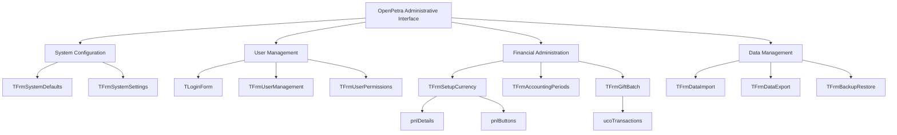
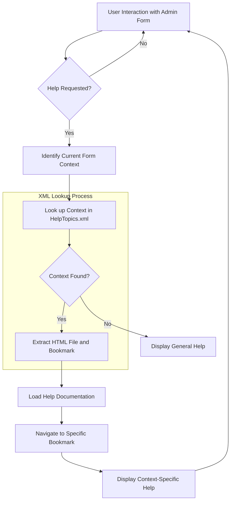
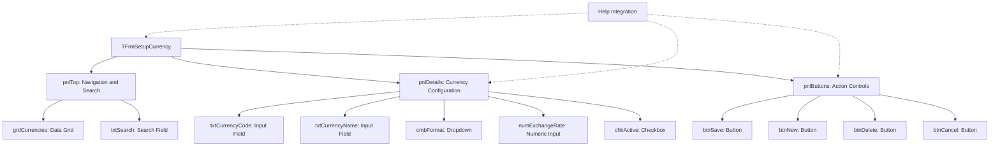

# Administrative Forms in OpenPetra

## Overview of Administrative Forms in OpenPetra

OpenPetra's administrative interface is built on a comprehensive form-based architecture that provides system administrators with the tools necessary for configuration, user management, and organizational settings. These forms serve as the primary interface for managing the system's operational parameters, ensuring that the non-profit organization's specific needs are met. The administrative forms in OpenPetra are designed with a focus on usability while providing access to complex configuration options that drive the system's behavior across modules like contact management, accounting, sponsorship, and publications. These forms abstract the underlying data structures and business logic, presenting administrators with intuitive interfaces that reduce the technical knowledge required to configure and maintain the system. The administrative interface is a critical component that enables organizations to adapt OpenPetra to their specific workflows without requiring custom development.

## Form Context Architecture

OpenPetra implements a sophisticated form context architecture to organize its administrative functions into logical units. Each form in the system is identified by a unique context identifier, typically matching the form's class name (e.g., "TLoginForm", "TFrmSetupCurrency"). This context-based approach allows the system to maintain state, permissions, and help documentation mappings specific to each administrative function. 

The form context architecture follows a hierarchical pattern where contexts can be defined at both the form level and the component level. For example, "TFrmSetupCurrency" represents the entire currency setup form, while "TFrmSetupCurrency.pnlDetails" refers specifically to the details panel within that form. This granular context definition enables precise control over behavior and documentation.

Form contexts serve multiple purposes in the system:
1. They act as unique identifiers for permission management
2. They provide navigation targets for the application's menu system
3. They establish the connection between UI elements and their corresponding help documentation
4. They facilitate state persistence between sessions

This architecture allows OpenPetra to maintain a clean separation between UI components while providing a unified administrative experience.

## Administrative Forms Hierarchy



The diagram above illustrates the hierarchical organization of administrative forms in OpenPetra. The system divides administrative functionality into logical categories including System Configuration, User Management, Financial Administration, and Data Management. Each category contains specific forms that handle different aspects of administration.

The hierarchy extends to the component level within forms, as shown with TFrmSetupCurrency containing pnlDetails and pnlButtons components, and TFrmGiftBatch containing the ucoTransactions component. This hierarchical structure allows administrators to navigate efficiently through the system while maintaining a clear understanding of how different administrative functions relate to each other. The structure also reflects the underlying data models and business processes that OpenPetra manages for non-profit organizations.

## Help Documentation Integration

OpenPetra implements a sophisticated help documentation integration system that connects administrative forms directly to relevant help content. The integration is managed through a mapping system defined in HelpTopics.xml, which creates explicit relationships between form contexts and HTML documentation pages with specific bookmark locations. This approach ensures that users can access precisely the information they need when working with administrative forms.

The mapping system works by associating each form context (e.g., "TLoginForm" or "TFrmSetupCurrency") with a specific HTML file and bookmark combination. When a user requests help while using an administrative form, the system looks up the current context in the HelpTopics.xml file and navigates to the appropriate documentation section. This context-aware help system significantly reduces the time administrators spend searching for relevant information.

The integration is particularly valuable for complex administrative tasks like currency setup or batch processing, where users may need detailed guidance on configuration options and their implications. By providing immediate access to contextually relevant documentation, OpenPetra enhances administrator productivity and reduces configuration errors that could impact organizational operations.

## Help Documentation Mapping Flow



This flowchart illustrates how OpenPetra connects user interactions in administrative forms to context-specific help documentation. When a user requests help while working with an administrative form, the system first identifies the current form context (such as "TLoginForm" or "TFrmSetupCurrency.pnlDetails"). It then searches the HelpTopics.xml file for a matching context entry.

If a matching context is found, the system extracts the HTML file path and bookmark reference from the corresponding XML element. The help documentation is then loaded, and the view is automatically scrolled to the specific bookmark location that contains relevant information for the current administrative task. If no matching context is found, the system falls back to displaying general help documentation.

This approach ensures that administrators receive precisely targeted assistance based on their current location within the administrative interface, significantly improving the efficiency of system configuration and management tasks. The XML-based mapping system also allows for easy updates to help documentation without requiring changes to the application code.

## Form Component Granularity

OpenPetra's help documentation system demonstrates a sophisticated approach to granularity by providing context-specific help at multiple levels of the UI hierarchy. This multi-level granularity is evident in the HelpTopics.xml file, which maps both entire forms and individual components to specific help documentation sections.

At the form level, contexts like "TLoginForm" and "TFrmSetupCurrency" map to general documentation about the purpose and usage of these administrative interfaces. This provides users with a comprehensive overview of the form's functionality and typical workflows. For more complex forms, this level of documentation helps administrators understand the form's role within the broader system.

At the component level, contexts like "TFrmSetupCurrency.pnlDetails", "TFrmSetupCurrency.pnlButtons", and "TFrmGiftBatch.ucoTransactions" map to more specific documentation that addresses the particular functions and options available within these UI components. This fine-grained approach ensures that users can access precisely the information they need when working with specific parts of a complex administrative form.

This multi-level granularity reflects a deep understanding of user needs during administrative tasks. By recognizing that users may need different levels of documentation depending on their current focus, OpenPetra provides a more efficient help system that reduces cognitive load and improves administrator productivity. The component-level granularity is particularly valuable for complex forms with multiple functional areas, where different components may have distinct configuration options and implications.

## XML-Based Configuration for Administrative UI

OpenPetra leverages XML-based configuration to drive its administrative interface, with HelpTopics.xml serving as a prime example of this approach. This configuration file establishes the critical connections between the UI components and their corresponding help documentation, demonstrating the system's commitment to separation of concerns and maintainable architecture.

The structure of HelpTopics.xml is deliberately straightforward, consisting of a root `pageGuide` element containing multiple `page` elements. Each `page` element defines a mapping through two key components:
1. A `context` attribute that identifies a specific form or component in the administrative interface
2. A nested `link` element containing the path to an HTML file and a specific bookmark within that file

This XML-based approach offers several advantages for the administrative interface:
- It decouples the help documentation from the application code, allowing documentation updates without recompilation
- It provides a centralized, easily maintainable registry of all help documentation mappings
- It supports the hierarchical nature of the administrative UI through context naming conventions
- It enables rapid modification of help documentation links when documentation is restructured

The simplicity of the XML structure belies its importance in the overall system architecture. By externalizing these mappings, OpenPetra achieves greater flexibility in its administrative interface while maintaining a clean separation between code and configuration. This approach is consistent with modern architectural principles that favor configuration over code for aspects of the system that may need to change independently.

## XML to UI Component Relationship

```mermaid
graph LR
    subgraph HelpTopics.xml
        A[pageGuide] --> B[page context="TFrmSetupCurrency"]
        A --> C[page context="TFrmSetupCurrency.pnlDetails"]
        A --> D[page context="TFrmGiftBatch.ucoTransactions"]
        B --> B1[link: scroll-bookmark-31.html#scroll-bookmark-32]
        C --> C1[link: scroll-bookmark-31.html#scroll-bookmark-35]
        D --> D1[link: scroll-bookmark-20.html#scroll-bookmark-28]
    end
    
    subgraph UI Components
        E[TFrmSetupCurrency Form]
        F[pnlDetails Panel]
        G[ucoTransactions Control]
        E --> F
        H[TFrmGiftBatch Form] --> G
    end
    
    B -.-> E
    C -.-> F
    D -.-> G
```

The diagram above illustrates the relationship between XML configuration elements in HelpTopics.xml and their corresponding UI components in OpenPetra's administrative forms. The left side represents the XML structure, showing how the `pageGuide` element contains multiple `page` elements, each with a context attribute identifying a specific UI component and a link to the appropriate help documentation.

The right side shows the actual UI components in the application, organized hierarchically as they would appear in the administrative interface. The dotted lines connecting the XML elements to the UI components represent the mapping relationships defined in HelpTopics.xml.

This mapping system creates a flexible and maintainable connection between the administrative interface and its documentation. When a user requests help while interacting with a specific component, the system uses the component's context identifier to look up the corresponding help documentation link in HelpTopics.xml. This approach allows the help system to provide precisely targeted information based on the user's current location in the administrative interface.

The XML-to-UI relationship demonstrates OpenPetra's commitment to separation of concerns and configurable architecture. By externalizing these mappings in an XML file, the system can adapt to changes in either the UI or the documentation without requiring code modifications, making the administrative interface more maintainable over time.

## Currency Setup Administration

The TFrmSetupCurrency form represents a sophisticated example of OpenPetra's administrative functionality for financial configuration. This form enables administrators to define and manage the currencies used throughout the financial operations of the non-profit organization. The form's design reflects the complex requirements of international organizations that must handle multiple currencies while maintaining accurate financial records.

The form is structured around two main functional areas, represented by the panels referenced in HelpTopics.xml:
1. `pnlDetails` - Contains fields for configuring currency properties such as:
   - Currency code and name
   - Symbol and formatting options
   - Exchange rate information
   - Rounding rules and precision settings
   
2. `pnlButtons` - Provides action controls for:
   - Saving currency configurations
   - Creating new currencies
   - Deleting unused currencies
   - Refreshing exchange rate data

The TFrmSetupCurrency form demonstrates OpenPetra's approach to administrative interfaces that balance usability with comprehensive functionality. The form encapsulates complex financial concepts like currency exchange and rounding rules behind an intuitive interface, making it accessible to administrators without requiring specialized financial knowledge.

The help documentation mapping for this form is particularly detailed, with separate entries for the main form and its component panels. This granular approach to documentation reflects the complexity of currency setup and the importance of providing context-specific guidance for administrators configuring this critical aspect of the financial system.

## Batch Processing Administration

The TFrmGiftBatch form exemplifies OpenPetra's approach to transaction processing and batch management administration. This form is central to the system's financial operations, providing administrators with tools to manage donations and other financial transactions in a batch-oriented workflow that ensures accuracy and auditability.

The form's design reflects the complex requirements of non-profit financial management, including:
1. Batch creation and configuration
2. Transaction entry and validation
3. Batch balancing and verification
4. Posting processes to update the general ledger

A key component of this form is the `ucoTransactions` control, which is specifically referenced in HelpTopics.xml. This user control manages the grid-based interface for entering and editing individual transactions within a batch. The control includes sophisticated validation logic to ensure data integrity while providing an efficient interface for handling multiple transactions.

The TFrmGiftBatch form demonstrates OpenPetra's commitment to combining administrative efficiency with financial accuracy. The batch processing approach allows administrators to group related transactions, verify their accuracy as a set, and post them to the financial system in a single operation. This reduces the risk of partial updates and ensures that the financial records remain consistent.

The help documentation for this form is structured to address both the overall batch management process and the specific details of transaction entry through the `ucoTransactions` control. This multi-level documentation approach recognizes that administrators may need different types of guidance depending on whether they are setting up batch parameters or working with individual transactions.

## Administrative Form Component Structure



This diagram illustrates the typical component structure of an administrative form in OpenPetra, using TFrmSetupCurrency as an example. The form is organized into logical panels that group related functionality, creating a clear visual hierarchy that guides administrators through the configuration process.

The top panel (pnlTop) provides navigation and search capabilities, allowing administrators to quickly locate existing currency records through the data grid and search field. The details panel (pnlDetails) contains the input fields necessary for configuring a currency, including code, name, format, exchange rate, and status. The buttons panel (pnlButtons) offers action controls for saving, creating, deleting, and canceling changes to currency configurations.

Each component in the form has a specific purpose and is positioned to create a logical workflow for administrators. The help integration, represented by dotted lines, shows how context-sensitive help is available at multiple levels of the component hierarchy, from the entire form down to specific panels.

This structured approach to form design is consistent across OpenPetra's administrative interface, providing administrators with a familiar experience regardless of which aspect of the system they are configuring. The component hierarchy also facilitates the granular help documentation mapping seen in HelpTopics.xml, ensuring that administrators can access precisely the guidance they need for their current task.

[Generated by the Sage AI expert workbench: 2025-03-30 02:22:57  https://sage-tech.ai/workbench]: #