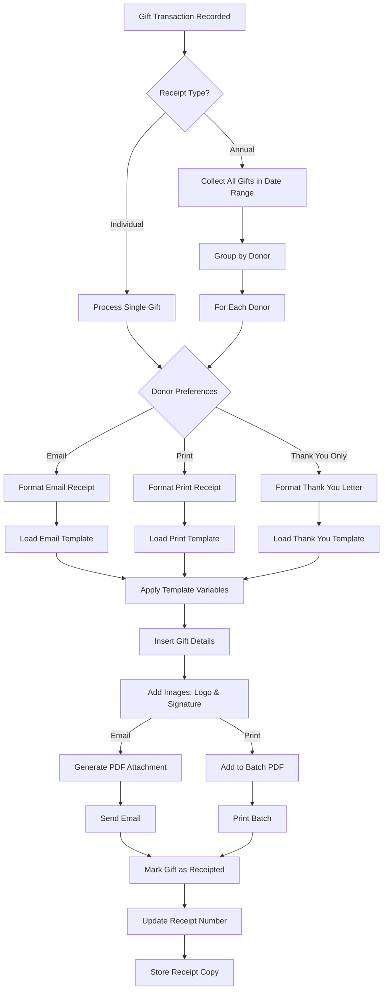
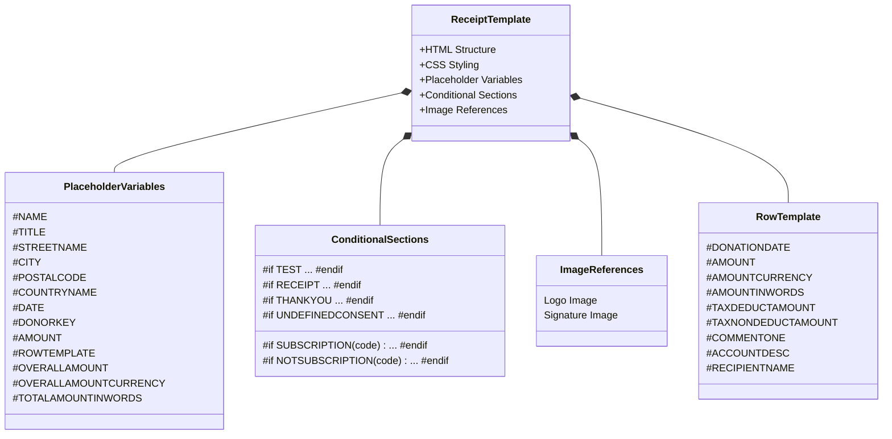
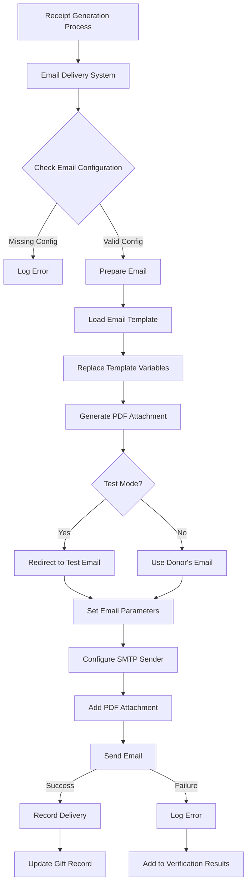
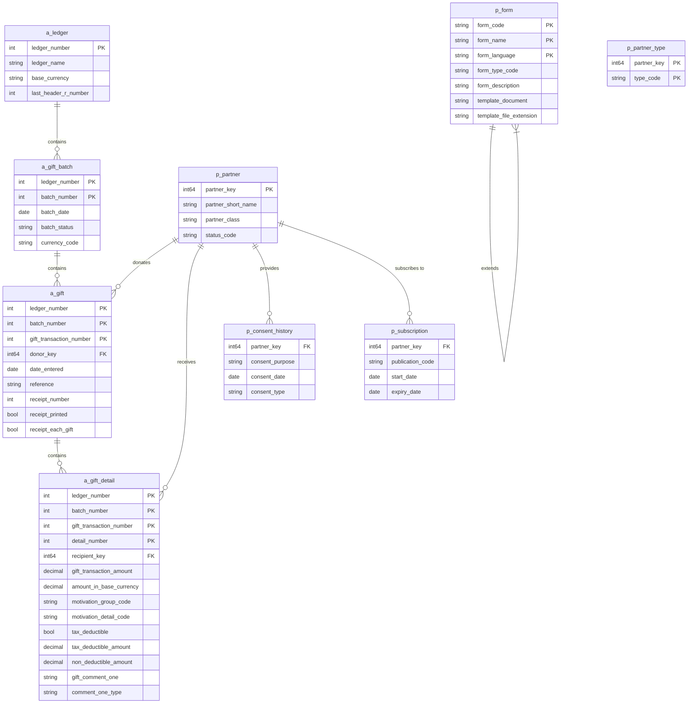

# Overview of Finance Management Forms in OpenPetra

OpenPetra's finance management forms provide a comprehensive solution for non-profit organizations to handle their financial transactions, particularly focusing on donation processing and receipt generation. These forms serve as the interface between the organization's financial data and its stakeholders, enabling efficient tracking, acknowledgment, and reporting of financial contributions. The system is designed to handle various scenarios common to non-profit organizations, including one-time donations, recurring gifts, and special campaigns, while ensuring compliance with tax regulations and donor communication preferences.

The finance management forms integrate with OpenPetra's broader partner management system, allowing organizations to maintain comprehensive donor records that include contact information, giving history, and communication preferences. This integration enables personalized donor acknowledgment and targeted fundraising efforts. The forms also connect with the accounting system, ensuring that all financial transactions are properly recorded and can be included in financial reports and statements.

# Gift Receipt Generation System

OpenPetra's gift receipt functionality provides a robust system for generating acknowledgments for financial contributions. The system supports both annual consolidated receipts and individual transaction receipts, allowing organizations to choose the most appropriate approach based on their operational needs and donor preferences.

The receipt generation process is highly configurable, supporting multiple output formats including PDF and HTML. This flexibility enables organizations to deliver receipts through various channels such as postal mail, email attachments, or digital portals. The system can automatically determine the appropriate delivery method based on donor preferences stored in the partner management system, particularly through the publication subscription mechanism that tracks whether donors have opted for electronic communications.

Receipt generation can be triggered on demand for individual gifts or scheduled as a batch process for multiple donations within a specified date range. The system includes controls to prevent duplicate receipts and maintains a comprehensive audit trail of all receipted transactions. For annual receipts, the system can consolidate multiple gifts from the same donor into a single document, providing both detailed transaction listings and summary totals.

The receipt system also handles special cases such as:
- Donors who should receive thank-you letters but not tax receipts
- Deceased donors (with options to prioritize these in processing)
- Minimum gift amount thresholds for receipt generation
- Multi-currency donations with appropriate currency conversion and formatting

# Receipt Generation Workflow

The receipt generation workflow in OpenPetra follows a sophisticated process that begins with gift transactions and ends with delivered receipts. The system first determines whether to generate individual receipts or annual consolidated statements based on configuration settings and donor preferences. For annual receipts, the system collects all gifts within the specified date range and groups them by donor.

The workflow then checks donor preferences to determine the appropriate delivery method (email or print) and whether the donor should receive a tax receipt or just a thank-you letter. Based on these preferences, the system loads the appropriate template and applies template variables with donor information, gift details, and organizational data.

For each receipt, the system processes gift details, calculating totals and tax-deductible amounts. It then incorporates organizational branding elements like logos and signatures. For email delivery, the system generates a PDF attachment and sends it to the donor's email address with a customized subject and body. For print delivery, the receipt is added to a batch PDF for printing.

After successful delivery, each gift is marked as receipted in the database, receipt numbers are updated, and copies of the receipts are stored for future reference. This comprehensive workflow ensures accurate, timely, and compliant gift acknowledgment while maintaining a complete record of all communications.

# Template-Based Receipt Customization

OpenPetra employs a sophisticated HTML template system for receipt customization, allowing organizations to create personalized and branded acknowledgments for their donors. These templates serve as the foundation for both printed and electronic receipts, ensuring consistent presentation while accommodating varying content requirements.

The template system uses HTML markup with embedded placeholder variables that are replaced with actual donor and gift data during the receipt generation process. This approach provides significant flexibility in layout design while maintaining separation between the presentation layer and the underlying data. Organizations can customize the visual appearance of their receipts, including fonts, colors, and spacing, using standard HTML and CSS techniques.

A key feature of the template system is its support for conditional sections using a simple `#if/#endif` syntax. This allows certain content blocks to be included or excluded based on specific conditions, such as:
- Whether the receipt is for tax purposes or just a thank-you letter
- Whether the donor has specific communication preferences
- Whether the receipt is being generated in test mode
- Whether the gift includes tax-deductible components

The system also supports organization branding through the inclusion of logo and signature images. These images are stored in the database and can be easily updated through the administrative interface. The template can reference these images by filename, and the system handles the proper inclusion of the images in both HTML and PDF outputs.

Receipt templates can be customized for different purposes (annual vs. individual receipts) and different languages, allowing organizations to serve diverse donor populations. The system includes default templates that can be used as starting points for customization, ensuring that organizations can quickly implement a professional receipt system without extensive design work.

# Receipt Template Structure

The receipt template structure in OpenPetra follows a hierarchical organization that enables flexible and dynamic content generation. At the core is the HTML template, which contains the overall structure, styling, and layout of the receipt. This template incorporates various components that control how data is displayed and what content is included.

Placeholder variables form a critical part of the template, serving as insertion points for dynamic data. These variables are replaced during the receipt generation process with actual values from the database. Common placeholder variables include donor information (#NAME, #TITLE, #STREETNAME), gift details (#AMOUNT, #DONATIONDATE), and summary information (#OVERALLAMOUNT, #TOTALAMOUNTINWORDS).

The template includes conditional sections that control whether specific content blocks are displayed based on runtime conditions. These sections use a simple #if/#endif syntax and can check conditions such as whether the receipt is for tax purposes (#if RECEIPT), whether it's just a thank-you letter (#if THANKYOU), or whether the donor has subscribed to specific publications (#if SUBSCRIPTION(code)).

For gift details, the template uses a row template mechanism that defines how each gift transaction should be displayed. This row template contains its own set of placeholder variables specific to individual gifts, such as #DONATIONDATE, #AMOUNT, and #RECIPIENTNAME. During processing, this row template is repeated for each gift transaction, with the variables replaced with the appropriate values.

Image references in the template point to logo and signature files stored in the database. These images are included in the final receipt to provide organizational branding and authentication. The system handles the proper inclusion of these images in both HTML and PDF formats.

This structured approach to templates enables organizations to create highly customized receipts while maintaining consistency and ensuring that all necessary information is included according to organizational policies and regulatory requirements.

# Tax Deductibility Handling

OpenPetra's receipt system includes sophisticated handling of tax-deductible and non-deductible gift amounts, a critical feature for non-profit organizations that must provide accurate tax documentation to their donors. The system supports both fully tax-deductible gifts and partially deductible contributions, ensuring that donors receive proper documentation for tax purposes.

The tax deductibility handling is controlled through a system-wide setting (`SYSDEFAULT_TAXDEDUCTIBLEPERCENTAGE`) that can be enabled or disabled based on organizational needs. When enabled, the system tracks both the tax-deductible portion and non-deductible portion of each gift separately. This separation can be based on various factors, including:

- The motivation code associated with the gift
- The recipient of the gift (some programs may be fully tax-deductible while others are not)
- Specific gift types (such as gifts-in-kind which may have different tax treatment)

For each gift transaction, the system calculates and stores the tax-deductible amount and the non-deductible amount. These values are then used when generating receipts to provide donors with clear information about which portions of their gifts qualify for tax deductions. The receipt templates include specific placeholder variables for displaying these amounts:

- `#TAXDEDUCTAMOUNT` - The tax-deductible portion of an individual gift
- `#TAXNONDEDUCTAMOUNT` - The non-deductible portion of an individual gift
- `#OVERALLTAXDEDUCTAMOUNT` - The total tax-deductible amount across all gifts in the receipt
- `#OVERALLTAXNONDEDUCTAMOUNT` - The total non-deductible amount across all gifts in the receipt

The system also supports displaying these amounts in words (e.g., "One hundred dollars") using variables like `#TAXDEDUCTAMOUNTINWORDS` and `#OVERALLTAXDEDUCTAMNTINWORDS`. This feature is particularly useful for formal receipts where monetary amounts must be spelled out for legal purposes.

When generating receipts, the system can format the tax-deductible information differently based on template conditions, allowing organizations to customize how this information is presented to donors. This flexibility ensures compliance with varying tax regulations across different jurisdictions while maintaining clear communication with donors.

# Multi-Currency Support

OpenPetra provides robust multi-currency support in its receipt system, enabling organizations operating in international contexts to handle donations in various currencies while maintaining accurate financial records. This capability is particularly valuable for organizations that receive gifts from donors in different countries or that support projects across multiple regions.

The system maintains a comprehensive currency table that stores information about each currency, including its code, symbol, formatting rules, and exchange rates. When processing gifts, the system records both the original transaction amount in the donor's currency and the equivalent amount in the organization's base currency, ensuring accurate financial reporting regardless of currency fluctuations.

For receipt generation, the system can display gift amounts in either the original transaction currency or the organization's base currency, depending on organizational preferences and regulatory requirements. The receipt templates include specific placeholder variables for currency-related information:

- `#AMOUNTCURRENCY` - The currency code for an individual gift
- `#AMOUNT` - The formatted amount of an individual gift, including appropriate currency symbols
- `#OVERALLAMOUNTCURRENCY` - The currency code for summary totals
- `#OVERALLAMOUNT` - The formatted total amount across all gifts

The system also supports language-specific currency formatting through a specialized `StringHelper` class that formats monetary values according to the appropriate conventions for each currency. This includes proper placement of currency symbols, thousands separators, and decimal points based on the currency and locale.

A particularly sophisticated feature is the system's support for spelling out monetary amounts in words, which is often required for formal receipts. The `NumberToWords` utility can convert numeric amounts to their word equivalents, taking into account currency-specific terminology for major and minor units (e.g., "dollars and cents" or "euros and cents"). The system stores language-specific labels for these units in the database, allowing for proper localization:

- `MajorUnitSingular` (e.g., "dollar", "euro")
- `MajorUnitPlural` (e.g., "dollars", "euros")
- `MinorUnitSingular` (e.g., "cent")
- `MinorUnitPlural` (e.g., "cents")

This comprehensive multi-currency support ensures that receipts are accurate, compliant with local regulations, and presented in a format that is familiar and appropriate for donors regardless of their location or preferred currency.

# Email Delivery System

OpenPetra's email delivery system provides a streamlined mechanism for distributing gift receipts electronically, offering both environmental benefits and cost savings compared to traditional printed receipts. The system integrates with standard SMTP servers to deliver professionally formatted emails with PDF receipt attachments.

The email delivery process begins by checking the system configuration to ensure that all required settings are available, including the SMTP host, port, credentials, and sender information. If any configuration is missing, the system logs appropriate errors and prevents email sending to avoid partial or failed communications.

For each receipt email, the system prepares a personalized message using configurable templates. The email subject and body templates can include placeholder variables that are replaced with donor-specific information, such as the donor's name. This personalization creates a more engaging recipient experience while maintaining efficiency through automation.

The system generates a PDF version of the receipt using the wkhtmltopdf utility, which converts the HTML receipt template into a professional-looking PDF document. This PDF is then attached to the email with a configurable filename that can include donor-specific information for easy identification.

A notable feature is the test mode capability, which redirects all emails to a test address instead of the actual donor email addresses. This allows organizations to verify the content and formatting of receipt emails before sending them to donors. In test mode, the system modifies the recipient address while preserving the original format, enabling thorough testing without risk of sending test communications to actual donors.

The email delivery system includes comprehensive error handling and logging, capturing any issues that occur during the sending process and providing detailed information for troubleshooting. Successful email deliveries are recorded in the system, with the corresponding gifts marked as receipted to prevent duplicate communications.

The system also respects donor communication preferences by checking subscription records before sending emails. Organizations can define a specific publication code for email receipts, and only donors who have subscribed to this publication will receive receipts via email. This ensures compliance with privacy regulations and donor preferences.

# Receipt Storage and Management

OpenPetra implements a comprehensive system for storing, tracking, and managing gift receipts throughout their lifecycle. This system ensures that organizations maintain accurate records of all receipts issued, can easily retrieve historical receipt information, and avoid duplicate receipt generation.

At the core of the receipt management system is the receipt numbering mechanism. Each receipt is assigned a unique receipt number that is tracked at the ledger level through the `LastHeaderRNumber` field in the `ALedger` table. This sequential numbering ensures that each receipt has a unique identifier that can be referenced for audit purposes and donor inquiries. The system provides methods to retrieve and update the last used receipt number, maintaining the integrity of the numbering sequence.

When a receipt is generated, the system records this fact by setting the `ReceiptPrinted` flag to true in the `AGift` table for each gift included in the receipt. This flag prevents the same gift from being included in multiple receipts, avoiding duplicate acknowledgments. For gifts that are part of split transactions (where a single donation is allocated to multiple purposes), the system ensures that all related gift details are properly marked as receipted.

The system also stores a copy of each generated receipt in the database, enabling organizations to retrieve historical receipts without regenerating them. Receipt templates, logos, and signatures are stored in the `PForm` table with specific form codes (e.g., "AnnualReceiptHTML", "AnnualReceiptLOGO", "AnnualReceiptSIGN"). This centralized storage ensures consistency in receipt appearance and makes it easy to update templates when needed.

For receipt delivery tracking, the system maintains records of when and how each receipt was delivered. This information is particularly important for electronic receipts, where delivery confirmation can be recorded. The system can also integrate with document management systems to store copies of receipts alongside other donor communications.

The receipt management system includes filtering capabilities to identify gifts that require receipts based on various criteria:
- Date range (for annual or periodic receipting)
- Minimum gift amount thresholds
- Donor preferences (some donors may opt out of receiving receipts)
- Tax deductibility status
- Receipt frequency preferences

These filtering options give organizations flexibility in managing their receipting process while ensuring that all required receipts are generated in a timely manner.

# Partner Consent and Subscription Integration

OpenPetra's receipt system integrates seamlessly with the partner consent and subscription management features, ensuring that donor communications comply with privacy regulations and individual preferences. This integration allows organizations to respect donor wishes regarding how they receive communications while still fulfilling legal obligations for gift acknowledgment.

The system tracks donor consent through the `p_consent_history` table, which records explicit permissions granted by donors for various types of communications. When generating receipts, the system can check whether a donor has provided consent for receipt delivery through a specific channel. For donors without any recorded consent information, the system can apply special handling rules, such as defaulting to physical mail delivery or including additional consent request information with the receipt.

For electronic communications, OpenPetra uses the publication subscription mechanism to determine delivery preferences. Organizations can define a specific publication code for email receipts (stored in the system default `GIFT_RECEIPT_EMAIL_PUBLICATION_CODE`), and donors who have subscribed to this publication will receive their receipts via email. The system checks the `p_subscription` table to verify these subscriptions, taking into account subscription start and expiry dates to ensure that preferences are current.

The system also supports special handling for donors who should receive thank-you letters but not tax receipts. This preference is tracked through a partner type code (`THANKYOU_NO_RECEIPT`) assigned to the donor's record. When generating receipts, the system checks for this partner type and adjusts the content accordingly, producing a thank-you letter without tax-deductible information for these donors.

Conditional sections in receipt templates can be controlled based on consent and subscription status. For example, templates can include different content blocks for:
- Donors with undefined consent status (`#if UNDEFINEDCONSENT`)
- Donors with specific publication subscriptions (`#if SUBSCRIPTION(code)`)
- Donors without specific publication subscriptions (`#if NOTSUBSCRIPTION(code)`)

This flexible approach allows organizations to tailor receipt content based on donor preferences while maintaining compliance with regulatory requirements. The integration ensures that receipts are delivered through appropriate channels and contain relevant information based on each donor's relationship with the organization.

# Finance Forms Data Model

The finance forms data model in OpenPetra represents a sophisticated structure designed to support comprehensive gift processing and receipt generation. At its core are several interconnected tables that track financial transactions, donor information, and receipt status.

The `a_ledger` table serves as the top-level container for financial data, storing basic information about the accounting ledger including the base currency and the last used receipt number (`last_header_r_number`). Each ledger contains multiple gift batches, represented in the `a_gift_batch` table, which group related gifts for processing efficiency.

Individual gifts are stored in the `a_gift` table, which records the donor, date, reference information, and receipt status. The `receipt_printed` flag indicates whether a receipt has been generated for the gift, while the `receipt_each_gift` flag determines whether the donor prefers individual receipts for each gift or consolidated receipts. The `receipt_number` field stores the unique identifier assigned to the receipt when generated.

Gift details are stored in the `a_gift_detail` table, which allows a single gift to be split across multiple recipients or purposes. Each detail record includes the amount, recipient, motivation codes, and tax deductibility information. For partially tax-deductible gifts, the system tracks both the deductible and non-deductible portions separately.

The partner-related tables provide essential information about donors and recipients. The `p_partner` table stores basic information about each partner, including their name and status. The `p_partner_type` table can indicate special handling requirements, such as partners who should receive thank-you letters but not tax receipts (using the `THANKYOU_NO_RECEIPT` type code).

Communication preferences are managed through the `p_consent_history` and `p_subscription` tables. The consent history tracks explicit permissions granted by partners for various types of communications, while subscriptions indicate interest in specific publications or communication channels, including email receipts.

Receipt templates and related files are stored in the `p_form` table, which uses a hierarchical structure to support template inheritance. Each form record includes the template content, description, and file extension. Special form codes identify receipt templates (`AnnualReceiptHTML`), logos (`AnnualReceiptLOGO`), and signatures (`AnnualReceiptSIGN`).

This integrated data model enables OpenPetra to maintain comprehensive records of all financial transactions, generate appropriate receipts based on donor preferences, and ensure compliance with regulatory requirements while providing flexibility for organizational policies.

[Generated by the Sage AI expert workbench: 2025-03-30 02:22:57  https://sage-tech.ai/workbench]: #