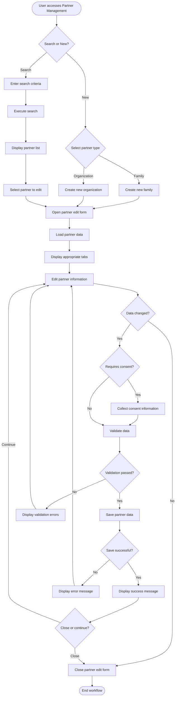
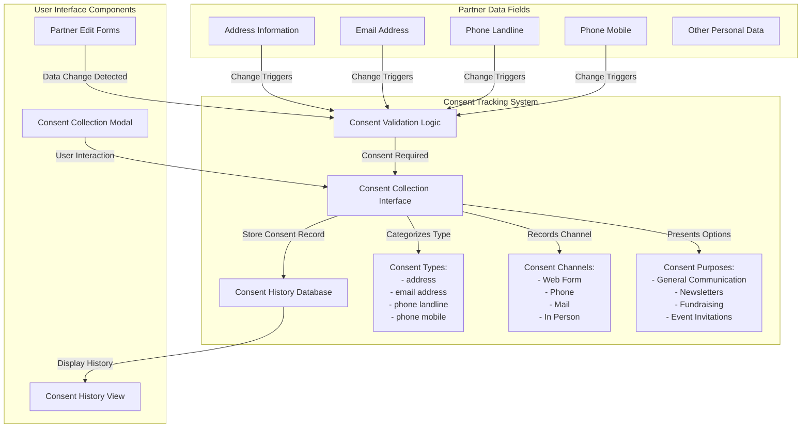
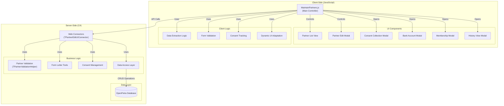

# Partner Management in OpenPetra

## Overview of Partner Management in OpenPetra

OpenPetra's partner management system forms the backbone of its contact management capabilities, designed specifically for non-profit organizations. The system provides a comprehensive framework for managing various types of partners including individuals, families, organizations, and other entities. 

At its core, the partner management system enables organizations to maintain detailed records of all contacts, track relationships between partners, manage consent for data protection regulations, handle banking information, and facilitate communications through address generation. The system is built with flexibility to accommodate different partner types while maintaining consistent data management principles.

The partner management functionality is implemented through a multi-layered architecture that separates the user interface (client-side JavaScript), business logic (server-side C# classes), and data access layers. This separation allows for robust validation, proper consent tracking for GDPR compliance, and efficient data handling.

Partners in OpenPetra represent any entity the organization interacts with - from individual donors and volunteers to partner organizations, vendors, and beneficiaries. The system's design reflects the complex relationships and information needs of non-profit organizations while providing a user-friendly interface for administrators to manage this data effectively.

## Partner Management Data Model

```mermaid
classDiagram
    class PPartner {
        +p_partner_key_n: Int64 [PK]
        +p_partner_short_name_c: String
        +p_partner_class_c: String
        +p_status_code_c: String
        +p_receipt_each_gift_l: Boolean
        +p_receipt_letter_frequency_c: String
        +p_first_gift_date_d: DateTime
        +p_last_gift_date_d: DateTime
    }
    
    class PPerson {
        +p_partner_key_n: Int64 [PK, FK]
        +p_first_name_c: String
        +p_family_name_c: String
        +p_title_c: String
        +p_middle_name_1_c: String
        +p_gender_c: String
        +p_date_of_birth_d: DateTime
        +p_academic_title_c: String
        +p_decorations_c: String
    }
    
    class PFamily {
        +p_partner_key_n: Int64 [PK, FK]
        +p_first_name_c: String
        +p_family_name_c: String
        +p_title_c: String
    }
    
    class POrganisation {
        +p_partner_key_n: Int64 [PK, FK]
        +p_organisation_name_c: String
        +p_business_code_c: String
        +p_contact_partner_key_n: Int64 [FK]
    }
    
    class PLocation {
        +p_site_key_n: Int64 [PK]
        +p_location_key_i: Int32 [PK]
        +p_street_name_c: String
        +p_postal_code_c: String
        +p_city_c: String
        +p_country_code_c: String
    }
    
    class PPartnerLocation {
        +p_partner_key_n: Int64 [PK, FK]
        +p_site_key_n: Int64 [PK, FK]
        +p_location_key_i: Int32 [PK, FK]
        +p_send_mail_l: Boolean
        +p_date_effective_d: DateTime
        +p_date_good_until_d: DateTime
    }
    
    class PPartnerAttribute {
        +p_partner_key_n: Int64 [PK, FK]
        +p_attribute_type_c: String [PK]
        +p_index_i: Int32 [PK]
        +p_value_c: String
        +p_comment_c: String
    }
    
    class PBankingDetails {
        +p_banking_details_key_i: Int32 [PK]
        +p_partner_key_n: Int64 [FK]
        +p_account_name_c: String
        +p_bank_account_number_c: String
        +p_iban_c: String
        +p_bic_c: String
        +p_main_account_l: Boolean
    }
    
    class PPartnerRelationship {
        +p_partner_key_n: Int64 [PK, FK]
        +p_relation_key_n: Int64 [PK, FK]
        +p_relation_name_c: String
        +p_relation_type_code_c: String
        +p_date_effective_d: DateTime
        +p_date_good_until_d: DateTime
    }
    
    class PConsentHistory {
        +p_consent_history_key_i: Int32 [PK]
        +p_partner_key_n: Int64 [FK]
        +p_consent_date_d: DateTime
        +p_value_c: String
        +p_channel_code_c: String
        +p_data_type_c: String
        +p_purpose_code_c: String
    }
    
    class PPartnerMembership {
        +p_partner_membership_key_i: Int32 [PK]
        +p_partner_key_n: Int64 [FK]
        +p_membership_code_c: String
        +p_membership_startdate_d: DateTime
        +p_membership_enddate_d: DateTime
    }
    
    PPartner <|-- PPerson : Specializes
    PPartner <|-- PFamily : Specializes
    PPartner <|-- POrganisation : Specializes
    PPartner "1" -- "0..*" PPartnerLocation : has addresses
    PPartnerLocation "0..*" -- "1" PLocation : references
    PPartner "1" -- "0..*" PPartnerAttribute : has attributes
    PPartner "1" -- "0..*" PBankingDetails : has bank accounts
    PPartner "1" -- "0..*" PPartnerRelationship : has relationships
    PPartner "1" -- "0..*" PConsentHistory : has consent records
    PPartner "1" -- "0..*" PPartnerMembership : has memberships
    POrganisation "0..1" --> "0..1" PPartner : has contact person
```



The diagram illustrates the core data model of OpenPetra's partner management system. The central entity is `PPartner`, which represents any contact in the system. This base entity is specialized into different partner types: `PPerson` (individuals), `PFamily` (family units), and `POrganisation` (companies, churches, etc.).

Each partner can have multiple addresses (through `PPartnerLocation` linked to `PLocation`), contact details (stored as `PPartnerAttribute`), banking information (`PBankingDetails`), relationships with other partners (`PPartnerRelationship`), consent records for GDPR compliance (`PConsentHistory`), and memberships (`PPartnerMembership`).

Organizations can have a designated contact person (another partner), creating a hierarchical relationship between partners. This flexible model allows OpenPetra to represent complex real-world relationships while maintaining data integrity and supporting the specific needs of non-profit organizations.

## Partner Edit Interface Structure

The MaintainPartners.js implementation provides a comprehensive interface for creating, editing, and managing partner records in OpenPetra. This JavaScript file serves as the client-side controller for the partner management screens, handling user interactions and communicating with server-side APIs.

The interface is structured around a tabbed layout that adapts to different partner types (individuals, families, organizations) while maintaining a consistent user experience. The main components include:

1. **Partner List View**: Displays search results with basic partner information and provides options to view details or edit partners.

2. **Partner Edit Modal**: A multi-tabbed interface that appears when creating or editing a partner, with tabs for:
   - Basic information (name, status, class)
   - Contact details (addresses, phone numbers, email)
   - Subscriptions and partner types
   - Banking information
   - Relationships and memberships
   - Contribution history

3. **Consent Management**: Integrated throughout the interface to ensure GDPR compliance when collecting or modifying personal data.

The implementation follows a modular approach with distinct methods for different operations:
- `display_list()`: Retrieves and displays partner search results
- `open_edit()`: Loads and displays a partner's details in the edit modal
- `save_partner()`: Validates and submits partner changes to the server
- `insert_consent()`: Manages consent tracking when contact information changes

The interface dynamically adapts to show only relevant fields based on the partner class, and it handles special cases like contact persons for organizations. This structure provides a flexible yet consistent way to manage different types of partners while ensuring data integrity and regulatory compliance.

## Partner Edit Screen Workflow



This flowchart illustrates the process of creating, editing, and saving partner information in the OpenPetra interface. The workflow begins when a user accesses the Partner Management section and decides whether to search for an existing partner or create a new one.

For new partners, the user selects the partner type (family or organization) which determines the fields and validation rules that will be applied. For existing partners, the user performs a search and selects a partner from the results.

Once the partner edit form is opened, the system loads the appropriate data and displays tabs relevant to the partner type. As the user edits information, the system tracks changes and determines if consent collection is required for certain data fields (particularly contact information subject to GDPR).

Before saving, the data undergoes validation. If validation fails, errors are displayed for the user to correct. Upon successful validation and saving, a confirmation message is shown, and the user can choose to continue editing or close the form.

This workflow ensures data integrity, regulatory compliance, and a smooth user experience throughout the partner management process.

## GDPR-Compliant Consent Management

OpenPetra implements a sophisticated consent management system to ensure compliance with data protection regulations such as GDPR (General Data Protection Regulation). The system tracks explicit consent for storing and using personal data, particularly contact information like addresses, email addresses, and phone numbers.

When a user modifies sensitive personal data in the partner edit interface, the system automatically triggers the consent collection process. This is implemented in the `insert_consent()` method, which creates a record of:
- What data was changed (e.g., email address, phone number)
- When the change occurred (timestamp)
- The specific value that was stored
- The channel through which consent was obtained (e.g., web form, phone call)
- The specific purposes for which the data can be used (e.g., general communication, newsletters)

Each consent record is stored with a complete history, allowing organizations to demonstrate compliance by showing when and how consent was obtained for each piece of personal information. The system prevents saving changes to personal data without proper consent documentation.

The partner edit interface includes a dedicated history view that displays all consent records for a partner, organized by data type. This view allows administrators to:
- See when consent was given or modified
- View who recorded the consent
- Check which communication purposes were approved
- Update consent permissions when requested by the partner

This comprehensive approach ensures that organizations using OpenPetra can maintain detailed records of consent as required by data protection regulations, while also providing partners with transparency and control over how their personal information is used.

## Address Block Generation for Communications

The FormLetterTools class in OpenPetra provides a sophisticated mechanism for generating properly formatted address blocks for partner communications. This functionality is essential for creating culturally appropriate and correctly formatted addresses for letters, labels, and other communications sent to partners across different countries.

The address block generation system works through a token-based templating approach:

1. **Country-Specific Templates**: The system first attempts to retrieve an address layout template specific to the partner's country code. If no country-specific template exists, it falls back to a default template (country code '99').

2. **Token Replacement**: The address template contains special tokens (like `[[FirstName]]`, `[[LastName]]`, `[[City]]`) that are replaced with the partner's actual data during processing.

3. **Formatting Controls**: Special formatting tokens control aspects like capitalization (`[[CapsOn]]`/`[[CapsOff]]`), line suppression for empty fields, and spacing between elements.

4. **Special Cases**: The system handles special cases such as:
   - Contact persons for organizations and churches
   - Different name formats based on cultural norms
   - Academic titles and decorations
   - Local language variations of country names

5. **Line Management**: Empty lines are automatically suppressed unless explicitly marked with `[[NoSuppress]]`, ensuring compact and professional-looking addresses.

For example, a template might contain:
```
[[FirstNameAndSpace]][[LastName]]
[[Address1]]
[[PostalCode]] [[City]]
[[CountryName]]
```

This would be transformed into a properly formatted address block with the partner's actual data, respecting cultural norms and postal requirements of the destination country.

The system's flexibility allows organizations to maintain different address formats for different purposes (small labels, envelopes, formal letters) while ensuring consistency and correctness across all communications.

## Consent Management System



OpenPetra's consent management system is designed to track, store, and manage consent for different types of partner data in compliance with privacy regulations like GDPR. The diagram illustrates how this system works:

When a user modifies sensitive personal data in the partner edit forms (such as address, email, or phone numbers), the system automatically detects these changes and triggers the consent validation logic. If consent is required for the changed data, the system presents a consent collection modal to the user.

The consent collection interface allows users to specify:
1. The consent channel (how consent was obtained - web form, phone, mail, in-person)
2. The date when consent was given
3. The specific purposes for which the data can be used (general communication, newsletters, fundraising, etc.)

This information is then stored in the consent history database, creating a comprehensive record of when and how consent was obtained for each piece of personal data. The system maintains a complete history of consent changes over time, allowing organizations to demonstrate compliance with privacy regulations.

The consent history view provides administrators with a way to review all consent records for a partner, organized by data type. This interface also allows for updating consent permissions when requested by the partner.

This structured approach ensures that personal data is only collected and used with proper documentation of consent, protecting both the organization and the individuals whose data is being processed.

## Partner Banking Details Management

OpenPetra provides robust functionality for managing partner banking information, which is crucial for non-profit organizations that handle donations, recurring gifts, and other financial transactions. The banking details management system is designed to ensure data accuracy, security, and proper designation of accounts.

The system allows organizations to store multiple bank accounts for each partner, with features including:

1. **Main Account Designation**: Each partner can have multiple bank accounts, but only one can be designated as the "main account." The system enforces this rule through validation logic that prevents saving changes if multiple accounts are marked as main accounts.

2. **IBAN Formatting**: The system automatically formats International Bank Account Numbers (IBANs) according to standard conventions, removing spaces and ensuring consistent storage format while maintaining readability in the interface.

3. **Modal Interface**: Banking details are managed through a dedicated modal interface that separates this sensitive information from other partner data, providing focused editing capabilities and additional security.

4. **Account Usage Tracking**: The system tracks how each bank account is used through the `PBankingDetailsUsage` table, allowing organizations to maintain records of account purposes and relationships.

5. **Validation Rules**: Comprehensive validation ensures that banking information is complete and properly formatted before saving, reducing errors in financial transactions.

The implementation includes specific methods for:
- Creating new bank accounts (`new_bank_account()`)
- Editing existing accounts (`edit_account()`)
- Saving changes with validation (`save_edit_bank_account()`)
- Deleting accounts with confirmation (`delete_bank_account()`)

This structured approach to banking details management helps organizations maintain accurate financial records while providing flexibility for partners with multiple accounts or changing banking information.

## Partner Relationships and Memberships

OpenPetra implements a comprehensive system for tracking relationships between partners and managing partner memberships, providing organizations with a clear picture of how different partners are connected and what groups they belong to.

### Partner Relationships

The relationship management functionality allows organizations to establish and track connections between different partners in the system. These relationships can represent various real-world connections such as:

- Family relationships (parent/child, spouse)
- Professional relationships (employer/employee)
- Organizational relationships (member of, branch of)
- Support relationships (donor to, supporter of)

Each relationship record includes:
- The two partners involved in the relationship
- The relationship type
- Effective dates (when the relationship began and, optionally, when it ends)
- Additional descriptive information

Relationships are bidirectional in the database but can have different meanings from each perspective. For example, if Partner A is an "employer of" Partner B, then Partner B is an "employee of" Partner A.

### Memberships

The membership tracking system allows organizations to record a partner's affiliation with various groups, committees, or categories. Each membership record includes:

- The membership type/code
- Start date
- Optional end date for time-limited memberships
- Status information

The implementation provides methods for:
- Creating new memberships (`new_membership()`)
- Editing existing memberships (`edit_membership()`)
- Saving membership changes (`save_edit_membership()`)
- Deleting memberships with confirmation (`delete_membership()`)

Both relationships and memberships are managed through dedicated interfaces in the partner edit screen, allowing users to easily view, add, modify, or remove these connections. The system also tracks changes to ensure data integrity and maintains a history of past relationships and memberships for reference.

This interconnected view of partners helps organizations understand the network of relationships within their community and better manage group affiliations, which is particularly valuable for non-profit organizations that rely on community connections and group activities.

## Partner Edit Form Architecture



The Partner Edit form architecture in OpenPetra follows a client-server model with clear separation of concerns between the presentation layer (client-side JavaScript) and the business logic (server-side C# components).

On the client side, `MaintainPartners.js` serves as the main controller that orchestrates the user interface components and client-side logic. It manages the partner list view, the multi-tabbed edit form, and various modal dialogs for specific functions like consent collection, bank account management, and membership editing. The client-side implementation includes logic for data extraction from forms, basic validation, consent tracking, and dynamic UI adaptation based on partner types and user actions.

The server side is centered around the `TPartnerEditUIConnector` class, which acts as the bridge between the client interface and the backend systems. This connector handles data retrieval, validation, and persistence operations. It leverages several specialized components:

1. **TPartnerValidationHelper**: Provides validation services to ensure data integrity and business rule compliance
2. **FormLetterTools**: Generates properly formatted address blocks for communications
3. **Consent Management**: Handles the storage and retrieval of consent records
4. **Data Access Layer**: Manages the actual database operations

Communication between the client and server happens through API calls, with data typically exchanged in JSON format. The architecture supports both immediate operations (like validation) and potentially lengthy processes (like form letter generation) with appropriate progress tracking.

This separation of concerns allows the system to maintain a responsive user interface while ensuring that business rules and data integrity constraints are properly enforced on the server side. It also facilitates maintenance and future enhancements by keeping the presentation logic separate from the business logic.

## Partner Data Validation Framework

OpenPetra implements a comprehensive validation framework for partner data that ensures data integrity through a combination of client-side and server-side validation. The framework is built around a delegate pattern that allows for flexible validation rules while maintaining strict type safety and error handling.

At the core of the validation system is the `TPartnerValidationHelper` class, which defines a set of delegate types for different validation operations:

1. **TVerifyPartner**: Verifies the existence of a partner and retrieves basic information
2. **TPartnerHasActiveStatus**: Confirms that a partner has an active status
3. **TPartnerIsLinkedToCC**: Determines if a partner is linked to a cost center
4. **TPartnerOfTypeCCIsLinked**: Checks if a partner of type cost center is linked
5. **TPartnerHasCurrentGiftDestination**: Verifies that a partner has a valid gift destination

These delegates must be initialized before use, creating a clear contract between the validation framework and its implementations. The system throws an `InvalidOperationException` if validation is attempted without proper initialization, ensuring that validation dependencies are properly configured.

The validation process occurs at multiple levels:

1. **Client-side validation**: Basic format and required field validation in the JavaScript code
2. **Server-side business rule validation**: More complex validation that requires database access
3. **Database constraints**: Final validation enforced by database integrity rules

Validation results are collected in `TVerificationResultCollection` objects that contain detailed information about any validation errors, including:
- Error codes
- Human-readable messages
- Severity levels (information, warning, critical)
- Context information

This structured approach to validation ensures that partner data meets all business requirements and maintains consistency across the system. The delegate pattern allows for easy extension of validation rules without modifying the core framework, making it adaptable to different organizational needs and future requirements.

[Generated by the Sage AI expert workbench: 2025-03-30 02:22:57  https://sage-tech.ai/workbench]: #