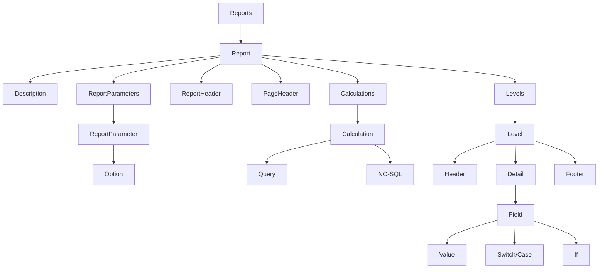
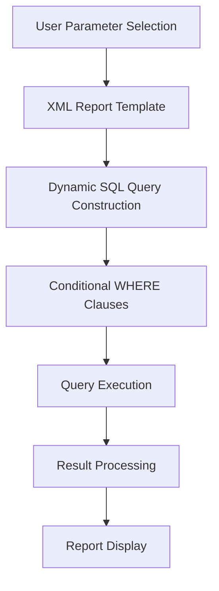
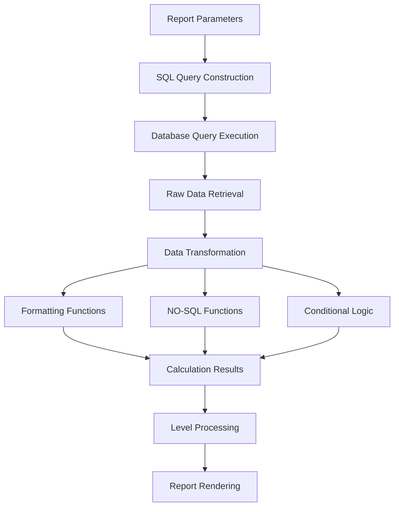

# XML Report Configuration in OpenPetra

## XML Report Configuration in OpenPetra

OpenPetra's reporting system uses XML files to define report structures, parameters, and layouts. These files serve as templates that determine how data is queried, processed, and presented to users.

## Report Parameter Structure

Reports are configured with XML parameter elements that define filtering options, display settings, and calculation methods. These parameters control which data appears and how it's formatted.

```xml
<Parameters>
  <Parameter id="systemsettings" value="eBoolean:true" />
  <Parameter id="xmlfiles" value="eString:Conference\\nationalitysummaryreport.xml" />
  <Parameter id="currentReport" value="eString:Nationality Summary Report" />
  <Parameter id="MaxDisplayColumns" value="eInteger:6" />
  <Parameter id="param_conferenceselection" value="eString:one conference" />
  <Parameter id="param_attendeeselection" value="eString:all attendees" />
  <Parameter id="param_partnerkey" value="eInteger:0" />
</Parameters>
```

## Report XML Structure Hierarchy



The XML structure follows a hierarchical organization defined in the reports.dtd file, with reports containing parameters, calculations, and nested levels for organizing data presentation.

## Column Configuration System

Reports define display columns using paired parameters: param_calculation specifies the data source and ColumnWidth controls visual presentation, allowing precise control over report layout.

```xml
<Parameter id="param_calculation" column="0" value="eString:Partner Name" />
<Parameter id="ColumnWidth" column="0" value="eInteger:4" />
<Parameter id="param_calculation" column="1" value="eString:Partner Key" />
<Parameter id="ColumnWidth" column="1" value="eInteger:2" />
```

## Dynamic Query Construction

Report XML files contain SQL queries with conditional segments that adapt based on user parameter selections, enabling flexible filtering by conference, attendee, date ranges, and other criteria.



The system builds queries dynamically based on user selections, adding or removing conditions as needed.

## Hierarchical Report Levels

Reports use nested level structures to organize data presentation, with parent-child relationships between main, summary, and detail sections for proper grouping and totaling.

```xml
<levels>
  <level name="main">
    <!-- Main level calculations and fields -->
    <level name="SummaryLevel">
      <!-- Summary level calculations and fields -->
      <level name="DetailLevel">
        <!-- Detail level calculations and fields -->
      </level>
    </level>
  </level>
</levels>
```

This hierarchical structure allows for proper data organization with headers, details, and footers at each level.

## Calculation Types and Functions

Reports implement various calculation types including SQL queries, NO-SQL function calls, and formatting operations that transform raw data into meaningful information.

```xml
<calculation id="SelectDonors" returns="PartnerKey, PartnerName" returnsFormat="row">
  <query>
    <queryDetail>
      SELECT p_partner_key_n AS PartnerKey, 
             p_partner_short_name_c AS PartnerName
      FROM PUB_p_partner
      WHERE p_status_code_c = 'ACTIVE'
    </queryDetail>
  </query>
</calculation>

<calculation id="FormatAddress" returns="FormattedAddress">
  <NO-SQL>
    <function>GetPartnerBestAddress({PartnerKey})</function>
  </NO-SQL>
</calculation>
```

## Report Calculation Process



The calculation process flows from parameter selection through query execution and data transformation to final formatted output, with various processing steps along the way.

## Conditional Display Logic

Reports use condition attributes, switch/case statements, and if elements to control which content appears based on parameter values and data conditions.

```xml
<fielddetail condition="eq({param_attendeeselection}, one attendee)">
  <value text="Partner: "></value><value variable="param_partnerkey"></value>
</fielddetail>

<switch>
  <case condition="eq({param_report_type}, Complete)">
    <!-- Complete report content -->
  </case>
  <case condition="eq({param_report_type}, Summary)">
    <!-- Summary report content -->
  </case>
</switch>
```

## Report DTD Structure

The reports.dtd file defines the XML schema for all reports, establishing elements for parameters, calculations, levels, and formatting to ensure consistent implementation.

```xml
<!ELEMENT report (description, reportparameters, reportheader, pageheader, 
                 detailreports?, calculations, levels) >
<!ATTLIST report
   id            CDATA  #REQUIRED
>

<!ELEMENT calculation (query | NO-SQL)>
<!ATTLIST calculation
   id            CDATA  #REQUIRED
   returns       CDATA  #IMPLIED
   returnsFormat CDATA  #IMPLIED
>
```

The DTD provides a structured framework that ensures all reports follow a consistent pattern, making the system more maintainable and extensible.

[Generated by the Sage AI expert workbench: 2025-03-30 02:22:57  https://sage-tech.ai/workbench]: #