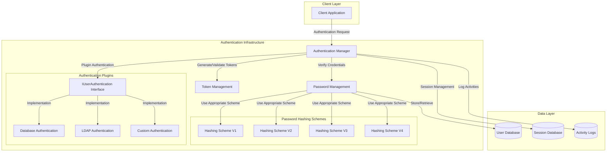
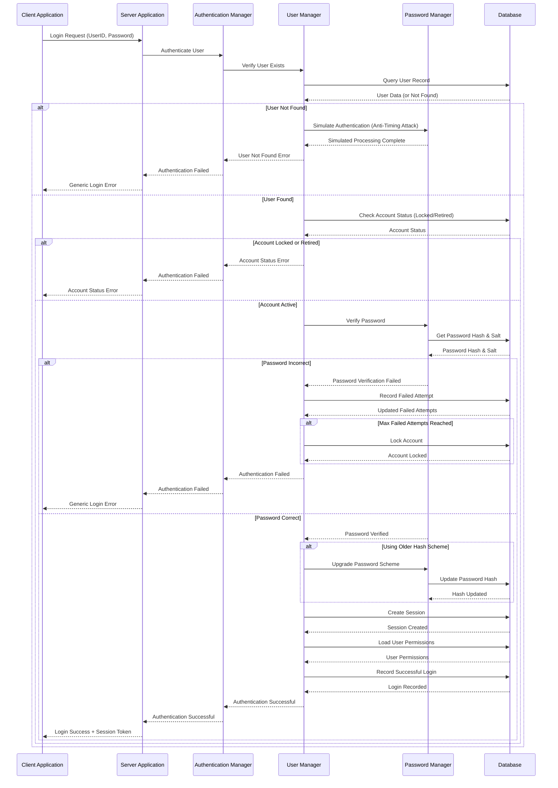
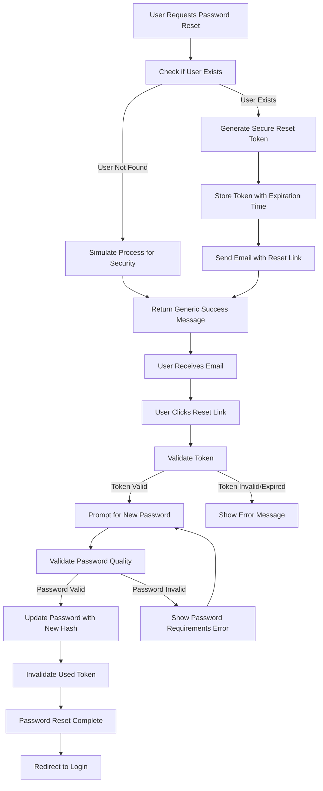
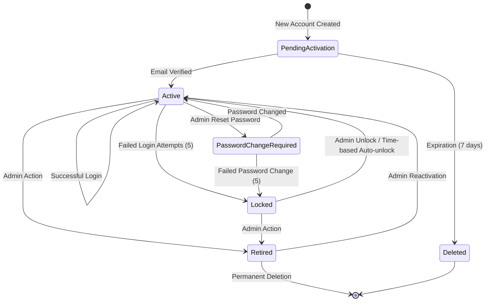

# Authentication Infrastructure in OpenPetra

## Authentication Overview

OpenPetra implements a comprehensive authentication infrastructure designed with security, flexibility, and maintainability in mind. The system employs a layered architecture that separates authentication concerns across multiple components, allowing for robust security while maintaining extensibility.

At its core, OpenPetra's authentication system is built around a secure password management framework that supports multiple hashing schemes with progressive security improvements. The system has evolved through several password hashing versions (V1 through V4), each implementing stronger security measures while maintaining backward compatibility.

The authentication infrastructure includes pluggable authentication providers through the IUserAuthentication interface, allowing OpenPetra to integrate with external authentication systems like LDAP or other identity providers. This modular approach enables organizations to leverage existing authentication infrastructure while still benefiting from OpenPetra's security features.

Security is a primary concern, with measures implemented to protect against common attack vectors including timing attacks, brute force attempts, and password hash exposure. The system includes account locking mechanisms, secure password reset workflows, and comprehensive activity logging to maintain a secure environment.

## Authentication Architecture

The architecture diagram illustrates the layered design of OpenPetra's authentication system. The client application interacts with the Authentication Manager, which coordinates authentication processes through the Password Management and Token Management components. The Password Management component utilizes various hashing schemes (V1-V4) to securely store and verify passwords. The system supports pluggable authentication through the IUserAuthentication interface, allowing for database, LDAP, or custom authentication methods. All authentication data is stored in the database layer, including user credentials, session information, and activity logs.

## Password Management and Security

OpenPetra implements a sophisticated password security system that has evolved through multiple versions to address emerging security threats and best practices. The system uses the Scrypt key stretching algorithm through the libsodium-net library to generate secure password hashes.

Password security in OpenPetra is built around several key principles:

1. **Multiple Hashing Schemes**: The system supports four password hashing schemes (V1-V4), each with increasing security strength. When users log in with credentials stored in an older scheme, the system automatically upgrades their password hash to the current scheme.

2. **Salt Generation**: Each password is combined with a unique cryptographically secure random salt before hashing, protecting against rainbow table attacks and ensuring that identical passwords produce different hashes.

3. **Timing Attack Protection**: The system implements constant-time comparison for password verification and simulates authentication processes for non-existent users to prevent timing attacks that could reveal user existence.

4. **Brute Force Protection**: Failed login attempts are tracked, with automatic account locking after a configurable number of failures to prevent brute force attacks.

5. **Password Quality Requirements**: The system enforces password complexity requirements, including minimum length (8+ characters), and requiring a mix of letters and numbers to ensure password strength.

6. **Secure Password Reset**: A token-based password reset system generates cryptographically secure tokens with sufficient entropy (>91) to prevent guessing attacks.

7. **Secure Storage**: Password hashes are stored using Base64 encoding, with the hashing scheme version tracked to enable automatic upgrades.

The current default password scheme (V2) uses the Scrypt algorithm with medium strength settings, balancing security and performance. More secure schemes (V3 and V4) are available with medium-slow and sensitive strength settings respectively, providing options for environments with higher security requirements.

## User Authentication Process

The authentication process in OpenPetra follows a carefully designed sequence to ensure security while providing a smooth user experience. When a user attempts to log in, the system performs the following steps:

1. **Login Request Initiation**: The process begins when a user submits their credentials (username and password) through the client interface.

2. **Input Validation**: The system validates the input format, ensuring that the username and password meet basic requirements before proceeding.

3. **User Existence Check**: The system checks if the provided username exists in the database. For security reasons, if the user doesn't exist, the system still simulates the authentication process timing to prevent timing attacks that could reveal user existence.

4. **Account Status Verification**: For existing users, the system checks if the account is locked or retired. If the account is locked due to too many failed login attempts or has been retired by an administrator, the authentication is rejected with an appropriate message.

5. **System Status Check**: The system verifies that the OpenPetra system is enabled and available for user logins.

6. **Password Verification**: The core authentication step involves verifying the provided password against the stored hash:
   - The system retrieves the user's password hash, salt, and hashing scheme version from the database
   - It applies the same hashing algorithm and salt to the provided password
   - It compares the resulting hash with the stored hash using a constant-time comparison method to prevent timing attacks

7. **Authentication Method Selection**: OpenPetra supports multiple authentication methods through its plugin architecture. The system determines whether to use the internal database authentication or an external authentication provider based on configuration.

8. **Password Scheme Upgrade**: If authentication is successful and the user's password is stored using an older hashing scheme, the system automatically upgrades the password to the current scheme.

9. **Session Establishment**: Upon successful authentication, the system:
   - Creates a new session for the user
   - Generates security tokens for the session
   - Loads the user's permissions and role information
   - Records the successful login in the activity log

10. **Failed Login Handling**: If authentication fails, the system:
    - Increments the failed login counter for the user
    - Locks the account if the maximum number of failed attempts is reached
    - Records the failed login attempt in the activity log
    - Returns an appropriate error message without revealing specific details that could aid attackers

11. **Client Response**: Finally, the system returns the authentication result to the client, either granting access with session information or denying access with a generic error message.

## Authentication Sequence Flow

This sequence diagram illustrates the detailed flow of the authentication process in OpenPetra, showing the interactions between the client application, server components, and database. The diagram highlights key security features including timing attack prevention, account locking, and password scheme upgrading.

## Password Hashing Evolution

OpenPetra's password hashing schemes have evolved significantly over time to address emerging security threats and incorporate best practices in cryptographic security. The system currently supports four password hashing schemes, each representing an improvement over its predecessor.

### Hashing Scheme V1
The initial password hashing scheme (V1) implemented the Scrypt key stretching algorithm through the libsodium-net library. While this was a strong approach at the time, it had a security weakness in its salt generation process. The salt was inadvertently weakened by converting a byte array to ASCII, which reduced the available byte value representations from 256 to 128. This limitation reduced the effectiveness of the salt in preventing precomputed attacks.

Key characteristics of V1:
- Scrypt algorithm with PasswordHash.Strength.Medium setting
- Salt generation with reduced entropy due to ASCII conversion
- Password hash stored as a hexadecimal string

### Hashing Scheme V2
Scheme V2 addressed the salt generation weakness in V1 by properly preserving the full range of byte values in the salt. This scheme maintains the same Scrypt algorithm but implements proper Base64 encoding for both salt and hash storage.

Key characteristics of V2:
- Scrypt algorithm with PasswordHash.Strength.Medium setting
- Improved salt generation with full entropy
- Password hash stored as a Base64 string
- Currently the default scheme for OpenPetra

### Hashing Scheme V3
Scheme V3 builds upon V2 by increasing the computational work factor of the Scrypt algorithm. It uses the MediumSlow strength setting, which makes the hashing process more resource-intensive and thus more resistant to brute force attacks.

Key characteristics of V3:
- Scrypt algorithm with PasswordHash.Strength.MediumSlow setting
- Same salt generation as V2
- Password hash stored as a Base64 string
- Higher resistance to brute force attacks

### Hashing Scheme V4
The most recent scheme, V4, further increases security by using the highest strength setting available in the Scrypt implementation. It uses the Sensitive strength setting, which significantly increases the computational resources required for password verification.

Key characteristics of V4:
- Scrypt algorithm with PasswordHash.Strength.Sensitive setting
- Same salt generation as V2 and V3
- Password hash stored as a Base64 string
- Maximum resistance to brute force attacks at the cost of higher verification time

### Automatic Migration
One of the most important features of OpenPetra's password hashing system is its automatic migration capability. When a user successfully authenticates with credentials stored in an older scheme, the system automatically:

1. Verifies the password using the original scheme
2. Generates a new hash using the current default scheme
3. Updates the user's record with the new hash and scheme version

This ensures that all active users gradually migrate to the most secure scheme without requiring manual intervention or password resets. The migration is transparent to users, occurring during their normal login process.

The evolution of these schemes demonstrates OpenPetra's commitment to maintaining strong security practices while providing a smooth upgrade path that doesn't disrupt user experience.

## Token-Based Authentication Features

OpenPetra implements a robust token-based authentication system for various self-service operations that require secure, time-limited access without requiring a full user login. These token-based mechanisms are primarily used for password resets, account verification, and self-service registration.

### Password Reset Functionality

The password reset system allows users who have forgotten their passwords to regain access to their accounts securely. The process is designed to verify the user's identity through their registered email address without exposing security information:

1. **Token Generation**: When a user requests a password reset, the system generates a cryptographically secure random token using TPasswordHelper.GetRandomToken(). This token has high entropy (>91) to prevent guessing attacks.

2. **Token Storage**: The token is stored in the database along with the user ID and an expiration timestamp, typically set to 24 hours from generation.

3. **Email Delivery**: The system sends an email to the user's registered email address containing a unique URL that includes both the user ID and the reset token.

4. **Token Verification**: When the user clicks the link, the system verifies:
   - The token exists in the database
   - The token matches the one associated with the user ID
   - The token has not expired

5. **Password Change**: Upon successful verification, the user is prompted to enter a new password that meets the system's password quality requirements.

6. **Token Invalidation**: Once the password is successfully changed, the token is immediately invalidated to prevent reuse.

### Account Verification

For new accounts or email address changes, OpenPetra uses a similar token-based verification process:

1. The system generates a verification token when a new account is created or an email address is changed
2. An email containing the verification token is sent to the user's email address
3. The user must click the verification link to confirm ownership of the email address
4. Upon verification, the account is activated or the email change is confirmed

### Self-Service Registration

OpenPetra supports self-service user registration through a token-based workflow:

1. **Registration Request**: A user submits basic information including email address, name, and other required fields.

2. **Account Creation**: The system creates a preliminary user account in a pending state.

3. **Verification Token**: A unique SelfSignupPasswordToken is generated and stored with the user record.

4. **Verification Email**: An email is sent to the provided address containing a link with the user ID and token.

5. **Account Activation**: When the user clicks the link, the token is verified, and the user is prompted to set their password.

6. **Partner Record Creation**: Upon successful activation, the system automatically creates a partner record associated with the user account.

### Security Considerations

OpenPetra's token-based authentication implements several security measures:

1. **High Entropy Tokens**: Tokens are generated with sufficient entropy (>91) using cryptographically secure random number generation.

2. **Limited Lifetime**: All tokens have an expiration time, typically 24 hours, after which they become invalid.

3. **Single-Use Design**: Tokens are invalidated after successful use to prevent replay attacks.

4. **Rate Limiting**: The system implements rate limiting for token generation to prevent abuse.

5. **Secure Delivery**: Tokens are delivered via email rather than SMS to avoid SIM-swapping attacks.

These token-based mechanisms provide secure, user-friendly workflows for account management operations while maintaining the overall security posture of the system.

## Password Reset Flow

The password reset flow diagram illustrates the secure process OpenPetra uses to allow users to reset their passwords. The process begins when a user requests a password reset, typically by clicking a "Forgot Password" link. The system checks if the user exists, but importantly, it simulates the process even for non-existent users to prevent information disclosure through timing attacks.

For valid users, the system generates a cryptographically secure token with high entropy, stores it in the database with an expiration timestamp, and sends an email with a reset link to the user's registered email address. When the user clicks the link, the system validates the token, checking that it exists, matches the user, and hasn't expired.

If the token is valid, the user is prompted to enter a new password, which is validated against OpenPetra's password quality requirements (minimum length, character mix, etc.). Once a valid password is provided, the system updates the user's password with a new hash using the current password hashing scheme, invalidates the used token to prevent reuse, and redirects the user to the login page.

This flow incorporates multiple security measures including secure token generation, limited token lifetime, single-use tokens, and proper password quality validation, while maintaining a user-friendly experience.

## Pluggable Authentication System

OpenPetra implements a flexible pluggable authentication system that allows organizations to integrate with external authentication providers while maintaining the security and functionality of the core system. This architecture is built around the IUserAuthentication interface, which defines a standard contract that all authentication plugins must implement.

### IUserAuthentication Interface

The IUserAuthentication interface serves as the foundation of the pluggable authentication system. It defines the following key methods:

1. **AuthenticateUser**: Validates user credentials against the external authentication system
2. **SetPassword**: Allows administrators to change a user's password
3. **SetPassword** (overload): Allows users to change their own password with old password verification
4. **CreateUser**: Creates a new user in the external authentication system
5. **GetAuthenticationFunctionality**: Reports which features the authentication plugin supports

This interface allows OpenPetra to interact with various authentication systems in a consistent manner, regardless of their underlying implementation.

### Plugin Architecture

The plugin architecture follows these principles:

1. **Dynamic Loading**: Authentication plugins are loaded dynamically at runtime based on configuration settings, allowing for easy switching between authentication methods without code changes.

2. **Namespace Convention**: Plugins follow a naming convention where the DLL name matches the namespace, and the main class is named TUserAuthentication within that namespace.

3. **Configuration-Driven**: The active authentication method is specified in the application configuration through the "UserAuthenticationMethod" setting.

4. **Capability Discovery**: The system queries plugins for their capabilities to determine which features (user creation, password changes, etc.) should be exposed in the UI.

### Implementation Process

To implement a custom authentication plugin:

1. Create a class library project that references the OpenPetra shared libraries
2. Implement the IUserAuthentication interface in a class named TUserAuthentication
3. Place the compiled DLL in the OpenPetra application directory
4. Configure OpenPetra to use the plugin by setting the UserAuthenticationMethod configuration value

### Default Authentication

When no external authentication plugin is specified, OpenPetra defaults to its internal database authentication method ("OpenPetraDBSUser"), which uses the secure password hashing schemes described earlier.

### Authentication Method Selection

The authentication method selection process follows these steps:

1. The system reads the "UserAuthenticationMethod" configuration setting
2. If set to "OpenPetraDBSUser" or not specified, the internal database authentication is used
3. Otherwise, the system attempts to load the specified plugin using reflection
4. If the plugin is successfully loaded, all authentication requests are routed through it
5. If loading fails, the system falls back to internal authentication and logs an error

### Integration with User Management

The pluggable authentication system integrates seamlessly with OpenPetra's user management features:

1. **User Interface Adaptation**: The UI adapts based on the capabilities reported by the active authentication plugin, showing or hiding features as appropriate.

2. **Permission Synchronization**: While authentication may be handled externally, authorization (permissions and roles) is still managed within OpenPetra.

3. **Account Status Management**: Account locking and retirement are coordinated between OpenPetra and the external authentication system.

This pluggable architecture provides organizations with the flexibility to leverage existing authentication infrastructure (such as LDAP directories or single sign-on systems) while benefiting from OpenPetra's comprehensive user management and authorization capabilities.

## Security Measures Against Common Attacks

OpenPetra implements multiple layers of security measures to protect against common authentication vulnerabilities and attack vectors. These measures are designed to safeguard user credentials, prevent unauthorized access, and maintain system integrity.

### Protection Against Timing Attacks

Timing attacks exploit the time differences in system responses to extract sensitive information. OpenPetra implements several countermeasures:

1. **Constant-Time Comparison**: Password verification uses the TPasswordHelper.EqualsAntiTimingAttack method, which performs byte-by-byte comparison in constant time regardless of where differences occur.

2. **Simulated Authentication for Non-Existent Users**: When authentication is attempted for a non-existent user, the system deliberately simulates the time it would take to verify a real user's password, making it impossible to determine user existence through timing differences.

3. **Uniform Error Messages**: The system returns generic error messages for various authentication failures (wrong password, non-existent user, locked account) to prevent information disclosure.

### Brute Force Protection

To defend against brute force password guessing attempts, OpenPetra implements:

1. **Failed Login Tracking**: The system tracks consecutive failed login attempts for each user account.

2. **Account Locking**: After a configurable number of failed attempts (typically 5), the account is automatically locked for a specified period.

3. **Progressive Delays**: Some implementations add increasing delays after each failed attempt to further discourage automated attacks.

4. **Activity Logging**: All failed login attempts are logged with client information (IP address, computer name) for security auditing and forensic analysis.

### Password Security

Password-related security measures include:

1. **Strong Hashing Algorithms**: The system uses the Scrypt key stretching algorithm with appropriate work factors to make password cracking computationally expensive.

2. **Unique Salts**: Each password is hashed with a unique cryptographically secure random salt to prevent rainbow table attacks.

3. **Password Quality Requirements**: The system enforces minimum password strength requirements including length (8+ characters) and character composition (mix of letters and numbers).

4. **Password Expiration**: Administrators can set passwords to require changing at next login for temporary credentials.

5. **Secure Password Reset**: The password reset process uses high-entropy tokens with limited lifetimes delivered via email.

### Session Security

To protect authenticated sessions, OpenPetra implements:

1. **Secure Session Tokens**: Session identifiers are generated with sufficient entropy to prevent guessing.

2. **Session Timeout**: Inactive sessions expire after a configurable period.

3. **Session Tracking**: The system maintains records of active sessions and provides administrators with the ability to terminate suspicious sessions.

### System-Level Protections

Additional security measures at the system level include:

1. **Version Compatibility Checks**: The system verifies that client and server versions match to prevent exploitation of version mismatches.

2. **System Maintenance Mode**: Administrators can place the system in maintenance mode, temporarily preventing all logins except for administrators.

3. **Comprehensive Logging**: All security-relevant events are logged for audit purposes, including login attempts, password changes, and account status changes.

4. **Secure Email Templates**: Email templates for password resets and account verification include security notices advising recipients to ignore emails they didn't request.

These multi-layered security measures work together to provide a robust defense against common authentication attacks while maintaining a positive user experience for legitimate users.

## Account Security State Machine

The account security state machine diagram illustrates the lifecycle of user accounts in OpenPetra, showing the various states an account can be in and the transitions between them.

When a new account is created, it begins in the **PendingActivation** state, waiting for email verification. From this state, it can either become **Active** once the email is verified or be **Deleted** if the verification period expires (typically 7 days).

An **Active** account represents a normal user who can log in and use the system. From this state, several transitions are possible:
- It can enter **PasswordChangeRequired** if an administrator resets the password
- It can become **Locked** if too many failed login attempts occur (typically 5)
- It can be **Retired** through administrative action when the user no longer needs access
- It remains **Active** with successful logins

The **PasswordChangeRequired** state forces users to set a new password before accessing the system. From here, the account can return to **Active** once a valid password is set, or become **Locked** if too many failed password change attempts occur.

A **Locked** account is temporarily inaccessible due to security concerns. It can be unlocked by an administrator or through an automatic time-based mechanism, returning it to the **Active** state. Alternatively, it can be **Retired** if the administrator determines the account should no longer be used.

The **Retired** state indicates an account that is no longer in use but preserved for record-keeping. From this state, an administrator can reactivate the account, returning it to **Active**, or permanently delete it from the system.

The **Deleted** state represents accounts that have been removed from the system, either due to verification expiration or administrative action.

This state machine ensures that accounts follow a secure lifecycle with appropriate controls for activation, deactivation, and security incident handling.

[Generated by the Sage AI expert workbench: 2025-03-30 02:22:57  https://sage-tech.ai/workbench]: #