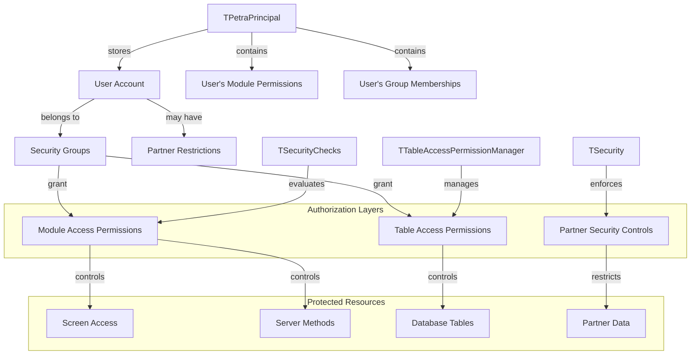
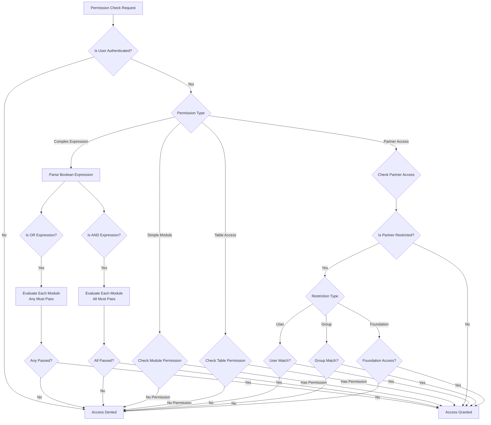
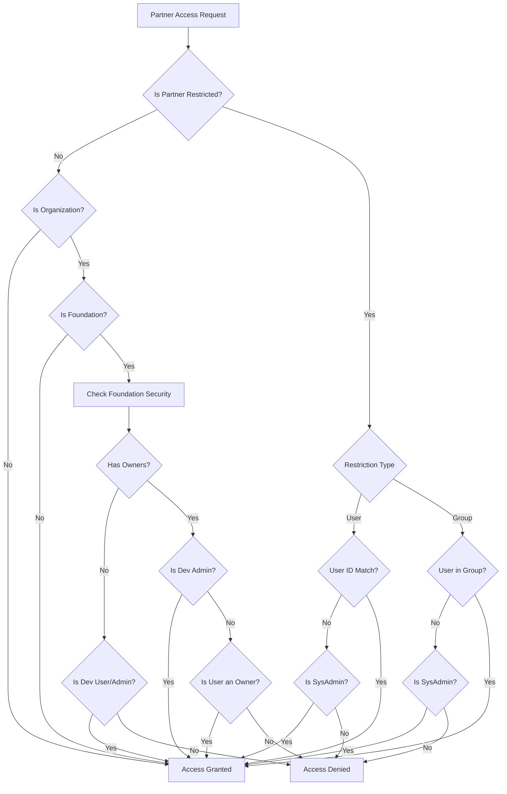
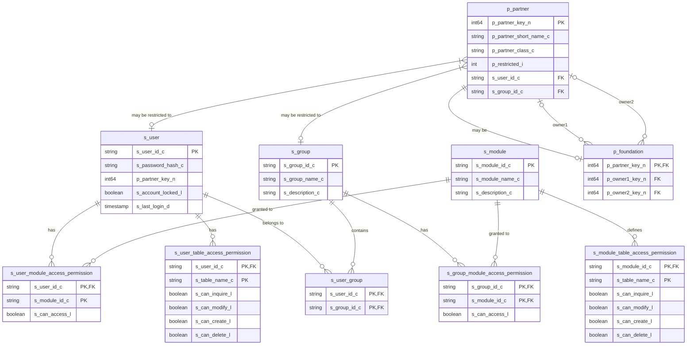

# Overview of OpenPetra's Authorization Framework

OpenPetra implements a comprehensive multi-layered authorization system that controls access to different parts of the application. The system is designed with several complementary layers that work together to enforce security at various levels:

1. **Module-based permissions** - Controls access to functional areas of the application
2. **Table access permissions** - Manages database-level access rights
3. **Method-level security** - Secures individual server methods using attributes
4. **Partner-specific security** - Implements specialized access controls for partner data
5. **UI navigation filtering** - Ensures users only see menu options they're authorized to access

The authorization framework uses a role-based access control model where permissions are assigned to users through security groups. This approach allows for centralized management of permissions while providing fine-grained control over what users can access.

## Authorization Architecture Layers



The diagram illustrates how OpenPetra's authorization architecture is structured. At the center is the user account, which is associated with security groups. These groups grant module access permissions and table access permissions. The TPetraPrincipal class maintains the user's security context, including their module permissions and group memberships. Different security components (TSecurityChecks, TTableAccessPermissionManager, and TSecurity) enforce the various authorization layers to protect different types of resources.

## Module-Based Access Control

OpenPetra implements module-based permissions through the `TModuleAccessManager` class, which controls access to specific functional areas of the application. This approach organizes permissions into logical modules like Finance, Partner Management, System Administration, etc.

The module access system works by:

1. Loading a user's permitted modules at login time
2. Storing these permissions in the user's security context (`TPetraPrincipal`)
3. Checking these permissions when accessing protected functionality

The `TModuleAccessManager` provides key methods:

- `LoadUserModules()` - Retrieves all modules a user has access to from the database
- `CheckUserPermissionsForMethod()` - Verifies if a user can access a specific server method
- `CheckUserPermissionsForTable()` - Controls data access permissions at the table level

Module permissions are defined as constants in `SharedConstants.cs` with prefixes like `PETRAMODULE_` (e.g., `PETRAMODULE_FINANCE1`, `PETRAMODULE_PTNRADMIN`, `PETRAMODULE_SYSADMIN`). These constants are used throughout the application to enforce consistent access control.

The system also supports ledger-specific permissions using a special format (`LEDGER` followed by a four-digit ledger number), allowing fine-grained control over financial data access.

## Table Access Permissions

OpenPetra implements granular database table access control through the `TTableAccessPermissionManager` class. This system defines permissions for database operations (read, create, modify, delete) on specific tables, providing fine-grained control over data access.

Table permissions are defined in configuration files like `s_module_table_access_permission.csv`, which maps modules to tables with specific permission flags. For example:

```
FINANCE-1,a_ap_supplier,1,1,1,1,?,?,?,?,?
FINANCE-1,a_ap_document,1,1,1,1,?,?,?,?,?
```

This indicates that users with the FINANCE-1 module permission can read, create, modify, and delete records in the `a_ap_supplier` and `a_ap_document` tables.

The permission system uses a binary approach where:
- `1` indicates a granted permission
- `?` indicates a configurable or inherited permission

The `TTableAccessPermissionManager` loads these permissions for a user from the database using the `LoadTableAccessPermissions()` method. The `TModuleAccessManager` then enforces these permissions through its `CheckUserPermissionsForTable()` method, which throws exceptions when access is denied.

The `TTablePermissionEnum` enumeration defines the types of permissions that can be checked:
- `eCanRead` - Permission to view records
- `eCanCreate` - Permission to create new records
- `eCanModify` - Permission to update existing records
- `eCanDelete` - Permission to delete records

This table-level security layer complements the module-based permissions, providing defense in depth for the application's data.

## Permission Evaluation Flow



The diagram illustrates how OpenPetra evaluates permission requests. When a permission check is initiated, the system first verifies if the user is authenticated. If not, access is immediately denied. For authenticated users, the system determines the type of permission being checked.

For module permissions, the system can handle both simple module checks and complex boolean expressions using AND/OR logic. With OR expressions, access is granted if the user has permission to any of the specified modules. With AND expressions, the user must have permission to all specified modules.

Table access permissions check if the user has the required rights (read, create, modify, delete) for the specified table. Partner access checks evaluate restrictions based on user identity, group membership, and foundation ownership.

This evaluation flow ensures that permissions are consistently enforced across the application, with appropriate handling for different security contexts.

## Method-Level Security with Attributes

OpenPetra uses the `RequireModulePermissionAttribute` to declaratively secure server methods. This attribute-based approach allows developers to specify the required permissions directly in the code, ensuring that permission checks are automatically enforced when methods are called.

The attribute is applied to server methods and specifies which module permissions are required to execute the method:

```csharp
[RequireModulePermission("FINANCE-1")]
public static bool SaveTransaction(...)
```

More complex permission requirements can be expressed using boolean logic:

```csharp
[RequireModulePermission("OR(FINANCE-3,PTNRADMIN)")]
public static DataTable GenerateReport(...)
```

When a client calls a server method, the `TModuleAccessManager.CheckUserPermissionsForMethod()` method uses reflection to:

1. Find the method being called
2. Extract the `RequireModulePermissionAttribute` from the method
3. Evaluate the permission expression against the user's assigned modules
4. Throw an exception if the user lacks the required permissions

This attribute-based approach provides several benefits:
- Centralizes permission logic in one place
- Makes security requirements explicit in the code
- Ensures consistent enforcement of permissions
- Reduces the risk of security holes from forgotten permission checks

The system also supports special permission values like "USER" (any authenticated user) and can check ledger-specific permissions when a ledger number is provided.

## Partner-Specific Security Controls

OpenPetra implements specialized security mechanisms for partner data through the `TSecurity` class. This system allows for fine-grained access control to partner records based on user identity, group membership, and foundation ownership.

Partner security is implemented with several restriction levels defined in `TPartnerAccessLevelEnum`:

1. `palGranted` - Unrestricted access
2. `palRestrictedToGroup` - Access limited to members of a specific group
3. `palRestrictedToUser` - Access limited to a specific user
4. `palRestrictedByFoundationOwnership` - Access controlled by foundation ownership rules

The partner security system uses the following constants to track restrictions:
- `PARTNER_RESTRICTED_TO_GROUP` (value 1)
- `PARTNER_RESTRICTED_TO_USER` (value 2)

The core method `CanAccessPartner()` evaluates if the current user can access a specific partner by:

1. Checking if the partner is restricted to a specific user
2. Checking if the partner is restricted to a group
3. For organization partners, checking if they are foundations and applying foundation-specific security rules

Foundation security has special handling, where:
- Development users/admins have broader access rights
- Foundation owners have access to their own foundations
- Access is controlled based on ownership relationships

When access is denied, the system throws an `ESecurityPartnerAccessDeniedException` with details about the denied access, including the partner key, partner name, and the type of restriction that prevented access.

This partner-specific security layer complements the module and table-based security, providing targeted protection for sensitive partner data.

## Partner Access Control Decision Tree



The diagram illustrates the decision process for partner access control in OpenPetra. When a user attempts to access a partner record, the system first checks if the partner has any restrictions. If not restricted, it then determines if the partner is an organization, and if so, whether it's a foundation requiring special handling.

For restricted partners, the system evaluates the type of restriction:
- If restricted to a specific user, access is granted only if the current user matches or is a system administrator
- If restricted to a group, access is granted only if the user belongs to that group or is a system administrator

For foundation organizations, the system applies additional checks:
- If the foundation has no owners, access is granted to development users/admins
- If the foundation has owners, access is granted to development admins or to users who are owners of the foundation

This decision tree ensures that partner data is protected according to the appropriate security rules, with special handling for different partner types and restriction scenarios.

## Navigation and UI Authorization

OpenPetra uses the `TUINavigation` class to filter navigation menu items based on user permissions. This ensures users only see menu options they're authorized to access, providing a clean and secure user interface experience.

The navigation system works by:

1. Loading the navigation structure from a YAML configuration file
2. Converting it to an XML representation
3. Filtering items based on the user's permissions
4. Transforming the filtered structure into a JSON-compatible dictionary for the client

Each navigation item in the configuration can specify required permissions using the `PermissionsRequired` attribute. The `HasAccessPermission()` method evaluates these permission requirements against the user's assigned modules.

The permission expressions support complex boolean logic:
- Simple module names (e.g., "FINANCE-1")
- Comma-separated lists (interpreted as AND conditions)
- Explicit AND/OR expressions (e.g., "AND(PTNRADMIN,DEVADMIN)")

When building the navigation structure, items that the user doesn't have permission to access are simply excluded from the result. This approach:
- Prevents users from seeing options they can't use
- Simplifies the UI by showing only relevant options
- Provides an additional layer of security beyond server-side checks

The navigation system also supports internationalization through label tokens and can dynamically check if HTML files exist for navigation items to determine their implementation status.

## Security Groups and User Management

Security groups play a central role in OpenPetra's authorization system, associating users with their permissions. The `TGroupManager` class manages these associations, providing functionality to retrieve user group assignments from the database.

Groups in OpenPetra are defined with constants like `PETRAGROUP_FINANCE1`, `PETRAGROUP_PTNRADMIN`, and `PETRAGROUP_SYSADMIN`. These groups are assigned specific module permissions, which are then inherited by users who belong to those groups.

The core functionality includes:

- `LoadUserGroups()` - Retrieves all groups associated with a specific user ID
- Group-based permission inheritance - Users receive permissions from all groups they belong to
- Centralized group management - Simplifies permission administration

When a user logs in, their group memberships are loaded and stored in the `TPetraPrincipal` object, which maintains the user's security context throughout their session. This principal object provides methods like `IsInGroup()` to check group membership and `IsInModule()` to verify module permissions.

The security group system offers several advantages:
- Simplified administration - Permissions can be managed at the group level rather than individually for each user
- Consistent permissions - Users with similar roles receive the same set of permissions
- Scalability - New users can quickly be granted appropriate access by assigning them to existing groups

This role-based approach to authorization is a fundamental aspect of OpenPetra's security architecture, providing a flexible and maintainable way to manage user permissions.

## Authorization Data Model



The diagram illustrates the database structure that supports OpenPetra's authorization system. At the center are the core entities:

1. **Users** (`s_user`) - Represents system users with authentication information
2. **Groups** (`s_group`) - Defines security groups that users can belong to
3. **Modules** (`s_module`) - Represents functional areas of the application

The relationships between these entities establish the permission structure:

- Users belong to groups through the `s_user_group` junction table
- Users have direct module access permissions through `s_user_module_access_permission`
- Groups have module access permissions through `s_group_module_access_permission`
- Modules define table access permissions through `s_module_table_access_permission`
- Users can have specific table access permissions through `s_user_table_access_permission`

The partner security model is represented by:

- Partners (`p_partner`) with restriction flags and potential user/group restrictions
- Foundations (`p_foundation`) with owner relationships to other partners

This data model provides the foundation for OpenPetra's multi-layered authorization system, storing all the necessary information to enforce security at various levels of the application.

[Generated by the Sage AI expert workbench: 2025-03-30 02:22:57  https://sage-tech.ai/workbench]: #