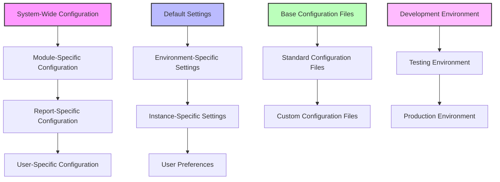
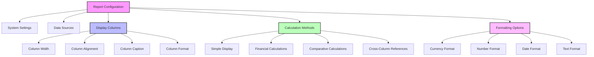
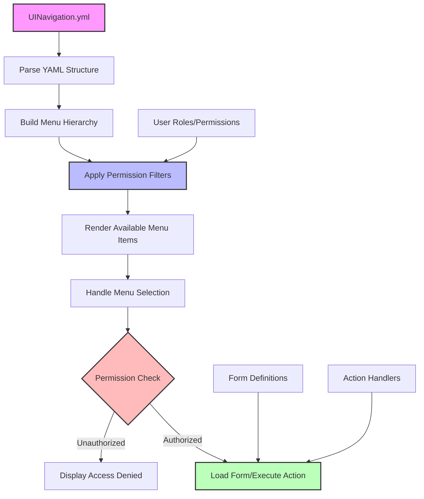
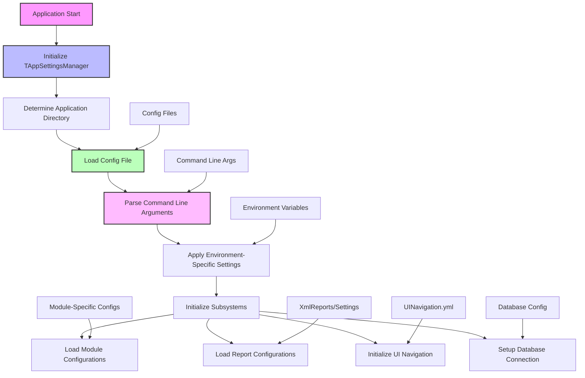

# OpenPetra's Configuration Infrastructure

## Introduction to OpenPetra's Configuration Infrastructure

OpenPetra's configuration infrastructure forms the backbone of this open-source administrative system for non-profit organizations. The configuration architecture is designed with flexibility and adaptability in mind, enabling the software to function effectively across diverse deployment environments while maintaining consistent behavior.

At its core, OpenPetra employs a multi-layered configuration approach that separates concerns between system-wide settings, module-specific configurations, user preferences, and report definitions. This separation allows different aspects of the system to be configured independently without affecting other components, making the system both robust and maintainable.

The configuration infrastructure serves several critical purposes:

1. **Environment Adaptation**: It allows OpenPetra to adapt to different operating environments (development, testing, production) and platforms (Windows, Linux).

2. **Feature Customization**: Organizations can tailor the system's behavior to match their specific operational needs without modifying source code.

3. **Report Definition**: Extensive report configuration enables precise control over data presentation and calculations.

4. **User Interface Personalization**: Configuration settings control navigation structure, form access, and permission-based features.

5. **System Integration**: Configuration files define how OpenPetra interacts with external systems, databases, and services.

The configuration system employs a hierarchical approach where more specific settings override general ones, allowing for both system-wide defaults and targeted customizations. This architecture enables OpenPetra to maintain a balance between standardization and flexibility, making it suitable for organizations of varying sizes and operational models.

## Configuration File Types and Organization

OpenPetra employs a diverse range of configuration file formats, each chosen to best suit its particular purpose within the system. This strategic approach to configuration management enables both human readability and machine efficiency across different aspects of the application.

### XML Configuration Files

XML is extensively used throughout OpenPetra for structured configuration data, particularly for report definitions and parameter settings. The system contains numerous XML files in the `XmlReports/Settings/` directory that define report parameters, column layouts, calculation methods, and display options. For example:

- Report parameter files like `standard.xml` define default settings for reports including column widths, calculation types, and formatting options
- These XML files follow a consistent structure with `<Parameters>` as the root element containing multiple `<Parameter>` entries with `id`, `value`, and sometimes column-specific attributes

XML's hierarchical nature makes it well-suited for representing complex report structures with nested elements and attributes, while still maintaining human readability for configuration management.

### YAML Configuration Files

YAML is used for more human-friendly configuration needs where readability and maintainability are paramount:

- `UINavigation.yml` defines the entire navigation structure of the application, including menu hierarchies, permissions, and form associations
- `DefaultMotivations.yml` configures standard categories for gifts and donations with their associated account codes
- `InterfacesUsingNamespaces.yml` manages namespace dependencies across different modules

YAML's clean, indentation-based syntax makes it particularly effective for representing hierarchical structures like menu systems and organizational relationships without the verbosity of XML.

### Specialized Configuration Files

Beyond standard formats, OpenPetra employs specialized configuration files for specific purposes:

- `uncrustify-petra.cfg` defines code formatting rules using a specialized syntax for the Uncrustify source code beautifier
- `namespace.map` uses a custom format to map namespace references to DLL file paths for dependency management
- Plain text configuration files like `version.txt` and `pkg_version.txt` store simple version information

### Configuration File Organization

OpenPetra organizes its configuration files according to their functional domains:

1. **System-Level Configuration**: Core settings that affect the entire application, typically stored in the root or `inc/cfg` directories

2. **Module-Specific Configuration**: Settings relevant to specific functional areas (Finance, Partner, etc.) organized in corresponding subdirectories

3. **Report Configuration**: Extensive report definitions stored in the `XmlReports/Settings` directory, further organized by module (Finance, Partner, Conference)

4. **Build and Deployment Configuration**: Files that control how the application is built, deployed, and integrated with third-party components

This organization creates a logical separation of concerns while maintaining a consistent approach to configuration management across the system.

## Configuration File Hierarchy

The configuration files in OpenPetra follow a hierarchical structure that determines how settings are loaded, overridden, and applied throughout the system. This hierarchy ensures that the right configuration takes precedence while maintaining sensible defaults.



The configuration hierarchy operates on multiple dimensions:

1. **Scope Hierarchy**: Configuration settings flow from system-wide defaults to increasingly specific contexts, with more targeted settings overriding broader ones. This allows for sensible defaults while enabling customization where needed.

2. **Environment Hierarchy**: Different settings apply depending on whether OpenPetra is running in development, testing, or production environments. The `TAppSettingsManager` class plays a crucial role in determining which settings to apply based on the current environment.

3. **File Type Hierarchy**: Configuration files are organized by their format and purpose, with specialized files for specific functions like report parameters, UI navigation, and code formatting.

4. **Loading Sequence**: The order in which configuration files are loaded determines precedence. Files loaded later can override settings from earlier files, allowing for customization without modifying base configurations.

The `TAppSettingsManager` class (from `CustomAppSettings.cs`) serves as the central coordinator for this hierarchy, providing methods to access configuration values with appropriate type conversion and fallback mechanisms. It handles special placeholders in configuration values and supports command-line overrides of config file settings.

This hierarchical approach enables OpenPetra to maintain consistency across deployments while allowing for the flexibility needed to adapt to different organizational requirements and operational environments.

## Report Configuration System

OpenPetra features an extensive report configuration framework that provides fine-grained control over data presentation, calculations, and formatting. This system is primarily implemented through XML configuration files located in the `XmlReports/Settings` directory, organized by functional modules such as Finance, Partner, and Conference.

The report configuration system is designed to separate the presentation logic from the underlying data sources, allowing reports to be customized without modifying code. Each report typically has a `standard.xml` file that defines its default parameters, which can be overridden for specific use cases.

### Core Components of Report Configuration

1. **Parameter Definitions**: Each report configuration file contains a set of parameters that control various aspects of the report:
   - Data sources (XML files that provide the underlying data structure)
   - Column definitions (width, alignment, calculation type)
   - Filtering criteria (date ranges, account codes, partner selection)
   - Formatting options (currency display, number formats)

2. **Calculation Types**: Reports can specify different calculation methods for each column, such as:
   - Simple data display (e.g., "Partner Name", "Transaction Narrative")
   - Financial calculations ("Actual Selected Year", "Budget Selected Year")
   - Comparative calculations ("Variance", "Variance %")
   - Year-to-date aggregations

3. **Column Configuration**: Each column in a report can be precisely configured with:
   - Width specifications (using both integer and decimal values)
   - Alignment settings (left, right, center)
   - Formatting rules (currency with/without decimals, date formats)
   - Caption text

4. **Data Filtering**: Reports include parameters for filtering the displayed data:
   - Date and period ranges
   - Account and cost center selections
   - Partner and entity filters
   - Status-based filtering

### Example from Income Expense Statement Configuration

The Income Expense Statement report configuration demonstrates the sophistication of this system:

```xml
<Parameter id="param_calculation" column="0" value="eString:Actual Selected Year" />
<Parameter id="param_ytd" column="0" value="eString:false" />
<Parameter id="param_calculation" column="1" value="eString:Budget Selected Year" />
<Parameter id="param_ytd" column="1" value="eString:false" />
<Parameter id="param_calculation" column="2" value="eString:Variance %" />
<Parameter id="param_ytd" column="2" value="eString:" />
<Parameter id="FirstColumn" column="2" value="eInteger:0" />
<Parameter id="SecondColumn" column="2" value="eInteger:1" />
```

This configuration defines three columns: actual figures, budgeted figures, and a percentage variance calculation that references the first two columns. The `param_ytd` parameter controls whether each column displays period-specific or year-to-date values.

The report configuration system provides a powerful yet flexible mechanism for creating and customizing reports to meet the diverse needs of non-profit organizations using OpenPetra, without requiring programming knowledge or source code modifications.

## Report Parameter Structure

The report parameter structure in OpenPetra provides a sophisticated framework for controlling how reports generate and display data. This structure is primarily implemented through XML configuration files that define parameters with specific attributes and relationships.



### Parameter Attributes and Types

Each parameter in a report configuration is defined with specific attributes:

1. **ID Attribute**: Identifies the parameter's purpose, such as:
   - `systemsettings`: Controls whether system-wide settings apply
   - `xmlfiles`: Specifies the XML data sources for the report
   - `param_calculation`: Defines calculation methods for columns
   - `ColumnWidth`: Sets the display width for specific columns

2. **Column Attribute**: Many parameters include a `column` attribute that associates the parameter with a specific column in the report, allowing for column-specific configurations.

3. **Value Types**: Parameters use a type-prefixed value format:
   - `eString`: Text values like "Base" or "CurrencyComplete"
   - `eBoolean`: True/false values
   - `eInteger`: Numeric values
   - `eDecimal`: Precise numeric values with decimal places
   - `eDateTime`: Date and time values

### Parameter Relationships

The report parameter structure includes sophisticated relationships between parameters:

1. **Column References**: Some calculation parameters reference other columns using attributes like `FirstColumn` and `SecondColumn`, enabling complex calculations based on multiple data points.

2. **Conditional Parameters**: Certain parameters control whether others are applied, creating conditional logic within the report configuration.

3. **Hierarchical Parameters**: Parameters can be organized hierarchically, with some controlling broad aspects of the report while others affect specific details.

### Example from Present Attendee Report

The Present Attendee Report configuration demonstrates this structure:

```xml
<Parameter id="param_calculation" column="0" value="eString:Partner Name" />
<Parameter id="ColumnWidth" column="0" value="eDecimal:4616752568008179712" />
<Parameter id="param_calculation" column="1" value="eString:Passport Number" />
<Parameter id="ColumnWidth" column="1" value="eInteger:3" />
```

This configuration defines two columns: one displaying partner names with a specific decimal width value, and another showing passport numbers with an integer width of 3 units.

The parameter structure provides a flexible yet powerful mechanism for controlling report generation and display, allowing OpenPetra to produce a wide variety of reports from the same underlying data sources with different presentations and calculations.

## User Interface Configuration

OpenPetra employs a sophisticated approach to user interface configuration that controls menu structure, form access, and permission-based features. This configuration is primarily managed through YAML files, particularly `UINavigation.yml`, which defines the entire navigation structure of the application.

### Navigation Structure Configuration

The `UINavigation.yml` file serves as the central definition for OpenPetra's menu system and navigation hierarchy. It organizes the application into logical modules and submodules, each with specific forms, actions, and permission requirements:

```yaml
OpenPetra:
    MainMenu:
        Home: {fa-icon=home}
            SelfService: {PermissionsRequired=PARTNERSELFSERVICE}
                MaintainPartnerSelfService: {Path=SelfService, fa-icon=user}
            Partners: {PermissionsRequired=PTNRUSER, Path=Partner/Partners}
                AddNewFamily: {Form=MaintainPartners, Action=NewFamily, fa-icon=user-plus}
                AddNewOrganisation: {Form=MaintainPartners, Action=NewOrganisation, fa-icon=folder-plus}
```

This hierarchical structure defines:

1. **Menu Hierarchy**: The nesting of elements creates the menu structure users see in the application
2. **Permission Requirements**: The `PermissionsRequired` attribute controls access based on user roles
3. **Form Associations**: The `Form` and `Action` attributes link menu items to specific application forms
4. **Visual Elements**: The `fa-icon` attribute specifies Font Awesome icons for visual representation

### Permission-Based Access Control

A key aspect of OpenPetra's UI configuration is its permission-based access control system. The `UINavigation.yml` file defines permission requirements for each menu item and form:

```yaml
Finance: {fa-icon=money-bill-alt, PermissionsRequired=FINANCE-1}
```

This configuration ensures that only users with appropriate permissions can access specific features. The system supports complex permission logic through operators like `OR()`:

```yaml
SponsorShip: {fa-icon=address-book, PermissionsRequired="OR(SPONSORVIEW,SPONSORADMIN)"}
```

### Form and Action Configuration

The UI configuration system links menu items to specific forms and actions:

```yaml
AddNewFamily: {Form=MaintainPartners, Action=NewFamily, fa-icon=user-plus}
```

This defines:
- The menu item label ("AddNewFamily")
- The form to open ("MaintainPartners")
- The action to execute ("NewFamily")
- The icon to display ("user-plus")

### Module Organization

OpenPetra's UI configuration organizes functionality into logical modules:

1. **Home**: Dashboard and quick access features
2. **Partner**: Contact management functionality
3. **Finance**: Financial operations and reporting
4. **SystemManager**: Administrative functions
5. **SponsorShip**: Sponsorship management features

Each module has its own section in the navigation configuration, with appropriate submenus and forms.

This comprehensive UI configuration approach allows OpenPetra to maintain a consistent user experience while enabling customization for different organizational needs and user roles. The separation of UI structure from application code makes it possible to modify the navigation and access control without changing the underlying functionality.

## Navigation Configuration Flow

The navigation configuration in OpenPetra follows a structured flow that determines how the `UINavigation.yml` file controls menu structure, permissions, and form access throughout the application.



### Configuration Loading Process

1. **YAML Parsing**: When OpenPetra starts, it loads and parses the `UINavigation.yml` file to extract the menu structure, permissions, and form associations.

2. **Menu Hierarchy Construction**: The system builds a hierarchical menu structure based on the nesting in the YAML file, creating main menu categories, subcategories, and menu items.

3. **Permission Integration**: Each menu item's `PermissionsRequired` attribute is processed to determine visibility based on the current user's roles and permissions.

4. **Menu Rendering**: The system renders only the menu items that the current user has permission to access, creating a personalized navigation experience.

### Menu Selection Flow

When a user selects a menu item:

1. **Permission Verification**: The system checks if the user has the required permissions for the selected item.

2. **Form Loading**: If authorized, the system loads the form specified in the `Form` attribute (e.g., `MaintainPartners`).

3. **Action Execution**: If an `Action` attribute is specified (e.g., `NewFamily`), the system executes that action on the loaded form.

4. **Path Navigation**: If a `Path` attribute is specified, the system navigates to that path in the application.

### Example Navigation Flow

For the menu item:
```yaml
AddNewFamily: {Form=MaintainPartners, Action=NewFamily, fa-icon=user-plus}
```

The flow would be:

1. User clicks "AddNewFamily" in the menu
2. System verifies user has permission to access this feature
3. System loads the "MaintainPartners" form
4. System executes the "NewFamily" action on that form
5. The form displays in "New Family" mode, ready for data entry

### Permission Evaluation

The navigation system supports complex permission logic:

```yaml
SponsorShip: {PermissionsRequired="OR(SPONSORVIEW,SPONSORADMIN)"}
```

This item would be accessible if the user has EITHER the SPONSORVIEW OR the SPONSORADMIN permission, demonstrating the flexible permission evaluation capabilities of the system.

This navigation configuration flow enables OpenPetra to provide a dynamic, permission-based user interface that adapts to different user roles while maintaining a consistent structure and behavior across the application.

## Application Settings Management

OpenPetra implements a comprehensive application settings management system through the `TAppSettingsManager` class, which provides a centralized mechanism for accessing configuration values from various sources. This class serves as the backbone of OpenPetra's configuration infrastructure, enabling consistent access to settings across the application.

### Core Functionality

The `TAppSettingsManager` class offers several key capabilities:

1. **Multiple Configuration Sources**: It can read settings from:
   - Configuration files (XML-based .config files)
   - Command-line parameters (which override file-based settings)
   - Environment variables
   - Default values when settings are not explicitly defined

2. **Type-Safe Access**: The class provides methods for retrieving settings with appropriate type conversion:
   - `GetValue()`: Returns settings as strings
   - `GetBoolean()`: Converts settings to boolean values
   - `GetInt32()`: Converts settings to integer values
   - `GetDouble()`: Converts settings to double-precision values

3. **Default Value Support**: When a setting is not found, methods can return specified default values instead of throwing exceptions.

4. **Path Resolution**: The class handles file paths with special placeholders and maintains application directory information.

### Thread Safety

The `TAppSettingsManager` employs the `ThreadStatic` attribute for its internal fields, ensuring that configuration settings are thread-safe:

```csharp
[ThreadStatic]
private static String FConfigFileName = "";

[ThreadStatic]
private static XmlElement FAppSettingsElement = null;

[ThreadStatic]
private static TCmdOpts FCmdOpts;
```

This approach ensures that multiple threads can access configuration settings simultaneously without interference.

### Application Directory Management

The class provides intelligent determination of the application directory with fallback mechanisms:

```csharp
public static string ApplicationDirectory
{
    get
    {
        // in ASP, the directory of the starting assembly is somewhere in a tmp directory, not our bin directory
        // therefore the option to define the ApplicationDirectory in the config file
        if (TAppSettingsManager.HasValue("ApplicationDirectory"))
        {
            return TAppSettingsManager.GetValue("ApplicationDirectory");
        }

        // If unit tests are running, then there is no Config File, and it is likely
        // that FApplicationDirectory is not defined...
        if (FApplicationDirectory == "")
        {
            // Default to the current running assemblies location
            FApplicationDirectory = System.IO.Path.GetDirectoryName(System.Reflection.Assembly.GetExecutingAssembly().GetName().CodeBase);
            // Now proceed to fix it....
        }
        
        // [Additional path normalization code]
        
        return FApplicationDirectory;
    }
}
```

This ensures that the application can locate its resources correctly across different deployment scenarios.

### Dynamic Configuration

The settings manager supports dynamic placeholder substitution in configuration values:

```csharp
// Supports dynamic placeholder substitution in configuration values
if (AValue.Contains("{") && AValue.Contains("}"))
{
    // [Placeholder substitution logic]
}
```

It also auto-detects instance names from directory structures for certain configuration parameters, enabling multi-instance deployments to share common configuration files while maintaining instance-specific settings.

The `TAppSettingsManager` class provides a robust foundation for OpenPetra's configuration management, enabling consistent access to settings while supporting the flexibility needed for different deployment scenarios and operational requirements.

## Code Style and Formatting Configuration

OpenPetra maintains consistent code quality through standardized formatting rules defined in configuration files, primarily through the `uncrustify-petra.cfg` file. This configuration ensures that all code in the project follows the same formatting conventions, making it more readable and maintainable.

### Uncrustify Configuration

The `uncrustify-petra.cfg` file contains detailed rules for code formatting using the Uncrustify source code beautifier. This configuration defines standards for:

1. **Indentation**: The file specifies a 4-space indentation standard:
   ```
   indent_columns=4
   indent_with_tabs=0
   ```

2. **Brace Placement**: Rules for where braces should be placed in different contexts:
   ```
   nl_if_brace=force
   nl_brace_else=force
   nl_elseif_brace=force
   nl_else_brace=force
   ```

3. **Spacing**: Detailed rules for spacing around operators, parentheses, and other elements:
   ```
   sp_arith=force
   sp_assign=force
   sp_enum_assign=force
   sp_bool=force
   sp_compare=force
   sp_inside_paren=remove
   ```

4. **Line Breaks**: Controls where line breaks should occur:
   ```
   nl_after_brace_open=true
   nl_after_func_body=2
   nl_max=3
   ```

5. **Comment Formatting**: Rules for formatting comments:
   ```
   cmt_width=250
   cmt_sp_before_star_cont=0
   cmt_sp_after_star_cont=0
   ```

### File Header Template

The configuration includes a reference to a template file for standard file headers:

```
cmt_insert_file_header=../template/src/EmptyFileComment.txt
```

This ensures that all source files include a consistent header with copyright information and license details.

### Code Width and Wrapping

The configuration sets standards for code width and line wrapping:

```
code_width=150
nl_max=3
```

These settings help maintain readable code even in complex sections by limiting line length and controlling the maximum number of consecutive blank lines.

### Operator Spacing

Detailed rules control spacing around different types of operators:

```
sp_arith=force       // Space around arithmetic operators: a + b
sp_assign=force      // Space around assignment: a = b
sp_bool=force        // Space around boolean operators: a || b
sp_compare=force     // Space around comparison: a == b
```

### Brace Style

The configuration enforces a consistent brace style throughout the codebase:

```
nl_if_brace=force
nl_brace_else=force
nl_for_brace=force
nl_while_brace=force
nl_do_brace=force
```

This creates a uniform appearance for control structures, making the code more predictable and easier to read.

By maintaining this detailed formatting configuration, OpenPetra ensures that all contributors follow the same code style conventions, resulting in a more cohesive and maintainable codebase. The use of automated formatting tools with this configuration also reduces the time spent on style discussions during code reviews, allowing developers to focus on functionality and correctness.

## System Constants and Default Values

OpenPetra employs a comprehensive system of constants and default values to maintain consistency across the application. These constants are primarily defined in specialized classes within the codebase, providing standardized references for various aspects of the system.

### Constants Organization

The constants are organized into domain-specific classes:

1. **MCommonConstants**: Defines constants used throughout the system, including:
   - Isolation levels for cacheable DataTables
   - Data type definitions for office-specific data labels
   - Form design codes and types
   - Import/export message strings

2. **MSysManConstants**: Contains user default constants for various modules:
   - General Petra settings
   - Partner management preferences
   - Finance reporting options

3. **FileVersion Constants**: Manages version information formats and comparison logic

### Data Type Constants

OpenPetra defines standard data types for office-specific data labels:

```csharp
public const String OFFICESPECIFIC_DATATYPE_CHAR = "char";
public const String OFFICESPECIFIC_DATATYPE_FLOAT = "float";
public const String OFFICESPECIFIC_DATATYPE_DATE = "date";
public const String OFFICESPECIFIC_DATATYPE_TIME = "time";
public const String OFFICESPECIFIC_DATATYPE_INTEGER = "integer";
public const String OFFICESPECIFIC_DATATYPE_CURRENCY = "currency";
public const String OFFICESPECIFIC_DATATYPE_BOOLEAN = "boolean";
public const String OFFICESPECIFIC_DATATYPE_PARTNERKEY = "partnerkey";
public const String OFFICESPECIFIC_DATATYPE_LOOKUP = "lookup";
```

These constants ensure consistent data type handling across different parts of the application.

### Form Design Constants

Constants for form design codes standardize document generation:

```csharp
public const String FORM_CODE_SYSTEM = "SYSTEM";
public const String FORM_CODE_PARTNER = "PARTNER";
public const String FORM_CODE_PERSONNEL = "PERSONNEL";
public const String FORM_CODE_CONFERENCE = "CONFERENCE";
public const String FORM_CODE_CHEQUE = "CHEQUE";
public const String FORM_CODE_RECEIPT = "RECEIPT";
public const String FORM_CODE_REMITTANCE = "REMITTANCE";
```

### User Preference Constants

Constants for user preferences enable consistent access to configuration values:

```csharp
public const String USERDEFAULT_UILANGUAGE = "UILanguage";
public const String USERDEFAULT_UICULTURE = "UICulture";
public const String USERDEFAULT_NUMBEROFRECENTPARTNERS = "NumberOfRecentPartners";
```

### Default Financial Motivations

The `DefaultMotivations.yml` file defines standard categories for gifts and donations:

```yaml
RootNodeInternal:
    GIFT:{desclocal=Standard Gifts}
        FIELD:{description=Field Gift, accountcode=0200}
        KEYMIN:{description=Key Ministry Gift, accountcode=0400}
        PERSONAL:{description=Gift for personal use, accountcode=0100}
        SUPPORT:{description=Support Gift, accountcode=0100}
        UNDESIG:{description=Undesignated Gift, accountcode=0300}
```

These predefined motivations ensure consistent financial categorization across the system.

### Text File Encoding Constants

The `TTextFileEncoding` class defines constants for handling various character encodings:

```csharp
private const string CLASS_UNICODE = "Unicode";
private const string CLASS_ANSI_SINGLE_BYTE = "ANSI_SB";
private const string CLASS_ANSI_MULTI_BYTE = "ANSI_MB";
```

### Benefits of Centralized Constants

This approach to system constants and default values provides several benefits:

1. **Consistency**: Using predefined constants ensures consistent values throughout the application
2. **Maintainability**: Changes to standard values only need to be made in one place
3. **Documentation**: The constant definitions serve as documentation for valid values
4. **Type Safety**: Using strongly-typed constants helps prevent errors from mistyped string literals

By centralizing these definitions, OpenPetra maintains a coherent system behavior while making it easier to understand and modify standard values when necessary.

## Configuration Loading Process

The configuration loading process in OpenPetra follows a structured flow that determines how settings are loaded, processed, and applied during application startup. This process ensures that the right configuration values are available to the application components that need them.



### Initial Configuration Loading

When OpenPetra starts, it follows these steps to load configuration:

1. **Application Directory Determination**: The system first determines the application directory, which serves as the base location for finding configuration files:

   ```csharp
   // If unit tests are running, then there is no Config File, and it is likely
   // that FApplicationDirectory is not defined...
   if (FApplicationDirectory == "")
   {
       // Default to the current running assemblies location
       FApplicationDirectory = System.IO.Path.GetDirectoryName(System.Reflection.Assembly.GetExecutingAssembly().GetName().CodeBase);
       // Now proceed to fix it....
   }
   ```

2. **Version Information Loading**: The system checks for version information from multiple sources:

   ```csharp
   if (File.Exists(BinPath + Path.DirectorySeparatorChar + "pkg_version.txt"))
   {
       // this will include the build number from the rpm package
       StreamReader srVersion = new StreamReader(BinPath + Path.DirectorySeparatorChar + "pkg_version.txt");
       Result = new TFileVersionInfo(srVersion.ReadLine());
       srVersion.Close();
   }
   else if (File.Exists(BinPath + Path.DirectorySeparatorChar + "version.txt"))
   {
       StreamReader srVersion = new StreamReader(BinPath + Path.DirectorySeparatorChar + "version.txt");
       Result = new TFileVersionInfo(srVersion.ReadLine());
       srVersion.Close();
   }
   ```

3. **Command Line Parameter Processing**: The system processes command line arguments, which can override file-based settings:

   ```csharp
   // Command line parameters override the values in the config file
   ```

4. **Configuration File Loading**: The system loads the main configuration file and extracts settings from it.

### Module-Specific Configuration Loading

After the core configuration is loaded, OpenPetra initializes various subsystems with their specific configurations:

1. **Database Connection Setup**: The system configures database connections based on settings.

2. **Report Configuration Loading**: Report definitions are loaded from the `XmlReports/Settings` directory:

   ```xml
   <Parameter id="xmlfiles" value="eString:Finance\\incomeexpensestatement.xml,Finance\\finance.xml,common.xml" />
   ```

3. **UI Navigation Loading**: The navigation structure is loaded from `UINavigation.yml`:

   ```yaml
   OpenPetra:
       MainMenu:
           Home: {fa-icon=home}
               Partners: {PermissionsRequired=PTNRUSER, Path=Partner/Partners}
   ```

### Configuration Value Resolution

When a component requests a configuration value, the `TAppSettingsManager` follows this resolution process:

1. Check if the value was provided as a command line argument
2. If not, check if it exists in the configuration file
3. If not, check if a default value was specified in the request
4. If not, return an undefined value or throw an exception

This process ensures that command line arguments take precedence over file-based settings, allowing for runtime configuration overrides.

### Dynamic Configuration Updates

Some parts of OpenPetra support dynamic configuration updates:

1. **User Preferences**: User-specific settings can be updated and persisted during runtime.

2. **Report Parameters**: Report configurations can be modified and saved for future use.

The configuration loading process in OpenPetra provides a flexible yet structured approach to managing settings across different deployment scenarios and operational requirements. By following a clear precedence order and supporting multiple configuration sources, the system can adapt to various environments while maintaining consistent behavior.

## Configuration Best Practices and Future Directions

### Current Best Practices

OpenPetra's configuration system has evolved several best practices that contribute to its flexibility and maintainability:

1. **Separation of Concerns**: Configuration is separated by functional domain (reports, UI navigation, system settings), making it easier to manage and understand.

2. **Type-Safe Configuration Access**: The `TAppSettingsManager` provides type-specific methods (`GetBoolean()`, `GetInt32()`) that handle conversion and validation.

3. **Hierarchical Override System**: Configuration follows a clear precedence order (command line > config file > defaults), allowing for flexible customization without modifying base files.

4. **Standardized Constants**: Using centralized constant definitions ensures consistency across the application and serves as documentation.

5. **Environment-Aware Configuration**: The system adapts to different environments (development, testing, production) with appropriate settings for each.

6. **Thread-Safe Design**: Configuration components use thread-safe approaches like the `ThreadStatic` attribute to support multi-threaded access.

7. **Modular Report Configuration**: Report definitions use a parameter-based approach that separates presentation from data access.

### Areas for Improvement

Despite these strengths, several areas could benefit from improvement:

1. **Configuration Documentation**: Many configuration parameters lack comprehensive documentation, making it challenging for administrators to understand their purpose and valid values.

2. **Validation Framework**: The system would benefit from a more robust validation framework to catch configuration errors early.

3. **Configuration UI**: Most configuration requires direct file editing; a user-friendly configuration interface would improve usability.

4. **Centralized Management**: Configuration files are scattered across different directories; a more centralized approach would simplify management.

5. **Version Control**: Better tracking of configuration changes between versions would help with upgrades and migrations.

### Future Directions

Looking forward, several enhancements could further strengthen OpenPetra's configuration infrastructure:

1. **Configuration as Code**: Adopting a more programmatic approach to configuration would enable validation, type safety, and better tooling support.

2. **Cloud-Ready Configuration**: Supporting cloud-native configuration patterns like environment variables and external configuration services would enhance deployment flexibility.

3. **Dynamic Reconfiguration**: Expanding support for runtime configuration changes without application restarts would improve operational flexibility.

4. **Configuration Templates**: Providing templates for common deployment scenarios would simplify initial setup and customization.

5. **Configuration Migration Tools**: Developing tools to assist with migrating configurations between versions would smooth the upgrade process.

6. **Enhanced Security**: Implementing better protection for sensitive configuration values (encryption, secure storage) would improve security posture.

7. **Internationalization of Configuration**: Supporting localized configuration interfaces would make the system more accessible to global users.

8. **Configuration Monitoring**: Adding capabilities to track and alert on configuration changes would enhance operational visibility.

By addressing these areas and adopting these future directions, OpenPetra can continue to evolve its configuration infrastructure to meet the changing needs of non-profit organizations while maintaining its core strengths of flexibility and reliability.

[Generated by the Sage AI expert workbench: 2025-03-30 02:22:57  https://sage-tech.ai/workbench]: #